# 数据访问层设计

<cite>
**本文引用的文件**
- [MybatisPlusConfig.java](file://monkey-service/src/main/java/com/monkey/general/config/MybatisPlusConfig.java)
- [MyMetaObjectHandler.java](file://monkey-service/src/main/java/com/monkey/general/handler/MyMetaObjectHandler.java)
- [PageUtils.java](file://monkey-service/src/main/java/com/monkey/general/common/utils/PageUtils.java)
- [Query.java](file://monkey-service/src/main/java/com/monkey/general/common/utils/Query.java)
- [UserMapper.java](file://monkey-service/src/main/java/com/monkey/general/modules/sys/mapper/UserMapper.java)
- [User.java](file://monkey-service/src/main/java/com/monkey/general/modules/sys/entity/User.java)
- [UserServiceImpl.java](file://monkey-service/src/main/java/com/monkey/general/modules/sys/service/impl/UserServiceImpl.java)
- [UserMapper.xml](file://monkey-service/src/main/resources/mapper/sys/UserMapper.xml)
- [MybatisPlusConfig.java](file://monkey-monitor/src/main/java/com/monkey/general/config/MybatisPlusConfig.java)
</cite>

## 目录
1. [引言](#引言)
2. [项目结构](#项目结构)
3. [核心组件](#核心组件)
4. [架构总览](#架构总览)
5. [详细组件分析](#详细组件分析)
6. [依赖分析](#依赖分析)
7. [性能考虑](#性能考虑)
8. [故障排查指南](#故障排查指南)
9. [结论](#结论)
10. [附录](#附录)

## 引言
本设计文档面向安威 fireworks 物联网监控平台的数据访问层，聚焦于 MyBatis Plus 在本项目中的配置与使用方式，涵盖以下主题：
- 实体类设计与注解使用
- Mapper 接口定义与 XML 映射文件结构
- 通用 Service 与 ServiceImpl 的 CRUD 封装与批量操作
- 分页查询实现机制（含 Query 工具类与 PageUtils）
- 数据自动填充（MyMetaObjectHandler）与审计字段设置
- 事务管理策略与异常处理机制
- 批量插入、更新、删除的优化策略
- 复杂查询的 SQL 构建与动态条件组装
- 缓存策略与查询性能优化建议

## 项目结构
数据访问层主要分布在两个模块中：
- monkey-service：提供通用的 MyBatis Plus 配置、元对象处理器、分页工具与查询工具，以及系统模块（sys）的实体、Mapper、XML 与 Service 实现。
- monkey-monitor：提供额外的类型处理器注册与分页插件配置。

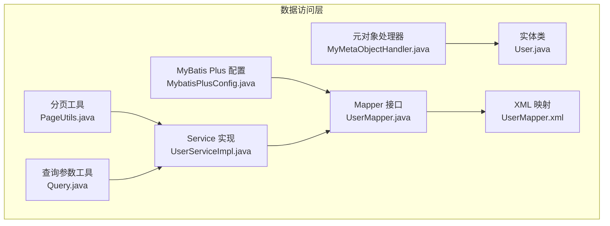

图表来源
- [MybatisPlusConfig.java:1-24](file://monkey-service/src/main/java/com/monkey/general/config/MybatisPlusConfig.java#L1-L24)
- [MyMetaObjectHandler.java:1-41](file://monkey-service/src/main/java/com/monkey/general/handler/MyMetaObjectHandler.java#L1-L41)
- [PageUtils.java:1-103](file://monkey-service/src/main/java/com/monkey/general/common/utils/PageUtils.java#L1-L103)
- [Query.java:1-72](file://monkey-service/src/main/java/com/monkey/general/common/utils/Query.java#L1-L72)
- [User.java:1-127](file://monkey-service/src/main/java/com/monkey/general/modules/sys/entity/User.java#L1-L127)
- [UserMapper.java:1-40](file://monkey-service/src/main/java/com/monkey/general/modules/sys/mapper/UserMapper.java#L1-L40)
- [UserMapper.xml:1-42](file://monkey-service/src/main/resources/mapper/sys/UserMapper.xml#L1-L42)
- [UserServiceImpl.java:1-159](file://monkey-service/src/main/java/com/monkey/general/modules/sys/service/impl/UserServiceImpl.java#L1-L159)

章节来源
- [MybatisPlusConfig.java:1-24](file://monkey-service/src/main/java/com/monkey/general/config/MybatisPlusConfig.java#L1-L24)
- [MybatisPlusConfig.java:1-22](file://monkey-monitor/src/main/java/com/monkey/general/config/MybatisPlusConfig.java#L1-L22)

## 核心组件
- MyBatis Plus 配置：在服务模块中启用分页插件；在监控模块中注册数组类型处理器并启用分页插件。
- 元对象处理器：统一处理新增与更新时的审计字段填充。
- 分页工具与查询参数工具：封装分页参数解析、排序字段安全过滤与默认排序策略。
- 实体类与注解：使用表映射注解、字段填充策略与校验注解。
- Mapper 接口与 XML：基于 BaseMapper 提供通用 CRUD，同时扩展自定义 SQL。
- Service 层：继承通用 ServiceImpl，封装业务逻辑、事务与批量操作。

章节来源
- [MybatisPlusConfig.java:1-24](file://monkey-service/src/main/java/com/monkey/general/config/MybatisPlusConfig.java#L1-L24)
- [MyMetaObjectHandler.java:1-41](file://monkey-service/src/main/java/com/monkey/general/handler/MyMetaObjectHandler.java#L1-L41)
- [PageUtils.java:1-103](file://monkey-service/src/main/java/com/monkey/general/common/utils/PageUtils.java#L1-L103)
- [Query.java:1-72](file://monkey-service/src/main/java/com/monkey/general/common/utils/Query.java#L1-L72)
- [User.java:1-127](file://monkey-service/src/main/java/com/monkey/general/modules/sys/entity/User.java#L1-L127)
- [UserMapper.java:1-40](file://monkey-service/src/main/java/com/monkey/general/modules/sys/mapper/UserMapper.java#L1-L40)
- [UserMapper.xml:1-42](file://monkey-service/src/main/resources/mapper/sys/UserMapper.xml#L1-L42)
- [UserServiceImpl.java:1-159](file://monkey-service/src/main/java/com/monkey/general/modules/sys/service/impl/UserServiceImpl.java#L1-L159)

## 架构总览
下图展示了从控制器到数据访问层的整体调用链与职责划分：

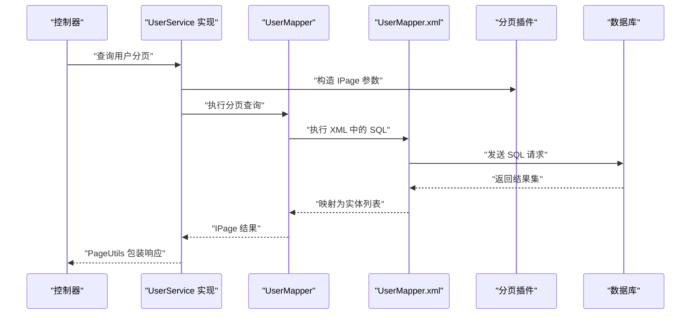

图表来源
- [UserServiceImpl.java:40-53](file://monkey-service/src/main/java/com/monkey/general/modules/sys/service/impl/UserServiceImpl.java#L40-L53)
- [Query.java:18-70](file://monkey-service/src/main/java/com/monkey/general/common/utils/Query.java#L18-L70)
- [UserMapper.java:1-40](file://monkey-service/src/main/java/com/monkey/general/modules/sys/mapper/UserMapper.java#L1-L40)
- [UserMapper.xml:1-42](file://monkey-service/src/main/resources/mapper/sys/UserMapper.xml#L1-L42)
- [MybatisPlusConfig.java:18-21](file://monkey-service/src/main/java/com/monkey/general/config/MybatisPlusConfig.java#L18-L21)

## 详细组件分析

### MyBatis Plus 配置
- 服务模块配置：启用分页插件，为所有分页场景提供支持。
- 监控模块配置：注册整型数组类型处理器，使数据库数组类型与 Java 数组可互转；同时启用分页插件。

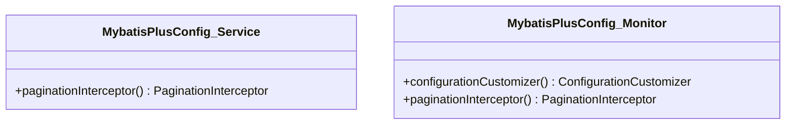

图表来源
- [MybatisPlusConfig.java:1-24](file://monkey-service/src/main/java/com/monkey/general/config/MybatisPlusConfig.java#L1-L24)
- [MybatisPlusConfig.java:1-22](file://monkey-monitor/src/main/java/com/monkey/general/config/MybatisPlusConfig.java#L1-L22)

章节来源
- [MybatisPlusConfig.java:1-24](file://monkey-service/src/main/java/com/monkey/general/config/MybatisPlusConfig.java#L1-L24)
- [MybatisPlusConfig.java:1-22](file://monkey-monitor/src/main/java/com/monkey/general/config/MybatisPlusConfig.java#L1-L22)

### 元对象处理器与审计字段填充
- 新增填充：当实体存在创建时间字段时，自动写入当前时间。
- 更新填充：当实体存在更新时间字段时，自动写入当前时间。
- 适用范围：所有继承通用 Service 的实体均可受益于该填充策略。

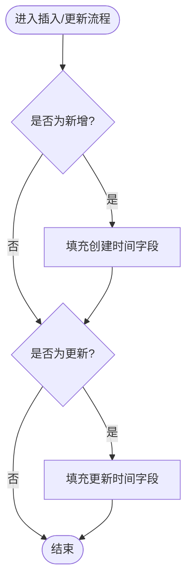

图表来源
- [MyMetaObjectHandler.java:21-39](file://monkey-service/src/main/java/com/monkey/general/handler/MyMetaObjectHandler.java#L21-L39)

章节来源
- [MyMetaObjectHandler.java:1-41](file://monkey-service/src/main/java/com/monkey/general/handler/MyMetaObjectHandler.java#L1-L41)

### 实体类设计与注解使用
- 表映射：通过表名注解指定持久化表。
- 主键策略：使用注解标识主键。
- 字段填充：通过字段填充策略在插入/更新时自动赋值。
- 校验注解：结合分组校验确保参数合法性。
- 扩展字段：使用不存在于表的字段承载业务展示或临时计算。

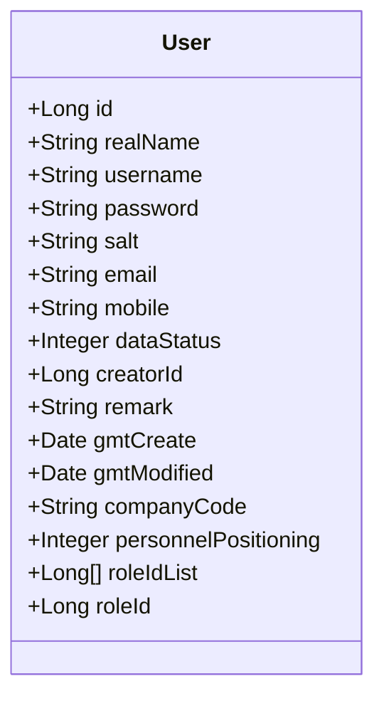

图表来源
- [User.java:24-126](file://monkey-service/src/main/java/com/monkey/general/modules/sys/entity/User.java#L24-L126)

章节来源
- [User.java:1-127](file://monkey-service/src/main/java/com/monkey/general/modules/sys/entity/User.java#L1-L127)

### Mapper 接口与 XML 映射
- 继承 BaseMapper：获得通用 CRUD 能力。
- 自定义方法：在接口中声明业务方法，在 XML 中编写对应 SQL。
- 动态 SQL：使用循环标签实现 IN 条件等动态拼接。
- 关联查询：通过 JOIN 查询用户权限、菜单 ID 等。

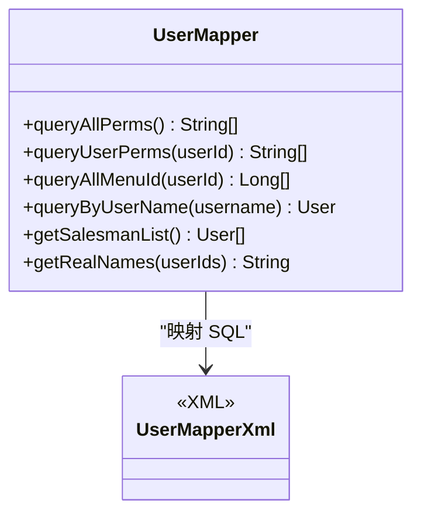

图表来源
- [UserMapper.java:13-39](file://monkey-service/src/main/java/com/monkey/general/modules/sys/mapper/UserMapper.java#L13-L39)
- [UserMapper.xml:6-40](file://monkey-service/src/main/resources/mapper/sys/UserMapper.xml#L6-L40)

章节来源
- [UserMapper.java:1-40](file://monkey-service/src/main/java/com/monkey/general/modules/sys/mapper/UserMapper.java#L1-L40)
- [UserMapper.xml:1-42](file://monkey-service/src/main/resources/mapper/sys/UserMapper.xml#L1-L42)

### 通用 Service 与 ServiceImpl 设计
- 继承通用实现：通过继承通用 ServiceImpl，快速获得分页、条件构造器等能力。
- 业务封装：在 ServiceImpl 中组合 Mapper 与其它 Service，完成复杂业务。
- 事务控制：对涉及多表或跨模块的操作使用注解式事务。
- 批量操作：基于通用方法实现批量删除、批量更新等。

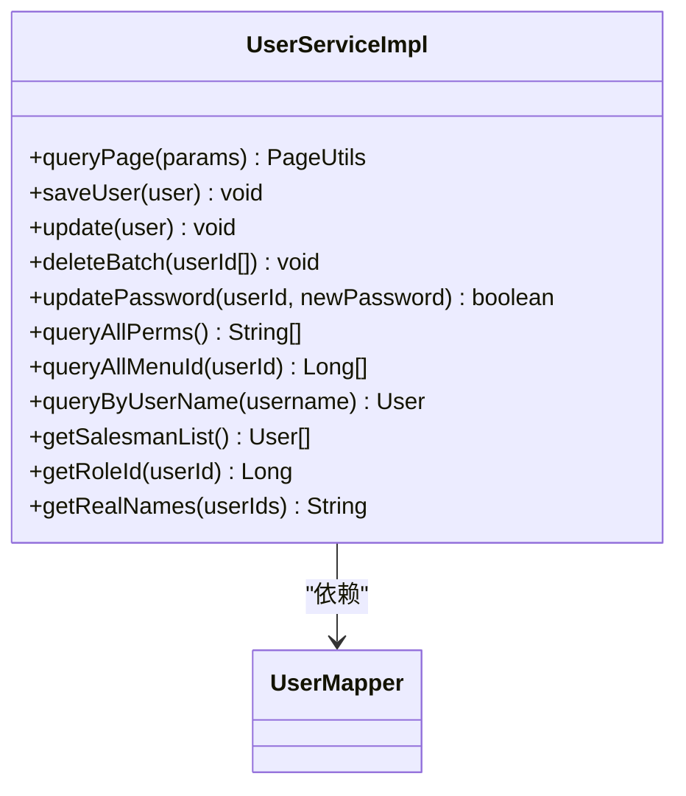

图表来源
- [UserServiceImpl.java:34-159](file://monkey-service/src/main/java/com/monkey/general/modules/sys/service/impl/UserServiceImpl.java#L34-L159)
- [UserMapper.java:13-39](file://monkey-service/src/main/java/com/monkey/general/modules/sys/mapper/UserMapper.java#L13-L39)

章节来源
- [UserServiceImpl.java:1-159](file://monkey-service/src/main/java/com/monkey/general/modules/sys/service/impl/UserServiceImpl.java#L1-L159)

### 分页查询实现机制
- Query 工具类：解析请求参数，构造 IPage 对象；支持排序字段的安全过滤与默认排序。
- PageUtils：将 IPage 结果转换为对外统一的分页响应模型。
- 使用流程：Controller 调用 Service，Service 使用 Query 构造分页条件，Mapper 执行查询，最终由 PageUtils 包装返回。

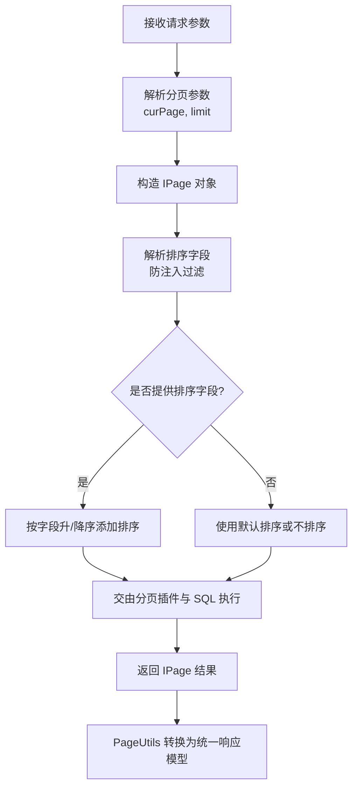

图表来源
- [Query.java:18-70](file://monkey-service/src/main/java/com/monkey/general/common/utils/Query.java#L18-L70)
- [PageUtils.java:54-60](file://monkey-service/src/main/java/com/monkey/general/common/utils/PageUtils.java#L54-L60)

章节来源
- [Query.java:1-72](file://monkey-service/src/main/java/com/monkey/general/common/utils/Query.java#L1-L72)
- [PageUtils.java:1-103](file://monkey-service/src/main/java/com/monkey/general/common/utils/PageUtils.java#L1-L103)

### 复杂查询与动态条件组装
- 条件构造器：在 Service 中使用条件构造器拼装动态查询条件（如模糊匹配、相等、IN 等）。
- XML 动态 SQL：在 XML 中使用循环标签实现 IN 条件、多表关联查询等。
- 示例：用户分页查询根据用户名与创建者 ID 进行动态拼接；权限查询通过 JOIN 获取用户权限集合。

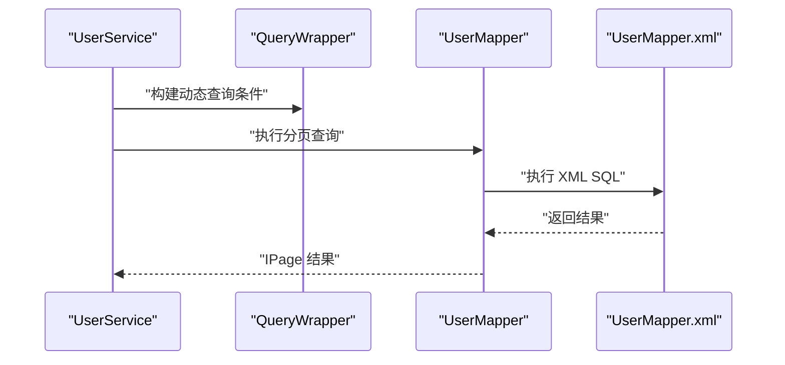

图表来源
- [UserServiceImpl.java:45-50](file://monkey-service/src/main/java/com/monkey/general/modules/sys/service/impl/UserServiceImpl.java#L45-L50)
- [UserMapper.xml:10-23](file://monkey-service/src/main/resources/mapper/sys/UserMapper.xml#L10-L23)

章节来源
- [UserServiceImpl.java:40-53](file://monkey-service/src/main/java/com/monkey/general/modules/sys/service/impl/UserServiceImpl.java#L40-L53)
- [UserMapper.xml:1-42](file://monkey-service/src/main/resources/mapper/sys/UserMapper.xml#L1-L42)

### 事务管理与异常处理
- 事务策略：对涉及保存用户与角色关系等跨表操作使用注解式事务，保证一致性。
- 异常处理：在业务校验失败时抛出自定义异常，便于上层统一处理与响应。

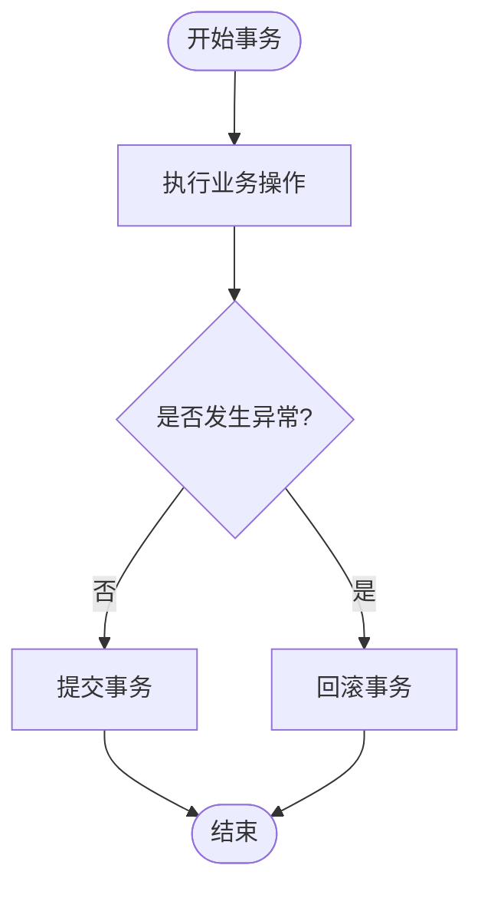

图表来源
- [UserServiceImpl.java:71-95](file://monkey-service/src/main/java/com/monkey/general/modules/sys/service/impl/UserServiceImpl.java#L71-L95)

章节来源
- [UserServiceImpl.java:70-95](file://monkey-service/src/main/java/com/monkey/general/modules/sys/service/impl/UserServiceImpl.java#L70-L95)

### 批量操作优化策略
- 批量删除：基于通用方法一次性删除多个 ID，减少多次往返。
- 批量更新：通过条件更新实现批量字段变更。
- 批量插入：建议使用批量写入或数据库方言支持的批量语法以提升吞吐。

章节来源
- [UserServiceImpl.java:98-103](file://monkey-service/src/main/java/com/monkey/general/modules/sys/service/impl/UserServiceImpl.java#L98-L103)

## 依赖分析
- 配置依赖：分页插件作为全局拦截器参与所有分页查询。
- 类型处理器：监控模块注册数组类型处理器，避免数组字段序列化/反序列化问题。
- 注入关系：ServiceImpl 依赖 Mapper，Mapper 依赖 XML 中的 SQL 定义。

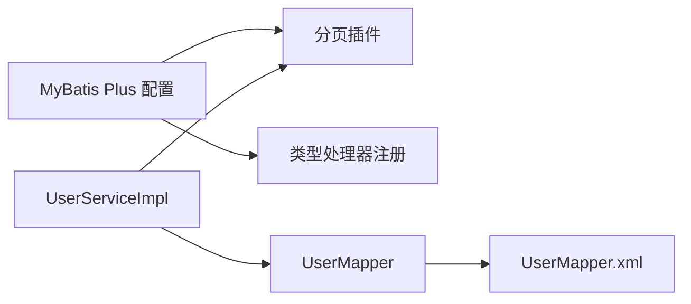

图表来源
- [MybatisPlusConfig.java:12-19](file://monkey-monitor/src/main/java/com/monkey/general/config/MybatisPlusConfig.java#L12-L19)
- [UserServiceImpl.java:34-34](file://monkey-service/src/main/java/com/monkey/general/modules/sys/service/impl/UserServiceImpl.java#L34-L34)
- [UserMapper.java:13-13](file://monkey-service/src/main/java/com/monkey/general/modules/sys/mapper/UserMapper.java#L13-L13)
- [UserMapper.xml:1-1](file://monkey-service/src/main/resources/mapper/sys/UserMapper.xml#L1-L1)

章节来源
- [MybatisPlusConfig.java:1-22](file://monkey-monitor/src/main/java/com/monkey/general/config/MybatisPlusConfig.java#L1-L22)
- [UserServiceImpl.java:1-159](file://monkey-service/src/main/java/com/monkey/general/modules/sys/service/impl/UserServiceImpl.java#L1-L159)
- [UserMapper.java:1-40](file://monkey-service/src/main/java/com/monkey/general/modules/sys/mapper/UserMapper.java#L1-L40)
- [UserMapper.xml:1-42](file://monkey-service/src/main/resources/mapper/sys/UserMapper.xml#L1-L42)

## 性能考虑
- 合理分页：避免超大偏移量导致的性能问题，优先使用索引列进行排序与过滤。
- 动态 SQL：尽量减少字符串拼接，使用框架提供的条件构造器与 XML 动态标签。
- 审计字段：统一使用元对象处理器自动填充，避免业务代码重复赋值。
- 批量操作：批量插入/更新/删除时注意数据库方言与驱动支持，必要时调整批大小。
- 缓存策略：对于高频读取且变化较少的数据，可在 Service 层引入缓存（如 Redis），并结合失效策略降低数据库压力。

## 故障排查指南
- 分页无效：确认分页插件已正确注册，且请求参数包含正确的分页字段。
- 排序异常：检查排序字段是否被 SQL 注入过滤器拦截，确保传入字段合法。
- 审计字段为空：确认实体类字段注解与元对象处理器命名一致，且实体确实包含相应字段。
- 批量删除失败：检查传入 ID 列表是否为空或格式错误，关注数据库外键约束。
- 自定义 SQL 报错：核对 XML 中动态标签的语法与参数绑定，确保集合参数名称与调用处一致。

章节来源
- [Query.java:44-55](file://monkey-service/src/main/java/com/monkey/general/common/utils/Query.java#L44-L55)
- [MyMetaObjectHandler.java:21-39](file://monkey-service/src/main/java/com/monkey/general/handler/MyMetaObjectHandler.java#L21-L39)
- [UserMapper.xml:37-40](file://monkey-service/src/main/resources/mapper/sys/UserMapper.xml#L37-L40)

## 结论
本数据访问层通过 MyBatis Plus 的通用能力与扩展配置，实现了：
- 统一的分页与排序机制
- 自动化的审计字段填充
- 清晰的实体与 Mapper 设计
- 可维护的 Service 业务封装
- 可扩展的动态 SQL 与批量操作策略

这些设计共同保障了系统的可扩展性与可维护性，并为后续功能迭代提供了良好的基础。

## 附录
- 常用工具类与配置位置参考：
  - 分页配置：[MybatisPlusConfig.java:18-21](file://monkey-service/src/main/java/com/monkey/general/config/MybatisPlusConfig.java#L18-L21)
  - 元对象处理器：[MyMetaObjectHandler.java:21-39](file://monkey-service/src/main/java/com/monkey/general/handler/MyMetaObjectHandler.java#L21-L39)
  - 分页工具：[PageUtils.java:54-60](file://monkey-service/src/main/java/com/monkey/general/common/utils/PageUtils.java#L54-L60)
  - 查询参数工具：[Query.java:18-70](file://monkey-service/src/main/java/com/monkey/general/common/utils/Query.java#L18-L70)
  - 实体类示例：[User.java:24-126](file://monkey-service/src/main/java/com/monkey/general/modules/sys/entity/User.java#L24-L126)
  - Mapper 接口示例：[UserMapper.java:13-39](file://monkey-service/src/main/java/com/monkey/general/modules/sys/mapper/UserMapper.java#L13-L39)
  - XML 映射示例：[UserMapper.xml:6-40](file://monkey-service/src/main/resources/mapper/sys/UserMapper.xml#L6-L40)
  - Service 实现示例：[UserServiceImpl.java:40-53](file://monkey-service/src/main/java/com/monkey/general/modules/sys/service/impl/UserServiceImpl.java#L40-L53)