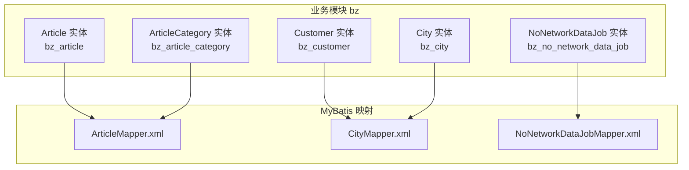
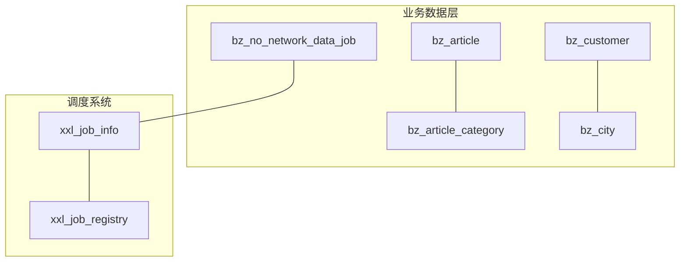
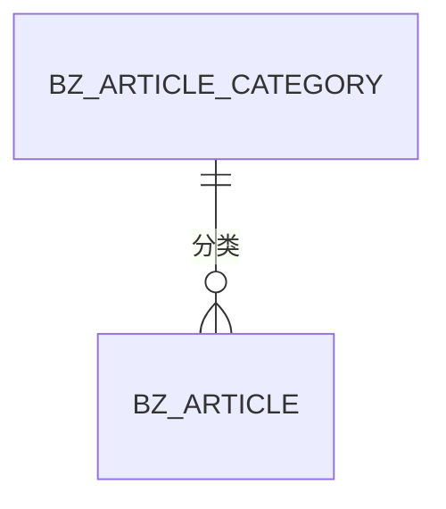
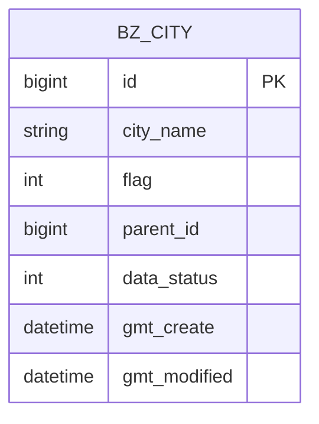
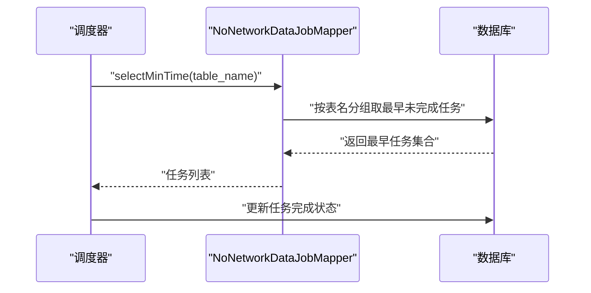
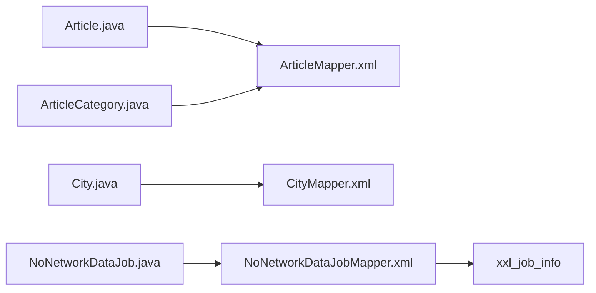

# 业务数据表设计

<cite>
**本文引用的文件**   
- [Article.java](file://monkey-service/src/main/java/com/monkey/general/modules/bz/entity/Article.java)
- [ArticleCategory.java](file://monkey-service/src/main/java/com/monkey/general/modules/bz/entity/ArticleCategory.java)
- [Customer.java](file://monkey-service/src/main/java/com/monkey/general/modules/bz/entity/Customer.java)
- [City.java](file://monkey-service/src/main/java/com/monkey/general/modules/bz/entity/City.java)
- [NoNetworkDataJob.java](file://monkey-service/src/main/java/com/monkey/general/modules/bz/entity/NoNetworkDataJob.java)
- [ArticleMapper.xml](file://monkey-service/src/main/resources/mapper/bz/ArticleMapper.xml)
- [CityMapper.xml](file://monkey-service/src/main/resources/mapper/bz/CityMapper.xml)
- [NoNetworkDataJobMapper.xml](file://monkey-service/src/main/resources/mapper/bz/NoNetworkDataJobMapper.xml)
- [init.sql](file://deploy/init/init.sql)
</cite>

## 目录
1. [简介](#简介)
2. [项目结构](#项目结构)
3. [核心组件](#核心组件)
4. [架构总览](#架构总览)
5. [详细组件分析](#详细组件分析)
6. [依赖分析](#依赖分析)
7. [性能考虑](#性能考虑)
8. [故障排查指南](#故障排查指南)
9. [结论](#结论)
10. [附录](#附录)

## 简介
本文件面向安威 fireworks 物联网监控平台，聚焦于业务数据表设计与实现，覆盖以下主题：
- 文章信息表（article）
- 文章分类表（article_category）
- 客户信息表（customer）
- 城市信息表（city）
- 无网络数据作业表（no_network_data_job）

文档从表结构、字段定义、约束与索引策略入手，结合现有实体类与Mapper映射，梳理业务规则（如文章审核流程、客户等级管理、数据同步机制），并给出版本控制与历史变更追踪的建议。最后提供典型业务场景的查询与统计思路及性能优化建议。

## 项目结构
围绕业务数据表，后端采用 MyBatis-Plus + MyBatis XML 映射的方式进行持久化访问。核心实体类位于模块 bz 下，对应表名通过注解声明；Mapper XML 文件位于 resources/mapper/bz 目录下，提供分页与视图查询能力。

图表来源
- [Article.java:19-68](file://monkey-service/src/main/java/com/monkey/general/modules/bz/entity/Article.java#L19-L68)
- [ArticleCategory.java:19-53](file://monkey-service/src/main/java/com/monkey/general/modules/bz/entity/ArticleCategory.java#L19-L53)
- [Customer.java:19-124](file://monkey-service/src/main/java/com/monkey/general/modules/bz/entity/Customer.java#L19-L124)
- [City.java:21-82](file://monkey-service/src/main/java/com/monkey/general/modules/bz/entity/City.java#L21-L82)
- [NoNetworkDataJob.java:21-76](file://monkey-service/src/main/java/com/monkey/general/modules/bz/entity/NoNetworkDataJob.java#L21-L76)
- [ArticleMapper.xml:4-11](file://monkey-service/src/main/resources/mapper/bz/ArticleMapper.xml#L4-L11)
- [CityMapper.xml:4-10](file://monkey-service/src/main/resources/mapper/bz/CityMapper.xml#L4-L10)
- [NoNetworkDataJobMapper.xml:4-21](file://monkey-service/src/main/resources/mapper/bz/NoNetworkDataJobMapper.xml#L4-L21)

章节来源
- [Article.java:19-68](file://monkey-service/src/main/java/com/monkey/general/modules/bz/entity/Article.java#L19-L68)
- [ArticleCategory.java:19-53](file://monkey-service/src/main/java/com/monkey/general/modules/bz/entity/ArticleCategory.java#L19-L53)
- [Customer.java:19-124](file://monkey-service/src/main/java/com/monkey/general/modules/bz/entity/Customer.java#L19-L124)
- [City.java:21-82](file://monkey-service/src/main/java/com/monkey/general/modules/bz/entity/City.java#L21-L82)
- [NoNetworkDataJob.java:21-76](file://monkey-service/src/main/java/com/monkey/general/modules/bz/entity/NoNetworkDataJob.java#L21-L76)
- [ArticleMapper.xml:4-11](file://monkey-service/src/main/resources/mapper/bz/ArticleMapper.xml#L4-L11)
- [CityMapper.xml:4-10](file://monkey-service/src/main/resources/mapper/bz/CityMapper.xml#L4-L10)
- [NoNetworkDataJobMapper.xml:4-21](file://monkey-service/src/main/resources/mapper/bz/NoNetworkDataJobMapper.xml#L4-L21)

## 核心组件
本节对各业务表的结构、字段、约束与索引策略进行逐项说明，并给出与现有实体类和Mapper的对应关系。

- 文章信息表（bz_article）
  - 字段与类型：主键、分类外键、标题、图片URL、内容、数据状态、创建时间、修改时间
  - 约束与索引：主键自增；建议在分类外键上建立索引以提升关联查询效率
  - 关联查询：Mapper 提供“文章+分类名称”的视图查询，便于前端展示
  - 参考路径：[Article.java:20-68](file://monkey-service/src/main/java/com/monkey/general/modules/bz/entity/Article.java#L20-L68)，[ArticleMapper.xml:6-10](file://monkey-service/src/main/resources/mapper/bz/ArticleMapper.xml#L6-L10)

- 文章分类表（bz_article_category）
  - 字段与类型：主键、分类名称、数据状态、创建时间、修改时间
  - 约束与索引：主键自增；可按需在分类名称上建立唯一索引或普通索引
  - 参考路径：[ArticleCategory.java:20-53](file://monkey-service/src/main/java/com/monkey/general/modules/bz/entity/ArticleCategory.java#L20-L53)

- 客户信息表（bz_customer）
  - 字段与类型：主键、企业编码、企业名称、账号、密码、联系人、联系方式、职务ID、地址、定制系统名称、Logo、应用凭证、创建时间、修改时间、备注、资源、数据状态
  - 约束与索引：主键自增；建议在企业编码、账号建立唯一索引；联系方式建立普通索引
  - 参考路径：[Customer.java:20-124](file://monkey-service/src/main/java/com/monkey/general/modules/bz/entity/Customer.java#L20-L124)

- 城市信息表（bz_city）
  - 字段与类型：主键、城市名称、层级标识（省/市/区）、父节点、数据状态、备注、创建时间、修改时间；提供省/市ID扩展字段
  - 约束与索引：主键自增；建议在父节点、层级标识建立索引；名称可建索引支持搜索
  - 视图查询：Mapper 提供“当前城市+父级名称”的分页视图，便于树形/层级展示
  - 参考路径：[City.java:22-82](file://monkey-service/src/main/java/com/monkey/general/modules/bz/entity/City.java#L22-L82)，[CityMapper.xml:6-10](file://monkey-service/src/main/resources/mapper/bz/CityMapper.xml#L6-L10)

- 无网络数据作业表（bz_no_network_data_job）
  - 字段与类型：主键、断网ID、表名、开始时间、结束时间、完成状态、创建时间、修改时间、备注
  - 约束与索引：主键自增；建议在表名、开始时间、完成状态建立复合/单列索引，支撑“按表名取最早未完成任务”等查询
  - 查询逻辑：Mapper 提供“按表名分组取最早未完成任务”的SQL，用于断网数据同步调度
  - 参考路径：[NoNetworkDataJob.java:22-76](file://monkey-service/src/main/java/com/monkey/general/modules/bz/entity/NoNetworkDataJob.java#L22-L76)，[NoNetworkDataJobMapper.xml:10-19](file://monkey-service/src/main/resources/mapper/bz/NoNetworkDataJobMapper.xml#L10-L19)

章节来源
- [Article.java:20-68](file://monkey-service/src/main/java/com/monkey/general/modules/bz/entity/Article.java#L20-L68)
- [ArticleCategory.java:20-53](file://monkey-service/src/main/java/com/monkey/general/modules/bz/entity/ArticleCategory.java#L20-L53)
- [Customer.java:20-124](file://monkey-service/src/main/java/com/monkey/general/modules/bz/entity/Customer.java#L20-L124)
- [City.java:22-82](file://monkey-service/src/main/java/com/monkey/general/modules/bz/entity/City.java#L22-L82)
- [NoNetworkDataJob.java:22-76](file://monkey-service/src/main/java/com/monkey/general/modules/bz/entity/NoNetworkDataJob.java#L22-L76)
- [ArticleMapper.xml:6-10](file://monkey-service/src/main/resources/mapper/bz/ArticleMapper.xml#L6-L10)
- [CityMapper.xml:6-10](file://monkey-service/src/main/resources/mapper/bz/CityMapper.xml#L6-L10)
- [NoNetworkDataJobMapper.xml:10-19](file://monkey-service/src/main/resources/mapper/bz/NoNetworkDataJobMapper.xml#L10-L19)

## 架构总览
下图展示了业务数据表在系统中的位置与交互关系，以及与调度系统的衔接（xxl-job）。

图表来源
- [Article.java:19-68](file://monkey-service/src/main/java/com/monkey/general/modules/bz/entity/Article.java#L19-L68)
- [ArticleCategory.java:19-53](file://monkey-service/src/main/java/com/monkey/general/modules/bz/entity/ArticleCategory.java#L19-L53)
- [Customer.java:19-124](file://monkey-service/src/main/java/com/monkey/general/modules/bz/entity/Customer.java#L19-L124)
- [City.java:21-82](file://monkey-service/src/main/java/com/monkey/general/modules/bz/entity/City.java#L21-L82)
- [NoNetworkDataJob.java:21-76](file://monkey-service/src/main/java/com/monkey/general/modules/bz/entity/NoNetworkDataJob.java#L21-L76)
- [init.sql:49-102](file://deploy/init/init.sql#L49-L102)

## 详细组件分析

### 文章信息表（bz_article）
- 设计要点
  - 使用分类外键关联文章分类，支持多级内容组织
  - 数据状态字段用于软删除/停用控制
  - 时间字段由框架自动填充，确保审计一致性
- 典型查询
  - 文章分页与分类名称联查：参见 [ArticleMapper.xml:6-10](file://monkey-service/src/main/resources/mapper/bz/ArticleMapper.xml#L6-L10)
- 业务规则建议
  - 审核流程：可在内容字段之外增加审核状态字段，并配合工作流或审批枚举
  - 版本控制：可引入内容版本号与历史表，记录每次修改的差异
- 性能建议
  - 在分类外键上建立索引；若存在按标题/状态过滤，建议相应建立索引

图表来源
- [Article.java:20-68](file://monkey-service/src/main/java/com/monkey/general/modules/bz/entity/Article.java#L20-L68)
- [ArticleCategory.java:20-53](file://monkey-service/src/main/java/com/monkey/general/modules/bz/entity/ArticleCategory.java#L20-L53)

章节来源
- [Article.java:20-68](file://monkey-service/src/main/java/com/monkey/general/modules/bz/entity/Article.java#L20-L68)
- [ArticleMapper.xml:6-10](file://monkey-service/src/main/resources/mapper/bz/ArticleMapper.xml#L6-L10)

### 文章分类表（bz_article_category）
- 设计要点
  - 支持多级分类的扁平存储与业务组合使用
  - 数据状态字段用于启用/停用控制
- 业务规则建议
  - 分类命名规范与唯一性校验；可增加层级深度限制
- 性能建议
  - 若存在高频按名称查询，建议在名称字段建立唯一索引

章节来源
- [ArticleCategory.java:20-53](file://monkey-service/src/main/java/com/monkey/general/modules/bz/entity/ArticleCategory.java#L20-L53)

### 客户信息表（bz_customer）
- 设计要点
  - 包含企业编码、账号、联系人、联系方式、定制系统信息等
  - 数据状态用于启用/停用
- 业务规则建议
  - 客户等级管理：可引入等级字段与积分/有效期策略，结合订单/用量统计
  - 安全与合规：账号密码字段建议加密存储；敏感字段脱敏展示
- 性能建议
  - 企业编码、账号建立唯一索引；联系方式建立普通索引

章节来源
- [Customer.java:20-124](file://monkey-service/src/main/java/com/monkey/general/modules/bz/entity/Customer.java#L20-L124)

### 城市信息表（bz_city）
- 设计要点
  - 层级标识与父节点构成树形结构，支持省/市/区三级
  - 扩展字段提供省/市ID，便于快速定位
- 视图查询
  - Mapper 提供“当前城市+父级名称”的分页视图，便于前端树形渲染
- 业务规则建议
  - 地理编码标准化；层级标识与父节点一致性校验
- 性能建议
  - 父节点、层级标识、名称建立索引

图表来源
- [City.java:22-82](file://monkey-service/src/main/java/com/monkey/general/modules/bz/entity/City.java#L22-L82)
- [CityMapper.xml:6-10](file://monkey-service/src/main/resources/mapper/bz/CityMapper.xml#L6-L10)

章节来源
- [City.java:22-82](file://monkey-service/src/main/java/com/monkey/general/modules/bz/entity/City.java#L22-L82)
- [CityMapper.xml:6-10](file://monkey-service/src/main/resources/mapper/bz/CityMapper.xml#L6-L10)

### 无网络数据作业表（bz_no_network_data_job）
- 设计要点
  - 记录断网期间待同步的数据任务，按表名分组取最早未完成任务
  - 完成状态用于调度决策
- 调度集成
  - 与 xxl-job 的任务表结构保持一致，便于统一调度与监控
- 业务规则建议
  - 任务优先级与重试策略；失败告警与人工干预入口
- 性能建议
  - 在表名、开始时间、完成状态建立复合/单列索引，支撑高效查询

图表来源
- [NoNetworkDataJobMapper.xml:10-19](file://monkey-service/src/main/resources/mapper/bz/NoNetworkDataJobMapper.xml#L10-L19)
- [NoNetworkDataJob.java:22-76](file://monkey-service/src/main/java/com/monkey/general/modules/bz/entity/NoNetworkDataJob.java#L22-L76)
- [init.sql:49-102](file://deploy/init/init.sql#L49-L102)

章节来源
- [NoNetworkDataJob.java:22-76](file://monkey-service/src/main/java/com/monkey/general/modules/bz/entity/NoNetworkDataJob.java#L22-L76)
- [NoNetworkDataJobMapper.xml:10-19](file://monkey-service/src/main/resources/mapper/bz/NoNetworkDataJobMapper.xml#L10-L19)
- [init.sql:49-102](file://deploy/init/init.sql#L49-L102)

## 依赖分析
- 实体类与表映射
  - 各实体类通过注解绑定到具体表名，保证 ORM 与物理表的一致性
- Mapper 与查询
  - 文章与城市提供视图查询，减少前端拼接成本
  - 无网络数据作业提供“按表名分组取最早未完成任务”的专用查询
- 调度系统耦合
  - 无网络数据作业与 xxl-job 任务表结构协同，便于统一调度与监控

图表来源
- [Article.java:19-68](file://monkey-service/src/main/java/com/monkey/general/modules/bz/entity/Article.java#L19-L68)
- [ArticleCategory.java:19-53](file://monkey-service/src/main/java/com/monkey/general/modules/bz/entity/ArticleCategory.java#L19-L53)
- [City.java:21-82](file://monkey-service/src/main/java/com/monkey/general/modules/bz/entity/City.java#L21-L82)
- [NoNetworkDataJob.java:21-76](file://monkey-service/src/main/java/com/monkey/general/modules/bz/entity/NoNetworkDataJob.java#L21-L76)
- [ArticleMapper.xml:4-11](file://monkey-service/src/main/resources/mapper/bz/ArticleMapper.xml#L4-L11)
- [CityMapper.xml:4-10](file://monkey-service/src/main/resources/mapper/bz/CityMapper.xml#L4-L10)
- [NoNetworkDataJobMapper.xml:4-21](file://monkey-service/src/main/resources/mapper/bz/NoNetworkDataJobMapper.xml#L4-L21)
- [init.sql:49-102](file://deploy/init/init.sql#L49-L102)

章节来源
- [Article.java:19-68](file://monkey-service/src/main/java/com/monkey/general/modules/bz/entity/Article.java#L19-L68)
- [ArticleCategory.java:19-53](file://monkey-service/src/main/java/com/monkey/general/modules/bz/entity/ArticleCategory.java#L19-L53)
- [City.java:21-82](file://monkey-service/src/main/java/com/monkey/general/modules/bz/entity/City.java#L21-L82)
- [NoNetworkDataJob.java:21-76](file://monkey-service/src/main/java/com/monkey/general/modules/bz/entity/NoNetworkDataJob.java#L21-L76)
- [ArticleMapper.xml:4-11](file://monkey-service/src/main/resources/mapper/bz/ArticleMapper.xml#L4-L11)
- [CityMapper.xml:4-10](file://monkey-service/src/main/resources/mapper/bz/CityMapper.xml#L4-L10)
- [NoNetworkDataJobMapper.xml:4-21](file://monkey-service/src/main/resources/mapper/bz/NoNetworkDataJobMapper.xml#L4-L21)
- [init.sql:49-102](file://deploy/init/init.sql#L49-L102)

## 性能考虑
- 索引策略
  - 文章：在分类外键建立索引；若存在按标题/状态过滤，建议相应建立索引
  - 客户：在企业编码、账号建立唯一索引；联系方式建立普通索引
  - 城市：在父节点、层级标识、名称建立索引
  - 无网络数据作业：在表名、开始时间、完成状态建立索引
- 查询优化
  - 使用分页与投影查询，避免 SELECT *
  - 对复杂联表查询（文章+分类、城市+父级）使用 JOIN 并限定返回字段
- 缓存与异步
  - 高频只读数据（如字典、分类、城市树）可引入缓存
  - 大批量写入与报表统计建议异步执行

## 故障排查指南
- 常见问题
  - 数据状态不生效：检查数据状态字段与软删除策略是否一致
  - 关联查询缺失：确认表名注解与Mapper命名空间一致
  - 调度任务堆积：检查“按表名分组取最早未完成任务”查询是否命中索引
- 排查步骤
  - 核对实体类与Mapper的命名空间与表名映射
  - 检查索引是否存在且有效
  - 查看调度日志与任务状态

章节来源
- [ArticleMapper.xml:6-10](file://monkey-service/src/main/resources/mapper/bz/ArticleMapper.xml#L6-L10)
- [CityMapper.xml:6-10](file://monkey-service/src/main/resources/mapper/bz/CityMapper.xml#L6-L10)
- [NoNetworkDataJobMapper.xml:10-19](file://monkey-service/src/main/resources/mapper/bz/NoNetworkDataJobMapper.xml#L10-L19)

## 结论
本文基于现有实体类与Mapper映射，系统梳理了文章、分类、客户、城市与无网络数据作业等业务表的设计要点与索引策略，并给出了与调度系统的集成方案。建议后续补充审核状态、客户等级、版本控制与历史追踪等字段，以满足更复杂的业务需求。

## 附录
- 数据库初始化脚本参考：[init.sql:49-102](file://deploy/init/init.sql#L49-L102)