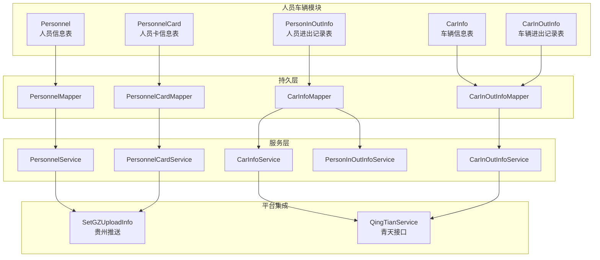
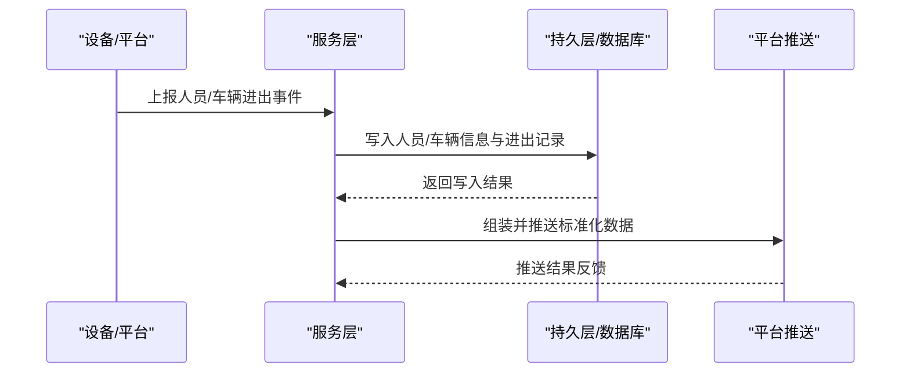
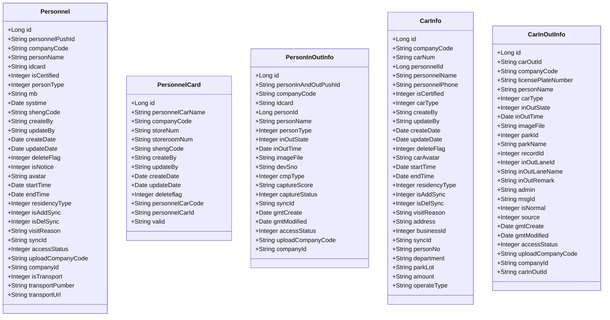
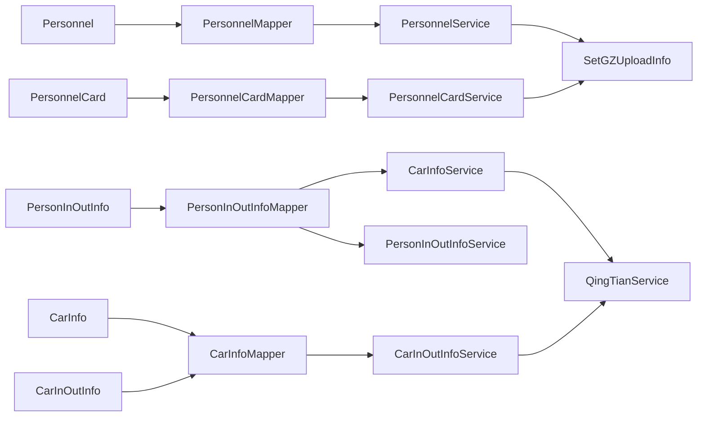

# 人员车辆表设计

<cite>
**本文引用的文件**
- [Personnel.java](file://monkey-monitor/src/main/java/com/monkey/general/modules/em/entity/Personnel.java)
- [PersonnelCard.java](file://monkey-monitor/src/main/java/com/monkey/general/modules/em/entity/PersonnelCard.java)
- [PersonInOutInfo.java](file://monkey-monitor/src/main/java/com/monkey/general/modules/em/entity/PersonInOutInfo.java)
- [CarInfo.java](file://monkey-monitor/src/main/java/com/monkey/general/modules/em/entity/CarInfo.java)
- [CarInOutInfo.java](file://monkey-monitor/src/main/java/com/monkey/general/modules/em/entity/CarInOutInfo.java)
- [PersonnelCardMapper.java](file://monkey-monitor/src/main/java/com/monkey/general/modules/em/mapper/PersonnelCardMapper.java)
- [PersonnelMapper.java](file://monkey-monitor/src/main/java/com/monkey/general/modules/em/mapper/PersonnelMapper.java)
- [CarInfoMapper.java](file://monkey-monitor/src/main/java/com/monkey/general/modules/em/mapper/CarInfoMapper.java)
- [CarInOutInfoMapper.java](file://monkey-monitor/src/main/java/com/monkey/general/modules/em/mapper/CarInOutInfoMapper.java)
- [PersonnelCardService.java](file://monkey-monitor/src/main/java/com/monkey/general/modules/em/service/PersonnelCardService.java)
- [PersonnelService.java](file://monkey-monitor/src/main/java/com/monkey/general/modules/em/service/PersonnelService.java)
- [CarInfoService.java](file://monkey-monitor/src/main/java/com/monkey/general/modules/em/service/CarInfoService.java)
- [CarInOutInfoService.java](file://monkey-monitor/src/main/java/com/monkey/general/modules/em/service/CarInOutInfoService.java)
- [PersonInOutInfoService.java](file://monkey-monitor/src/main/java/com/monkey/general/modules/em/service/PersonInOutInfoService.java)
- [PersonnelCardServiceImpl.java](file://monkey-monitor/src/main/java/com/monkey/general/modules/em/service/impl/PersonnelCardServiceImpl.java)
- [PersonnelServiceImpl.java](file://monkey-monitor/src/main/java/com/monkey/general/modules/em/service/impl/PersonnelServiceImpl.java)
- [CarInfoServiceImpl.java](file://monkey-monitor/src/main/java/com/monkey/general/modules/em/service/impl/CarInfoServiceImpl.java)
- [CarInOutInfoServiceImpl.java](file://monkey-monitor/src/main/java/com/monkey/general/modules/em/service/impl/CarInOutInfoServiceImpl.java)
- [SetGZUploadInfo.java](file://monkey-monitor/src/main/java/com/monkey/general/platform/push/gz/SetGZUploadInfo.java)
- [QingTianService.java](file://monkey-monitor/src/main/java/com/monkey/general/modules/third/QingTianService.java)
- [gz_insert_520123920001.sql](file://temp/gz_insert_520123920001.sql)
- [init.sql](file://deploy/init/init.sql)
</cite>

## 目录
1. [简介](#简介)
2. [项目结构](#项目结构)
3. [核心组件](#核心组件)
4. [架构概览](#架构概览)
5. [详细组件分析](#详细组件分析)
6. [依赖分析](#依赖分析)
7. [性能考虑](#性能考虑)
8. [故障排除指南](#故障排除指南)
9. [结论](#结论)
10. [附录](#附录)

## 简介
本设计文档面向安威 fireworks 物联网监控平台的人员车辆管理模块，围绕以下核心表展开：
- 人员信息表（em_personnel）
- 人员卡信息表（em_personnel_card）
- 人员进出记录表（em_person_in_out_info）
- 车辆信息表（em_car_info）
- 车辆进出记录表（em_car_in_out_info）

文档将从表结构、字段定义、数据类型、约束与索引策略、业务规则（身份识别、车辆识别、权限管理、访客登记、进出时间记录）、隐私与访问控制、以及典型业务场景的 SQL 示例与性能优化建议等方面进行系统阐述。

## 项目结构
人员车辆相关的核心代码位于 monitor 模块的 em 包下，采用 MyBatis-Plus 的实体映射与 Mapper/Service 层实现，配合平台侧的数据推送与第三方集成服务。

图表来源
- [Personnel.java:18-221](file://monkey-monitor/src/main/java/com/monkey/general/modules/em/entity/Personnel.java#L18-L221)
- [PersonnelCard.java:19-97](file://monkey-monitor/src/main/java/com/monkey/general/modules/em/entity/PersonnelCard.java#L19-L97)
- [PersonInOutInfo.java:18-160](file://monkey-monitor/src/main/java/com/monkey/general/modules/em/entity/PersonInOutInfo.java#L18-L160)
- [CarInfo.java:22-190](file://monkey-monitor/src/main/java/com/monkey/general/modules/em/entity/CarInfo.java#L22-L190)
- [CarInOutInfo.java:18-153](file://monkey-monitor/src/main/java/com/monkey/general/modules/em/entity/CarInOutInfo.java#L18-L153)
- [PersonnelMapper.java](file://monkey-monitor/src/main/java/com/monkey/general/modules/em/mapper/PersonnelMapper.java)
- [PersonnelCardMapper.java](file://monkey-monitor/src/main/java/com/monkey/general/modules/em/mapper/PersonnelCardMapper.java)
- [CarInfoMapper.java](file://monkey-monitor/src/main/java/com/monkey/general/modules/em/mapper/CarInfoMapper.java)
- [CarInOutInfoMapper.java](file://monkey-monitor/src/main/java/com/monkey/general/modules/em/mapper/CarInOutInfoMapper.java)
- [PersonnelService.java](file://monkey-monitor/src/main/java/com/monkey/general/modules/em/service/PersonnelService.java)
- [PersonnelCardService.java](file://monkey-monitor/src/main/java/com/monkey/general/modules/em/service/PersonnelCardService.java)
- [CarInfoService.java](file://monkey-monitor/src/main/java/com/monkey/general/modules/em/service/CarInfoService.java)
- [CarInOutInfoService.java](file://monkey-monitor/src/main/java/com/monkey/general/modules/em/service/CarInOutInfoService.java)
- [PersonInOutInfoService.java](file://monkey-monitor/src/main/java/com/monkey/general/modules/em/service/PersonInOutInfoService.java)
- [SetGZUploadInfo.java:516-542](file://monkey-monitor/src/main/java/com/monkey/general/platform/push/gz/SetGZUploadInfo.java#L516-L542)
- [QingTianService.java:733-763](file://monkey-monitor/src/main/java/com/monkey/general/modules/third/QingTianService.java#L733-L763)

章节来源
- [Personnel.java:18-221](file://monkey-monitor/src/main/java/com/monkey/general/modules/em/entity/Personnel.java#L18-L221)
- [PersonnelCard.java:19-97](file://monkey-monitor/src/main/java/com/monkey/general/modules/em/entity/PersonnelCard.java#L19-L97)
- [PersonInOutInfo.java:18-160](file://monkey-monitor/src/main/java/com/monkey/general/modules/em/entity/PersonInOutInfo.java#L18-L160)
- [CarInfo.java:22-190](file://monkey-monitor/src/main/java/com/monkey/general/modules/em/entity/CarInfo.java#L22-L190)
- [CarInOutInfo.java:18-153](file://monkey-monitor/src/main/java/com/monkey/general/modules/em/entity/CarInOutInfo.java#L18-L153)

## 核心组件
- 人员信息表（em_personnel）
  - 主要字段：主键、推送标识、企业编码、姓名、身份证号、证书状态、人员类型、联系方式、同步时间、省编码、创建/更新时间、删除标志、通知标志、照片、预计起止时间、入驻类型、同步状态、访客事由、同步ID、接入状态、上传企业编码、企业ID、搬运相关信息等。
  - 约束与索引：使用 MyBatis-Plus 注解标注主键与自动填充字段；建议在企业编码、身份证号、创建/更新时间建立合适索引以支持查询与统计。
  - 业务要点：人员类型枚举、证书状态、通知标志、搬运人员标识等字段用于区分不同身份与权限。

- 人员卡信息表（em_personnel_card）
  - 主要字段：主键、卡片名称、企业编码、仓库编号、库房编号、省编码、创建/更新人、创建/更新时间、删除标志、卡片编码、卡片ID、有效性。
  - 约束与索引：建议在企业编码、卡片编码、有效性建立索引以支持快速定位与筛选。
  - 业务要点：与仓库/库房关联，用于定位卡的接入与有效性管理。

- 人员进出记录表（em_person_in_out_info）
  - 主要字段：主键、推送标识、企业编码、身份证号、人员ID、姓名、人员类型、进出状态、进出时间、图片路径、设备号、比对类型、比对分值、比对结果、同步ID、创建/更新时间、接入状态、上传企业编码、企业ID。
  - 约束与索引：建议在企业编码、身份证号、进出时间、设备号建立复合或单列索引以支撑高频查询与报表统计。
  - 业务要点：进出状态枚举、比对结果与分值用于安全与审计；图片路径用于证据留存。

- 车辆信息表（em_car_info）
  - 主要字段：主键、企业编码、车牌号、人员ID、人员姓名、人员手机号、证书状态、车辆类型、创建/更新人、创建/更新时间、删除标志、车辆照片、预计起止时间、入驻类型、同步状态、访客事由、详细地址、业务ID、同步ID、扩展字段（车主编号、部门、车位、金额、操作类型）。
  - 约束与索引：建议在企业编码、车牌号、人员ID、创建/更新时间建立索引。
  - 业务要点：车辆类型枚举、人员绑定关系、地址与业务ID便于访客登记与统计。

- 车辆进出记录表（em_car_in_out_info）
  - 主要字段：主键、车辆出入ID、企业编码、车牌号、人员姓名、车辆类型、进出状态、进出时间、图片、停车场ID/名称、通道ID/名称、备注、管理员、消息ID、是否正常、开闸类型、创建/更新时间、接入状态、上传企业编码、企业ID、记录ID。
  - 约束与索引：建议在企业编码、车牌号、进出时间、通道ID建立索引。
  - 业务要点：进出状态、通道与停车场信息、开闸类型用于门禁与统计分析。

章节来源
- [Personnel.java:22-221](file://monkey-monitor/src/main/java/com/monkey/general/modules/em/entity/Personnel.java#L22-L221)
- [PersonnelCard.java:23-97](file://monkey-monitor/src/main/java/com/monkey/general/modules/em/entity/PersonnelCard.java#L23-L97)
- [PersonInOutInfo.java:22-160](file://monkey-monitor/src/main/java/com/monkey/general/modules/em/entity/PersonInOutInfo.java#L22-L160)
- [CarInfo.java:26-190](file://monkey-monitor/src/main/java/com/monkey/general/modules/em/entity/CarInfo.java#L26-L190)
- [CarInOutInfo.java:22-153](file://monkey-monitor/src/main/java/com/monkey/general/modules/em/entity/CarInOutInfo.java#L22-L153)

## 架构概览
人员车辆数据在平台侧通过服务层统一处理，并按需推送至省平台或其他第三方系统。典型流程包括：数据采集（设备/平台）、入库（人员/车辆信息与进出记录）、服务编排（查询/统计/同步）、平台推送（标准化字段与校验）。

图表来源
- [SetGZUploadInfo.java:516-542](file://monkey-monitor/src/main/java/com/monkey/general/platform/push/gz/SetGZUploadInfo.java#L516-L542)
- [QingTianService.java:733-763](file://monkey-monitor/src/main/java/com/monkey/general/modules/third/QingTianService.java#L733-L763)

## 详细组件分析

### 人员信息表（em_personnel）
- 字段与类型
  - 主键：Long
  - 推送标识：String
  - 企业编码：String
  - 姓名：String
  - 身份证号：String
  - 证书状态：Integer（0/1）
  - 人员类型：Integer（枚举）
  - 联系方式：String
  - 同步时间：Date
  - 省编码：String
  - 创建/更新时间：Date（自动填充）
  - 删除标志：Integer（0/1）
  - 通知标志：Integer（0/1）
  - 照片：String
  - 预计起止时间：Date
  - 入驻类型：Integer（1/2）
  - 同步状态：Integer（0/1）
  - 访客事由：String
  - 同步ID：String
  - 接入状态：Integer（0/1）
  - 上传企业编码：String
  - 企业ID：String
  - 搬运相关信息：Integer/String/URL
- 约束与索引
  - 建议索引：企业编码、身份证号、创建/更新时间。
- 业务规则
  - 人员类型与证书状态用于区分身份与权限；通知标志用于提醒；搬运人员字段用于特殊管理。
- 隐私与访问控制
  - 身份证号属于敏感信息，应遵循最小授权原则与脱敏策略；仅授权人员可访问。

章节来源
- [Personnel.java:22-221](file://monkey-monitor/src/main/java/com/monkey/general/modules/em/entity/Personnel.java#L22-L221)

### 人员卡信息表（em_personnel_card）
- 字段与类型
  - 主键：Long
  - 卡片名称：String
  - 企业编码：String
  - 仓库编号：String
  - 库房编号：String
  - 省编码：String
  - 创建/更新人：String
  - 创建/更新时间：Date
  - 删除标志：Integer
  - 卡片编码：String
  - 卡片ID：String
  - 有效性：String（0/1）
- 约束与索引
  - 建议索引：企业编码、卡片编码、有效性。
- 业务规则
  - 与仓库/库房关联，用于定位卡的接入与有效性管理。

章节来源
- [PersonnelCard.java:23-97](file://monkey-monitor/src/main/java/com/monkey/general/modules/em/entity/PersonnelCard.java#L23-L97)

### 人员进出记录表（em_person_in_out_info）
- 字段与类型
  - 主键：Long
  - 推送标识：String
  - 企业编码：String
  - 身份证号：String
  - 人员ID：Long
  - 姓名：String
  - 人员类型：Integer（枚举）
  - 进出状态：Integer（1/2）
  - 进出时间：Date
  - 图片路径：String
  - 设备号：String
  - 比对类型：Integer（0/1/2）
  - 比对分值：String
  - 比对结果：Integer（0/1）
  - 同步ID：String
  - 创建/更新时间：Date（自动填充）
  - 接入状态：Integer（0/1）
  - 上传企业编码：String
  - 企业ID：String
- 约束与索引
  - 建议索引：企业编码、身份证号、进出时间、设备号。
- 业务规则
  - 进出状态与比对结果用于安全审计；图片路径用于证据留存。

章节来源
- [PersonInOutInfo.java:22-160](file://monkey-monitor/src/main/java/com/monkey/general/modules/em/entity/PersonInOutInfo.java#L22-L160)

### 车辆信息表（em_car_info）
- 字段与类型
  - 主键：Long
  - 企业编码：String
  - 车牌号：String
  - 人员ID：Long
  - 人员姓名：String
  - 人员手机号：String
  - 证书状态：Integer（0/1）
  - 车辆类型：Integer（枚举）
  - 创建/更新人：String
  - 创建/更新时间：Date（自动填充）
  - 删除标志：Integer（0/1）
  - 车辆照片：String
  - 预计起止时间：Date
  - 入驻类型：Integer（1/2）
  - 同步状态：Integer（0/1）
  - 访客事由：String
  - 详细地址：String
  - 业务ID：Integer
  - 同步ID：String
  - 扩展字段：车主编号、部门、车位、金额、操作类型
- 约束与索引
  - 建议索引：企业编码、车牌号、人员ID、创建/更新时间。
- 业务规则
  - 车辆类型与人员绑定关系用于访客登记与权限管理。

章节来源
- [CarInfo.java:26-190](file://monkey-monitor/src/main/java/com/monkey/general/modules/em/entity/CarInfo.java#L26-L190)

### 车辆进出记录表（em_car_in_out_info）
- 字段与类型
  - 主键：Long
  - 车辆出入ID：String
  - 企业编码：String
  - 车牌号：String
  - 人员姓名：String
  - 车辆类型：Integer（枚举）
  - 进出状态：Integer（1/2）
  - 进出时间：Date
  - 图片：String
  - 停车场ID/名称：Integer/String
  - 通道ID/名称：Integer/String
  - 备注：String
  - 管理员：String
  - 消息ID：String
  - 是否正常：Integer（1/0）
  - 开闸类型：Integer（枚举）
  - 创建/更新时间：Date（自动填充）
  - 接入状态：Integer（0/1）
  - 上传企业编码：String
  - 企业ID：String
  - 记录ID：Integer
- 约束与索引
  - 建议索引：企业编码、车牌号、进出时间、通道ID。
- 业务规则
  - 通道与开闸类型用于门禁控制与统计分析。

章节来源
- [CarInOutInfo.java:22-153](file://monkey-monitor/src/main/java/com/monkey/general/modules/em/entity/CarInOutInfo.java#L22-L153)

### 类关系图（代码级）

图表来源
- [Personnel.java:18-221](file://monkey-monitor/src/main/java/com/monkey/general/modules/em/entity/Personnel.java#L18-L221)
- [PersonnelCard.java:19-97](file://monkey-monitor/src/main/java/com/monkey/general/modules/em/entity/PersonnelCard.java#L19-L97)
- [PersonInOutInfo.java:18-160](file://monkey-monitor/src/main/java/com/monkey/general/modules/em/entity/PersonInOutInfo.java#L18-L160)
- [CarInfo.java:22-190](file://monkey-monitor/src/main/java/com/monkey/general/modules/em/entity/CarInfo.java#L22-L190)
- [CarInOutInfo.java:18-153](file://monkey-monitor/src/main/java/com/monkey/general/modules/em/entity/CarInOutInfo.java#L18-L153)

### 人员身份识别机制
- 身份识别依据
  - 身份证号作为核心识别字段，结合人员类型（员工/访客/其他）与证书状态进行身份判定。
  - 人员进出记录中的比对类型与比对结果用于人证比对与人脸比对的审计。
- 数据来源与一致性
  - 人员信息与进出记录通过企业编码与推送标识保持跨表一致性；平台推送前进行数据校验（如身份证号与进出时间非空）。

章节来源
- [Personnel.java:46-100](file://monkey-monitor/src/main/java/com/monkey/general/modules/em/entity/Personnel.java#L46-L100)
- [PersonInOutInfo.java:43-128](file://monkey-monitor/src/main/java/com/monkey/general/modules/em/entity/PersonInOutInfo.java#L43-L128)
- [SetGZUploadInfo.java:516-542](file://monkey-monitor/src/main/java/com/monkey/general/platform/push/gz/SetGZUploadInfo.java#L516-L542)

### 车辆识别系统
- 车辆识别依据
  - 车牌号为核心识别字段，结合车辆类型（危化/其他）与人员绑定关系（人员ID/姓名/手机号）进行识别与权限判定。
- 数据来源与一致性
  - 车辆信息与进出记录通过企业编码与推送标识保持一致；平台推送时对关键字段进行校验与标准化。

章节来源
- [CarInfo.java:41-58](file://monkey-monitor/src/main/java/com/monkey/general/modules/em/entity/CarInfo.java#L41-L58)
- [CarInOutInfo.java:44-100](file://monkey-monitor/src/main/java/com/monkey/general/modules/em/entity/CarInOutInfo.java#L44-L100)
- [SetGZUploadInfo.java:539-542](file://monkey-monitor/src/main/java/com/monkey/general/platform/push/gz/SetGZUploadInfo.java#L539-L542)

### 进出时间记录与统计
- 时间记录
  - 人员/车辆进出记录均包含精确到秒的进出时间字段，便于审计与统计。
- 统计能力
  - 服务层提供按企业编码与时间段的人数统计与进出记录查询能力，支撑报表与告警。

章节来源
- [PersonInOutInfo.java:98-104](file://monkey-monitor/src/main/java/com/monkey/general/modules/em/entity/PersonInOutInfo.java#L98-L104)
- [CarInOutInfo.java:85-91](file://monkey-monitor/src/main/java/com/monkey/general/modules/em/entity/CarInOutInfo.java#L85-L91)
- [PersonInOutInfoService.java:19-20](file://monkey-monitor/src/main/java/com/monkey/general/modules/em/service/PersonInOutInfoService.java#L19-L20)

### 人员权限管理与访客登记
- 权限管理
  - 人员类型与证书状态用于区分不同权限等级；通知标志用于提醒与合规。
- 访客登记
  - 车辆信息中的访客事由、预计起止时间、详细地址等字段用于访客登记与追踪。

章节来源
- [Personnel.java:74-100](file://monkey-monitor/src/main/java/com/monkey/general/modules/em/entity/Personnel.java#L74-L100)
- [CarInfo.java:158-165](file://monkey-monitor/src/main/java/com/monkey/general/modules/em/entity/CarInfo.java#L158-L165)

### 平台推送与第三方集成
- 贵州推送
  - 对人员/车辆进出记录进行标准化组装与校验，确保关键字段非空与格式正确。
- 青天接口
  - 保存车辆进出记录时，根据车辆信息回填企业编码、车辆类型与人员姓名等字段。

章节来源
- [SetGZUploadInfo.java:516-542](file://monkey-monitor/src/main/java/com/monkey/general/platform/push/gz/SetGZUploadInfo.java#L516-L542)
- [QingTianService.java:733-763](file://monkey-monitor/src/main/java/com/monkey/general/modules/third/QingTianService.java#L733-L763)

### 典型业务场景与SQL示例
以下为典型场景的 SQL 设计思路（不直接展示具体代码内容，仅提供路径与思路）：

- 场景一：查询某企业指定时间段内人员进出记录
  - 思路：按企业编码与进出时间范围过滤，必要时按设备号或人员类型排序。
  - 参考路径：[PersonInOutInfo.java:38-104](file://monkey-monitor/src/main/java/com/monkey/general/modules/em/entity/PersonInOutInfo.java#L38-L104)

- 场景二：统计某企业当日人员在场分布
  - 思路：基于人员进出记录，按“最近一次状态=进入且时间在当日”的逻辑聚合。
  - 参考路径：[PersonInOutInfoService.java:19-20](file://monkey-monitor/src/main/java/com/monkey/general/modules/em/service/PersonInOutInfoService.java#L19-L20)

- 场景三：查询某车辆在指定时间内的进出记录
  - 思路：按企业编码与车牌号过滤，按进出时间排序。
  - 参考路径：[CarInOutInfo.java:44-91](file://monkey-monitor/src/main/java/com/monkey/general/modules/em/entity/CarInOutInfo.java#L44-L91)

- 场景四：访客登记与权限校验
  - 思路：通过车辆信息中的访客事由、预计起止时间与人员绑定关系进行登记与校验。
  - 参考路径：[CarInfo.java:158-165](file://monkey-monitor/src/main/java/com/monkey/general/modules/em/entity/CarInfo.java#L158-L165)

- 场景五：平台推送数据组装与校验
  - 思路：组装人员/车辆进出记录的关键字段，进行非空与格式校验后再推送。
  - 参考路径：[SetGZUploadInfo.java:516-542](file://monkey-monitor/src/main/java/com/monkey/general/platform/push/gz/SetGZUploadInfo.java#L516-L542)

章节来源
- [PersonInOutInfo.java:38-104](file://monkey-monitor/src/main/java/com/monkey/general/modules/em/entity/PersonInOutInfo.java#L38-L104)
- [PersonInOutInfoService.java:19-20](file://monkey-monitor/src/main/java/com/monkey/general/modules/em/service/PersonInOutInfoService.java#L19-L20)
- [CarInOutInfo.java:44-91](file://monkey-monitor/src/main/java/com/monkey/general/modules/em/entity/CarInOutInfo.java#L44-L91)
- [CarInfo.java:158-165](file://monkey-monitor/src/main/java/com/monkey/general/modules/em/entity/CarInfo.java#L158-L165)
- [SetGZUploadInfo.java:516-542](file://monkey-monitor/src/main/java/com/monkey/general/platform/push/gz/SetGZUploadInfo.java#L516-L542)

## 依赖分析
- 组件耦合
  - 实体类与 Mapper/Service 层通过 MyBatis-Plus 注解与接口契约解耦。
  - 服务层依赖 Mapper 完成数据持久化，平台推送服务依赖实体类字段进行组装。
- 外部依赖
  - 平台推送依赖标准化字段与校验逻辑，第三方接口依赖于服务层提供的数据装配。

图表来源
- [Personnel.java:18-221](file://monkey-monitor/src/main/java/com/monkey/general/modules/em/entity/Personnel.java#L18-L221)
- [PersonnelCard.java:19-97](file://monkey-monitor/src/main/java/com/monkey/general/modules/em/entity/PersonnelCard.java#L19-L97)
- [PersonInOutInfo.java:18-160](file://monkey-monitor/src/main/java/com/monkey/general/modules/em/entity/PersonInOutInfo.java#L18-L160)
- [CarInfo.java:22-190](file://monkey-monitor/src/main/java/com/monkey/general/modules/em/entity/CarInfo.java#L22-L190)
- [CarInOutInfo.java:18-153](file://monkey-monitor/src/main/java/com/monkey/general/modules/em/entity/CarInOutInfo.java#L18-L153)
- [PersonnelMapper.java](file://monkey-monitor/src/main/java/com/monkey/general/modules/em/mapper/PersonnelMapper.java)
- [PersonnelCardMapper.java](file://monkey-monitor/src/main/java/com/monkey/general/modules/em/mapper/PersonnelCardMapper.java)
- [CarInfoMapper.java](file://monkey-monitor/src/main/java/com/monkey/general/modules/em/mapper/CarInfoMapper.java)
- [CarInOutInfoMapper.java](file://monkey-monitor/src/main/java/com/monkey/general/modules/em/mapper/CarInOutInfoMapper.java)
- [PersonnelService.java](file://monkey-monitor/src/main/java/com/monkey/general/modules/em/service/PersonnelService.java)
- [PersonnelCardService.java](file://monkey-monitor/src/main/java/com/monkey/general/modules/em/service/PersonnelCardService.java)
- [CarInfoService.java](file://monkey-monitor/src/main/java/com/monkey/general/modules/em/service/CarInfoService.java)
- [CarInOutInfoService.java](file://monkey-monitor/src/main/java/com/monkey/general/modules/em/service/CarInOutInfoService.java)
- [PersonInOutInfoService.java](file://monkey-monitor/src/main/java/com/monkey/general/modules/em/service/PersonInOutInfoService.java)
- [SetGZUploadInfo.java:516-542](file://monkey-monitor/src/main/java/com/monkey/general/platform/push/gz/SetGZUploadInfo.java#L516-L542)
- [QingTianService.java:733-763](file://monkey-monitor/src/main/java/com/monkey/general/modules/third/QingTianService.java#L733-L763)

## 性能考虑
- 索引策略
  - 在企业编码、身份证号、车牌号、进出时间、设备号、通道ID等高频查询字段建立索引，避免全表扫描。
- 查询优化
  - 使用分页查询与时间范围限定，减少单次查询数据量。
  - 对统计类查询（如当日在场人数）采用物化视图或缓存策略。
- 写入优化
  - 批量写入人员/车辆信息与进出记录，减少事务开销。
  - 对平台推送前进行数据校验，降低无效写入。
- 存储与归档
  - 对历史进出记录进行分区或归档，降低热数据压力。

## 故障排除指南
- 常见问题
  - 身份证号为空或格式错误：平台推送前进行非空与格式校验，记录日志并跳过无效数据。
  - 进出时间为空：记录日志并忽略该条记录，确保整批数据不被拒绝。
  - 车辆信息缺失：在保存车辆进出记录时，根据车辆信息回填企业编码、车辆类型与人员姓名。
- 日志与监控
  - 服务层与推送服务记录关键字段与处理结果，便于问题定位与复盘。

章节来源
- [SetGZUploadInfo.java:516-542](file://monkey-monitor/src/main/java/com/monkey/general/platform/push/gz/SetGZUploadInfo.java#L516-L542)
- [QingTianService.java:733-763](file://monkey-monitor/src/main/java/com/monkey/general/modules/third/QingTianService.java#L733-L763)

## 结论
本设计文档基于现有实体类与平台集成代码，系统梳理了人员车辆管理相关表的结构、字段、约束与索引策略，并结合平台推送与第三方集成场景，提出了身份识别、车辆识别、权限管理、访客登记、隐私与访问控制、典型业务场景 SQL 设计思路与性能优化建议。建议在生产环境中进一步完善索引覆盖、批量写入与归档策略，确保高并发场景下的稳定性与可维护性。

## 附录
- 数据初始化参考
  - 贵州数据同步样例：包含人员与车辆出入记录的插入示例，可用于验证表结构与字段映射。
  - 初始化数据库脚本：包含数据库与任务调度相关表的创建与示例数据。

章节来源
- [gz_insert_520123920001.sql:154-174](file://temp/gz_insert_520123920001.sql#L154-L174)
- [gz_insert_520123920001.sql:358-378](file://temp/gz_insert_520123920001.sql#L358-L378)
- [init.sql:1-219](file://deploy/init/init.sql#L1-L219)