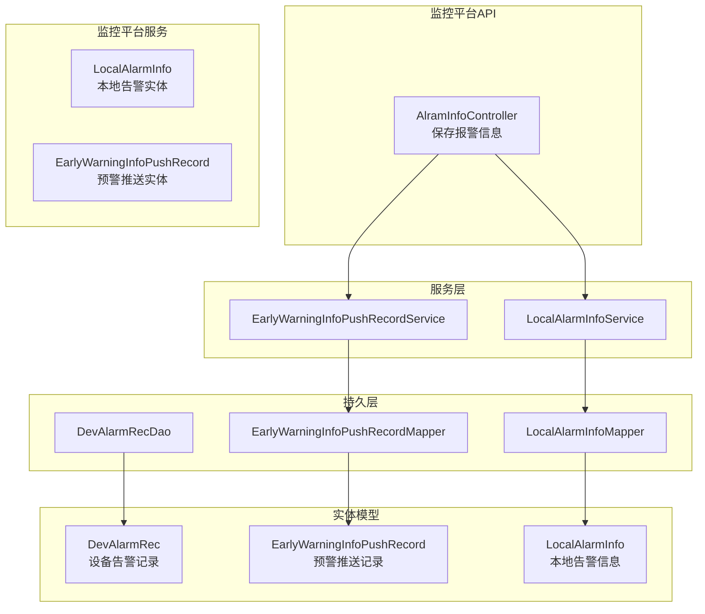
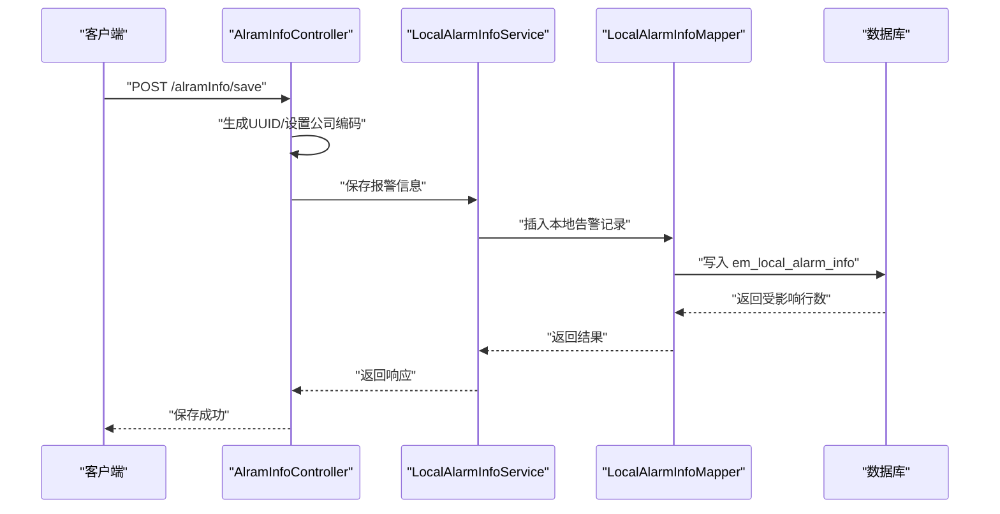
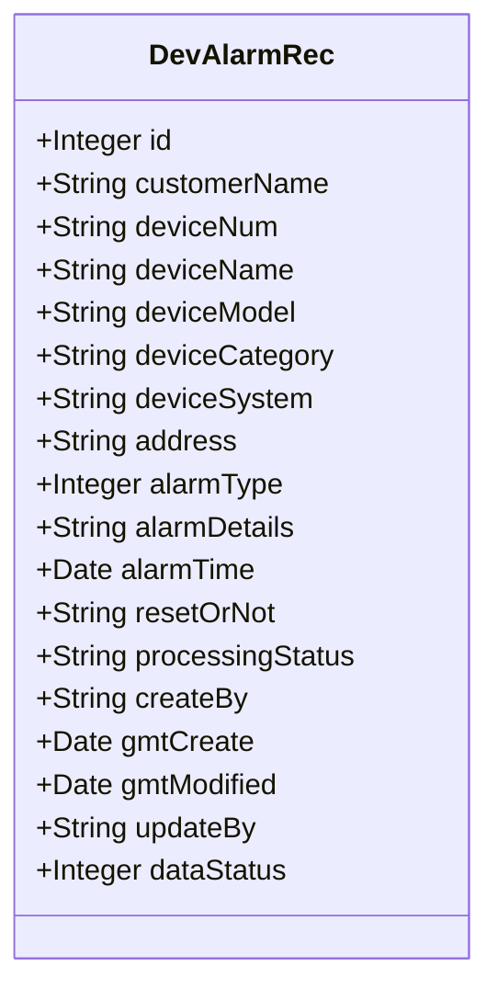
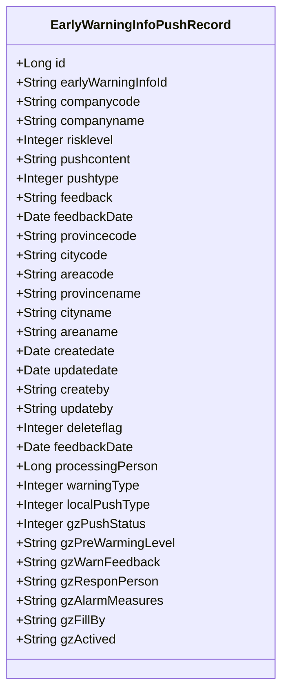
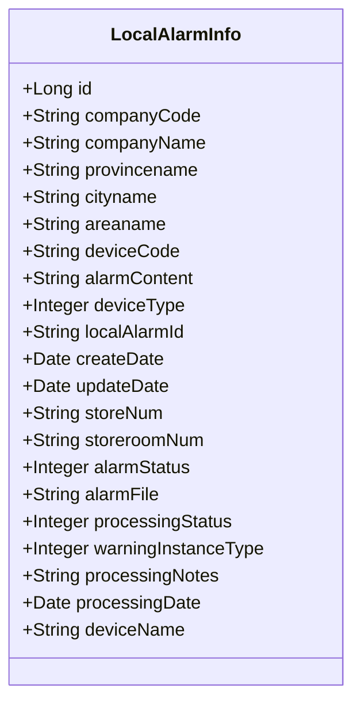
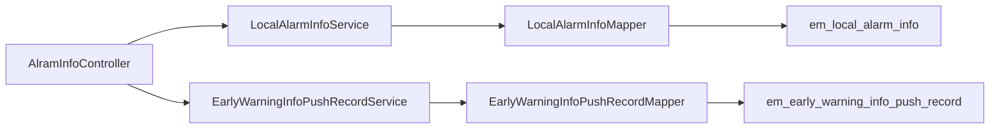

# 告警记录表设计

<cite>
**本文引用的文件**
- [DevAlarmRec.java](file://monkey-service/src/main/java/com/monkey/general/modules/em/entity/DevAlarmRec.java)
- [EarlyWarningInfoPushRecord.java](file://monkey-monitor/src/main/java/com/monkey/general/modules/em/entity/EarlyWarningInfoPushRecord.java)
- [LocalAlarmInfo.java](file://monkey-monitor/src/main/java/com/monkey/general/modules/em/entity/LocalAlarmInfo.java)
- [DevAlarmRecDao.xml](file://monkey-service/src/main/resources/mapper/em/DevAlarmRecDao.xml)
- [EarlyWarningInfoPushRecordMapper.xml](file://monkey-monitor/src/main/resources/mapper/em/EarlyWarningInfoPushRecordMapper.xml)
- [AlramInfoController.java](file://monkey-monitor-api/src/main/java/com/monkey/general/controller/AlramInfoController.java)
- [init.sql](file://deploy/init/init.sql)
</cite>

## 目录
1. [简介](#简介)
2. [项目结构](#项目结构)
3. [核心组件](#核心组件)
4. [架构总览](#架构总览)
5. [详细组件分析](#详细组件分析)
6. [依赖关系分析](#依赖关系分析)
7. [性能考量](#性能考量)
8. [故障排查指南](#故障排查指南)
9. [结论](#结论)
10. [附录](#附录)

## 简介
本设计文档面向安威 fireworks 物联网监控平台，聚焦告警相关表的结构设计与使用实践，覆盖以下三类核心表：
- 设备告警记录表（dev_alarm_rec）
- 预警信息推送记录表（early_warning_info_push_record）
- 本地告警信息表（local_alarm_info）

文档将从字段定义、数据类型、约束与索引策略、状态流转机制、时间戳设计、告警级别与来源标识、存储与历史归档策略、以及典型业务场景的查询与统计出发，给出可操作的设计建议与性能优化要点。

## 项目结构
告警相关表在代码层面由实体类与持久层映射文件共同体现，并通过服务与控制器进行业务编排。下图展示与告警记录表相关的模块与文件关系：

图表来源
- [AlramInfoController.java:1-73](file://monkey-monitor-api/src/main/java/com/monkey/general/controller/AlramInfoController.java#L1-L73)
- [LocalAlarmInfo.java:1-146](file://monkey-monitor/src/main/java/com/monkey/general/modules/em/entity/LocalAlarmInfo.java#L1-L146)
- [EarlyWarningInfoPushRecord.java:1-271](file://monkey-monitor/src/main/java/com/monkey/general/modules/em/entity/EarlyWarningInfoPushRecord.java#L1-L271)
- [DevAlarmRec.java:1-120](file://monkey-service/src/main/java/com/monkey/general/modules/em/entity/DevAlarmRec.java#L1-L120)
- [DevAlarmRecDao.xml:1-6](file://monkey-service/src/main/resources/mapper/em/DevAlarmRecDao.xml#L1-L6)
- [EarlyWarningInfoPushRecordMapper.xml:1-14](file://monkey-monitor/src/main/resources/mapper/em/EarlyWarningInfoPushRecordMapper.xml#L1-L14)

章节来源
- [AlramInfoController.java:1-73](file://monkey-monitor-api/src/main/java/com/monkey/general/controller/AlramInfoController.java#L1-L73)
- [DevAlarmRec.java:1-120](file://monkey-service/src/main/java/com/monkey/general/modules/em/entity/DevAlarmRec.java#L1-L120)
- [EarlyWarningInfoPushRecord.java:1-271](file://monkey-monitor/src/main/java/com/monkey/general/modules/em/entity/EarlyWarningInfoPushRecord.java#L1-L271)
- [LocalAlarmInfo.java:1-146](file://monkey-monitor/src/main/java/com/monkey/general/modules/em/entity/LocalAlarmInfo.java#L1-L146)

## 核心组件
本节对三类告警表进行字段、类型、约束与索引策略的系统性梳理，并结合业务语义给出设计建议。

- 设备告警记录表（dev_alarm_rec）
  - 表名与实体映射：实体类标注表名为 em_dev_alarm_rec，对应设备侧报警记录。
  - 关键字段与语义
    - 基础标识：id（主键）
    - 客户与设备维度：customerName、deviceNum、deviceName、deviceModel、deviceCategory、deviceSystem、address
    - 告警类型与详情：alarmType（0-火灾报警、1-一般报警、2-故障、3-事件、4-离线）、alarmDetails
    - 时间与时钟：alarmTime（报警发生时间）、gmt_create（创建时间）、gmt_modified（更新时间）
    - 处理与状态：resetOrNot（是否复位）、processingStatus（处理状态）、dataStatus（启用/禁用）
    - 人员与审计：createBy、updateBy
  - 约束与索引
    - 主键：id
    - 建议索引：alarmTime（高频按时间检索）、alarmType（按类型过滤）、deviceNum（按设备检索）、customerName（按客户检索）
  - 状态与时间戳
    - alarmTime 作为事件时间点；gmt_create/gmt_modified 由框架填充，便于审计与排序
  - 告警级别与来源
    - 当前实体未直接定义“级别”字段；可通过 alarmType 的枚举值映射到业务级别
    - 来源标识：可通过 customerName 或扩展字段标识来源系统
  - 存储与历史归档
    - 建议按月/季度分区或归档表，保留最近 3-6 个月在线表，其余迁移至历史表

- 预警信息推送记录表（early_warning_info_push_record）
  - 表名与实体映射：实体类标注表名为 em_early_warning_info_push_record，记录部级/跨系统预警推送与反馈
  - 关键字段与语义
    - 标识：id（主键）、earlyWarningInfoId（预警信息唯一标识）
    - 企业与地理：companycode、companyname、provincecode、citycode、areacode、provincename、cityname、areaname
    - 风险等级：risklevel（1-重大；2-较大；3-一般；4-低）
    - 内容与状态：pushcontent（推送内容）、pushtype（0-未下发；1-已下发；2-已反馈）
    - 反馈与时间：feedback（反馈意见）、feedbackDate（反馈时间）、createdate、updatedate
    - 处理与审计：createby、updateby、deleteflag（0-未删除；1-已删除）、processingPerson/processingPersonName
    - 类型与推送：warningType（0-湿度；1-温度；2-液位；3-资质到期；4-线上推送）、localPushType（0-未推送；1-已推送）
    - 贵州扩展字段：gzPreWarmingLevel、gzWarnFeedback、gzResponPerson、gzAlarmMeasures、gzFillBy、gzActived
  - 约束与索引
    - 主键：id
    - 建议索引：earlyWarningInfoId（唯一性/关联查询）、pushtype（状态检索）、risklevel（风险等级聚合）、warningType（类型聚合）、feedbackDate（反馈时效分析）
  - 状态流转机制
    - 未下发 → 已下发 → 已反馈；localPushType 用于本地大屏推送状态
  - 时间戳设计
    - createdate/updatedate 用于创建与更新时间；feedbackDate 用于反馈时间
  - 存储与历史归档
    - 建议按 risklevel/warningType 维度分表或分区，保留近半年活跃数据

- 本地告警信息表（local_alarm_info）
  - 表名与实体映射：实体类标注表名为 em_local_alarm_info，记录本地传感/视频等设备产生的报警
  - 关键字段与语义
    - 标识：id（主键）、localAlarmId（本地报警UUID）
    - 企业与地理：companyCode、companyName、provincename、cityname、areaname
    - 设备与内容：deviceCode、deviceName、deviceType（0-未知；1-传感；2-摄像头；3-闸机）、alarmContent（报警详情）
    - 仓储关联：storeNum（仓库编号）、storeroomNum（库房编号）
    - 状态与处理：alarmStatus（0-未消警；1-已消警）、processingStatus（0-待处理；1-已处理）、warningInstanceType（1-真实警情；2-误报；3-测试；4-设备检查；5-其他）、processingNotes、processingDate
    - 文件与时间：alarmFile（文件服务器相对路径）、createDate、updateDate
  - 约束与索引
    - 主键：id
    - 建议索引：localAlarmId（唯一性/快速定位）、alarmStatus（状态检索）、warningInstanceType（实例类型聚合）、deviceType（设备类型过滤）、createDate（时间序列分析）
  - 状态流转机制
    - 未消警 → 已消警；待处理 → 已处理；支持误报/测试等特殊实例类型
  - 时间戳设计
    - createDate/updateDate 记录创建与更新；processingDate 记录处理完成时间
  - 存储与历史归档
    - 建议按 deviceType/alarmStatus 分桶或分区，保留近 3 个月在线表

章节来源
- [DevAlarmRec.java:1-120](file://monkey-service/src/main/java/com/monkey/general/modules/em/entity/DevAlarmRec.java#L1-L120)
- [EarlyWarningInfoPushRecord.java:1-271](file://monkey-monitor/src/main/java/com/monkey/general/modules/em/entity/EarlyWarningInfoPushRecord.java#L1-L271)
- [LocalAlarmInfo.java:1-146](file://monkey-monitor/src/main/java/com/monkey/general/modules/em/entity/LocalAlarmInfo.java#L1-L146)

## 架构总览
下图展示告警数据在系统中的流向与交互关系，包括控制器接收、服务编排、持久层写入与查询、以及与历史归档/统计分析的关系。

图表来源
- [AlramInfoController.java:1-73](file://monkey-monitor-api/src/main/java/com/monkey/general/controller/AlramInfoController.java#L1-L73)
- [LocalAlarmInfo.java:1-146](file://monkey-monitor/src/main/java/com/monkey/general/modules/em/entity/LocalAlarmInfo.java#L1-L146)

章节来源
- [AlramInfoController.java:1-73](file://monkey-monitor-api/src/main/java/com/monkey/general/controller/AlramInfoController.java#L1-L73)

## 详细组件分析

### 设备告警记录表（dev_alarm_rec）
- 字段与类型
  - 整型/字符串：id、alarmType、dataStatus、resetOrNot、processingStatus 等
  - 文本：alarmDetails、deviceName、deviceModel、address 等
  - 时间：alarmTime、gmt_create、gmt_modified
- 约束与索引
  - 主键：id
  - 建议索引：alarmTime、alarmType、deviceNum、customerName
- 状态与时间戳
  - alarmTime 为事件时间；gmt_create/gmt_modified 用于审计
- 告警级别与来源
  - 建议通过 alarmType 映射业务级别；来源通过 customerName 或扩展字段标识
- 存储与历史归档
  - 建议按月/季度分区或归档表，保留近期在线表

图表来源
- [DevAlarmRec.java:1-120](file://monkey-service/src/main/java/com/monkey/general/modules/em/entity/DevAlarmRec.java#L1-L120)

章节来源
- [DevAlarmRec.java:1-120](file://monkey-service/src/main/java/com/monkey/general/modules/em/entity/DevAlarmRec.java#L1-L120)
- [DevAlarmRecDao.xml:1-6](file://monkey-service/src/main/resources/mapper/em/DevAlarmRecDao.xml#L1-L6)

### 预警信息推送记录表（early_warning_info_push_record）
- 字段与类型
  - 标识：id（Long）、earlyWarningInfoId（String）
  - 企业与地理：companycode、companyname、provincecode、citycode、areacode、provincename、cityname、areaname
  - 风险等级：risklevel（整型枚举）
  - 内容与状态：pushcontent、pushtype、feedback、feedbackDate
  - 处理与审计：createby、updateby、deleteflag、processingPerson、processingPersonName
  - 类型与推送：warningType、localPushType
  - 贵州扩展字段：gzPreWarmingLevel、gzWarnFeedback、gzResponPerson、gzAlarmMeasures、gzFillBy、gzActived
- 约束与索引
  - 主键：id
  - 建议索引：earlyWarningInfoId、pushtype、risklevel、warningType、feedbackDate
- 状态流转机制
  - 未下发 → 已下发 → 已反馈；localPushType 用于本地大屏推送状态
- 时间戳设计
  - createdate、updatedate、feedbackDate
- 存储与历史归档
  - 建议按 risklevel/warningType 分表或分区，保留近半年活跃数据

图表来源
- [EarlyWarningInfoPushRecord.java:1-271](file://monkey-monitor/src/main/java/com/monkey/general/modules/em/entity/EarlyWarningInfoPushRecord.java#L1-L271)

章节来源
- [EarlyWarningInfoPushRecord.java:1-271](file://monkey-monitor/src/main/java/com/monkey/general/modules/em/entity/EarlyWarningInfoPushRecord.java#L1-L271)
- [EarlyWarningInfoPushRecordMapper.xml:1-14](file://monkey-monitor/src/main/resources/mapper/em/EarlyWarningInfoPushRecordMapper.xml#L1-L14)

### 本地告警信息表（local_alarm_info）
- 字段与类型
  - 标识：id（Long）、localAlarmId（String）
  - 企业与地理：companyCode、companyName、provincename、cityname、areaname
  - 设备与内容：deviceCode、deviceName、deviceType、alarmContent
  - 仓储关联：storeNum、storeroomNum
  - 状态与处理：alarmStatus、processingStatus、warningInstanceType、processingNotes、processingDate
  - 文件与时间：alarmFile、createDate、updateDate
- 约束与索引
  - 主键：id
  - 建议索引：localAlarmId、alarmStatus、warningInstanceType、deviceType、createDate
- 状态流转机制
  - 未消警 → 已消警；待处理 → 已处理；支持误报/测试等实例类型
- 时间戳设计
  - createDate/updateDate；processingDate
- 存储与历史归档
  - 建议按 deviceType/alarmStatus 分桶或分区，保留近 3 个月在线表

图表来源
- [LocalAlarmInfo.java:1-146](file://monkey-monitor/src/main/java/com/monkey/general/modules/em/entity/LocalAlarmInfo.java#L1-L146)

章节来源
- [LocalAlarmInfo.java:1-146](file://monkey-monitor/src/main/java/com/monkey/general/modules/em/entity/LocalAlarmInfo.java#L1-L146)

## 依赖关系分析
- 控制器与服务
  - AlramInfoController 负责接收报警保存请求，设置公司编码与默认状态，调用服务层保存
- 服务与映射
  - LocalAlarmInfoService 与 EarlyWarningInfoPushRecordService 通过各自 Mapper 操作数据库
- 实体与表
  - DevAlarmRec、EarlyWarningInfoPushRecord、LocalAlarmInfo 分别映射到 em_dev_alarm_rec、em_early_warning_info_push_record、em_local_alarm_info

图表来源
- [AlramInfoController.java:1-73](file://monkey-monitor-api/src/main/java/com/monkey/general/controller/AlramInfoController.java#L1-L73)
- [LocalAlarmInfo.java:1-146](file://monkey-monitor/src/main/java/com/monkey/general/modules/em/entity/LocalAlarmInfo.java#L1-L146)
- [EarlyWarningInfoPushRecord.java:1-271](file://monkey-monitor/src/main/java/com/monkey/general/modules/em/entity/EarlyWarningInfoPushRecord.java#L1-L271)

章节来源
- [AlramInfoController.java:1-73](file://monkey-monitor-api/src/main/java/com/monkey/general/controller/AlramInfoController.java#L1-L73)

## 性能考量
- 索引策略
  - dev_alarm_rec：alarmTime、alarmType、deviceNum、customerName
  - early_warning_info_push_record：earlyWarningInfoId、pushtype、risklevel、warningType、feedbackDate
  - em_local_alarm_info：localAlarmId、alarmStatus、warningInstanceType、deviceType、createDate
- 分区与归档
  - 按时间（月/季度）与业务维度（风险等级/设备类型/状态）进行分区或归档
- 查询优化
  - 使用覆盖索引减少回表
  - 对高频过滤字段建立复合索引（如 alarmStatus+createDate）
- 写入优化
  - 批量写入与异步落库，避免长事务
- 统计分析
  - 周期性物化视图或汇总表，降低复杂聚合查询成本

## 故障排查指南
- 常见问题
  - 重复推送：检查 earlyWarningInfoId 唯一性与 pushtype 状态流转
  - 本地推送未更新：核对 localPushType 更新逻辑与批处理脚本
  - 报警未消警：确认 alarmStatus 与 processingStatus 的更新流程
- 排查步骤
  - 核对时间字段：alarmTime、createdate、updatedate、feedbackDate、processingDate
  - 校验索引命中：EXPLAIN 分析慢查询
  - 归档与分区：确认历史表迁移与分区策略
- 相关实现参考
  - 批量更新本地推送状态的映射文件

章节来源
- [EarlyWarningInfoPushRecordMapper.xml:1-14](file://monkey-monitor/src/main/resources/mapper/em/EarlyWarningInfoPushRecordMapper.xml#L1-L14)

## 结论
本文基于现有实体与映射文件，系统梳理了设备告警记录表、预警推送记录表与本地告警信息表的结构设计与使用建议。通过明确字段语义、建议索引、状态流转与时间戳设计，并结合分区/归档策略与性能优化要点，可有效支撑安威 fireworks 平台的告警数据管理与分析需求。

## 附录
- 初始化脚本与数据库
  - 数据库初始化脚本包含多个业务与调度相关表，当前告警相关表结构以实体类为准
- 典型业务场景与SQL示例（路径指引）
  - 查询某设备最近 N 条告警（dev_alarm_rec）
    - 示例路径：[DevAlarmRecDao.xml:1-6](file://monkey-service/src/main/resources/mapper/em/DevAlarmRecDao.xml#L1-L6)
  - 批量更新本地推送状态（early_warning_info_push_record）
    - 示例路径：[EarlyWarningInfoPushRecordMapper.xml:1-14](file://monkey-monitor/src/main/resources/mapper/em/EarlyWarningInfoPushRecordMapper.xml#L1-L14)
  - 保存本地报警信息（local_alarm_info）
    - 示例路径：[AlramInfoController.java:1-73](file://monkey-monitor-api/src/main/java/com/monkey/general/controller/AlramInfoController.java#L1-L73)

章节来源
- [init.sql:1-219](file://deploy/init/init.sql#L1-L219)
- [DevAlarmRecDao.xml:1-6](file://monkey-service/src/main/resources/mapper/em/DevAlarmRecDao.xml#L1-L6)
- [EarlyWarningInfoPushRecordMapper.xml:1-14](file://monkey-monitor/src/main/resources/mapper/em/EarlyWarningInfoPushRecordMapper.xml#L1-L14)
- [AlramInfoController.java:1-73](file://monkey-monitor-api/src/main/java/com/monkey/general/controller/AlramInfoController.java#L1-L73)