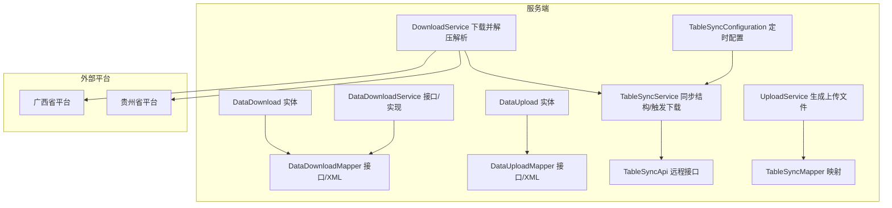
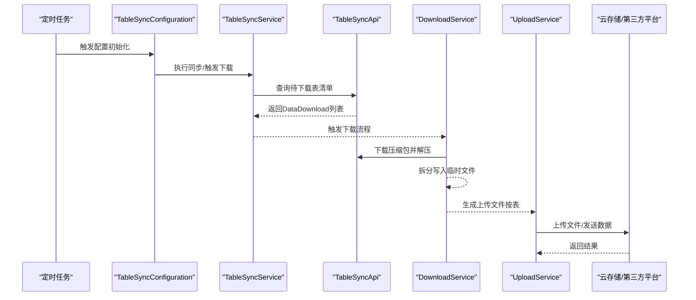
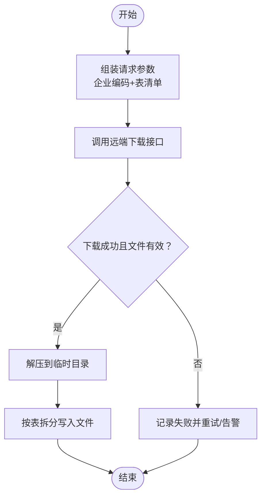
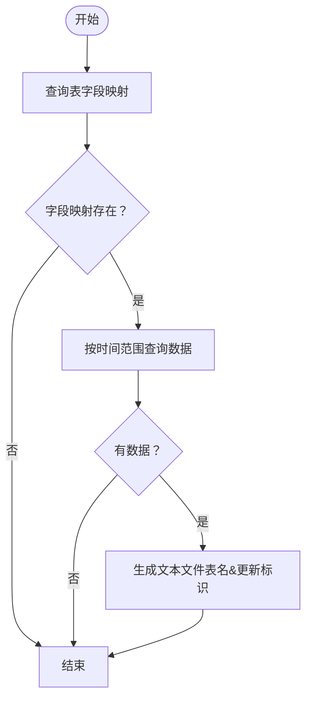
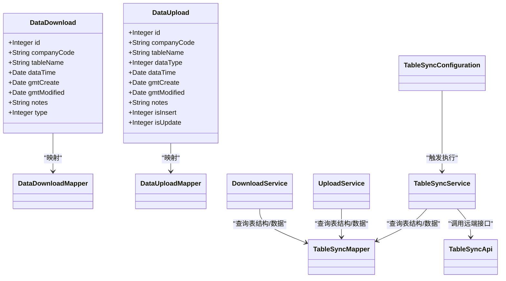

# 数据传输表设计

<cite>
**本文引用的文件**
- [DataDownload.java](file://monkey-service/src/main/java/com/monkey/general/modules/data/entity/DataDownload.java)
- [DataUpload.java](file://monkey-service/src/main/java/com/monkey/general/modules/data/entity/DataUpload.java)
- [DataDownloadMapper.java](file://monkey-service/src/main/java/com/monkey/general/modules/data/mapper/DataDownloadMapper.java)
- [DataUploadMapper.java](file://monkey-service/src/main/java/com/monkey/general/modules/data/mapper/DataUploadMapper.java)
- [DataDownloadMapper.xml](file://monkey-service/src/main/resources/mapper/data/DataDownloadMapper.xml)
- [DataUploadMapper.xml](file://monkey-service/src/main/resources/mapper/data/DataUploadMapper.xml)
- [DataDownloadService.java](file://monkey-service/src/main/java/com/monkey/general/modules/data/service/DataDownloadService.java)
- [DataDownloadServiceImpl.java](file://monkey-service/src/main/java/com/monkey/general/modules/data/service/impl/DataDownloadServiceImpl.java)
- [UploadService.java](file://monkey-service/src/main/java/com/monkey/general/modules/data/service/impl/UploadService.java)
- [DownloadService.java](file://monkey-service/src/main/java/com/monkey/general/modules/data/service/impl/DownloadService.java)
- [TableSyncService.java](file://monkey-service/src/main/java/com/monkey/general/modules/open/service/TableSyncService.java)
- [TableSyncMapper.java](file://monkey-service/src/main/java/com/monkey/general/modules/open/mapper/TableSyncMapper.java)
- [TableSyncApi.java](file://monkey-service/src/main/java/com/monkey/general/api/TableSyncApi.java)
- [TableSyncConfiguration.java](file://monkey-monitor/src/main/java/com/monkey/general/config/TableSyncConfiguration.java)
- [CloudStorageService.java](file://monkey-service/src/main/java/com/monkey/general/modules/oss/cloud/CloudStorageService.java)
- [GXConfigEntity.java](file://monkey-monitor/src/main/java/com/monkey/general/util/gx/entity/GXConfigEntity.java)
- [RequestGXMethod.java](file://monkey-monitor/src/main/java/com/monkey/general/util/gx/util/RequestGXMethod.java)
- [GxUploadFile.java](file://monkey-monitor/src/main/java/com/monkey/general/platform/push/gx/GxUploadFile.java)
- [PushingGZDataService.java](file://monkey-monitor/src/main/java/com/monkey/general/platform/push/gz/PushingGZDataService.java)
- [application.yml](file://monkey-monitor-api/src/main/resources/application.yml)
- [init.sql](file://deploy/init/init.sql)
</cite>

## 目录
1. [简介](#简介)
2. [项目结构](#项目结构)
3. [核心组件](#核心组件)
4. [架构总览](#架构总览)
5. [详细组件分析](#详细组件分析)
6. [依赖关系分析](#依赖关系分析)
7. [性能考虑](#性能考虑)
8. [故障排查指南](#故障排查指南)
9. [结论](#结论)
10. [附录](#附录)

## 简介
本设计文档围绕安威 fireworks 物联网监控平台的数据传输表（数据下载表 data_download、数据上传表 data_upload）进行系统化梳理与规范，覆盖字段定义、数据类型、约束与索引策略、状态管理与进度跟踪、错误处理、文件存储路径、传输协议与数据格式、安全机制与权限控制、访问日志、以及导入导出、批量传输、断点续传等典型业务场景的 SQL 示例与性能优化建议。文档以代码为依据，结合实际业务流程，提供可落地的设计与实施指导。

## 项目结构
数据传输相关能力主要分布在以下模块与文件：
- 实体层：数据下载与上传表实体类
- 映射层：MyBatis Mapper 接口与 XML
- 服务层：下载与上传业务服务
- 开放接口层：远程表结构同步与数据下载触发
- 配置与工具：定时任务配置、云存储路径生成、第三方平台对接（广西省/贵州省）

图表来源
- [DataDownload.java:1-71](file://monkey-service/src/main/java/com/monkey/general/modules/data/entity/DataDownload.java#L1-L71)
- [DataUpload.java:1-83](file://monkey-service/src/main/java/com/monkey/general/modules/data/entity/DataUpload.java#L1-L83)
- [DataDownloadMapper.java:1-15](file://monkey-service/src/main/java/com/monkey/general/modules/data/mapper/DataDownloadMapper.java#L1-L15)
- [DataUploadMapper.java:1-15](file://monkey-service/src/main/java/com/monkey/general/modules/data/mapper/DataUploadMapper.java#L1-L15)
- [DataDownloadMapper.xml:1-6](file://monkey-service/src/main/resources/mapper/data/DataDownloadMapper.xml#L1-L6)
- [DataUploadMapper.xml:1-6](file://monkey-service/src/main/resources/mapper/data/DataUploadMapper.xml#L1-L6)
- [DataDownloadService.java:1-19](file://monkey-service/src/main/java/com/monkey/general/modules/data/service/DataDownloadService.java#L1-L19)
- [DataDownloadServiceImpl.java:1-31](file://monkey-service/src/main/java/com/monkey/general/modules/data/service/impl/DataDownloadServiceImpl.java#L1-L31)
- [UploadService.java:1-80](file://monkey-service/src/main/java/com/monkey/general/modules/data/service/impl/UploadService.java#L1-L80)
- [DownloadService.java:1-33](file://monkey-service/src/main/java/com/monkey/general/modules/data/service/impl/DownloadService.java#L1-L33)
- [TableSyncService.java:1-121](file://monkey-service/src/main/java/com/monkey/general/modules/open/service/TableSyncService.java#L1-L121)
- [TableSyncMapper.java:1-63](file://monkey-service/src/main/java/com/monkey/general/modules/open/mapper/TableSyncMapper.java#L1-L63)
- [TableSyncApi.java:1-27](file://monkey-service/src/main/java/com/monkey/general/api/TableSyncApi.java#L1-L27)
- [TableSyncConfiguration.java:1-40](file://monkey-monitor/src/main/java/com/monkey/general/config/TableSyncConfiguration.java#L1-L40)

章节来源
- [DataDownload.java:1-71](file://monkey-service/src/main/java/com/monkey/general/modules/data/entity/DataDownload.java#L1-L71)
- [DataUpload.java:1-83](file://monkey-service/src/main/java/com/monkey/general/modules/data/entity/DataUpload.java#L1-L83)
- [DataDownloadMapper.java:1-15](file://monkey-service/src/main/java/com/monkey/general/modules/data/mapper/DataDownloadMapper.java#L1-L15)
- [DataUploadMapper.java:1-15](file://monkey-service/src/main/java/com/monkey/general/modules/data/mapper/DataUploadMapper.java#L1-L15)
- [DataDownloadMapper.xml:1-6](file://monkey-service/src/main/resources/mapper/data/DataDownloadMapper.xml#L1-L6)
- [DataUploadMapper.xml:1-6](file://monkey-service/src/main/resources/mapper/data/DataUploadMapper.xml#L1-L6)
- [DataDownloadService.java:1-19](file://monkey-service/src/main/java/com/monkey/general/modules/data/service/DataDownloadService.java#L1-L19)
- [DataDownloadServiceImpl.java:1-31](file://monkey-service/src/main/java/com/monkey/general/modules/data/service/impl/DataDownloadServiceImpl.java#L1-L31)
- [UploadService.java:1-80](file://monkey-service/src/main/java/com/monkey/general/modules/data/service/impl/UploadService.java#L1-L80)
- [DownloadService.java:1-33](file://monkey-service/src/main/java/com/monkey/general/modules/data/service/impl/DownloadService.java#L1-L33)
- [TableSyncService.java:1-121](file://monkey-service/src/main/java/com/monkey/general/modules/open/service/TableSyncService.java#L1-L121)
- [TableSyncMapper.java:1-63](file://monkey-service/src/main/java/com/monkey/general/modules/open/mapper/TableSyncMapper.java#L1-L63)
- [TableSyncApi.java:1-27](file://monkey-service/src/main/java/com/monkey/general/api/TableSyncApi.java#L1-L27)
- [TableSyncConfiguration.java:1-40](file://monkey-monitor/src/main/java/com/monkey/general/config/TableSyncConfiguration.java#L1-L40)

## 核心组件
- 数据下载表（bz_data_download）
  - 记录需要从上级平台或开放平台拉取的数据清单，包括企业编码、目标表名、数据时间、类型（基础/动态）、创建与更新时间等。
- 数据上传表（bz_data_upload）
  - 记录待上传至省平台或第三方平台的数据任务，包括企业编码、表名、数据类型（实时/断网）、数据时间、是否插入/更新标记、创建与更新时间等。
- 下载服务（DownloadService）
  - 负责向远端发起下载请求，接收压缩包，解压并按表拆分写入本地临时目录。
- 上传服务（UploadService）
  - 基于表结构与字段映射，按需生成文本文件（每表一个文件），供后续批量上传。
- 表结构同步（TableSyncService/TableSyncMapper/TableSyncApi）
  - 提供表结构同步、字段查询、数据查询、下载任务触发等能力。
- 定时配置（TableSyncConfiguration）
  - 将下载/上传任务纳入调度体系，按配置周期性执行。
- 云存储与文件上传（CloudStorageService、GxUploadFile、RequestGXMethod）
  - 统一生成云存储路径，封装第三方平台上传流程（含鉴权、分包、文件流处理）。

章节来源
- [DataDownload.java:14-71](file://monkey-service/src/main/java/com/monkey/general/modules/data/entity/DataDownload.java#L14-L71)
- [DataUpload.java:14-83](file://monkey-service/src/main/java/com/monkey/general/modules/data/entity/DataUpload.java#L14-L83)
- [DownloadService.java:1-33](file://monkey-service/src/main/java/com/monkey/general/modules/data/service/impl/DownloadService.java#L1-L33)
- [UploadService.java:1-80](file://monkey-service/src/main/java/com/monkey/general/modules/data/service/impl/UploadService.java#L1-L80)
- [TableSyncService.java:98-121](file://monkey-service/src/main/java/com/monkey/general/modules/open/service/TableSyncService.java#L98-L121)
- [TableSyncMapper.java:23-61](file://monkey-service/src/main/java/com/monkey/general/modules/open/mapper/TableSyncMapper.java#L23-L61)
- [TableSyncApi.java:16-27](file://monkey-service/src/main/java/com/monkey/general/api/TableSyncApi.java#L16-L27)
- [TableSyncConfiguration.java:24-40](file://monkey-monitor/src/main/java/com/monkey/general/config/TableSyncConfiguration.java#L24-L40)
- [CloudStorageService.java:16-52](file://monkey-service/src/main/java/com/monkey/general/modules/oss/cloud/CloudStorageService.java#L16-L52)
- [GxUploadFile.java:1-37](file://monkey-monitor/src/main/java/com/monkey/general/platform/push/gx/GxUploadFile.java#L1-L37)
- [RequestGXMethod.java:1-38](file://monkey-monitor/src/main/java/com/monkey/general/util/gx/util/RequestGXMethod.java#L1-L38)

## 架构总览
数据传输链路分为“下载”和“上传”两条主线，并通过定时任务与远程接口协同工作。

图表来源
- [TableSyncConfiguration.java:38-40](file://monkey-monitor/src/main/java/com/monkey/general/config/TableSyncConfiguration.java#L38-L40)
- [TableSyncService.java:113-119](file://monkey-service/src/main/java/com/monkey/general/modules/open/service/TableSyncService.java#L113-L119)
- [TableSyncApi.java:22-23](file://monkey-service/src/main/java/com/monkey/general/api/TableSyncApi.java#L22-L23)
- [DownloadService.java:77-105](file://monkey-service/src/main/java/com/monkey/general/modules/data/service/impl/DownloadService.java#L77-L105)
- [UploadService.java:35-78](file://monkey-service/src/main/java/com/monkey/general/modules/data/service/impl/UploadService.java#L35-L78)

## 详细组件分析

### 数据下载表（bz_data_download）
- 表名：bz_data_download
- 字段与类型
  - id: 整型，主键
  - companyCode: 字符串，企业编码
  - tableName: 字符串，目标表名
  - dataTime: 时间戳，数据时间
  - gmt_create: 时间戳，创建时间（自动填充）
  - gmt_modified: 时间戳，更新时间（自动填充）
  - notes: 文本，备注
  - type: 整型，数据类型（0：基础数据；1：动态数据）
- 约束与索引
  - 主键：id
  - 建议索引：companyCode、tableName、dataTime 组合索引，用于快速筛选与排序
- 状态管理与进度跟踪
  - 通过 type 字段区分基础/动态数据，便于按需下载与处理
  - 建议扩展状态字段（如：0-待处理、1-已下载、2-已解析、3-已入库、4-失败）与失败原因字段
- 错误处理
  - 下载失败时记录失败原因与重试次数，结合定时任务进行重试
- 文件存储路径
  - 下载后解压至临时目录，按日期与时间戳分层组织，避免冲突
- 传输协议与数据格式
  - 远端以压缩包形式返回，内部按表名拆分文本文件
- 安全机制与权限控制
  - 下载前校验企业编码与签名（如需），并记录访问日志
- 典型业务场景 SQL 示例
  - 查询某企业某表在指定时间范围内的待下载记录
  - 插入/更新下载任务记录
  - 标记下载完成或失败
- 性能优化建议
  - 对高频查询字段建立复合索引
  - 分批处理与异步写盘，避免大文件一次性写入
  - 增加幂等校验（基于表名与时间维度）

章节来源
- [DataDownload.java:21-70](file://monkey-service/src/main/java/com/monkey/general/modules/data/entity/DataDownload.java#L21-L70)
- [DataDownloadMapper.xml:1-6](file://monkey-service/src/main/resources/mapper/data/DataDownloadMapper.xml#L1-L6)
- [DownloadService.java:77-105](file://monkey-service/src/main/java/com/monkey/general/modules/data/service/impl/DownloadService.java#L77-L105)
- [TableSyncService.java:113-119](file://monkey-service/src/main/java/com/monkey/general/modules/open/service/TableSyncService.java#L113-L119)

### 数据上传表（bz_data_upload）
- 表名：bz_data_upload
- 字段与类型
  - id: 整型，主键
  - companyCode: 字符串，企业编码
  - tableName: 字符串，目标表名
  - dataType: 整型，数据类型（1-实时；2-断网）
  - dataTime: 时间戳，数据时间
  - gmt_create: 时间戳，创建时间（自动填充）
  - gmt_modified: 时间戳，更新时间（自动填充）
  - notes: 文本，备注
  - isInsert: 整型，是否保存（0/1）
  - isUpdate: 整型，是否更新（0/1）
- 约束与索引
  - 主键：id
  - 建议索引：companyCode、tableName、dataType、dataTime 组合索引
- 状态管理与进度跟踪
  - 通过 isInsert/isUpdate 标识处理策略，建议扩展状态字段（如：0-待生成、1-已生成、2-已上传、3-失败）
- 错误处理
  - 上传失败记录错误码与消息，支持重试与人工干预
- 文件存储路径
  - 上传前生成的文本文件存放于临时目录，命名规则包含表名与更新标识
- 传输协议与数据格式
  - 文本文件（每表一个文件），可配合压缩包上传
- 安全机制与权限控制
  - 上传前进行鉴权（如 token），并记录访问日志
- 典型业务场景 SQL 示例
  - 生成上传文件（按表与时间维度）
  - 标记上传完成或失败
- 性能优化建议
  - 批量生成文件并分批上传，减少 IO 与网络开销
  - 对大数据量采用流式处理与断点续传

章节来源
- [DataUpload.java:21-82](file://monkey-service/src/main/java/com/monkey/general/modules/data/entity/DataUpload.java#L21-L82)
- [DataUploadMapper.xml:1-6](file://monkey-service/src/main/resources/mapper/data/DataUploadMapper.xml#L1-L6)
- [UploadService.java:35-78](file://monkey-service/src/main/java/com/monkey/general/modules/data/service/impl/UploadService.java#L35-L78)

### 下载流程（DownloadService）
- 关键流程
  - 组装请求参数（企业编码、表清单），调用远端下载接口
  - 下载压缩包并校验有效性
  - 解压并按表拆分写入临时目录
  - 记录处理结果与异常
- 错误处理
  - 下载失败、解压失败、文件无效等情况均需记录并回滚或重试

图表来源
- [DownloadService.java:77-105](file://monkey-service/src/main/java/com/monkey/general/modules/data/service/impl/DownloadService.java#L77-L105)

章节来源
- [DownloadService.java:1-33](file://monkey-service/src/main/java/com/monkey/general/modules/data/service/impl/DownloadService.java#L1-L33)
- [DownloadService.java:77-105](file://monkey-service/src/main/java/com/monkey/general/modules/data/service/impl/DownloadService.java#L77-L105)

### 上传流程（UploadService）
- 关键流程
  - 根据表结构与字段映射，查询指定时间范围内的数据
  - 生成文本文件（每表一个文件），命名包含表名与更新标识
  - 支持增量/全量策略（由 isInsert/isUpdate 决定）
- 错误处理
  - 查询为空、文件生成失败、写盘失败等情况需记录并回退

图表来源
- [UploadService.java:35-78](file://monkey-service/src/main/java/com/monkey/general/modules/data/service/impl/UploadService.java#L35-L78)

章节来源
- [UploadService.java:1-80](file://monkey-service/src/main/java/com/monkey/general/modules/data/service/impl/UploadService.java#L1-L80)

### 表结构同步与触发（TableSyncService/TableSyncApi）
- 功能
  - 同步远端表结构与字段，创建/更新本地表
  - 触发下载任务（selectDataDownload）
  - 提供上传接口（syncAlarmData）
- 与下载/上传表的协作
  - 下载任务清单来源于 selectDataDownload 的返回
  - 上传文件生成依赖 showTableFields 与 selectDatas 的结果

章节来源
- [TableSyncService.java:98-121](file://monkey-service/src/main/java/com/monkey/general/modules/open/service/TableSyncService.java#L98-L121)
- [TableSyncMapper.java:23-61](file://monkey-service/src/main/java/com/monkey/general/modules/open/mapper/TableSyncMapper.java#L23-L61)
- [TableSyncApi.java:19-26](file://monkey-service/src/main/java/com/monkey/general/api/TableSyncApi.java#L19-L26)

### 第三方平台对接（广西省/贵州省）
- 广西省
  - 通过 GXConfigEntity 读取配置，RequestGXMethod 添加 token 请求头，GxUploadFile 负责文件上传与流处理
- 贵州省
  - PushingGZDataService 负责数据拼装、压缩打包、分批上传与状态更新

章节来源
- [GXConfigEntity.java:1-19](file://monkey-monitor/src/main/java/com/monkey/general/util/gx/entity/GXConfigEntity.java#L1-L19)
- [RequestGXMethod.java:25-38](file://monkey-monitor/src/main/java/com/monkey/general/util/gx/util/RequestGXMethod.java#L25-L38)
- [GxUploadFile.java:31-84](file://monkey-monitor/src/main/java/com/monkey/general/platform/push/gx/GxUploadFile.java#L31-L84)
- [PushingGZDataService.java:728-828](file://monkey-monitor/src/main/java/com/monkey/general/platform/push/gz/PushingGZDataService.java#L728-L828)

## 依赖关系分析
- 实体与映射
  - DataDownload/DataUpload 与对应的 Mapper 接口/XML 绑定，遵循 MyBatis Plus 命名规范
- 服务与映射
  - DownloadService/UploadService 依赖 TableSyncMapper 查询表结构与数据
- 远程接口
  - TableSyncService 通过 TableSyncApi 调用远端接口，实现下载触发与结构同步
- 配置与调度
  - TableSyncConfiguration 将同步/下载/上传流程纳入定时任务

图表来源
- [DataDownload.java:21-70](file://monkey-service/src/main/java/com/monkey/general/modules/data/entity/DataDownload.java#L21-L70)
- [DataUpload.java:21-82](file://monkey-service/src/main/java/com/monkey/general/modules/data/entity/DataUpload.java#L21-L82)
- [DataDownloadMapper.java:12-15](file://monkey-service/src/main/java/com/monkey/general/modules/data/mapper/DataDownloadMapper.java#L12-L15)
- [DataUploadMapper.java:12-15](file://monkey-service/src/main/java/com/monkey/general/modules/data/mapper/DataUploadMapper.java#L12-L15)
- [TableSyncMapper.java:23-61](file://monkey-service/src/main/java/com/monkey/general/modules/open/mapper/TableSyncMapper.java#L23-L61)
- [TableSyncService.java:98-121](file://monkey-service/src/main/java/com/monkey/general/modules/open/service/TableSyncService.java#L98-L121)
- [DownloadService.java:1-33](file://monkey-service/src/main/java/com/monkey/general/modules/data/service/impl/DownloadService.java#L1-L33)
- [UploadService.java:1-80](file://monkey-service/src/main/java/com/monkey/general/modules/data/service/impl/UploadService.java#L1-L80)
- [TableSyncApi.java:16-27](file://monkey-service/src/main/java/com/monkey/general/api/TableSyncApi.java#L16-L27)
- [TableSyncConfiguration.java:24-40](file://monkey-monitor/src/main/java/com/monkey/general/config/TableSyncConfiguration.java#L24-L40)

## 性能考虑
- 索引策略
  - 下载表：建议在 (companyCode, tableName, dataTime) 上建立复合索引，加速查询与排序
  - 上传表：建议在 (companyCode, tableName, dataType, dataTime) 上建立复合索引
- 批处理与分页
  - 下载/上传均采用分批处理，避免一次性加载过多数据
- 异步与并发
  - 上传文件生成与上传过程可并行化，提升吞吐
- 存储与IO
  - 临时文件采用分层目录结构，避免单目录文件过多
  - 大文件采用流式写入与分块上传
- 缓存与重试
  - 对频繁查询的表结构与字段映射进行缓存
  - 失败重试采用指数退避策略

## 故障排查指南
- 下载失败
  - 检查远端接口连通性与鉴权信息
  - 校验下载文件大小与压缩包有效性
  - 查看解压与拆分日志，确认临时目录权限
- 上传失败
  - 检查第三方平台 token 与接口返回码
  - 核对上传文件命名与内容格式
  - 关注分批上传的批次边界与异常回滚
- 结构不同步
  - 确认 TableSyncService 的结构同步是否成功
  - 检查 showTableFields 与 showTableStructure 的返回
- 定时任务未执行
  - 检查 TableSyncConfiguration 的初始化与调度配置
  - 关注应用配置文件中的 MyBatis Plus 与日志输出

章节来源
- [DownloadService.java:77-105](file://monkey-service/src/main/java/com/monkey/general/modules/data/service/impl/DownloadService.java#L77-L105)
- [RequestGXMethod.java:25-38](file://monkey-monitor/src/main/java/com/monkey/general/util/gx/util/RequestGXMethod.java#L25-L38)
- [TableSyncConfiguration.java:38-40](file://monkey-monitor/src/main/java/com/monkey/general/config/TableSyncConfiguration.java#L38-L40)
- [application.yml:14-40](file://monkey-monitor-api/src/main/resources/application.yml#L14-L40)

## 结论
本文基于现有代码与配置，系统化梳理了数据下载表与数据上传表的设计要点，明确了字段、索引、状态与错误处理策略，并给出了下载/上传流程、第三方平台对接、安全与性能优化建议。建议在生产环境中补充状态字段、失败重试与访问日志，完善索引与批处理策略，确保高可用与高性能。

## 附录
- 初始化脚本
  - 包含数据库与调度相关表的初始化语句，便于环境准备与验证

章节来源
- [init.sql:1-219](file://deploy/init/init.sql#L1-L219)