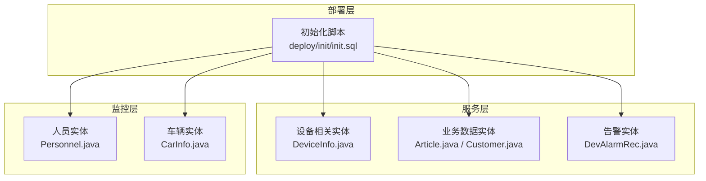
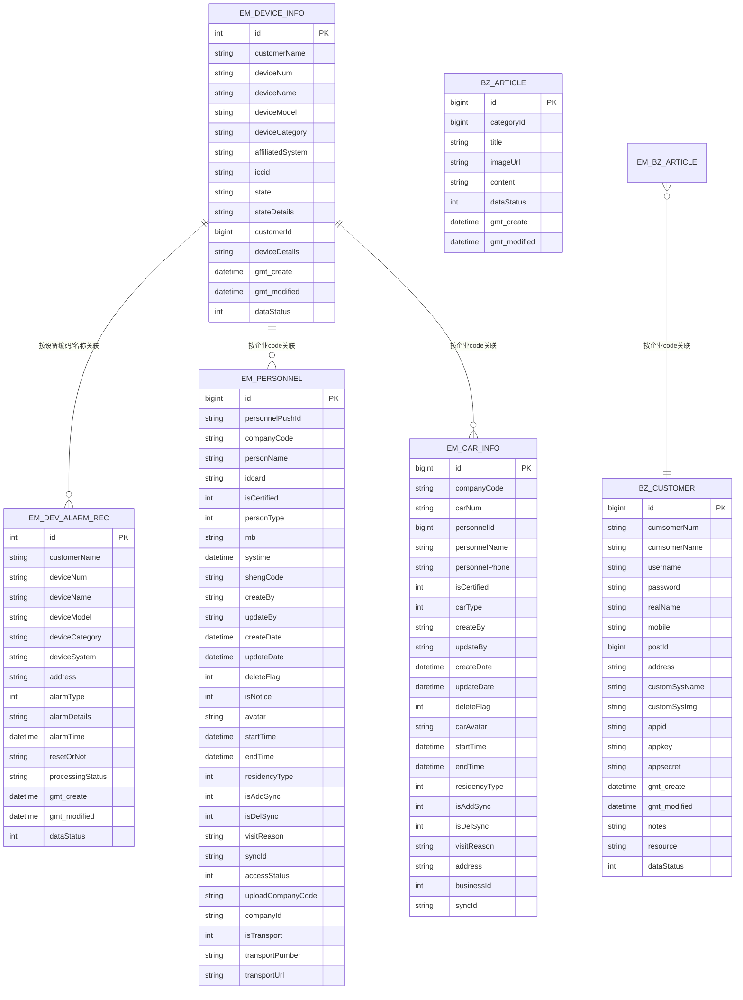
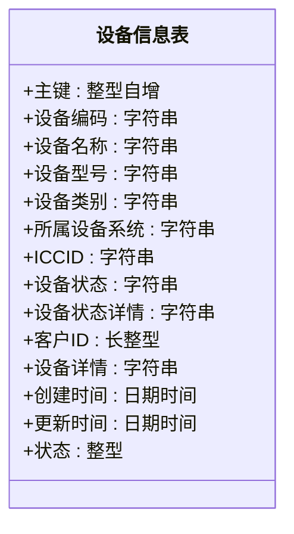
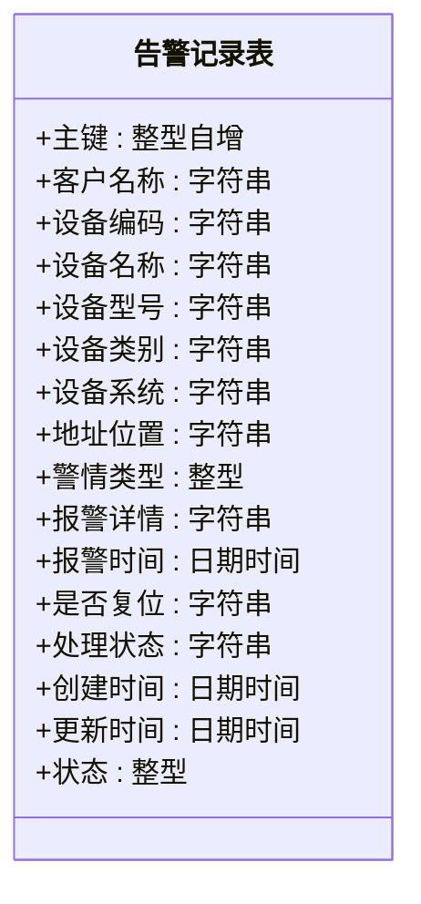
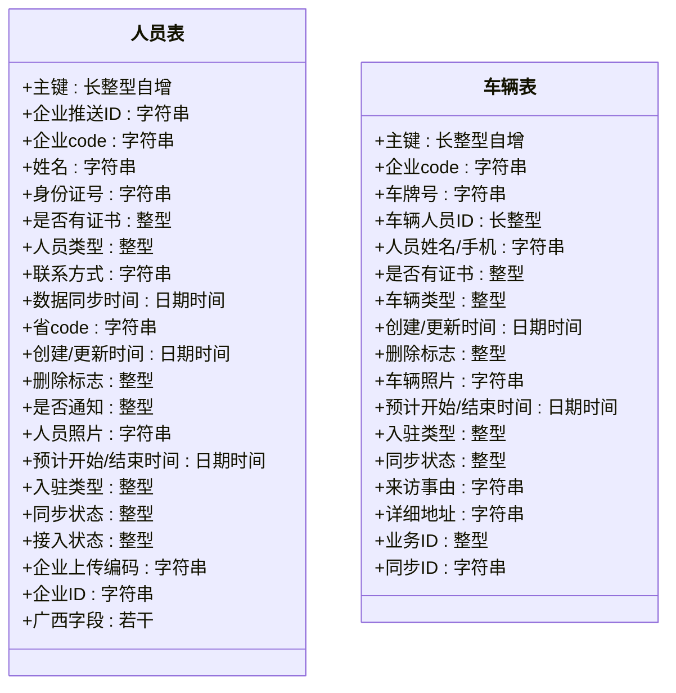
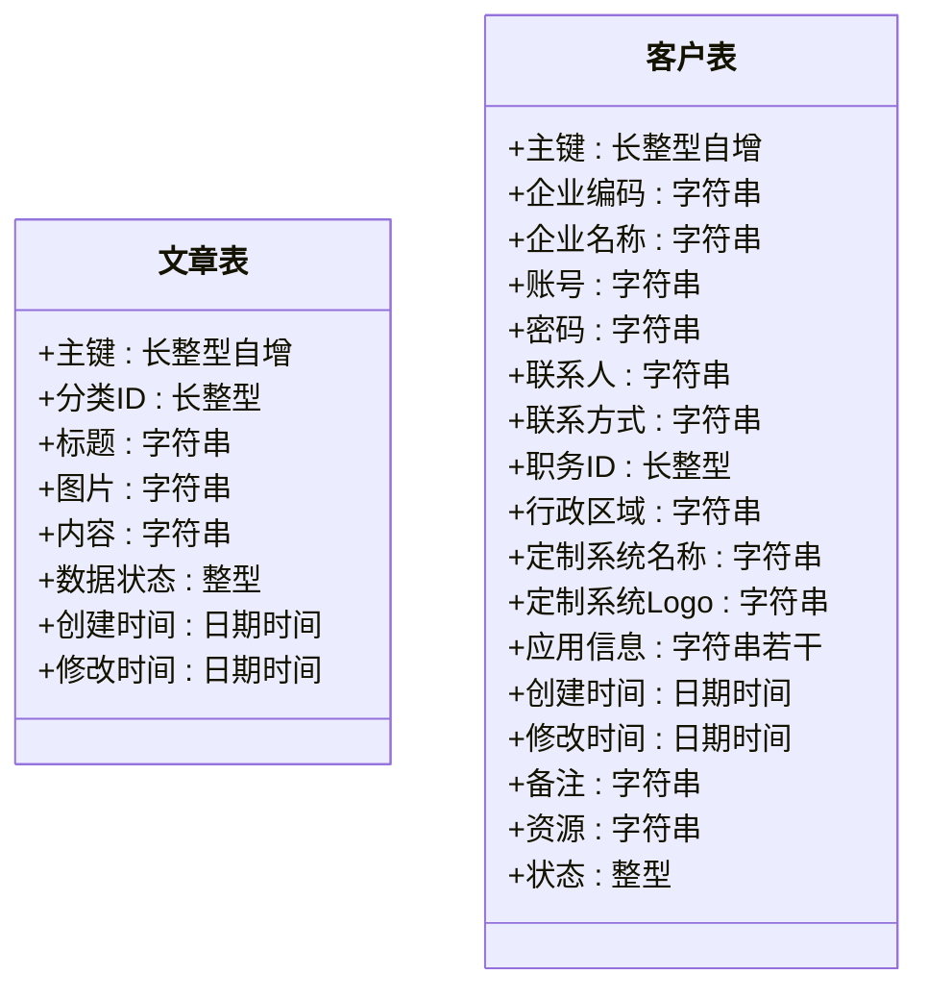
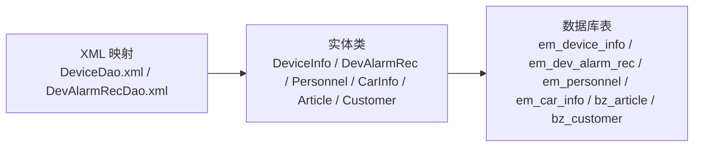

# 核心业务表设计

<cite>
**本文引用的文件**
- [init.sql](file://deploy/init/init.sql)
- [DevAlarmRec.java](file://monkey-service/src/main/java/com/monkey/general/modules/em/entity/DevAlarmRec.java)
- [DeviceInfo.java](file://monkey-service/src/main/java/com/monkey/general/modules/em/entity/DeviceInfo.java)
- [Personnel.java](file://monkey-monitor/src/main/java/com/monkey/general/modules/em/entity/Personnel.java)
- [CarInfo.java](file://monkey-monitor/src/main/java/com/monkey/general/modules/em/entity/CarInfo.java)
- [Article.java](file://monkey-service/src/main/java/com/monkey/general/modules/bz/entity/Article.java)
- [Customer.java](file://monkey-service/src/main/java/com/monkey/general/modules/bz/entity/Customer.java)
- [DeviceDao.xml](file://monkey-service/src/main/resources/mapper/em/DeviceDao.xml)
- [DevAlarmRecDao.xml](file://monkey-service/src/main/resources/mapper/em/DevAlarmRecDao.xml)
</cite>

## 目录
1. [简介](#简介)
2. [项目结构](#项目结构)
3. [核心组件](#核心组件)
4. [架构概览](#架构概览)
5. [详细组件分析](#详细组件分析)
6. [依赖分析](#依赖分析)
7. [性能考虑](#性能考虑)
8. [故障排查指南](#故障排查指南)
9. [结论](#结论)
10. [附录](#附录)

## 简介
本文件面向安威 fireworks 物联网监控平台，聚焦核心业务表的设计与落地实现，覆盖以下主题：
- 设备管理表（设备信息表、设备扩展信息表）
- 告警记录表
- 人员与车辆管理表
- 业务数据表（文章、客户）
- 字段定义、数据类型、约束与索引策略
- 表间关系与外键约束说明
- 主键生成策略、自增序列与 UUID 使用场景
- 业务规则在数据库层面的实现方式
- 典型业务场景下的 SQL 查询示例与性能优化建议
- 数据完整性检查与业务规则验证机制

## 项目结构
围绕核心业务表，项目采用模块化组织，核心实体类位于服务层与监控层，对应的数据库初始化脚本位于部署目录。

**图表来源**
- [init.sql](file://deploy/init/init.sql)
- [DeviceInfo.java](file://monkey-service/src/main/java/com/monkey/general/modules/em/entity/DeviceInfo.java)
- [Article.java](file://monkey-service/src/main/java/com/monkey/general/modules/bz/entity/Article.java)
- [Customer.java](file://monkey-service/src/main/java/com/monkey/general/modules/bz/entity/Customer.java)
- [DevAlarmRec.java](file://monkey-service/src/main/java/com/monkey/general/modules/em/entity/DevAlarmRec.java)
- [Personnel.java](file://monkey-monitor/src/main/java/com/monkey/general/modules/em/entity/Personnel.java)
- [CarInfo.java](file://monkey-monitor/src/main/java/com/monkey/general/modules/em/entity/CarInfo.java)

**章节来源**
- [init.sql](file://deploy/init/init.sql)

## 核心组件
本节从数据库与实体映射两个维度，梳理核心业务表的结构与约束，并给出索引策略与主键生成策略的说明。

- 设备信息表（em_device_info）
  - 字段要点：主键、客户名称、设备编码、设备名称、设备型号、设备类别、所属设备系统、ICCID、设备状态、设备状态详情、客户ID、设备详情、创建/更新时间、状态等
  - 约束与索引：主键自增；建议对设备编码、客户ID建立二级索引以支持高频查询
  - 主键策略：整型自增（AUTO_INCREMENT）

- 告警记录表（em_dev_alarm_rec）
  - 字段要点：主键、客户名称、设备编码/名称/型号/类别/系统、地址位置、警情类型、报警详情、报警时间、是否复位、处理状态、创建/更新时间、状态等
  - 约束与索引：主键自增；建议对设备编码、报警时间、警情类型建立二级索引以支持快速检索与统计
  - 主键策略：整型自增（AUTO_INCREMENT）

- 人员表（em_personnel）
  - 字段要点：主键、企业推送ID、企业code、姓名、身份证号、是否有证书、人员类型、联系方式、数据同步时间、省code、创建/更新时间、删除标志、是否通知、人员照片、预计开始/结束时间、入驻类型、同步状态、接入状态、企业上传编码、企业ID、广西对接字段等
  - 约束与索引：主键大整型；建议对企业code、身份证号、人员类型建立二级索引；对同步时间建立时间索引
  - 主键策略：长整型自增（AUTO_INCREMENT）

- 车辆表（em_car_info）
  - 字段要点：主键、企业code、车牌号、车辆人员ID、人员姓名/手机、是否有证书、车辆类型、创建/更新时间、删除标志、车辆照片、预计开始/结束时间、入驻类型、同步状态、来访事由、详细地址、业务ID、同步ID等
  - 约束与索引：主键大整型；建议对企业code、车牌号、人员ID建立二级索引
  - 主键策略：长整型自增（AUTO_INCREMENT）

- 业务数据表
  - 文章表（bz_article）：主键、分类ID、标题、图片、内容、数据状态、创建/修改时间
  - 客户表（bz_customer）：主键、企业编码/名称、账号/密码、联系人/方式、职务ID、行政区域、定制系统名称/Logo、应用信息、创建/修改时间、备注、资源、状态
  - 约束与索引：主键自增；建议对分类ID、企业编码/名称、账号等建立二级索引
  - 主键策略：长整型自增（AUTO_INCREMENT）

- 主键生成策略与 UUID 使用场景
  - 当前实体映射显示：设备、告警、人员、车辆、文章、客户均采用自增主键策略
  - UUID 使用场景：若未来存在跨库合并、分布式唯一性要求或外部系统对接需要稳定全局唯一标识，可在新增字段时引入 UUID 并建立唯一索引，但需评估存储与索引开销

**章节来源**
- [DeviceInfo.java](file://monkey-service/src/main/java/com/monkey/general/modules/em/entity/DeviceInfo.java)
- [DevAlarmRec.java](file://monkey-service/src/main/java/com/monkey/general/modules/em/entity/DevAlarmRec.java)
- [Personnel.java](file://monkey-monitor/src/main/java/com/monkey/general/modules/em/entity/Personnel.java)
- [CarInfo.java](file://monkey-monitor/src/main/java/com/monkey/general/modules/em/entity/CarInfo.java)
- [Article.java](file://monkey-service/src/main/java/com/monkey/general/modules/bz/entity/Article.java)
- [Customer.java](file://monkey-service/src/main/java/com/monkey/general/modules/bz/entity/Customer.java)

## 架构概览
下图展示核心业务表之间的逻辑关系与典型查询路径。注意：实际外键约束以数据库初始化脚本为准；当前仓库未提供显式外键定义，因此图中仅展示逻辑关联。

**图表来源**
- [DeviceInfo.java](file://monkey-service/src/main/java/com/monkey/general/modules/em/entity/DeviceInfo.java)
- [DevAlarmRec.java](file://monkey-service/src/main/java/com/monkey/general/modules/em/entity/DevAlarmRec.java)
- [Personnel.java](file://monkey-monitor/src/main/java/com/monkey/general/modules/em/entity/Personnel.java)
- [CarInfo.java](file://monkey-monitor/src/main/java/com/monkey/general/modules/em/entity/CarInfo.java)
- [Article.java](file://monkey-service/src/main/java/com/monkey/general/modules/bz/entity/Article.java)
- [Customer.java](file://monkey-service/src/main/java/com/monkey/general/modules/bz/entity/Customer.java)

## 详细组件分析

### 设备管理表（em_device_info）
- 字段与类型：主键、字符串类型的客户名称/设备编码/名称/型号/类别/系统/ICCID/状态/状态详情、数值型客户ID、字符串设备详情、日期时间型创建/更新时间、整型状态
- 约束与索引：主键自增；建议对 deviceNum、customerId 建立二级索引
- 主键策略：整型自增（AUTO_INCREMENT）
- 业务规则：设备状态与状态详情用于反映设备在线/离线与异常状态；设备详情用于扩展设备属性

**图表来源**
- [DeviceInfo.java](file://monkey-service/src/main/java/com/monkey/general/modules/em/entity/DeviceInfo.java)

**章节来源**
- [DeviceInfo.java](file://monkey-service/src/main/java/com/monkey/general/modules/em/entity/DeviceInfo.java)

### 告警记录表（em_dev_alarm_rec）
- 字段与类型：主键、字符串类型的客户名称/设备编码/名称/型号/类别/系统/地址位置、整型警情类型、字符串报警详情、日期时间型报警时间、字符串是否复位/处理状态、日期时间型创建/更新时间、整型状态
- 约束与索引：主键自增；建议对 deviceNum、alarmTime、alarmType 建立二级索引
- 主键策略：整型自增（AUTO_INCREMENT）
- 业务规则：警情类型枚举化（火灾报警、一般报警、故障、事件、离线），报警时间用于排序与统计

**图表来源**
- [DevAlarmRec.java](file://monkey-service/src/main/java/com/monkey/general/modules/em/entity/DevAlarmRec.java)

**章节来源**
- [DevAlarmRec.java](file://monkey-service/src/main/java/com/monkey/general/modules/em/entity/DevAlarmRec.java)

### 人员车辆管理表（em_personnel / em_car_info）
- 人员表（em_personnel）
  - 字段与类型：主键、字符串企业推送ID/企业code/姓名/身份证号/联系方式、整型是否有证书/人员类型/删除标志/是否通知/接入状态/入驻类型、日期时间数据同步时间/预计开始/结束时间、字符串照片/来访事由/上传企业编码/企业ID、以及广西对接字段
  - 约束与索引：主键自增；建议对 companyCode、idcard、personType、accessStatus 建立二级索引
  - 主键策略：长整型自增（AUTO_INCREMENT）
- 车辆表（em_car_info）
  - 字段与类型：主键、字符串企业code/车牌号/人员姓名/手机号/来访事由/详细地址、长整型人员ID、整型是否有证书/车辆类型/删除标志/入驻类型、日期时间创建/更新/预计开始/结束时间、字符串照片/同步ID、业务ID
  - 约束与索引：主键自增；建议对 companyCode、carNum、personnelId 建立二级索引
  - 主键策略：长整型自增（AUTO_INCREMENT）

**图表来源**
- [Personnel.java](file://monkey-monitor/src/main/java/com/monkey/general/modules/em/entity/Personnel.java)
- [CarInfo.java](file://monkey-monitor/src/main/java/com/monkey/general/modules/em/entity/CarInfo.java)

**章节来源**
- [Personnel.java](file://monkey-monitor/src/main/java/com/monkey/general/modules/em/entity/Personnel.java)
- [CarInfo.java](file://monkey-monitor/src/main/java/com/monkey/general/modules/em/entity/CarInfo.java)

### 业务数据表（bz_article / bz_customer）
- 文章表（bz_article）
  - 字段与类型：主键、长整型分类ID、字符串标题/图片/内容、整型数据状态、日期时间创建/修改时间
  - 约束与索引：主键自增；建议对 categoryId、dataStatus 建立二级索引
  - 主键策略：长整型自增（AUTO_INCREMENT）
- 客户表（bz_customer）
  - 字段与类型：主键、字符串企业编码/名称/账号/密码/联系人/方式、长整型职务ID、字符串行政区域/定制系统名称/Logo/应用信息、日期时间创建/修改时间、字符串备注/资源、整型数据状态
  - 约束与索引：主键自增；建议对 cumsomerNum、cumsomerName、username、dataStatus 建立二级索引
  - 主键策略：长整型自增（AUTO_INCREMENT）

**图表来源**
- [Article.java](file://monkey-service/src/main/java/com/monkey/general/modules/bz/entity/Article.java)
- [Customer.java](file://monkey-service/src/main/java/com/monkey/general/modules/bz/entity/Customer.java)

**章节来源**
- [Article.java](file://monkey-service/src/main/java/com/monkey/general/modules/bz/entity/Article.java)
- [Customer.java](file://monkey-service/src/main/java/com/monkey/general/modules/bz/entity/Customer.java)

## 依赖分析
- 实体到数据库映射
  - 各实体通过注解标注表名，MyBatis-Plus 在运行时根据注解生成 SQL
  - 示例：设备信息实体映射至 em_device_info，告警实体映射至 em_dev_alarm_rec
- 查询映射
  - 设备查询映射文件提供按时间与设备编码集合的去重查询模板
  - 告警查询映射文件为空，实际查询由服务层拼装

**图表来源**
- [DeviceDao.xml](file://monkey-service/src/main/resources/mapper/em/DeviceDao.xml)
- [DevAlarmRecDao.xml](file://monkey-service/src/main/resources/mapper/em/DevAlarmRecDao.xml)
- [DeviceInfo.java](file://monkey-service/src/main/java/com/monkey/general/modules/em/entity/DeviceInfo.java)
- [DevAlarmRec.java](file://monkey-service/src/main/java/com/monkey/general/modules/em/entity/DevAlarmRec.java)
- [Personnel.java](file://monkey-monitor/src/main/java/com/monkey/general/modules/em/entity/Personnel.java)
- [CarInfo.java](file://monkey-monitor/src/main/java/com/monkey/general/modules/em/entity/CarInfo.java)
- [Article.java](file://monkey-service/src/main/java/com/monkey/general/modules/bz/entity/Article.java)
- [Customer.java](file://monkey-service/src/main/java/com/monkey/general/modules/bz/entity/Customer.java)

**章节来源**
- [DeviceDao.xml](file://monkey-service/src/main/resources/mapper/em/DeviceDao.xml)
- [DevAlarmRecDao.xml](file://monkey-service/src/main/resources/mapper/em/DevAlarmRecDao.xml)

## 性能考虑
- 索引策略
  - 设备：对 deviceNum、customerId 建二级索引
  - 告警：对 deviceNum、alarmTime、alarmType 建二级索引
  - 人员：对 companyCode、idcard、personType、accessStatus 建二级索引；对 systime 建时间索引
  - 车辆：对 companyCode、carNum、personnelId 建二级索引
  - 业务数据：对 categoryId、cumsomerNum/cumsomerName/username、dataStatus 建二级索引
- 查询优化
  - 使用范围查询时尽量带上最左匹配的索引列
  - 对高频统计（如按天报警数）可考虑物化视图或汇总表
- 主键与自增
  - 自增主键具备顺序性，写入性能较好；跨库合并场景可考虑 UUID 或雪花 ID
- 事务与并发
  - 对高并发写入场景，建议控制单次批量大小并合理设置 binlog/redo 日志参数

## 故障排查指南
- 常见问题
  - 插入重复主键：确认自增种子与偏移量配置一致
  - 查询慢：检查是否命中索引；对 WHERE 条件中的过滤列补充索引
  - 数据不一致：核对实体字段与表结构一致性，确保 MyBatis-Plus 字段填充生效
- 数据完整性
  - 使用整型状态字段统一表示启用/禁用，避免布尔值在不同方言下的差异
  - 对关键业务字段（如设备编码、人员身份证号）建立唯一索引，防止重复
- 业务规则验证
  - 警情类型枚举化并在应用层校验
  - 人员/车辆同步状态字段用于幂等写入与对账

## 结论
本设计文档基于现有实体类与初始化脚本，给出了核心业务表的结构、索引与主键策略，并提供了典型查询与优化建议。后续如需增强唯一性与跨库合并能力，可在新增字段中引入 UUID 并配套唯一索引。

## 附录
- 典型业务场景下的 SQL 查询示例（路径参考）
  - 按设备编码集合与时间范围取最新记录
    - [DeviceDao.xml](file://monkey-service/src/main/resources/mapper/em/DeviceDao.xml)
  - 告警记录按设备与时间范围查询
    - 参考实体字段与索引建议进行 where 条件构建
    - [DevAlarmRec.java](file://monkey-service/src/main/java/com/monkey/general/modules/em/entity/DevAlarmRec.java)
  - 人员与车辆按企业code与类型过滤
    - 参考实体字段与索引建议进行 where 条件构建
    - [Personnel.java](file://monkey-monitor/src/main/java/com/monkey/general/modules/em/entity/Personnel.java)
    - [CarInfo.java](file://monkey-monitor/src/main/java/com/monkey/general/modules/em/entity/CarInfo.java)
  - 文章与客户按状态与关键字过滤
    - 参考实体字段与索引建议进行 where 条件构建
    - [Article.java](file://monkey-service/src/main/java/com/monkey/general/modules/bz/entity/Article.java)
    - [Customer.java](file://monkey-service/src/main/java/com/monkey/general/modules/bz/entity/Customer.java)