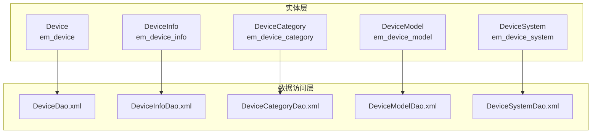
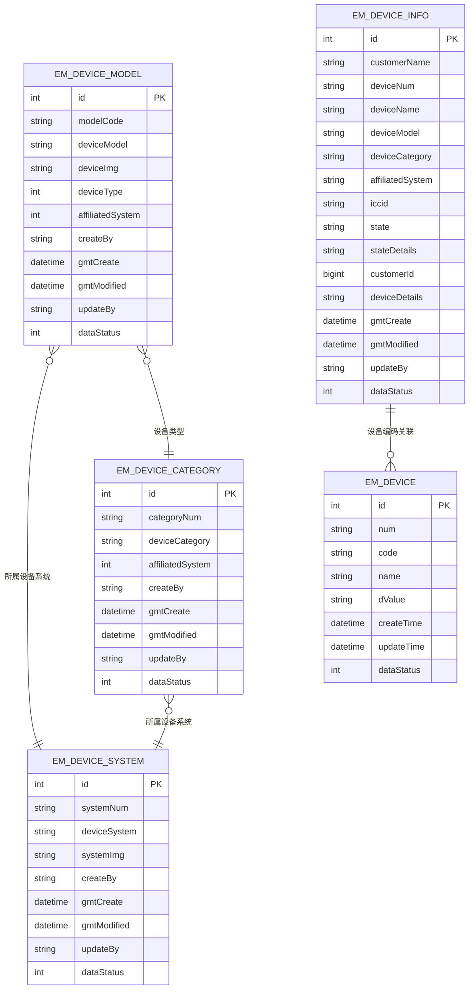
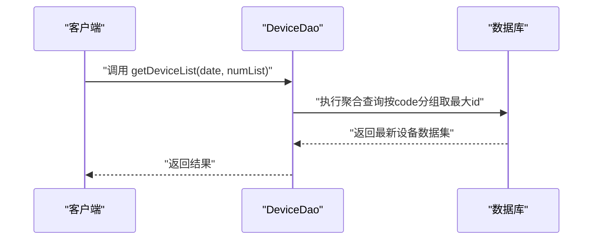
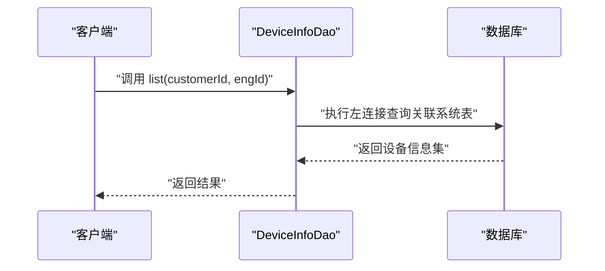
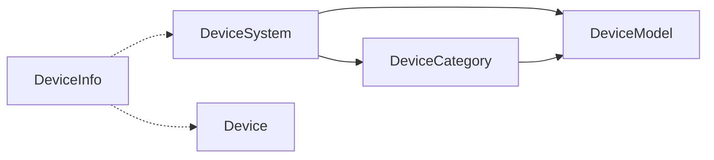

# 设备管理表设计

<cite>
**本文档引用的文件**
- [Device.java](file://monkey-service/src/main/java/com/monkey/general/modules/em/entity/Device.java)
- [DeviceInfo.java](file://monkey-service/src/main/java/com/monkey/general/modules/em/entity/DeviceInfo.java)
- [DeviceCategory.java](file://monkey-service/src/main/java/com/monkey/general/modules/em/entity/DeviceCategory.java)
- [DeviceModel.java](file://monkey-service/src/main/java/com/monkey/general/modules/em/entity/DeviceModel.java)
- [DeviceSystem.java](file://monkey-service/src/main/java/com/monkey/general/modules/em/entity/DeviceSystem.java)
- [DeviceDao.xml](file://monkey-service/src/main/resources/mapper/em/DeviceDao.xml)
- [DeviceInfoDao.xml](file://monkey-service/src/main/resources/mapper/em/DeviceInfoDao.xml)
- [DeviceCategoryDao.xml](file://monkey-service/src/main/resources/mapper/em/DeviceCategoryDao.xml)
- [DeviceModelDao.xml](file://monkey-service/src/main/resources/mapper/em/DeviceModelDao.xml)
- [DeviceSystemDao.xml](file://monkey-service/src/main/resources/mapper/em/DeviceSystemDao.xml)
</cite>

## 目录
1. [简介](#简介)
2. [项目结构](#项目结构)
3. [核心组件](#核心组件)
4. [架构概览](#架构概览)
5. [详细组件分析](#详细组件分析)
6. [依赖分析](#依赖分析)
7. [性能考虑](#性能考虑)
8. [故障排除指南](#故障排除指南)
9. [结论](#结论)

## 简介
本文件为安威 fireworks 物联网监控平台的设备管理表设计文档，覆盖以下核心表：
- 设备表（em_device）
- 设备信息表（em_device_info）
- 设备分类表（em_device_category）
- 设备型号表（em_device_model）
- 设备系统表（em_device_system）

文档从表结构、字段定义、数据类型、约束与索引策略、表间关系与外键约束、设备ID生成策略、状态字段定义、配置信息存储方式、生命周期管理、典型业务场景SQL示例与性能优化建议等方面进行系统化阐述。

## 项目结构
设备管理相关代码采用分层架构组织：
- 实体层：对应数据库表的Java实体类，使用MyBatis-Plus注解映射表结构
- 数据访问层：Mapper XML文件定义SQL查询逻辑
- 控制器层：API控制器负责对外暴露REST接口（不在本文档重点范围）

**图表来源**
- [Device.java:1-68](file://monkey-service/src/main/java/com/monkey/general/modules/em/entity/Device.java#L1-L68)
- [DeviceInfo.java:1-110](file://monkey-service/src/main/java/com/monkey/general/modules/em/entity/DeviceInfo.java#L1-L110)
- [DeviceCategory.java:1-76](file://monkey-service/src/main/java/com/monkey/general/modules/em/entity/DeviceCategory.java#L1-L76)
- [DeviceModel.java:1-86](file://monkey-service/src/main/java/com/monkey/general/modules/em/entity/DeviceModel.java#L1-L86)
- [DeviceSystem.java:1-74](file://monkey-service/src/main/java/com/monkey/general/modules/em/entity/DeviceSystem.java#L1-L74)
- [DeviceDao.xml:1-18](file://monkey-service/src/main/resources/mapper/em/DeviceDao.xml#L1-L18)
- [DeviceInfoDao.xml:1-12](file://monkey-service/src/main/resources/mapper/em/DeviceInfoDao.xml#L1-L12)
- [DeviceCategoryDao.xml:1-18](file://monkey-service/src/main/resources/mapper/em/DeviceCategoryDao.xml#L1-L18)
- [DeviceModelDao.xml:1-17](file://monkey-service/src/main/resources/mapper/em/DeviceModelDao.xml#L1-L17)
- [DeviceSystemDao.xml:1-7](file://monkey-service/src/main/resources/mapper/em/DeviceSystemDao.xml#L1-L7)

**章节来源**
- [Device.java:1-68](file://monkey-service/src/main/java/com/monkey/general/modules/em/entity/Device.java#L1-L68)
- [DeviceInfo.java:1-110](file://monkey-service/src/main/java/com/monkey/general/modules/em/entity/DeviceInfo.java#L1-L110)
- [DeviceCategory.java:1-76](file://monkey-service/src/main/java/com/monkey/general/modules/em/entity/DeviceCategory.java#L1-L76)
- [DeviceModel.java:1-86](file://monkey-service/src/main/java/com/monkey/general/modules/em/entity/DeviceModel.java#L1-L86)
- [DeviceSystem.java:1-74](file://monkey-service/src/main/java/com/monkey/general/modules/em/entity/DeviceSystem.java#L1-L74)

## 核心组件
本节对各表的字段、数据类型、约束与索引策略进行逐项说明，并给出表间关系与外键约束说明。

### 设备表（em_device）
- 表用途：记录设备的采集数据与基础状态
- 关键字段
  - id：整型，主键，自增
  - num：字符串，设备编码
  - code：字符串，感应点位编码
  - name：字符串，感应点位名称
  - dValue：字符串，感应数据
  - createTime：日期时间，创建时间
  - updateTime：日期时间，更新时间
  - dataStatus：整型，状态（0-禁用、1-启用）
- 约束与索引
  - 主键：id
  - 建议索引：code（按点位查询）、num（按设备编码查询）、createTime（按时间范围查询）
- 外键约束
  - 无直接外键关联其他表
- 生命周期
  - 通过dataStatus控制启停；配合createTime/updateTime实现审计追踪
- 典型查询
  - 参考 [DeviceDao.xml:5-16](file://monkey-service/src/main/resources/mapper/em/DeviceDao.xml#L5-L16)，按时间窗口与设备编码集合聚合查询最新记录

**章节来源**
- [Device.java:24-64](file://monkey-service/src/main/java/com/monkey/general/modules/em/entity/Device.java#L24-L64)
- [DeviceDao.xml:5-16](file://monkey-service/src/main/resources/mapper/em/DeviceDao.xml#L5-L16)

### 设备信息表（em_device_info）
- 表用途：设备管理主表，存储设备基本信息与状态
- 关键字段
  - id：整型，主键，自增
  - customerName：字符串，客户名称
  - deviceNum：字符串，设备编码
  - deviceName：字符串，设备名称
  - deviceModel：字符串，设备型号
  - deviceCategory：字符串，设备类别
  - affiliatedSystem：字符串，所属设备系统
  - iccid：字符串，ICCID
  - state：字符串，设备状态
  - stateDetails：字符串，设备状态详情
  - customerId：长整型，客户ID
  - deviceDetails：字符串，设备详情
  - gmtCreate：日期时间，创建时间（自动填充）
  - gmtModified：日期时间，更新时间（自动填充）
  - updateBy：字符串，更新人
  - dataStatus：整型，状态（0-禁用、1-启用）
- 约束与索引
  - 主键：id
  - 建议索引：deviceNum（设备唯一性）、customerId（按客户过滤）、affiliatedSystem（按系统过滤）、state（按状态过滤）
- 外键约束
  - 无直接外键关联其他表
- 生命周期
  - 通过dataStatus控制启停；gmtCreate/gmtModified实现审计追踪
- 典型查询
  - 参考 [DeviceInfoDao.xml:7-10](file://monkey-service/src/main/resources/mapper/em/DeviceInfoDao.xml#L7-L10)，按客户ID与工程ID联表查询设备信息

**章节来源**
- [DeviceInfo.java:23-106](file://monkey-service/src/main/java/com/monkey/general/modules/em/entity/DeviceInfo.java#L23-L106)
- [DeviceInfoDao.xml:7-10](file://monkey-service/src/main/resources/mapper/em/DeviceInfoDao.xml#L7-L10)

### 设备分类表（em_device_category）
- 表用途：设备分类管理
- 关键字段
  - id：整型，主键，自增
  - categoryNum：字符串，设备类别编码
  - deviceCategory：字符串，设备类别
  - affiliatedSystem：整型，所属设备系统（外键字段，但未声明外键约束）
  - createBy：字符串，新建人
  - gmtCreate：日期时间，创建时间（自动填充）
  - gmtModified：日期时间，更新时间（自动填充）
  - updateBy：字符串，更新人
  - dataStatus：整型，状态（0-禁用、1-启用）
- 约束与索引
  - 主键：id
  - 建议索引：categoryNum（唯一性）、affiliatedSystem（按系统过滤）
- 外键约束
  - 无显式外键约束声明
- 生命周期
  - 通过dataStatus控制启停；gmtCreate/gmtModified实现审计追踪
- 典型查询
  - 参考 [DeviceCategoryDao.xml:7-10](file://monkey-service/src/main/resources/mapper/em/DeviceCategoryDao.xml#L7-L10)，联表查询系统名称

**章节来源**
- [DeviceCategory.java:25-72](file://monkey-service/src/main/java/com/monkey/general/modules/em/entity/DeviceCategory.java#L25-L72)
- [DeviceCategoryDao.xml:7-10](file://monkey-service/src/main/resources/mapper/em/DeviceCategoryDao.xml#L7-L10)

### 设备型号表（em_device_model）
- 表用途：设备型号管理
- 关键字段
  - id：整型，主键，自增
  - modelCode：字符串，设备型号编码
  - deviceModel：字符串，设备型号
  - deviceImg：字符串，设备图片
  - deviceType：整型，设备类型（外键字段，但未声明外键约束）
  - affiliatedSystem：整型，所属设备系统（外键字段，但未声明外键约束）
  - createBy：字符串，新建人
  - gmtCreate：日期时间，创建时间（自动填充）
  - gmtModified：日期时间，更新时间（自动填充）
  - updateBy：字符串，更新人
  - dataStatus：整型，状态（0-禁用、1-启用）
- 约束与索引
  - 主键：id
  - 建议索引：modelCode（唯一性）、deviceType（按类型过滤）、affiliatedSystem（按系统过滤）
- 外键约束
  - 无显式外键约束声明
- 生命周期
  - 通过dataStatus控制启停；gmtCreate/gmtModified实现审计追踪
- 典型查询
  - 参考 [DeviceModelDao.xml:9-14](file://monkey-service/src/main/resources/mapper/em/DeviceModelDao.xml#L9-L14)，联表查询系统与分类名称

**章节来源**
- [DeviceModel.java:25-82](file://monkey-service/src/main/java/com/monkey/general/modules/em/entity/DeviceModel.java#L25-L82)
- [DeviceModelDao.xml:9-14](file://monkey-service/src/main/resources/mapper/em/DeviceModelDao.xml#L9-L14)

### 设备系统表（em_device_system）
- 表用途：设备系统管理
- 关键字段
  - id：整型，主键，自增
  - systemNum：字符串，设备系统编码
  - deviceSystem：字符串，设备系统
  - systemImg：字符串，消防系统配图
  - createBy：字符串，新建人
  - gmtCreate：日期时间，创建时间（自动填充）
  - gmtModified：日期时间，更新时间（自动填充）
  - updateBy：字符串，更新人
  - dataStatus：整型，状态（0-禁用、1-启用）
- 约束与索引
  - 主键：id
  - 建议索引：systemNum（唯一性）
- 外键约束
  - 无显式外键约束声明
- 生命周期
  - 通过dataStatus控制启停；gmtCreate/gmtModified实现审计追踪

**章节来源**
- [DeviceSystem.java:23-70](file://monkey-service/src/main/java/com/monkey/general/modules/em/entity/DeviceSystem.java#L23-L70)

## 架构概览
下图展示设备管理相关表之间的关系与外键约束说明：

**图表来源**
- [DeviceCategory.java:45-45](file://monkey-service/src/main/java/com/monkey/general/modules/em/entity/DeviceCategory.java#L45-L45)
- [DeviceModel.java:50-55](file://monkey-service/src/main/java/com/monkey/general/modules/em/entity/DeviceModel.java#L50-L55)
- [DeviceModel.java:52-55](file://monkey-service/src/main/java/com/monkey/general/modules/em/entity/DeviceModel.java#L52-L55)
- [DeviceInfo.java:48-58](file://monkey-service/src/main/java/com/monkey/general/modules/em/entity/DeviceInfo.java#L48-L58)
- [Device.java:34-39](file://monkey-service/src/main/java/com/monkey/general/modules/em/entity/Device.java#L34-L39)

说明
- 设备分类表（em_device_category）通过字段affiliatedSystem指向设备系统表（em_device_system）
- 设备型号表（em_device_model）通过字段deviceType指向设备分类表（em_device_category），通过字段affiliatedSystem指向设备系统表（em_device_system）
- 设备信息表（em_device_info）通过字段deviceNum与设备表（em_device）的num建立关联（逻辑关联，未声明外键约束）
- 设备信息表（em_device_info）通过字段affiliatedSystem与设备系统表（em_device_system）关联（逻辑关联，未声明外键约束）

## 详细组件分析

### 设备表（em_device）分析
- 字段与数据类型
  - id：整型，主键
  - num：字符串，设备编码
  - code：字符串，感应点位编码
  - name：字符串，感应点位名称
  - dValue：字符串，感应数据
  - createTime/updateTime：日期时间
  - dataStatus：整型（0-禁用、1-启用）
- 索引策略
  - 建议在code上建立索引以支持按点位快速查询
  - 建议在num上建立索引以支持按设备编码查询
  - 建议在createTime上建立索引以支持时间范围查询
- 外键约束
  - 无外键约束
- 生命周期管理
  - dataStatus控制启停
  - createTime/updateTime用于审计
- 典型业务场景
  - 查询某时间窗口内各点位最新数据：参考 [DeviceDao.xml:5-16](file://monkey-service/src/main/resources/mapper/em/DeviceDao.xml#L5-L16)

**图表来源**
- [DeviceDao.xml:5-16](file://monkey-service/src/main/resources/mapper/em/DeviceDao.xml#L5-L16)

**章节来源**
- [Device.java:24-64](file://monkey-service/src/main/java/com/monkey/general/modules/em/entity/Device.java#L24-L64)
- [DeviceDao.xml:5-16](file://monkey-service/src/main/resources/mapper/em/DeviceDao.xml#L5-L16)

### 设备信息表（em_device_info）分析
- 字段与数据类型
  - id：整型，主键
  - deviceNum：字符串，设备编码
  - deviceName：字符串，设备名称
  - deviceModel/deviceCategory：字符串，型号与分类
  - affiliatedSystem：字符串，所属系统
  - iccid：字符串
  - state/stateDetails：字符串，状态与状态详情
  - customerId：长整型，客户ID
  - deviceDetails：字符串，设备详情
  - gmtCreate/gmtModified/updateBy/dataStatus：审计与状态字段
- 索引策略
  - 建议在deviceNum上建立唯一索引以保证设备编码唯一性
  - 建议在customerId上建立索引以支持按客户过滤
  - 建议在state上建立索引以支持按状态过滤
- 外键约束
  - 无外键约束
- 生命周期管理
  - dataStatus控制启停
  - gmtCreate/gmtModified自动填充
- 典型业务场景
  - 按客户与工程ID查询设备信息：参考 [DeviceInfoDao.xml:7-10](file://monkey-service/src/main/resources/mapper/em/DeviceInfoDao.xml#L7-L10)

**图表来源**
- [DeviceInfoDao.xml:7-10](file://monkey-service/src/main/resources/mapper/em/DeviceInfoDao.xml#L7-L10)

**章节来源**
- [DeviceInfo.java:23-106](file://monkey-service/src/main/java/com/monkey/general/modules/em/entity/DeviceInfo.java#L23-L106)
- [DeviceInfoDao.xml:7-10](file://monkey-service/src/main/resources/mapper/em/DeviceInfoDao.xml#L7-L10)

### 设备分类表（em_device_category）分析
- 字段与数据类型
  - id：整型，主键
  - categoryNum：字符串，类别编码
  - deviceCategory：字符串，类别名称
  - affiliatedSystem：整型，所属系统
  - createBy/gmtCreate/gmtModified/updateBy/dataStatus：审计与状态字段
- 索引策略
  - 建议在categoryNum上建立唯一索引
  - 建议在affiliatedSystem上建立索引以支持按系统过滤
- 外键约束
  - 无外键约束
- 典型业务场景
  - 联表查询系统名称：参考 [DeviceCategoryDao.xml:7-10](file://monkey-service/src/main/resources/mapper/em/DeviceCategoryDao.xml#L7-L10)

**章节来源**
- [DeviceCategory.java:25-72](file://monkey-service/src/main/java/com/monkey/general/modules/em/entity/DeviceCategory.java#L25-L72)
- [DeviceCategoryDao.xml:7-10](file://monkey-service/src/main/resources/mapper/em/DeviceCategoryDao.xml#L7-L10)

### 设备型号表（em_device_model）分析
- 字段与数据类型
  - id：整型，主键
  - modelCode：字符串，型号编码
  - deviceModel：字符串，型号名称
  - deviceImg：字符串，设备图片
  - deviceType：整型，设备类型（分类ID）
  - affiliatedSystem：整型，所属系统
  - createBy/gmtCreate/gmtModified/updateBy/dataStatus：审计与状态字段
- 索引策略
  - 建议在modelCode上建立唯一索引
  - 建议在deviceType与affiliatedSystem上建立索引以支持按类型与系统过滤
- 外键约束
  - 无外键约束
- 典型业务场景
  - 联表查询系统与分类名称：参考 [DeviceModelDao.xml:9-14](file://monkey-service/src/main/resources/mapper/em/DeviceModelDao.xml#L9-L14)

**章节来源**
- [DeviceModel.java:25-82](file://monkey-service/src/main/java/com/monkey/general/modules/em/entity/DeviceModel.java#L25-L82)
- [DeviceModelDao.xml:9-14](file://monkey-service/src/main/resources/mapper/em/DeviceModelDao.xml#L9-L14)

### 设备系统表（em_device_system）分析
- 字段与数据类型
  - id：整型，主键
  - systemNum：字符串，系统编码
  - deviceSystem：字符串，系统名称
  - systemImg：字符串，系统配图
  - createBy/gmtCreate/gmtModified/updateBy/dataStatus：审计与状态字段
- 索引策略
  - 建议在systemNum上建立唯一索引
- 外键约束
  - 无外键约束
- 典型业务场景
  - 系统基础信息维护与查询

**章节来源**
- [DeviceSystem.java:23-70](file://monkey-service/src/main/java/com/monkey/general/modules/em/entity/DeviceSystem.java#L23-L70)

## 依赖分析
- 实体类与表的映射
  - 各实体类通过注解映射到对应表名，字段与表结构一一对应
- 查询依赖
  - DeviceDao.xml依赖em_device表
  - DeviceInfoDao.xml依赖em_device_info与em_device_system表
  - DeviceCategoryDao.xml依赖em_device_category与em_device_system表
  - DeviceModelDao.xml依赖em_device_model、em_device_system与em_device_category表
- 外键关系
  - 逻辑外键：em_device_model.deviceType → em_device_category.id
  - 逻辑外键：em_device_model.affiliatedSystem → em_device_system.id
  - 逻辑外键：em_device_category.affiliatedSystem → em_device_system.id
  - 逻辑关联：em_device_info.deviceNum 与 em_device.num
  - 逻辑关联：em_device_info.affiliatedSystem 与 em_device_system.id

**图表来源**
- [DeviceCategory.java:45-45](file://monkey-service/src/main/java/com/monkey/general/modules/em/entity/DeviceCategory.java#L45-L45)
- [DeviceModel.java:50-55](file://monkey-service/src/main/java/com/monkey/general/modules/em/entity/DeviceModel.java#L50-L55)
- [DeviceModel.java:52-55](file://monkey-service/src/main/java/com/monkey/general/modules/em/entity/DeviceModel.java#L52-L55)
- [DeviceInfo.java:48-58](file://monkey-service/src/main/java/com/monkey/general/modules/em/entity/DeviceInfo.java#L48-L58)
- [Device.java:34-39](file://monkey-service/src/main/java/com/monkey/general/modules/em/entity/Device.java#L34-L39)

**章节来源**
- [DeviceCategoryDao.xml:7-10](file://monkey-service/src/main/resources/mapper/em/DeviceCategoryDao.xml#L7-L10)
- [DeviceModelDao.xml:9-14](file://monkey-service/src/main/resources/mapper/em/DeviceModelDao.xml#L9-L14)
- [DeviceInfoDao.xml:7-10](file://monkey-service/src/main/resources/mapper/em/DeviceInfoDao.xml#L7-L10)

## 性能考虑
- 索引设计
  - em_device：建议在code、num、createTime建立索引
  - em_device_info：建议在deviceNum（唯一）、customerId、state建立索引
  - em_device_category：建议在categoryNum、affiliatedSystem建立索引
  - em_device_model：建议在modelCode、deviceType、affiliatedSystem建立索引
  - em_device_system：建议在systemNum建立索引
- 查询优化
  - 使用联合索引覆盖常见过滤条件（如customerId+state）
  - 避免SELECT *，仅选择必要列
  - 对于大数据量表，优先使用LIMIT限制结果集
- 写入优化
  - 批量插入与更新，减少事务开销
  - 合理设置dataStatus字段，避免频繁全表扫描
- 缓存策略
  - 对热点查询（如按设备编码查询）引入缓存
  - 对系统配置类数据（如设备系统、分类、型号）进行缓存

## 故障排除指南
- 常见问题
  - 设备编码重复：检查em_device_info.deviceNum唯一性约束是否生效
  - 查询性能差：确认相关字段是否建立索引，是否存在全表扫描
  - 关联查询异常：检查逻辑外键字段是否正确，确保数据一致性
- 排查步骤
  - 使用EXPLAIN分析慢查询SQL
  - 校验索引是否存在且有效
  - 检查dataStatus字段是否正确过滤无效数据
- 修复建议
  - 为高频查询字段添加合适索引
  - 规范数据录入流程，避免重复编码
  - 在应用层增加数据校验与去重逻辑

## 结论
本设计文档基于现有实体类与Mapper XML，梳理了设备管理相关表的结构、字段、索引与外键关系，并给出了生命周期管理、典型业务场景SQL与性能优化建议。实际生产环境中建议补充显式外键约束与唯一性约束，完善索引策略并结合缓存提升查询性能。