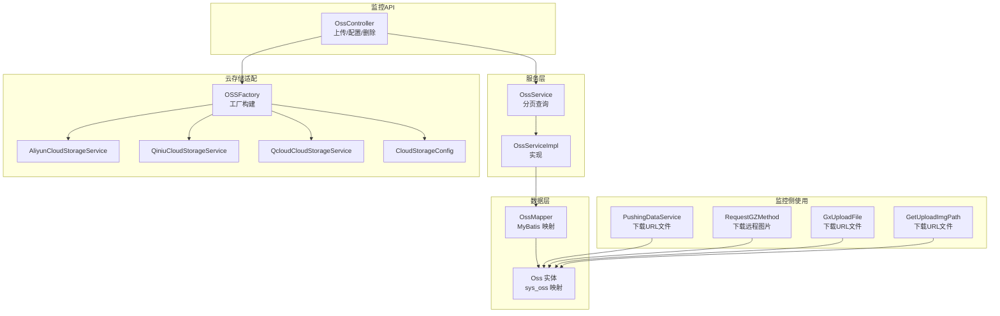
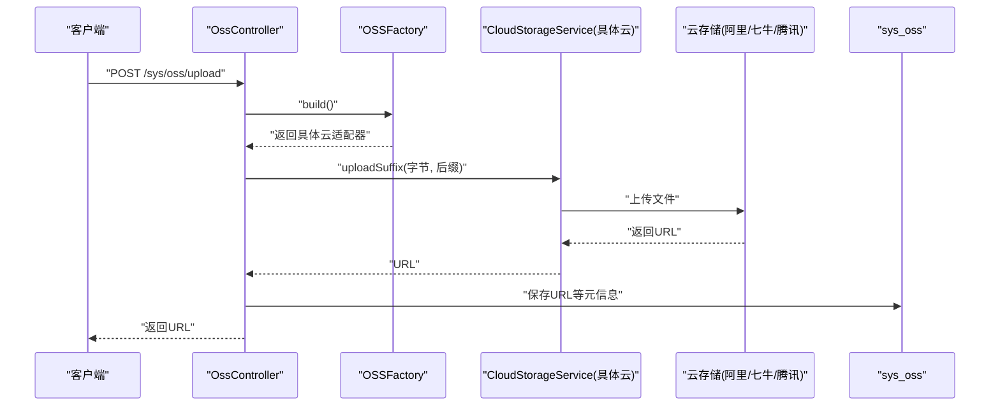
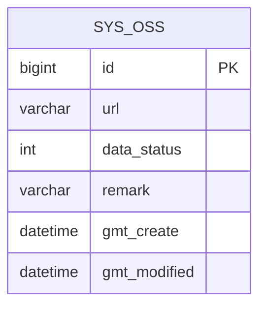
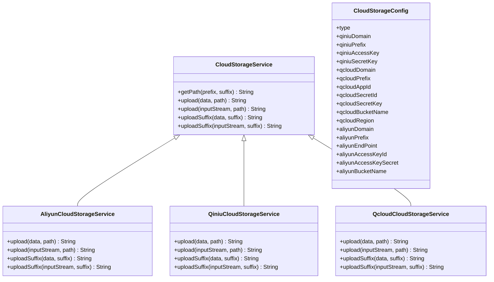
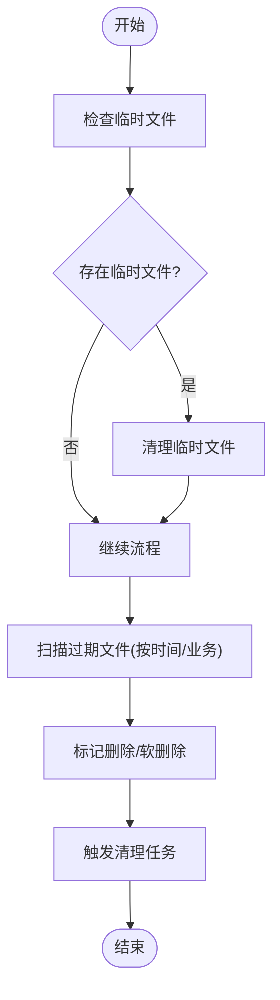
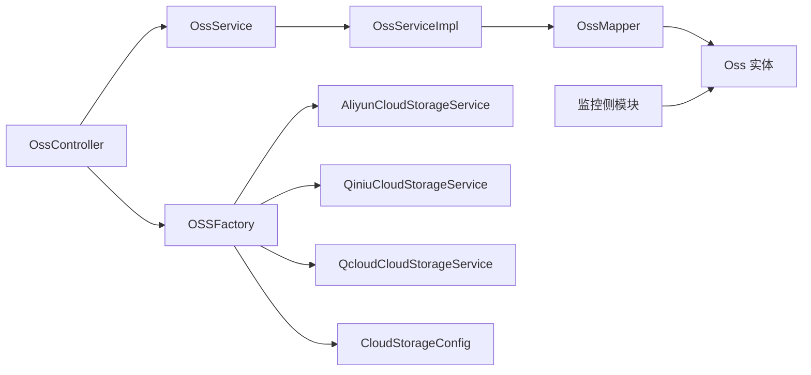

# 文件存储表设计

<cite>
**本文引用的文件**
- [OssController.java](file://monkey-monitor-api/src/main/java/com/monkey/general/controller/OssController.java)
- [Oss.java](file://monkey-service/src/main/java/com/monkey/general/modules/oss/entity/Oss.java)
- [OssMapper.java](file://monkey-service/src/main/java/com/monkey/general/modules/oss/mapper/OssMapper.java)
- [OssMapper.xml](file://monkey-service/src/main/resources/mapper/oss/OssMapper.xml)
- [OssServiceImpl.java](file://monkey-service/src/main/java/com/monkey/general/modules/oss/service/impl/OssServiceImpl.java)
- [CloudStorageService.java](file://monkey-service/src/main/java/com/monkey/general/modules/oss/cloud/CloudStorageService.java)
- [CloudStorageConfig.java](file://monkey-service/src/main/java/com/monkey/general/modules/oss/cloud/CloudStorageConfig.java)
- [AliyunCloudStorageService.java](file://monkey-service/src/main/java/com/monkey/general/modules/oss/cloud/AliyunCloudStorageService.java)
- [QiniuCloudStorageService.java](file://monkey-service/src/main/java/com/monkey/general/modules/oss/cloud/QiniuCloudStorageService.java)
- [QcloudCloudStorageService.java](file://monkey-service/src/main/java/com/monkey/general/modules/oss/cloud/QcloudCloudStorageService.java)
- [init.sql](file://deploy/init/init.sql)
- [PushingDataService.java](file://monkey-monitor/src/main/java/com/monkey/general/platform/push/PushingDataService.java)
- [RequestGZMethod.java](file://monkey-monitor/src/main/java/com/monkey/general/util/gz/util/RequestGZMethod.java)
- [GxUploadFile.java](file://monkey-monitor/src/main/java/com/monkey/general/platform/push/gx/GxUploadFile.java)
- [GetUploadImgPath.java](file://monkey-monitor/src/main/java/com/monkey/general/config/mqtt/ynsend/GetUploadImgPath.java)
- [OSSFactory.java](file://monkey-service/src/main/java/com/monkey/general/modules/oss/cloud/OSSFactory.java)
</cite>

## 目录
1. [简介](#简介)
2. [项目结构](#项目结构)
3. [核心组件](#核心组件)
4. [架构总览](#架构总览)
5. [详细组件分析](#详细组件分析)
6. [依赖关系分析](#依赖关系分析)
7. [性能考虑](#性能考虑)
8. [故障排查指南](#故障排查指南)
9. [结论](#结论)
10. [附录](#附录)

## 简介
本文件面向安威 fireworks 物联网监控平台，系统化梳理文件存储表设计与多云存储集成架构。重点覆盖以下方面：
- 文件存储表（sys_oss）字段结构与用途
- 多云存储适配器设计（阿里云OSS、七牛云存储、腾讯云COS）
- 文件元数据管理（文件MD5校验、文件哈希、上传时间、服务端签名）
- 文件生命周期管理（临时文件清理、过期文件删除、存储配额控制）
- 文件访问控制（URL签名、权限验证、防盗链保护）
- 上传下载性能优化（断点续传、并发上传、CDN加速）
- 扩展性与成本优化方案

## 项目结构
围绕文件存储的核心模块分布如下：
- 控制层：OssController 提供上传、配置查看与删除接口
- 服务层：OssService 及其实现负责分页查询与持久化
- 数据层：Oss 实体、OssMapper 映射 sys_oss 表
- 云存储适配：CloudStorageService 抽象类及各云实现
- 工厂与配置：OSSFactory、CloudStorageConfig
- 监控侧使用：多处业务模块通过URL下载并处理文件，涉及临时文件清理

**图表来源**
- [OssController.java:1-133](file://monkey-monitor-api/src/main/java/com/monkey/general/controller/OssController.java#L1-L133)
- [OssServiceImpl.java:1-29](file://monkey-service/src/main/java/com/monkey/general/modules/oss/service/impl/OssServiceImpl.java#L1-L29)
- [OssMapper.java:1-13](file://monkey-service/src/main/java/com/monkey/general/modules/oss/mapper/OssMapper.java#L1-L13)
- [Oss.java:1-58](file://monkey-service/src/main/java/com/monkey/general/modules/oss/entity/Oss.java#L1-L58)
- [CloudStorageService.java:1-52](file://monkey-service/src/main/java/com/monkey/general/modules/oss/cloud/CloudStorageService.java#L1-L52)
- [AliyunCloudStorageService.java:1-56](file://monkey-service/src/main/java/com/monkey/general/modules/oss/cloud/AliyunCloudStorageService.java#L1-L56)
- [QiniuCloudStorageService.java:1-43](file://monkey-service/src/main/java/com/monkey/general/modules/oss/cloud/QiniuCloudStorageService.java#L1-L43)
- [QcloudCloudStorageService.java:1-98](file://monkey-service/src/main/java/com/monkey/general/modules/oss/cloud/QcloudCloudStorageService.java#L1-L98)
- [PushingDataService.java:1200-1277](file://monkey-monitor/src/main/java/com/monkey/general/platform/push/PushingDataService.java#L1200-L1277)
- [RequestGZMethod.java:354-395](file://monkey-monitor/src/main/java/com/monkey/general/util/gz/util/RequestGZMethod.java#L354-L395)
- [GxUploadFile.java:95-126](file://monkey-monitor/src/main/java/com/monkey/general/platform/push/gx/GxUploadFile.java#L95-L126)
- [GetUploadImgPath.java:95-130](file://monkey-monitor/src/main/java/com/monkey/general/config/mqtt/ynsend/GetUploadImgPath.java#L95-L130)

**章节来源**
- [OssController.java:1-133](file://monkey-monitor-api/src/main/java/com/monkey/general/controller/OssController.java#L1-L133)
- [OssServiceImpl.java:1-29](file://monkey-service/src/main/java/com/monkey/general/modules/oss/service/impl/OssServiceImpl.java#L1-L29)
- [OssMapper.java:1-13](file://monkey-service/src/main/java/com/monkey/general/modules/oss/mapper/OssMapper.java#L1-L13)
- [Oss.java:1-58](file://monkey-service/src/main/java/com/monkey/general/modules/oss/entity/Oss.java#L1-L58)

## 核心组件
- 文件存储表（sys_oss）
  - 字段：主键、URL地址、数据状态、备注、创建时间、更新时间
  - 用途：记录上传后的文件访问地址与元信息，支撑后续下载与生命周期管理
- 云存储配置（CloudStorageConfig）
  - 字段：类型（1=七牛、2=阿里云、3=腾讯云）、域名、路径前缀、密钥、桶名、区域等
  - 用途：统一管理各云厂商的接入参数与域名
- 云存储适配器（CloudStorageService 抽象类 + 各云实现）
  - 路径生成：基于日期与UUID生成唯一路径
  - 上传接口：支持字节数组与输入流上传
  - 各云差异：域名拼接、前缀处理、认证方式与SDK差异
- 控制器（OssController）
  - 接口：列表、查看配置、保存配置、上传文件、删除
  - 逻辑：读取配置、调用工厂构建适配器、上传并落库

**章节来源**
- [Oss.java:1-58](file://monkey-service/src/main/java/com/monkey/general/modules/oss/entity/Oss.java#L1-L58)
- [CloudStorageConfig.java:1-86](file://monkey-service/src/main/java/com/monkey/general/modules/oss/cloud/CloudStorageConfig.java#L1-L86)
- [CloudStorageService.java:1-52](file://monkey-service/src/main/java/com/monkey/general/modules/oss/cloud/CloudStorageService.java#L1-L52)
- [OssController.java:1-133](file://monkey-monitor-api/src/main/java/com/monkey/general/controller/OssController.java#L1-L133)

## 架构总览
文件上传流程概览：
- 客户端上传文件至监控API
- API读取云存储配置，通过工厂构建对应云适配器
- 适配器上传文件至目标云存储，返回可访问URL
- 将URL写入sys_oss表，完成持久化

**图表来源**
- [OssController.java:101-118](file://monkey-monitor-api/src/main/java/com/monkey/general/controller/OssController.java#L101-L118)
- [OSSFactory.java](file://monkey-service/src/main/java/com/monkey/general/modules/oss/cloud/OSSFactory.java)
- [AliyunCloudStorageService.java:31-55](file://monkey-service/src/main/java/com/monkey/general/modules/oss/cloud/AliyunCloudStorageService.java#L31-L55)
- [QiniuCloudStorageService.java:36-43](file://monkey-service/src/main/java/com/monkey/general/modules/oss/cloud/QiniuCloudStorageService.java#L36-L43)
- [QcloudCloudStorageService.java:52-98](file://monkey-service/src/main/java/com/monkey/general/modules/oss/cloud/QcloudCloudStorageService.java#L52-L98)
- [Oss.java:20-58](file://monkey-service/src/main/java/com/monkey/general/modules/oss/entity/Oss.java#L20-L58)

## 详细组件分析

### 文件存储表（sys_oss）设计
- 表结构要点
  - 主键：自增ID
  - URL地址：文件最终可访问地址
  - 数据状态：0-禁用、1-启用（用于软删除/停用）
  - 备注：可选说明
  - 创建/更新时间：自动填充
- 字段与用途
  - 主键：唯一标识
  - URL：对外访问入口，配合云存储域名与路径前缀
  - 状态：便于审计与回收
  - 时间：用于排序与生命周期管理
- 与业务关联
  - 控制器在上传成功后写入URL
  - 监控侧模块通过URL下载并处理文件，涉及临时文件清理

**图表来源**
- [Oss.java:20-58](file://monkey-service/src/main/java/com/monkey/general/modules/oss/entity/Oss.java#L20-L58)

**章节来源**
- [Oss.java:1-58](file://monkey-service/src/main/java/com/monkey/general/modules/oss/entity/Oss.java#L1-L58)
- [OssMapper.java:1-13](file://monkey-service/src/main/java/com/monkey/general/modules/oss/mapper/OssMapper.java#L1-L13)
- [OssMapper.xml:1-6](file://monkey-service/src/main/resources/mapper/oss/OssMapper.xml#L1-L6)

### 多云存储适配器设计
- 抽象层（CloudStorageService）
  - 统一路径生成规则（日期/UUID/前缀/后缀）
  - 抽象上传接口（字节数组、输入流、按后缀上传）
- 阿里云OSS（AliyunCloudStorageService）
  - 使用OSSClient上传至指定Bucket
  - 返回域名+路径的URL
- 七牛云存储（QiniuCloudStorageService）
  - 使用UploadManager与鉴权Token上传
  - 返回域名+路径的URL
- 腾讯云COS（QcloudCloudStorageService）
  - 使用COSClient上传，路径需以“/”开头
  - 返回域名+路径的URL
- 工厂（OSSFactory）
  - 根据配置类型选择具体适配器实例

**图表来源**
- [CloudStorageService.java:1-52](file://monkey-service/src/main/java/com/monkey/general/modules/oss/cloud/CloudStorageService.java#L1-L52)
- [AliyunCloudStorageService.java:1-56](file://monkey-service/src/main/java/com/monkey/general/modules/oss/cloud/AliyunCloudStorageService.java#L1-L56)
- [QiniuCloudStorageService.java:1-43](file://monkey-service/src/main/java/com/monkey/general/modules/oss/cloud/QiniuCloudStorageService.java#L1-L43)
- [QcloudCloudStorageService.java:1-98](file://monkey-service/src/main/java/com/monkey/general/modules/oss/cloud/QcloudCloudStorageService.java#L1-L98)
- [CloudStorageConfig.java:1-86](file://monkey-service/src/main/java/com/monkey/general/modules/oss/cloud/CloudStorageConfig.java#L1-L86)

**章节来源**
- [CloudStorageService.java:1-52](file://monkey-service/src/main/java/com/monkey/general/modules/oss/cloud/CloudStorageService.java#L1-L52)
- [AliyunCloudStorageService.java:1-56](file://monkey-service/src/main/java/com/monkey/general/modules/oss/cloud/AliyunCloudStorageService.java#L1-L56)
- [QiniuCloudStorageService.java:1-43](file://monkey-service/src/main/java/com/monkey/general/modules/oss/cloud/QiniuCloudStorageService.java#L1-L43)
- [QcloudCloudStorageService.java:1-98](file://monkey-service/src/main/java/com/monkey/general/modules/oss/cloud/QcloudCloudStorageService.java#L1-L98)
- [CloudStorageConfig.java:1-86](file://monkey-service/src/main/java/com/monkey/general/modules/oss/cloud/CloudStorageConfig.java#L1-L86)

### 文件元数据管理
- 文件MD5校验与哈希
  - 当前代码未直接体现MD5/HASH字段；可在实体与表中扩展字段以记录哈希值，用于重复检测与完整性校验
- 上传时间
  - sys_oss 的创建/更新时间可用于统计与审计
- 服务端签名
  - 七牛与腾讯云均支持服务端签名；可在适配器中增加签名生成与有效期控制逻辑
- 建议字段（扩展）
  - md5_hash、sha1_hash、file_size、file_type、storage_bucket、storage_status

**章节来源**
- [Oss.java:20-58](file://monkey-service/src/main/java/com/monkey/general/modules/oss/entity/Oss.java#L20-L58)
- [QiniuCloudStorageService.java:30-34](file://monkey-service/src/main/java/com/monkey/general/modules/oss/cloud/QiniuCloudStorageService.java#L30-L34)
- [QcloudCloudStorageService.java:45-50](file://monkey-service/src/main/java/com/monkey/general/modules/oss/cloud/QcloudCloudStorageService.java#L45-L50)

### 文件生命周期管理
- 临时文件清理
  - 监控侧模块在下载远程图片或文档后会创建临时文件，并在finally块中清理
  - 建议：统一清理策略与异常兜底，避免残留
- 过期文件删除
  - 建议：结合上传时间与业务策略定期扫描sys_oss，标记过期URL并触发删除
- 存储配额控制
  - 建议：在sys_oss中增加file_size与storage_bucket字段，结合阈值告警与自动清理

**图表来源**
- [RequestGZMethod.java:454-461](file://monkey-monitor/src/main/java/com/monkey/general/util/gz/util/RequestGZMethod.java#L454-L461)
- [PushingDataService.java:1200-1207](file://monkey-monitor/src/main/java/com/monkey/general/platform/push/PushingDataService.java#L1200-L1207)
- [GxUploadFile.java:95-104](file://monkey-monitor/src/main/java/com/monkey/general/platform/push/gx/GxUploadFile.java#L95-L104)
- [GetUploadImgPath.java:95-107](file://monkey-monitor/src/main/java/com/monkey/general/config/mqtt/ynsend/GetUploadImgPath.java#L95-L107)

**章节来源**
- [RequestGZMethod.java:454-461](file://monkey-monitor/src/main/java/com/monkey/general/util/gz/util/RequestGZMethod.java#L454-L461)
- [PushingDataService.java:1200-1207](file://monkey-monitor/src/main/java/com/monkey/general/platform/push/PushingDataService.java#L1200-L1207)
- [GxUploadFile.java:95-104](file://monkey-monitor/src/main/java/com/monkey/general/platform/push/gx/GxUploadFile.java#L95-L104)
- [GetUploadImgPath.java:95-107](file://monkey-monitor/src/main/java/com/monkey/general/config/mqtt/ynsend/GetUploadImgPath.java#L95-L107)

### 文件访问控制机制
- URL签名
  - 七牛与腾讯云均支持服务端签名；可在适配器中生成带有效期的URL
- 权限验证
  - 建议：在控制器层增加鉴权与白名单校验，防止越权访问
- 防盗链保护
  - 建议：结合Referer校验与签名URL，限制来源域名

**章节来源**
- [QiniuCloudStorageService.java:30-34](file://monkey-service/src/main/java/com/monkey/general/modules/oss/cloud/QiniuCloudStorageService.java#L30-L34)
- [QcloudCloudStorageService.java:45-50](file://monkey-service/src/main/java/com/monkey/general/modules/oss/cloud/QcloudCloudStorageService.java#L45-L50)
- [OssController.java:35-133](file://monkey-monitor-api/src/main/java/com/monkey/general/controller/OssController.java#L35-L133)

### 上传下载性能优化
- 断点续传
  - 建议：引入分片上传与断点续传（如七牛分片上传），提升大文件稳定性
- 并发上传
  - 建议：对多文件场景采用并发上传，结合线程池与限流策略
- CDN加速
  - 建议：在各云厂商开启CDN，结合域名缓存策略提升访问速度

**章节来源**
- [QiniuCloudStorageService.java:30-34](file://monkey-service/src/main/java/com/monkey/general/modules/oss/cloud/QiniuCloudStorageService.java#L30-L34)
- [AliyunCloudStorageService.java:31-55](file://monkey-service/src/main/java/com/monkey/general/modules/oss/cloud/AliyunCloudStorageService.java#L31-L55)
- [QcloudCloudStorageService.java:52-98](file://monkey-service/src/main/java/com/monkey/general/modules/oss/cloud/QcloudCloudStorageService.java#L52-L98)

### 扩展性与成本优化
- 扩展性
  - 新增云厂商：继承CloudStorageService并实现上传逻辑
  - 多租户隔离：在表中增加tenant_id字段，按租户维度隔离
- 成本优化
  - 生命周期策略：冷热分层、阶梯式存储
  - 压缩与去重：上传前压缩与重复检测
  - 计费监控：对接各云计费指标，建立预算与告警

**章节来源**
- [CloudStorageService.java:16-52](file://monkey-service/src/main/java/com/monkey/general/modules/oss/cloud/CloudStorageService.java#L16-L52)
- [CloudStorageConfig.java:24-86](file://monkey-service/src/main/java/com/monkey/general/modules/oss/cloud/CloudStorageConfig.java#L24-L86)

## 依赖关系分析
- 控制器依赖服务层与配置服务
- 服务层依赖Mapper与实体
- 适配器依赖配置对象与云SDK
- 监控侧模块依赖sys_oss中的URL进行下载与处理

**图表来源**
- [OssController.java:35-133](file://monkey-monitor-api/src/main/java/com/monkey/general/controller/OssController.java#L35-L133)
- [OssServiceImpl.java:16-29](file://monkey-service/src/main/java/com/monkey/general/modules/oss/service/impl/OssServiceImpl.java#L16-L29)
- [OssMapper.java:1-13](file://monkey-service/src/main/java/com/monkey/general/modules/oss/mapper/OssMapper.java#L1-L13)
- [Oss.java:20-58](file://monkey-service/src/main/java/com/monkey/general/modules/oss/entity/Oss.java#L20-L58)
- [OSSFactory.java](file://monkey-service/src/main/java/com/monkey/general/modules/oss/cloud/OSSFactory.java)
- [AliyunCloudStorageService.java:19-29](file://monkey-service/src/main/java/com/monkey/general/modules/oss/cloud/AliyunCloudStorageService.java#L19-L29)
- [QiniuCloudStorageService.java:23-34](file://monkey-service/src/main/java/com/monkey/general/modules/oss/cloud/QiniuCloudStorageService.java#L23-L34)
- [QcloudCloudStorageService.java:27-50](file://monkey-service/src/main/java/com/monkey/general/modules/oss/cloud/QcloudCloudStorageService.java#L27-L50)
- [CloudStorageConfig.java:21-86](file://monkey-service/src/main/java/com/monkey/general/modules/oss/cloud/CloudStorageConfig.java#L21-L86)

**章节来源**
- [OssController.java:35-133](file://monkey-monitor-api/src/main/java/com/monkey/general/controller/OssController.java#L35-L133)
- [OssServiceImpl.java:16-29](file://monkey-service/src/main/java/com/monkey/general/modules/oss/service/impl/OssServiceImpl.java#L16-L29)
- [OssMapper.java:1-13](file://monkey-service/src/main/java/com/monkey/general/modules/oss/mapper/OssMapper.java#L1-L13)
- [Oss.java:20-58](file://monkey-service/src/main/java/com/monkey/general/modules/oss/entity/Oss.java#L20-L58)

## 性能考虑
- 上传阶段
  - 分片上传与断点续传降低失败重传成本
  - 并发上传结合限流，避免峰值拥塞
- 下载阶段
  - CDN缓存与边缘节点就近访问
  - 临时文件及时清理，避免磁盘压力
- 存储阶段
  - 冷热分层与生命周期策略减少长期存储成本

[本节为通用建议，无需特定文件引用]

## 故障排查指南
- 上传失败
  - 检查云存储配置（域名、密钥、桶名、区域）
  - 校验路径前缀与SDK调用
- 下载异常
  - 检查URL有效性与签名时效
  - 关注临时文件清理是否提前释放
- 数据库问题
  - 确认sys_oss表结构与字段类型
  - 核对创建/更新时间是否正确填充

**章节来源**
- [OssController.java:75-95](file://monkey-monitor-api/src/main/java/com/monkey/general/controller/OssController.java#L75-L95)
- [QcloudCloudStorageService.java:52-98](file://monkey-service/src/main/java/com/monkey/general/modules/oss/cloud/QcloudCloudStorageService.java#L52-L98)
- [PushingDataService.java:1234-1277](file://monkey-monitor/src/main/java/com/monkey/general/platform/push/PushingDataService.java#L1234-L1277)

## 结论
本设计以sys_oss为核心，结合多云适配器实现统一上传与访问。建议在现有基础上补充MD5/HASH、文件大小、类型与签名能力，完善生命周期与访问控制策略，并通过分片上传、并发与CDN进一步提升性能与成本效益。

[本节为总结性内容，无需特定文件引用]

## 附录
- 数据库初始化脚本中包含多个业务表结构，文件存储相关表结构以sys_oss为主
- 监控侧模块广泛使用URL下载与临时文件清理，体现了对文件生命周期管理的实际需求

**章节来源**
- [init.sql:1-219](file://deploy/init/init.sql#L1-L219)