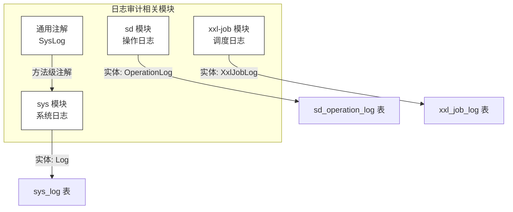
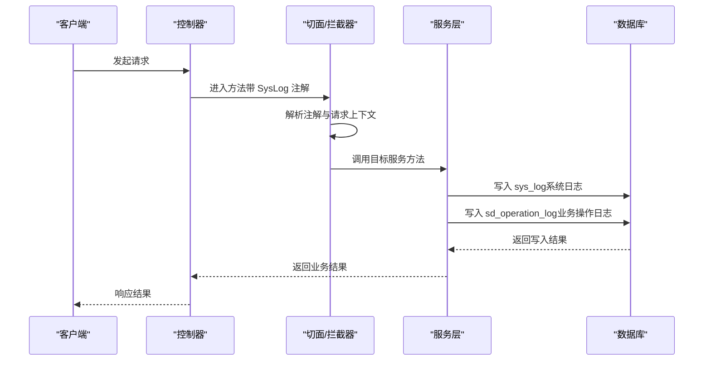
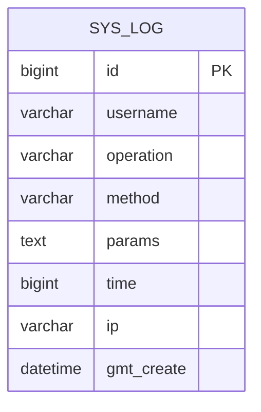
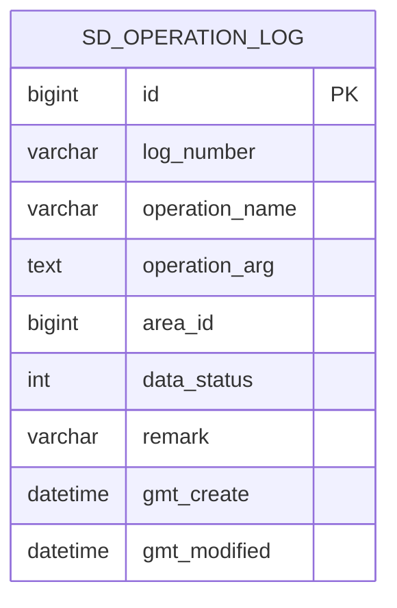
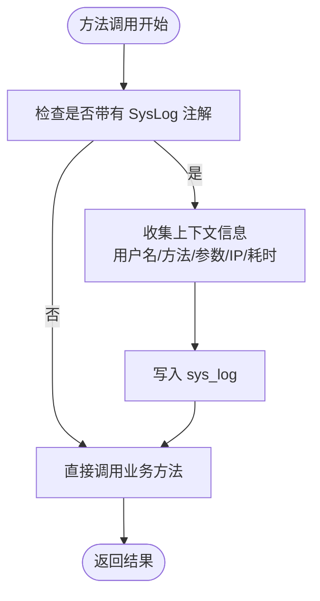
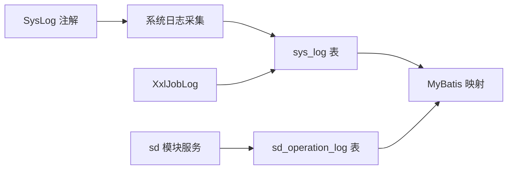

# 日志审计表设计

<cite>
**本文引用的文件**
- [SysLog.java](file://monkey-service/src/main/java/com/monkey/general/common/annotation/SysLog.java)
- [Log.java](file://monkey-service/src/main/java/com/monkey/general/modules/sys/entity/Log.java)
- [OperationLog.java](file://monkey-service/src/main/java/com/monkey/general/modules/sd/entity/OperationLog.java)
- [OperationLogServiceImpl.java](file://monkey-service/src/main/java/com/monkey/general/modules/sd/service/impl/OperationLogServiceImpl.java)
- [LogMapper.xml](file://monkey-service/src/main/resources/mapper/sys/LogMapper.xml)
- [OperationLogMapper.xml](file://monkey-service/src/main/resources/mapper/sd/OperationLogMapper.xml)
- [XxlJobLog.java](file://xxl-job-admin/src/main/java/com/xxl/job/admin/core/model/XxlJobLog.java)
- [XxlJobLogMapper.xml](file://xxl-job-admin/src/main/resources/mybatis-mapper/XxlJobLogMapper.xml)
</cite>

## 目录
1. [引言](#引言)
2. [项目结构](#项目结构)
3. [核心组件](#核心组件)
4. [架构总览](#架构总览)
5. [详细组件分析](#详细组件分析)
6. [依赖关系分析](#依赖关系分析)
7. [性能考虑](#性能考虑)
8. [故障排查指南](#故障排查指南)
9. [结论](#结论)
10. [附录](#附录)

## 引言
本文件面向安威 fireworks 物联网监控平台的日志审计需求，基于现有代码库中的日志实体与映射文件，系统化梳理并设计两类审计日志表：系统日志表（sys_log）与操作日志表（sd_operation_log）。文档从字段设计、表结构、日志分类体系、存储策略、查询优化、安全保护到分析能力等方面进行深入说明，并给出可落地的实现建议。

## 项目结构
围绕日志审计的核心代码主要分布在以下模块：
- 系统日志：sys 模块下的 Log 实体与 MyBatis 映射
- 操作日志：sd 模块下的 OperationLog 实体与服务实现
- 日志注解：用于标注需要记录系统日志的方法
- 作业调度日志：xxl-job 的日志模型与映射（作为系统日志的参考）

图表来源
- [SysLog.java:1-17](file://monkey-service/src/main/java/com/monkey/general/common/annotation/SysLog.java#L1-L17)
- [Log.java:1-74](file://monkey-service/src/main/java/com/monkey/general/modules/sys/entity/Log.java#L1-L74)
- [OperationLog.java:1-74](file://monkey-service/src/main/java/com/monkey/general/modules/sd/entity/OperationLog.java#L1-L74)
- [XxlJobLog.java](file://xxl-job-admin/src/main/java/com/xxl/job/admin/core/model/XxlJobLog.java)

章节来源
- [SysLog.java:1-17](file://monkey-service/src/main/java/com/monkey/general/common/annotation/SysLog.java#L1-L17)
- [Log.java:1-74](file://monkey-service/src/main/java/com/monkey/general/modules/sys/entity/Log.java#L1-L74)
- [OperationLog.java:1-74](file://monkey-service/src/main/java/com/monkey/general/modules/sd/entity/OperationLog.java#L1-L74)
- [XxlJobLog.java](file://xxl-job-admin/src/main/java/com/xxl/job/admin/core/model/XxlJobLog.java)

## 核心组件
- 系统日志表（sys_log）
  - 字段：id、username、operation、method、params、time、ip、gmt_create
  - 用途：记录接口层的关键系统行为，便于审计与追踪
- 操作日志表（sd_operation_log）
  - 字段：id、log_number、operation_name、operation_arg、area_id、data_status、remark、gmt_create、gmt_modified
  - 用途：记录业务层面的操作轨迹，支持按区域维度管理
- 日志注解（SysLog）
  - 作用：在方法上标注需要自动采集系统日志，简化开发成本

章节来源
- [Log.java:20-71](file://monkey-service/src/main/java/com/monkey/general/modules/sys/entity/Log.java#L20-L71)
- [OperationLog.java:18-70](file://monkey-service/src/main/java/com/monkey/general/modules/sd/entity/OperationLog.java#L18-L70)
- [SysLog.java:10-16](file://monkey-service/src/main/java/com/monkey/general/common/annotation/SysLog.java#L10-L16)

## 架构总览
下图展示日志采集与落库的整体流程：控制器层通过注解触发系统日志采集，随后由服务层统一写入 sys_log；业务操作日志由 sd 模块的服务实现负责持久化到 sd_operation_log。

图表来源
- [SysLog.java:10-16](file://monkey-service/src/main/java/com/monkey/general/common/annotation/SysLog.java#L10-L16)
- [Log.java:20-71](file://monkey-service/src/main/java/com/monkey/general/modules/sys/entity/Log.java#L20-L71)
- [OperationLog.java:18-70](file://monkey-service/src/main/java/com/monkey/general/modules/sd/entity/OperationLog.java#L18-L70)

## 详细组件分析

### 系统日志表（sys_log）设计
- 字段设计要点
  - id：主键
  - username：用户名（可用于用户过滤与审计）
  - operation：用户操作描述（用于关键字检索与统计）
  - method：请求方法（GET/POST 等，辅助定位问题）
  - params：请求参数（注意敏感信息脱敏）
  - time：执行耗时（毫秒），用于性能监控
  - ip：请求来源 IP（支持 IP 维度统计）
  - gmt_create：创建时间（默认插入填充）
- 设计建议
  - 对 params 字段进行脱敏处理，避免明文存储敏感数据
  - 建议对 username、method、ip 建立索引以提升查询效率
  - 可引入日志级别字段（如 info/warn/error）以便分类存储与检索

图表来源
- [Log.java:20-71](file://monkey-service/src/main/java/com/monkey/general/modules/sys/entity/Log.java#L20-L71)

章节来源
- [Log.java:20-71](file://monkey-service/src/main/java/com/monkey/general/modules/sys/entity/Log.java#L20-L71)

### 操作日志表（sd_operation_log）设计
- 字段设计要点
  - id：主键
  - log_number：日志编号（唯一标识一次操作）
  - operation_name：操作方法名称（用于关键字检索）
  - operation_arg：操作参数（注意脱敏）
  - area_id：归属区域（支持按区域分表或分区）
  - data_status：数据状态（启用/禁用，便于逻辑删除与审计）
  - remark：备注（扩展字段）
  - gmt_create、gmt_modified：创建与更新时间（默认插入/更新填充）
- 设计建议
  - 建议对 log_number、operation_name、area_id 建立索引
  - 支持按区域分表或分区，结合 area_id 进行水平拆分
  - 增加操作结果字段（成功/失败）以完善审计闭环

图表来源
- [OperationLog.java:18-70](file://monkey-service/src/main/java/com/monkey/general/modules/sd/entity/OperationLog.java#L18-L70)

章节来源
- [OperationLog.java:18-70](file://monkey-service/src/main/java/com/monkey/general/modules/sd/entity/OperationLog.java#L18-L70)
- [OperationLogServiceImpl.java:30-67](file://monkey-service/src/main/java/com/monkey/general/modules/sd/service/impl/OperationLogServiceImpl.java#L30-L67)

### 日志注解（SysLog）与采集流程
- SysLog 注解
  - 作用域：方法级
  - 属性：value（日志描述，默认空）
- 采集流程
  - 方法进入时，切面/拦截器读取注解值与请求上下文
  - 调用目标方法后，将系统日志写入 sys_log
  - 该流程与业务操作日志（sd_operation_log）互补

图表来源
- [SysLog.java:10-16](file://monkey-service/src/main/java/com/monkey/general/common/annotation/SysLog.java#L10-L16)
- [Log.java:20-71](file://monkey-service/src/main/java/com/monkey/general/modules/sys/entity/Log.java#L20-L71)

章节来源
- [SysLog.java:10-16](file://monkey-service/src/main/java/com/monkey/general/common/annotation/SysLog.java#L10-L16)

### 日志分类体系
- 登录日志：记录用户认证与会话建立过程（可复用 sys_log 的 username、method、ip、time）
- 业务操作日志：记录具体业务动作（operation_name、operation_arg、area_id）
- 系统异常日志：记录异常堆栈与上下文（可扩展日志级别字段）
- 性能监控日志：记录耗时与资源使用（time 字段）

章节来源
- [Log.java:56-58](file://monkey-service/src/main/java/com/monkey/general/modules/sys/entity/Log.java#L56-L58)
- [OperationLog.java:36-43](file://monkey-service/src/main/java/com/monkey/general/modules/sd/entity/OperationLog.java#L36-L43)

### 存储策略
- 分级存储
  - 新增：sys_log 与 sd_operation_log 各自独立表，按时间滚动分区或分表
  - 归档：历史数据迁移至归档表（如 sys_log_his、sd_operation_log_his），保留周期按法规要求设定
- 压缩策略
  - 表压缩：对冷数据启用压缩（如 gzip），降低存储成本
  - 日志压缩：写入前对大字段（params、operation_arg）进行压缩存储
- 归档机制
  - 定期任务：按月/季度归档，清理过期数据
  - 索引维护：归档前后重建/优化索引，保证查询性能

章节来源
- [Log.java:69-71](file://monkey-service/src/main/java/com/monkey/general/modules/sys/entity/Log.java#L69-L71)
- [OperationLog.java:63-70](file://monkey-service/src/main/java/com/monkey/general/modules/sd/entity/OperationLog.java#L63-L70)

### 查询优化方案
- 时间范围查询
  - sys_log：按 gmt_create 建立索引，支持高效范围扫描
  - sd_operation_log：按 gmt_create 与 area_id 建立复合索引
- 用户过滤
  - sys_log.username、sd_operation_log.operation_name 建立索引
- 关键字搜索
  - 对 operation、operation_name、params、operation_arg 建立全文索引或模糊匹配索引
- 分页与并发
  - 使用覆盖索引减少回表
  - 分页查询避免 deep pagination，采用基于游标的分页

章节来源
- [Log.java:32-39](file://monkey-service/src/main/java/com/monkey/general/modules/sys/entity/Log.java#L32-L39)
- [OperationLog.java:32-38](file://monkey-service/src/main/java/com/monkey/general/modules/sd/entity/OperationLog.java#L32-L38)

### 日志安全保护
- 日志脱敏
  - 敏感字段：params、operation_arg、username 中的身份证号、手机号、银行卡等
  - 脱敏策略：截断、掩码、哈希（仅用于比对）
- 访问控制
  - 接口权限：限制日志查询与导出权限
  - 操作审计：对日志查询行为本身也进行审计
- 篡改防护
  - 数字签名：对关键字段生成摘要，防止篡改
  - 只追加写：禁止删除与修改，采用逻辑删除标记

章节来源
- [SysLog.java:10-16](file://monkey-service/src/main/java/com/monkey/general/common/annotation/SysLog.java#L10-L16)
- [Log.java:32-51](file://monkey-service/src/main/java/com/monkey/general/modules/sys/entity/Log.java#L32-L51)
- [OperationLog.java:32-43](file://monkey-service/src/main/java/com/monkey/general/modules/sd/entity/OperationLog.java#L32-L43)

### 日志分析功能
- 访问统计
  - 用户活跃度、接口调用次数、区域分布
- 异常检测
  - 基于 time 阈值与错误模式识别异常调用
- 趋势分析
  - 按小时/天/周聚合调用量与耗时，识别性能波动

章节来源
- [Log.java:56-58](file://monkey-service/src/main/java/com/monkey/general/modules/sys/entity/Log.java#L56-L58)
- [OperationLog.java:36-43](file://monkey-service/src/main/java/com/monkey/general/modules/sd/entity/OperationLog.java#L36-L43)

## 依赖关系分析
- 组件耦合
  - SysLog 注解与系统日志采集流程松耦合，便于扩展其他采集方式
  - sd 模块通过服务层实现与数据库交互，职责清晰
- 外部依赖
  - MyBatis 映射文件定义了表与实体的对应关系
  - xxl-job 的日志模型可作为系统日志的参考实现

图表来源
- [SysLog.java:10-16](file://monkey-service/src/main/java/com/monkey/general/common/annotation/SysLog.java#L10-L16)
- [Log.java:20-71](file://monkey-service/src/main/java/com/monkey/general/modules/sys/entity/Log.java#L20-L71)
- [OperationLog.java:18-70](file://monkey-service/src/main/java/com/monkey/general/modules/sd/entity/OperationLog.java#L18-L70)
- [XxlJobLog.java](file://xxl-job-admin/src/main/java/com/xxl/job/admin/core/model/XxlJobLog.java)

章节来源
- [LogMapper.xml:1-6](file://monkey-service/src/main/resources/mapper/sys/LogMapper.xml#L1-L6)
- [OperationLogMapper.xml:1-6](file://monkey-service/src/main/resources/mapper/sd/OperationLogMapper.xml#L1-L6)
- [XxlJobLogMapper.xml](file://xxl-job-admin/src/main/resources/mybatis-mapper/XxlJobLogMapper.xml)

## 性能考虑
- 写入性能
  - 批量写入：合并多条日志写入，减少往返
  - 异步写入：对非关键路径采用异步队列
- 读取性能
  - 索引优化：针对高频查询字段建立合适索引
  - 分区/分表：按时间与区域拆分，避免单表过大
- 存储成本
  - 冷热分离：热数据驻留内存/SSD，冷数据归档到磁盘
  - 压缩与去重：对重复日志进行去重与压缩

## 故障排查指南
- 常见问题
  - 参数过大导致写入失败：对大字段进行压缩或分表
  - 查询慢：确认索引是否存在，避免全表扫描
  - 数据不一致：检查 gmt_create 默认值与事务一致性
- 排查步骤
  - 查看 sys_log 与 sd_operation_log 的写入时间线
  - 结合 XxlJobLog（调度日志）定位系统异常
  - 使用 EXPLAIN 分析慢查询

章节来源
- [Log.java:69-71](file://monkey-service/src/main/java/com/monkey/general/modules/sys/entity/Log.java#L69-L71)
- [OperationLog.java:63-70](file://monkey-service/src/main/java/com/monkey/general/modules/sd/entity/OperationLog.java#L63-L70)
- [XxlJobLog.java](file://xxl-job-admin/src/main/java/com/xxl/job/admin/core/model/XxlJobLog.java)

## 结论
本文基于现有代码库，给出了 sys_log 与 sd_operation_log 的字段设计与实现建议，明确了日志分类、存储策略、查询优化、安全保护与分析能力。建议尽快在生产环境落地索引与分区策略，并配套脱敏与访问控制机制，确保日志系统的可用性与合规性。

## 附录
- 表结构对照
  - sys_log：id、username、operation、method、params、time、ip、gmt_create
  - sd_operation_log：id、log_number、operation_name、operation_arg、area_id、data_status、remark、gmt_create、gmt_modified
- 参考实现
  - MyBatis 映射文件位置：mapper/sys/LogMapper.xml、mapper/sd/OperationLogMapper.xml
  - 调度日志参考：xxl-job-admin 的 XxlJobLog 与 XxlJobLogMapper.xml

章节来源
- [LogMapper.xml:1-6](file://monkey-service/src/main/resources/mapper/sys/LogMapper.xml#L1-L6)
- [OperationLogMapper.xml:1-6](file://monkey-service/src/main/resources/mapper/sd/OperationLogMapper.xml#L1-L6)
- [XxlJobLogMapper.xml](file://xxl-job-admin/src/main/resources/mybatis-mapper/XxlJobLogMapper.xml)