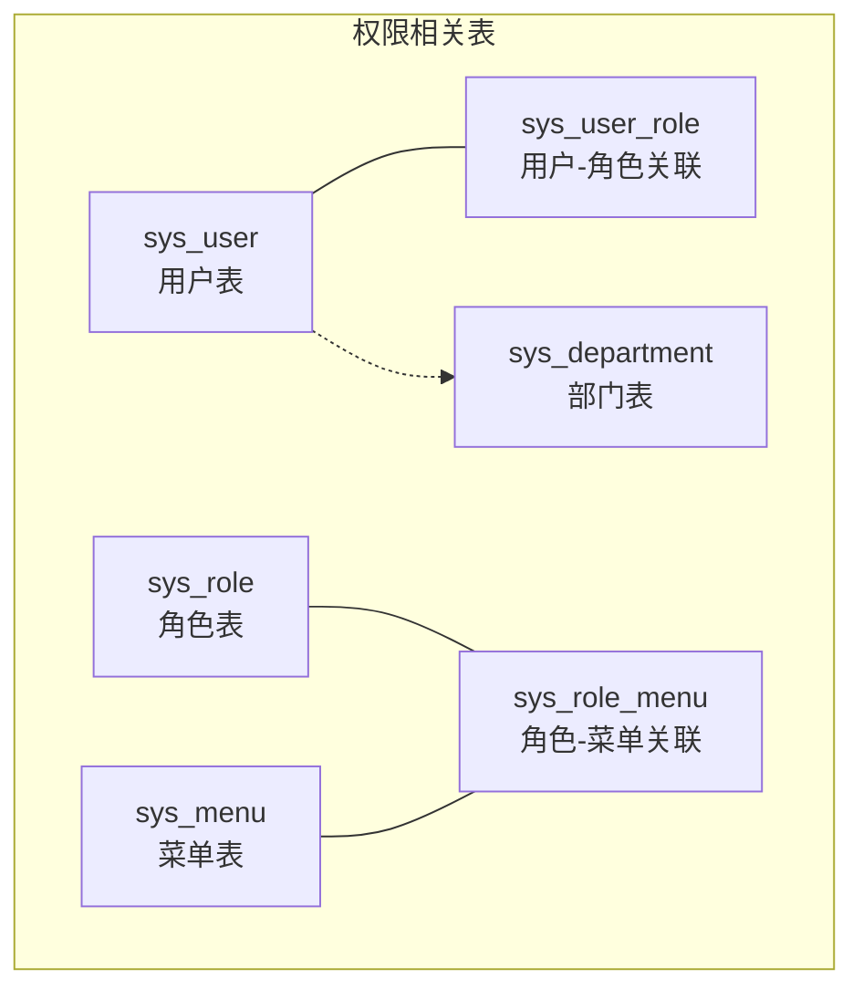
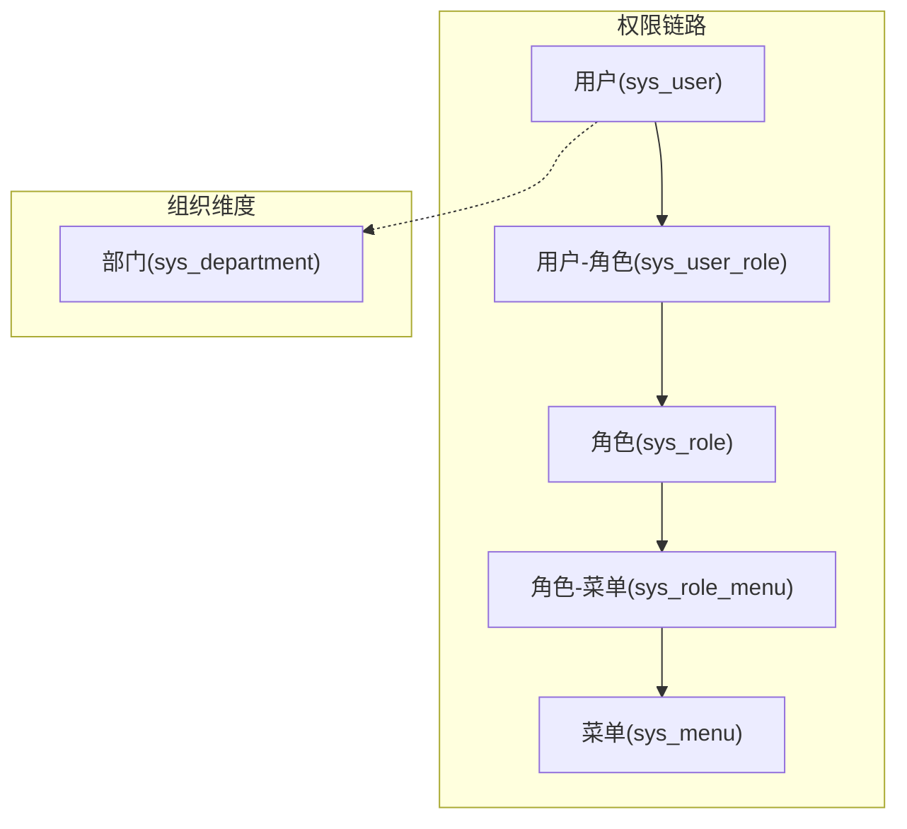
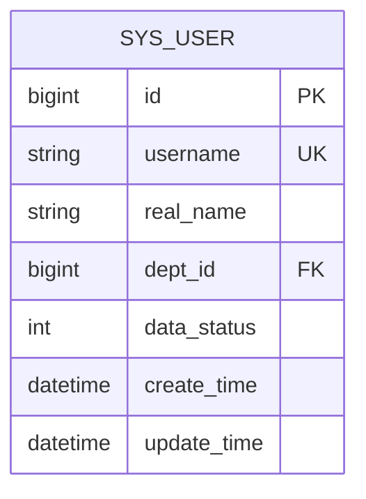
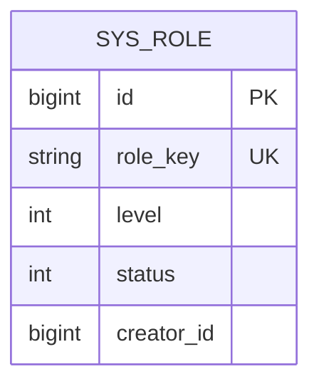
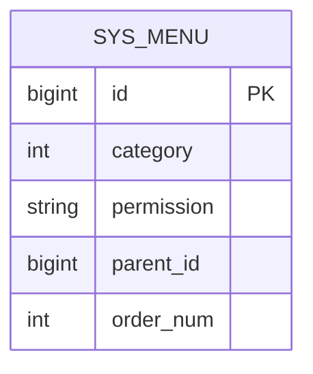
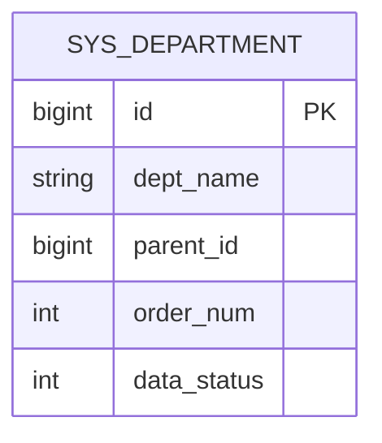
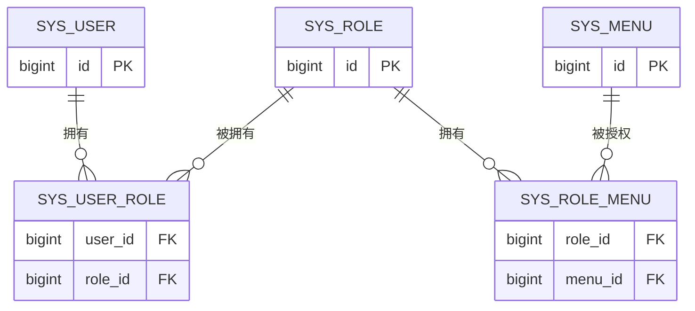
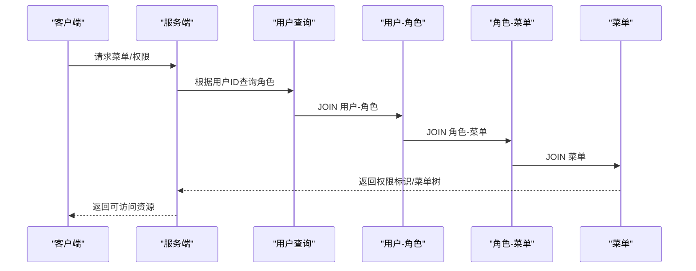
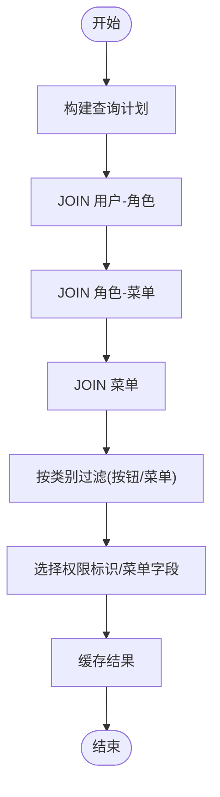
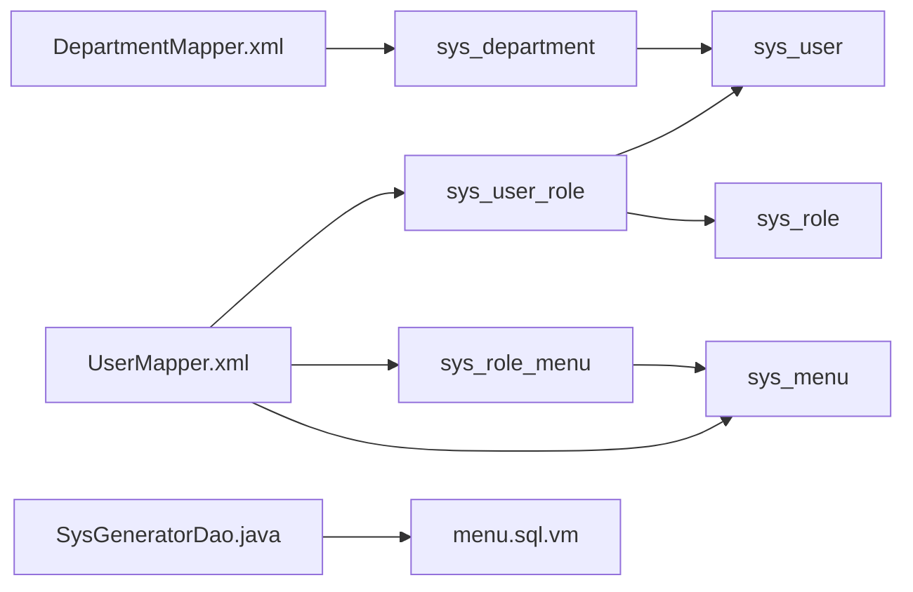

# 用户权限表设计

<cite>
**本文引用的文件**
- [init.sql](file://deploy/init/init.sql)
- [UserMapper.xml](file://monkey-service/src/main/resources/mapper/sys/UserMapper.xml)
- [RoleMapper.xml](file://monkey-service/src/main/resources/mapper/sys/RoleMapper.xml)
- [MenuMapper.xml](file://monkey-service/src/main/resources/mapper/sys/MenuMapper.xml)
- [DepartmentMapper.xml](file://monkey-service/src/main/resources/mapper/sys/DepartmentMapper.xml)
- [Department.java](file://monkey-service/src/main/java/com/monkey/general/modules/sys/entity/Department.java)
- [UserRoleMapper.xml](file://monkey-service/src/main/resources/mapper/sys/UserRoleMapper.xml)
- [RoleMenuMapper.xml](file://monkey-service/src/main/resources/mapper/sys/RoleMenuMapper.xml)
- [SysGeneratorDao.java](file://monkey-code-generator/src/main/java/com/monkey/adaptor/SysGeneratorDao.java)
- [MySQLGeneratorDao.java](file://monkey-code-generator/src/main/java/com/monkey/adaptor/MySQLGeneratorDao.java)
- [OracleGeneratorDao.java](file://monkey-code-generator/src/main/java/com/monkey/adaptor/OracleGeneratorDao.java)
- [PostgreSQLGeneratorDao.java](file://monkey-code-generator/src/main/java/com/monkey/adaptor/PostgreSQLGeneratorDao.java)
- [SQLServerGeneratorDao.java](file://monkey-code-generator/src/main/java/com/monkey/adaptor/SQLServerGeneratorDao.java)
- [SysGeneratorDao.xml](file://monkey-code-generator/src/main/resources/mapper/SysGeneratorDao.xml)
- [menu.sql.vm](file://monkey-code-generator/src/main/resources/template/menu.sql.vm)
</cite>

## 目录
1. [简介](#简介)
2. [项目结构](#项目结构)
3. [核心组件](#核心组件)
4. [架构总览](#架构总览)
5. [详细组件分析](#详细组件分析)
6. [依赖关系分析](#依赖关系分析)
7. [性能考虑](#性能考虑)
8. [故障排查指南](#故障排查指南)
9. [结论](#结论)
10. [附录](#附录)

## 简介
本文件面向安威 fireworks 物联网监控平台的用户权限体系，围绕用户表（sys_user）、角色表（sys_role）、菜单表（sys_menu）、部门表（sys_department），以及用户-角色关联表（sys_user_role）和角色-菜单关联表（sys_role_menu）进行系统化设计与实现解析。内容涵盖字段设计、权限标识与控制机制、组织架构与层级关系、多对多关系建模、权限继承与验证流程、数据权限控制策略，以及查询优化与索引设计建议。

## 项目结构
权限相关的核心对象与映射位于服务模块的 sys 包下，采用 MyBatis XML 映射方式实现权限查询与关联关系维护；数据库初始化脚本中包含完整的表结构与示例数据，便于理解字段语义与约束。

图表来源
- [UserMapper.xml:1-42](file://monkey-service/src/main/resources/mapper/sys/UserMapper.xml#L1-L42)
- [RoleMapper.xml:1-9](file://monkey-service/src/main/resources/mapper/sys/RoleMapper.xml#L1-L9)
- [MenuMapper.xml:1-14](file://monkey-service/src/main/resources/mapper/sys/MenuMapper.xml#L1-L14)
- [Department.java:1-52](file://monkey-service/src/main/java/com/monkey/general/modules/sys/entity/Department.java#L1-L52)

章节来源
- [UserMapper.xml:1-42](file://monkey-service/src/main/resources/mapper/sys/UserMapper.xml#L1-L42)
- [RoleMapper.xml:1-9](file://monkey-service/src/main/resources/mapper/sys/RoleMapper.xml#L1-L9)
- [MenuMapper.xml:1-14](file://monkey-service/src/main/resources/mapper/sys/MenuMapper.xml#L1-L14)
- [Department.java:1-52](file://monkey-service/src/main/java/com/monkey/general/modules/sys/entity/Department.java#L1-L52)

## 核心组件
- 用户表（sys_user）
  - 关键字段：主键、用户名、真实姓名、部门关联、数据状态、创建/更新时间等
  - 字段语义：用于承载登录凭证、基本信息与组织归属，数据状态用于启用/禁用控制
- 角色表（sys_role）
  - 关键字段：主键、角色标识、角色层级、角色状态、创建者等
  - 字段语义：定义角色在权限体系中的层级与状态，支持按创建者过滤角色列表
- 菜单表（sys_menu）
  - 关键字段：主键、菜单类型（按钮/目录/菜单）、权限标识、路由配置、父节点、排序等
  - 字段语义：通过类别区分菜单类型，权限标识用于前端与后端权限校验
- 部门表（sys_department）
  - 关键字段：主键、部门名称、父ID、排序、数据状态
  - 字段语义：构建树形组织架构，支持父子层级与排序展示
- 用户-角色关联表（sys_user_role）
  - 关键字段：用户ID、角色ID
  - 字段语义：多对多关系，决定用户具备的角色集合
- 角色-菜单关联表（sys_role_menu）
  - 关键字段：角色ID、菜单ID
  - 字段语义：多对多关系，决定角色具备的菜单与权限集合

章节来源
- [UserMapper.xml:1-42](file://monkey-service/src/main/resources/mapper/sys/UserMapper.xml#L1-L42)
- [RoleMapper.xml:1-9](file://monkey-service/src/main/resources/mapper/sys/RoleMapper.xml#L1-L9)
- [MenuMapper.xml:1-14](file://monkey-service/src/main/resources/mapper/sys/MenuMapper.xml#L1-L14)
- [Department.java:1-52](file://monkey-service/src/main/java/com/monkey/general/modules/sys/entity/Department.java#L1-L52)

## 架构总览
权限架构以“用户-角色-菜单”为核心链路，结合“部门”实现组织维度的数据隔离与权限继承。用户通过角色获得菜单与权限标识，菜单通过权限标识参与前端路由与后端接口校验。

图表来源
- [UserMapper.xml:10-23](file://monkey-service/src/main/resources/mapper/sys/UserMapper.xml#L10-L23)
- [RoleMenuMapper.xml:1-200](file://monkey-service/src/main/resources/mapper/sys/RoleMenuMapper.xml#L1-L200)
- [Department.java:1-52](file://monkey-service/src/main/java/com/monkey/general/modules/sys/entity/Department.java#L1-L52)

## 详细组件分析

### 用户表（sys_user）字段设计
- 基本信息字段
  - 主键：唯一标识用户
  - 用户名：登录凭据，需唯一性约束
  - 真实姓名：显示与统计用途
- 组织关联字段
  - 部门ID：指向部门表主键，建立用户与组织的直接关联
- 账户状态字段
  - 数据状态：0-禁用、1-启用，用于快速开关用户权限
- 其他字段
  - 创建/更新时间：审计与生命周期管理

图表来源
- [UserMapper.xml:25-27](file://monkey-service/src/main/resources/mapper/sys/UserMapper.xml#L25-L27)
- [Department.java:20-52](file://monkey-service/src/main/java/com/monkey/general/modules/sys/entity/Department.java#L20-L52)

章节来源
- [UserMapper.xml:25-27](file://monkey-service/src/main/resources/mapper/sys/UserMapper.xml#L25-L27)
- [Department.java:20-52](file://monkey-service/src/main/java/com/monkey/general/modules/sys/entity/Department.java#L20-L52)

### 角色表（sys_role）设计
- 角色标识与层级
  - 角色标识：用于系统内识别角色
  - 角色层级：可作为角色优先级或继承权重的依据
- 角色状态管理
  - 角色状态：0-禁用、1-启用，配合用户数据状态实现灵活的权限开关
- 创建者字段
  - 用于按创建者过滤角色列表，便于租户/管理员隔离

图表来源
- [RoleMapper.xml:6-8](file://monkey-service/src/main/resources/mapper/sys/RoleMapper.xml#L6-L8)

章节来源
- [RoleMapper.xml:1-9](file://monkey-service/src/main/resources/mapper/sys/RoleMapper.xml#L1-L9)

### 菜单表（sys_menu）权限控制机制
- 菜单类型
  - 类别字段：区分目录、菜单页、按钮等，用于前端渲染与权限粒度控制
- 权限标识
  - 权限标识字段：后端接口校验与前端路由鉴权的关键
- 路由配置
  - 菜单与路由的绑定：通过菜单项描述页面路径、组件与权限标识
- 父子关系
  - 父ID与排序字段：构建树形菜单结构，支持层级展示与递归查询

图表来源
- [MenuMapper.xml:6-12](file://monkey-service/src/main/resources/mapper/sys/MenuMapper.xml#L6-L12)

章节来源
- [MenuMapper.xml:1-14](file://monkey-service/src/main/resources/mapper/sys/MenuMapper.xml#L1-L14)

### 部门表（sys_department）组织架构设计
- 层级关系
  - 父ID与排序字段：形成树形结构，支持多级组织
- 数据状态
  - 启用/禁用：控制部门生效状态，影响用户归属与数据权限
- 名称与排序
  - 部门名称与排序：用于前端展示与管理

图表来源
- [Department.java:20-52](file://monkey-service/src/main/java/com/monkey/general/modules/sys/entity/Department.java#L20-L52)

章节来源
- [Department.java:1-52](file://monkey-service/src/main/java/com/monkey/general/modules/sys/entity/Department.java#L1-L52)

### 用户-角色关联表（sys_user_role）与角色-菜单关联表（sys_role_menu）
- 多对多关系
  - 用户-角色：一个用户可拥有多个角色
  - 角色-菜单：一个角色可拥有多个菜单与权限
- 权限继承
  - 用户最终权限 = SUM(角色1权限 ∪ 角色2权限 ∪ ...)
- 查询链路
  - 用户权限查询：用户 → 用户-角色 → 角色-菜单 → 菜单（筛选权限标识）
  - 菜单查询：用户 → 用户-角色 → 角色-菜单 → 菜单（筛选非按钮类型）

图表来源
- [UserMapper.xml:10-23](file://monkey-service/src/main/resources/mapper/sys/UserMapper.xml#L10-L23)
- [UserRoleMapper.xml:1-200](file://monkey-service/src/main/resources/mapper/sys/UserRoleMapper.xml#L1-L200)
- [RoleMenuMapper.xml:1-200](file://monkey-service/src/main/resources/mapper/sys/RoleMenuMapper.xml#L1-L200)

章节来源
- [UserMapper.xml:10-23](file://monkey-service/src/main/resources/mapper/sys/UserMapper.xml#L10-L23)

### 权限继承机制、菜单权限验证与数据权限控制
- 权限继承
  - 用户通过角色继承权限，角色之间无直接继承，权限叠加
- 菜单权限验证
  - 后端：根据用户ID查询其角色与菜单，匹配权限标识
  - 前端：根据菜单类别与权限标识控制按钮与路由访问
- 数据权限控制
  - 可基于部门ID实现数据域隔离：用户仅能访问所属部门及其子部门的数据
  - 在查询层面对用户所属部门进行过滤，避免越权访问

图表来源
- [UserMapper.xml:10-23](file://monkey-service/src/main/resources/mapper/sys/UserMapper.xml#L10-L23)
- [MenuMapper.xml:6-12](file://monkey-service/src/main/resources/mapper/sys/MenuMapper.xml#L6-L12)

章节来源
- [UserMapper.xml:10-23](file://monkey-service/src/main/resources/mapper/sys/UserMapper.xml#L10-L23)
- [MenuMapper.xml:1-14](file://monkey-service/src/main/resources/mapper/sys/MenuMapper.xml#L1-L14)

### 用户权限查询优化策略与索引设计建议
- 查询优化策略
  - 使用用户ID作为查询条件，减少全表扫描
  - 对角色与菜单的关联查询使用JOIN并限定类别（如仅按钮权限）
  - 缓存热点用户的权限集合，降低重复计算
- 索引设计建议
  - sys_user_role(user_id)：加速用户角色查询
  - sys_role_menu(role_id)：加速角色菜单查询
  - sys_menu(category)：加速权限标识过滤
  - sys_user(dept_id)：加速数据权限过滤
  - sys_user(username)：加速登录与唯一性校验

图表来源
- [UserMapper.xml:10-23](file://monkey-service/src/main/resources/mapper/sys/UserMapper.xml#L10-L23)
- [MenuMapper.xml:6-12](file://monkey-service/src/main/resources/mapper/sys/MenuMapper.xml#L6-L12)

章节来源
- [UserMapper.xml:10-23](file://monkey-service/src/main/resources/mapper/sys/UserMapper.xml#L10-L23)

## 依赖关系分析
- 表间依赖
  - sys_user 依赖 sys_department（外键 dept_id）
  - sys_user_role 连接 sys_user 与 sys_role
  - sys_role_menu 连接 sys_role 与 sys_menu
- 映射文件依赖
  - UserMapper.xml 依赖 sys_user_role 与 sys_role_menu、sys_menu
  - RoleMapper.xml 提供按创建者查询角色列表的能力
  - MenuMapper.xml 提供菜单树与非按钮菜单查询能力
- 代码生成器依赖
  - SysGeneratorDao 及各数据库适配器负责生成表结构与菜单初始化 SQL
  - menu.sql.vm 模板用于生成菜单初始化 SQL

图表来源
- [UserMapper.xml:10-23](file://monkey-service/src/main/resources/mapper/sys/UserMapper.xml#L10-L23)
- [RoleMapper.xml:6-8](file://monkey-service/src/main/resources/mapper/sys/RoleMapper.xml#L6-L8)
- [MenuMapper.xml:6-12](file://monkey-service/src/main/resources/mapper/sys/MenuMapper.xml#L6-L12)
- [DepartmentMapper.xml:1-6](file://monkey-service/src/main/resources/mapper/sys/DepartmentMapper.xml#L1-L6)
- [SysGeneratorDao.java:1-200](file://monkey-code-generator/src/main/java/com/monkey/adaptor/SysGeneratorDao.java#L1-L200)
- [menu.sql.vm:1-200](file://monkey-code-generator/src/main/resources/template/menu.sql.vm#L1-L200)

章节来源
- [UserMapper.xml:1-42](file://monkey-service/src/main/resources/mapper/sys/UserMapper.xml#L1-L42)
- [RoleMapper.xml:1-9](file://monkey-service/src/main/resources/mapper/sys/RoleMapper.xml#L1-L9)
- [MenuMapper.xml:1-14](file://monkey-service/src/main/resources/mapper/sys/MenuMapper.xml#L1-L14)
- [DepartmentMapper.xml:1-6](file://monkey-service/src/main/resources/mapper/sys/DepartmentMapper.xml#L1-L6)
- [SysGeneratorDao.java:1-200](file://monkey-code-generator/src/main/java/com/monkey/adaptor/SysGeneratorDao.java#L1-L200)
- [menu.sql.vm:1-200](file://monkey-code-generator/src/main/resources/template/menu.sql.vm#L1-L200)

## 性能考虑
- 查询路径优化
  - 将用户ID作为首要过滤条件，减少中间表连接规模
  - 仅在需要时加载完整菜单树，避免一次性返回全量数据
- 索引与分区
  - 为高频过滤字段建立合适索引，避免隐式转换导致的索引失效
  - 对历史数据可考虑按时间分区，降低扫描范围
- 缓存策略
  - 将用户权限与菜单树缓存于Redis，设置合理过期时间
  - 针对热点用户权限进行预热，提升响应速度

## 故障排查指南
- 登录后无菜单/按钮
  - 检查用户数据状态与角色状态是否均为启用
  - 核对用户-角色与角色-菜单关联是否存在
  - 确认菜单类别与权限标识是否正确
- 权限变更不生效
  - 清理用户权限缓存，确保重新加载最新权限
  - 检查角色层级与权限叠加逻辑是否符合预期
- 数据越权访问
  - 核对部门数据状态与用户所属部门是否一致
  - 检查查询层面对部门ID的过滤条件是否生效

## 结论
本权限体系以“用户-角色-菜单-部门”为核心，通过清晰的表结构与多对多关联实现灵活的权限继承与数据隔离。结合合理的查询优化与索引设计，可在保证安全性的前提下提升系统性能。建议在生产环境中完善缓存与审计机制，并持续优化权限模型以适应业务演进。

## 附录
- 初始化脚本参考
  - 数据库初始化脚本包含完整的表结构与示例数据，可用于验证字段语义与约束
- 代码生成器模板
  - 通过 SysGeneratorDao 与各数据库适配器生成表结构与菜单初始化 SQL，确保一致性与可维护性

章节来源
- [init.sql:1-219](file://deploy/init/init.sql#L1-L219)
- [SysGeneratorDao.java:1-200](file://monkey-code-generator/src/main/java/com/monkey/adaptor/SysGeneratorDao.java#L1-L200)
- [MySQLGeneratorDao.java:1-200](file://monkey-code-generator/src/main/java/com/monkey/adaptor/MySQLGeneratorDao.java#L1-L200)
- [OracleGeneratorDao.java:1-200](file://monkey-code-generator/src/main/java/com/monkey/adaptor/OracleGeneratorDao.java#L1-L200)
- [PostgreSQLGeneratorDao.java:1-200](file://monkey-code-generator/src/main/java/com/monkey/adaptor/PostgreSQLGeneratorDao.java#L1-L200)
- [SQLServerGeneratorDao.java:1-200](file://monkey-code-generator/src/main/java/com/monkey/adaptor/SQLServerGeneratorDao.java#L1-L200)
- [SysGeneratorDao.xml:1-200](file://monkey-code-generator/src/main/resources/mapper/SysGeneratorDao.xml#L1-L200)
- [menu.sql.vm:1-200](file://monkey-code-generator/src/main/resources/template/menu.sql.vm#L1-L200)