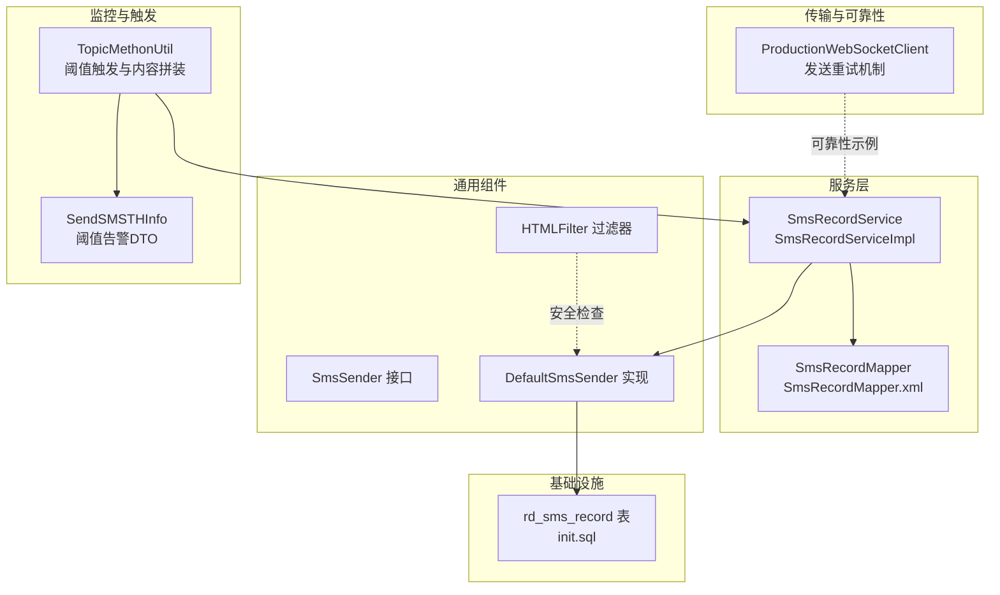
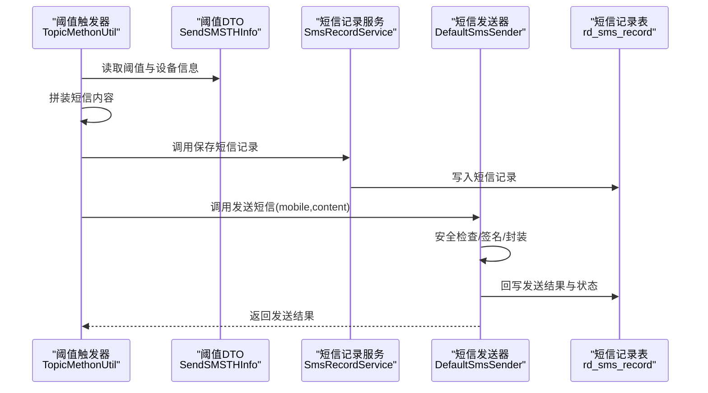
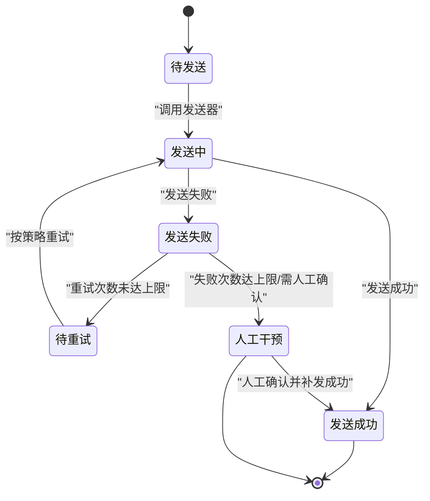
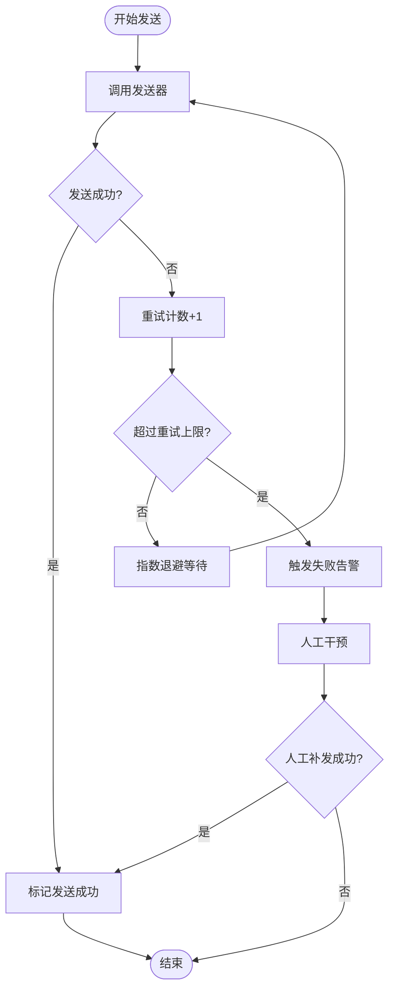
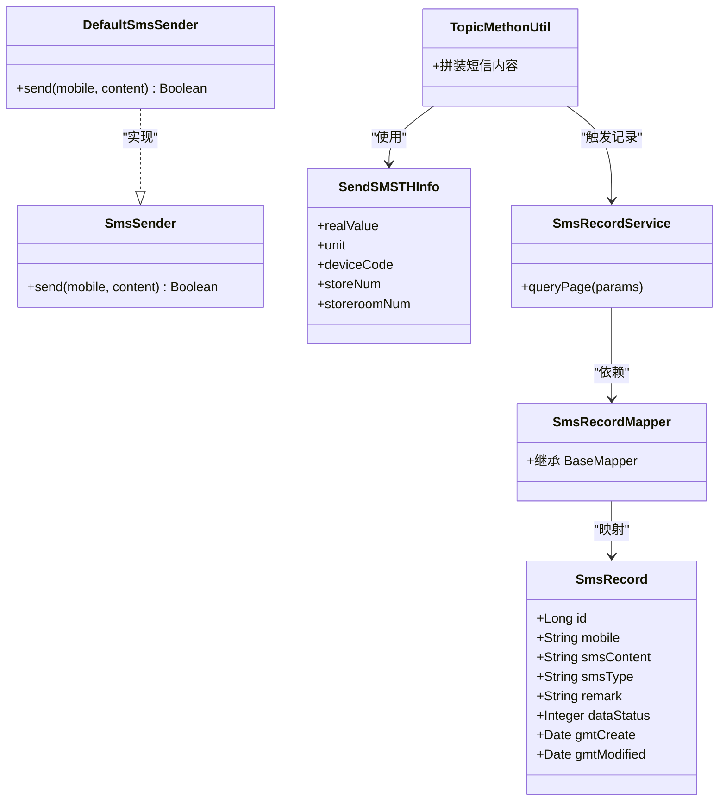

# 短信记录表设计

<cite>
**本文引用的文件**
- [SmsRecord.java](file://monkey-service/src/main/java/com/monkey/general/modules/rd/entity/SmsRecord.java)
- [SmsRecordMapper.java](file://monkey-service/src/main/java/com/monkey/general/modules/rd/mapper/SmsRecordMapper.java)
- [SmsRecordMapper.xml](file://monkey-service/src/main/resources/mapper/rd/SmsRecordMapper.xml)
- [SmsRecordService.java](file://monkey-service/src/main/java/com/monkey/general/modules/rd/service/SmsRecordService.java)
- [SmsRecordServiceImpl.java](file://monkey-service/src/main/java/com/monkey/general/modules/rd/service/impl/SmsRecordServiceImpl.java)
- [SmsSender.java](file://monkey-common/src/main/java/com/monkey/general/common/sms/SmsSender.java)
- [DefaultSmsSender.java](file://monkey-common/src/main/java/com/monkey/general/common/sms/DefaultSmsSender.java)
- [TopicMethonUtil.java](file://monkey-monitor/src/main/java/com/monkey/general/config/mqtt/TopicMethonUtil.java)
- [SendSMSTHInfo.java](file://monkey-monitor/src/main/java/com/monkey/general/modules/em/entity/dto/SendSMSTHInfo.java)
- [HTMLFilter.java](file://monkey-common/src/main/java/com/monkey/general/common/xss/HTMLFilter.java)
- [ProductionWebSocketClient.java](file://monkey-monitor/src/main/java/com/monkey/general/util/socket/config/ProductionWebSocketClient.java)
- [init.sql](file://deploy/init/init.sql)
</cite>

## 目录
1. [简介](#简介)
2. [项目结构](#项目结构)
3. [核心组件](#核心组件)
4. [架构总览](#架构总览)
5. [详细组件分析](#详细组件分析)
6. [依赖关系分析](#依赖关系分析)
7. [性能考虑](#性能考虑)
8. [故障排查指南](#故障排查指南)
9. [结论](#结论)
10. [附录](#附录)

## 简介
本文件面向安威 fireworks 物联网监控平台，系统化梳理短信记录表（sms_record）的设计与实现，覆盖字段定义、状态机设计、模板管理、可靠性保障、统计分析、安全检查与合规监管等方面。通过对现有代码的深入分析，形成可落地的表结构设计与流程规范，支撑平台在设备阈值告警等场景下的短信通知能力。

## 项目结构
围绕短信记录与发送的相关模块分布如下：
- 表与实体：rd 模块的 SmsRecord 及其 MyBatis 映射
- 发送接口与实现：common 模块的 SmsSender 接口与 DefaultSmsSender 实现
- 阈值触发与内容生成：monitor 模块的 TopicMethonUtil 与 SendSMSTHInfo
- 安全与可靠性：XSS 过滤工具与 WebSocket 发送重试机制
- 初始化脚本：部署脚本中的数据库初始化

**图表来源**
- [SmsRecordService.java:1-18](file://monkey-service/src/main/java/com/monkey/general/modules/rd/service/SmsRecordService.java#L1-L18)
- [SmsRecordServiceImpl.java:1-31](file://monkey-service/src/main/java/com/monkey/general/modules/rd/service/impl/SmsRecordServiceImpl.java#L1-L31)
- [SmsRecordMapper.java:1-15](file://monkey-service/src/main/java/com/monkey/general/modules/rd/mapper/SmsRecordMapper.java#L1-L15)
- [SmsRecordMapper.xml:1-6](file://monkey-service/src/main/resources/mapper/rd/SmsRecordMapper.xml#L1-L6)
- [SmsSender.java:1-18](file://monkey-common/src/main/java/com/monkey/general/common/sms/SmsSender.java#L1-L18)
- [DefaultSmsSender.java:1-46](file://monkey-common/src/main/java/com/monkey/general/common/sms/DefaultSmsSender.java#L1-L46)
- [TopicMethonUtil.java:328-357](file://monkey-monitor/src/main/java/com/monkey/general/config/mqtt/TopicMethonUtil.java#L328-L357)
- [SendSMSTHInfo.java:1-53](file://monkey-monitor/src/main/java/com/monkey/general/modules/em/entity/dto/SendSMSTHInfo.java#L1-L53)
- [HTMLFilter.java:1-162](file://monkey-common/src/main/java/com/monkey/general/common/xss/HTMLFilter.java#L1-L162)
- [ProductionWebSocketClient.java:82-228](file://monkey-monitor/src/main/java/com/monkey/general/util/socket/config/ProductionWebSocketClient.java#L82-L228)
- [init.sql:1-219](file://deploy/init/init.sql#L1-L219)

**章节来源**
- [SmsRecord.java:1-69](file://monkey-service/src/main/java/com/monkey/general/modules/rd/entity/SmsRecord.java#L1-L69)
- [SmsRecordMapper.java:1-15](file://monkey-service/src/main/java/com/monkey/general/modules/rd/mapper/SmsRecordMapper.java#L1-L15)
- [SmsRecordMapper.xml:1-6](file://monkey-service/src/main/resources/mapper/rd/SmsRecordMapper.xml#L1-L6)
- [SmsRecordService.java:1-18](file://monkey-service/src/main/java/com/monkey/general/modules/rd/service/SmsRecordService.java#L1-L18)
- [SmsRecordServiceImpl.java:1-31](file://monkey-service/src/main/java/com/monkey/general/modules/rd/service/impl/SmsRecordServiceImpl.java#L1-L31)
- [SmsSender.java:1-18](file://monkey-common/src/main/java/com/monkey/general/common/sms/SmsSender.java#L1-L18)
- [DefaultSmsSender.java:1-46](file://monkey-common/src/main/java/com/monkey/general/common/sms/DefaultSmsSender.java#L1-L46)
- [TopicMethonUtil.java:328-357](file://monkey-monitor/src/main/java/com/monkey/general/config/mqtt/TopicMethonUtil.java#L328-L357)
- [SendSMSTHInfo.java:1-53](file://monkey-monitor/src/main/java/com/monkey/general/modules/em/entity/dto/SendSMSTHInfo.java#L1-L53)
- [HTMLFilter.java:1-162](file://monkey-common/src/main/java/com/monkey/general/common/xss/HTMLFilter.java#L1-L162)
- [ProductionWebSocketClient.java:82-228](file://monkey-monitor/src/main/java/com/monkey/general/util/socket/config/ProductionWebSocketClient.java#L82-L228)
- [init.sql:1-219](file://deploy/init/init.sql#L1-L219)

## 核心组件
- 短信记录实体与映射：SmsRecord 定义了短信记录的核心字段，并通过 SmsRecordMapper 与数据库表进行映射。
- 发送接口与实现：SmsSender 抽象短信发送行为，DefaultSmsSender 提供基于第三方 SDK 的具体实现。
- 阈值触发与内容生成：TopicMethonUtil 根据阈值与设备信息动态拼装短信内容，SendSMSTHInfo 作为输入 DTO。
- 安全与可靠性：HTMLFilter 提供 XSS 过滤，ProductionWebSocketClient 展示发送重试机制（可借鉴到短信发送流程）。

**章节来源**
- [SmsRecord.java:14-69](file://monkey-service/src/main/java/com/monkey/general/modules/rd/entity/SmsRecord.java#L14-L69)
- [SmsRecordMapper.java:7-15](file://monkey-service/src/main/java/com/monkey/general/modules/rd/mapper/SmsRecordMapper.java#L7-L15)
- [SmsSender.java:8-18](file://monkey-common/src/main/java/com/monkey/general/common/sms/SmsSender.java#L8-L18)
- [DefaultSmsSender.java:21-46](file://monkey-common/src/main/java/com/monkey/general/common/sms/DefaultSmsSender.java#L21-L46)
- [TopicMethonUtil.java:328-357](file://monkey-monitor/src/main/java/com/monkey/general/config/mqtt/TopicMethonUtil.java#L328-L357)
- [SendSMSTHInfo.java:11-53](file://monkey-monitor/src/main/java/com/monkey/general/modules/em/entity/dto/SendSMSTHInfo.java#L11-L53)
- [HTMLFilter.java:43-162](file://monkey-common/src/main/java/com/monkey/general/common/xss/HTMLFilter.java#L43-L162)
- [ProductionWebSocketClient.java:82-228](file://monkey-monitor/src/main/java/com/monkey/general/util/socket/config/ProductionWebSocketClient.java#L82-L228)

## 架构总览
短信发送的整体流程由“阈值触发 → 内容生成 → 发送执行 → 记录落库”构成，同时具备安全检查与可靠性保障能力。

**图表来源**
- [TopicMethonUtil.java:328-357](file://monkey-monitor/src/main/java/com/monkey/general/config/mqtt/TopicMethonUtil.java#L328-L357)
- [SendSMSTHInfo.java:11-53](file://monkey-monitor/src/main/java/com/monkey/general/modules/em/entity/dto/SendSMSTHInfo.java#L11-L53)
- [SmsRecordService.java:14-17](file://monkey-service/src/main/java/com/monkey/general/modules/rd/service/SmsRecordService.java#L14-L17)
- [DefaultSmsSender.java:37-46](file://monkey-common/src/main/java/com/monkey/general/common/sms/DefaultSmsSender.java#L37-L46)
- [SmsRecord.java:20-69](file://monkey-service/src/main/java/com/monkey/general/modules/rd/entity/SmsRecord.java#L20-L69)

## 详细组件分析

### 短信记录表（rd_sms_record）字段设计
- 字段清单与职责
  - id：主键
  - mobile：接收手机号
  - sms_content：短信内容
  - sms_type：短信类型（用于区分模板/业务类型）
  - remark：备注（用于描述触发事件、模板ID、重试次数等）
  - data_status：数据状态（0-禁用、1-启用）
  - gmt_create：创建时间（自动填充）
  - gmt_modified：更新时间（自动填充）

- 字段设计要点
  - 命名采用下划线风格，便于跨数据库兼容
  - 使用 MyBatis Plus 注解标注主键与自动填充字段
  - remark 字段预留扩展空间，可用于记录模板ID、失败原因、重试次数等

- 表结构映射
  - 实体类通过 @TableName 指定表名为 rd_sms_record
  - Mapper 采用 BaseMapper，支持通用 CRUD 与分页查询

**章节来源**
- [SmsRecord.java:14-69](file://monkey-service/src/main/java/com/monkey/general/modules/rd/entity/SmsRecord.java#L14-L69)
- [SmsRecordMapper.java:7-15](file://monkey-service/src/main/java/com/monkey/general/modules/rd/mapper/SmsRecordMapper.java#L7-L15)
- [SmsRecordMapper.xml:1-6](file://monkey-service/src/main/resources/mapper/rd/SmsRecordMapper.xml#L1-L6)

### 短信发送流程与状态机设计
- 待发送：生成短信内容并写入短信记录表，标记为待发送
- 发送中：调用发送器执行发送，回写发送中状态
- 发送成功：发送器返回成功，回写成功状态与发送时间
- 发送失败：发送器返回失败，记录失败原因与重试次数
- 人工干预：当失败达到阈值或需要人工确认时，进入人工干预流程（如转为人工发送或告警）

[此图为概念性状态图，不直接对应具体源码文件]

### 短信模板管理机制
- 模板ID：建议在 remark 或新增字段中记录模板ID，便于追踪与审计
- 模板内容与参数替换：在内容生成阶段完成参数替换，确保最终内容符合模板规范
- 模板版本与灰度：可通过模板ID与版本字段实现模板演进与灰度发布

[本节为机制设计说明，不直接分析具体源码文件]

### 短信发送的可靠性保障
- 发送重试机制：参考 WebSocket 发送重试的指数退避策略，对短信发送也可采用类似策略（例如固定次数、指数退避、最大重试间隔）
- 失败告警：当重试耗尽仍未成功，触发失败告警（如邮件/IM 通知）
- 人工干预流程：对于关键短信或连续失败场景，提供人工干预入口（如人工补发、切换通道）

[此图为算法流程图，不直接对应具体源码文件]

### 短信发送统计分析
- 发送量统计：按日/小时/模板维度统计发送量
- 成功率分析：计算发送成功数与发送失败数，得出成功率
- 费用计算：根据发送器返回的计费条数或单价计算费用（需对接第三方计费接口）

[本节为功能设计说明，不直接分析具体源码文件]

### 短信内容安全检查
- 敏感词过滤：在内容生成后，使用 HTMLFilter 或专用敏感词过滤器进行过滤
- 内容审核：对高风险短信（如涉及安全阈值告警）增加人工审核环节
- 合规性：确保短信签名、模板合规，避免违规内容

**章节来源**
- [HTMLFilter.java:43-162](file://monkey-common/src/main/java/com/monkey/general/common/xss/HTMLFilter.java#L43-L162)

### 合规性要求与监管报告
- 短信签名与模板合规：确保签名符合监管要求，模板内容真实、准确
- 日志与审计：完整记录短信发送日志，支持监管检查
- 报告生成：按监管要求生成发送量、成功率、失败原因等报表

[本节为合规性说明，不直接分析具体源码文件]

## 依赖关系分析
- SmsRecordService 依赖 SmsRecordMapper 完成持久化
- DefaultSmsSender 实现 SmsSender 接口，负责调用第三方短信通道
- TopicMethonUtil 与 SendSMSTHInfo 共同驱动短信内容生成
- HTMLFilter 为内容安全提供保障
- ProductionWebSocketClient 的重试机制可作为短信发送重试策略的参考

**图表来源**
- [SmsRecord.java:14-69](file://monkey-service/src/main/java/com/monkey/general/modules/rd/entity/SmsRecord.java#L14-L69)
- [SmsRecordMapper.java:7-15](file://monkey-service/src/main/java/com/monkey/general/modules/rd/mapper/SmsRecordMapper.java#L7-L15)
- [SmsRecordService.java:14-17](file://monkey-service/src/main/java/com/monkey/general/modules/rd/service/SmsRecordService.java#L14-L17)
- [SmsSender.java:8-18](file://monkey-common/src/main/java/com/monkey/general/common/sms/SmsSender.java#L8-L18)
- [DefaultSmsSender.java:21-46](file://monkey-common/src/main/java/com/monkey/general/common/sms/DefaultSmsSender.java#L21-L46)
- [TopicMethonUtil.java:328-357](file://monkey-monitor/src/main/java/com/monkey/general/config/mqtt/TopicMethonUtil.java#L328-L357)
- [SendSMSTHInfo.java:11-53](file://monkey-monitor/src/main/java/com/monkey/general/modules/em/entity/dto/SendSMSTHInfo.java#L11-L53)

**章节来源**
- [SmsRecordServiceImpl.java:20-31](file://monkey-service/src/main/java/com/monkey/general/modules/rd/service/impl/SmsRecordServiceImpl.java#L20-L31)
- [DefaultSmsSender.java:21-46](file://monkey-common/src/main/java/com/monkey/general/common/sms/DefaultSmsSender.java#L21-L46)
- [TopicMethonUtil.java:328-357](file://monkey-monitor/src/main/java/com/monkey/general/config/mqtt/TopicMethonUtil.java#L328-L357)

## 性能考虑
- 分页查询：短信记录表数据量较大时，优先使用分页查询与索引优化
- 异步发送：将发送动作异步化，避免阻塞业务流程
- 批量写入：对同一事件产生的多条短信，采用批量写入减少 IO
- 缓存与限流：对发送器进行限流与熔断，防止下游压力过大

[本节为通用性能建议，不直接分析具体源码文件]

## 故障排查指南
- 发送失败排查
  - 检查短信内容是否包含敏感词或违规字符
  - 核对手机号格式与归属地限制
  - 查看发送器返回的错误码与错误信息
- 重试与告警
  - 确认重试策略是否生效，关注失败告警是否触发
  - 对于人工干预场景，检查人工补发流程是否正常
- 日志与审计
  - 核对短信记录表中的状态与备注字段，定位问题根因

**章节来源**
- [DefaultSmsSender.java:37-46](file://monkey-common/src/main/java/com/monkey/general/common/sms/DefaultSmsSender.java#L37-L46)
- [ProductionWebSocketClient.java:82-228](file://monkey-monitor/src/main/java/com/monkey/general/util/socket/config/ProductionWebSocketClient.java#L82-L228)

## 结论
本文基于现有代码对短信记录表设计进行了系统化梳理，明确了字段设计、状态机、模板管理、可靠性保障与安全检查等方面的实现路径。建议在现有基础上补充发送状态字段、失败原因与重试次数字段，并完善统计分析与合规报告能力，以满足生产环境对短信发送的高可靠与可追溯要求。

## 附录
- 数据库初始化脚本中包含数据库与任务调度相关表，短信记录表需独立建模并在初始化脚本中补充

**章节来源**
- [init.sql:1-219](file://deploy/init/init.sql#L1-L219)