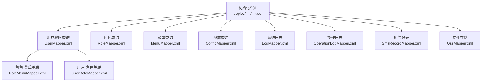
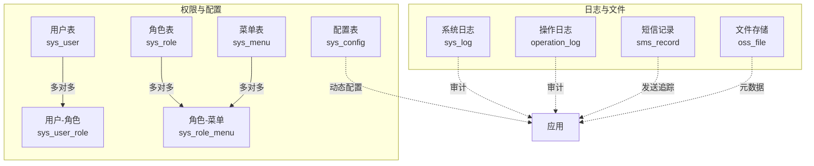
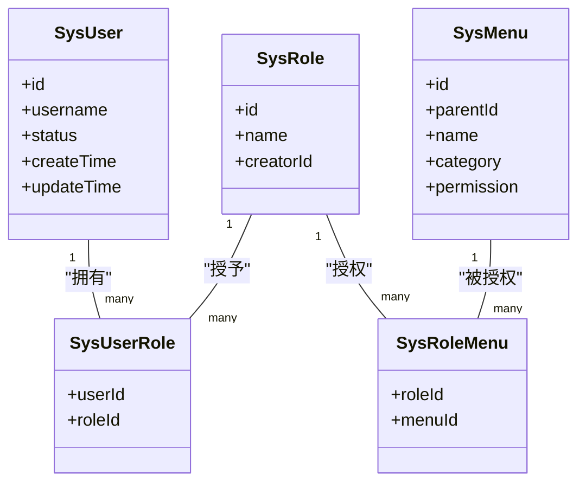
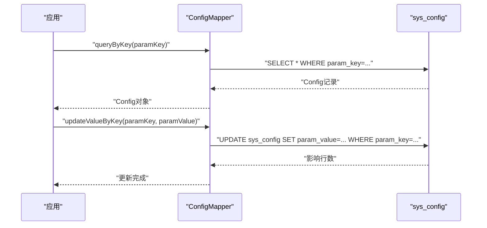
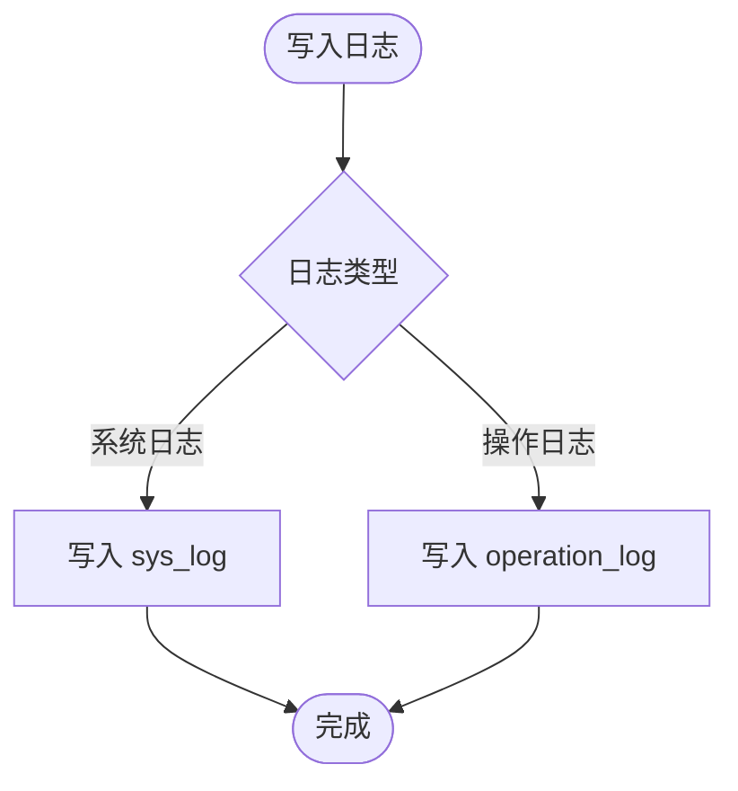
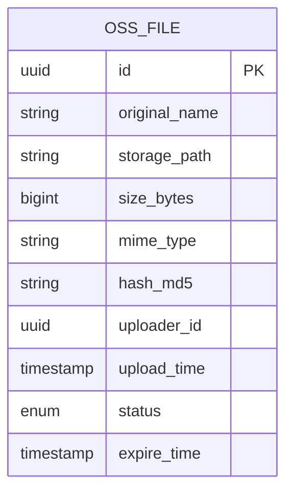
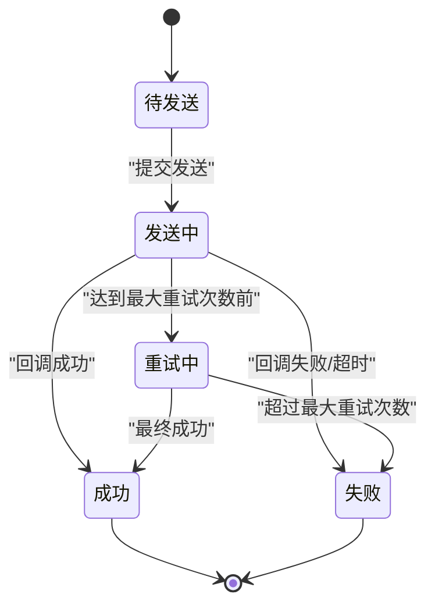
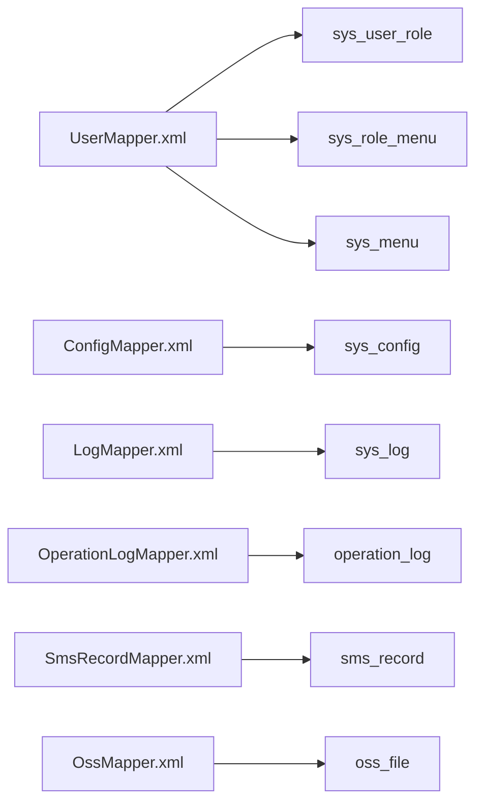

# 系统管理表设计

<cite>
**本文引用的文件**
- [init.sql](file://deploy/init/init.sql)
- [UserMapper.xml](file://monkey-service/src/main/resources/mapper/sys/UserMapper.xml)
- [RoleMapper.xml](file://monkey-service/src/main/resources/mapper/sys/RoleMapper.xml)
- [MenuMapper.xml](file://monkey-service/src/main/resources/mapper/sys/MenuMapper.xml)
- [RoleMenuMapper.xml](file://monkey-service/src/main/resources/mapper/sys/RoleMenuMapper.xml)
- [UserRoleMapper.xml](file://monkey-service/src/main/resources/mapper/sys/UserRoleMapper.xml)
- [ConfigMapper.xml](file://monkey-service/src/main/resources/mapper/sys/ConfigMapper.xml)
- [LogMapper.xml](file://monkey-service/src/main/resources/mapper/sys/LogMapper.xml)
- [OperationLogMapper.xml](file://monkey-service/src/main/resources/mapper/sd/OperationLogMapper.xml)
- [SmsRecordMapper.xml](file://monkey-service/src/main/resources/mapper/rd/SmsRecordMapper.xml)
- [OssMapper.xml](file://monkey-service/src/main/resources/mapper/oss/OssMapper.xml)
</cite>

## 目录
1. [简介](#简介)
2. [项目结构](#项目结构)
3. [核心组件](#核心组件)
4. [架构总览](#架构总览)
5. [详细组件分析](#详细组件分析)
6. [依赖关系分析](#依赖关系分析)
7. [性能考虑](#性能考虑)
8. [故障排查指南](#故障排查指南)
9. [结论](#结论)
10. [附录](#附录)

## 简介
本设计文档面向安威 fireworks 物物联网监控平台的系统管理模块，聚焦于以下系统管理表的结构设计与使用说明：
- 用户管理表：sys_user、sys_role、sys_menu 及其关联表 sys_user_role、sys_role_menu
- 配置管理表：sys_config
- 日志管理表：sys_log、operation_log
- 文件存储表：oss_file
- 短信记录表：sms_record

文档同时解释用户权限模型（角色继承、菜单权限与数据权限），配置项的存储结构与动态配置机制，日志表的设计（操作日志、登录日志与系统日志），文件上传元数据存储与生命周期管理，以及短信发送记录的状态跟踪机制，并给出查询优化策略与索引设计建议。

## 项目结构
系统管理相关表结构与权限查询主要分布在如下位置：
- 初始化脚本：deploy/init/init.sql 中定义了数据库与部分系统表（含 sys_* 表族）
- 权限与配置查询：monkey-service 模块的 MyBatis XML 映射文件（mapper/sys 与 mapper/sd、mapper/rd、mapper/oss）

**图表来源**
- [init.sql](file://deploy/init/init.sql)
- [UserMapper.xml](file://monkey-service/src/main/resources/mapper/sys/UserMapper.xml)
- [RoleMapper.xml](file://monkey-service/src/main/resources/mapper/sys/RoleMapper.xml)
- [MenuMapper.xml](file://monkey-service/src/main/resources/mapper/sys/MenuMapper.xml)
- [RoleMenuMapper.xml](file://monkey-service/src/main/resources/mapper/sys/RoleMenuMapper.xml)
- [UserRoleMapper.xml](file://monkey-service/src/main/resources/mapper/sys/UserRoleMapper.xml)
- [ConfigMapper.xml](file://monkey-service/src/main/resources/mapper/sys/ConfigMapper.xml)
- [LogMapper.xml](file://monkey-service/src/main/resources/mapper/sys/LogMapper.xml)
- [OperationLogMapper.xml](file://monkey-service/src/main/resources/mapper/sd/OperationLogMapper.xml)
- [SmsRecordMapper.xml](file://monkey-service/src/main/resources/mapper/rd/SmsRecordMapper.xml)
- [OssMapper.xml](file://monkey-service/src/main/resources/mapper/oss/OssMapper.xml)

**章节来源**
- [init.sql](file://deploy/init/init.sql)

## 核心组件
本节概述系统管理表的职责与关系：
- sys_user：系统用户主体，包含用户标识、认证凭据、状态与扩展信息
- sys_role：角色定义，支持角色层级或继承语义（通过 creator_id 等字段体现）
- sys_menu：菜单/资源定义，区分按钮、视图等类别（category 字段）
- sys_user_role：用户与角色的多对多关联
- sys_role_menu：角色与菜单的多对多关联
- sys_config：系统配置项，键值对形式存储
- sys_log：系统日志（通用）
- operation_log：操作日志（业务操作审计）
- oss_file：文件存储元数据
- sms_record：短信发送记录与状态

**章节来源**
- [init.sql](file://deploy/init/init.sql)
- [UserMapper.xml](file://monkey-service/src/main/resources/mapper/sys/UserMapper.xml)
- [RoleMapper.xml](file://monkey-service/src/main/resources/mapper/sys/RoleMapper.xml)
- [MenuMapper.xml](file://monkey-service/src/main/resources/mapper/sys/MenuMapper.xml)
- [RoleMenuMapper.xml](file://monkey-service/src/main/resources/mapper/sys/RoleMenuMapper.xml)
- [UserRoleMapper.xml](file://monkey-service/src/main/resources/mapper/sys/UserRoleMapper.xml)
- [ConfigMapper.xml](file://monkey-service/src/main/resources/mapper/sys/ConfigMapper.xml)
- [LogMapper.xml](file://monkey-service/src/main/resources/mapper/sys/LogMapper.xml)
- [OperationLogMapper.xml](file://monkey-service/src/main/resources/mapper/sd/OperationLogMapper.xml)
- [SmsRecordMapper.xml](file://monkey-service/src/main/resources/mapper/rd/SmsRecordMapper.xml)
- [OssMapper.xml](file://monkey-service/src/main/resources/mapper/oss/OssMapper.xml)

## 架构总览
系统管理权限与数据流概览：

**图表来源**
- [init.sql](file://deploy/init/init.sql)
- [UserMapper.xml](file://monkey-service/src/main/resources/mapper/sys/UserMapper.xml)
- [RoleMapper.xml](file://monkey-service/src/main/resources/mapper/sys/RoleMapper.xml)
- [MenuMapper.xml](file://monkey-service/src/main/resources/mapper/sys/MenuMapper.xml)
- [RoleMenuMapper.xml](file://monkey-service/src/main/resources/mapper/sys/RoleMenuMapper.xml)
- [UserRoleMapper.xml](file://monkey-service/src/main/resources/mapper/sys/UserRoleMapper.xml)
- [ConfigMapper.xml](file://monkey-service/src/main/resources/mapper/sys/ConfigMapper.xml)
- [LogMapper.xml](file://monkey-service/src/main/resources/mapper/sys/LogMapper.xml)
- [OperationLogMapper.xml](file://monkey-service/src/main/resources/mapper/sd/OperationLogMapper.xml)
- [SmsRecordMapper.xml](file://monkey-service/src/main/resources/mapper/rd/SmsRecordMapper.xml)
- [OssMapper.xml](file://monkey-service/src/main/resources/mapper/oss/OssMapper.xml)

## 详细组件分析

### 用户管理表（sys_user、sys_role、sys_menu）
- 用户表（sys_user）
  - 关键字段：用户标识、认证凭据、状态、创建/更新时间、扩展信息等
  - 用途：承载登录认证、角色绑定、数据权限过滤等
- 角色表（sys_role）
  - 关键字段：角色标识、角色名、描述、创建者标识（creator_id）等
  - 用途：定义角色集合，支持角色继承或层级（通过 creator_id 等字段体现）
- 菜单表（sys_menu）
  - 关键字段：菜单标识、父级标识、名称、路径、类别（category，区分按钮/视图等）、排序等
  - 用途：定义可访问的菜单与资源，配合权限控制
- 关联表
  - sys_user_role：用户与角色的多对多关联
  - sys_role_menu：角色与菜单的多对多关联

权限模型说明（基于现有映射与表结构）：
- 菜单权限：通过 sys_user_role → sys_role_menu → sys_menu 获取用户可见菜单树
- 按钮/接口权限：通过 sys_menu 的 category=2 且 sys_user_role → sys_role_menu → sys_menu 的 permission 字段聚合
- 数据权限：当前映射未直接暴露数据权限字段，需在业务层结合用户所属组织/区域等上下文实现

**图表来源**
- [init.sql](file://deploy/init/init.sql)
- [UserMapper.xml](file://monkey-service/src/main/resources/mapper/sys/UserMapper.xml)
- [RoleMapper.xml](file://monkey-service/src/main/resources/mapper/sys/RoleMapper.xml)
- [MenuMapper.xml](file://monkey-service/src/main/resources/mapper/sys/MenuMapper.xml)
- [RoleMenuMapper.xml](file://monkey-service/src/main/resources/mapper/sys/RoleMenuMapper.xml)
- [UserRoleMapper.xml](file://monkey-service/src/main/resources/mapper/sys/UserRoleMapper.xml)

**章节来源**
- [init.sql](file://deploy/init/init.sql)
- [UserMapper.xml](file://monkey-service/src/main/resources/mapper/sys/UserMapper.xml)
- [RoleMapper.xml](file://monkey-service/src/main/resources/mapper/sys/RoleMapper.xml)
- [MenuMapper.xml](file://monkey-service/src/main/resources/mapper/sys/MenuMapper.xml)
- [RoleMenuMapper.xml](file://monkey-service/src/main/resources/mapper/sys/RoleMenuMapper.xml)
- [UserRoleMapper.xml](file://monkey-service/src/main/resources/mapper/sys/UserRoleMapper.xml)

### 配置管理表（sys_config）
- 结构要点
  - 键值对存储：param_key（唯一）、param_value
  - 支持按 key 更新/查询
- 动态配置机制
  - 通过 ConfigMapper 提供的 updateValueByKey 与 queryByKey 实现运行时配置读取与更新
  - 建议在应用层增加缓存与变更广播，避免频繁数据库访问

**图表来源**
- [ConfigMapper.xml](file://monkey-service/src/main/resources/mapper/sys/ConfigMapper.xml)
- [init.sql](file://deploy/init/init.sql)

**章节来源**
- [ConfigMapper.xml](file://monkey-service/src/main/resources/mapper/sys/ConfigMapper.xml)
- [init.sql](file://deploy/init/init.sql)

### 日志管理表（sys_log、operation_log）
- sys_log（系统日志）
  - 用途：系统级事件、异常、启动/关闭等日志
  - 建议字段：日志级别、记录时间、模块、消息、详情、用户标识、请求标识等
- operation_log（操作日志）
  - 用途：业务操作审计，记录操作人、操作时间、操作类型、对象、前后值等
  - 建议字段：操作人、操作时间、模块、操作类型、目标对象、参数、结果、耗时等

**图表来源**
- [LogMapper.xml](file://monkey-service/src/main/resources/mapper/sys/LogMapper.xml)
- [OperationLogMapper.xml](file://monkey-service/src/main/resources/mapper/sd/OperationLogMapper.xml)

**章节来源**
- [LogMapper.xml](file://monkey-service/src/main/resources/mapper/sys/LogMapper.xml)
- [OperationLogMapper.xml](file://monkey-service/src/main/resources/mapper/sd/OperationLogMapper.xml)

### 文件存储表（oss_file）
- 元数据存储
  - 建议字段：文件标识、原始名称、存储路径、大小、类型、MD5/哈希、上传人、上传时间、状态、过期时间等
- 生命周期管理
  - 过期清理：基于过期时间定期扫描删除
  - 状态管理：启用/禁用/删除标记，便于回收站与恢复
  - 存储策略：支持本地/云存储，通过存储类型字段区分

**图表来源**
- [OssMapper.xml](file://monkey-service/src/main/resources/mapper/oss/OssMapper.xml)
- [init.sql](file://deploy/init/init.sql)

**章节来源**
- [OssMapper.xml](file://monkey-service/src/main/resources/mapper/oss/OssMapper.xml)
- [init.sql](file://deploy/init/init.sql)

### 短信记录表（sms_record）
- 记录结构
  - 建议字段：记录标识、手机号、内容、发送状态、错误码/错误信息、发送时间、完成时间、发送渠道、业务标识等
- 状态跟踪
  - 发送中/成功/失败/重试中，结合异步回调与轮询更新状态
  - 失败重试与上限控制，避免无限重试

**图表来源**
- [SmsRecordMapper.xml](file://monkey-service/src/main/resources/mapper/rd/SmsRecordMapper.xml)
- [init.sql](file://deploy/init/init.sql)

**章节来源**
- [SmsRecordMapper.xml](file://monkey-service/src/main/resources/mapper/rd/SmsRecordMapper.xml)
- [init.sql](file://deploy/init/init.sql)

## 依赖关系分析
- 权限查询依赖
  - 用户权限：sys_user → sys_user_role → sys_role_menu → sys_menu
  - 菜单树：sys_menu（按 parent_id 递归）
- 配置依赖
  - ConfigMapper 依赖 sys_config 表
- 日志依赖
  - sys_log 与 operation_log 作为独立审计表
- 文件与短信
  - oss_file 与 sms_record 作为外部能力的元数据载体

**图表来源**
- [UserMapper.xml](file://monkey-service/src/main/resources/mapper/sys/UserMapper.xml)
- [RoleMenuMapper.xml](file://monkey-service/src/main/resources/mapper/sys/RoleMenuMapper.xml)
- [UserRoleMapper.xml](file://monkey-service/src/main/resources/mapper/sys/UserRoleMapper.xml)
- [MenuMapper.xml](file://monkey-service/src/main/resources/mapper/sys/MenuMapper.xml)
- [ConfigMapper.xml](file://monkey-service/src/main/resources/mapper/sys/ConfigMapper.xml)
- [LogMapper.xml](file://monkey-service/src/main/resources/mapper/sys/LogMapper.xml)
- [OperationLogMapper.xml](file://monkey-service/src/main/resources/mapper/sd/OperationLogMapper.xml)
- [SmsRecordMapper.xml](file://monkey-service/src/main/resources/mapper/rd/SmsRecordMapper.xml)
- [OssMapper.xml](file://monkey-service/src/main/resources/mapper/oss/OssMapper.xml)

**章节来源**
- [UserMapper.xml](file://monkey-service/src/main/resources/mapper/sys/UserMapper.xml)
- [RoleMenuMapper.xml](file://monkey-service/src/main/resources/mapper/sys/RoleMenuMapper.xml)
- [UserRoleMapper.xml](file://monkey-service/src/main/resources/mapper/sys/UserRoleMapper.xml)
- [MenuMapper.xml](file://monkey-service/src/main/resources/mapper/sys/MenuMapper.xml)
- [ConfigMapper.xml](file://monkey-service/src/main/resources/mapper/sys/ConfigMapper.xml)
- [LogMapper.xml](file://monkey-service/src/main/resources/mapper/sys/LogMapper.xml)
- [OperationLogMapper.xml](file://monkey-service/src/main/resources/mapper/sd/OperationLogMapper.xml)
- [SmsRecordMapper.xml](file://monkey-service/src/main/resources/mapper/rd/SmsRecordMapper.xml)
- [OssMapper.xml](file://monkey-service/src/main/resources/mapper/oss/OssMapper.xml)

## 性能考虑
- 索引建议
  - sys_user(username)：登录与查询常用
  - sys_user_role(user_id)、sys_user_role(role_id)：用户-角色批量查询
  - sys_role_menu(role_id)、sys_role_menu(menu_id)：角色-菜单批量查询
  - sys_menu(parent_id)：菜单树构建
  - sys_config(param_key)：配置项快速定位
  - sys_log/create_time、operation_log/create_time：日志按时间检索
  - sms_record/create_time、sms_record/status：短信状态与时间检索
  - oss_file/upload_time、oss_file/status：文件生命周期管理
- 查询优化
  - 权限树构建尽量一次性加载，避免 N+1 查询
  - 配置项建议引入缓存层，减少数据库压力
  - 日志与短信记录按天/周分区或归档，降低热表扫描
- 分页与分批
  - 大表分页采用“游标式”或“基于索引”的高效分页策略
  - 批量删除/更新使用 in 批次提交，避免长事务

## 故障排查指南
- 登录/权限问题
  - 检查 sys_user 是否存在且状态正常
  - 检查 sys_user_role 与 sys_role_menu 是否正确绑定
  - 检查 sys_menu 的 category 与 permission 是否符合预期
- 配置不生效
  - 确认 sys_config 的 param_key 是否一致
  - 检查应用侧缓存是否已刷新
- 日志缺失
  - 确认日志表结构与字段是否匹配
  - 检查日志写入开关与级别
- 文件/短信异常
  - 检查 oss_file 的状态与过期时间
  - 检查 sms_record 的状态机流转与重试上限

**章节来源**
- [UserMapper.xml](file://monkey-service/src/main/resources/mapper/sys/UserMapper.xml)
- [RoleMapper.xml](file://monkey-service/src/main/resources/mapper/sys/RoleMapper.xml)
- [MenuMapper.xml](file://monkey-service/src/main/resources/mapper/sys/MenuMapper.xml)
- [ConfigMapper.xml](file://monkey-service/src/main/resources/mapper/sys/ConfigMapper.xml)
- [LogMapper.xml](file://monkey-service/src/main/resources/mapper/sys/LogMapper.xml)
- [OperationLogMapper.xml](file://monkey-service/src/main/resources/mapper/sd/OperationLogMapper.xml)
- [SmsRecordMapper.xml](file://monkey-service/src/main/resources/mapper/rd/SmsRecordMapper.xml)
- [OssMapper.xml](file://monkey-service/src/main/resources/mapper/oss/OssMapper.xml)

## 结论
本文基于现有初始化脚本与 MyBatis 映射文件，梳理了系统管理表的结构与权限模型，明确了配置、日志、文件与短信等子系统的表设计要点与运行机制。建议后续补充：
- 在 sys_menu 中明确数据权限字段与分类
- 在 sys_user 中补充组织/区域字段以支撑数据权限
- 在日志与短信表中完善状态字段与索引
- 在 oss_file 中完善生命周期与安全校验字段

## 附录
- 初始化脚本中包含数据库与部分系统表定义，是系统管理表设计的基础依据
- MyBatis 映射文件提供了权限与配置的关键查询入口

**章节来源**
- [init.sql](file://deploy/init/init.sql)
- [UserMapper.xml](file://monkey-service/src/main/resources/mapper/sys/UserMapper.xml)
- [RoleMapper.xml](file://monkey-service/src/main/resources/mapper/sys/RoleMapper.xml)
- [MenuMapper.xml](file://monkey-service/src/main/resources/mapper/sys/MenuMapper.xml)
- [RoleMenuMapper.xml](file://monkey-service/src/main/resources/mapper/sys/RoleMenuMapper.xml)
- [UserRoleMapper.xml](file://monkey-service/src/main/resources/mapper/sys/UserRoleMapper.xml)
- [ConfigMapper.xml](file://monkey-service/src/main/resources/mapper/sys/ConfigMapper.xml)
- [LogMapper.xml](file://monkey-service/src/main/resources/mapper/sys/LogMapper.xml)
- [OperationLogMapper.xml](file://monkey-service/src/main/resources/mapper/sd/OperationLogMapper.xml)
- [SmsRecordMapper.xml](file://monkey-service/src/main/resources/mapper/rd/SmsRecordMapper.xml)
- [OssMapper.xml](file://monkey-service/src/main/resources/mapper/oss/OssMapper.xml)