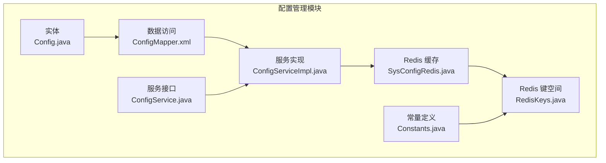
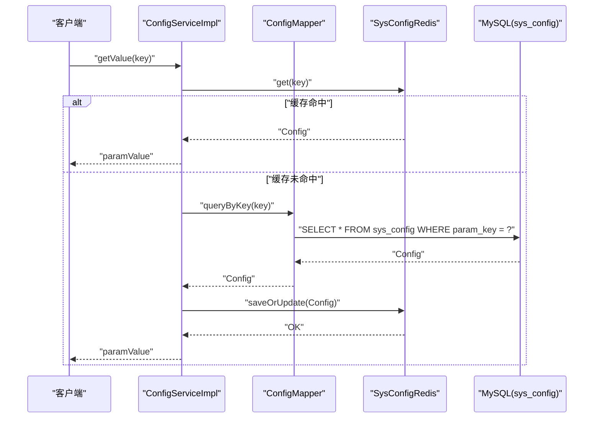
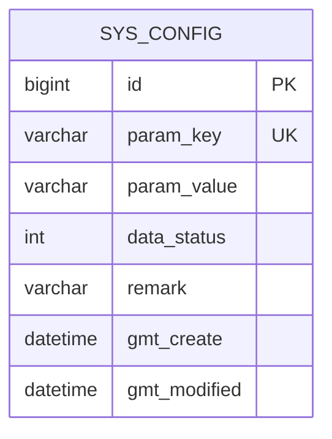
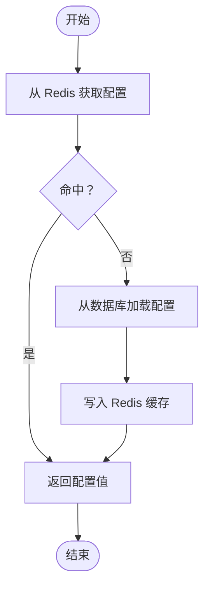
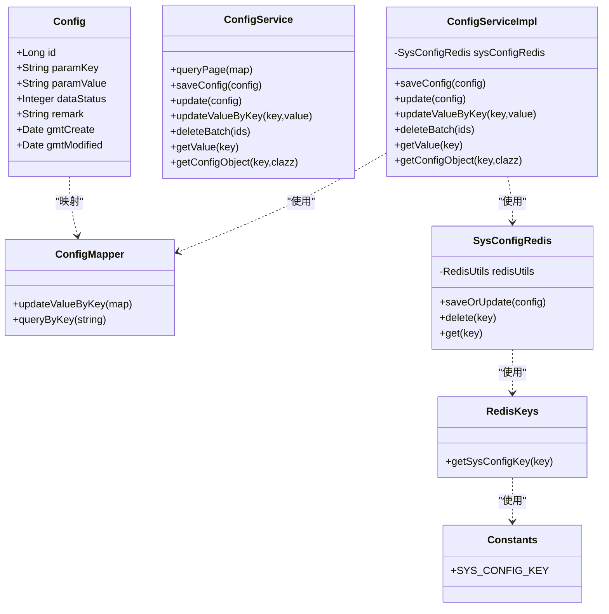

# 配置管理表设计

<cite>
**本文引用的文件**
- [Config.java](file://monkey-service/src/main/java/com/monkey/general/modules/sys/entity/Config.java)
- [ConfigMapper.xml](file://monkey-service/src/main/resources/mapper/sys/ConfigMapper.xml)
- [ConfigService.java](file://monkey-service/src/main/java/com/monkey/general/modules/sys/service/ConfigService.java)
- [ConfigServiceImpl.java](file://monkey-service/src/main/java/com/monkey/general/modules/sys/service/impl/ConfigServiceImpl.java)
- [SysConfigRedis.java](file://monkey-service/src/main/java/com/monkey/general/modules/sys/redis/SysConfigRedis.java)
- [RedisKeys.java](file://monkey-common/src/main/java/com/monkey/general/common/utils/RedisKeys.java)
- [Constants.java](file://monkey-common/src/main/java/com/monkey/general/common/constant/Constants.java)
- [init.sql](file://deploy/init/init.sql)
</cite>

## 目录
1. [简介](#简介)
2. [项目结构](#项目结构)
3. [核心组件](#核心组件)
4. [架构总览](#架构总览)
5. [详细组件分析](#详细组件分析)
6. [依赖关系分析](#依赖关系分析)
7. [性能考虑](#性能考虑)
8. [故障排查指南](#故障排查指南)
9. [结论](#结论)
10. [附录](#附录)

## 简介
本文件面向安威 fireworks 物联网监控平台，系统性梳理并设计“系统配置表（sys_config）”的字段结构、存储机制、动态配置与缓存策略、配置分组与分类管理、安全存储与访问控制、查询性能优化与缓存失效机制，以及配置变更的日志与审计能力。目标是为平台提供可扩展、高性能、可审计的配置管理体系。

## 项目结构
围绕配置管理的核心模块与文件分布如下：
- 实体层：sys_config 表对应的实体类
- 数据访问层：MyBatis Mapper XML
- 业务服务层：配置服务接口与实现
- 缓存层：基于 Redis 的配置缓存工具
- 常量与键空间：统一的 Redis Key 命名规范
- 初始化脚本：数据库初始化与示例数据

图表来源
- [Config.java:1-62](file://monkey-service/src/main/java/com/monkey/general/modules/sys/entity/Config.java#L1-L62)
- [ConfigMapper.xml:1-16](file://monkey-service/src/main/resources/mapper/sys/ConfigMapper.xml#L1-L16)
- [ConfigService.java:1-53](file://monkey-service/src/main/java/com/monkey/general/modules/sys/service/ConfigService.java#L1-L53)
- [ConfigServiceImpl.java:1-97](file://monkey-service/src/main/java/com/monkey/general/modules/sys/service/impl/ConfigServiceImpl.java#L1-L97)
- [SysConfigRedis.java:1-38](file://monkey-service/src/main/java/com/monkey/general/modules/sys/redis/SysConfigRedis.java#L1-L38)
- [RedisKeys.java:1-14](file://monkey-common/src/main/java/com/monkey/general/common/utils/RedisKeys.java#L1-L14)
- [Constants.java:120-123](file://monkey-common/src/main/java/com/monkey/general/common/constant/Constants.java#L120-L123)

章节来源
- [Config.java:1-62](file://monkey-service/src/main/java/com/monkey/general/modules/sys/entity/Config.java#L1-L62)
- [ConfigMapper.xml:1-16](file://monkey-service/src/main/resources/mapper/sys/ConfigMapper.xml#L1-L16)
- [ConfigService.java:1-53](file://monkey-service/src/main/java/com/monkey/general/modules/sys/service/ConfigService.java#L1-L53)
- [ConfigServiceImpl.java:1-97](file://monkey-service/src/main/java/com/monkey/general/modules/sys/service/impl/ConfigServiceImpl.java#L1-L97)
- [SysConfigRedis.java:1-38](file://monkey-service/src/main/java/com/monkey/general/modules/sys/redis/SysConfigRedis.java#L1-L38)
- [RedisKeys.java:1-14](file://monkey-common/src/main/java/com/monkey/general/common/utils/RedisKeys.java#L1-L14)
- [Constants.java:120-123](file://monkey-common/src/main/java/com/monkey/general/common/constant/Constants.java#L120-L123)

## 核心组件
- sys_config 表字段与语义
  - 主键：自增整型
  - 键：字符串唯一标识
  - 值：字符串（支持 JSON 等序列化内容）
  - 数据状态：0-禁用、1-启用
  - 备注：描述性信息
  - 创建/更新时间：自动填充
- 配置服务接口与实现
  - 提供分页查询、保存、更新、按键更新值、批量删除、按键取值、按键取对象等能力
  - 支持将配置对象序列化为 JSON 存储，并在读取时反序列化
- Redis 缓存策略
  - 使用统一前缀的键空间进行缓存
  - 写入/更新时写入缓存；删除或按键更新值时主动失效缓存
- 键空间与常量
  - 统一的 Redis Key 前缀，便于命名规范与清理

章节来源
- [Config.java:20-61](file://monkey-service/src/main/java/com/monkey/general/modules/sys/entity/Config.java#L20-L61)
- [ConfigMapper.xml:6-14](file://monkey-service/src/main/resources/mapper/sys/ConfigMapper.xml#L6-L14)
- [ConfigService.java:14-52](file://monkey-service/src/main/java/com/monkey/general/modules/sys/service/ConfigService.java#L14-L52)
- [ConfigServiceImpl.java:22-96](file://monkey-service/src/main/java/com/monkey/general/modules/sys/service/impl/ConfigServiceImpl.java#L22-L96)
- [SysConfigRedis.java:15-37](file://monkey-service/src/main/java/com/monkey/general/modules/sys/redis/SysConfigRedis.java#L15-L37)
- [RedisKeys.java:10-12](file://monkey-common/src/main/java/com/monkey/general/common/utils/RedisKeys.java#L10-L12)
- [Constants.java:120-123](file://monkey-common/src/main/java/com/monkey/general/common/constant/Constants.java#L120-L123)

## 架构总览
配置管理采用“数据库 + Redis 缓存”的双写架构，确保高并发下的低延迟读取与一致性更新。

图表来源
- [ConfigServiceImpl.java:72-81](file://monkey-service/src/main/java/com/monkey/general/modules/sys/service/impl/ConfigServiceImpl.java#L72-L81)
- [ConfigMapper.xml:11-14](file://monkey-service/src/main/resources/mapper/sys/ConfigMapper.xml#L11-L14)
- [SysConfigRedis.java:20-36](file://monkey-service/src/main/java/com/monkey/general/modules/sys/redis/SysConfigRedis.java#L20-L36)

## 详细组件分析

### sys_config 表字段结构与设计
- 字段说明
  - id：主键，自增
  - param_key：配置键，建议使用层级命名（如 system.log.level），保证唯一性
  - param_value：配置值，建议以 JSON 形式存储复杂对象，便于序列化/反序列化
  - data_status：数据状态，用于逻辑禁用配置而不删除
  - remark：配置说明
  - gmt_create/gmt_modified：自动填充创建与更新时间
- 设计要点
  - 键的命名应具备可读性与可维护性，避免硬编码
  - 值的类型通过 param_value 字符串存储，读取侧根据需要转换
  - data_status 作为开关，便于快速灰度与回滚

图表来源
- [Config.java:20-61](file://monkey-service/src/main/java/com/monkey/general/modules/sys/entity/Config.java#L20-L61)

章节来源
- [Config.java:20-61](file://monkey-service/src/main/java/com/monkey/general/modules/sys/entity/Config.java#L20-L61)

### 配置存储机制与版本管理
- 存储机制
  - 写入：保存配置后同时写入 Redis 缓存
  - 更新：更新后刷新缓存；按键更新值时仅删除对应键，避免脏读
  - 删除：批量删除时逐条失效缓存键
- 版本管理
  - 建议在 param_value 中嵌入版本号字段，或引入独立的 version 字段
  - 读取时校验版本，不匹配则触发回源刷新缓存
  - 变更时更新版本号并主动失效缓存

章节来源
- [ConfigServiceImpl.java:42-70](file://monkey-service/src/main/java/com/monkey/general/modules/sys/service/impl/ConfigServiceImpl.java#L42-L70)

### 动态配置与缓存策略
- Redis 缓存策略
  - 键空间：统一前缀，便于管理与清理
  - 命中流程：优先从 Redis 读取，未命中再回源数据库
  - 失效策略：写入/更新/删除均主动失效对应键
- 配置热更新
  - 通过按键更新值接口触发缓存失效，下一次读取自动回源并写入新值
  - 对于高频变更的配置，可在应用启动时加载到内存并监听变更事件

图表来源
- [ConfigServiceImpl.java:72-81](file://monkey-service/src/main/java/com/monkey/general/modules/sys/service/impl/ConfigServiceImpl.java#L72-L81)
- [SysConfigRedis.java:20-36](file://monkey-service/src/main/java/com/monkey/general/modules/sys/redis/SysConfigRedis.java#L20-L36)

章节来源
- [SysConfigRedis.java:15-37](file://monkey-service/src/main/java/com/monkey/general/modules/sys/redis/SysConfigRedis.java#L15-L37)
- [ConfigServiceImpl.java:72-81](file://monkey-service/src/main/java/com/monkey/general/modules/sys/service/impl/ConfigServiceImpl.java#L72-L81)

### 配置分组与分类管理
- 分组建议
  - 系统配置：平台运行参数、日志级别、资源限制等
  - 业务配置：业务规则、阈值、开关等
  - 第三方集成配置：外部系统接入参数、认证凭据等
- 命名规范
  - 使用点号或下划线分隔层级，如 system.log.level、business.threshold.temperature
  - 不同分组使用不同前缀，便于检索与权限控制
- 管理方式
  - 在前端提供分组筛选与排序
  - 通过 data_status 实现分组维度的启停

章节来源
- [ConfigService.java:28-36](file://monkey-service/src/main/java/com/monkey/general/modules/sys/service/ConfigService.java#L28-L36)
- [ConfigServiceImpl.java:27-39](file://monkey-service/src/main/java/com/monkey/general/modules/sys/service/impl/ConfigServiceImpl.java#L27-L39)

### 安全存储与访问控制
- 敏感配置加密
  - 对含口令、密钥的配置值进行对称加密存储
  - 解密仅在必要时进行，避免明文长期驻留内存
- 访问控制
  - 通过 RBAC 控制配置的增删改查权限
  - 对敏感配置单独设置只读或受限访问
- 审计与追踪
  - 记录每次变更的操作人、时间、旧值、新值
  - 提供审计日志接口，支持导出与检索

章节来源
- [ConfigService.java:18-26](file://monkey-service/src/main/java/com/monkey/general/modules/sys/service/ConfigService.java#L18-L26)
- [ConfigServiceImpl.java:48-52](file://monkey-service/src/main/java/com/monkey/general/modules/sys/service/impl/ConfigServiceImpl.java#L48-L52)

### 查询性能优化与缓存失效
- 性能优化
  - 为 param_key 建立唯一索引，确保按键查询高效
  - 对常用配置键建立二级缓存，减少数据库压力
  - 批量查询时使用 data_status=1 进行过滤
- 缓存失效
  - 写入/更新/删除后立即失效对应键
  - 提供批量失效接口，支持按前缀清理

章节来源
- [ConfigMapper.xml:11-14](file://monkey-service/src/main/resources/mapper/sys/ConfigMapper.xml#L11-L14)
- [ConfigServiceImpl.java:54-70](file://monkey-service/src/main/java/com/monkey/general/modules/sys/service/impl/ConfigServiceImpl.java#L54-L70)

### 配置变更日志与审计
- 日志记录
  - 记录操作类型（新增/修改/删除）、操作人、时间戳
  - 记录变更前后值的摘要，避免泄露敏感信息
- 审计功能
  - 提供审计报表与导出
  - 支持按时间段、操作人、配置键范围检索

章节来源
- [ConfigService.java:38-50](file://monkey-service/src/main/java/com/monkey/general/modules/sys/service/ConfigService.java#L38-L50)
- [ConfigServiceImpl.java:72-96](file://monkey-service/src/main/java/com/monkey/general/modules/sys/service/impl/ConfigServiceImpl.java#L72-L96)

## 依赖关系分析
- 组件耦合
  - ConfigServiceImpl 依赖 ConfigMapper 与 SysConfigRedis
  - SysConfigRedis 依赖 RedisUtils 与 RedisKeys
  - Constants 提供全局常量，被 RedisKeys 使用
- 外部依赖
  - MySQL：sys_config 表
  - Redis：配置缓存
  - MyBatis：SQL 映射

图表来源
- [Config.java:19-61](file://monkey-service/src/main/java/com/monkey/general/modules/sys/entity/Config.java#L19-L61)
- [ConfigMapper.xml:4-16](file://monkey-service/src/main/resources/mapper/sys/ConfigMapper.xml#L4-L16)
- [ConfigService.java:14-52](file://monkey-service/src/main/java/com/monkey/general/modules/sys/service/ConfigService.java#L14-L52)
- [ConfigServiceImpl.java:22-96](file://monkey-service/src/main/java/com/monkey/general/modules/sys/service/impl/ConfigServiceImpl.java#L22-L96)
- [SysConfigRedis.java:15-37](file://monkey-service/src/main/java/com/monkey/general/modules/sys/redis/SysConfigRedis.java#L15-L37)
- [RedisKeys.java:10-12](file://monkey-common/src/main/java/com/monkey/general/common/utils/RedisKeys.java#L10-L12)
- [Constants.java:120-123](file://monkey-common/src/main/java/com/monkey/general/common/constant/Constants.java#L120-L123)

## 性能考虑
- 读路径优化
  - Redis 命中率优先，未命中时批量回源并写入缓存
  - 对热点配置键增加本地缓存（进程内缓存）
- 写路径优化
  - 批量写入时合并失效操作，减少多次网络往返
  - 异步刷新缓存，降低写入延迟
- 索引与查询
  - 为 param_key 建唯一索引
  - 分页查询时按 data_status 过滤，避免扫描全表

## 故障排查指南
- 常见问题
  - 缓存未命中：确认 Redis 是否可用、键空间前缀是否一致
  - 写入后读取旧值：确认是否正确调用按键更新值接口导致缓存失效
  - 敏感配置解密失败：核对加密算法与密钥配置
- 排查步骤
  - 检查 Redis 中是否存在对应键
  - 查看数据库中该键的状态与值
  - 核对服务端日志中的异常堆栈
  - 对比 Constants 与 RedisKeys 的键前缀配置

章节来源
- [SysConfigRedis.java:20-36](file://monkey-service/src/main/java/com/monkey/general/modules/sys/redis/SysConfigRedis.java#L20-L36)
- [ConfigServiceImpl.java:54-81](file://monkey-service/src/main/java/com/monkey/general/modules/sys/service/impl/ConfigServiceImpl.java#L54-L81)
- [Constants.java:120-123](file://monkey-common/src/main/java/com/monkey/general/common/constant/Constants.java#L120-L123)

## 结论
本文给出了安威 fireworks 平台配置管理表（sys_config）的完整设计方案，涵盖字段结构、存储与版本管理、动态配置与缓存策略、分组与分类、安全与审计、性能优化与故障排查。建议在现有实现基础上补充版本号字段、敏感配置加密与审计日志，以满足生产环境的高可用与合规要求。

## 附录
- 初始化脚本参考
  - 数据库初始化与示例数据可参考部署脚本中的初始化 SQL

章节来源
- [init.sql:1-219](file://deploy/init/init.sql#L1-L219)