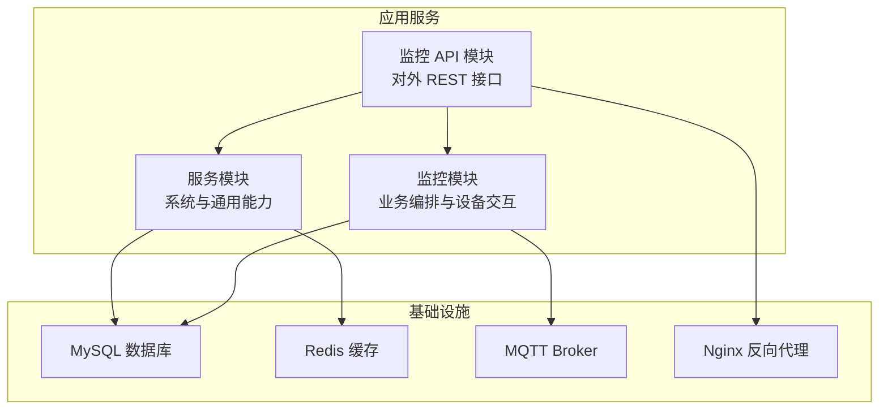
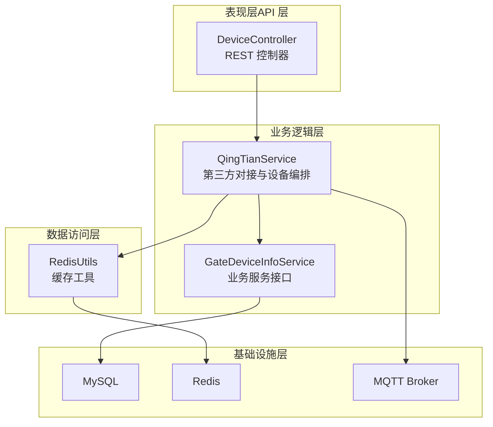
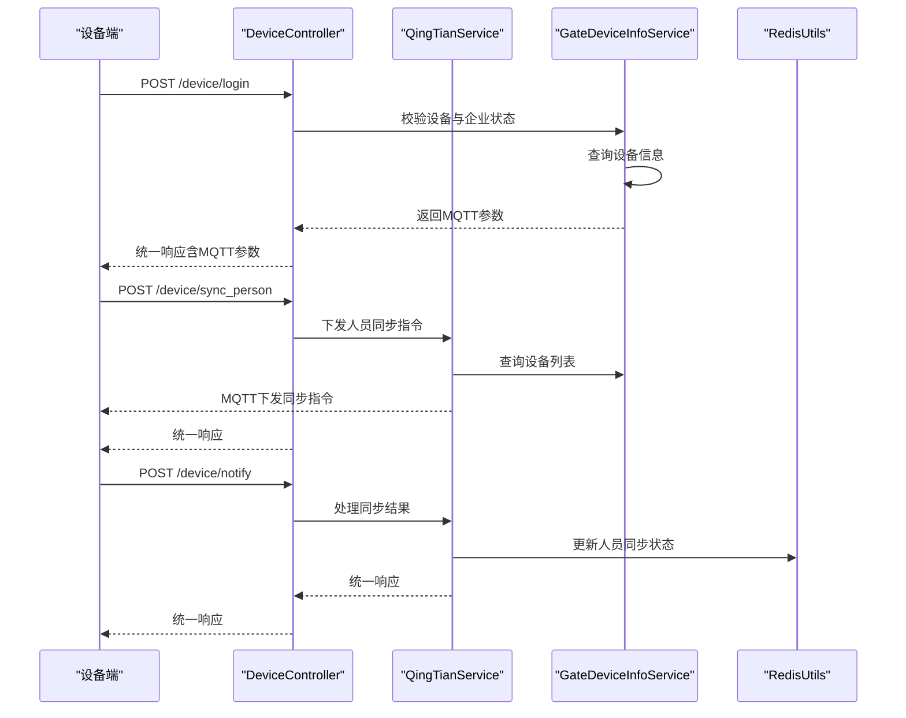
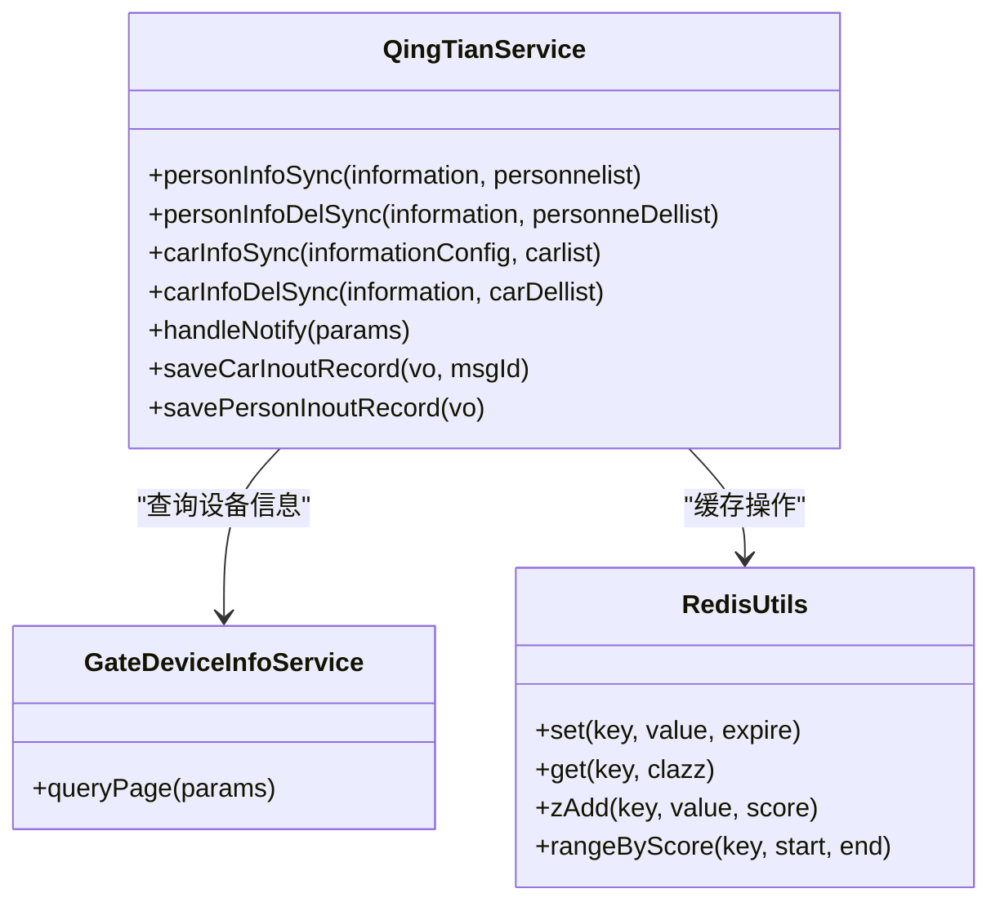
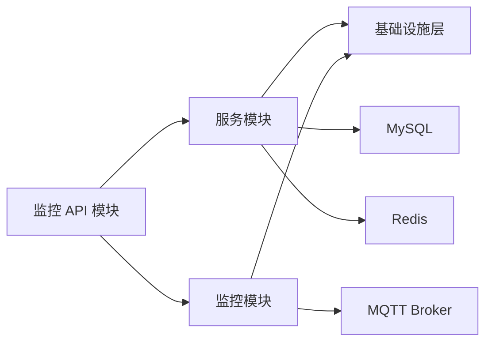
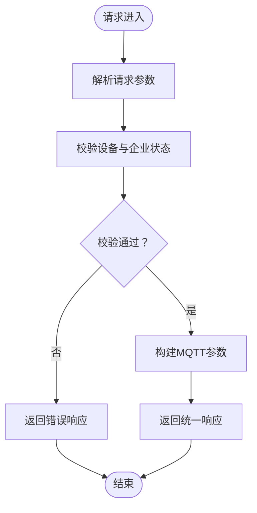

# 分层架构设计

<cite>
**本文引用的文件**
- [pom.xml](file://pom.xml)
- [docker-compose.yml](file://deploy/docker-compose.yml)
- [application.yml](file://monkey-monitor-api/src/main/resources/application.yml)
- [MonkeyMonitorApplication.java](file://monkey-monitor-api/src/main/java/com/monkey/general/MonkeyMonitorApplication.java)
- [DeviceController.java](file://monkey-monitor-api/src/main/java/com/monkey/general/controller/DeviceController.java)
- [QingTianService.java](file://monkey-monitor/src/main/java/com/monkey/general/modules/third/service/QingTianService.java)
- [GateDeviceInfoService.java](file://monkey-monitor/src/main/java/com/monkey/general/modules/em/service/GateDeviceInfoService.java)
- [UserService.java](file://monkey-service/src/main/java/com/monkey/general/modules/sys/service/UserService.java)
- [RedisUtils.java](file://monkey-service/src/main/java/com/monkey/general/common/utils/RedisUtils.java)
- [MqttConfiguration.java](file://monkey-monitor/src/main/java/com/monkey/general/config/MqttConfiguration.java)
- [ApplicationConfig.java](file://monkey-common/src/main/java/com/monkey/general/common/config/ApplicationConfig.java)
</cite>

## 目录
1. [引言](#引言)
2. [项目结构](#项目结构)
3. [核心组件](#核心组件)
4. [架构总览](#架构总览)
5. [详细组件分析](#详细组件分析)
6. [依赖分析](#依赖分析)
7. [性能考虑](#性能考虑)
8. [故障排查指南](#故障排查指南)
9. [结论](#结论)
10. [附录](#附录)

## 引言
本设计文档面向“安威 fireworks 物联网监控平台”，基于现有代码库梳理并提出四层架构设计：表现层（API 层）、业务逻辑层、数据访问层、基础设施层。文档旨在阐明各层职责与边界、层间依赖与调用方向，解释表现层如何通过 RESTful API 提供统一接口，业务逻辑层如何封装核心业务规则，数据访问层如何抽象持久化操作；同时总结分层架构在关注点分离、可测试性、可维护性等方面的优势，并给出分层架构图与典型请求处理流程图。

## 项目结构
项目采用 Maven 多模块组织，包含通用模块、监控 API 模块、监控业务模块、服务模块与定时任务模块。整体以“监控 API”作为对外入口，内部通过服务模块与监控模块实现业务编排与数据处理。

图表来源
- [pom.xml](file://pom.xml)
- [docker-compose.yml](file://deploy/docker-compose.yml)

章节来源
- [pom.xml](file://pom.xml)
- [docker-compose.yml](file://deploy/docker-compose.yml)

## 核心组件
- 表现层（API 层）
  - 入口应用：监控 API 应用负责启动与环境初始化。
  - 控制器：对外暴露 REST 接口，接收设备侧请求并协调业务与数据访问。
- 业务逻辑层
  - 第三方对接服务：负责与外部平台交互、设备指令下发、数据同步与落库。
  - 业务服务接口：定义业务能力契约，便于替换与扩展。
- 数据访问层
  - 通用缓存工具：封装 Redis 操作，支撑高频读取与会话状态管理。
  - MyBatis Plus 配置：统一 Mapper 与实体扫描，提供基础 CRUD 能力。
- 基础设施层
  - MySQL：持久化业务数据。
  - Redis：缓存与分布式锁等。
  - MQTT：设备消息通道。
  - Nginx：前端静态资源与反向代理。

章节来源
- [MonkeyMonitorApplication.java](file://monkey-monitor-api/src/main/java/com/monkey/general/MonkeyMonitorApplication.java)
- [DeviceController.java](file://monkey-monitor-api/src/main/java/com/monkey/general/controller/DeviceController.java)
- [QingTianService.java](file://monkey-monitor/src/main/java/com/monkey/general/modules/third/service/QingTianService.java)
- [GateDeviceInfoService.java](file://monkey-monitor/src/main/java/com/monkey/general/modules/em/service/GateDeviceInfoService.java)
- [RedisUtils.java](file://monkey-service/src/main/java/com/monkey/general/common/utils/RedisUtils.java)
- [application.yml](file://monkey-monitor-api/src/main/resources/application.yml)

## 架构总览
四层架构从外到内分别为：
- 表现层（API 层）：负责请求接入、参数校验、响应封装与跨模块协调。
- 业务逻辑层：封装核心业务规则、第三方平台对接、设备指令下发与数据落库。
- 数据访问层：抽象持久化操作，提供统一的数据访问能力。
- 基础设施层：提供数据库、缓存、消息中间件等运行所需资源。

图表来源
- [DeviceController.java](file://monkey-monitor-api/src/main/java/com/monkey/general/controller/DeviceController.java)
- [QingTianService.java](file://monkey-monitor/src/main/java/com/monkey/general/modules/third/service/QingTianService.java)
- [GateDeviceInfoService.java](file://monkey-monitor/src/main/java/com/monkey/general/modules/em/service/GateDeviceInfoService.java)
- [RedisUtils.java](file://monkey-service/src/main/java/com/monkey/general/common/utils/RedisUtils.java)

## 详细组件分析

### 表现层（API 层）
- 职责与边界
  - 接收来自设备侧的登录、人员同步、通知回调等请求。
  - 参数校验与错误码封装，向上返回统一响应结构。
  - 协调业务层与数据访问层，确保流程闭环。
- 典型控制器
  - 设备登录：校验设备与企业状态，下发 MQTT 连接参数。
  - 人员同步：拉取企业人员列表并下发至设备。
  - 通知回调：接收设备侧同步结果，更新本地状态。
- 关键调用链
  - 控制器 → 业务服务（第三方对接）→ 业务服务接口（设备信息）→ 缓存/数据库。

图表来源
- [DeviceController.java](file://monkey-monitor-api/src/main/java/com/monkey/general/controller/DeviceController.java)
- [QingTianService.java](file://monkey-monitor/src/main/java/com/monkey/general/modules/third/service/QingTianService.java)
- [GateDeviceInfoService.java](file://monkey-monitor/src/main/java/com/monkey/general/modules/em/service/GateDeviceInfoService.java)
- [RedisUtils.java](file://monkey-service/src/main/java/com/monkey/general/common/utils/RedisUtils.java)

章节来源
- [DeviceController.java](file://monkey-monitor-api/src/main/java/com/monkey/general/controller/DeviceController.java)

### 业务逻辑层
- 职责与边界
  - 封装与第三方平台的交互协议与指令下发。
  - 负责设备指令的组装、发布与结果处理。
  - 维护业务状态与异常处理，保证流程一致性。
- 关键实现
  - 第三方对接服务：负责 MQTT 消息发布、HTTP 请求签名与落库。
  - 业务服务接口：定义设备信息等业务能力契约。
- 优势
  - 与表现层解耦，便于扩展新设备或新业务场景。
  - 通过接口抽象，降低对具体实现的耦合度。

图表来源
- [QingTianService.java](file://monkey-monitor/src/main/java/com/monkey/general/modules/third/service/QingTianService.java)
- [GateDeviceInfoService.java](file://monkey-monitor/src/main/java/com/monkey/general/modules/em/service/GateDeviceInfoService.java)
- [RedisUtils.java](file://monkey-service/src/main/java/com/monkey/general/common/utils/RedisUtils.java)

章节来源
- [QingTianService.java](file://monkey-monitor/src/main/java/com/monkey/general/modules/third/service/QingTianService.java)
- [GateDeviceInfoService.java](file://monkey-monitor/src/main/java/com/monkey/general/modules/em/service/GateDeviceInfoService.java)

### 数据访问层
- 职责与边界
  - 抽象缓存与数据库访问，提供统一的读写接口。
  - 支撑高频读取、分布式锁、有序集合等场景。
- 关键实现
  - Redis 工具类：封装字符串、哈希、有序集合等常用操作。
  - MyBatis Plus 配置：统一 Mapper 与实体扫描，提供基础 CRUD 能力。
- 优势
  - 降低对具体存储实现的关注，提升可替换性。
  - 通过统一工具类减少重复代码，提高一致性。

章节来源
- [RedisUtils.java](file://monkey-service/src/main/java/com/monkey/general/common/utils/RedisUtils.java)
- [application.yml](file://monkey-monitor-api/src/main/resources/application.yml)

### 基础设施层
- 职责与边界
  - 提供数据库、缓存、消息中间件与网关等运行所需资源。
- 关键组件
  - MySQL：持久化业务数据。
  - Redis：缓存与会话状态管理。
  - MQTT Broker：设备消息通道。
  - Nginx：前端静态资源与反向代理。
- 优势
  - 通过容器编排实现快速部署与弹性伸缩。
  - 明确的资源边界，便于运维与容量规划。

章节来源
- [docker-compose.yml](file://deploy/docker-compose.yml)

## 依赖分析
- 模块依赖
  - 监控 API 模块依赖服务模块与监控模块，提供对外接口。
  - 服务模块提供通用能力（如 Redis 工具），被其他模块复用。
  - 监控模块依赖数据库与 MQTT，负责业务编排与设备交互。
- 层间依赖
  - 表现层仅依赖业务逻辑层接口，避免直接依赖具体实现。
  - 业务逻辑层依赖数据访问层与基础设施层，但通过接口隔离。
  - 数据访问层依赖基础设施层，提供统一抽象。

图表来源
- [pom.xml](file://pom.xml)
- [docker-compose.yml](file://deploy/docker-compose.yml)

章节来源
- [pom.xml](file://pom.xml)
- [docker-compose.yml](file://deploy/docker-compose.yml)

## 性能考虑
- 缓存策略
  - 使用 Redis 缓存高频读取数据，降低数据库压力。
  - 通过有序集合与哈希结构支持复杂查询与状态管理。
- 并发与异步
  - 业务层通过 MQTT 异步下发指令，提升吞吐。
  - 缓存工具支持批量操作与原子性操作，减少往返。
- 数据库优化
  - MyBatis Plus 统一配置，结合合理索引与分页，提升查询效率。
- 网络与部署
  - 通过 Nginx 与容器编排实现高可用与弹性伸缩。

## 故障排查指南
- 常见问题定位
  - 设备登录失败：检查设备与企业状态校验逻辑与 MQTT 参数下发。
  - 人员同步失败：查看通知回调处理与缓存更新是否成功。
  - 数据落库异常：核对 MyBatis Plus 配置与实体映射。
- 日志与监控
  - 应用启动日志与环境变量确认。
  - MQTT 发布异常与第三方接口调用日志。
- 基础设施健康
  - MySQL 与 Redis 健康检查与连接参数。
  - MQTT Broker 端口与认证配置。

章节来源
- [ApplicationConfig.java](file://monkey-common/src/main/java/com/monkey/general/common/config/ApplicationConfig.java)
- [MqttConfiguration.java](file://monkey-monitor/src/main/java/com/monkey/general/config/MqttConfiguration.java)

## 结论
通过四层架构设计，平台实现了表现层与业务层的清晰分离、业务层与数据访问层的接口隔离，以及数据访问层与基础设施层的抽象统一。该设计提升了系统的可测试性、可维护性与可扩展性，为后续设备接入与业务演进提供了稳定基础。

## 附录
- 典型请求处理流程（设备登录）

图表来源
- [DeviceController.java](file://monkey-monitor-api/src/main/java/com/monkey/general/controller/DeviceController.java)