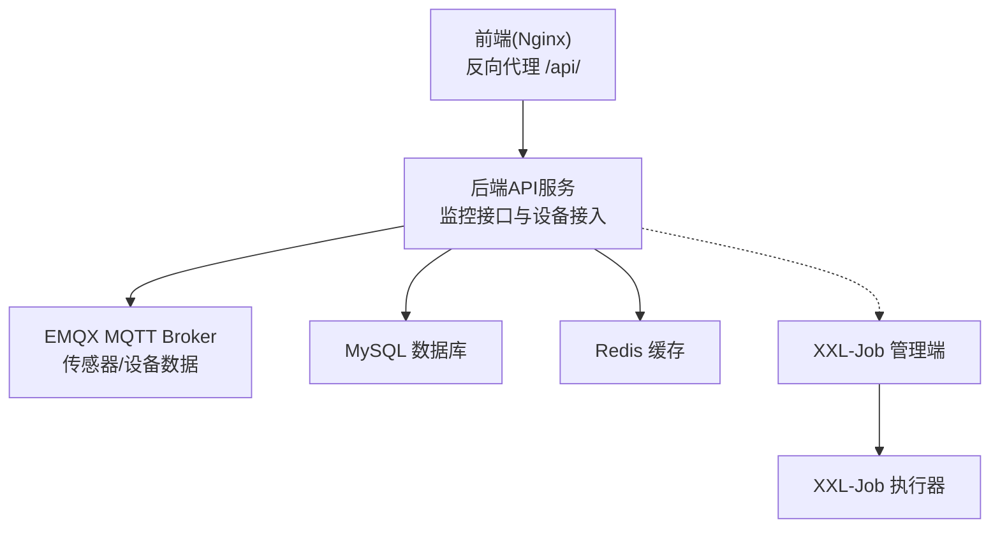
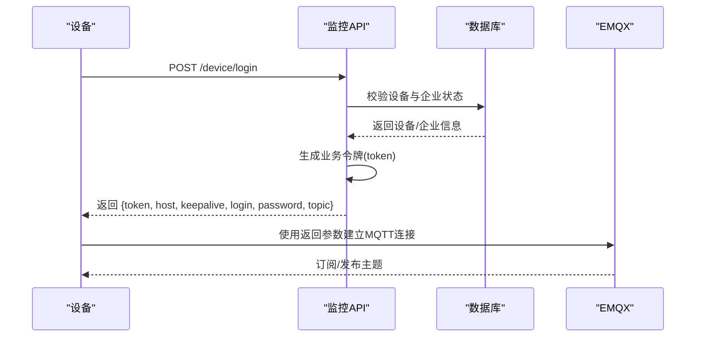
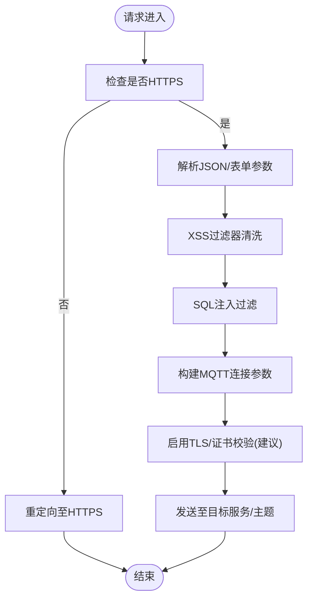
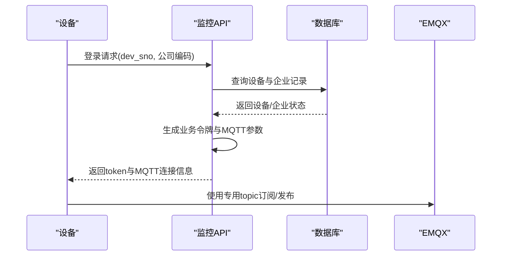
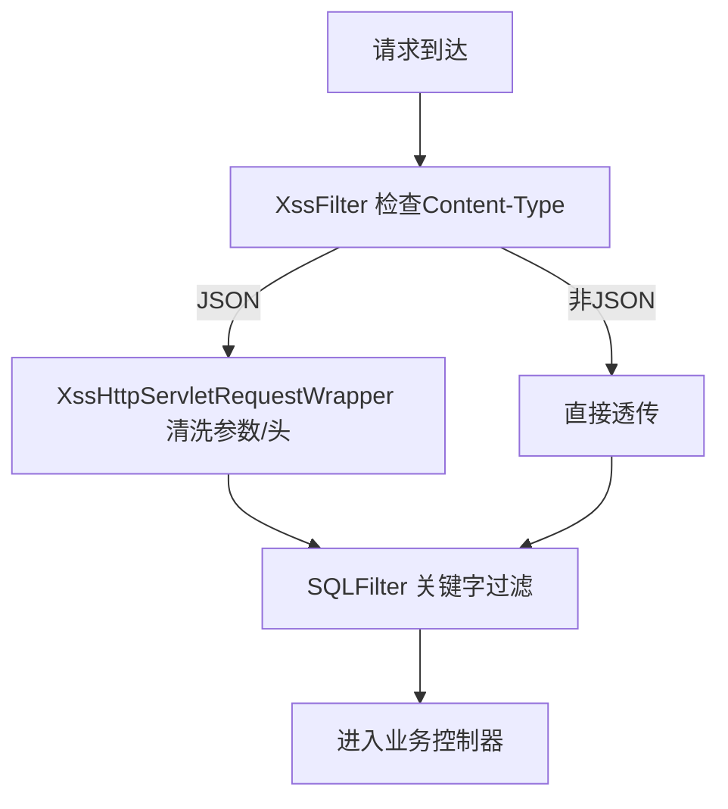
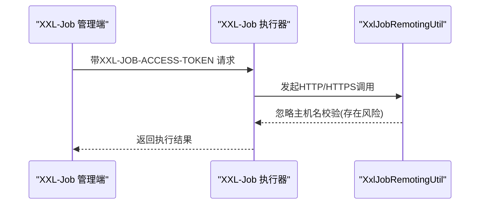
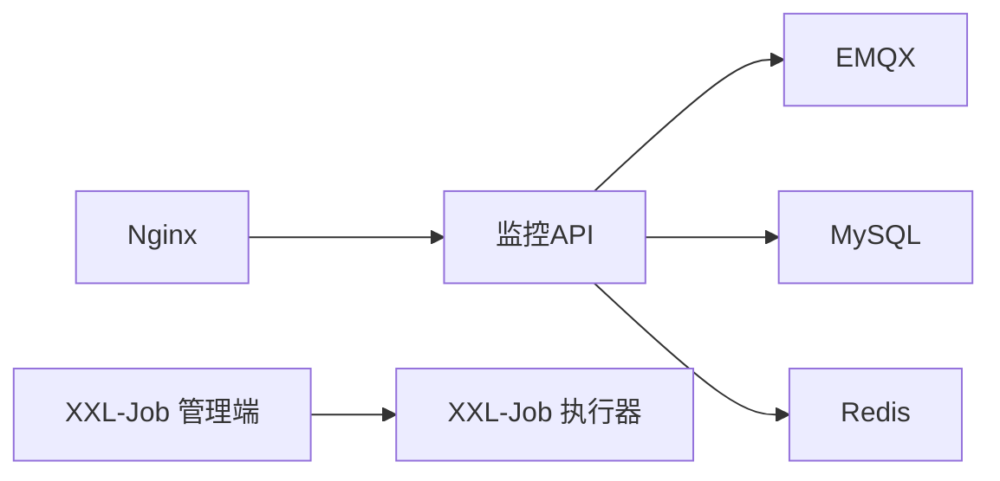

# 安全架构设计

<cite>
**本文引用的文件**
- [application-prod.yml](file://deploy/config/monitor-api/application-prod.yml)
- [nginx.conf](file://deploy/config/frontend/nginx.conf)
- [TokenController.java](file://monkey-monitor-api/src/main/java/com/monkey/general/controller/TokenController.java)
- [DeviceController.java](file://monkey-monitor-api/src/main/java/com/monkey/general/controller/DeviceController.java)
- [UserController.java](file://monkey-monitor-api/src/main/java/com/monkey/general/controller/UserController.java)
- [MyMqttConfiguration.java](file://monkey-monitor/src/main/java/com/monkey/general/config/mqtt/MyMqttConfiguration.java)
- [MQTTClient.java](file://monkey-monitor/src/main/java/com/monkey/general/config/mqtt/MQTTClient.java)
- [MqttConfiguration.java](file://monkey-monitor/src/main/java/com/monkey/general/config/MqttConfiguration.java)
- [XssFilter.java](file://monkey-common/src/main/java/com/monkey/general/common/xss/XssFilter.java)
- [XssHttpServletRequestWrapper.java](file://monkey-common/src/main/java/com/monkey/general/common/xss/XssHttpServletRequestWrapper.java)
- [HTMLFilter.java](file://monkey-common/src/main/java/com/monkey/general/common/xss/HTMLFilter.java)
- [SQLFilter.java](file://monkey-common/src/main/java/com/monkey/general/common/xss/SQLFilter.java)
- [FilterConfig.java](file://monkey-service/src/main/java/com/monkey/general/config/FilterConfig.java)
- [CorsConfig.java](file://monkey-monitor-api/src/main/java/com/monkey/general/config/CorsConfig.java)
- [SxTokenResult.java](file://monkey-monitor/src/main/java/com/monkey/general/modules/sx/entity/SxTokenResult.java)
- [XxlJobRemotingUtil.java](file://xxl-job-core/src/main/java/com/xxl/job/core/util/XxlJobRemotingUtil.java)
- [application-prod.properties](file://deploy/config/xxl-job-admin/application-prod.properties)
- [AESExample.java](file://monkey-monitor/src/main/java/com/monkey/general/platform/push/AESExample.java)
</cite>

## 目录
1. [引言](#引言)
2. [项目结构](#项目结构)
3. [核心组件](#核心组件)
4. [架构总览](#架构总览)
5. [详细组件分析](#详细组件分析)
6. [依赖分析](#依赖分析)
7. [性能考虑](#性能考虑)
8. [故障排查指南](#故障排查指南)
9. [结论](#结论)
10. [附录](#附录)

## 引言
本文件面向“安威 fireworks 物联网监控平台”的安全架构设计，围绕网络安全、应用安全、数据安全与设备安全四个维度，系统阐述平台的多层次防护体系。重点覆盖身份认证与授权机制（含JWT令牌验证、权限控制、角色管理）、数据传输安全（HTTPS加密、MQTT安全连接、敏感数据脱敏）、设备接入安全（设备身份验证、通信加密、访问控制），并给出典型攻击场景的防护策略、安全事件检测与响应机制。

## 项目结构
平台采用前后端分离与微服务化部署，前端通过Nginx反向代理至后端API服务，后端API服务负责业务逻辑与对外接口，内部通过EMQX进行物联网消息传输，同时集成XXL-Job进行定时任务调度。整体结构如下：



图表来源
- [nginx.conf:1-24](file://deploy/config/frontend/nginx.conf#L1-L24)
- [application-prod.yml:1-203](file://deploy/config/monitor-api/application-prod.yml#L1-L203)
- [application-prod.properties:1-66](file://deploy/config/xxl-job-admin/application-prod.properties#L1-L66)

章节来源
- [nginx.conf:1-24](file://deploy/config/frontend/nginx.conf#L1-L24)
- [application-prod.yml:1-203](file://deploy/config/monitor-api/application-prod.yml#L1-L203)
- [application-prod.properties:1-66](file://deploy/config/xxl-job-admin/application-prod.properties#L1-L66)

## 核心组件
- 前端与反向代理：Nginx统一入口，转发 /api/ 到后端API服务，并透传必要的头部信息。
- API网关与控制器：提供用户信息查询、设备登录、令牌发放等接口。
- 消息中间件：EMQX用于设备数据采集与下行指令下发。
- 安全过滤层：XSS/SQL注入过滤器链路，统一拦截与清洗输入。
- 配置与密钥：生产配置集中于application-prod.yml，包含MQTT、第三方对接、XXL-Job等敏感参数。
- 任务调度：XXL-Job管理端与执行器，具备访问令牌保护。

章节来源
- [nginx.conf:1-24](file://deploy/config/frontend/nginx.conf#L1-L24)
- [TokenController.java:1-42](file://monkey-monitor-api/src/main/java/com/monkey/general/controller/TokenController.java#L1-L42)
- [DeviceController.java:27-100](file://monkey-monitor-api/src/main/java/com/monkey/general/controller/DeviceController.java#L27-L100)
- [UserController.java:1-51](file://monkey-monitor-api/src/main/java/com/monkey/general/controller/UserController.java#L1-L51)
- [application-prod.yml:1-203](file://deploy/config/monitor-api/application-prod.yml#L1-L203)

## 架构总览
下图展示平台安全架构的关键交互与防护点：

```mermaid
graph TB
subgraph "边界与网络"
Nginx["Nginx 反向代理"]
HTTPS["HTTPS 终端/证书"]
end
subgraph "应用层"
API["监控API服务"]
CORS["CORS 跨域配置"]
XSS["XSS/SQL 过滤器"]
AUTH["用户认证/授权"]
JWT["JWT 令牌管理"]
end
subgraph "数据与消息"
MYSQL["MySQL"]
REDIS["Redis"]
EMQX["EMQX MQTT Broker"]
end
subgraph "调度与运维"
ADMIN["XXL-Job 管理端"]
EXEC["XXL-Job 执行器"]
end
Nginx --> HTTPS --> API
API --> CORS
API --> XSS
API --> AUTH
AUTH --> JWT
API --> MYSQL
API --> REDIS
API < --> EMQX
ADMIN --> EXEC
```

图表来源
- [nginx.conf:1-24](file://deploy/config/frontend/nginx.conf#L1-L24)
- [CorsConfig.java:1-22](file://monkey-monitor-api/src/main/java/com/monkey/general/config/CorsConfig.java#L1-L22)
- [XssFilter.java:1-29](file://monkey-common/src/main/java/com/monkey/general/common/xss/XssFilter.java#L1-L29)
- [application-prod.yml:1-203](file://deploy/config/monitor-api/application-prod.yml#L1-L203)
- [application-prod.properties:1-66](file://deploy/config/xxl-job-admin/application-prod.properties#L1-L66)

## 详细组件分析

### 身份认证与授权机制
- 用户信息查询：通过/sys/user/info接口按企业编码查询当前用户信息，并注入角色ID。
- 设备登录流程：设备侧调用/device/login，后端校验设备与企业状态，返回业务令牌与MQTT连接参数（含host、keepalive、用户名、密码、topic等）。
- JWT令牌管理：部分模块返回Authorization字段（Bearer形式），用于后续鉴权。
- 权限与角色：前端界面中存在角色与权限字段，支持管理员与普通用户的区分及权限勾选。



图表来源
- [DeviceController.java:27-100](file://monkey-monitor-api/src/main/java/com/monkey/general/controller/DeviceController.java#L27-L100)
- [application-prod.yml:30-58](file://deploy/config/monitor-api/application-prod.yml#L30-L58)

章节来源
- [UserController.java:1-51](file://monkey-monitor-api/src/main/java/com/monkey/general/controller/UserController.java#L1-L51)
- [DeviceController.java:27-100](file://monkey-monitor-api/src/main/java/com/monkey/general/controller/DeviceController.java#L27-L100)
- [SxTokenResult.java:1-27](file://monkey-monitor/src/main/java/com/monkey/general/modules/sx/entity/SxTokenResult.java#L1-L27)

### 数据传输安全
- HTTPS加密：Nginx反向代理承载HTTP/HTTPS流量，建议在生产环境启用TLS终止与证书管理。
- MQTT安全连接：MQTT客户端通过用户名/密码认证，连接参数包含超时与保活周期，建议结合TLS与ACL限制订阅/发布主题。
- 敏感数据脱敏：XSS与SQL注入过滤器对请求体、参数与头部进行清洗；AES示例提供加解密能力，可用于敏感字段存储或传输前处理。



图表来源
- [nginx.conf:1-24](file://deploy/config/frontend/nginx.conf#L1-L24)
- [XssFilter.java:1-29](file://monkey-common/src/main/java/com/monkey/general/common/xss/XssFilter.java#L1-L29)
- [SQLFilter.java:1-41](file://monkey-common/src/main/java/com/monkey/general/common/xss/SQLFilter.java#L1-L41)
- [MyMqttConfiguration.java:1-57](file://monkey-monitor/src/main/java/com/monkey/general/config/mqtt/MyMqttConfiguration.java#L1-L57)
- [MQTTClient.java:1-83](file://monkey-monitor/src/main/java/com/monkey/general/config/mqtt/MQTTClient.java#L1-L83)

章节来源
- [nginx.conf:1-24](file://deploy/config/frontend/nginx.conf#L1-L24)
- [XssFilter.java:1-29](file://monkey-common/src/main/java/com/monkey/general/common/xss/XssFilter.java#L1-L29)
- [SQLFilter.java:1-41](file://monkey-common/src/main/java/com/monkey/general/common/xss/SQLFilter.java#L1-L41)
- [MyMqttConfiguration.java:1-57](file://monkey-monitor/src/main/java/com/monkey/general/config/mqtt/MyMqttConfiguration.java#L1-L57)
- [MQTTClient.java:1-83](file://monkey-monitor/src/main/java/com/monkey/general/config/mqtt/MQTTClient.java#L1-L83)
- [AESExample.java:33-59](file://monkey-monitor/src/main/java/com/monkey/general/platform/push/AESExample.java#L33-L59)

### 设备接入安全
- 设备身份验证：后端根据设备编号与企业状态进行校验，确保设备与企业均处于有效状态。
- 通信加密：建议在MQTT层面启用TLS与客户端证书，限制topic粒度的ACL，避免未授权访问。
- 访问控制：设备侧仅允许订阅/发布其专属topic，避免横向越权。



图表来源
- [DeviceController.java:27-100](file://monkey-monitor-api/src/main/java/com/monkey/general/controller/DeviceController.java#L27-L100)
- [application-prod.yml:30-58](file://deploy/config/monitor-api/application-prod.yml#L30-L58)

章节来源
- [DeviceController.java:27-100](file://monkey-monitor-api/src/main/java/com/monkey/general/controller/DeviceController.java#L27-L100)
- [application-prod.yml:30-58](file://deploy/config/monitor-api/application-prod.yml#L30-L58)

### 应用安全与输入防护
- XSS防护：全局过滤器对JSON请求体进行HTML标签清洗，参数与头部同样进行转义处理。
- SQL注入防护：对输入字符串进行关键字过滤与转义，阻止常见注入模式。
- 跨域配置：CORS允许通配符来源与方法，建议在生产收紧来源与凭证策略。



图表来源
- [XssFilter.java:1-29](file://monkey-common/src/main/java/com/monkey/general/common/xss/XssFilter.java#L1-L29)
- [XssHttpServletRequestWrapper.java:1-139](file://monkey-common/src/main/java/com/monkey/general/common/xss/XssHttpServletRequestWrapper.java#L1-L139)
- [HTMLFilter.java:1-530](file://monkey-common/src/main/java/com/monkey/general/common/xss/HTMLFilter.java#L1-L530)
- [SQLFilter.java:1-41](file://monkey-common/src/main/java/com/monkey/general/common/xss/SQLFilter.java#L1-L41)
- [CorsConfig.java:1-22](file://monkey-monitor-api/src/main/java/com/monkey/general/config/CorsConfig.java#L1-L22)

章节来源
- [FilterConfig.java:1-33](file://monkey-service/src/main/java/com/monkey/general/config/FilterConfig.java#L1-L33)
- [XssFilter.java:1-29](file://monkey-common/src/main/java/com/monkey/general/common/xss/XssFilter.java#L1-L29)
- [XssHttpServletRequestWrapper.java:1-139](file://monkey-common/src/main/java/com/monkey/general/common/xss/XssHttpServletRequestWrapper.java#L1-L139)
- [HTMLFilter.java:1-530](file://monkey-common/src/main/java/com/monkey/general/common/xss/HTMLFilter.java#L1-L530)
- [SQLFilter.java:1-41](file://monkey-common/src/main/java/com/monkey/general/common/xss/SQLFilter.java#L1-L41)
- [CorsConfig.java:1-22](file://monkey-monitor-api/src/main/java/com/monkey/general/config/CorsConfig.java#L1-L22)

### 任务调度与运维安全
- XXL-Job访问令牌：管理端与执行器之间通过accessToken进行通信校验，降低未授权调用风险。
- HTTPS信任策略：核心网络工具类对HTTPS连接采用信任所有主机与证书的策略，存在安全风险，建议在生产禁用并启用严格校验。



图表来源
- [application-prod.properties:54-55](file://deploy/config/xxl-job-admin/application-prod.properties#L54-L55)
- [XxlJobRemotingUtil.java:1-78](file://xxl-job-core/src/main/java/com/xxl/job/core/util/XxlJobRemotingUtil.java#L1-L78)

章节来源
- [application-prod.properties:54-55](file://deploy/config/xxl-job-admin/application-prod.properties#L54-L55)
- [XxlJobRemotingUtil.java:1-78](file://xxl-job-core/src/main/java/com/xxl/job/core/util/XxlJobRemotingUtil.java#L1-L78)

## 依赖分析
- 组件耦合：API服务依赖MQTT配置与数据库/Redis；前端仅通过Nginx与API交互；XXL-Job管理端与执行器通过accessToken耦合。
- 外部依赖：EMQX、MySQL、Redis、XXL-Job管理端与执行器。
- 安全风险点：XxlJobRemotingUtil的宽松HTTPS校验、CORS通配策略、MQTT明文凭据配置。



图表来源
- [nginx.conf:1-24](file://deploy/config/frontend/nginx.conf#L1-L24)
- [application-prod.yml:1-203](file://deploy/config/monitor-api/application-prod.yml#L1-L203)
- [application-prod.properties:1-66](file://deploy/config/xxl-job-admin/application-prod.properties#L1-L66)

章节来源
- [nginx.conf:1-24](file://deploy/config/frontend/nginx.conf#L1-L24)
- [application-prod.yml:1-203](file://deploy/config/monitor-api/application-prod.yml#L1-L203)
- [application-prod.properties:1-66](file://deploy/config/xxl-job-admin/application-prod.properties#L1-L66)

## 性能考虑
- 连接池与超时：Hikari连接池与MQTT超时/保活参数需结合实际负载调整，避免连接抖动与资源耗尽。
- 缓存策略：Redis缓存开关与过期策略影响响应延迟与一致性，建议按场景启用。
- 反向代理超时：Nginx的proxy_*_timeout应与后端处理时长匹配，防止上游超时中断。

## 故障排查指南
- 设备无法登录/订阅
  - 检查设备编号与企业状态是否有效。
  - 核对MQTT用户名/密码与topic配置。
  - 确认EMQX ACL与TLS配置。
- 前端跨域失败
  - 检查CORS配置是否允许来源与凭证。
- HTTPS证书/握手异常
  - 确认Nginx证书链与协议版本。
- XXL-Job调用失败
  - 校验accessToken与执行器地址配置。
  - 评估XxlJobRemotingUtil的HTTPS校验策略。

章节来源
- [DeviceController.java:27-100](file://monkey-monitor-api/src/main/java/com/monkey/general/controller/DeviceController.java#L27-L100)
- [application-prod.yml:30-58](file://deploy/config/monitor-api/application-prod.yml#L30-L58)
- [CorsConfig.java:1-22](file://monkey-monitor-api/src/main/java/com/monkey/general/config/CorsConfig.java#L1-L22)
- [nginx.conf:1-24](file://deploy/config/frontend/nginx.conf#L1-L24)
- [application-prod.properties:54-55](file://deploy/config/xxl-job-admin/application-prod.properties#L54-L55)
- [XxlJobRemotingUtil.java:1-78](file://xxl-job-core/src/main/java/com/xxl/job/core/util/XxlJobRemotingUtil.java#L1-L78)

## 结论
平台已具备基础的输入防护、跨域与MQTT接入能力，建议在生产环境中强化以下方面：启用严格的HTTPS校验、收紧CORS策略、为MQTT启用TLS与细粒度ACL、对敏感配置进行密文化管理、完善审计与告警机制，以形成闭环的安全防护体系。

## 附录
- 典型攻击场景与防护策略
  - XSS：已内置XSS过滤器，建议升级为更严格的白名单策略并配合内容安全策略。
  - SQL注入：已内置SQL过滤器，建议结合ORM参数化查询与输入校验增强。
  - 中间人攻击：建议在MQTT与XXL-Job通信中启用TLS与证书校验。
  - 未授权访问：建议对API与MQTT主题增加基于角色的访问控制与审计日志。