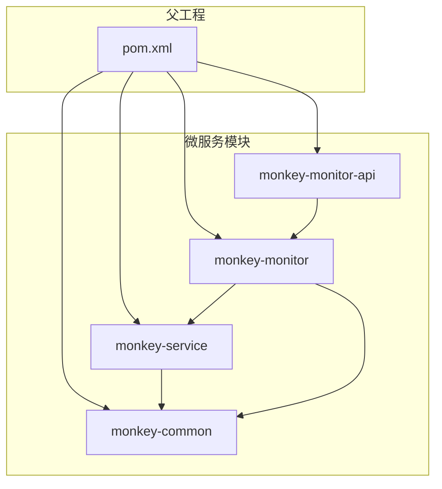
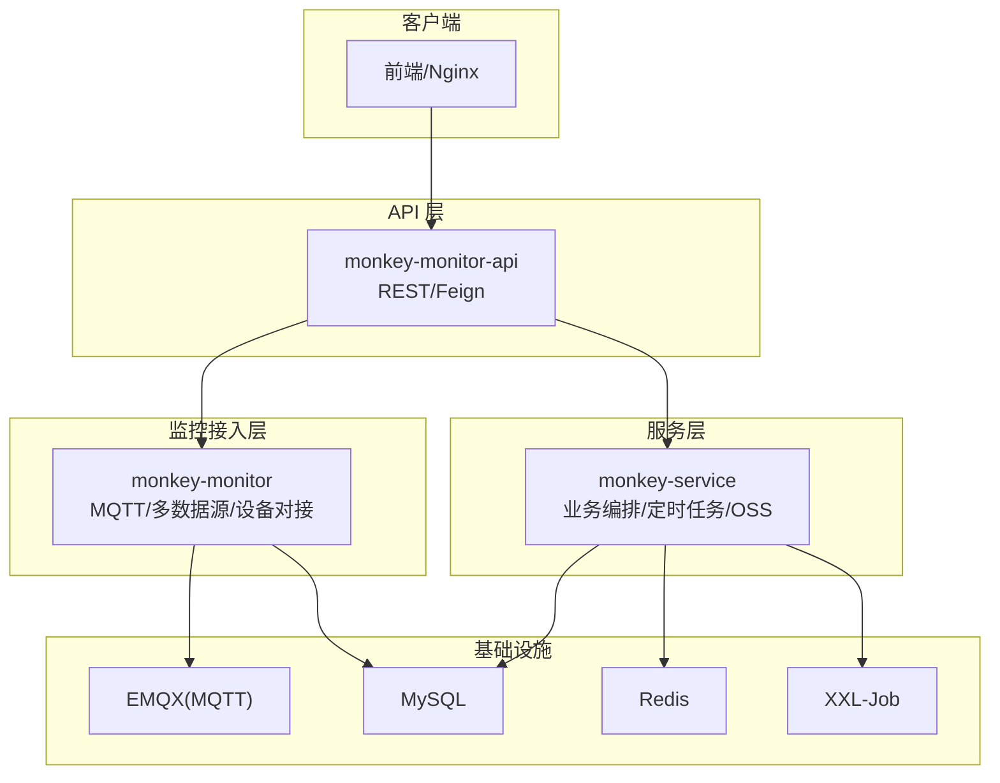
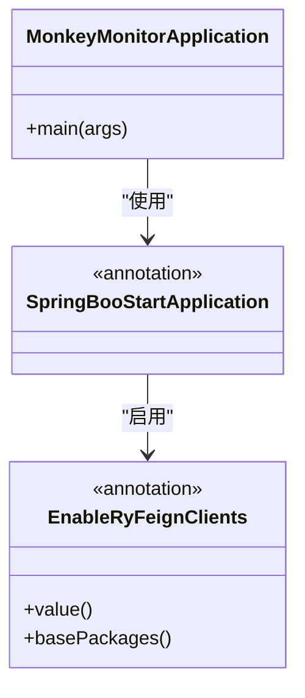
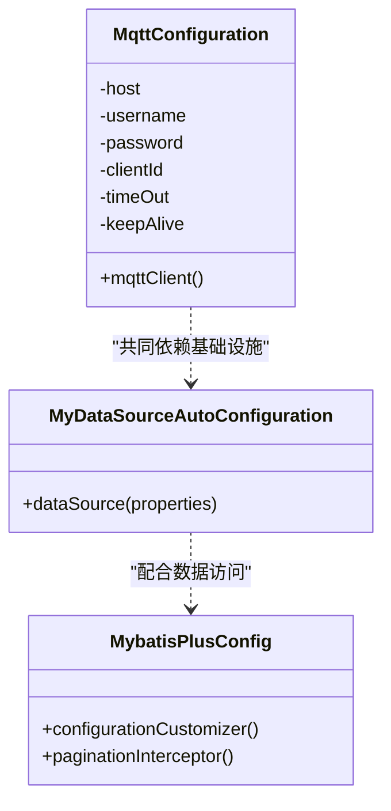
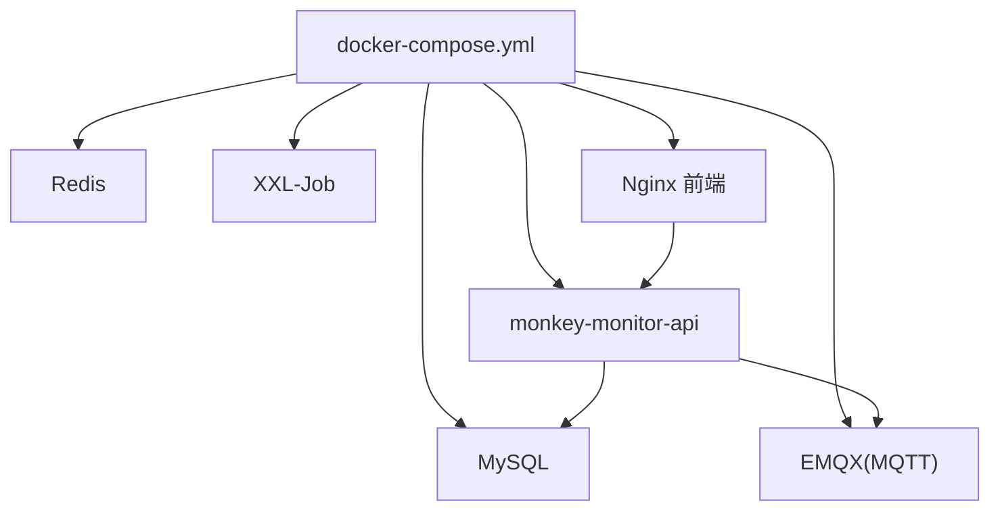
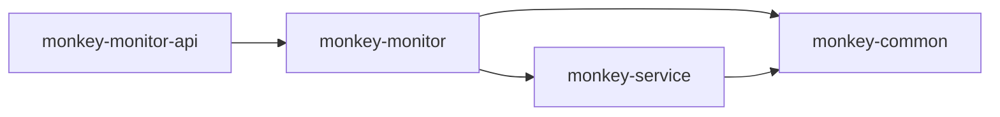

# 微服务架构设计

<cite>
**本文引用的文件**
- [pom.xml](file://pom.xml)
- [monkey-monitor-api/pom.xml](file://monkey-monitor-api/pom.xml)
- [monkey-monitor/pom.xml](file://monkey-monitor/pom.xml)
- [monkey-service/pom.xml](file://monkey-service/pom.xml)
- [monkey-common/pom.xml](file://monkey-common/pom.xml)
- [monkey-monitor-api/src/main/java/com/monkey/general/MonkeyMonitorApplication.java](file://monkey-monitor-api/src/main/java/com/monkey/general/MonkeyMonitorApplication.java)
- [monkey-monitor-api/src/main/resources/application.yml](file://monkey-monitor-api/src/main/resources/application.yml)
- [deploy/docker-compose.yml](file://deploy/docker-compose.yml)
- [deploy/config/monitor-api/application-prod.yml](file://deploy/config/monitor-api/application-prod.yml)
- [monkey-monitor-api/src/main/java/com/monkey/general/annotation/SpringBooStartApplication.java](file://monkey-monitor-api/src/main/java/com/monkey/general/annotation/SpringBooStartApplication.java)
- [monkey-monitor-api/src/main/java/com/monkey/general/annotation/EnableRyFeignClients.java](file://monkey-monitor-api/src/main/java/com/monkey/general/annotation/EnableRyFeignClients.java)
- [monkey-monitor/src/main/java/com/monkey/general/config/MqttConfiguration.java](file://monkey-monitor/src/main/java/com/monkey/general/config/MqttConfiguration.java)
- [monkey-monitor/src/main/java/com/monkey/general/config/MyDataSourceAutoConfiguration.java](file://monkey-monitor/src/main/java/com/monkey/general/config/MyDataSourceAutoConfiguration.java)
- [monkey-monitor/src/main/java/com/monkey/general/config/MybatisPlusConfig.java](file://monkey-monitor/src/main/java/com/monkey/general/config/MybatisPlusConfig.java)
</cite>

## 目录
1. [引言](#引言)
2. [项目结构](#项目结构)
3. [核心组件](#核心组件)
4. [架构总览](#架构总览)
5. [详细组件分析](#详细组件分析)
6. [依赖分析](#依赖分析)
7. [性能考量](#性能考量)
8. [故障排查指南](#故障排查指南)
9. [结论](#结论)
10. [附录](#附录)

## 引言
本设计文档面向安威 fireworks 物联网监控平台，基于现有代码库梳理出微服务架构方案。重点阐述模块划分策略（monkey-monitor-api、monkey-monitor、monkey-service、monkey-common），服务间通信机制（REST/HTTP、MQTT、定时任务调度），以及服务治理（服务发现与注册、负载均衡、熔断与限流）的设计原则与落地方式。同时给出架构图与数据流图，帮助开发与运维团队快速理解系统边界与交互模式。

## 项目结构
项目采用 Maven 多模块聚合结构，父工程统一管理版本与依赖，子模块按职责拆分：
- monkey-common：通用工具与基础设施（OpenFeign、Swagger、MyBatis-Plus、Redis、MQTT 等）
- monkey-service：业务服务层（数据访问、业务编排、定时任务、对象存储等）
- monkey-monitor：监控与设备接入层（MQTT 客户端、多数据源、WebSocket、第三方设备对接）
- monkey-monitor-api：对外 API 网关/入口服务（Spring Boot 启动、Swagger、Feign 客户端扫描）
- monkey-code-generator：代码生成器（非本次架构重点）

图表来源
- [pom.xml:11-16](file://pom.xml#L11-L16)
- [monkey-monitor-api/pom.xml:21-31](file://monkey-monitor-api/pom.xml#L21-L31)
- [monkey-monitor/pom.xml:21-30](file://monkey-monitor/pom.xml#L21-L30)
- [monkey-service/pom.xml:21-26](file://monkey-service/pom.xml#L21-L26)
- [monkey-common/pom.xml:20](file://monkey-common/pom.xml#L20)

章节来源
- [pom.xml:11-16](file://pom.xml#L11-L16)
- [pom.xml:64-101](file://pom.xml#L64-L101)

## 核心组件
- API 层（monkey-monitor-api）
  - 通过自定义注解启用异步、定时任务、Swagger 与 Feign 客户端扫描，作为统一入口暴露 REST 接口，并与内部服务进行 HTTP/Feign 通信。
  - 启动类禁用 Headless 模式以支持本地图形窗口（用于集成大华 SDK 抓图场景）。
- 监控接入层（monkey-monitor）
  - 提供 MQTT 客户端配置、动态数据源配置、MyBatis-Plus 分页与类型处理器配置，支撑多厂商设备接入与多数据源切换。
- 服务层（monkey-service）
  - 提供业务能力封装、定时任务、对象存储（OSS）、MQTT 客户端等依赖，向上为 API 层提供服务。
- 通用层（monkey-common）
  - 提供通用工具、Swagger、OpenFeign、MyBatis-Plus、Redis、Excel、二维码、PDF 等基础能力，被其他模块复用。

章节来源
- [monkey-monitor-api/src/main/java/com/monkey/general/MonkeyMonitorApplication.java:10-18](file://monkey-monitor-api/src/main/java/com/monkey/general/MonkeyMonitorApplication.java#L10-L18)
- [monkey-monitor-api/src/main/java/com/monkey/general/annotation/SpringBooStartApplication.java:19-22](file://monkey-monitor-api/src/main/java/com/monkey/general/annotation/SpringBooStartApplication.java#L19-L22)
- [monkey-monitor/src/main/java/com/monkey/general/config/MqttConfiguration.java:34-50](file://monkey-monitor/src/main/java/com/monkey/general/config/MqttConfiguration.java#L34-L50)
- [monkey-monitor/src/main/java/com/monkey/general/config/MyDataSourceAutoConfiguration.java:39-48](file://monkey-monitor/src/main/java/com/monkey/general/config/MyDataSourceAutoConfiguration.java#L39-L48)
- [monkey-monitor/src/main/java/com/monkey/general/config/MybatisPlusConfig.java:10-21](file://monkey-monitor/src/main/java/com/monkey/general/config/MybatisPlusConfig.java#L10-L21)

## 架构总览
整体采用“API 网关/入口 + 业务服务 + 设备接入 + 基础设施”的分层架构。API 层负责对外接口与内部服务编排；监控接入层负责 MQTT/设备协议与多数据源；服务层承载业务逻辑与定时任务；通用层提供跨模块共享能力。基础设施包含 MySQL、Redis、EMQX（MQTT）、XXL-Job（分布式任务调度）。

图表来源
- [deploy/docker-compose.yml:6-53](file://deploy/docker-compose.yml#L6-L53)
- [deploy/docker-compose.yml:71-87](file://deploy/docker-compose.yml#L71-L87)
- [deploy/config/monitor-api/application-prod.yml:30-48](file://deploy/config/monitor-api/application-prod.yml#L30-L48)
- [monkey-monitor-api/src/main/resources/application.yml:1-40](file://monkey-monitor-api/src/main/resources/application.yml#L1-L40)

## 详细组件分析

### 组件一：API 层（monkey-monitor-api）
- 职责
  - 对外提供 REST 接口，统一鉴权与路由。
  - 通过自定义注解启用 Feign 客户端扫描，实现对内部服务的声明式调用。
  - 集成 Swagger，便于接口文档与联调。
- 启动特性
  - 禁用 Headless 模式，满足本地图形处理需求。
- 通信机制
  - REST/HTTP：对外接口与内部服务调用。
  - Feign：在注解驱动下扫描指定包路径，发起远程调用。
- 配置要点
  - 应用端口、MyBatis-Plus Mapper 扫描、Swagger 开关等。

图表来源
- [monkey-monitor-api/src/main/java/com/monkey/general/MonkeyMonitorApplication.java:10-18](file://monkey-monitor-api/src/main/java/com/monkey/general/MonkeyMonitorApplication.java#L10-L18)
- [monkey-monitor-api/src/main/java/com/monkey/general/annotation/SpringBooStartApplication.java:19-22](file://monkey-monitor-api/src/main/java/com/monkey/general/annotation/SpringBooStartApplication.java#L19-L22)
- [monkey-monitor-api/src/main/java/com/monkey/general/annotation/EnableRyFeignClients.java:21-32](file://monkey-monitor-api/src/main/java/com/monkey/general/annotation/EnableRyFeignClients.java#L21-L32)

章节来源
- [monkey-monitor-api/src/main/java/com/monkey/general/MonkeyMonitorApplication.java:10-18](file://monkey-monitor-api/src/main/java/com/monkey/general/MonkeyMonitorApplication.java#L10-L18)
- [monkey-monitor-api/src/main/java/com/monkey/general/annotation/SpringBooStartApplication.java:19-22](file://monkey-monitor-api/src/main/java/com/monkey/general/annotation/SpringBooStartApplication.java#L19-L22)
- [monkey-monitor-api/src/main/java/com/monkey/general/annotation/EnableRyFeignClients.java:21-32](file://monkey-monitor-api/src/main/java/com/monkey/general/annotation/EnableRyFeignClients.java#L21-L32)
- [monkey-monitor-api/src/main/resources/application.yml:1-40](file://monkey-monitor-api/src/main/resources/application.yml#L1-L40)

### 组件二：监控接入层（monkey-monitor）
- 职责
  - 设备接入与协议适配（MQTT、WebSocket、第三方 SDK）。
  - 多数据源配置与 MyBatis-Plus 分页、类型处理器。
- 关键配置
  - MQTT 客户端连接参数（主机、用户名、密码、超时、保活）。
  - 动态数据源初始化与 HikariCP 连接池配置。
  - MyBatis-Plus 类型处理器与分页插件。
- 通信机制
  - MQTT：订阅/发布主题，接收设备上报数据。
  - HTTP/Feign：与 API 层或其他内部服务交互。
  - WebSocket：接收第三方定位平台推送。

图表来源
- [monkey-monitor/src/main/java/com/monkey/general/config/MqttConfiguration.java:34-50](file://monkey-monitor/src/main/java/com/monkey/general/config/MqttConfiguration.java#L34-L50)
- [monkey-monitor/src/main/java/com/monkey/general/config/MyDataSourceAutoConfiguration.java:39-48](file://monkey-monitor/src/main/java/com/monkey/general/config/MyDataSourceAutoConfiguration.java#L39-L48)
- [monkey-monitor/src/main/java/com/monkey/general/config/MybatisPlusConfig.java:10-21](file://monkey-monitor/src/main/java/com/monkey/general/config/MybatisPlusConfig.java#L10-L21)

章节来源
- [monkey-monitor/src/main/java/com/monkey/general/config/MqttConfiguration.java:20-50](file://monkey-monitor/src/main/java/com/monkey/general/config/MqttConfiguration.java#L20-L50)
- [monkey-monitor/src/main/java/com/monkey/general/config/MyDataSourceAutoConfiguration.java:39-48](file://monkey-monitor/src/main/java/com/monkey/general/config/MyDataSourceAutoConfiguration.java#L39-L48)
- [monkey-monitor/src/main/java/com/monkey/general/config/MybatisPlusConfig.java:10-21](file://monkey-monitor/src/main/java/com/monkey/general/config/MybatisPlusConfig.java#L10-L21)

### 组件三：服务层（monkey-service）
- 职责
  - 业务编排与数据处理。
  - 定时任务（XXL-Job 执行器）。
  - 对象存储（OSS）与 MQTT 客户端。
- 依赖
  - 依赖通用层（common）与监控层（monitor）能力。
- 通信机制
  - 通过 HTTP/Feign 被 API 层调用。
  - 通过 MQTT 订阅设备上报数据。

章节来源
- [monkey-service/pom.xml:21-26](file://monkey-service/pom.xml#L21-L26)
- [monkey-service/pom.xml:44-86](file://monkey-service/pom.xml#L44-L86)

### 组件四：通用层（monkey-common）
- 职责
  - 提供通用工具、Swagger、OpenFeign、MyBatis-Plus、Redis、Excel、二维码、PDF 等。
- 依赖
  - 被 monitor、service、admin 等模块复用。

章节来源
- [monkey-common/pom.xml:20](file://monkey-common/pom.xml#L20)
- [monkey-common/pom.xml:148-153](file://monkey-common/pom.xml#L148-L153)

### 组件五：基础设施与部署
- 基础设施
  - MySQL：持久化存储。
  - Redis：缓存与会话。
  - EMQX：MQTT 消息代理。
  - XXL-Job：分布式任务调度。
- 部署
  - 使用 docker-compose 编排，服务间通过自定义网络互通。
  - API 层暴露端口并挂载配置与日志目录。

图表来源
- [deploy/docker-compose.yml:6-53](file://deploy/docker-compose.yml#L6-L53)
- [deploy/docker-compose.yml:71-98](file://deploy/docker-compose.yml#L71-L98)

章节来源
- [deploy/docker-compose.yml:6-53](file://deploy/docker-compose.yml#L6-L53)
- [deploy/docker-compose.yml:71-98](file://deploy/docker-compose.yml#L71-L98)
- [deploy/config/monitor-api/application-prod.yml:30-48](file://deploy/config/monitor-api/application-prod.yml#L30-L48)

## 依赖分析
- 模块依赖
  - monkey-monitor-api 依赖 monkey-monitor。
  - monkey-monitor 依赖 monkey-common 与 monkey-service。
  - monkey-service 依赖 monkey-common。
- 外部依赖
  - Spring Cloud OpenFeign、Swagger、MyBatis-Plus、Redis、MQTT 客户端、XXL-Job 等。

图表来源
- [monkey-monitor-api/pom.xml:21-31](file://monkey-monitor-api/pom.xml#L21-L31)
- [monkey-monitor/pom.xml:21-30](file://monkey-monitor/pom.xml#L21-L30)
- [monkey-service/pom.xml:21-26](file://monkey-service/pom.xml#L21-L26)

章节来源
- [monkey-monitor-api/pom.xml:21-31](file://monkey-monitor-api/pom.xml#L21-L31)
- [monkey-monitor/pom.xml:21-30](file://monkey-monitor/pom.xml#L21-L30)
- [monkey-service/pom.xml:21-26](file://monkey-service/pom.xml#L21-L26)

## 性能考量
- 连接池与数据访问
  - 使用 HikariCP 作为连接池，结合动态数据源，提升多数据源下的并发与稳定性。
- 分页与类型处理
  - MyBatis-Plus 分页拦截器与自定义类型处理器，降低查询与序列化开销。
- 缓存策略
  - Redis 可开关配置，建议对热点数据与会话进行缓存，避免频繁数据库访问。
- 消息吞吐
  - MQTT 客户端设置最大并发（inflight），合理配置超时与保活，避免连接抖动。
- 定时任务
  - XXL-Job 执行器独立部署，避免与 API 层争抢资源；日志路径与保留策略需明确。

## 故障排查指南
- 启动失败（Headless 相关）
  - 若出现图形界面初始化异常，确认已禁用 Headless 模式。
- MQTT 连接异常
  - 检查 EMQX 地址、认证信息、超时与保活配置；确认容器健康检查状态。
- 数据库连接异常
  - 检查 MySQL 健康状态、连接池参数与账号权限。
- Feign/HTTP 调用失败
  - 校验服务名与端口、网络连通性、超时与重试策略。
- 定时任务未执行
  - 检查 XXL-Job 执行器注册、通讯令牌与日志路径。

章节来源
- [monkey-monitor-api/src/main/java/com/monkey/general/MonkeyMonitorApplication.java:13-16](file://monkey-monitor-api/src/main/java/com/monkey/general/MonkeyMonitorApplication.java#L13-L16)
- [deploy/docker-compose.yml:17-22](file://deploy/docker-compose.yml#L17-L22)
- [deploy/docker-compose.yml:45-50](file://deploy/docker-compose.yml#L45-L50)
- [deploy/config/monitor-api/application-prod.yml:10-26](file://deploy/config/monitor-api/application-prod.yml#L10-L26)

## 结论
本架构以模块化与分层为核心，API 层统一对外与编排，监控接入层专注设备协议与数据接入，服务层承载业务与定时任务，通用层提供跨模块共享能力。通过 MQTT、HTTP/Feign、XXL-Job 等机制实现松耦合交互。建议后续引入服务注册与发现、网关路由、熔断与限流、链路追踪与可观测性，进一步完善微服务体系。

## 附录
- 关键配置参考
  - API 层应用配置：[application.yml:1-40](file://monkey-monitor-api/src/main/resources/application.yml#L1-L40)
  - 生产环境配置（数据库、MQTT、Redis、XXL-Job 等）：[application-prod.yml:1-203](file://deploy/config/monitor-api/application-prod.yml#L1-L203)
- 启动与部署
  - 启动类入口：[MonkeyMonitorApplication.java:10-18](file://monkey-monitor-api/src/main/java/com/monkey/general/MonkeyMonitorApplication.java#L10-L18)
  - Compose 编排：[docker-compose.yml:1-103](file://deploy/docker-compose.yml#L1-L103)