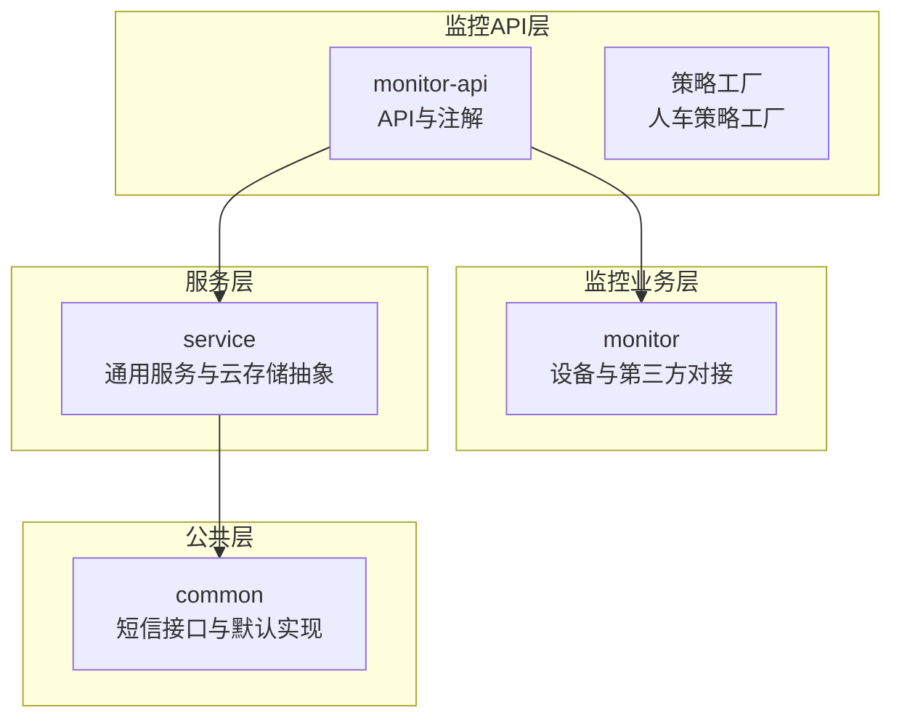
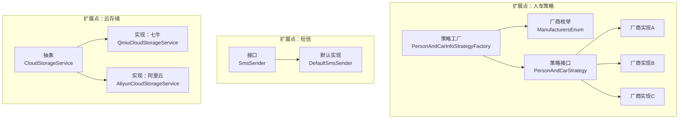
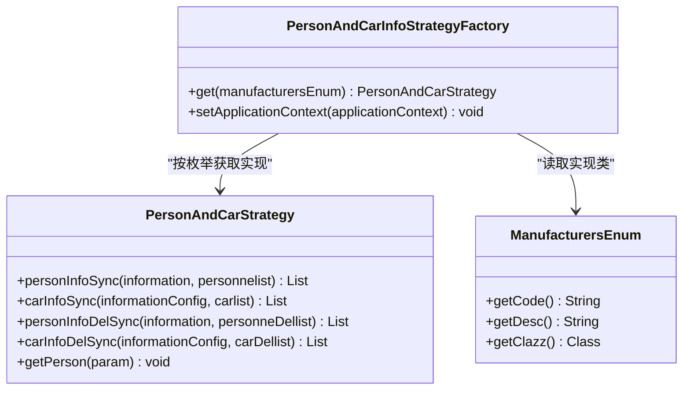
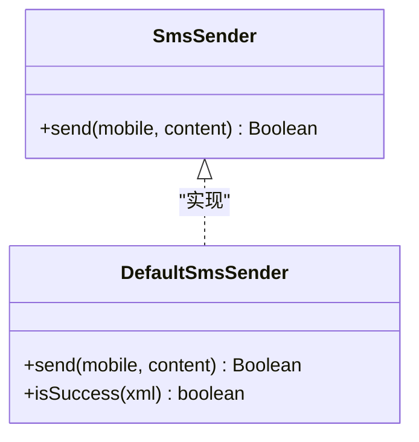
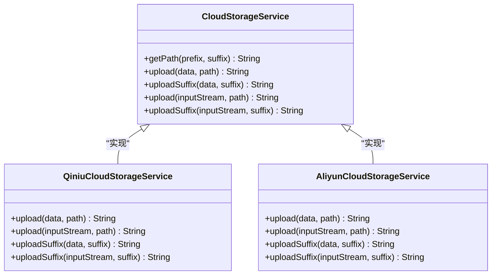
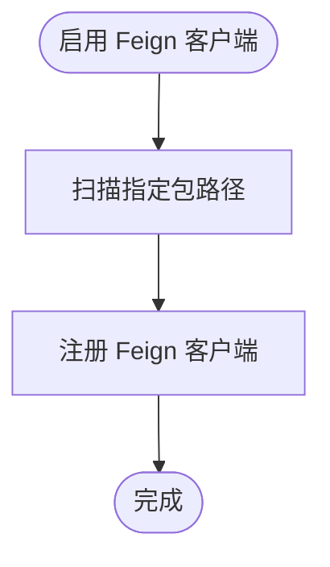
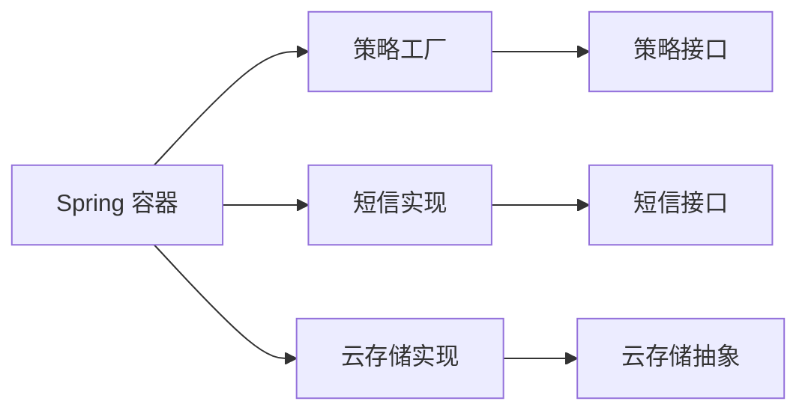

# 扩展架构设计

<cite>
**本文引用的文件**
- [EnableRyFeignClients.java](file://monkey-monitor-api/src/main/java/com/monkey/general/annotation/EnableRyFeignClients.java)
- [PersonAndCarInfoStrategyFactory.java](file://monkey-monitor-api/src/main/java/com/monkey/general/factory/PersonAndCarInfoStrategyFactory.java)
- [ManufacturersEnum.java](file://monkey-monitor-api/src/main/java/com/monkey/general/enums/ManufacturersEnum.java)
- [SmsSender.java](file://monkey-common/src/main/java/com/monkey/general/common/sms/SmsSender.java)
- [DefaultSmsSender.java](file://monkey-common/src/main/java/com/monkey/general/common/sms/DefaultSmsSender.java)
- [CloudStorageService.java](file://monkey-service/src/main/java/com/monkey/general/modules/oss/cloud/CloudStorageService.java)
- [QiniuCloudStorageService.java](file://monkey-service/src/main/java/com/monkey/general/modules/oss/cloud/QiniuCloudStorageService.java)
- [AliyunCloudStorageService.java](file://monkey-service/src/main/java/com/monkey/general/modules/oss/cloud/AliyunCloudStorageService.java)
- [PersonAndCarStrategy.java](file://monkey-monitor/src/main/java/com/monkey/general/modules/third/service/PersonAndCarStrategy.java)
</cite>

## 目录
1. [引言](#引言)
2. [项目结构](#项目结构)
3. [核心组件](#核心组件)
4. [架构总览](#架构总览)
5. [详细组件分析](#详细组件分析)
6. [依赖分析](#依赖分析)
7. [性能考虑](#性能考虑)
8. [故障排查指南](#故障排查指南)
9. [结论](#结论)
10. [附录：扩展开发指南](#附录扩展开发指南)

## 引言
本设计文档面向安威 fireworks 物联网监控平台的扩展架构，重点阐述系统在“插件化”方面的设计与实现，包括设备插件（人车策略）、算法插件（策略工厂）、存储插件（云存储服务）、以及第三方集成（短信、云存储）的扩展机制。文档同时解析工厂模式与策略模式在系统中的应用，模块化设计原则（接口定义、依赖注入、配置管理），并提供扩展架构图与插件开发指南，帮助开发者快速接入新设备与第三方服务。

## 项目结构
项目采用多模块分层组织，核心模块包括：
- monitor-api：对外 API、注解与策略工厂等
- monitor：设备侧业务与第三方对接
- service：通用服务与云存储抽象
- common：公共工具、短信接口与默认实现
- 其他：定时任务调度、注册中心部署等

下图为概念性项目结构示意（非代码映射）：

## 核心组件
本节聚焦于支撑扩展架构的关键组件与模式。

- 设备/人车策略接口与实现
  - 接口定义：PersonAndCarStrategy，统一人车同步、删除与查询能力
  - 实现示例：不同厂商策略通过枚举绑定到具体实现类
- 策略工厂
  - PersonAndCarInfoStrategyFactory：基于 Spring 上下文自动装配各厂商策略实例，并按枚举键值进行选择
- 短信发送接口与默认实现
  - SmsSender：短信发送接口
  - DefaultSmsSender：基于 HTTP 的默认实现，封装返回解析逻辑
- 云存储抽象与多厂商实现
  - CloudStorageService：抽象上传接口与路径生成
  - QiniuCloudStorageService、AliyunCloudStorageService：分别对接七牛与阿里云
- 自定义 Feign 注解
  - EnableRyFeignClients：自定义注解，简化 Feign 客户端扫描包路径

章节来源
- [PersonAndCarStrategy.java:1-30](file://monkey-monitor/src/main/java/com/monkey/general/modules/third/service/PersonAndCarStrategy.java#L1-L30)
- [PersonAndCarInfoStrategyFactory.java:1-37](file://monkey-monitor-api/src/main/java/com/monkey/general/factory/PersonAndCarInfoStrategyFactory.java#L1-L37)
- [ManufacturersEnum.java:1-51](file://monkey-monitor-api/src/main/java/com/monkey/general/enums/ManufacturersEnum.java#L1-L51)
- [SmsSender.java:1-19](file://monkey-common/src/main/java/com/monkey/general/common/sms/SmsSender.java#L1-L19)
- [DefaultSmsSender.java:1-74](file://monkey-common/src/main/java/com/monkey/general/common/sms/DefaultSmsSender.java#L1-L74)
- [CloudStorageService.java:1-72](file://monkey-service/src/main/java/com/monkey/general/modules/oss/cloud/CloudStorageService.java#L1-L72)
- [QiniuCloudStorageService.java:1-70](file://monkey-service/src/main/java/com/monkey/general/modules/oss/cloud/QiniuCloudStorageService.java#L1-L70)
- [AliyunCloudStorageService.java:1-57](file://monkey-service/src/main/java/com/monkey/general/modules/oss/cloud/AliyunCloudStorageService.java#L1-L57)
- [EnableRyFeignClients.java:1-33](file://monkey-monitor-api/src/main/java/com/monkey/general/annotation/EnableRyFeignClients.java#L1-L33)

## 架构总览
下图展示扩展架构中“策略工厂 + 接口抽象 + 多实现”的交互关系，涵盖人车策略、短信与云存储三类扩展点。

图表来源
- [PersonAndCarInfoStrategyFactory.java:1-37](file://monkey-monitor-api/src/main/java/com/monkey/general/factory/PersonAndCarInfoStrategyFactory.java#L1-L37)
- [ManufacturersEnum.java:1-51](file://monkey-monitor-api/src/main/java/com/monkey/general/enums/ManufacturersEnum.java#L1-L51)
- [PersonAndCarStrategy.java:1-30](file://monkey-monitor/src/main/java/com/monkey/general/modules/third/service/PersonAndCarStrategy.java#L1-L30)
- [SmsSender.java:1-19](file://monkey-common/src/main/java/com/monkey/general/common/sms/SmsSender.java#L1-L19)
- [DefaultSmsSender.java:1-74](file://monkey-common/src/main/java/com/monkey/general/common/sms/DefaultSmsSender.java#L1-L74)
- [CloudStorageService.java:1-72](file://monkey-service/src/main/java/com/monkey/general/modules/oss/cloud/CloudStorageService.java#L1-L72)
- [QiniuCloudStorageService.java:1-70](file://monkey-service/src/main/java/com/monkey/general/modules/oss/cloud/QiniuCloudStorageService.java#L1-L70)
- [AliyunCloudStorageService.java:1-57](file://monkey-service/src/main/java/com/monkey/general/modules/oss/cloud/AliyunCloudStorageService.java#L1-L57)

## 详细组件分析

### 设备/人车策略扩展（策略模式）
- 设计要点
  - 使用接口统一行为契约，屏蔽不同厂商差异
  - 工厂通过 Spring 上下文收集实现，按厂商枚举选择对应策略
- 关键流程
  - 枚举 ManufacturersEnum 绑定具体实现类
  - 策略工厂在启动时装配所有实现
  - 业务调用时根据设备厂商选择策略执行

图表来源
- [PersonAndCarStrategy.java:1-30](file://monkey-monitor/src/main/java/com/monkey/general/modules/third/service/PersonAndCarStrategy.java#L1-L30)
- [PersonAndCarInfoStrategyFactory.java:1-37](file://monkey-monitor-api/src/main/java/com/monkey/general/factory/PersonAndCarInfoStrategyFactory.java#L1-L37)
- [ManufacturersEnum.java:1-51](file://monkey-monitor-api/src/main/java/com/monkey/general/enums/ManufacturersEnum.java#L1-L51)

章节来源
- [PersonAndCarStrategy.java:1-30](file://monkey-monitor/src/main/java/com/monkey/general/modules/third/service/PersonAndCarStrategy.java#L1-L30)
- [PersonAndCarInfoStrategyFactory.java:1-37](file://monkey-monitor-api/src/main/java/com/monkey/general/factory/PersonAndCarInfoStrategyFactory.java#L1-L37)
- [ManufacturersEnum.java:1-51](file://monkey-monitor-api/src/main/java/com/monkey/general/enums/ManufacturersEnum.java#L1-L51)

### 短信扩展（接口 + 默认实现）
- 设计要点
  - 以 SmsSender 作为统一接口，便于替换为其他短信服务商
  - DefaultSmsSender 提供 HTTP 调用与返回解析示例
- 集成建议
  - 新增实现类需实现 SmsSender.send 并在 Spring 中注册为 Bean
  - 可通过配置切换默认实现或引入条件化装配

图表来源
- [SmsSender.java:1-19](file://monkey-common/src/main/java/com/monkey/general/common/sms/SmsSender.java#L1-L19)
- [DefaultSmsSender.java:1-74](file://monkey-common/src/main/java/com/monkey/general/common/sms/DefaultSmsSender.java#L1-L74)

章节来源
- [SmsSender.java:1-19](file://monkey-common/src/main/java/com/monkey/general/common/sms/SmsSender.java#L1-L19)
- [DefaultSmsSender.java:1-74](file://monkey-common/src/main/java/com/monkey/general/common/sms/DefaultSmsSender.java#L1-L74)

### 云存储扩展（抽象 + 多实现）
- 设计要点
  - CloudStorageService 抽象上传接口与路径生成
  - QiniuCloudStorageService、AliyunCloudStorageService 分别实现不同云厂商
- 配置与使用
  - 通过构造函数注入 CloudStorageConfig，按前缀与后缀生成路径
  - 支持字节数组与 InputStream 两种输入方式

图表来源
- [CloudStorageService.java:1-72](file://monkey-service/src/main/java/com/monkey/general/modules/oss/cloud/CloudStorageService.java#L1-L72)
- [QiniuCloudStorageService.java:1-70](file://monkey-service/src/main/java/com/monkey/general/modules/oss/cloud/QiniuCloudStorageService.java#L1-L70)
- [AliyunCloudStorageService.java:1-57](file://monkey-service/src/main/java/com/monkey/general/modules/oss/cloud/AliyunCloudStorageService.java#L1-L57)

章节来源
- [CloudStorageService.java:1-72](file://monkey-service/src/main/java/com/monkey/general/modules/oss/cloud/CloudStorageService.java#L1-L72)
- [QiniuCloudStorageService.java:1-70](file://monkey-service/src/main/java/com/monkey/general/modules/oss/cloud/QiniuCloudStorageService.java#L1-L70)
- [AliyunCloudStorageService.java:1-57](file://monkey-service/src/main/java/com/monkey/general/modules/oss/cloud/AliyunCloudStorageService.java#L1-L57)

### 自定义 Feign 客户端注解（扩展点）
- 设计要点
  - EnableRyFeignClients 在 Spring Cloud OpenFeign 基础上增加 basePackages 指定扫描范围
  - 便于在监控 API 层集中管理第三方服务客户端

图表来源
- [EnableRyFeignClients.java:1-33](file://monkey-monitor-api/src/main/java/com/monkey/general/annotation/EnableRyFeignClients.java#L1-L33)

章节来源
- [EnableRyFeignClients.java:1-33](file://monkey-monitor-api/src/main/java/com/monkey/general/annotation/EnableRyFeignClients.java#L1-L33)

## 依赖分析
- 松耦合与高内聚
  - 通过接口与抽象类隔离具体实现，降低模块间耦合
  - 工厂与枚举负责“选择”，业务层仅依赖抽象
- 依赖注入与装配
  - Spring 上下文自动收集实现类，工厂按需选择
  - 短信与云存储实现均以 Spring Bean 形式注册，便于替换
- 可观测性与可维护性
  - 接口契约清晰，新增实现无需修改现有代码
  - 配置驱动（如云存储前缀、域名）提升环境适配能力

图表来源
- [PersonAndCarInfoStrategyFactory.java:1-37](file://monkey-monitor-api/src/main/java/com/monkey/general/factory/PersonAndCarInfoStrategyFactory.java#L1-L37)
- [SmsSender.java:1-19](file://monkey-common/src/main/java/com/monkey/general/common/sms/SmsSender.java#L1-L19)
- [CloudStorageService.java:1-72](file://monkey-service/src/main/java/com/monkey/general/modules/oss/cloud/CloudStorageService.java#L1-L72)

章节来源
- [PersonAndCarInfoStrategyFactory.java:1-37](file://monkey-monitor-api/src/main/java/com/monkey/general/factory/PersonAndCarInfoStrategyFactory.java#L1-L37)
- [SmsSender.java:1-19](file://monkey-common/src/main/java/com/monkey/general/common/sms/SmsSender.java#L1-L19)
- [CloudStorageService.java:1-72](file://monkey-service/src/main/java/com/monkey/general/modules/oss/cloud/CloudStorageService.java#L1-L72)

## 性能考虑
- 策略选择开销
  - 工厂在启动时一次性装配，运行期仅做常量时间查找，开销极低
- I/O 与网络
  - 云存储上传建议复用连接与令牌，避免频繁创建对象
  - 短信发送建议引入重试与熔断，防止第三方接口抖动影响主流程
- 缓存与批处理
  - 对高频调用的人车同步接口可考虑本地缓存与批量写入，减少重复请求

## 故障排查指南
- 短信发送失败
  - 检查返回 XML 是否包含错误节点与错误码
  - 核对签名前缀是否符合规范
- 云存储上传异常
  - 校验桶名、域名、密钥与区域配置
  - 观察异常栈定位是鉴权问题还是网络超时
- 策略未生效
  - 确认实现类已标注为 Spring Bean
  - 检查枚举与实现类映射是否正确

章节来源
- [DefaultSmsSender.java:1-74](file://monkey-common/src/main/java/com/monkey/general/common/sms/DefaultSmsSender.java#L1-L74)
- [QiniuCloudStorageService.java:1-70](file://monkey-service/src/main/java/com/monkey/general/modules/oss/cloud/QiniuCloudStorageService.java#L1-L70)
- [AliyunCloudStorageService.java:1-57](file://monkey-service/src/main/java/com/monkey/general/modules/oss/cloud/AliyunCloudStorageService.java#L1-L57)
- [PersonAndCarInfoStrategyFactory.java:1-37](file://monkey-monitor-api/src/main/java/com/monkey/general/factory/PersonAndCarInfoStrategyFactory.java#L1-L37)

## 结论
本扩展架构以“接口抽象 + 工厂/枚举选择 + Spring 依赖注入”为核心，实现了设备、算法、存储与第三方服务的灵活扩展。通过策略模式与工厂模式，系统在不修改既有代码的前提下，即可接入新厂商与新服务；通过抽象类与接口，系统具备良好的可测试性与可维护性。建议在后续迭代中进一步完善配置中心与可观测性体系，以支撑更大规模的扩展场景。

## 附录：扩展开发指南

### 开发新设备/人车策略
- 步骤
  - 定义实现类并实现 PersonAndCarStrategy 接口
  - 在 ManufacturersEnum 中新增条目并绑定实现类
  - 确保实现类被 Spring 扫描并注册为 Bean
- 注意事项
  - 保持方法签名与语义一致
  - 对外暴露的同步与删除操作应保证幂等性

章节来源
- [PersonAndCarStrategy.java:1-30](file://monkey-monitor/src/main/java/com/monkey/general/modules/third/service/PersonAndCarStrategy.java#L1-L30)
- [ManufacturersEnum.java:1-51](file://monkey-monitor-api/src/main/java/com/monkey/general/enums/ManufacturersEnum.java#L1-L51)

### 开发新短信服务商实现
- 步骤
  - 实现 SmsSender 接口，完成发送与结果解析
  - 在 Spring 中注册为 Bean 或通过条件装配启用
- 注意事项
  - 统一返回布尔值表示成功与否
  - 对第三方返回格式进行健壮解析

章节来源
- [SmsSender.java:1-19](file://monkey-common/src/main/java/com/monkey/general/common/sms/SmsSender.java#L1-L19)
- [DefaultSmsSender.java:1-74](file://monkey-common/src/main/java/com/monkey/general/common/sms/DefaultSmsSender.java#L1-L74)

### 开发新云存储实现
- 步骤
  - 继承 CloudStorageService，实现多种上传方法
  - 在构造函数中注入 CloudStorageConfig 并完成初始化
- 注意事项
  - 路径生成遵循统一规则，支持前缀与后缀
  - 上传失败时抛出统一异常以便上层捕获

章节来源
- [CloudStorageService.java:1-72](file://monkey-service/src/main/java/com/monkey/general/modules/oss/cloud/CloudStorageService.java#L1-L72)
- [QiniuCloudStorageService.java:1-70](file://monkey-service/src/main/java/com/monkey/general/modules/oss/cloud/QiniuCloudStorageService.java#L1-L70)
- [AliyunCloudStorageService.java:1-57](file://monkey-service/src/main/java/com/monkey/general/modules/oss/cloud/AliyunCloudStorageService.java#L1-L57)

### 集成第三方服务（Feign）
- 步骤
  - 使用 @EnableRyFeignClients 指定扫描包路径
  - 定义 Feign 接口并声明远程服务方法
- 注意事项
  - 明确超时与重试策略，避免阻塞主流程

章节来源
- [EnableRyFeignClients.java:1-33](file://monkey-monitor-api/src/main/java/com/monkey/general/annotation/EnableRyFeignClients.java#L1-L33)