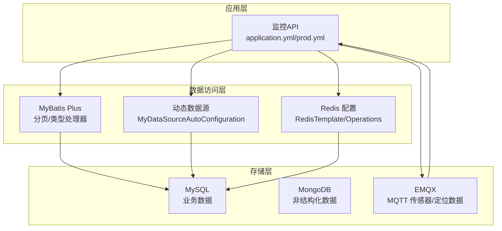
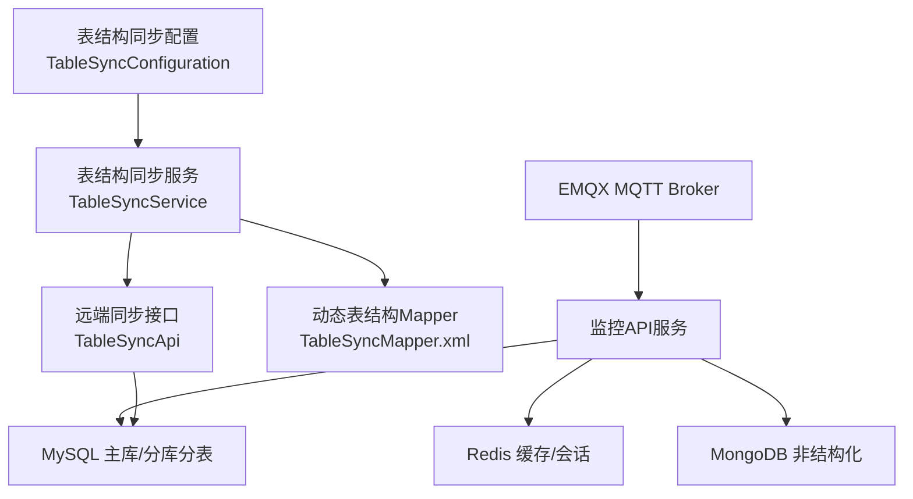
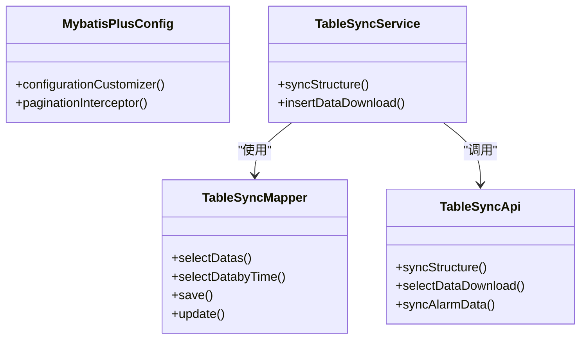
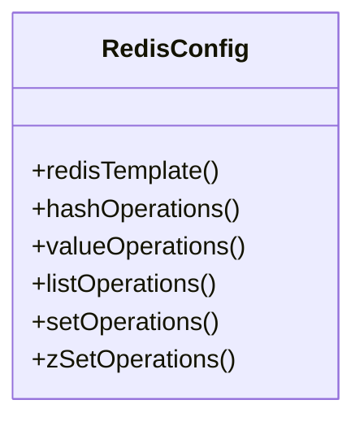
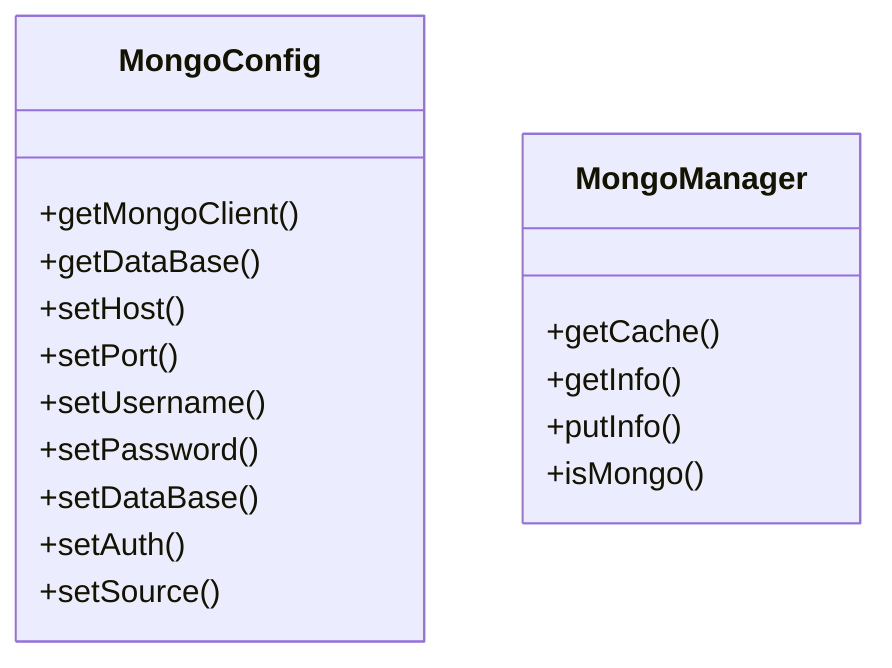
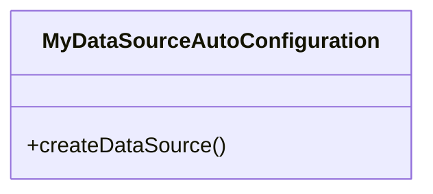
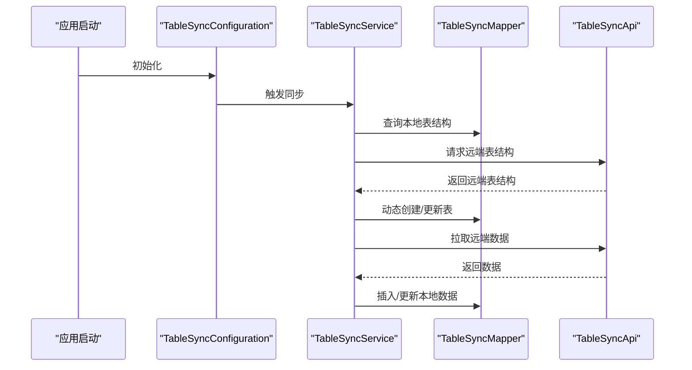
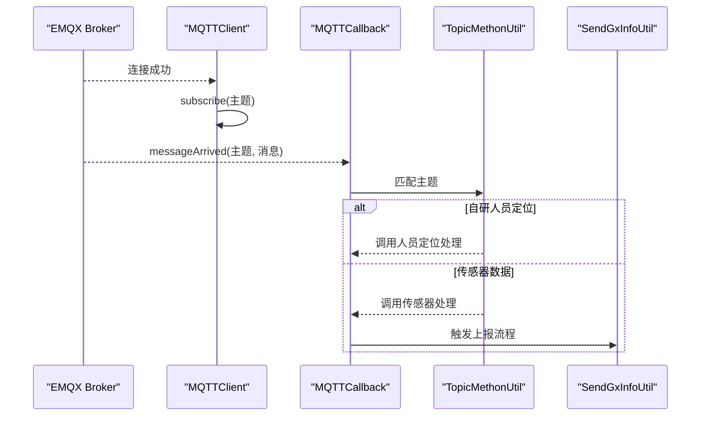
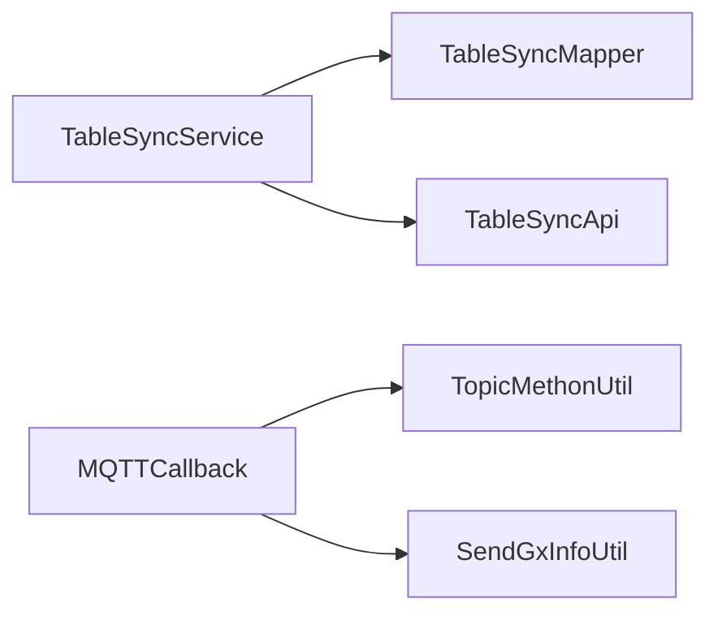

# 数据架构设计

<cite>
**本文引用的文件**
- [application.yml](file://monkey-monitor-api/src/main/resources/application.yml)
- [application-prod.yml](file://monkey-monitor-api/src/main/resources/application-prod.yml)
- [application-prod.yml](file://deploy/config/monitor-api/application-prod.yml)
- [MybatisPlusConfig.java](file://monkey-monitor/src/main/java/com/monkey/general/config/MybatisPlusConfig.java)
- [MybatisPlusConfig.java](file://monkey-service/src/main/java/com/monkey/general/config/MybatisPlusConfig.java)
- [RedisConfig.java](file://monkey-service/src/main/java/com/monkey/general/config/RedisConfig.java)
- [MyDataSourceAutoConfiguration.java](file://monkey-monitor/src/main/java/com/monkey/general/config/MyDataSourceAutoConfiguration.java)
- [MongoConfig.java](file://monkey-code-generator/src/main/java/com/monkey/config/MongoConfig.java)
- [MongoManager.java](file://monkey-code-generator/src/main/java/com/monkey/config/MongoManager.java)
- [TableSyncMapper.xml](file://monkey-service/src/main/resources/mapper/open/TableSyncMapper.xml)
- [TableSyncService.java](file://monkey-service/src/main/java/com/monkey/general/modules/open/service/TableSyncService.java)
- [TableSyncApi.java](file://monkey-service/src/main/java/com/monkey/general/api/TableSyncApi.java)
- [TableSyncConfiguration.java](file://monkey-monitor/src/main/java/com/monkey/general/config/TableSyncConfiguration.java)
- [MQTTClient.java](file://monkey-monitor/src/main/java/com/monkey/general/config/mqtt/MQTTClient.java)
- [MQTTCallback.java](file://monkey-monitor/src/main/java/com/monkey/general/config/mqtt/MQTTCallback.java)
- [TopicMethonUtil.java](file://monkey-monitor/src/main/java/com/monkey/general/config/mqtt/TopicMethonUtil.java)
- [SendGxInfoUtil.java](file://monkey-monitor/src/main/java/com/monkey/general/config/mqtt/gxsend/SendGxInfoUtil.java)
- [init.sql](file://deploy/init/init.sql)
</cite>

## 目录
1. [引言](#引言)
2. [项目结构](#项目结构)
3. [核心组件](#核心组件)
4. [架构总览](#架构总览)
5. [详细组件分析](#详细组件分析)
6. [依赖分析](#依赖分析)
7. [性能考虑](#性能考虑)
8. [故障排查指南](#故障排查指南)
9. [结论](#结论)
10. [附录](#附录)

## 引言
本文件面向安威 fireworks 物联网监控平台，系统性阐述数据架构设计与实现要点，覆盖以下方面：
- 存储策略：关系型数据库（MySQL）、缓存与会话（Redis）、非结构化数据（MongoDB）与物联感知数据（MQTT）。
- 数据分片与分区策略：通过动态数据源与分页插件实现多数据源与分页能力，结合业务维度进行水平扩展规划建议。
- 多数据源配置与动态切换：基于动态数据源自动装配，支持按需路由与切换。
- 一致性保障：关系型数据采用 ACID 事务，非结构化与物联数据采用最终一致的事件驱动与补偿机制。
- 数据访问层：MyBatis Plus 配置、类型处理器、分页插件、批量操作优化与动态表结构同步。
- 数据流与架构图：展示数据在各组件间的流转路径与存储位置。

## 项目结构
项目采用多模块划分，数据相关的关键模块与文件如下：
- 配置与环境：应用配置、生产环境配置（含数据库、Redis、MQTT、XXL-Job 等）。
- 数据访问层：MyBatis Plus 配置、分页插件、Redis 模板与序列化配置。
- 动态数据源：自动装配与数据源路由。
- 非结构化与生成器：MongoDB 连接与缓存管理。
- 表结构同步：远程表结构同步、动态建表与数据落库。
- 物联感知：MQTT 客户端、回调与主题匹配，传感器与人员定位数据接入。

图表来源
- [application.yml:1-40](file://monkey-monitor-api/src/main/resources/application.yml#L1-L40)
- [application-prod.yml:1-198](file://monkey-monitor-api/src/main/resources/application-prod.yml#L1-L198)
- [MybatisPlusConfig.java:1-21](file://monkey-monitor/src/main/java/com/monkey/general/config/MybatisPlusConfig.java#L1-L21)
- [MyDataSourceAutoConfiguration.java:1-35](file://monkey-monitor/src/main/java/com/monkey/general/config/MyDataSourceAutoConfiguration.java#L1-L35)
- [RedisConfig.java:1-57](file://monkey-service/src/main/java/com/monkey/general/config/RedisConfig.java#L1-L57)

章节来源
- [application.yml:1-40](file://monkey-monitor-api/src/main/resources/application.yml#L1-L40)
- [application-prod.yml:1-198](file://monkey-monitor-api/src/main/resources/application-prod.yml#L1-L198)
- [application-prod.yml:1-203](file://deploy/config/monitor-api/application-prod.yml#L1-L203)

## 核心组件
- 关系型数据库（MySQL）
  - 通过 HikariCP 连接池与 MyBatis Plus 提供 ORM 能力，启用逻辑删除、下划线转驼峰、分页插件等。
  - 生产环境配置包含数据库地址、账号、连接池参数等。
- 缓存与会话（Redis）
  - 提供 RedisTemplate 与多种 Operations，统一字符串序列化策略，便于键值、哈希、列表、集合、有序集合操作。
  - 配置开关控制是否启用 Redis 缓存。
- 非结构化数据（MongoDB）
  - 基于条件装配的 Mongo 配置类，支持认证与数据库选择，并提供数据库实例。
  - 通过 MongoManager 维护扫描结果缓存，降低性能开销。
- 动态数据源（多数据源）
  - 自动装配类负责创建数据源、路由与策略，支持多数据源按需切换。
- 表结构同步与动态建表
  - 通过 Feign 接口从远端同步表结构，本地根据差异动态建表或更新字段。
  - Mapper 中使用动态表名与条件拼接，支持按公司编码与时间范围查询。
- 物联感知数据（MQTT）
  - MQTT 客户端封装连接、发布、订阅与回调；回调根据主题匹配分流至人员定位与传感器数据处理。
  - 传感器数据解析后可触发上报流程（如广西/云南数据上报）。

章节来源
- [MybatisPlusConfig.java:1-21](file://monkey-monitor/src/main/java/com/monkey/general/config/MybatisPlusConfig.java#L1-L21)
- [MybatisPlusConfig.java:1-24](file://monkey-service/src/main/java/com/monkey/general/config/MybatisPlusConfig.java#L1-L24)
- [RedisConfig.java:1-57](file://monkey-service/src/main/java/com/monkey/general/config/RedisConfig.java#L1-L57)
- [MyDataSourceAutoConfiguration.java:1-35](file://monkey-monitor/src/main/java/com/monkey/general/config/MyDataSourceAutoConfiguration.java#L1-L35)
- [MongoConfig.java:1-89](file://monkey-code-generator/src/main/java/com/monkey/config/MongoConfig.java#L1-L89)
- [MongoManager.java:1-38](file://monkey-code-generator/src/main/java/com/monkey/config/MongoManager.java#L1-L38)
- [TableSyncMapper.xml:29-74](file://monkey-service/src/main/resources/mapper/open/TableSyncMapper.xml#L29-L74)
- [TableSyncService.java:1-121](file://monkey-service/src/main/java/com/monkey/general/modules/open/service/TableSyncService.java#L1-L121)
- [TableSyncApi.java:1-27](file://monkey-service/src/main/java/com/monkey/general/api/TableSyncApi.java#L1-L27)
- [MQTTClient.java:1-139](file://monkey-monitor/src/main/java/com/monkey/general/config/mqtt/MQTTClient.java#L1-L139)
- [MQTTCallback.java:61-83](file://monkey-monitor/src/main/java/com/monkey/general/config/mqtt/MQTTCallback.java#L61-L83)
- [TopicMethonUtil.java:75-141](file://monkey-monitor/src/main/java/com/monkey/general/config/mqtt/TopicMethonUtil.java#L75-L141)
- [SendGxInfoUtil.java:37-61](file://monkey-monitor/src/main/java/com/monkey/general/config/mqtt/gxsend/SendGxInfoUtil.java#L37-L61)

## 架构总览
整体数据架构围绕“关系型数据（MySQL）+ 缓存（Redis）+ 非结构化（MongoDB）+ 物联感知（MQTT）”展开，配合动态数据源与表结构同步，形成可扩展、可演进的数据体系。

图表来源
- [application-prod.yml:30-54](file://deploy/config/monitor-api/application-prod.yml#L30-L54)
- [TableSyncConfiguration.java:1-40](file://monkey-monitor/src/main/java/com/monkey/general/config/TableSyncConfiguration.java#L1-L40)
- [TableSyncService.java:1-121](file://monkey-service/src/main/java/com/monkey/general/modules/open/service/TableSyncService.java#L1-L121)
- [TableSyncMapper.xml:29-74](file://monkey-service/src/main/resources/mapper/open/TableSyncMapper.xml#L29-L74)
- [TableSyncApi.java:1-27](file://monkey-service/src/main/java/com/monkey/general/api/TableSyncApi.java#L1-L27)

## 详细组件分析

### 关系型数据库（MySQL）与 MyBatis Plus
- 配置要点
  - MyBatis Plus：开启下划线转驼峰、逻辑删除、全局元对象处理器、Mapper 扫描路径等。
  - HikariCP：设置最小空闲、最大连接数等参数。
- 访问层设计
  - 分页插件：提供分页能力，避免全量加载。
  - 类型处理器：针对整型数组等特殊类型提供处理器，确保序列化/反序列化正确。
- 批量操作与动态表
  - Mapper 中使用动态表名与条件拼接，支持按公司编码与时间范围查询与插入。
  - 通过表结构同步服务，动态创建/更新表结构，保障远端与本地一致。

图表来源
- [MybatisPlusConfig.java:1-21](file://monkey-monitor/src/main/java/com/monkey/general/config/MybatisPlusConfig.java#L1-L21)
- [MybatisPlusConfig.java:1-24](file://monkey-service/src/main/java/com/monkey/general/config/MybatisPlusConfig.java#L1-L24)
- [TableSyncMapper.xml:29-74](file://monkey-service/src/main/resources/mapper/open/TableSyncMapper.xml#L29-L74)
- [TableSyncService.java:1-121](file://monkey-service/src/main/java/com/monkey/general/modules/open/service/TableSyncService.java#L1-L121)
- [TableSyncApi.java:1-27](file://monkey-service/src/main/java/com/monkey/general/api/TableSyncApi.java#L1-L27)

章节来源
- [application.yml:14-39](file://monkey-monitor-api/src/main/resources/application.yml#L14-L39)
- [application-prod.yml:4-12](file://monkey-monitor-api/src/main/resources/application-prod.yml#L4-L12)
- [MybatisPlusConfig.java:1-21](file://monkey-monitor/src/main/java/com/monkey/general/config/MybatisPlusConfig.java#L1-L21)
- [MybatisPlusConfig.java:1-24](file://monkey-service/src/main/java/com/monkey/general/config/MybatisPlusConfig.java#L1-L24)
- [TableSyncMapper.xml:29-74](file://monkey-service/src/main/resources/mapper/open/TableSyncMapper.xml#L29-L74)
- [TableSyncService.java:1-121](file://monkey-service/src/main/java/com/monkey/general/modules/open/service/TableSyncService.java#L1-L121)
- [TableSyncApi.java:1-27](file://monkey-service/src/main/java/com/monkey/general/api/TableSyncApi.java#L1-L27)

### 缓存与会话（Redis）
- 配置要点
  - 统一字符串序列化策略，确保键、哈希键、哈希值、值等序列化一致。
  - 提供多种 Operations，便于复杂场景下的缓存与会话管理。
  - 配置开关控制是否启用 Redis 缓存。
- 使用建议
  - 业务热点数据可缓存，结合失效策略与过期时间。
  - 会话管理建议使用独立的数据库或集中式会话存储，避免与业务缓存混用。

图表来源
- [RedisConfig.java:1-57](file://monkey-service/src/main/java/com/monkey/general/config/RedisConfig.java#L1-L57)

章节来源
- [application-prod.yml:13-26](file://monkey-monitor-api/src/main/resources/application-prod.yml#L13-L26)
- [RedisConfig.java:1-57](file://monkey-service/src/main/java/com/monkey/general/config/RedisConfig.java#L1-L57)

### 非结构化数据（MongoDB）
- 配置要点
  - 条件装配的 Mongo 配置类，支持认证与数据库选择。
  - 通过 MongoManager 维护扫描结果缓存，提升性能。
- 使用建议
  - 非结构化数据适合日志、原始报文、临时分析数据等。
  - 结合索引与分片策略，按时间或业务维度进行集合拆分。

图表来源
- [MongoConfig.java:1-89](file://monkey-code-generator/src/main/java/com/monkey/config/MongoConfig.java#L1-L89)
- [MongoManager.java:1-38](file://monkey-code-generator/src/main/java/com/monkey/config/MongoManager.java#L1-L38)

章节来源
- [MongoConfig.java:1-89](file://monkey-code-generator/src/main/java/com/monkey/config/MongoConfig.java#L1-L89)
- [MongoManager.java:1-38](file://monkey-code-generator/src/main/java/com/monkey/config/MongoManager.java#L1-L38)

### 动态数据源（多数据源与动态切换）
- 自动装配
  - 在数据源自动装配前加载，创建数据源、提供者与路由策略。
- 切换机制
  - 通过路由策略与上下文标识实现多数据源切换，适用于多租户或多业务库场景。
- 建议
  - 明确数据源标识规则，避免跨库事务与连接泄漏。
  - 对只读查询可路由至从库，写入路由至主库。

图表来源
- [MyDataSourceAutoConfiguration.java:1-35](file://monkey-monitor/src/main/java/com/monkey/general/config/MyDataSourceAutoConfiguration.java#L1-L35)

章节来源
- [MyDataSourceAutoConfiguration.java:1-35](file://monkey-monitor/src/main/java/com/monkey/general/config/MyDataSourceAutoConfiguration.java#L1-L35)

### 表结构同步与动态建表
- 同步流程
  - 应用启动后，读取本地表结构并与远端对比，缺失则创建，字段差异则更新。
  - 支持按公司编码与时间范围查询，以及动态插入/更新。
- 接口与服务
  - 通过 Feign 接口与远端同步结构与数据，服务侧提供查询与落库能力。

图表来源
- [TableSyncConfiguration.java:1-40](file://monkey-monitor/src/main/java/com/monkey/general/config/TableSyncConfiguration.java#L1-L40)
- [TableSyncService.java:1-121](file://monkey-service/src/main/java/com/monkey/general/modules/open/service/TableSyncService.java#L1-L121)
- [TableSyncMapper.xml:29-74](file://monkey-service/src/main/resources/mapper/open/TableSyncMapper.xml#L29-L74)
- [TableSyncApi.java:1-27](file://monkey-service/src/main/java/com/monkey/general/api/TableSyncApi.java#L1-L27)

章节来源
- [TableSyncConfiguration.java:1-40](file://monkey-monitor/src/main/java/com/monkey/general/config/TableSyncConfiguration.java#L1-L40)
- [TableSyncService.java:1-121](file://monkey-service/src/main/java/com/monkey/general/modules/open/service/TableSyncService.java#L1-L121)
- [TableSyncMapper.xml:29-74](file://monkey-service/src/main/resources/mapper/open/TableSyncMapper.xml#L29-L74)
- [TableSyncApi.java:1-27](file://monkey-service/src/main/java/com/monkey/general/api/TableSyncApi.java#L1-L27)

### 物联感知数据（MQTT）
- 接入流程
  - MQTT 客户端建立连接，订阅主题，回调根据主题匹配分流处理。
  - 传感器数据解析后可触发上报流程（如广西/云南数据上报）。
- 建议
  - 对高吞吐的传感器数据建议异步入库与批处理。
  - 对实时性要求高的指令下发采用 QoS 1/2 并增加重试与幂等。

图表来源
- [MQTTClient.java:1-139](file://monkey-monitor/src/main/java/com/monkey/general/config/mqtt/MQTTClient.java#L1-L139)
- [MQTTCallback.java:61-83](file://monkey-monitor/src/main/java/com/monkey/general/config/mqtt/MQTTCallback.java#L61-L83)
- [TopicMethonUtil.java:75-141](file://monkey-monitor/src/main/java/com/monkey/general/config/mqtt/TopicMethonUtil.java#L75-L141)
- [SendGxInfoUtil.java:37-61](file://monkey-monitor/src/main/java/com/monkey/general/config/mqtt/gxsend/SendGxInfoUtil.java#L37-L61)

章节来源
- [application-prod.yml:30-54](file://deploy/config/monitor-api/application-prod.yml#L30-L54)
- [MQTTClient.java:1-139](file://monkey-monitor/src/main/java/com/monkey/general/config/mqtt/MQTTClient.java#L1-L139)
- [MQTTCallback.java:61-83](file://monkey-monitor/src/main/java/com/monkey/general/config/mqtt/MQTTCallback.java#L61-L83)
- [TopicMethonUtil.java:75-141](file://monkey-monitor/src/main/java/com/monkey/general/config/mqtt/TopicMethonUtil.java#L75-L141)
- [SendGxInfoUtil.java:37-61](file://monkey-monitor/src/main/java/com/monkey/general/config/mqtt/gxsend/SendGxInfoUtil.java#L37-L61)

## 依赖分析
- 组件耦合
  - 表结构同步服务依赖 Mapper 与远端 API，属于典型的“服务-数据访问-外部接口”三层依赖。
  - MQTT 回调依赖主题匹配工具与上报工具，体现“解耦的消息分发”。
- 外部依赖
  - MySQL、Redis、MongoDB、EMQX 为外部系统，通过配置与客户端 SDK 集成。
- 循环依赖
  - 当前模块间未见循环依赖迹象，职责清晰。

图表来源
- [TableSyncService.java:1-121](file://monkey-service/src/main/java/com/monkey/general/modules/open/service/TableSyncService.java#L1-L121)
- [TableSyncMapper.xml:29-74](file://monkey-service/src/main/resources/mapper/open/TableSyncMapper.xml#L29-L74)
- [TableSyncApi.java:1-27](file://monkey-service/src/main/java/com/monkey/general/api/TableSyncApi.java#L1-L27)
- [MQTTCallback.java:61-83](file://monkey-monitor/src/main/java/com/monkey/general/config/mqtt/MQTTCallback.java#L61-L83)
- [TopicMethonUtil.java:75-141](file://monkey-monitor/src/main/java/com/monkey/general/config/mqtt/TopicMethonUtil.java#L75-L141)
- [SendGxInfoUtil.java:37-61](file://monkey-monitor/src/main/java/com/monkey/general/config/mqtt/gxsend/SendGxInfoUtil.java#L37-L61)

章节来源
- [TableSyncService.java:1-121](file://monkey-service/src/main/java/com/monkey/general/modules/open/service/TableSyncService.java#L1-L121)
- [TableSyncMapper.xml:29-74](file://monkey-service/src/main/resources/mapper/open/TableSyncMapper.xml#L29-L74)
- [TableSyncApi.java:1-27](file://monkey-service/src/main/java/com/monkey/general/api/TableSyncApi.java#L1-L27)
- [MQTTCallback.java:61-83](file://monkey-monitor/src/main/java/com/monkey/general/config/mqtt/MQTTCallback.java#L61-L83)
- [TopicMethonUtil.java:75-141](file://monkey-monitor/src/main/java/com/monkey/general/config/mqtt/TopicMethonUtil.java#L75-L141)
- [SendGxInfoUtil.java:37-61](file://monkey-monitor/src/main/java/com/monkey/general/config/mqtt/gxsend/SendGxInfoUtil.java#L37-L61)

## 性能考虑
- 连接池与分页
  - HikariCP 连接池参数需结合并发与资源情况调优；分页插件避免一次性加载大量数据。
- 缓存策略
  - Redis 缓存命中率与过期策略直接影响响应时间；对热点数据设置合理 TTL。
- 非结构化数据
  - MongoDB 需要合理的索引与集合拆分，避免全表扫描。
- 物联数据
  - MQTT 消费建议异步化与批量化，减少主线程阻塞。
- 动态数据源
  - 多数据源路由需避免频繁切换，尽量在同一事务内固定数据源。

## 故障排查指南
- 数据库连接异常
  - 检查数据库地址、账号、密码与连接池参数；确认防火墙与网络连通性。
- Redis 不可用
  - 检查 Redis 开关配置、主机与端口、认证信息；确认连接池配置。
- 表结构同步失败
  - 查看远端接口返回与本地 Mapper 动态 SQL 拼接；核对表名与字段映射。
- MQTT 订阅失败
  - 检查主题配置、Broker 地址与认证信息；确认回调与主题匹配逻辑。
- XXL-Job 调度异常
  - 检查调度中心地址、执行器注册与日志表状态；核对 Cron 表达式与任务 Handler。

章节来源
- [application-prod.yml:4-26](file://monkey-monitor-api/src/main/resources/application-prod.yml#L4-L26)
- [application-prod.yml:4-26](file://deploy/config/monitor-api/application-prod.yml#L4-L26)
- [TableSyncMapper.xml:29-74](file://monkey-service/src/main/resources/mapper/open/TableSyncMapper.xml#L29-L74)
- [MQTTClient.java:50-63](file://monkey-monitor/src/main/java/com/monkey/general/config/mqtt/MQTTClient.java#L50-L63)
- [init.sql:1-219](file://deploy/init/init.sql#L1-L219)

## 结论
本数据架构以 MySQL 为核心业务存储，结合 Redis 实现缓存与会话管理，MongoDB 承载非结构化数据，MQTT 提供物联感知数据的实时接入。通过 MyBatis Plus 的分页与类型处理器、动态数据源的多数据源路由、表结构同步的动态建表能力，系统具备良好的扩展性与可维护性。建议后续在数据分片与分区上结合业务维度进行规划，并完善分布式事务与最终一致性的补偿机制。

## 附录
- 数据库初始化脚本
  - 包含主业务库与调度库的初始化与示例任务，便于快速部署与验证。

章节来源
- [init.sql:1-219](file://deploy/init/init.sql#L1-L219)