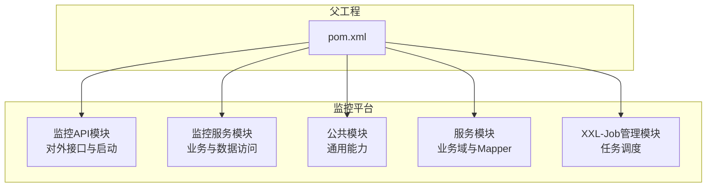
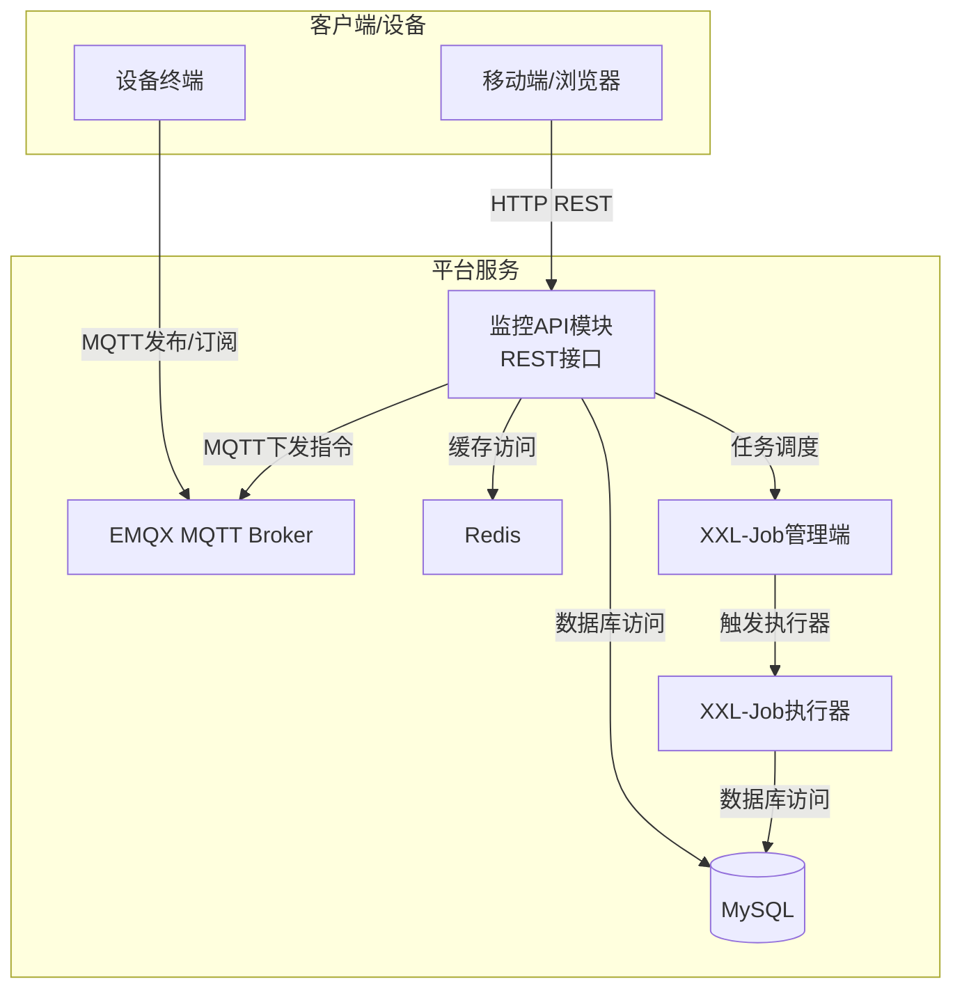
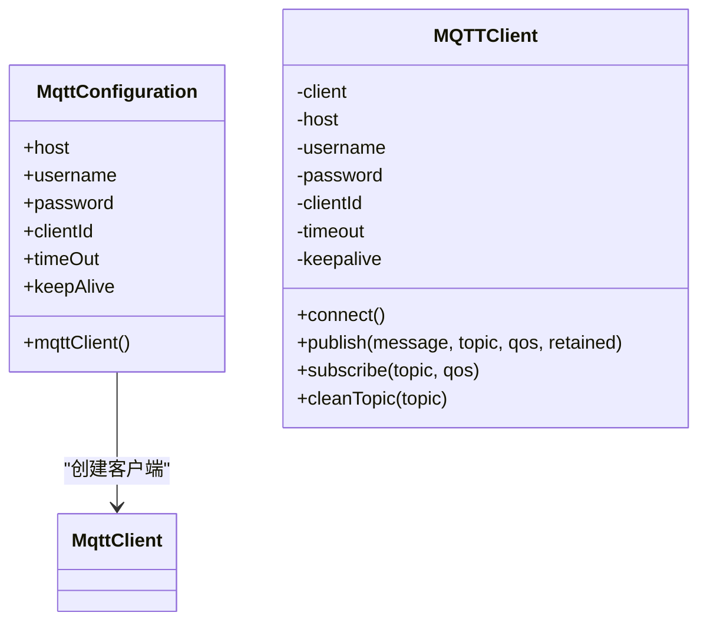
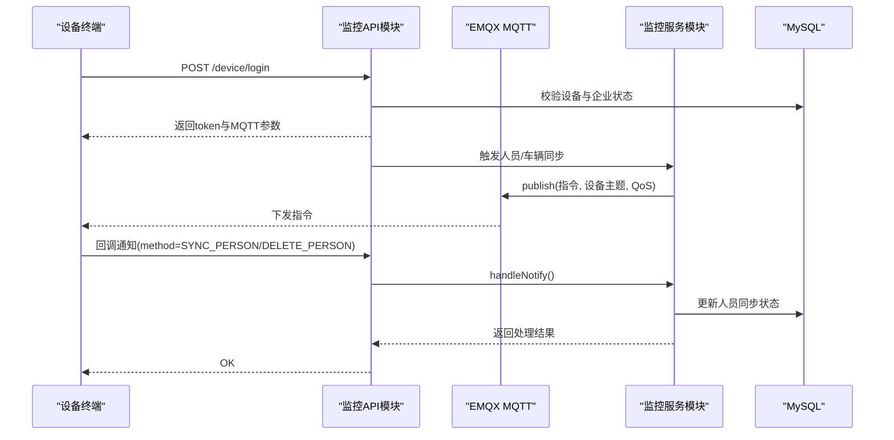
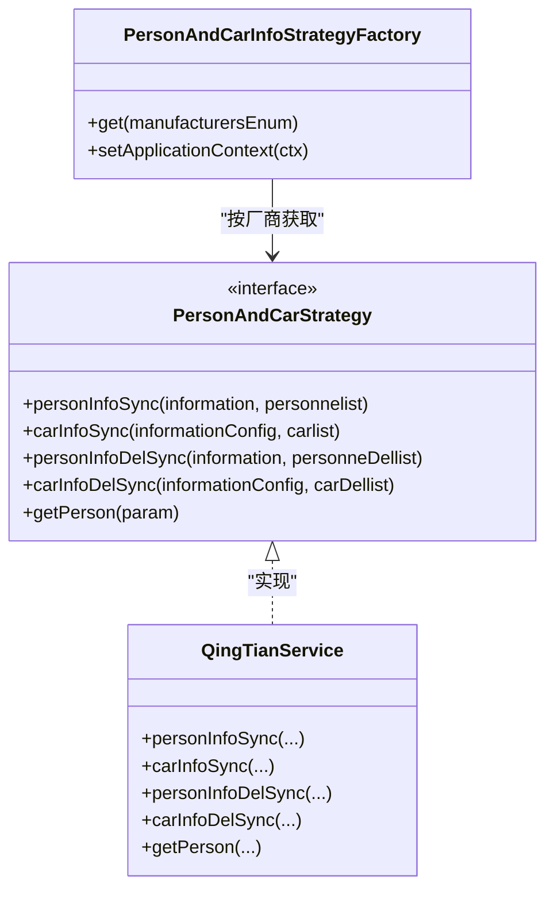
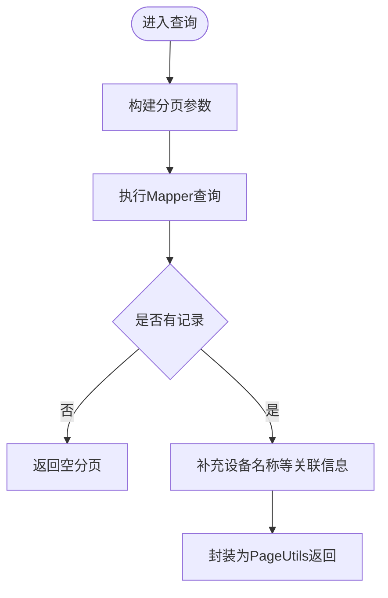
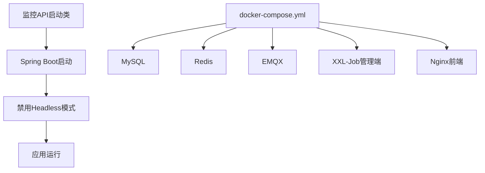
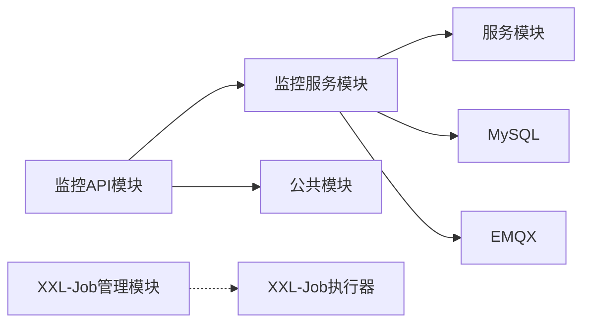

# 架构设计

<cite>
**本文引用的文件**   
- [pom.xml](file://pom.xml)
- [docker-compose.yml](file://deploy/docker-compose.yml)
- [application-prod.yml](file://deploy/config/monitor-api/application-prod.yml)
- [MonkeyMonitorApplication.java](file://monkey-monitor-api/src/main/java/com/monkey/general/MonkeyMonitorApplication.java)
- [MqttConfiguration.java](file://monkey-monitor/src/main/java/com/monkey/general/config/MqttConfiguration.java)
- [MQTTClient.java](file://monkey-monitor/src/main/java/com/monkey/general/config/mqtt/MQTTClient.java)
- [DeviceController.java](file://monkey-monitor-api/src/main/java/com/monkey/general/controller/DeviceController.java)
- [MybatisPlusConfig.java](file://monkey-monitor/src/main/java/com/monkey/general/config/MybatisPlusConfig.java)
- [QingTianService.java](file://monkey-monitor/src/main/java/com/monkey/general/modules/third/service/QingTianService.java)
- [PersonAndCarStrategy.java](file://monkey-monitor/src/main/java/com/monkey/general/modules/third/service/PersonAndCarStrategy.java)
- [PersonAndCarInfoStrategyFactory.java](file://monkey-monitor-api/src/main/java/com/monkey/general/factory/PersonAndCarInfoStrategyFactory.java)
- [XxlJobAdminApplication.java](file://xxl-job-admin/src/main/java/com/xxl/job/admin/XxlJobAdminApplication.java)
</cite>

## 目录
1. [引言](#引言)
2. [项目结构](#项目结构)
3. [核心组件](#核心组件)
4. [架构总览](#架构总览)
5. [详细组件分析](#详细组件分析)
6. [依赖分析](#依赖分析)
7. [性能考虑](#性能考虑)
8. [故障排查指南](#故障排查指南)
9. [结论](#结论)
10. [附录](#附录)

## 引言
本文件为安威 fireworks 物联网监控平台的架构设计文档，面向平台整体架构、微服务拆分、模块划分与组件交互、技术选型、分层设计、核心设计模式、数据流与处理链路、扩展性设计（插件化与设备扩展）等方面进行系统化阐述，并辅以架构图与组件关系图，帮助开发者快速理解系统设计思路与实现要点。

## 项目结构
本项目采用 Maven 多模块聚合结构，核心模块包括：
- 父工程：统一版本管理与依赖约束
- 公共模块：通用配置、工具类、常量、异常与校验
- 服务模块：业务领域模型、Mapper、Service 实现与 MyBatis 配置
- 监控 API 模块：对外 HTTP 接口、控制器、定时任务与启动入口
- XXL-Job 管理模块：分布式任务调度中心

**章节来源**
- [pom.xml:11-17](file://pom.xml#L11-L17)

## 核心组件
- 微服务边界与职责
  - 监控 API 模块：对外提供 HTTP 接口（设备登录、人员/车辆同步、通知回调等），负责鉴权与参数校验，协调第三方服务与设备侧通信。
  - 监控服务模块：设备侧 MQTT 通信、数据库访问（MyBatis Plus）、业务逻辑编排（人员/车辆同步、告警落库、图片上传等）。
  - 服务模块：业务实体与 Mapper，支撑监控服务模块的数据访问。
  - 公共模块：通用配置、工具类、枚举、异常与校验，跨模块复用。
  - XXL-Job 管理模块：任务调度中心，负责执行器注册、任务编排与日志管理。

- 技术栈与选型
  - Spring Boot 2.1.x + Spring Cloud Greenwich：稳定版本组合，便于依赖兼容与运维。
  - MyBatis Plus：简化数据访问层开发，内置分页与类型处理器注册。
  - MQTT（Eclipse Paho）：设备侧低延迟、高可靠消息传输，支持自动重连与 QoS。
  - Docker Compose：基础设施与应用服务编排，包含 MySQL、Redis、EMQX、XXL-Job 管理端与前端 Nginx。
  - XXL-Job：分布式任务调度，支持执行器自动注册与远程日志。

**章节来源**
- [pom.xml:49-61](file://pom.xml#L49-L61)
- [MqttConfiguration.java:1-53](file://monkey-monitor/src/main/java/com/monkey/general/config/MqttConfiguration.java#L1-L53)
- [docker-compose.yml:1-103](file://deploy/docker-compose.yml#L1-L103)

## 架构总览
平台采用“微服务 + 分布式任务 + 消息中间件”的整体架构：
- 表现层：监控 API 模块提供 REST 接口，设备侧通过 MQTT 与平台交互。
- 业务层：监控服务模块编排业务流程，调用第三方服务（如“擎天”平台）与本地数据库。
- 数据层：MySQL + Redis 缓存，MyBatis Plus 提供 ORM 能力。
- 基础设施：EMQX 作为 MQTT 中间件，XXL-Job 管理任务执行，Nginx 作为前端反向代理。

**图表来源**
- [docker-compose.yml:33-87](file://deploy/docker-compose.yml#L33-L87)
- [application-prod.yml:30-135](file://deploy/config/monitor-api/application-prod.yml#L30-L135)

**章节来源**
- [docker-compose.yml:33-87](file://deploy/docker-compose.yml#L33-L87)
- [application-prod.yml:30-135](file://deploy/config/monitor-api/application-prod.yml#L30-L135)

## 详细组件分析

### 组件一：MQTT 通信与配置
- 设计要点
  - 通过配置类创建 MqttClient，设置用户名、密码、超时、保活、自动重连与并发上限。
  - 提供 MQTTClient 封装类，统一发布/订阅/取消订阅流程，保证线程安全与 QoS 控制。
  - 在设备登录流程中，返回设备侧 MQTT 连接参数（主机、端口、用户名、密码、QoS、主题等）。

**图表来源**
- [MqttConfiguration.java:14-53](file://monkey-monitor/src/main/java/com/monkey/general/config/MqttConfiguration.java#L14-L53)
- [MQTTClient.java:1-139](file://monkey-monitor/src/main/java/com/monkey/general/config/mqtt/MQTTClient.java#L1-L139)

**章节来源**
- [MqttConfiguration.java:20-50](file://monkey-monitor/src/main/java/com/monkey/general/config/MqttConfiguration.java#L20-L50)
- [MQTTClient.java:50-103](file://monkey-monitor/src/main/java/com/monkey/general/config/mqtt/MQTTClient.java#L50-L103)

### 组件二：设备登录与下发流程（序列图）
- 流程说明
  - 设备发起登录请求，平台校验设备与企业状态，生成 token 并返回 MQTT 连接参数。
  - 平台根据设备类型与企业配置，向设备主题下发人员/车辆同步指令或查询指令。
  - 设备侧回调通知，平台更新同步状态并落库。

**图表来源**
- [DeviceController.java:59-104](file://monkey-monitor-api/src/main/java/com/monkey/general/controller/DeviceController.java#L59-L104)
- [QingTianService.java:429-504](file://monkey-monitor/src/main/java/com/monkey/general/modules/third/service/QingTianService.java#L429-L504)

**章节来源**
- [DeviceController.java:59-104](file://monkey-monitor-api/src/main/java/com/monkey/general/controller/DeviceController.java#L59-L104)
- [QingTianService.java:100-162](file://monkey-monitor/src/main/java/com/monkey/general/modules/third/service/QingTianService.java#L100-L162)

### 组件三：策略模式与设备集成（类图）
- 设计要点
  - 定义统一的人员/车辆同步策略接口，屏蔽不同厂商差异。
  - 工厂根据厂商枚举获取对应策略实现，实现“按厂商扩展”的插件化架构。
  - 当前实现中，策略接口由“擎天服务”实现，后续可扩展其他厂商实现。

**图表来源**
- [PersonAndCarStrategy.java:16-29](file://monkey-monitor/src/main/java/com/monkey/general/modules/third/service/PersonAndCarStrategy.java#L16-L29)
- [QingTianService.java:60-100](file://monkey-monitor/src/main/java/com/monkey/general/modules/third/service/QingTianService.java#L60-L100)
- [PersonAndCarInfoStrategyFactory.java:18-35](file://monkey-monitor-api/src/main/java/com/monkey/general/factory/PersonAndCarInfoStrategyFactory.java#L18-L35)

**章节来源**
- [PersonAndCarStrategy.java:16-29](file://monkey-monitor/src/main/java/com/monkey/general/modules/third/service/PersonAndCarStrategy.java#L16-L29)
- [PersonAndCarInfoStrategyFactory.java:24-34](file://monkey-monitor-api/src/main/java/com/monkey/general/factory/PersonAndCarInfoStrategyFactory.java#L24-L34)

### 组件四：数据访问与分页（流程图）
- 设计要点
  - MyBatis Plus 配置注册自定义类型处理器，支持整型数组字段的序列化/反序列化。
  - 分页拦截器统一注入，简化分页查询实现。
  - 服务层基于分页工具类构建分页结果，减少重复代码。

**图表来源**
- [MybatisPlusConfig.java:10-21](file://monkey-monitor/src/main/java/com/monkey/general/config/MybatisPlusConfig.java#L10-L21)
- [LevelServiceImpl.java:30-47](file://monkey-monitor/src/main/java/com/monkey/general/modules/em/service/impl/LevelServiceImpl.java#L30-L47)

**章节来源**
- [MybatisPlusConfig.java:10-21](file://monkey-monitor/src/main/java/com/monkey/general/config/MybatisPlusConfig.java#L10-L21)
- [LevelServiceImpl.java:30-47](file://monkey-monitor/src/main/java/com/monkey/general/modules/em/service/impl/LevelServiceImpl.java#L30-L47)

### 组件五：启动与容器编排
- 启动入口
  - 监控 API 模块启动类通过自定义注解包装 Spring Boot 启动，禁用 Headless 模式以支持本地图形组件（如大华 SDK 抓图）。
- 容器编排
  - 使用 Docker Compose 编排 MySQL、Redis、EMQX、XXL-Job 管理端与前端 Nginx，服务间通过内部网络互通。

**图表来源**
- [MonkeyMonitorApplication.java:9-17](file://monkey-monitor-api/src/main/java/com/monkey/general/MonkeyMonitorApplication.java#L9-L17)
- [docker-compose.yml:6-103](file://deploy/docker-compose.yml#L6-L103)

**章节来源**
- [MonkeyMonitorApplication.java:9-17](file://monkey-monitor-api/src/main/java/com/monkey/general/MonkeyMonitorApplication.java#L9-L17)
- [docker-compose.yml:6-103](file://deploy/docker-compose.yml#L6-L103)

## 依赖分析
- 版本与依赖管理
  - 父工程统一管理 Spring Boot、Spring Cloud、MyBatis Plus、MQTT 客户端、Netty、Gson、Groovy、SLF4J 等版本。
  - 通过 Spring Platform Bom 与 Spring Cloud Bom 约束版本，确保兼容性。
- 模块间耦合
  - 监控 API 模块依赖监控服务模块与公共模块，向上提供 REST 接口。
  - 监控服务模块依赖数据库与 MQTT 客户端，向下调用第三方服务。
  - XXL-Job 管理模块独立部署，通过执行器与业务模块解耦。

**图表来源**
- [pom.xml:65-101](file://pom.xml#L65-L101)
- [docker-compose.yml:56-87](file://deploy/docker-compose.yml#L56-L87)

**章节来源**
- [pom.xml:65-101](file://pom.xml#L65-L101)
- [docker-compose.yml:56-87](file://deploy/docker-compose.yml#L56-L87)

## 性能考虑
- MQTT 并发与可靠性
  - 合理设置最大并发（inflight）与自动重连，避免网络抖动导致的消息丢失。
  - 发布时根据业务重要性选择合适的 QoS 与留存策略。
- 数据库与缓存
  - 使用分页拦截器与索引优化查询性能；对热点数据使用 Redis 缓存，降低数据库压力。
- 任务调度
  - XXL-Job 执行器合理配置日志路径与保留天数，避免磁盘占用过高。
- 图片与文件
  - 人员抓拍图片上传至对象存储后，避免在数据库中存储大字段，提升写入性能。

## 故障排查指南
- MQTT 连接失败
  - 检查 EMQX 服务健康状态与认证信息（用户名/密码/客户端ID）。
  - 查看连接超时与保活参数是否合理。
- 设备登录失败
  - 校验设备编号是否存在、企业状态是否正常。
  - 确认返回的 MQTT 参数（主机、端口、主题）是否正确。
- 同步结果异常
  - 查看通知回调处理日志，确认成功/失败集合是否为空。
  - 检查第三方平台接口返回码与签名参数。
- 任务调度问题
  - 登录 XXL-Job 管理端查看执行器注册状态与任务日志。

**章节来源**
- [MqttConfiguration.java:34-50](file://monkey-monitor/src/main/java/com/monkey/general/config/MqttConfiguration.java#L34-L50)
- [DeviceController.java:64-83](file://monkey-monitor-api/src/main/java/com/monkey/general/controller/DeviceController.java#L64-L83)
- [QingTianService.java:429-504](file://monkey-monitor/src/main/java/com/monkey/general/modules/third/service/QingTianService.java#L429-L504)
- [XxlJobAdminApplication.java:10-15](file://xxl-job-admin/src/main/java/com/xxl/job/admin/XxlJobAdminApplication.java#L10-L15)

## 结论
本架构以 Spring Boot 为基础，结合 MyBatis Plus、MQTT、Docker Compose 与 XXL-Job，形成“接口编排 + 消息驱动 + 任务调度”的物联网监控平台。通过策略模式与工厂实现设备集成的插件化扩展，配合分层设计与统一配置，具备良好的可维护性与可扩展性。建议在后续迭代中持续完善设备侧适配策略、增强可观测性与告警闭环。

## 附录
- 配置参考
  - 生产环境配置示例：数据库连接、Redis、MQTT、WebSocket、第三方平台地址、XXL-Job 执行器参数等。
- 启动与部署
  - 使用 Docker Compose 一键启动全部服务，确保各服务健康检查通过后再启动上层应用。

**章节来源**
- [application-prod.yml:1-203](file://deploy/config/monitor-api/application-prod.yml#L1-L203)
- [docker-compose.yml:1-103](file://deploy/docker-compose.yml#L1-L103)