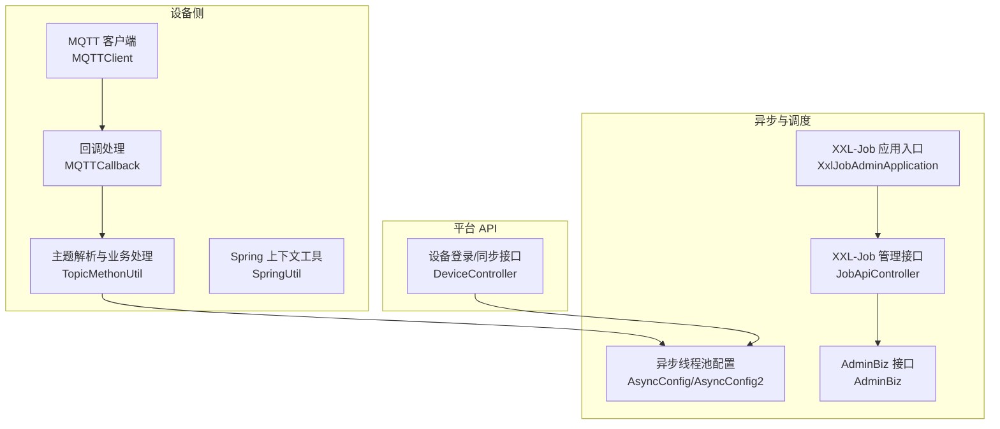
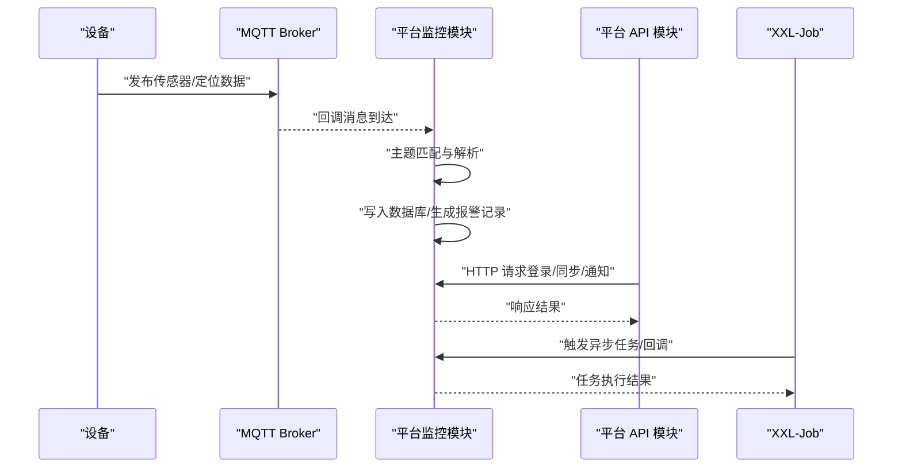
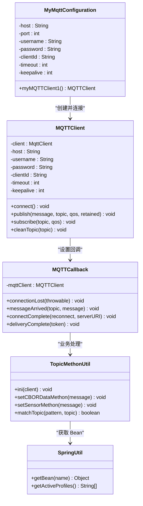
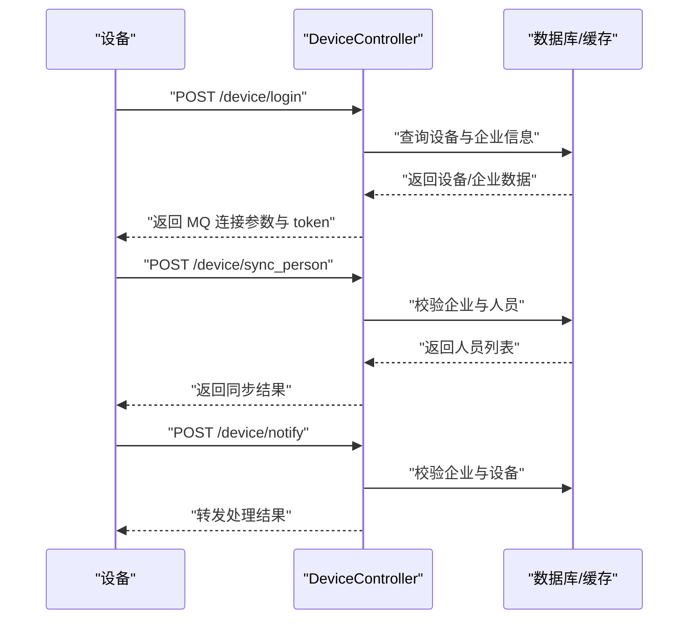
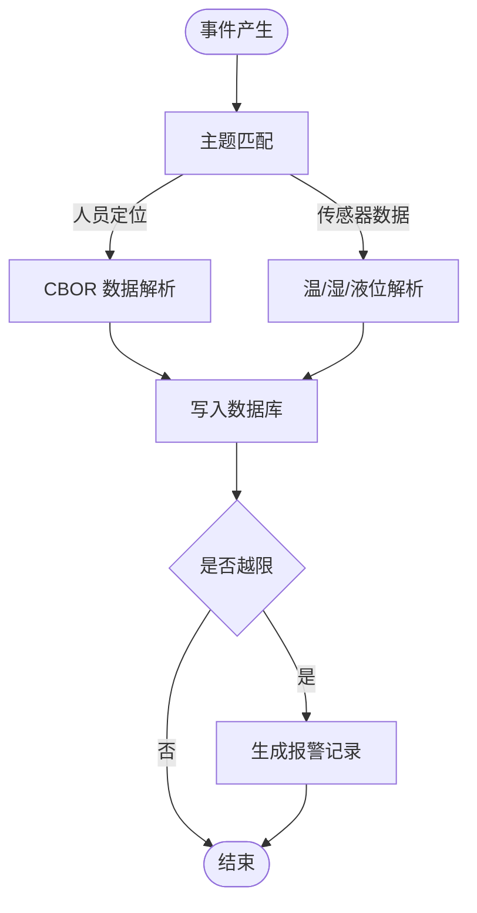
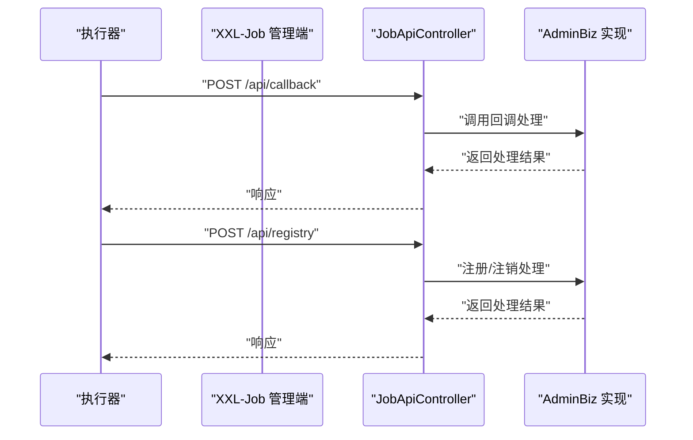
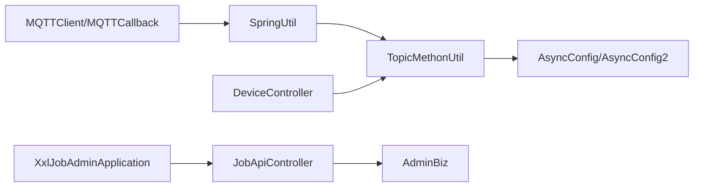

# 通信模式设计

<cite>
**本文引用的文件**
- [MQTTClient.java](file://monkey-monitor/src/main/java/com/monkey/general/config/mqtt/MQTTClient.java)
- [MyMqttConfiguration.java](file://monkey-monitor/src/main/java/com/monkey/general/config/mqtt/MyMqttConfiguration.java)
- [MQTTCallback.java](file://monkey-monitor/src/main/java/com/monkey/general/config/mqtt/MQTTCallback.java)
- [TopicMethonUtil.java](file://monkey-monitor/src/main/java/com/monkey/general/config/mqtt/TopicMethonUtil.java)
- [SpringUtil.java](file://monkey-monitor/src/main/java/com/monkey/general/config/mqtt/SpringUtil.java)
- [DeviceController.java](file://monkey-monitor-api/src/main/java/com/monkey/general/controller/DeviceController.java)
- [AsyncConfig.java](file://monkey-common/src/main/java/com/monkey/general/common/config/AsyncConfig.java)
- [AsyncConfig2.java](file://monkey-common/src/main/java/com/monkey/general/common/config/AsyncConfig2.java)
- [JobApiController.java](file://xxl-job-admin/src/main/java/com/xxl/job/admin/controller/JobApiController.java)
- [XxlJobAdminApplication.java](file://xxl-job-admin/src/main/java/com/xxl/job/admin/XxlJobAdminApplication.java)
- [AdminBiz.java](file://xxl-job-core/src/main/java/com/xxl/job/core/biz/AdminBiz.java)
</cite>

## 目录
1. [引言](#引言)
2. [项目结构](#项目结构)
3. [核心组件](#核心组件)
4. [架构总览](#架构总览)
5. [详细组件分析](#详细组件分析)
6. [依赖分析](#依赖分析)
7. [性能考量](#性能考量)
8. [故障排查指南](#故障排查指南)
9. [结论](#结论)
10. [附录](#附录)

## 引言
本设计文档聚焦于安威 fireworks 物联网监控平台的通信模式，覆盖设备与平台之间的 MQTT 协议通信、平台内部服务间的 HTTP RESTful API 调用、以及基于 XXL-Job 的异步任务调度。文档解释同步与异步通信的选择原则，并给出事件驱动架构的实现要点（事件发布订阅、消息路由、事件溯源思路）。同时，结合现有代码分析通信安全机制（TLS/证书、身份认证、消息签名等）的现状与建议。

## 项目结构
平台由以下子模块构成：
- 平台监控模块（设备侧 MQTT 客户端与数据处理）
- 平台 API 模块（对外 HTTP 接口）
- 公共配置模块（异步线程池）
- XXL-Job 调度模块（作业编排与回调）

图表来源
- [MQTTClient.java:1-139](file://monkey-monitor/src/main/java/com/monkey/general/config/mqtt/MQTTClient.java#L1-L139)
- [MQTTCallback.java:1-127](file://monkey-monitor/src/main/java/com/monkey/general/config/mqtt/MQTTCallback.java#L1-L127)
- [TopicMethonUtil.java:1-382](file://monkey-monitor/src/main/java/com/monkey/general/config/mqtt/TopicMethonUtil.java#L1-L382)
- [SpringUtil.java:1-143](file://monkey-monitor/src/main/java/com/monkey/general/config/mqtt/SpringUtil.java#L1-L143)
- [DeviceController.java:1-266](file://monkey-monitor-api/src/main/java/com/monkey/general/controller/DeviceController.java#L1-L266)
- [AsyncConfig.java:1-28](file://monkey-common/src/main/java/com/monkey/general/common/config/AsyncConfig.java#L1-L28)
- [AsyncConfig2.java:1-28](file://monkey-common/src/main/java/com/monkey/general/common/config/AsyncConfig2.java#L1-L28)
- [JobApiController.java:1-43](file://xxl-job-admin/src/main/java/com/xxl/job/admin/controller/JobApiController.java#L1-L43)
- [XxlJobAdminApplication.java:1-16](file://xxl-job-admin/src/main/java/com/xxl/job/admin/XxlJobAdminApplication.java#L1-L16)
- [AdminBiz.java:1-49](file://xxl-job-core/src/main/java/com/xxl/job/core/biz/AdminBiz.java#L1-L49)

章节来源
- [MQTTClient.java:1-139](file://monkey-monitor/src/main/java/com/monkey/general/config/mqtt/MQTTClient.java#L1-L139)
- [MyMqttConfiguration.java:1-58](file://monkey-monitor/src/main/java/com/monkey/general/config/mqtt/MyMqttConfiguration.java#L1-L58)
- [MQTTCallback.java:1-127](file://monkey-monitor/src/main/java/com/monkey/general/config/mqtt/MQTTCallback.java#L1-L127)
- [TopicMethonUtil.java:1-382](file://monkey-monitor/src/main/java/com/monkey/general/config/mqtt/TopicMethonUtil.java#L1-L382)
- [SpringUtil.java:1-143](file://monkey-monitor/src/main/java/com/monkey/general/config/mqtt/SpringUtil.java#L1-L143)
- [DeviceController.java:1-266](file://monkey-monitor-api/src/main/java/com/monkey/general/controller/DeviceController.java#L1-L266)
- [AsyncConfig.java:1-28](file://monkey-common/src/main/java/com/monkey/general/common/config/AsyncConfig.java#L1-L28)
- [AsyncConfig2.java:1-28](file://monkey-common/src/main/java/com/monkey/general/common/config/AsyncConfig2.java#L1-L28)
- [JobApiController.java:1-43](file://xxl-job-admin/src/main/java/com/xxl/job/admin/controller/JobApiController.java#L1-L43)
- [XxlJobAdminApplication.java:1-16](file://xxl-job-admin/src/main/java/com/xxl/job/admin/XxlJobAdminApplication.java#L1-L16)
- [AdminBiz.java:1-49](file://xxl-job-core/src/main/java/com/xxl/job/core/biz/AdminBiz.java#L1-L49)

## 核心组件
- MQTT 客户端与连接管理：负责建立/维护 MQTT 连接、发布/订阅消息、自动重连与超时控制。
- 回调与主题路由：在回调中进行主题匹配与分发，触发具体业务处理。
- 业务处理与报警：解析传感器/定位数据，写入数据库并触发短信报警记录。
- 对外 HTTP 接口：提供设备登录、人员同步、通知回调等 REST 接口。
- 异步线程池：为报警与抓拍等耗时任务提供异步执行能力。
- XXL-Job 管理接口：提供统一的作业管理 API，支持注册、回调、状态上报等。

章节来源
- [MQTTClient.java:1-139](file://monkey-monitor/src/main/java/com/monkey/general/config/mqtt/MQTTClient.java#L1-L139)
- [MQTTCallback.java:1-127](file://monkey-monitor/src/main/java/com/monkey/general/config/mqtt/MQTTCallback.java#L1-L127)
- [TopicMethonUtil.java:1-382](file://monkey-monitor/src/main/java/com/monkey/general/config/mqtt/TopicMethonUtil.java#L1-L382)
- [DeviceController.java:1-266](file://monkey-monitor-api/src/main/java/com/monkey/general/controller/DeviceController.java#L1-L266)
- [AsyncConfig.java:1-28](file://monkey-common/src/main/java/com/monkey/general/common/config/AsyncConfig.java#L1-L28)
- [AsyncConfig2.java:1-28](file://monkey-common/src/main/java/com/monkey/general/common/config/AsyncConfig2.java#L1-L28)
- [JobApiController.java:1-43](file://xxl-job-admin/src/main/java/com/xxl/job/admin/controller/JobApiController.java#L1-L43)
- [AdminBiz.java:1-49](file://xxl-job-core/src/main/java/com/xxl/job/core/biz/AdminBiz.java#L1-L49)

## 架构总览
平台采用“设备侧 MQTT + 平台 API + 异步处理 + 调度中心”的混合通信架构：
- 设备通过 MQTT 向平台推送数据，平台在回调中解析并落库，必要时触发短信报警。
- 平台对外提供 HTTP REST 接口，供设备侧拉取 MQTT 连接参数、同步人员信息、接收设备通知。
- 异步线程池用于处理报警与抓拍等耗时任务，避免阻塞主线程。
- XXL-Job 提供集中式调度与回调能力，支撑定时任务与远程执行。

图表来源
- [MQTTCallback.java:62-89](file://monkey-monitor/src/main/java/com/monkey/general/config/mqtt/MQTTCallback.java#L62-L89)
- [TopicMethonUtil.java:115-168](file://monkey-monitor/src/main/java/com/monkey/general/config/mqtt/TopicMethonUtil.java#L115-L168)
- [DeviceController.java:59-104](file://monkey-monitor-api/src/main/java/com/monkey/general/controller/DeviceController.java#L59-L104)
- [AsyncConfig.java:17-26](file://monkey-common/src/main/java/com/monkey/general/common/config/AsyncConfig.java#L17-L26)
- [JobApiController.java:38-43](file://xxl-job-admin/src/main/java/com/xxl/job/admin/controller/JobApiController.java#L38-L43)

## 详细组件分析

### MQTT 通信组件
- 连接与参数：支持用户名密码、超时、保活、自动重连等参数配置，连接成功后初始化回调。
- 发布与订阅：支持指定 QoS 与留存策略；订阅主题在连接完成回调中恢复。
- 回调处理：断线重连、消息到达、投递完成回调；消息到达后进行主题匹配与业务处理。
- 主题解析：支持通配符“+”“#”，按主题路径匹配并分派至对应处理逻辑。

图表来源
- [MQTTClient.java:1-139](file://monkey-monitor/src/main/java/com/monkey/general/config/mqtt/MQTTClient.java#L1-L139)
- [MyMqttConfiguration.java:1-58](file://monkey-monitor/src/main/java/com/monkey/general/config/mqtt/MyMqttConfiguration.java#L1-L58)
- [MQTTCallback.java:1-127](file://monkey-monitor/src/main/java/com/monkey/general/config/mqtt/MQTTCallback.java#L1-L127)
- [TopicMethonUtil.java:1-382](file://monkey-monitor/src/main/java/com/monkey/general/config/mqtt/TopicMethonUtil.java#L1-L382)
- [SpringUtil.java:1-143](file://monkey-monitor/src/main/java/com/monkey/general/config/mqtt/SpringUtil.java#L1-L143)

章节来源
- [MQTTClient.java:27-139](file://monkey-monitor/src/main/java/com/monkey/general/config/mqtt/MQTTClient.java#L27-L139)
- [MyMqttConfiguration.java:19-57](file://monkey-monitor/src/main/java/com/monkey/general/config/mqtt/MyMqttConfiguration.java#L19-L57)
- [MQTTCallback.java:32-125](file://monkey-monitor/src/main/java/com/monkey/general/config/mqtt/MQTTCallback.java#L32-L125)
- [TopicMethonUtil.java:68-324](file://monkey-monitor/src/main/java/com/monkey/general/config/mqtt/TopicMethonUtil.java#L68-L324)
- [SpringUtil.java:42-60](file://monkey-monitor/src/main/java/com/monkey/general/config/mqtt/SpringUtil.java#L42-L60)

### HTTP RESTful API 组件
- 设备登录接口：校验设备与企业状态，下发 MQTT 连接参数（主机、端口、用户名、密码、QoS、主题等）。
- 人员同步接口：校验企业与人员有效性，组装人员信息列表返回。
- 通知回调接口：校验企业与设备状态，转发至第三方服务处理。
- 缓存与鉴权：使用 Redis 缓存设备人员临时数据，接口层进行鉴权与参数校验。

图表来源
- [DeviceController.java:59-104](file://monkey-monitor-api/src/main/java/com/monkey/general/controller/DeviceController.java#L59-L104)
- [DeviceController.java:107-161](file://monkey-monitor-api/src/main/java/com/monkey/general/controller/DeviceController.java#L107-L161)
- [DeviceController.java:169-196](file://monkey-monitor-api/src/main/java/com/monkey/general/controller/DeviceController.java#L169-L196)

章节来源
- [DeviceController.java:59-266](file://monkey-monitor-api/src/main/java/com/monkey/general/controller/DeviceController.java#L59-L266)

### 异步消息与事件驱动
- 异步线程池：提供独立的报警与抓拍线程池，核心线程、最大线程、队列容量与拒绝策略可配置。
- 事件驱动：MQTT 回调作为事件源，TopicMethonUtil 作为事件处理器，按主题分发事件并执行业务逻辑。
- 事件溯源思路：报警记录表可作为事件存储，记录事件类型、阈值、设备信息、处理结果等，便于审计与回放。

图表来源
- [TopicMethonUtil.java:87-168](file://monkey-monitor/src/main/java/com/monkey/general/config/mqtt/TopicMethonUtil.java#L87-L168)
- [TopicMethonUtil.java:327-381](file://monkey-monitor/src/main/java/com/monkey/general/config/mqtt/TopicMethonUtil.java#L327-L381)
- [AsyncConfig.java:17-26](file://monkey-common/src/main/java/com/monkey/general/common/config/AsyncConfig.java#L17-L26)
- [AsyncConfig2.java:15-26](file://monkey-common/src/main/java/com/monkey/general/common/config/AsyncConfig2.java#L15-L26)

章节来源
- [AsyncConfig.java:1-28](file://monkey-common/src/main/java/com/monkey/general/common/config/AsyncConfig.java#L1-L28)
- [AsyncConfig2.java:1-28](file://monkey-common/src/main/java/com/monkey/general/common/config/AsyncConfig2.java#L1-L28)
- [TopicMethonUtil.java:327-381](file://monkey-monitor/src/main/java/com/monkey/general/config/mqtt/TopicMethonUtil.java#L327-L381)

### XXL-Job 调度与回调
- 管理接口：提供统一的 /api/{uri} 接口，接收来自执行器的回调与注册请求。
- 作业管理：AdminBiz 定义了回调、注册/注销等业务接口，供调度中心管理作业生命周期。
- 应用入口：XXL-Job 管理端应用启动，加载调度线程与监控线程。

图表来源
- [JobApiController.java:38-43](file://xxl-job-admin/src/main/java/com/xxl/job/admin/controller/JobApiController.java#L38-L43)
- [AdminBiz.java:12-48](file://xxl-job-core/src/main/java/com/xxl/job/core/biz/AdminBiz.java#L12-L48)
- [XxlJobAdminApplication.java:10-16](file://xxl-job-admin/src/main/java/com/xxl/job/admin/XxlJobAdminApplication.java#L10-L16)

章节来源
- [JobApiController.java:1-43](file://xxl-job-admin/src/main/java/com/xxl/job/admin/controller/JobApiController.java#L1-L43)
- [AdminBiz.java:1-49](file://xxl-job-core/src/main/java/com/xxl/job/core/biz/AdminBiz.java#L1-L49)
- [XxlJobAdminApplication.java:1-16](file://xxl-job-admin/src/main/java/com/xxl/job/admin/XxlJobAdminApplication.java#L1-L16)

## 依赖分析
- 设备侧 MQTT 依赖 Eclipse Paho 客户端，通过回调与 Spring 上下文工具解耦业务处理。
- 平台 API 依赖数据库与缓存，接口层承担鉴权与参数校验职责。
- 异步处理依赖 Spring 线程池配置，隔离耗时任务。
- XXL-Job 依赖 AdminBiz 接口契约，管理端与执行器通过 HTTP 接口交互。

图表来源
- [MQTTClient.java:1-139](file://monkey-monitor/src/main/java/com/monkey/general/config/mqtt/MQTTClient.java#L1-L139)
- [MQTTCallback.java:1-127](file://monkey-monitor/src/main/java/com/monkey/general/config/mqtt/MQTTCallback.java#L1-L127)
- [TopicMethonUtil.java:1-382](file://monkey-monitor/src/main/java/com/monkey/general/config/mqtt/TopicMethonUtil.java#L1-L382)
- [SpringUtil.java:1-143](file://monkey-monitor/src/main/java/com/monkey/general/config/mqtt/SpringUtil.java#L1-L143)
- [DeviceController.java:1-266](file://monkey-monitor-api/src/main/java/com/monkey/general/controller/DeviceController.java#L1-L266)
- [AsyncConfig.java:1-28](file://monkey-common/src/main/java/com/monkey/general/common/config/AsyncConfig.java#L1-L28)
- [AsyncConfig2.java:1-28](file://monkey-common/src/main/java/com/monkey/general/common/config/AsyncConfig2.java#L1-L28)
- [JobApiController.java:1-43](file://xxl-job-admin/src/main/java/com/xxl/job/admin/controller/JobApiController.java#L1-L43)
- [AdminBiz.java:1-49](file://xxl-job-core/src/main/java/com/xxl/job/core/biz/AdminBiz.java#L1-L49)
- [XxlJobAdminApplication.java:1-16](file://xxl-job-admin/src/main/java/com/xxl/job/admin/XxlJobAdminApplication.java#L1-L16)

## 性能考量
- MQTT 发布：默认 QoS=0、非持久化，适合低延迟场景；对关键告警可提升 QoS 并启用留存。
- 连接参数：合理设置超时与保活，避免频繁断连；自动重连策略需配合指数退避与订阅恢复。
- 异步处理：报警与抓拍任务放入独立线程池，避免阻塞主线程；对高并发场景可增加线程池大小与队列容量。
- HTTP 接口：对高频接口（如登录）可引入限流与缓存；对写入型接口（如通知）应关注幂等性与事务一致性。
- 调度性能：XXL-Job 的线程池与调度周期需与数据库负载匹配，避免过载。

## 故障排查指南
- MQTT 断连与重连
  - 现象：回调中触发重连循环或订阅丢失。
  - 处理：检查连接参数、Broker 地址与网络；在连接完成回调中恢复订阅。
- 消息解析异常
  - 现象：主题匹配失败或解析报错。
  - 处理：确认主题通配符规则与设备上报格式；在解析前进行格式校验。
- 报警未触发
  - 现象：数据越限但未生成报警记录。
  - 处理：检查阈值配置、设备类型映射与报警记录写入逻辑。
- HTTP 接口鉴权失败
  - 现象：设备无法获取 MQ 参数或同步失败。
  - 处理：核对设备/企业状态、token 校验与参数完整性。
- 异步任务堆积
  - 现象：报警/抓拍延迟。
  - 处理：调整线程池参数、优化任务执行时间、引入限流与降级。

章节来源
- [MQTTCallback.java:32-56](file://monkey-monitor/src/main/java/com/monkey/general/config/mqtt/MQTTCallback.java#L32-L56)
- [TopicMethonUtil.java:327-381](file://monkey-monitor/src/main/java/com/monkey/general/config/mqtt/TopicMethonUtil.java#L327-L381)
- [DeviceController.java:59-104](file://monkey-monitor-api/src/main/java/com/monkey/general/controller/DeviceController.java#L59-L104)
- [AsyncConfig.java:17-26](file://monkey-common/src/main/java/com/monkey/general/common/config/AsyncConfig.java#L17-L26)
- [AsyncConfig2.java:15-26](file://monkey-common/src/main/java/com/monkey/general/common/config/AsyncConfig2.java#L15-L26)

## 结论
平台通过 MQTT 实现设备与平台的低延迟数据通道，结合 HTTP REST 接口满足设备侧的连接参数下发与业务协同，利用异步线程池与 XXL-Job 提升系统的吞吐与可观测性。建议在生产环境中进一步完善 TLS 加密、消息签名与访问控制，确保端到端通信安全。

## 附录
- 通信安全机制现状与建议
  - TLS/证书：建议在 MQTT 客户端与 Broker 之间启用 TLS，确保传输加密与双向认证。
  - 身份认证：在 HTTP 接口与 MQTT 连接中引入强认证（如 JWT、OAuth），并对关键接口进行鉴权。
  - 消息签名：对关键数据（如报警、同步）进行数字签名，防止篡改与重放攻击。
  - 访问控制：限制订阅主题范围与发布权限，实施最小权限原则。
- 典型通信场景
  - 设备登录：设备向平台发起登录请求，平台返回 MQ 连接参数与 token。
  - 传感器数据上报：设备通过 MQTT 发布数据，平台回调解析并入库，必要时触发报警。
  - 人员同步：设备请求同步人员信息，平台校验后返回人员列表。
  - 通知回调：设备上报处理结果，平台进行鉴权与转发。