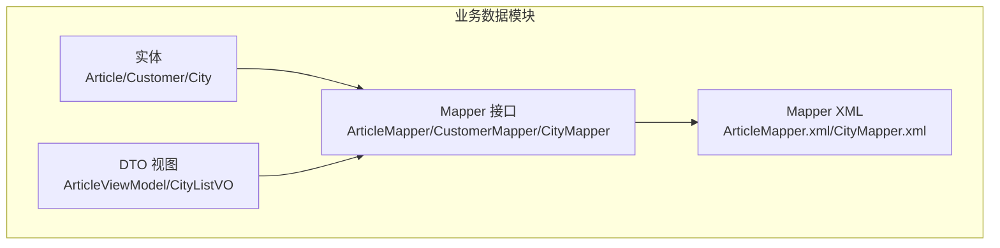
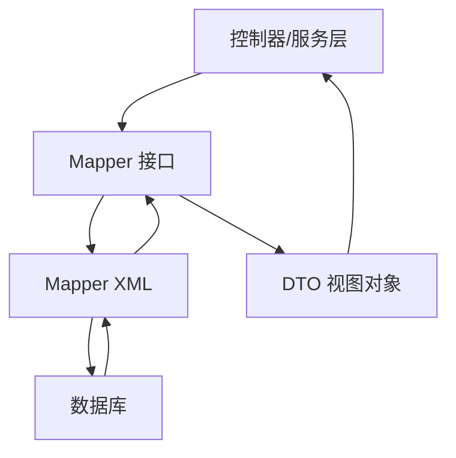
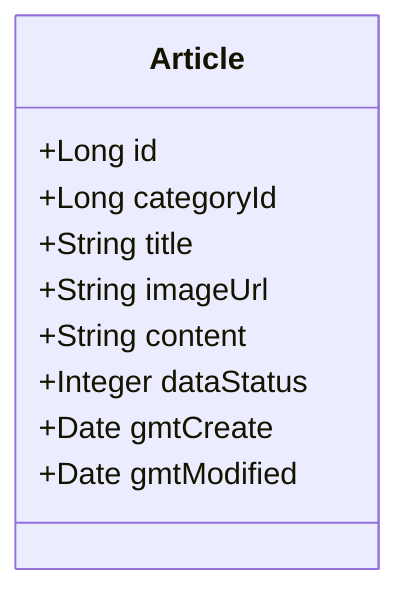
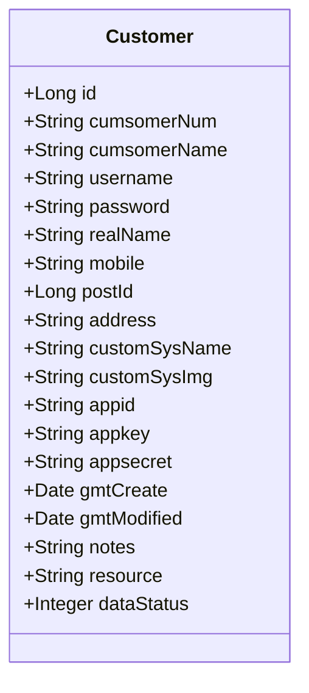
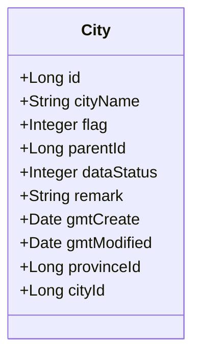
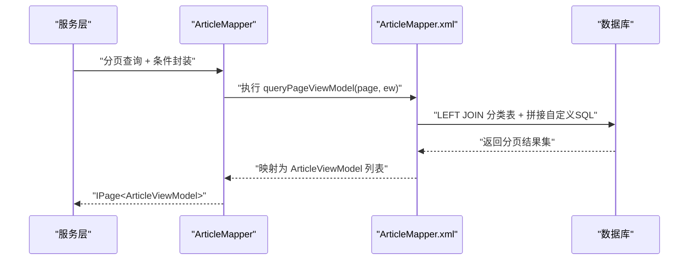
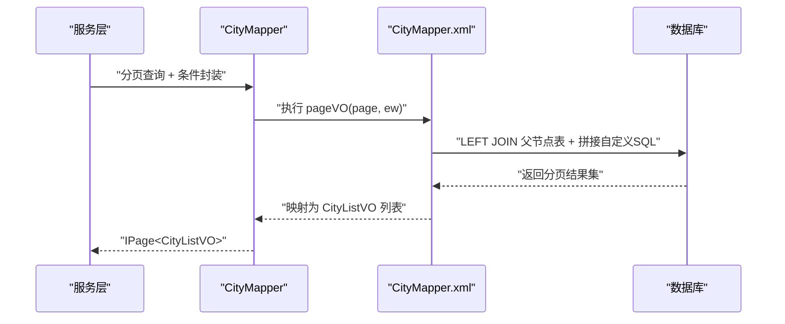
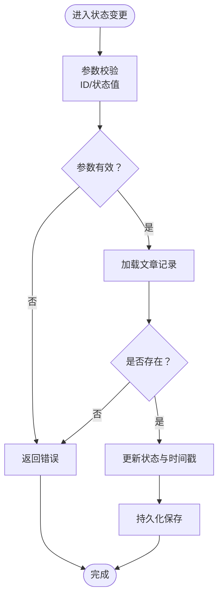
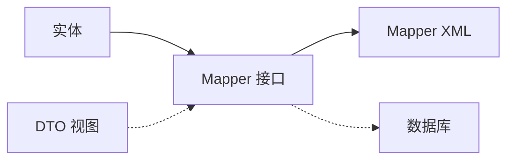

# 业务数据模块

<cite>
**本文引用的文件**
- [Article.java](file://monkey-service/src/main/java/com/monkey/general/modules/bz/entity/Article.java)
- [Customer.java](file://monkey-service/src/main/java/com/monkey/general/modules/bz/entity/Customer.java)
- [City.java](file://monkey-service/src/main/java/com/monkey/general/modules/bz/entity/City.java)
- [ArticleMapper.java](file://monkey-service/src/main/java/com/monkey/general/modules/bz/mapper/ArticleMapper.java)
- [CustomerMapper.java](file://monkey-service/src/main/java/com/monkey/general/modules/bz/mapper/CustomerMapper.java)
- [CityMapper.java](file://monkey-service/src/main/java/com/monkey/general/modules/bz/mapper/CityMapper.java)
- [ArticleMapper.xml](file://monkey-service/src/main/resources/mapper/bz/ArticleMapper.xml)
- [CityMapper.xml](file://monkey-service/src/main/resources/mapper/bz/CityMapper.xml)
- [ArticleViewModel.java](file://monkey-service/src/main/java/com/monkey/general/modules/bz/dto/ArticleViewModel.java)
- [CityListVO.java](file://monkey-service/src/main/java/com/monkey/general/modules/bz/dto/CityListVO.java)
</cite>

## 目录
1. [引言](#引言)
2. [项目结构](#项目结构)
3. [核心组件](#核心组件)
4. [架构总览](#架构总览)
5. [详细组件分析](#详细组件分析)
6. [依赖分析](#依赖分析)
7. [性能考虑](#性能考虑)
8. [故障排查指南](#故障排查指南)
9. [结论](#结论)
10. [附录](#附录)

## 引言
本文件面向“业务数据模块”，聚焦于业务拓展相关的实体与数据管理能力，包括文章（Article）、客户（Customer）、城市（City）等核心业务实体的设计与职责；梳理内容管理、客户关系管理、区域管理等业务场景的数据流与控制流；总结存储结构与查询优化策略；给出Service层的实现思路（含数据增删改查、业务逻辑处理、数据校验等），并阐明与其它模块的关联关系及数据流转过程。同时提供扩展性设计建议与未来功能规划方向。

## 项目结构
业务数据模块位于服务端工程的业务包下，采用按领域分层的组织方式：
- 实体层：定义业务实体，映射数据库表结构
- Mapper层：MyBatis接口与XML映射，负责SQL编排与分页查询
- DTO层：视图对象，承载页面展示所需字段
- 控制器/服务层：在上层工程中调用Mapper完成业务操作（本仓库未直接提供Service实现）

图表来源
- [Article.java:1-69](file://monkey-service/src/main/java/com/monkey/general/modules/bz/entity/Article.java#L1-L69)
- [Customer.java:1-125](file://monkey-service/src/main/java/com/monkey/general/modules/bz/entity/Customer.java#L1-L125)
- [City.java:1-83](file://monkey-service/src/main/java/com/monkey/general/modules/bz/entity/City.java#L1-L83)
- [ArticleMapper.java:1-19](file://monkey-service/src/main/java/com/monkey/general/modules/bz/mapper/ArticleMapper.java#L1-L19)
- [CustomerMapper.java:1-18](file://monkey-service/src/main/java/com/monkey/general/modules/bz/mapper/CustomerMapper.java#L1-L18)
- [CityMapper.java:1-23](file://monkey-service/src/main/java/com/monkey/general/modules/bz/mapper/CityMapper.java#L1-L23)
- [ArticleMapper.xml:1-12](file://monkey-service/src/main/resources/mapper/bz/ArticleMapper.xml#L1-L12)
- [CityMapper.xml:1-11](file://monkey-service/src/main/resources/mapper/bz/CityMapper.xml#L1-L11)
- [ArticleViewModel.java:1-22](file://monkey-service/src/main/java/com/monkey/general/modules/bz/dto/ArticleViewModel.java#L1-L22)
- [CityListVO.java:1-22](file://monkey-service/src/main/java/com/monkey/general/modules/bz/dto/CityListVO.java#L1-L22)

章节来源
- [Article.java:1-69](file://monkey-service/src/main/java/com/monkey/general/modules/bz/entity/Article.java#L1-L69)
- [Customer.java:1-125](file://monkey-service/src/main/java/com/monkey/general/modules/bz/entity/Customer.java#L1-L125)
- [City.java:1-83](file://monkey-service/src/main/java/com/monkey/general/modules/bz/entity/City.java#L1-L83)
- [ArticleMapper.java:1-19](file://monkey-service/src/main/java/com/monkey/general/modules/bz/mapper/ArticleMapper.java#L1-L19)
- [CustomerMapper.java:1-18](file://monkey-service/src/main/java/com/monkey/general/modules/bz/mapper/CustomerMapper.java#L1-L18)
- [CityMapper.java:1-23](file://monkey-service/src/main/java/com/monkey/general/modules/bz/mapper/CityMapper.java#L1-L23)
- [ArticleMapper.xml:1-12](file://monkey-service/src/main/resources/mapper/bz/ArticleMapper.xml#L1-L12)
- [CityMapper.xml:1-11](file://monkey-service/src/main/resources/mapper/bz/CityMapper.xml#L1-L11)
- [ArticleViewModel.java:1-22](file://monkey-service/src/main/java/com/monkey/general/modules/bz/dto/ArticleViewModel.java#L1-L22)
- [CityListVO.java:1-22](file://monkey-service/src/main/java/com/monkey/general/modules/bz/dto/CityListVO.java#L1-L22)

## 核心组件
- 文章（Article）
  - 职责：承载业务内容，支持分类、标题、图片、正文、状态与时间戳等字段
  - 关键点：使用自动填充创建/更新时间；提供序列化支持
- 客户（Customer）
  - 职责：记录客户/企业基础信息、账号密码、联系人、地址、状态等
  - 关键点：包含企业定制系统相关字段，便于多租户或定制化部署
- 城市（City）
  - 职责：描述省市区层级关系，支持父子节点与状态管理
  - 关键点：提供省/市临时字段用于前端展示，不持久化到表

章节来源
- [Article.java:14-68](file://monkey-service/src/main/java/com/monkey/general/modules/bz/entity/Article.java#L14-L68)
- [Customer.java:14-124](file://monkey-service/src/main/java/com/monkey/general/modules/bz/entity/Customer.java#L14-L124)
- [City.java:14-82](file://monkey-service/src/main/java/com/monkey/general/modules/bz/entity/City.java#L14-L82)

## 架构总览
业务数据模块遵循“实体-映射-视图”的分层设计，通过Mapper接口与XML配置实现复杂查询与分页返回视图对象。整体交互如下：

图表来源
- [ArticleMapper.java:16-17](file://monkey-service/src/main/java/com/monkey/general/modules/bz/mapper/ArticleMapper.java#L16-L17)
- [CityMapper.java:21-21](file://monkey-service/src/main/java/com/monkey/general/modules/bz/mapper/CityMapper.java#L21-L21)
- [ArticleMapper.xml:6-10](file://monkey-service/src/main/resources/mapper/bz/ArticleMapper.xml#L6-L10)
- [CityMapper.xml:6-10](file://monkey-service/src/main/resources/mapper/bz/CityMapper.xml#L6-L10)
- [ArticleViewModel.java:13-19](file://monkey-service/src/main/java/com/monkey/general/modules/bz/dto/ArticleViewModel.java#L13-L19)
- [CityListVO.java:13-19](file://monkey-service/src/main/java/com/monkey/general/modules/bz/dto/CityListVO.java#L13-L19)

## 详细组件分析

### 文章（Article）实体与查询
- 设计要点
  - 字段覆盖标题、分类、图片、内容、状态与时间戳
  - 使用自动填充创建/更新时间，保证审计一致性
- 查询优化
  - 列表分页查询通过自定义SQL拼接条件，避免全表扫描
  - 通过视图对象聚合分类名称，减少多次联表查询
- 扩展建议
  - 可增加索引：分类ID、状态、创建时间
  - 支持软删除标记位，配合状态字段实现逻辑删除

图表来源
- [Article.java:20-65](file://monkey-service/src/main/java/com/monkey/general/modules/bz/entity/Article.java#L20-L65)

章节来源
- [Article.java:14-68](file://monkey-service/src/main/java/com/monkey/general/modules/bz/entity/Article.java#L14-L68)
- [ArticleMapper.java:16-17](file://monkey-service/src/main/java/com/monkey/general/modules/bz/mapper/ArticleMapper.java#L16-L17)
- [ArticleMapper.xml:6-10](file://monkey-service/src/main/resources/mapper/bz/ArticleMapper.xml#L6-L10)
- [ArticleViewModel.java:13-19](file://monkey-service/src/main/java/com/monkey/general/modules/bz/dto/ArticleViewModel.java#L13-L19)

### 客户（Customer）实体
- 设计要点
  - 包含企业编码、企业名称、账号密码、联系人、联系方式、地址、状态等
  - 提供企业定制系统相关字段，便于多租户或定制化部署
- 查询优化
  - 建议对“企业编码”建立唯一索引，提升登录与识别效率
  - 对“状态”与“创建时间”建立复合索引，支撑筛选与排序
- 安全建议
  - 密码字段应进行安全存储与传输加密
  - 避免在日志与响应中泄露敏感字段

图表来源
- [Customer.java:20-121](file://monkey-service/src/main/java/com/monkey/general/modules/bz/entity/Customer.java#L20-L121)

章节来源
- [Customer.java:14-124](file://monkey-service/src/main/java/com/monkey/general/modules/bz/entity/Customer.java#L14-L124)
- [CustomerMapper.java:14-17](file://monkey-service/src/main/java/com/monkey/general/modules/bz/mapper/CustomerMapper.java#L14-L17)

### 城市（City）实体与层级查询
- 设计要点
  - 支持省/市/区三层级关系，通过父节点ID建立树形结构
  - 提供省/市临时字段用于前端展示，不参与持久化
- 查询优化
  - 列表分页查询通过左连接父节点表，一次性返回父节点名称
  - 建议对“父节点ID”与“状态”建立索引，支撑层级查询与筛选
- 扩展建议
  - 可引入地理围栏、行政区划边界等扩展字段
  - 支持动态层级（如街道/乡镇）时，可抽象为通用树形结构

图表来源
- [City.java:22-81](file://monkey-service/src/main/java/com/monkey/general/modules/bz/entity/City.java#L22-L81)

章节来源
- [City.java:14-82](file://monkey-service/src/main/java/com/monkey/general/modules/bz/entity/City.java#L14-L82)
- [CityMapper.java:19-22](file://monkey-service/src/main/java/com/monkey/general/modules/bz/mapper/CityMapper.java#L19-L22)
- [CityMapper.xml:6-10](file://monkey-service/src/main/resources/mapper/bz/CityMapper.xml#L6-L10)
- [CityListVO.java:13-19](file://monkey-service/src/main/java/com/monkey/general/modules/bz/dto/CityListVO.java#L13-L19)

### 数据查询流程（以文章为例）

图表来源
- [ArticleMapper.java:16-17](file://monkey-service/src/main/java/com/monkey/general/modules/bz/mapper/ArticleMapper.java#L16-L17)
- [ArticleMapper.xml:6-10](file://monkey-service/src/main/resources/mapper/bz/ArticleMapper.xml#L6-L10)
- [ArticleViewModel.java:13-19](file://monkey-service/src/main/java/com/monkey/general/modules/bz/dto/ArticleViewModel.java#L13-L19)

### 数据查询流程（以城市为例）

图表来源
- [CityMapper.java:21-21](file://monkey-service/src/main/java/com/monkey/general/modules/bz/mapper/CityMapper.java#L21-L21)
- [CityMapper.xml:6-10](file://monkey-service/src/main/resources/mapper/bz/CityMapper.xml#L6-L10)
- [CityListVO.java:13-19](file://monkey-service/src/main/java/com/monkey/general/modules/bz/dto/CityListVO.java#L13-L19)

### 复杂逻辑流程（示例：文章状态变更）

图表来源
- [Article.java:50-65](file://monkey-service/src/main/java/com/monkey/general/modules/bz/entity/Article.java#L50-L65)

## 依赖分析
- 组件内聚与耦合
  - 实体与Mapper之间为单向依赖，符合分层设计
  - DTO作为视图对象，仅依赖对应实体，降低跨模块耦合
- 外部依赖
  - MyBatis Plus：提供通用Mapper与自动填充能力
  - Lombok：简化实体字段与构造方法
- 潜在风险
  - XML中使用字符串拼接自定义SQL，需确保参数安全与SQL注入防护
  - 视图对象与实体同名字段需保持一致，避免映射错位

图表来源
- [Article.java:20-65](file://monkey-service/src/main/java/com/monkey/general/modules/bz/entity/Article.java#L20-L65)
- [Customer.java:20-121](file://monkey-service/src/main/java/com/monkey/general/modules/bz/entity/Customer.java#L20-L121)
- [City.java:22-81](file://monkey-service/src/main/java/com/monkey/general/modules/bz/entity/City.java#L22-L81)
- [ArticleMapper.java:16-17](file://monkey-service/src/main/java/com/monkey/general/modules/bz/mapper/ArticleMapper.java#L16-L17)
- [CityMapper.java:21-21](file://monkey-service/src/main/java/com/monkey/general/modules/bz/mapper/CityMapper.java#L21-L21)
- [ArticleMapper.xml:6-10](file://monkey-service/src/main/resources/mapper/bz/ArticleMapper.xml#L6-L10)
- [CityMapper.xml:6-10](file://monkey-service/src/main/resources/mapper/bz/CityMapper.xml#L6-L10)
- [ArticleViewModel.java:13-19](file://monkey-service/src/main/java/com/monkey/general/modules/bz/dto/ArticleViewModel.java#L13-L19)
- [CityListVO.java:13-19](file://monkey-service/src/main/java/com/monkey/general/modules/bz/dto/CityListVO.java#L13-L19)

章节来源
- [ArticleMapper.java:1-19](file://monkey-service/src/main/java/com/monkey/general/modules/bz/mapper/ArticleMapper.java#L1-L19)
- [CityMapper.java:1-23](file://monkey-service/src/main/java/com/monkey/general/modules/bz/mapper/CityMapper.java#L1-L23)
- [ArticleMapper.xml:1-12](file://monkey-service/src/main/resources/mapper/bz/ArticleMapper.xml#L1-L12)
- [CityMapper.xml:1-11](file://monkey-service/src/main/resources/mapper/bz/CityMapper.xml#L1-L11)
- [ArticleViewModel.java:1-22](file://monkey-service/src/main/java/com/monkey/general/modules/bz/dto/ArticleViewModel.java#L1-L22)
- [CityListVO.java:1-22](file://monkey-service/src/main/java/com/monkey/general/modules/bz/dto/CityListVO.java#L1-L22)

## 性能考虑
- 索引策略
  - 文章：按分类ID、状态、创建时间建立复合索引
  - 客户：按企业编码建立唯一索引；按状态、创建时间建立索引
  - 城市：按父节点ID、状态建立索引
- SQL优化
  - 使用LEFT JOIN聚合视图字段，避免N+1查询
  - 自定义SQL段拼接时，确保参数绑定与白名单过滤
- 分页与缓存
  - 列表分页默认开启；对热点数据可引入Redis缓存
  - 缓存失效策略：基于写操作触发或定时刷新

## 故障排查指南
- 常见问题
  - 视图映射失败：检查DTO与实体字段命名一致性与类型匹配
  - SQL注入风险：确认自定义SQL段仅拼接允许的过滤条件
  - 时间戳异常：确认自动填充字段是否正确配置
- 排查步骤
  - 启用SQL日志，核对最终生成SQL
  - 校验Mapper XML命名空间与接口全限定名一致
  - 对比实体字段与数据库表结构，确保无遗漏或多余字段

章节来源
- [ArticleMapper.xml:6-10](file://monkey-service/src/main/resources/mapper/bz/ArticleMapper.xml#L6-L10)
- [CityMapper.xml:6-10](file://monkey-service/src/main/resources/mapper/bz/CityMapper.xml#L6-L10)

## 结论
业务数据模块以清晰的分层设计实现了文章、客户、城市等核心实体的持久化与视图查询。通过Mapper XML实现复杂联表与分页查询，并以DTO承载展示所需字段，满足内容管理、客户关系管理、区域管理等业务场景。建议后续完善索引策略、引入缓存与安全加固，并在Service层补充统一的增删改查与业务校验逻辑，以进一步提升可维护性与扩展性。

## 附录
- 未来功能规划
  - 引入软删除与审计日志，增强数据可追溯性
  - 增加全文检索与标签体系，提升内容检索效率
  - 客户模块支持多角色权限与租户隔离
  - 城市模块支持动态层级与地理围栏
  - 在Service层补充统一的事务、校验与异常处理机制