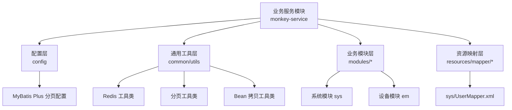
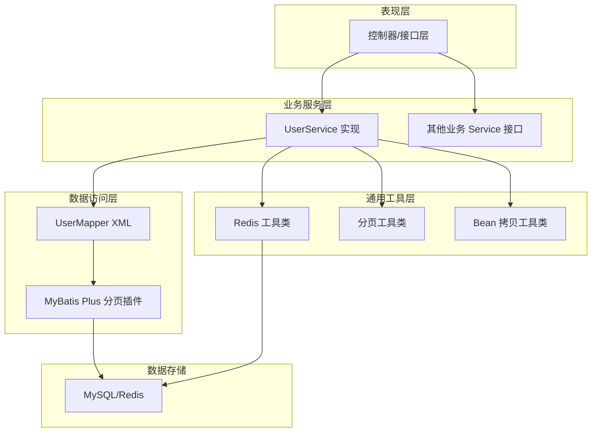
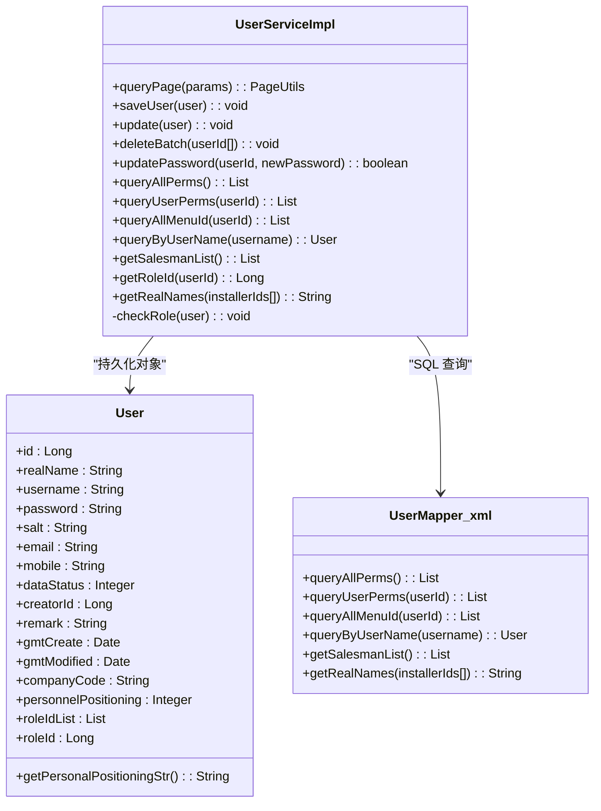
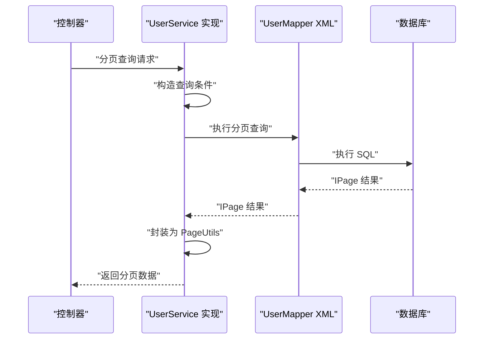
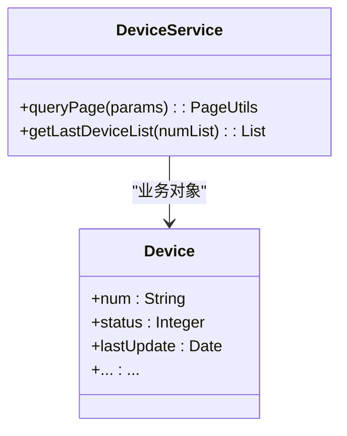
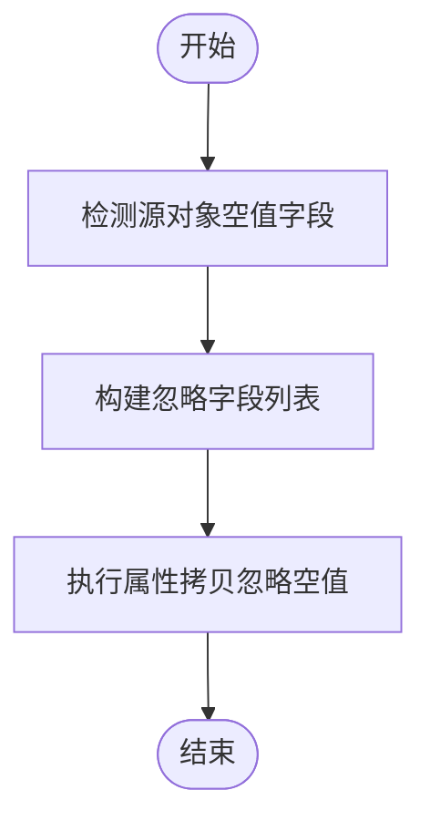
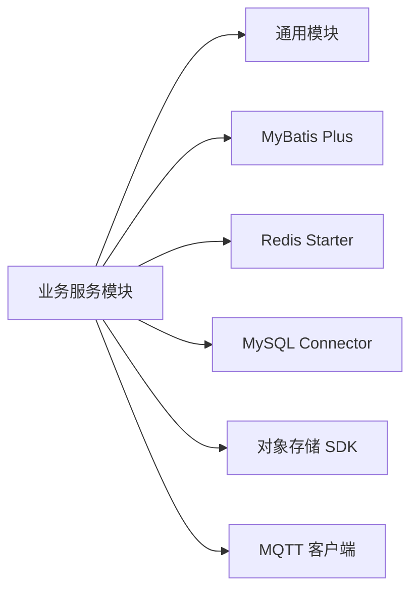

# 业务服务模块

<cite>
**本文引用的文件**
- [pom.xml](file://monkey-service/pom.xml)
- [MybatisPlusConfig.java](file://monkey-service/src/main/java/com/monkey/general/config/MybatisPlusConfig.java)
- [RedisUtils.java](file://monkey-service/src/main/java/com/monkey/general/common/utils/RedisUtils.java)
- [PageUtils.java](file://monkey-service/src/main/java/com/monkey/general/common/utils/PageUtils.java)
- [BeanHelper.java](file://monkey-common/src/main/java/com/monkey/general/common/utils/BeanHelper.java)
- [UserMapper.xml](file://monkey-service/src/main/resources/mapper/sys/UserMapper.xml)
- [User.java](file://monkey-service/src/main/java/com/monkey/general/modules/sys/entity/User.java)
- [UserServiceImpl.java](file://monkey-service/src/main/java/com/monkey/general/modules/sys/service/impl/UserServiceImpl.java)
- [DeviceService.java](file://monkey-service/src/main/java/com/monkey/general/modules/em/service/DeviceService.java)
</cite>

## 目录
1. [引言](#引言)
2. [项目结构](#项目结构)
3. [核心组件](#核心组件)
4. [架构总览](#架构总览)
5. [详细组件分析](#详细组件分析)
6. [依赖分析](#依赖分析)
7. [性能考虑](#性能考虑)
8. [故障排查指南](#故障排查指南)
9. [结论](#结论)
10. [附录](#附录)

## 引言
本文件系统性梳理业务服务模块（monkey-service）的整体设计与实现，重点覆盖以下方面：
- 业务逻辑层（Service）与数据访问层（DAO/MyBatis Mapper）的职责划分与协作方式
- 实体模型（Entity）与 MyBatis Plus 的集成模式
- 通用工具类（Redis 缓存、分页、对象拷贝）在业务中的使用方法
- 关键业务模块（设备管理、告警处理、用户管理等）的职责边界与典型流程
- 事务管理、异常处理、性能优化等关键技术点
- 数据流转与控制流的可视化说明

## 项目结构
业务服务模块以“功能域+分层”的方式组织代码与资源：
- config：MyBatis Plus 分页插件等基础设施配置
- common/utils：通用工具类（Redis、分页、Bean 拷贝等）
- modules：按业务域划分的模块，如 sys（系统）、em（设备监控）等
- resources/mapper：各模块对应的 MyBatis XML 映射文件

图表来源
- [MybatisPlusConfig.java:1-24](file://monkey-service/src/main/java/com/monkey/general/config/MybatisPlusConfig.java#L1-L24)
- [RedisUtils.java:1-305](file://monkey-service/src/main/java/com/monkey/general/common/utils/RedisUtils.java#L1-L305)
- [PageUtils.java:1-103](file://monkey-service/src/main/java/com/monkey/general/common/utils/PageUtils.java#L1-L103)
- [BeanHelper.java:1-66](file://monkey-common/src/main/java/com/monkey/general/common/utils/BeanHelper.java#L1-L66)
- [UserMapper.xml:1-42](file://monkey-service/src/main/resources/mapper/sys/UserMapper.xml#L1-L42)

章节来源
- [pom.xml:1-90](file://monkey-service/pom.xml#L1-L90)

## 核心组件
- MyBatis Plus 配置：提供全局分页插件，简化分页查询与结果封装
- Redis 工具类：统一的键值操作、有序集合、哈希、批量读取等能力
- 分页工具类：将 IPage 结果封装为通用分页视图对象
- Bean 拷贝工具类：支持忽略空值的深拷贝，减少冗余字段更新
- 实体与映射：通过注解定义表结构与字段填充策略，XML 映射复杂查询
- 业务服务：基于 ServiceImpl 封装 CRUD 与组合查询，结合事务与校验

章节来源
- [MybatisPlusConfig.java:1-24](file://monkey-service/src/main/java/com/monkey/general/config/MybatisPlusConfig.java#L1-L24)
- [RedisUtils.java:1-305](file://monkey-service/src/main/java/com/monkey/general/common/utils/RedisUtils.java#L1-L305)
- [PageUtils.java:1-103](file://monkey-service/src/main/java/com/monkey/general/common/utils/PageUtils.java#L1-L103)
- [BeanHelper.java:1-66](file://monkey-common/src/main/java/com/monkey/general/common/utils/BeanHelper.java#L1-L66)
- [User.java:1-127](file://monkey-service/src/main/java/com/monkey/general/modules/sys/entity/User.java#L1-L127)
- [UserMapper.xml:1-42](file://monkey-service/src/main/resources/mapper/sys/UserMapper.xml#L1-L42)
- [UserServiceImpl.java:1-159](file://monkey-service/src/main/java/com/monkey/general/modules/sys/service/impl/UserServiceImpl.java#L1-L159)

## 架构总览
下图展示了从控制器到服务层、数据访问层与数据库的交互路径，以及通用工具类的参与位置。

图表来源
- [UserServiceImpl.java:1-159](file://monkey-service/src/main/java/com/monkey/general/modules/sys/service/impl/UserServiceImpl.java#L1-L159)
- [UserMapper.xml:1-42](file://monkey-service/src/main/resources/mapper/sys/UserMapper.xml#L1-L42)
- [MybatisPlusConfig.java:1-24](file://monkey-service/src/main/java/com/monkey/general/config/MybatisPlusConfig.java#L1-L24)
- [RedisUtils.java:1-305](file://monkey-service/src/main/java/com/monkey/general/common/utils/RedisUtils.java#L1-L305)
- [PageUtils.java:1-103](file://monkey-service/src/main/java/com/monkey/general/common/utils/PageUtils.java#L1-L103)
- [BeanHelper.java:1-66](file://monkey-common/src/main/java/com/monkey/general/common/utils/BeanHelper.java#L1-L66)

## 详细组件分析

### 用户管理模块（sys）
- 实体模型：User 使用 MyBatis Plus 注解映射表字段，包含插入/更新自动填充字段与业务扩展字段
- 数据访问：UserMapper.xml 提供权限查询、菜单 ID 查询、按用户名查询、销售员列表、批量查询真实姓名等 SQL
- 业务服务：UserServiceImpl 继承 ServiceImpl，实现分页查询、保存/更新用户、角色绑定、密码更新、越权校验等
- 事务与异常：关键写操作标注事务；越权场景抛出自定义异常
- 通用工具：分页封装 PageUtils；对象拷贝 BeanHelper；Redis 可用于会话或缓存用户权限

图表来源
- [User.java:1-127](file://monkey-service/src/main/java/com/monkey/general/modules/sys/entity/User.java#L1-L127)
- [UserServiceImpl.java:1-159](file://monkey-service/src/main/java/com/monkey/general/modules/sys/service/impl/UserServiceImpl.java#L1-L159)
- [UserMapper.xml:1-42](file://monkey-service/src/main/resources/mapper/sys/UserMapper.xml#L1-L42)

图表来源
- [UserServiceImpl.java:40-53](file://monkey-service/src/main/java/com/monkey/general/modules/sys/service/impl/UserServiceImpl.java#L40-L53)
- [UserMapper.xml:1-42](file://monkey-service/src/main/resources/mapper/sys/UserMapper.xml#L1-L42)

章节来源
- [User.java:1-127](file://monkey-service/src/main/java/com/monkey/general/modules/sys/entity/User.java#L1-L127)
- [UserMapper.xml:1-42](file://monkey-service/src/main/resources/mapper/sys/UserMapper.xml#L1-L42)
- [UserServiceImpl.java:1-159](file://monkey-service/src/main/java/com/monkey/general/modules/sys/service/impl/UserServiceImpl.java#L1-L159)

### 设备管理模块（em）
- 业务接口：DeviceService 定义分页查询与最新设备列表查询等契约
- 实体模型：Device 作为采集设备信息的载体（注解与字段由实体文件定义）
- 数据访问：Mapper XML 负责复杂查询与统计（注：当前仓库未提供具体 Mapper 文件，但接口已存在）
- 业务服务：可基于 ServiceImpl 实现分页与聚合查询，结合 Redis 缓存热点设备数据

图表来源
- [DeviceService.java:1-20](file://monkey-service/src/main/java/com/monkey/general/modules/em/service/DeviceService.java#L1-L20)

章节来源
- [DeviceService.java:1-20](file://monkey-service/src/main/java/com/monkey/general/modules/em/service/DeviceService.java#L1-L20)

### 通用工具类使用
- Redis 工具类：提供字符串、有序集合、哈希、批量读取、原子操作等能力，适合缓存用户权限、计数器、排行榜等
- 分页工具类：将 IPage 结果转换为通用分页视图，便于前端渲染
- Bean 拷贝工具类：忽略空值复制，避免将空值写回数据库导致字段被清空

图表来源
- [BeanHelper.java:1-66](file://monkey-common/src/main/java/com/monkey/general/common/utils/BeanHelper.java#L1-L66)

章节来源
- [RedisUtils.java:1-305](file://monkey-service/src/main/java/com/monkey/general/common/utils/RedisUtils.java#L1-L305)
- [PageUtils.java:1-103](file://monkey-service/src/main/java/com/monkey/general/common/utils/PageUtils.java#L1-L103)
- [BeanHelper.java:1-66](file://monkey-common/src/main/java/com/monkey/general/common/utils/BeanHelper.java#L1-L66)

## 依赖分析
- 服务模块依赖通用模块（common），复用工具类与常量
- MyBatis Plus 提供分页与通用 CRUD 支持
- Redis Starter 提供缓存能力
- MySQL Connector 提供数据库驱动
- 第三方对象存储 SDK（七牛、阿里云、腾讯云）用于附件上传
- MQTT 客户端用于设备消息订阅

图表来源
- [pom.xml:1-90](file://monkey-service/pom.xml#L1-L90)

章节来源
- [pom.xml:1-90](file://monkey-service/pom.xml#L1-L90)

## 性能考虑
- 分页查询：通过 MyBatis Plus 分页插件限制一次性加载的数据量，避免大结果集内存压力
- 缓存策略：利用 Redis 缓存热点数据（如用户权限、设备状态快照），降低数据库压力
- 批量操作：Redis 批量读取与写入、Mapper 批量更新可减少往返次数
- 字段更新：结合 BeanHelper 忽略空值，减少无效字段写入
- 索引与 SQL：在高频查询列上建立索引，避免全表扫描；复杂联表查询尽量在 XML 中优化

## 故障排查指南
- 分页异常：确认分页参数合法性与排序字段存在性；检查分页插件是否生效
- Redis 访问失败：核对连接配置与序列化策略；避免在生产环境使用 keys 扫描
- 事务不生效：确保事务方法被外部调用触发（同类内调用不会走代理）；捕获异常后需抛出受检异常或运行时异常
- 权限越权：用户角色绑定需与创建者角色范围匹配，越权时抛出自定义异常
- 对象拷贝问题：注意忽略空值的边界情况，必要时显式传入忽略字段

章节来源
- [UserServiceImpl.java:142-158](file://monkey-service/src/main/java/com/monkey/general/modules/sys/service/impl/UserServiceImpl.java#L142-L158)
- [RedisUtils.java:268-275](file://monkey-service/src/main/java/com/monkey/general/common/utils/RedisUtils.java#L268-L275)

## 结论
业务服务模块采用清晰的分层与模块化设计，围绕 MyBatis Plus 与 Redis 构建高效稳定的业务能力。通过通用工具类提升开发效率与运行性能，结合事务与异常处理保障业务一致性与稳定性。建议在后续迭代中完善设备模块的 Mapper 实现与缓存策略，持续优化查询性能与数据一致性。

## 附录
- 业务流程建议
  - 用户管理：登录鉴权 → 权限加载 → 菜单渲染 → 操作日志
  - 设备管理：设备注册 → 状态上报 → 告警推送 → 历史归档
  - 告警处理：规则匹配 → 告警生成 → 通知派发 → 处置闭环
- 关键技术点
  - 事务边界：以业务方法为单位，避免跨模块传播事务
  - 缓存一致性：写操作先更新数据库再失效缓存，读多写少场景优先读缓存
  - 分页规范：前后端约定分页参数，服务端严格校验与默认值处理