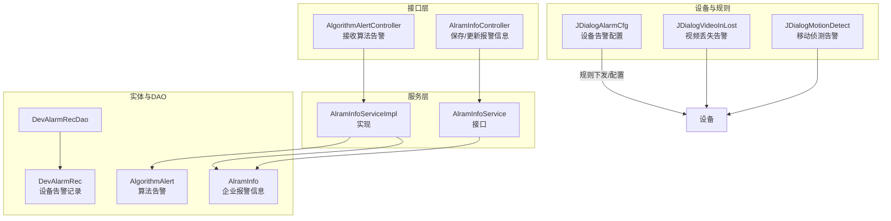
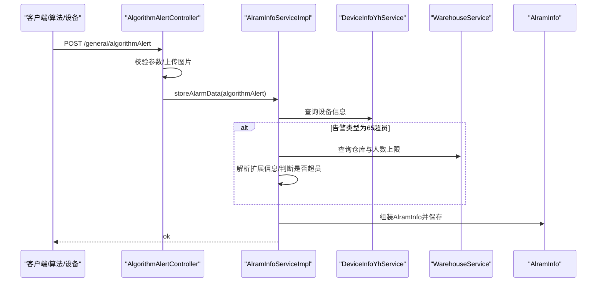
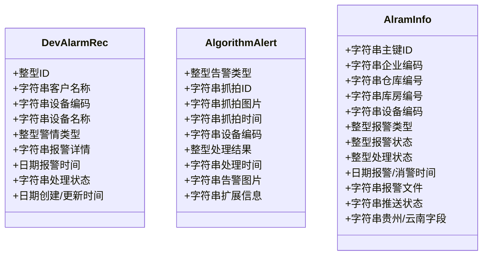
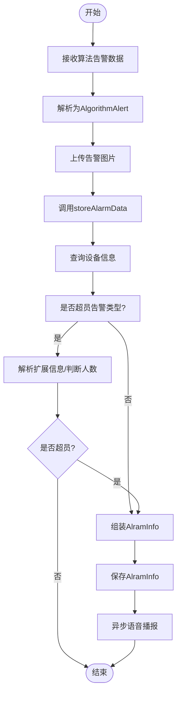
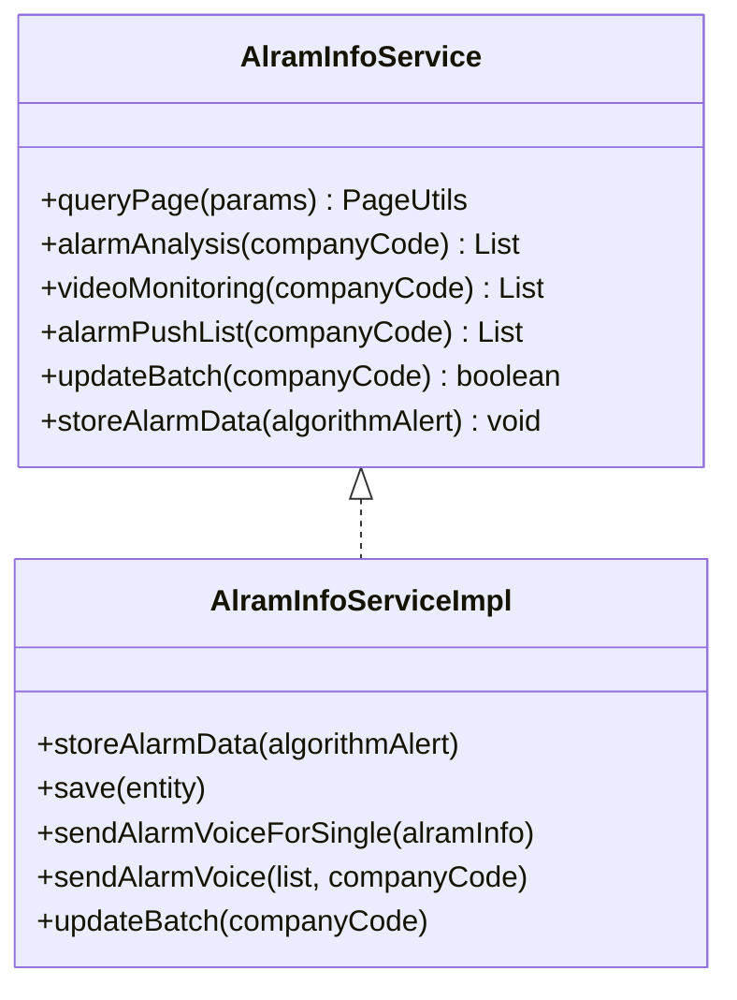
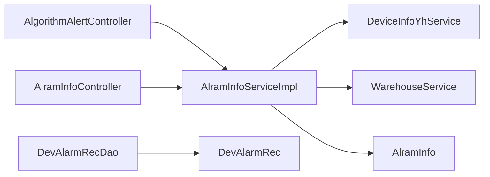

# 告警管理模块

<cite>
**本文引用的文件**
- [DevAlarmRec.java](file://monkey-service/src/main/java/com/monkey/general/modules/em/entity/DevAlarmRec.java)
- [AlgorithmAlert.java](file://monkey-service/src/main/java/com/monkey/general/modules/em/entity/AlgorithmAlert.java)
- [AlramInfo.java](file://monkey-monitor/src/main/java/com/monkey/general/modules/em/entity/AlramInfo.java)
- [AlramInfoService.java](file://monkey-monitor/src/main/java/com/monkey/general/modules/em/service/AlramInfoService.java)
- [AlramInfoServiceImpl.java](file://monkey-monitor/src/main/java/com/monkey/general/modules/em/service/impl/AlramInfoServiceImpl.java)
- [AlgorithmAlertController.java](file://monkey-monitor-api/src/main/java/com/monkey/general/controller/AlgorithmAlertController.java)
- [AlramInfoController.java](file://monkey-monitor-api/src/main/java/com/monkey/general/controller/AlramInfoController.java)
- [GetAlgorithmAlarm.java](file://monkey-monitor-api/src/main/java/com/monkey/general/python/GetAlgorithmAlarm.java)
- [GetAlgorithmAlarmController.java](file://monkey-monitor-api/src/main/java/com/monkey/general/python/GetAlgorithmAlarmController.java)
- [GetCameraAlarmInfoController.java](file://monkey-monitor-api/src/main/java/com/monkey/general/python/GetCameraAlarmInfoController.java)
- [AlarmAnalysisVo.java](file://monkey-monitor-api/src/main/java/com/monkey/general/vo/AlarmAnalysisVo.java)
- [AlarmAnalysisDto.java](file://monkey-monitor/src/main/java/com/monkey/general/modules/em/entity/dto/AlarmAnalysisDto.java)
- [DevAlarmRecService.java](file://monkey-service/src/main/java/com/monkey/general/modules/em/service/DevAlarmRecService.java)
- [DevAlarmRecDao.java](file://monkey-service/src/main/java/com/monkey/general/modules/em/dao/DevAlarmRecDao.java)
- [DevAlarmRecDao.xml](file://monkey-service/src/main/resources/mapper/em/DevAlarmRecDao.xml)
- [JDialogAlarmCfg.java](file://monkey-monitor/src/main/java/com/monkey/general/viedeo/ClientDemo/JDialogAlarmCfg.java)
- [JDialogVideoInLost.java](file://monkey-monitor/src/main/java/com/monkey/general/viedeo/ClientDemo/JDialogVideoInLost.java)
- [JDialogMotionDetect.java](file://monkey-monitor/src/main/java/com/monkey/general/viedeo/ClientDemo/JDialogMotionDetect.java)
- [DaHuaService.java](file://monkey-monitor/src/main/java/com/monkey/general/third/service/DaHuaService.java)
</cite>

## 目录
1. [简介](#简介)
2. [项目结构](#项目结构)
3. [核心组件](#核心组件)
4. [架构总览](#架构总览)
5. [详细组件分析](#详细组件分析)
6. [依赖关系分析](#依赖关系分析)
7. [性能考虑](#性能考虑)
8. [故障排查指南](#故障排查指南)
9. [结论](#结论)
10. [附录](#附录)

## 简介
本文件系统化梳理告警管理模块的设计与实现，覆盖告警实体模型（设备告警记录 DevAlarmRec、算法告警 AlgorithmAlert、企业报警信息 AlramInfo）、告警处理流程（接收、分类、存储、语音播报、状态更新）、数据存储与查询优化、Service 层实现细节、以及与设备管理、用户通知等模块的集成方式，并补充告警规则配置、告警优先级管理与统计分析等高级能力的实现思路。

## 项目结构
告警管理模块横跨多个子工程：
- 数据模型与持久层：位于 monkey-service，包含设备告警记录与算法告警实体及 DAO/Mapper。
- 业务服务与实体：位于 monkey-monitor，包含企业报警信息实体与服务实现。
- 对外接口：位于 monkey-monitor-api，包含算法告警与报警信息的对外控制器。
- 配置与规则：位于 monkey-monitor 的视频客户端示例中，展示设备端告警规则配置界面。

图表来源
- [AlgorithmAlertController.java:30-68](file://monkey-monitor-api/src/main/java/com/monkey/general/controller/AlgorithmAlertController.java#L30-L68)
- [AlramInfoController.java:24-73](file://monkey-monitor-api/src/main/java/com/monkey/general/controller/AlramInfoController.java#L24-L73)
- [AlramInfoService.java:14-48](file://monkey-monitor/src/main/java/com/monkey/general/modules/em/service/AlramInfoService.java#L14-L48)
- [AlramInfoServiceImpl.java:31-39](file://monkey-monitor/src/main/java/com/monkey/general/modules/em/service/impl/AlramInfoServiceImpl.java#L31-L39)
- [AlramInfo.java:12-330](file://monkey-monitor/src/main/java/com/monkey/general/modules/em/entity/AlramInfo.java#L12-L330)
- [DevAlarmRec.java:14-120](file://monkey-service/src/main/java/com/monkey/general/modules/em/entity/DevAlarmRec.java#L14-L120)
- [AlgorithmAlert.java:1-86](file://monkey-service/src/main/java/com/monkey/general/modules/em/entity/AlgorithmAlert.java#L1-L86)
- [DevAlarmRecDao.java:1-13](file://monkey-service/src/main/java/com/monkey/general/modules/em/dao/DevAlarmRecDao.java#L1-L13)
- [JDialogAlarmCfg.java:1001-1021](file://monkey-monitor/src/main/java/com/monkey/general/viedeo/ClientDemo/JDialogAlarmCfg.java#L1001-L1021)

章节来源
- [AlgorithmAlertController.java:30-68](file://monkey-monitor-api/src/main/java/com/monkey/general/controller/AlgorithmAlertController.java#L30-L68)
- [AlramInfoController.java:24-73](file://monkey-monitor-api/src/main/java/com/monkey/general/controller/AlramInfoController.java#L24-L73)
- [AlramInfoService.java:14-48](file://monkey-monitor/src/main/java/com/monkey/general/modules/em/service/AlramInfoService.java#L14-L48)
- [AlramInfoServiceImpl.java:31-39](file://monkey-monitor/src/main/java/com/monkey/general/modules/em/service/impl/AlramInfoServiceImpl.java#L31-L39)
- [AlramInfo.java:12-330](file://monkey-monitor/src/main/java/com/monkey/general/modules/em/entity/AlramInfo.java#L12-L330)
- [DevAlarmRec.java:14-120](file://monkey-service/src/main/java/com/monkey/general/modules/em/entity/DevAlarmRec.java#L14-L120)
- [AlgorithmAlert.java:1-86](file://monkey-service/src/main/java/com/monkey/general/modules/em/entity/AlgorithmAlert.java#L1-L86)
- [DevAlarmRecDao.java:1-13](file://monkey-service/src/main/java/com/monkey/general/modules/em/dao/DevAlarmRecDao.java#L1-L13)
- [JDialogAlarmCfg.java:1001-1021](file://monkey-monitor/src/main/java/com/monkey/general/viedeo/ClientDemo/JDialogAlarmCfg.java#L1001-L1021)

## 核心组件
- 设备告警记录 DevAlarmRec：用于记录设备侧产生的各类告警（如火灾报警、一般报警、故障、事件、离线），包含设备基础信息、告警类型、告警详情、报警时间、处理状态等字段。
- 算法告警 AlgorithmAlert：用于记录算法侧产生的告警（如超员作业、通道堵塞、超高超量、非法入侵、摄像头遮挡偏移等），包含抓拍信息、设备信息、告警类型、告警图片、扩展信息等。
- 企业报警信息 AlramInfo：用于统一汇聚与管理企业维度的报警，包含企业/仓库/库房/设备关联、报警类型、报警状态、处理状态、语音播报、推送状态等字段，并提供报警分析、视频监控、推送列表等能力。

章节来源
- [DevAlarmRec.java:14-120](file://monkey-service/src/main/java/com/monkey/general/modules/em/entity/DevAlarmRec.java#L14-L120)
- [AlgorithmAlert.java:1-86](file://monkey-service/src/main/java/com/monkey/general/modules/em/entity/AlgorithmAlert.java#L1-L86)
- [AlramInfo.java:12-330](file://monkey-monitor/src/main/java/com/monkey/general/modules/em/entity/AlramInfo.java#L12-L330)

## 架构总览
告警管理模块采用“接口层-服务层-实体与DAO”的分层设计，接口层负责接收外部告警数据（算法告警、设备告警、第三方平台告警），服务层进行数据校验、规则判断、存储与语音播报，实体与DAO负责数据持久化与查询。

图表来源
- [AlgorithmAlertController.java:35-64](file://monkey-monitor-api/src/main/java/com/monkey/general/controller/AlgorithmAlertController.java#L35-L64)
- [AlramInfoServiceImpl.java:206-303](file://monkey-monitor/src/main/java/com/monkey/general/modules/em/service/impl/AlramInfoServiceImpl.java#L206-L303)

章节来源
- [AlgorithmAlertController.java:30-68](file://monkey-monitor-api/src/main/java/com/monkey/general/controller/AlgorithmAlertController.java#L30-L68)
- [AlramInfoServiceImpl.java:206-303](file://monkey-monitor/src/main/java/com/monkey/general/modules/em/service/impl/AlramInfoServiceImpl.java#L206-L303)

## 详细组件分析

### 实体模型与用途
- DevAlarmRec（设备告警记录）
  - 字段涵盖设备基础信息、告警类型、告警详情、报警时间、处理状态、创建/更新时间等，适用于设备侧告警的归档与追踪。
- AlgorithmAlert（算法告警）
  - 字段涵盖告警类型、抓拍ID/图片、设备信息、处理结果与时间、分析设备信息、告警图片与扩展信息，适用于算法侧告警的统一接入与处理。
- AlramInfo（企业报警信息）
  - 字段涵盖企业/仓库/库房/设备关联、报警类型与状态、处理状态与描述、语音播报、推送状态、贵州/云南字段等，提供报警分析、视频监控、推送列表等能力。

图表来源
- [DevAlarmRec.java:14-120](file://monkey-service/src/main/java/com/monkey/general/modules/em/entity/DevAlarmRec.java#L14-L120)
- [AlgorithmAlert.java:1-86](file://monkey-service/src/main/java/com/monkey/general/modules/em/entity/AlgorithmAlert.java#L1-L86)
- [AlramInfo.java:12-330](file://monkey-monitor/src/main/java/com/monkey/general/modules/em/entity/AlramInfo.java#L12-L330)

章节来源
- [DevAlarmRec.java:14-120](file://monkey-service/src/main/java/com/monkey/general/modules/em/entity/DevAlarmRec.java#L14-L120)
- [AlgorithmAlert.java:1-86](file://monkey-service/src/main/java/com/monkey/general/modules/em/entity/AlgorithmAlert.java#L1-L86)
- [AlramInfo.java:12-330](file://monkey-monitor/src/main/java/com/monkey/general/modules/em/entity/AlramInfo.java#L12-L330)

### 告警处理流程
- 算法告警接收与存储
  - 接口层接收算法告警数据，上传告警图片至对象存储，解析为 AlgorithmAlert 对象，调用服务层 storeAlarmData 进行存储。
  - 服务层根据设备编码查询设备信息，若为超员告警类型则进一步解析扩展信息并判断是否超过仓库人数上限，满足条件则生成 AlramInfo 并保存。
- 设备告警与第三方平台告警
  - 设备侧告警可通过设备端配置界面设置告警规则（如时间段、触发条件等）。
  - 第三方平台（如大华）通过服务集成将告警转换为 AlramInfo 并保存。
- 语音播报与状态更新
  - 保存成功后，若为未消警状态，触发异步语音播报；同时支持批量更新处理状态与推送状态。

图表来源
- [AlgorithmAlertController.java:35-64](file://monkey-monitor-api/src/main/java/com/monkey/general/controller/AlgorithmAlertController.java#L35-L64)
- [AlramInfoServiceImpl.java:206-303](file://monkey-monitor/src/main/java/com/monkey/general/modules/em/service/impl/AlramInfoServiceImpl.java#L206-L303)

章节来源
- [AlgorithmAlertController.java:30-68](file://monkey-monitor-api/src/main/java/com/monkey/general/controller/AlgorithmAlertController.java#L30-L68)
- [AlramInfoServiceImpl.java:206-303](file://monkey-monitor/src/main/java/com/monkey/general/modules/em/service/impl/AlramInfoServiceImpl.java#L206-L303)

### Service 层实现细节
- AlramInfoService 接口
  - 提供分页查询、报警分析、视频监控、报警推送列表、批量更新等能力。
- AlramInfoServiceImpl 实现
  - 存储逻辑：校验设备存在性与告警类型有效性，针对特定类型进行扩展信息解析与阈值判断，最终保存 AlramInfo。
  - 语音播报：根据企业与设备信息拼接播报语句，支持多种设备类型与重复播报次数配置。
  - 批量更新：提供按企业维度的批量状态更新能力。

图表来源
- [AlramInfoService.java:14-48](file://monkey-monitor/src/main/java/com/monkey/general/modules/em/service/AlramInfoService.java#L14-L48)
- [AlramInfoServiceImpl.java:31-39](file://monkey-monitor/src/main/java/com/monkey/general/modules/em/service/impl/AlramInfoServiceImpl.java#L31-L39)

章节来源
- [AlramInfoService.java:14-48](file://monkey-monitor/src/main/java/com/monkey/general/modules/em/service/AlramInfoService.java#L14-L48)
- [AlramInfoServiceImpl.java:31-39](file://monkey-monitor/src/main/java/com/monkey/general/modules/em/service/impl/AlramInfoServiceImpl.java#L31-L39)

### 与设备管理、用户通知的集成
- 设备管理集成
  - 通过设备信息服务查询设备信息，确保设备存在且具备仓库/库房关联，避免无效告警。
- 用户通知集成
  - 语音播报通过音柱服务与第三方设备（如丹唛派克）进行异步播报，支持重复播报与设备类型区分。
- 第三方平台集成
  - 大华平台通过服务将告警转换为 AlramInfo 并保存，便于统一管理与播报。

章节来源
- [AlramInfoServiceImpl.java:322-417](file://monkey-monitor/src/main/java/com/monkey/general/modules/em/service/impl/AlramInfoServiceImpl.java#L322-L417)
- [DaHuaService.java:389-422](file://monkey-monitor/src/main/java/com/monkey/general/third/service/DaHuaService.java#L389-L422)

### 告警规则配置与优先级管理
- 设备端规则配置
  - 通过设备端界面配置告警时间段、触发条件等，影响设备侧告警产生。
- 告警优先级与类型映射
  - 告警类型映射到统一的报警类型枚举，便于统一处理与统计分析。
- 告警统计分析
  - 提供报警分析接口，输出今日告警数、累计告警数与未处置数量等指标。

章节来源
- [JDialogAlarmCfg.java:1702-1854](file://monkey-monitor/src/main/java/com/monkey/general/viedeo/ClientDemo/JDialogAlarmCfg.java#L1702-L1854)
- [AlarmAnalysisVo.java:1-35](file://monkey-monitor-api/src/main/java/com/monkey/general/vo/AlarmAnalysisVo.java#L1-L35)
- [AlarmAnalysisDto.java:1-36](file://monkey-monitor/src/main/java/com/monkey/general/modules/em/entity/dto/AlarmAnalysisDto.java#L1-L36)

## 依赖关系分析
- 接口层依赖服务层：控制器仅负责参数校验与调用服务层。
- 服务层依赖设备/仓库/音柱等服务：完成设备信息查询、阈值判断、语音播报等。
- 实体层与DAO：AlramInfo 作为核心实体，DevAlarmRec 与 AlgorithmAlert 作为辅助实体，分别服务于不同来源的告警。

图表来源
- [AlgorithmAlertController.java:30-68](file://monkey-monitor-api/src/main/java/com/monkey/general/controller/AlgorithmAlertController.java#L30-L68)
- [AlramInfoController.java:24-73](file://monkey-monitor-api/src/main/java/com/monkey/general/controller/AlramInfoController.java#L24-L73)
- [AlramInfoServiceImpl.java:31-39](file://monkey-monitor/src/main/java/com/monkey/general/modules/em/service/impl/AlramInfoServiceImpl.java#L31-L39)
- [DevAlarmRecDao.java:1-13](file://monkey-service/src/main/java/com/monkey/general/modules/em/dao/DevAlarmRecDao.java#L1-L13)

章节来源
- [AlgorithmAlertController.java:30-68](file://monkey-monitor-api/src/main/java/com/monkey/general/controller/AlgorithmAlertController.java#L30-L68)
- [AlramInfoController.java:24-73](file://monkey-monitor-api/src/main/java/com/monkey/general/controller/AlramInfoController.java#L24-L73)
- [AlramInfoServiceImpl.java:31-39](file://monkey-monitor/src/main/java/com/monkey/general/modules/em/service/impl/AlramInfoServiceImpl.java#L31-L39)
- [DevAlarmRecDao.java:1-13](file://monkey-service/src/main/java/com/monkey/general/modules/em/dao/DevAlarmRecDao.java#L1-L13)

## 性能考虑
- 异步语音播报：通过异步线程池执行语音播报，避免阻塞主流程。
- 批量更新：提供批量更新处理状态与推送状态的能力，减少多次数据库往返。
- 查询优化：分页查询按处理状态排序，优先展示最新状态，降低前端筛选成本。
- 缓存与阈值：仓库人数上限等阈值在服务层缓存或按需查询，避免重复 IO。

## 故障排查指南
- 设备不存在
  - 现象：存储告警时报错“设备不存在”。
  - 处理：确认设备编码正确，检查设备信息是否存在。
- 仓库不存在或未设置上限
  - 现象：超员告警未触发或被忽略。
  - 处理：确认仓库编码与仓库存在性，设置仓库人数上限。
- 扩展信息解析失败
  - 现象：解析扩展信息异常日志。
  - 处理：检查扩展信息格式与字段完整性，必要时增加容错逻辑。
- 语音播报失败
  - 现象：未收到语音播报或播报异常。
  - 处理：检查音柱设备类型与设备 ID 配置，确认重复播报次数与设备 IP 设置。

章节来源
- [AlramInfoServiceImpl.java:214-219](file://monkey-monitor/src/main/java/com/monkey/general/modules/em/service/impl/AlramInfoServiceImpl.java#L214-L219)
- [AlramInfoServiceImpl.java:223-240](file://monkey-monitor/src/main/java/com/monkey/general/modules/em/service/impl/AlramInfoServiceImpl.java#L223-L240)
- [AlramInfoServiceImpl.java:273-278](file://monkey-monitor/src/main/java/com/monkey/general/modules/em/service/impl/AlramInfoServiceImpl.java#L273-L278)
- [AlramInfoServiceImpl.java:361-417](file://monkey-monitor/src/main/java/com/monkey/general/modules/em/service/impl/AlramInfoServiceImpl.java#L361-L417)

## 结论
告警管理模块通过清晰的分层设计与完善的实体模型，实现了从算法告警、设备告警到第三方平台告警的统一接入与处理。服务层在保证数据一致性的同时，提供了异步语音播报、批量更新与统计分析等能力，满足企业级告警管理的复杂场景需求。建议后续进一步完善告警规则可视化配置、告警优先级动态调整与更细粒度的查询索引优化。

## 附录
- 常用接口
  - 算法告警接收：POST /general/algorithmAlert
  - 保存报警信息：POST /alramInfo/save
  - 批量更新处理状态：POST /alramInfo/update
- 常用实体字段参考
  - AlramInfo：企业编码、仓库/库房编号、设备编码、报警类型、报警状态、处理状态、报警文件、推送状态等。
  - DevAlarmRec：设备编码/名称/型号/类别/系统、地址位置、警情类型、报警详情、报警时间、处理状态等。
  - AlgorithmAlert：告警类型、抓拍 ID/图片、设备编码/名称/IP/唯一码、处理结果/时间、告警图片、扩展信息等。