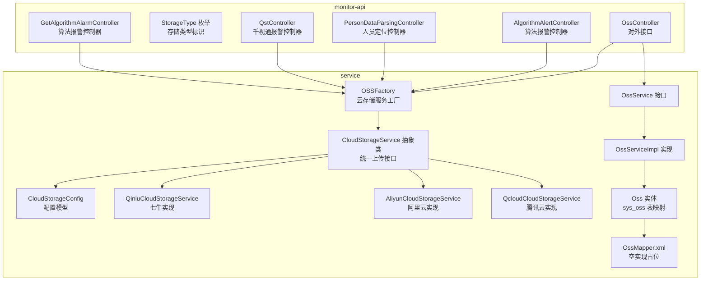
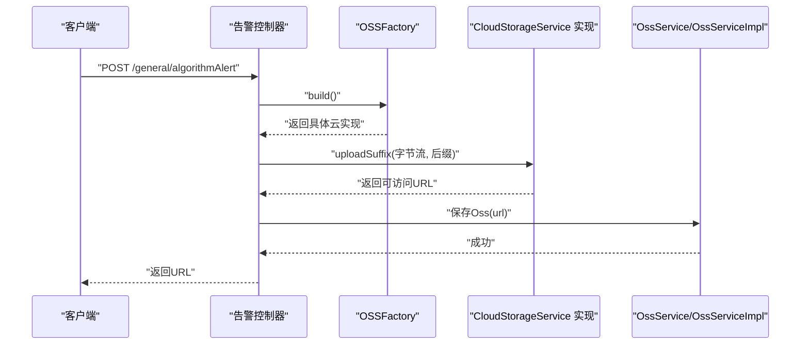
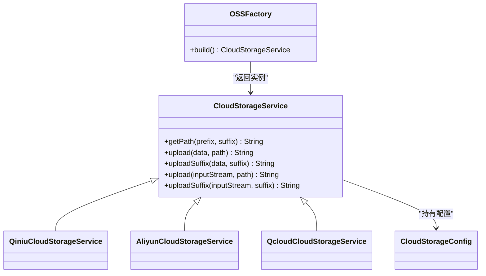
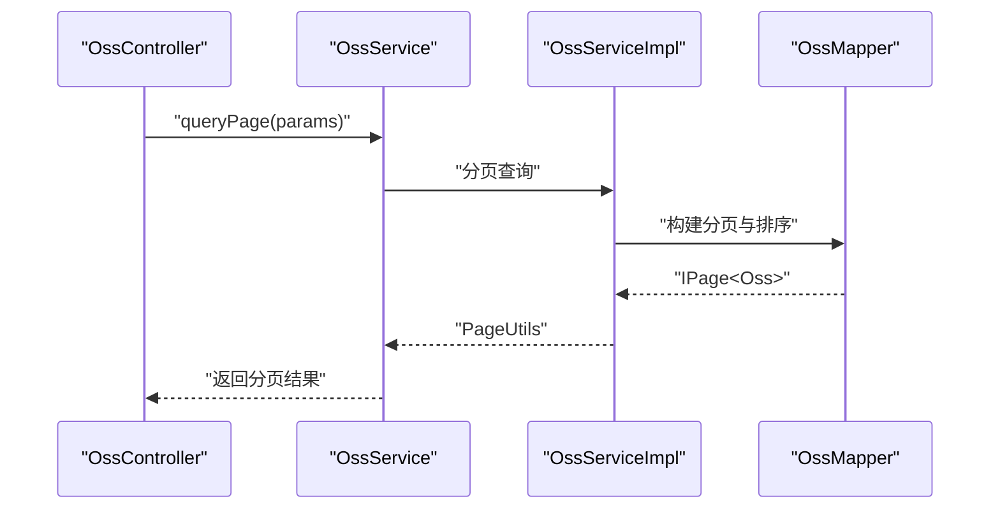
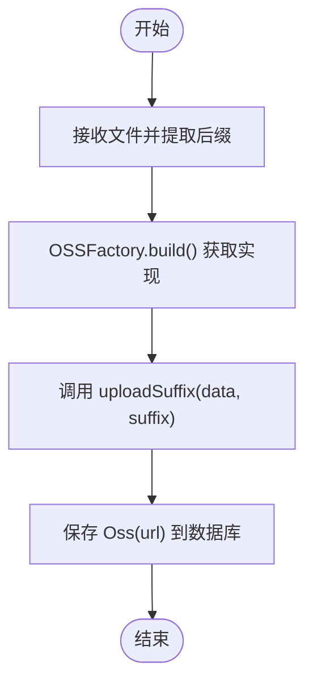
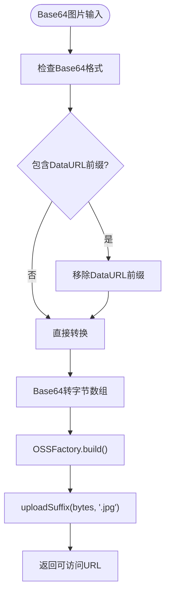
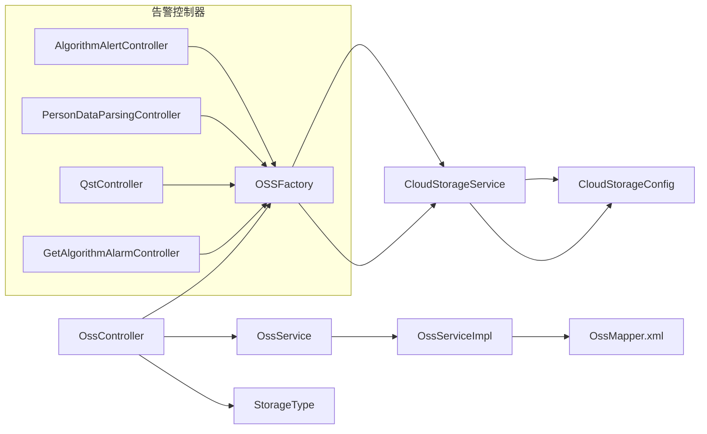

# 对象存储模块

<cite>
**本文引用的文件**
- [OssController.java](file://monkey-monitor-api/src/main/java/com/monkey/general/controller/OssController.java)
- [OSSFactory.java](file://monkey-service/src/main/java/com/monkey/general/modules/oss/cloud/OSSFactory.java)
- [CloudStorageService.java](file://monkey-service/src/main/java/com/monkey/general/modules/oss/cloud/CloudStorageService.java)
- [CloudStorageConfig.java](file://monkey-service/src/main/java/com/monkey/general/modules/oss/cloud/CloudStorageConfig.java)
- [QiniuCloudStorageService.java](file://monkey-service/src/main/java/com/monkey/general/modules/oss/cloud/QiniuCloudStorageService.java)
- [AliyunCloudStorageService.java](file://monkey-service/src/main/java/com/monkey/general/modules/oss/cloud/AliyunCloudStorageService.java)
- [QcloudCloudStorageService.java](file://monkey-service/src/main/java/com/monkey/general/modules/oss/cloud/QcloudCloudStorageService.java)
- [Oss.java](file://monkey-service/src/main/java/com/monkey/general/modules/oss/entity/Oss.java)
- [OssService.java](file://monkey-service/src/main/java/com/monkey/general/modules/oss/service/OssService.java)
- [OssServiceImpl.java](file://monkey-service/src/main/java/com/monkey/general/modules/oss/service/impl/OssServiceImpl.java)
- [OssMapper.xml](file://monkey-service/src/main/resources/mapper/oss/OssMapper.xml)
- [ConfigConstant.java](file://monkey-common/src/main/java/com/monkey/general/common/utils/ConfigConstant.java)
- [StorageType.java](file://monkey-monitor-api/src/main/java/com/monkey/general/enums/StorageType.java)
- [AliyunGroup.java](file://monkey-common/src/main/java/com/monkey/general/common/validator/group/AliyunGroup.java)
- [QiniuGroup.java](file://monkey-common/src/main/java/com/monkey/general/common/validator/group/QiniuGroup.java)
- [QcloudGroup.java](file://monkey-common/src/main/java/com/monkey/general/common/validator/group/QcloudGroup.java)
- [AlgorithmAlertController.java](file://monkey-monitor-api/src/main/java/com/monkey/general/controller/AlgorithmAlertController.java)
- [PersonDataParsingController.java](file://monkey-monitor-api/src/main/java/com/monkey/general/person/PersonDataParsingController.java)
- [QstController.java](file://monkey-monitor-api/src/main/java/com/monkey/general/qst/QstController.java)
- [GetAlgorithmAlarmController.java](file://monkey-monitor-api/src/main/java/com/monkey/general/python/GetAlgorithmAlarmController.java)
- [GetPlayBackInfo3.java](file://monkey-monitor/src/main/java/com/monkey/general/dahua/GetPlayBackInfo3.java)
</cite>

## 目录
1. [简介](#简介)
2. [项目结构](#项目结构)
3. [核心组件](#核心组件)
4. [架构总览](#架构总览)
5. [组件详解](#组件详解)
6. [依赖关系分析](#依赖关系分析)
7. [性能与成本优化](#性能与成本优化)
8. [故障排查指南](#故障排查指南)
9. [结论](#结论)
10. [附录](#附录)

## 简介
本文件系统性梳理对象存储模块的设计与实现，覆盖以下要点：
- OSS 实体的字段定义与存储策略
- 多云存储服务（阿里云、七牛云、腾讯云）的集成方案与配置校验
- 工厂模式与动态切换机制
- Service 层的完整能力（分页查询、上传、删除）
- 存储配置管理与安全策略
- 成本优化、CDN 加速、防盗链等高级特性建议与落地路径
- **新增**：告警处理中的统一图像存储策略，getOSSImageUrl方法在多个告警控制器中的共享使用

## 项目结构
对象存储模块主要分布在两个子工程中：
- 控制层与业务入口位于 monitor-api 工程，负责对外接口与配置校验
- 云存储实现与实体、Mapper、Service 位于 service 工程，负责具体上传逻辑与持久化

**图表来源**
- [OssController.java:1-132](file://monkey-monitor-api/src/main/java/com/monkey/general/controller/OssController.java#L1-L132)
- [OSSFactory.java:1-37](file://monkey-service/src/main/java/com/monkey/general/modules/oss/cloud/OSSFactory.java#L1-L37)
- [AlgorithmAlertController.java:1-68](file://monkey-monitor-api/src/main/java/com/monkey/general/controller/AlgorithmAlertController.java#L1-L68)
- [PersonDataParsingController.java:1-294](file://monkey-monitor-api/src/main/java/com/monkey/general/person/PersonDataParsingController.java#L1-L294)
- [QstController.java:1-166](file://monkey-monitor-api/src/main/java/com/monkey/general/qst/QstController.java#L1-L166)
- [GetAlgorithmAlarmController.java:1-136](file://monkey-monitor-api/src/main/java/com/monkey/general/python/GetAlgorithmAlarmController.java#L1-L136)

**章节来源**
- [OssController.java:1-132](file://monkey-monitor-api/src/main/java/com/monkey/general/controller/OssController.java#L1-L132)
- [OSSFactory.java:1-37](file://monkey-service/src/main/java/com/monkey/general/modules/oss/cloud/OSSFactory.java#L1-L37)
- [Oss.java:1-59](file://monkey-service/src/main/java/com/monkey/general/modules/oss/entity/Oss.java#L1-L59)

## 核心组件
- Oss 实体：映射 sys_oss 表，记录上传后的 URL 与元数据
- CloudStorageConfig：统一的云存储配置模型，按供应商分组校验
- CloudStorageService 抽象类：定义统一的上传接口与路径生成策略
- OSSFactory：根据配置动态选择具体云厂商实现
- 三大云厂商实现：QiniuCloudStorageService、AliyunCloudStorageService、QcloudCloudStorageService
- OssService/OssServiceImpl：提供分页查询与基础 CRUD 能力
- OssController：对外暴露上传、列表、删除、配置查看/保存接口
- **新增**：getOSSImageUrl静态方法：为多个告警控制器提供统一的图像存储策略

**章节来源**
- [Oss.java:1-59](file://monkey-service/src/main/java/com/monkey/general/modules/oss/entity/Oss.java#L1-L59)
- [CloudStorageConfig.java:1-39](file://monkey-service/src/main/java/com/monkey/general/modules/oss/cloud/CloudStorageConfig.java#L1-L39)
- [CloudStorageService.java:1-72](file://monkey-service/src/main/java/com/monkey/general/modules/oss/cloud/CloudStorageService.java#L1-L72)
- [OSSFactory.java:1-37](file://monkey-service/src/main/java/com/monkey/general/modules/oss/cloud/OSSFactory.java#L1-L37)
- [QiniuCloudStorageService.java:1-70](file://monkey-service/src/main/java/com/monkey/general/modules/oss/cloud/QiniuCloudStorageService.java#L1-L70)
- [AliyunCloudStorageService.java:1-56](file://monkey-service/src/main/java/com/monkey/general/modules/oss/cloud/AliyunCloudStorageService.java#L1-L56)
- [QcloudCloudStorageService.java:1-99](file://monkey-service/src/main/java/com/monkey/general/modules/oss/cloud/QcloudCloudStorageService.java#L1-L99)
- [OssService.java:1-19](file://monkey-service/src/main/java/com/monkey/general/modules/oss/service/OssService.java#L1-L19)
- [OssServiceImpl.java:1-30](file://monkey-service/src/main/java/com/monkey/general/modules/oss/service/impl/OssServiceImpl.java#L1-L30)
- [OssController.java:1-132](file://monkey-monitor-api/src/main/java/com/monkey/general/controller/OssController.java#L1-L132)

## 架构总览
对象存储模块采用"抽象接口 + 工厂 + 多实现"的分层设计：
- 控制层通过工厂获取当前生效的云存储实现
- 上传时根据配置生成带前缀的路径，返回可访问的 URL
- 上传结果持久化到 sys_oss 表，供后续查询与删除
- **新增**：多个告警控制器共享使用getOSSImageUrl方法，确保统一的图像存储策略和更好的系统性能

**图表来源**
- [AlgorithmAlertController.java:48-52](file://monkey-monitor-api/src/main/java/com/monkey/general/controller/AlgorithmAlertController.java#L48-L52)
- [OSSFactory.java:21-34](file://monkey-service/src/main/java/com/monkey/general/modules/oss/cloud/OSSFactory.java#L21-L34)
- [CloudStorageService.java:45-69](file://monkey-service/src/main/java/com/monkey/general/modules/oss/cloud/CloudStorageService.java#L45-L69)
- [OssServiceImpl.java:19-27](file://monkey-service/src/main/java/com/monkey/general/modules/oss/service/impl/OssServiceImpl.java#L19-L27)

## 组件详解

### Oss 实体与存储策略
- 字段说明
  - id：主键
  - url：文件访问 URL
  - dataStatus：数据状态（0-禁用、1-启用）
  - remark：备注
  - gmtCreate/gmtModified：自动填充创建与更新时间
- 存储策略
  - 采用日期前缀 + UUID 的路径组织方式，避免同名冲突
  - 支持为不同云厂商配置独立的路径前缀

**章节来源**
- [Oss.java:20-56](file://monkey-service/src/main/java/com/monkey/general/modules/oss/entity/Oss.java#L20-L56)
- [CloudStorageService.java:26-37](file://monkey-service/src/main/java/com/monkey/general/modules/oss/cloud/CloudStorageService.java#L26-L37)

### 多云存储配置与校验
- 配置模型 CloudStorageConfig
  - 类型字段 type：1=七牛、2=阿里云、3=腾讯云
  - 七牛：域名、路径前缀、AccessKey、SecretKey
  - 阿里云：域名、Endpoint、Bucket、AccessKeyId、AccessKeySecret、路径前缀
  - 腾讯云：域名、Region、SecretId、SecretKey、路径前缀
- 分组校验
  - 使用 ValidatorUtils 结合分组接口（QiniuGroup、AliyunGroup、QcloudGroup）进行条件校验
- 配置持久化
  - 通过 ConfigService 将配置序列化为 JSON 存入系统配置表

**章节来源**
- [CloudStorageConfig.java:24-39](file://monkey-service/src/main/java/com/monkey/general/modules/oss/cloud/CloudStorageConfig.java#L24-L39)
- [OssController.java:77-95](file://monkey-monitor-api/src/main/java/com/monkey/general/controller/OssController.java#L77-L95)
- [QiniuGroup.java:1-10](file://monkey-common/src/main/java/com/monkey/general/common/validator/group/QiniuGroup.java#L1-L10)
- [AliyunGroup.java:1-10](file://monkey-common/src/main/java/com/monkey/general/common/validator/group/AliyunGroup.java#L1-L10)
- [QcloudGroup.java:1-11](file://monkey-common/src/main/java/com/monkey/general/common/validator/group/QcloudGroup.java#L1-L11)
- [ConfigConstant.java:10-12](file://monkey-common/src/main/java/com/monkey/general/common/utils/ConfigConstant.java#L10-L12)

### 工厂模式与动态切换
- OSSFactory 根据系统配置动态返回对应云厂商实现
- 切换逻辑基于 type 字段，直接构造具体实现类
- 优点：扩展新云厂商只需新增实现类与工厂分支

**图表来源**
- [CloudStorageService.java:16-71](file://monkey-service/src/main/java/com/monkey/general/modules/oss/cloud/CloudStorageService.java#L16-L71)
- [OSSFactory.java:21-34](file://monkey-service/src/main/java/com/monkey/general/modules/oss/cloud/OSSFactory.java#L21-L34)
- [QiniuCloudStorageService.java:19-68](file://monkey-service/src/main/java/com/monkey/general/modules/oss/cloud/QiniuCloudStorageService.java#L19-L68)
- [AliyunCloudStorageService.java:16-55](file://monkey-service/src/main/java/com/monkey/general/modules/oss/cloud/AliyunCloudStorageService.java#L16-L55)
- [QcloudCloudStorageService.java:24-97](file://monkey-service/src/main/java/com/monkey/general/modules/oss/cloud/QcloudCloudStorageService.java#L24-L97)

**章节来源**
- [OSSFactory.java:14-37](file://monkey-service/src/main/java/com/monkey/general/modules/oss/cloud/OSSFactory.java#L14-L37)

### Service 层实现
- OssService/OssServiceImpl 提供分页查询能力，按 id 倒序
- 控制层在上传后将 URL 写入 sys_oss 表，便于后续管理与删除

**图表来源**
- [OssController.java:51-57](file://monkey-monitor-api/src/main/java/com/monkey/general/controller/OssController.java#L51-L57)
- [OssServiceImpl.java:20-27](file://monkey-service/src/main/java/com/monkey/general/modules/oss/service/impl/OssServiceImpl.java#L20-L27)
- [OssService.java:17](file://monkey-service/src/main/java/com/monkey/general/modules/oss/service/OssService.java#L17)

**章节来源**
- [OssService.java:15-18](file://monkey-service/src/main/java/com/monkey/general/modules/oss/service/OssService.java#L15-L18)
- [OssServiceImpl.java:17-29](file://monkey-service/src/main/java/com/monkey/general/modules/oss/service/impl/OssServiceImpl.java#L17-L29)

### 上传流程与路径生成
- 控制层接收文件，提取后缀，调用工厂构建的实现进行上传
- 上传实现会根据配置生成带前缀的路径，并返回可访问 URL
- 上传完成后写入数据库

**图表来源**
- [OssController.java:103-117](file://monkey-monitor-api/src/main/java/com/monkey/general/controller/OssController.java#L103-L117)
- [OSSFactory.java:21-34](file://monkey-service/src/main/java/com/monkey/general/modules/oss/cloud/OSSFactory.java#L21-L34)
- [CloudStorageService.java:26-37](file://monkey-service/src/main/java/com/monkey/general/modules/oss/cloud/CloudStorageService.java#L26-L37)

**章节来源**
- [OssController.java:101-118](file://monkey-monitor-api/src/main/java/com/monkey/general/controller/OssController.java#L101-L118)

### 删除与列表
- 列表：按 id 倒序分页展示历史上传记录
- 删除：批量删除数据库记录（不涉及云存储资源清理）

**章节来源**
- [OssController.java:51-57](file://monkey-monitor-api/src/main/java/com/monkey/general/controller/OssController.java#L51-L57)
- [OssController.java:126-130](file://monkey-monitor-api/src/main/java/com/monkey/general/controller/OssController.java#L126-L130)
- [OssServiceImpl.java:20-27](file://monkey-service/src/main/java/com/monkey/general/modules/oss/service/impl/OssServiceImpl.java#L20-L27)

### 配置管理与安全策略
- 配置管理
  - 通过 /sys/oss/config 读取当前生效配置
  - 通过 /sys/oss/saveConfig 保存配置，按供应商分组校验
- 安全策略
  - 仅在控制层进行参数校验，云厂商密钥不回传前端
  - 上传 URL 由各云厂商返回，结合各自域名与路径前缀生成

**章节来源**
- [OssController.java:65-95](file://monkey-monitor-api/src/main/java/com/monkey/general/controller/OssController.java#L65-L95)
- [ConfigConstant.java:10-12](file://monkey-common/src/main/java/com/monkey/general/common/utils/ConfigConstant.java#L10-L12)

### 存储类型枚举与扩展
- StorageType 枚举用于标识"云端/本地"存储类型，便于系统其他模块识别数据来源
- 该枚举与对象存储模块解耦，可在业务侧按需使用

**章节来源**
- [StorageType.java:7-17](file://monkey-monitor-api/src/main/java/com/monkey/general/enums/StorageType.java#L7-L17)

### **新增**：告警处理中的统一图像存储策略

#### getOSSImageUrl静态方法
多个告警控制器共享使用getOSSImageUrl方法，确保统一的图像存储策略和更好的系统性能：

- **AlgorithmAlertController**：处理算法报警图片上传
- **PersonDataParsingController**：处理自研人员定位报警图片
- **QstController**：处理千视通AI盒子报警图片
- **GetAlgorithmAlarmController**：处理算法报警图片

该方法的核心功能：
1. 接收Base64格式的图片数据
2. 处理DataURL前缀（如果存在）
3. 转换Base64为字节数组
4. 使用OSSFactory获取云存储实现
5. 上传图片并返回可访问URL

**图表来源**
- [AlgorithmAlertController.java:48-52](file://monkey-monitor-api/src/main/java/com/monkey/general/controller/AlgorithmAlertController.java#L48-L52)
- [PersonDataParsingController.java:267-275](file://monkey-monitor-api/src/main/java/com/monkey/general/person/PersonDataParsingController.java#L267-L275)
- [QstController.java:152-164](file://monkey-monitor-api/src/main/java/com/monkey/general/qst/QstController.java#L152-L164)
- [GetAlgorithmAlarmController.java:127-135](file://monkey-monitor-api/src/main/java/com/monkey/general/python/GetAlgorithmAlarmController.java#L127-L135)

**章节来源**
- [AlgorithmAlertController.java:48-52](file://monkey-monitor-api/src/main/java/com/monkey/general/controller/AlgorithmAlertController.java#L48-L52)
- [PersonDataParsingController.java:267-275](file://monkey-monitor-api/src/main/java/com/monkey/general/person/PersonDataParsingController.java#L267-L275)
- [QstController.java:152-164](file://monkey-monitor-api/src/main/java/com/monkey/general/qst/QstController.java#L152-L164)
- [GetAlgorithmAlarmController.java:127-135](file://monkey-monitor-api/src/main/java/com/monkey/general/python/GetAlgorithmAlarmController.java#L127-L135)

## 依赖关系分析
- 控制层依赖工厂与配置服务，间接依赖具体云实现
- 云实现依赖配置模型，遵循统一抽象接口
- Service 层依赖 Mapper 进行持久化，当前 XML 为空实现占位
- **新增**：多个告警控制器共享依赖getOSSImageUrl方法，形成统一的图像处理管道

**图表来源**
- [OssController.java:39-42](file://monkey-monitor-api/src/main/java/com/monkey/general/controller/OssController.java#L39-L42)
- [OSSFactory.java:15-19](file://monkey-service/src/main/java/com/monkey/general/modules/oss/cloud/OSSFactory.java#L15-L19)
- [CloudStorageService.java:16-18](file://monkey-service/src/main/java/com/monkey/general/modules/oss/cloud/CloudStorageService.java#L16-L18)
- [OssServiceImpl.java:17](file://monkey-service/src/main/java/com/monkey/general/modules/oss/service/impl/OssServiceImpl.java#L17)
- [OssMapper.xml:4](file://monkey-service/src/main/resources/mapper/oss/OssMapper.xml#L4)
- [StorageType.java:12](file://monkey-monitor-api/src/main/java/com/monkey/general/enums/StorageType.java#L12)

**章节来源**
- [OSSFactory.java:14-37](file://monkey-service/src/main/java/com/monkey/general/modules/oss/cloud/OSSFactory.java#L14-L37)
- [OssServiceImpl.java:17-29](file://monkey-service/src/main/java/com/monkey/general/modules/oss/service/impl/OssServiceImpl.java#L17-L29)

## 性能与成本优化
- 路径组织
  - 使用日期前缀 + UUID 的命名策略，有利于 CDN 缓存与分片回源优化
- 上传策略
  - 优先使用字节流直传，减少中间拷贝；如需兼容可选 InputStream 重载
- 成本优化建议
  - 选择就近地域的 Bucket/存储桶，降低网络时延与费用
  - 合理设置生命周期规则，自动归档/删除过期文件
- CDN 加速
  - 通过各云厂商提供的域名与 CNAME 配置，结合路径前缀实现静态资源加速
- 防盗链
  - 通过签名 URL 或 Referer 白名单策略限制访问来源（在各云厂商控制台配置）
- **新增**：统一图像存储策略的优势
  - 减少重复代码，提高开发效率
  - 确保不同告警来源的图像存储策略一致性
  - 便于统一监控和优化存储性能

## 故障排查指南
- 上传失败
  - 检查配置项是否满足分组校验要求（type 与对应云厂商的必填项）
  - 查看云厂商返回的错误信息，确认域名、密钥、Bucket、Region 等参数
- URL 不可用
  - 确认域名与路径前缀拼接正确，且 Bucket 公网访问权限已开启
- 删除无效
  - 当前删除接口仅删除数据库记录，未同步删除云存储资源；如需彻底清理，需在业务侧补充云资源删除逻辑
- **新增**：告警图像上传问题排查
  - 检查Base64格式是否正确，确保包含正确的文件头信息
  - 验证getOSSImageUrl方法的调用参数，确认图片数据不为空
  - 确认OSSFactory配置正确，云存储服务正常运行

**章节来源**
- [OssController.java:77-95](file://monkey-monitor-api/src/main/java/com/monkey/general/controller/OssController.java#L77-L95)
- [QiniuCloudStorageService.java:36-47](file://monkey-service/src/main/java/com/monkey/general/modules/oss/cloud/QiniuCloudStorageService.java#L36-L47)
- [AliyunCloudStorageService.java:36-44](file://monkey-service/src/main/java/com/monkey/general/modules/oss/cloud/AliyunCloudStorageService.java#L36-L44)
- [QcloudCloudStorageService.java:52-76](file://monkey-service/src/main/java/com/monkey/general/modules/oss/cloud/QcloudCloudStorageService.java#L52-L76)

## 结论
对象存储模块以清晰的抽象与工厂模式实现了多云厂商的统一接入，具备良好的扩展性与可维护性。通过配置化与分组校验确保了部署的安全性，结合路径组织策略与 CDN 加速可有效提升性能与降低成本。**新增的告警处理统一图像存储策略**进一步增强了系统的整体性和性能表现，多个告警控制器共享使用getOSSImageUrl方法，确保了图像存储策略的一致性和更好的系统性能。建议在生产环境中完善云资源的生命周期管理与防盗链策略，并在需要时扩展删除接口以支持云资源同步清理。

## 附录
- 关键接口与职责
  - OssController：对外接口入口，负责上传、列表、删除、配置读写
  - OSSFactory：云存储实现工厂，依据配置动态选择具体实现
  - CloudStorageService：抽象上传接口与路径生成
  - OssService/OssServiceImpl：分页查询与基础 CRUD
  - Oss 实体：记录上传后的 URL 与元数据
  - **新增**：getOSSImageUrl静态方法：为多个告警控制器提供统一的图像存储策略
  - **新增**：AlgorithmAlertController：算法报警控制器，处理算法报警图片上传
  - **新增**：PersonDataParsingController：人员定位控制器，处理自研人员定位报警图片
  - **新增**：QstController：千视通报警控制器，处理千视通AI盒子报警图片
  - **新增**：GetAlgorithmAlarmController：算法报警控制器，处理算法报警图片

**章节来源**
- [OssController.java:39-42](file://monkey-monitor-api/src/main/java/com/monkey/general/controller/OssController.java#L39-L42)
- [OSSFactory.java:21-34](file://monkey-service/src/main/java/com/monkey/general/modules/oss/cloud/OSSFactory.java#L21-L34)
- [CloudStorageService.java:45-69](file://monkey-service/src/main/java/com/monkey/general/modules/oss/cloud/CloudStorageService.java#L45-L69)
- [OssService.java:15-18](file://monkey-service/src/main/java/com/monkey/general/modules/oss/service/OssService.java#L15-L18)
- [OssServiceImpl.java:19-27](file://monkey-service/src/main/java/com/monkey/general/modules/oss/service/impl/OssServiceImpl.java#L19-L27)
- [Oss.java:20-56](file://monkey-service/src/main/java/com/monkey/general/modules/oss/entity/Oss.java#L20-L56)
- [AlgorithmAlertController.java:48-52](file://monkey-monitor-api/src/main/java/com/monkey/general/controller/AlgorithmAlertController.java#L48-L52)
- [PersonDataParsingController.java:267-275](file://monkey-monitor-api/src/main/java/com/monkey/general/person/PersonDataParsingController.java#L267-L275)
- [QstController.java:152-164](file://monkey-monitor-api/src/main/java/com/monkey/general/qst/QstController.java#L152-L164)
- [GetAlgorithmAlarmController.java:127-135](file://monkey-monitor-api/src/main/java/com/monkey/general/python/GetAlgorithmAlarmController.java#L127-L135)