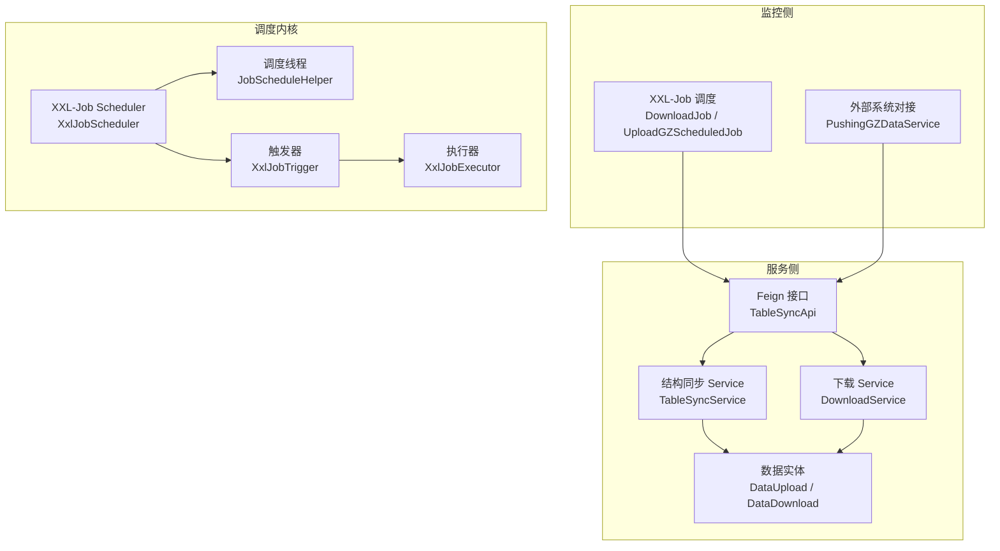
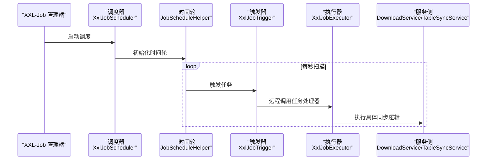
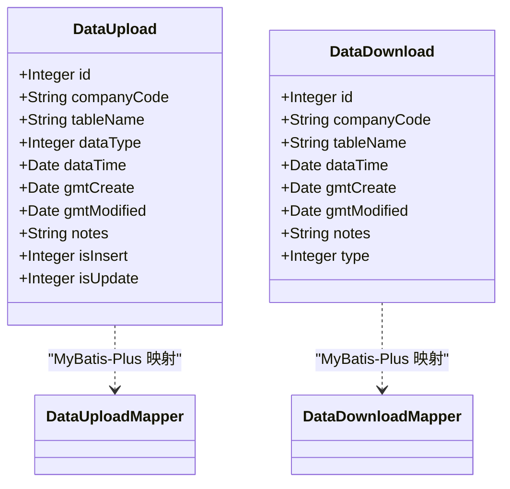
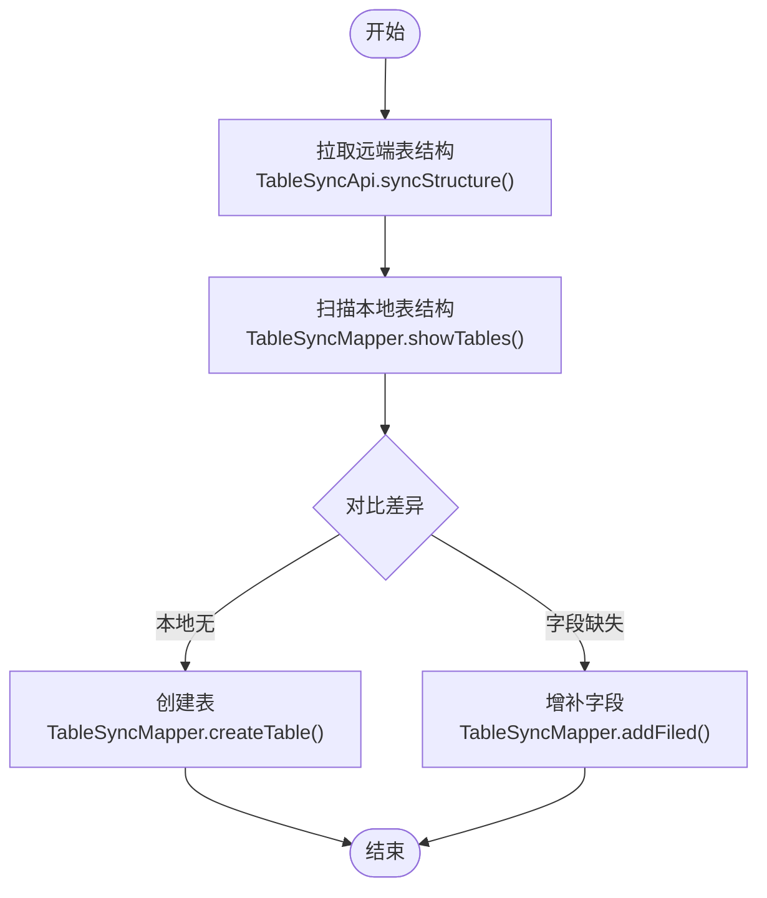
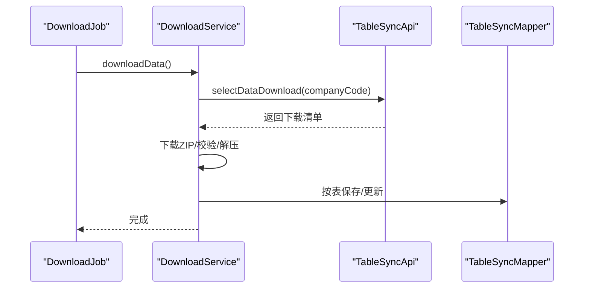
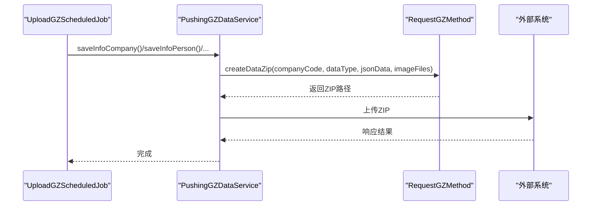
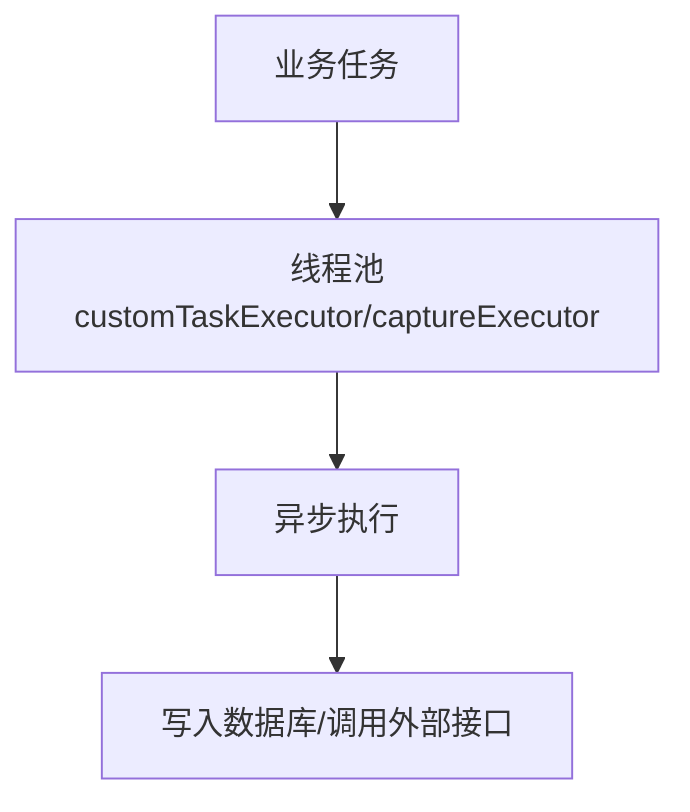
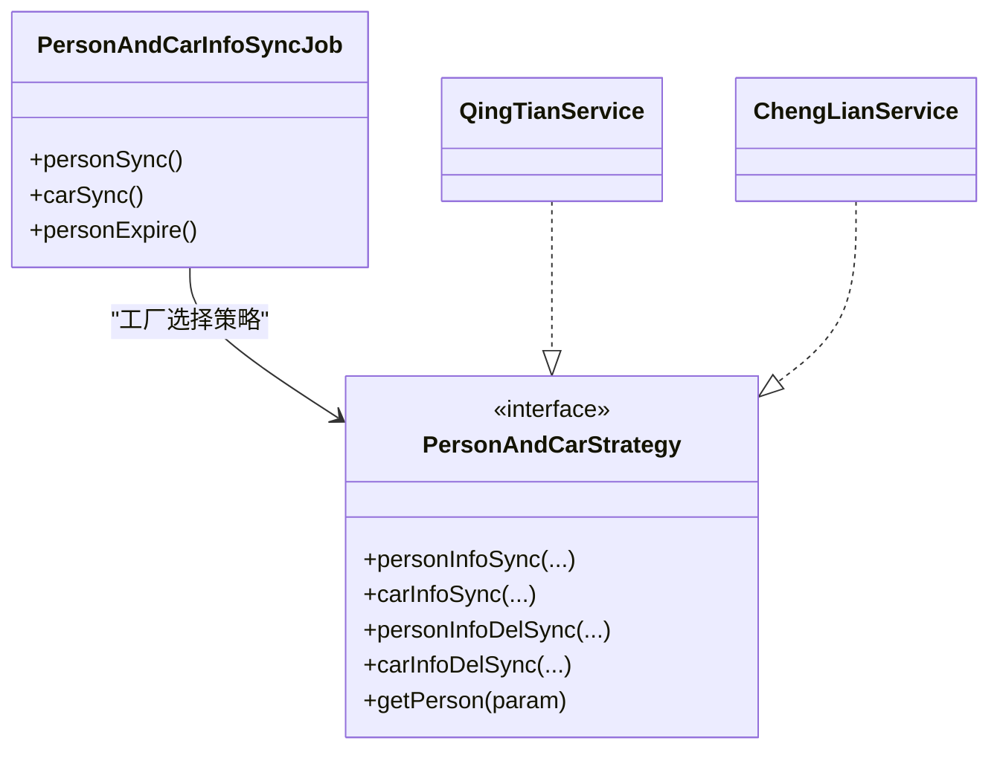
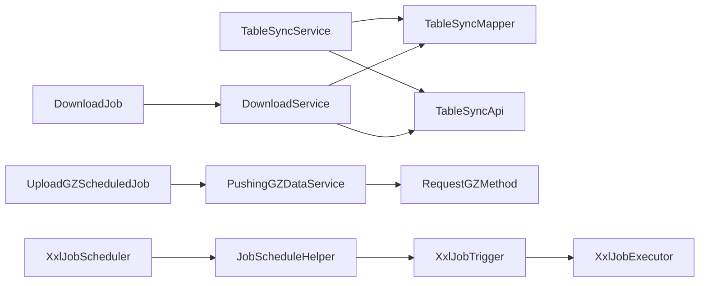

# 数据同步模块

<cite>
**本文引用的文件**
- [DataUpload.java](file://monkey-service/src/main/java/com/monkey/general/modules/data/entity/DataUpload.java)
- [DataDownload.java](file://monkey-service/src/main/java/com/monkey/general/modules/data/entity/DataDownload.java)
- [DataUploadService.java](file://monkey-service/src/main/java/com/monkey/general/modules/data/service/DataUploadService.java)
- [DataUploadServiceImpl.java](file://monkey-service/src/main/java/com/monkey/general/modules/data/service/impl/DataUploadServiceImpl.java)
- [DataDownloadService.java](file://monkey-service/src/main/java/com/monkey/general/modules/data/service/DataDownloadService.java)
- [DataDownloadServiceImpl.java](file://monkey-service/src/main/java/com/monkey/general/modules/data/service/impl/DataDownloadServiceImpl.java)
- [DataUploadMapper.java](file://monkey-service/src/main/java/com/monkey/general/modules/data/mapper/DataUploadMapper.java)
- [DataDownloadMapper.java](file://monkey-service/src/main/java/com/monkey/general/modules/data/mapper/DataDownloadMapper.java)
- [DataUploadMapper.xml](file://monkey-service/src/main/resources/mapper/data/DataUploadMapper.xml)
- [DataDownloadMapper.xml](file://monkey-service/src/main/resources/mapper/data/DataDownloadMapper.xml)
- [TableSyncDto.java](file://monkey-service/src/main/java/com/monkey/general/modules/open/dto/TableSyncDto.java)
- [TableSyncMapper.java](file://monkey-service/src/main/java/com/monkey/general/modules/open/mapper/TableSyncMapper.java)
- [TableSyncService.java](file://monkey-service/src/main/java/com/monkey/general/modules/open/service/TableSyncService.java)
- [TableSyncApi.java](file://monkey-service/src/main/java/com/monkey/general/api/TableSyncApi.java)
- [TableSyncConfiguration.java](file://monkey-monitor/src/main/java/com/monkey/general/config/TableSyncConfiguration.java)
- [DownloadService.java](file://monkey-service/src/main/java/com/monkey/general/modules/data/service/impl/DownloadService.java)
- [DownloadJob.java](file://monkey-monitor-api/src/main/java/com/monkey/general/job/DownloadJob.java)
- [AsyncConfig.java](file://monkey-common/src/main/java/com/monkey/general/common/config/AsyncConfig.java)
- [AsyncConfig2.java](file://monkey-common/src/main/java/com/monkey/general/common/config/AsyncConfig2.java)
- [XxlJobConfig.java](file://monkey-monitor-api/src/main/java/com/monkey/general/config/XxlJobConfig.java)
- [XxlJobScheduler.java](file://xxl-job-admin/src/main/java/com/xxl/job/admin/core/scheduler/XxlJobScheduler.java)
- [JobScheduleHelper.java](file://xxl-job-admin/src/main/java/com/xxl/job/admin/core/thread/JobScheduleHelper.java)
- [XxlJobTrigger.java](file://xxl-job-admin/src/main/java/com/xxl/job/admin/core/trigger/XxlJobTrigger.java)
- [XxlJobExecutor.java](file://xxl-job-core/src/main/java/com/xxl/job/core/executor/XxlJobExecutor.java)
- [PersonAndCarInfoSyncJob.java](file://monkey-monitor-api/src/main/java/com/monkey/general/job/PersonAndCarInfoSyncJob.java)
- [PersonAndCarStrategy.java](file://monkey-monitor/src/main/java/com/monkey/general/modules/third/service/PersonAndCarStrategy.java)
- [QingTianService.java](file://monkey-monitor/src/main/java/com/monkey/general/modules/third/service/QingTianService.java)
- [ChengLianService.java](file://monkey-monitor/src/main/java/com/monkey/general/modules/third/service/ChengLianService.java)
- [PushingGZDataService.java](file://monkey-monitor/src/main/java/com/monkey/general/platform/push/gz/PushingGZDataService.java)
- [UploadGZScheduledJob.java](file://monkey-monitor-api/src/main/java/com/monkey/general/job/gz/UploadGZScheduledJob.java)
- [RequestGZMethod.java](file://monkey-monitor/src/main/java/com/monkey/general/util/gz/util/RequestGZMethod.java)
</cite>

## 目录
1. [简介](#简介)
2. [项目结构](#项目结构)
3. [核心组件](#核心组件)
4. [架构总览](#架构总览)
5. [详细组件分析](#详细组件分析)
6. [依赖分析](#依赖分析)
7. [性能考虑](#性能考虑)
8. [故障排查指南](#故障排查指南)
9. [结论](#结论)
10. [附录](#附录)

## 简介
本文件系统化梳理“数据同步模块”的设计与实现，覆盖以下关键主题：
- 实体设计：DataUpload（上传记录）、DataDownload（下载记录）等
- 业务流程：结构同步、数据下载、数据上传、格式转换、校验与落库
- 调度机制与异步处理：XXL-Job 调度、线程池异步执行
- Service 层实现：数据传输、格式转换、错误处理
- 外部系统接口与协议：Feign 接口、HTTP 协议、压缩打包
- 性能优化与可靠性：断点续传思路、幂等与一致性保障

## 项目结构
数据同步模块横跨多个子工程：
- 公共配置与通用能力：monkey-common（异步线程池配置）
- 服务侧（数据落库与结构同步）：monkey-service（实体、Mapper、Service、Feign 接口）
- 监控侧（调度与触发）：monkey-monitor-api（XXL-Job 任务）、monkey-monitor（外部系统对接与策略）
- 调度中心与执行器：xxl-job-admin、xxl-job-core

图表来源
- [DownloadJob.java:18-31](file://monkey-monitor-api/src/main/java/com/monkey/general/job/DownloadJob.java#L18-L31)
- [UploadGZScheduledJob.java:11-64](file://monkey-monitor-api/src/main/java/com/monkey/general/job/gz/UploadGZScheduledJob.java#L11-L64)
- [TableSyncApi.java:16-27](file://monkey-service/src/main/java/com/monkey/general/api/TableSyncApi.java#L16-L27)
- [TableSyncService.java:29-121](file://monkey-service/src/main/java/com/monkey/general/modules/open/service/TableSyncService.java#L29-L121)
- [DownloadService.java:77-105](file://monkey-service/src/main/java/com/monkey/general/modules/data/service/impl/DownloadService.java#L77-L105)
- [XxlJobScheduler.java:19-44](file://xxl-job-admin/src/main/java/com/xxl/job/admin/core/scheduler/XxlJobScheduler.java#L19-L44)
- [JobScheduleHelper.java:22-283](file://xxl-job-admin/src/main/java/com/xxl/job/admin/core/thread/JobScheduleHelper.java#L22-L283)
- [XxlJobTrigger.java:44-72](file://xxl-job-admin/src/main/java/com/xxl/job/admin/core/trigger/XxlJobTrigger.java#L44-L72)
- [XxlJobExecutor.java:28-41](file://xxl-job-core/src/main/java/com/xxl/job/core/executor/XxlJobExecutor.java#L28-L41)

章节来源
- [AsyncConfig.java:14-27](file://monkey-common/src/main/java/com/monkey/general/common/config/AsyncConfig.java#L14-L27)
- [AsyncConfig2.java:11-27](file://monkey-common/src/main/java/com/monkey/general/common/config/AsyncConfig2.java#L11-L27)
- [XxlJobConfig.java:47-77](file://monkey-monitor-api/src/main/java/com/monkey/general/config/XxlJobConfig.java#L47-L77)

## 核心组件
- 数据实体
  - DataUpload：记录上传数据的企业编码、表名、数据类型、时间戳、创建/更新时间、是否插入/更新等字段
  - DataDownload：记录下载数据的企业编码、表名、数据类型、时间戳、创建/更新时间等字段
- Service 层
  - TableSyncService：负责表结构同步与远程数据下载入口
  - DownloadService：负责下载 ZIP 包、解压、解析、按表落库
  - DataUploadService/DataUploadServiceImpl：上传记录分页查询
  - DataDownloadService/DataDownloadServiceImpl：下载记录分页查询
- 接口与配置
  - TableSyncApi：通过 Feign 调用远端同步接口
  - TableSyncConfiguration：应用启动后拉取远端结构并初始化本地表
  - XXL-Job 配置：监控侧任务调度与执行器参数

章节来源
- [DataUpload.java:19-83](file://monkey-service/src/main/java/com/monkey/general/modules/data/entity/DataUpload.java#L19-L83)
- [DataDownload.java:19-71](file://monkey-service/src/main/java/com/monkey/general/modules/data/entity/DataDownload.java#L19-L71)
- [DataUploadService.java:14-17](file://monkey-service/src/main/java/com/monkey/general/modules/data/service/DataUploadService.java#L14-L17)
- [DataUploadServiceImpl.java:20-31](file://monkey-service/src/main/java/com/monkey/general/modules/data/service/impl/DataUploadServiceImpl.java#L20-L31)
- [DataDownloadService.java:14-18](file://monkey-service/src/main/java/com/monkey/general/modules/data/service/DataDownloadService.java#L14-L18)
- [DataDownloadServiceImpl.java:20-31](file://monkey-service/src/main/java/com/monkey/general/modules/data/service/impl/DataDownloadServiceImpl.java#L20-L31)
- [TableSyncService.java:29-121](file://monkey-service/src/main/java/com/monkey/general/modules/open/service/TableSyncService.java#L29-L121)
- [DownloadService.java:77-105](file://monkey-service/src/main/java/com/monkey/general/modules/data/service/impl/DownloadService.java#L77-L105)
- [TableSyncApi.java:16-27](file://monkey-service/src/main/java/com/monkey/general/api/TableSyncApi.java#L16-L27)
- [TableSyncConfiguration.java:24-40](file://monkey-monitor/src/main/java/com/monkey/general/config/TableSyncConfiguration.java#L24-L40)

## 架构总览
数据同步模块采用“监控侧调度 + 服务侧处理 + 外部系统交互”的三层架构：
- 监控侧：通过 XXL-Job 触发定时任务（如 DownloadJob、UploadGZScheduledJob），调用服务侧接口或外部系统方法
- 服务侧：提供 Feign 接口与结构同步、下载落库能力；使用线程池异步处理提升吞吐
- 调度内核：XXL-Job 管理调度周期、时间轮、失败重试与日志上报

图表来源
- [XxlJobScheduler.java:23-44](file://xxl-job-admin/src/main/java/com/xxl/job/admin/core/scheduler/XxlJobScheduler.java#L23-L44)
- [JobScheduleHelper.java:38-283](file://xxl-job-admin/src/main/java/com/xxl/job/admin/core/thread/JobScheduleHelper.java#L38-L283)
- [XxlJobTrigger.java:44-72](file://xxl-job-admin/src/main/java/com/xxl/job/admin/core/trigger/XxlJobTrigger.java#L44-L72)
- [XxlJobExecutor.java:28-41](file://xxl-job-core/src/main/java/com/xxl/job/core/executor/XxlJobExecutor.java#L28-L41)

## 详细组件分析

### 实体与映射
- DataUpload：用于记录上传侧的元数据与状态标记
- DataDownload：用于记录下载侧的元数据与类型标识
- Mapper XML：当前仅声明命名空间，实际 CRUD 由 MyBatis-Plus 实现

图表来源
- [DataUpload.java:19-83](file://monkey-service/src/main/java/com/monkey/general/modules/data/entity/DataUpload.java#L19-L83)
- [DataDownload.java:19-71](file://monkey-service/src/main/java/com/monkey/general/modules/data/entity/DataDownload.java#L19-L71)
- [DataUploadMapper.java:12-15](file://monkey-service/src/main/java/com/monkey/general/modules/data/mapper/DataUploadMapper.java#L12-L15)
- [DataDownloadMapper.java:12-15](file://monkey-service/src/main/java/com/monkey/general/modules/data/mapper/DataDownloadMapper.java#L12-L15)
- [DataUploadMapper.xml:1-6](file://monkey-service/src/main/resources/mapper/data/DataUploadMapper.xml#L1-L6)
- [DataDownloadMapper.xml:1-6](file://monkey-service/src/main/resources/mapper/data/DataDownloadMapper.xml#L1-L6)

章节来源
- [DataUploadMapper.java:12-15](file://monkey-service/src/main/java/com/monkey/general/modules/data/mapper/DataUploadMapper.java#L12-L15)
- [DataDownloadMapper.java:12-15](file://monkey-service/src/main/java/com/monkey/general/modules/data/mapper/DataDownloadMapper.java#L12-L15)
- [DataUploadMapper.xml:1-6](file://monkey-service/src/main/resources/mapper/data/DataUploadMapper.xml#L1-L6)
- [DataDownloadMapper.xml:1-6](file://monkey-service/src/main/resources/mapper/data/DataDownloadMapper.xml#L1-L6)

### 结构同步与表结构 DTO
- TableSyncDto：封装表名、字段描述 Map、建表语句
- TableSyncMapper：提供 SHOW TABLES、SHOW CREATE TABLE、SHOW FULL COLUMNS、动态建表与增字段等能力
- TableSyncService：对比远端与本地表结构，缺失则创建，字段差异则增量添加

图表来源
- [TableSyncApi.java:19-21](file://monkey-service/src/main/java/com/monkey/general/api/TableSyncApi.java#L19-L21)
- [TableSyncService.java:35-95](file://monkey-service/src/main/java/com/monkey/general/modules/open/service/TableSyncService.java#L35-L95)
- [TableSyncMapper.java:23-42](file://monkey-service/src/main/java/com/monkey/general/modules/open/mapper/TableSyncMapper.java#L23-L42)

章节来源
- [TableSyncDto.java:12-21](file://monkey-service/src/main/java/com/monkey/general/modules/open/dto/TableSyncDto.java#L12-L21)
- [TableSyncMapper.java:20-61](file://monkey-service/src/main/java/com/monkey/general/modules/open/mapper/TableSyncMapper.java#L20-L61)
- [TableSyncService.java:29-121](file://monkey-service/src/main/java/com/monkey/general/modules/open/service/TableSyncService.java#L29-L121)

### 数据下载与落库
- DownloadJob：定时触发下载任务
- DownloadService：下载 ZIP、校验、解压、按表解析、落库
- DataDownload：记录下载元数据与类型

图表来源
- [DownloadJob.java:23-30](file://monkey-monitor-api/src/main/java/com/monkey/general/job/DownloadJob.java#L23-L30)
- [DownloadService.java:77-105](file://monkey-service/src/main/java/com/monkey/general/modules/data/service/impl/DownloadService.java#L77-L105)
- [TableSyncApi.java:22-23](file://monkey-service/src/main/java/com/monkey/general/api/TableSyncApi.java#L22-L23)
- [TableSyncMapper.java:44-61](file://monkey-service/src/main/java/com/monkey/general/modules/open/mapper/TableSyncMapper.java#L44-L61)

章节来源
- [DownloadJob.java:18-42](file://monkey-monitor-api/src/main/java/com/monkey/general/job/DownloadJob.java#L18-L42)
- [DownloadService.java:77-105](file://monkey-service/src/main/java/com/monkey/general/modules/data/service/impl/DownloadService.java#L77-L105)
- [DataDownload.java:19-71](file://monkey-service/src/main/java/com/monkey/general/modules/data/entity/DataDownload.java#L19-L71)

### 上传与外部系统对接
- PushingGZDataService：对接贵州平台，按企业编码组织数据并打包上传
- UploadGZScheduledJob：定时触发上传任务
- RequestGZMethod：生成 ZIP 文件（JSON + 图片），按约定命名

图表来源
- [UploadGZScheduledJob.java:16-63](file://monkey-monitor-api/src/main/java/com/monkey/general/job/gz/UploadGZScheduledJob.java#L16-L63)
- [PushingGZDataService.java:30-74](file://monkey-monitor/src/main/java/com/monkey/general/platform/push/gz/PushingGZDataService.java#L30-L74)
- [RequestGZMethod.java:404-417](file://monkey-monitor/src/main/java/com/monkey/general/util/gz/util/RequestGZMethod.java#L404-L417)

章节来源
- [PushingGZDataService.java:30-74](file://monkey-monitor/src/main/java/com/monkey/general/platform/push/gz/PushingGZDataService.java#L30-L74)
- [UploadGZScheduledJob.java:11-64](file://monkey-monitor-api/src/main/java/com/monkey/general/job/gz/UploadGZScheduledJob.java#L11-L64)
- [RequestGZMethod.java:392-417](file://monkey-monitor/src/main/java/com/monkey/general/util/gz/util/RequestGZMethod.java#L392-L417)

### 异步处理与线程池
- AsyncConfig/AsyncConfig2：定义自定义线程池，分别用于告警异步与抓拍异步
- XXL-Job 执行器：XxlJobExecutor 管理与 Admin 的通信、日志清理、回调线程等

图表来源
- [AsyncConfig.java:17-26](file://monkey-common/src/main/java/com/monkey/general/common/config/AsyncConfig.java#L17-L26)
- [AsyncConfig2.java:15-26](file://monkey-common/src/main/java/com/monkey/general/common/config/AsyncConfig2.java#L15-L26)
- [XxlJobExecutor.java:28-41](file://xxl-job-core/src/main/java/com/xxl/job/core/executor/XxlJobExecutor.java#L28-L41)

章节来源
- [AsyncConfig.java:14-27](file://monkey-common/src/main/java/com/monkey/general/common/config/AsyncConfig.java#L14-L27)
- [AsyncConfig2.java:11-27](file://monkey-common/src/main/java/com/monkey/general/common/config/AsyncConfig2.java#L11-L27)
- [XxlJobExecutor.java:28-41](file://xxl-job-core/src/main/java/com/xxl/job/core/executor/XxlJobExecutor.java#L28-L41)

### 人员/车辆同步策略（扩展示例）
- PersonAndCarInfoSyncJob：基于厂商枚举选择策略
- PersonAndCarStrategy：统一抽象
- QingTianService/ChengLianService：不同厂商的具体实现（新增/删除同步、接口调用、状态回写）

图表来源
- [PersonAndCarInfoSyncJob.java:110-248](file://monkey-monitor-api/src/main/java/com/monkey/general/job/PersonAndCarInfoSyncJob.java#L110-L248)
- [PersonAndCarStrategy.java:16-29](file://monkey-monitor/src/main/java/com/monkey/general/modules/third/service/PersonAndCarStrategy.java#L16-L29)
- [QingTianService.java:248-384](file://monkey-monitor/src/main/java/com/monkey/general/modules/third/service/QingTianService.java#L248-L384)
- [ChengLianService.java:152-194](file://monkey-monitor/src/main/java/com/monkey/general/modules/third/service/ChengLianService.java#L152-L194)

章节来源
- [PersonAndCarInfoSyncJob.java:110-248](file://monkey-monitor-api/src/main/java/com/monkey/general/job/PersonAndCarInfoSyncJob.java#L110-L248)
- [PersonAndCarStrategy.java:16-29](file://monkey-monitor/src/main/java/com/monkey/general/modules/third/service/PersonAndCarStrategy.java#L16-L29)
- [QingTianService.java:248-384](file://monkey-monitor/src/main/java/com/monkey/general/modules/third/service/QingTianService.java#L248-L384)
- [ChengLianService.java:152-194](file://monkey-monitor/src/main/java/com/monkey/general/modules/third/service/ChengLianService.java#L152-L194)

## 依赖分析
- 组件耦合
  - TableSyncService 依赖 TableSyncMapper 与 TableSyncApi
  - DownloadService 依赖 TableSyncApi 与 TableSyncMapper
  - XXL-Job 调度链路：XxlJobScheduler → JobScheduleHelper → XxlJobTrigger → XxlJobExecutor
- 外部依赖
  - Feign 接口：TableSyncApi
  - 线程池：AsyncConfig/AsyncConfig2
  - 执行器配置：XxlJobConfig

图表来源
- [TableSyncService.java:31-34](file://monkey-service/src/main/java/com/monkey/general/modules/open/service/TableSyncService.java#L31-L34)
- [TableSyncApi.java:16-27](file://monkey-service/src/main/java/com/monkey/general/api/TableSyncApi.java#L16-L27)
- [DownloadService.java:77-105](file://monkey-service/src/main/java/com/monkey/general/modules/data/service/impl/DownloadService.java#L77-L105)
- [DownloadJob.java:23-30](file://monkey-monitor-api/src/main/java/com/monkey/general/job/DownloadJob.java#L23-L30)
- [UploadGZScheduledJob.java:16-63](file://monkey-monitor-api/src/main/java/com/monkey/general/job/gz/UploadGZScheduledJob.java#L16-L63)
- [PushingGZDataService.java:30-74](file://monkey-monitor/src/main/java/com/monkey/general/platform/push/gz/PushingGZDataService.java#L30-L74)
- [RequestGZMethod.java:404-417](file://monkey-monitor/src/main/java/com/monkey/general/util/gz/util/RequestGZMethod.java#L404-L417)
- [XxlJobScheduler.java:23-44](file://xxl-job-admin/src/main/java/com/xxl/job/admin/core/scheduler/XxlJobScheduler.java#L23-L44)
- [JobScheduleHelper.java:38-283](file://xxl-job-admin/src/main/java/com/xxl/job/admin/core/thread/JobScheduleHelper.java#L38-L283)
- [XxlJobTrigger.java:44-72](file://xxl-job-admin/src/main/java/com/xxl/job/admin/core/trigger/XxlJobTrigger.java#L44-L72)
- [XxlJobExecutor.java:28-41](file://xxl-job-core/src/main/java/com/xxl/job/core/executor/XxlJobExecutor.java#L28-L41)

章节来源
- [XxlJobConfig.java:47-77](file://monkey-monitor-api/src/main/java/com/monkey/general/config/XxlJobConfig.java#L47-L77)

## 性能考虑
- 异步并发
  - 使用自定义线程池提升高并发场景下的吞吐，避免阻塞主线程
- IO 优化
  - 下载 ZIP 后先校验再解压，减少无效 IO
  - 按表批量落库，降低事务开销
- 调度策略
  - XXL-Job 时间轮与预读机制，确保任务按时触发且避免重复触发
- 断点续传思路
  - 可在 DataDownload 中增加“已处理时间范围”字段，结合 TableSyncMapper 的按时间查询接口，实现增量同步
- 幂等与一致性
  - 通过唯一键（如 sync_id）进行存在性检查，避免重复写入
  - 对外接口返回统一响应体，便于上层做重试与补偿

## 故障排查指南
- 结构同步失败
  - 检查 TableSyncApi 远端可用性与鉴权
  - 核对本地表权限与 SQL 语法
- 下载任务异常
  - 查看 DownloadJob 日志与 DownloadService 的下载/解压/校验流程
  - 确认网络连通与目标地址正确
- XXL-Job 任务未触发
  - 检查 XxlJobScheduler 是否启动、JobScheduleHelper 时间轮是否正常推进
  - 核对任务配置与执行器注册状态
- 线程池拒绝
  - 调整 AsyncConfig/AsyncConfig2 的队列容量与拒绝策略，必要时启用 CallerRunsPolicy

章节来源
- [JobScheduleHelper.java:38-283](file://xxl-job-admin/src/main/java/com/xxl/job/admin/core/thread/JobScheduleHelper.java#L38-L283)
- [XxlJobTrigger.java:44-72](file://xxl-job-admin/src/main/java/com/xxl/job/admin/core/trigger/XxlJobTrigger.java#L44-L72)
- [AsyncConfig.java:17-26](file://monkey-common/src/main/java/com/monkey/general/common/config/AsyncConfig.java#L17-L26)
- [AsyncConfig2.java:15-26](file://monkey-common/src/main/java/com/monkey/general/common/config/AsyncConfig2.java#L15-L26)

## 结论
数据同步模块以清晰的职责划分与成熟的调度框架为基础，实现了从“结构同步、数据下载、格式转换、落库校验”到“外部系统对接”的完整闭环。通过异步线程池与 XXL-Job 的配合，系统具备良好的并发处理能力与可维护性。建议后续在断点续传、幂等与一致性方面进一步完善，并持续优化异常处理与可观测性。

## 附录
- 关键接口与协议
  - TableSyncApi：结构同步、下载清单、上传接口（Feign 接口）
  - 协议：HTTP + JSON；下载采用 ZIP 包，上传按贵州规范生成 JSON+图片的 ZIP
- 建议扩展
  - 在 DataDownload 增加“已处理时间范围”字段，支持增量同步
  - 在 TableSyncMapper 增加“按时间范围查询”与“去重写入”能力
  - 在 DownloadService 增加“失败重试”与“补偿任务”机制