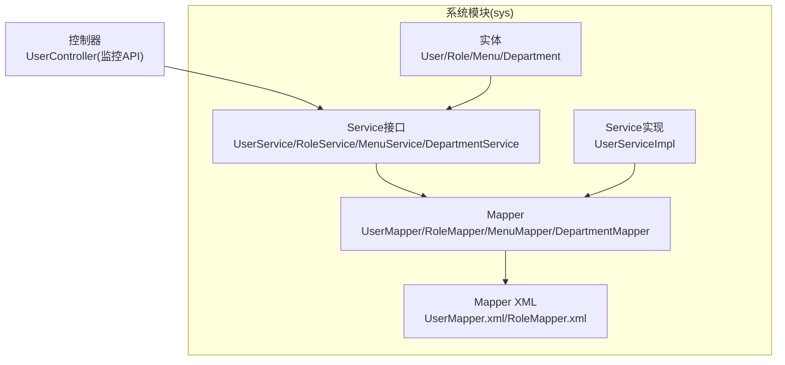
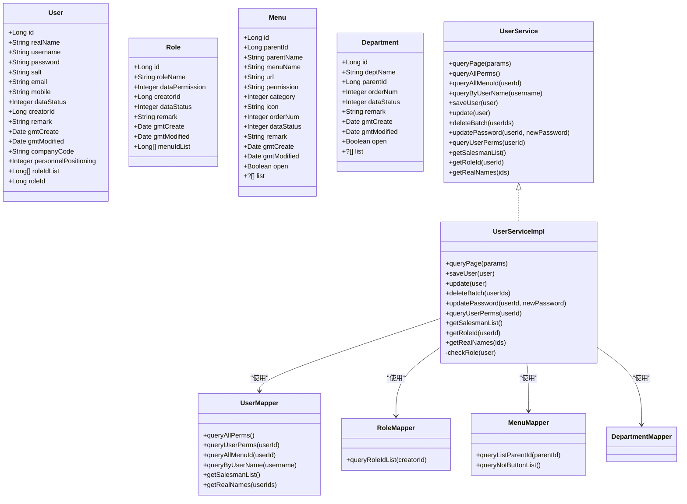
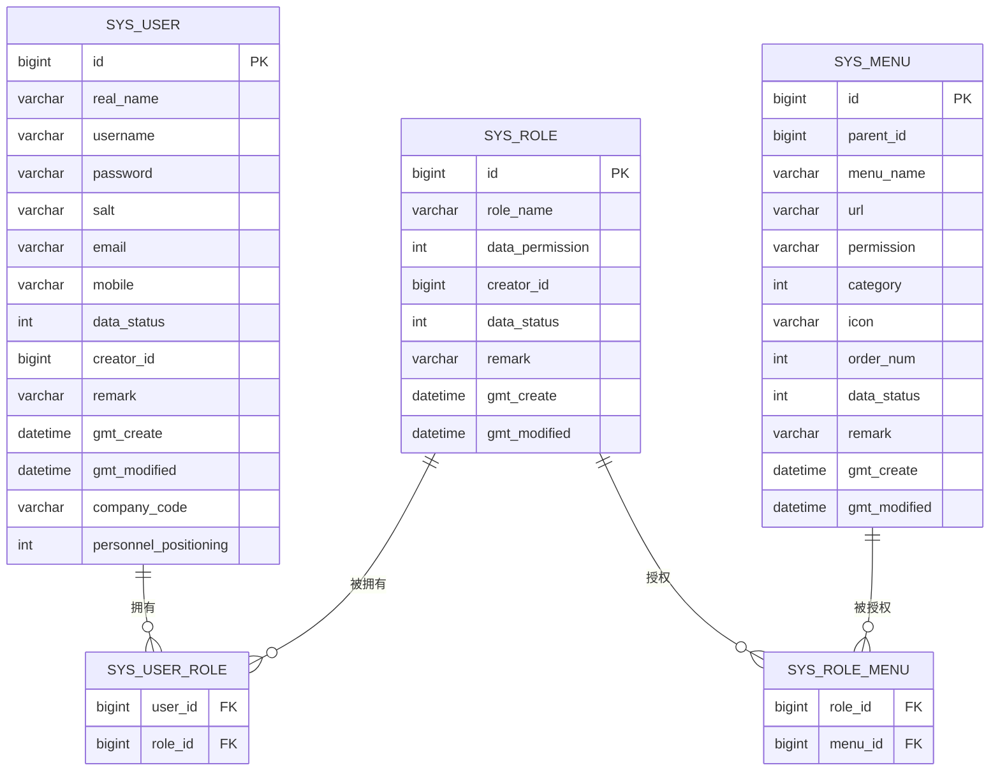
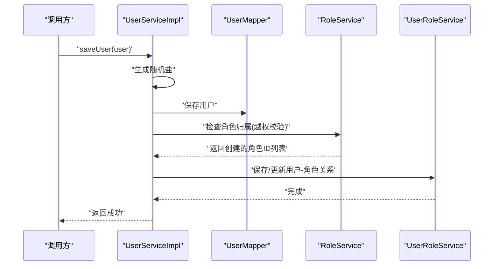
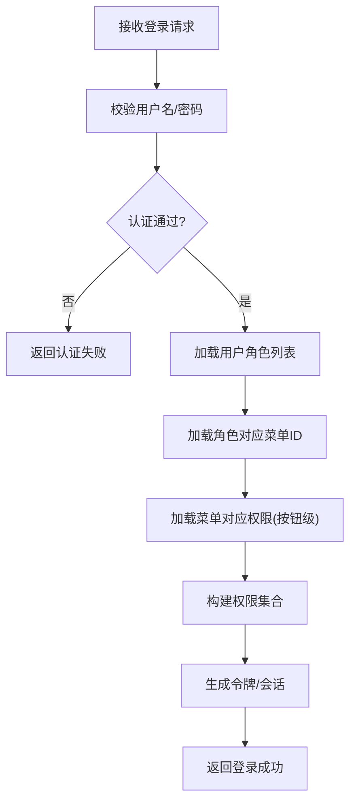
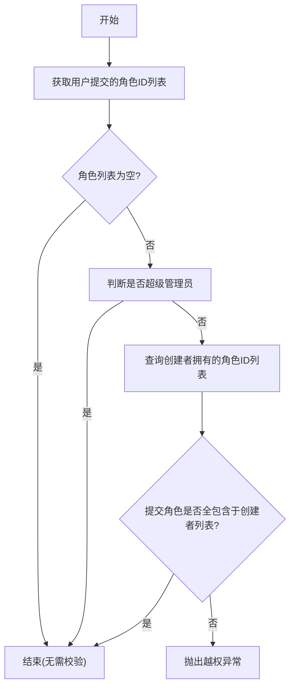
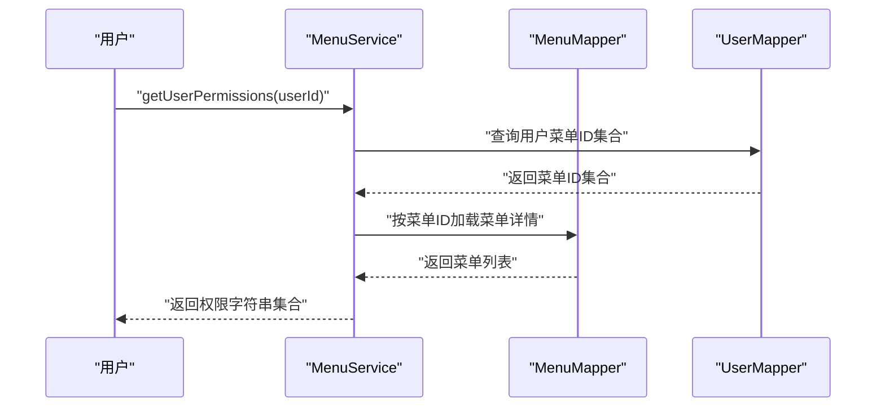
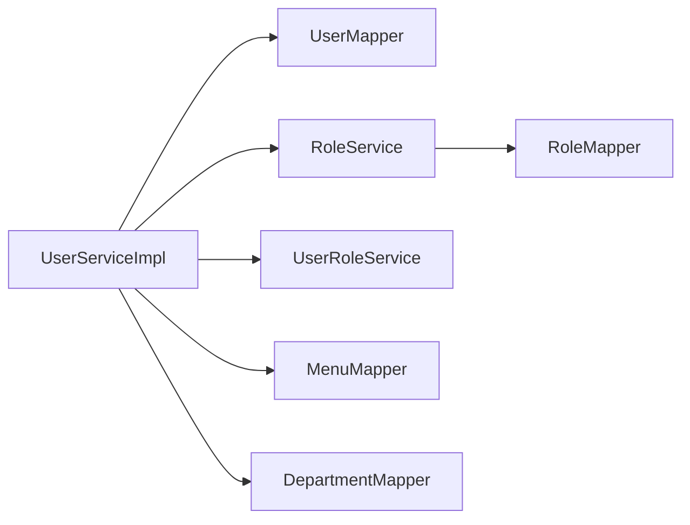

# 用户系统模块

<cite>
**本文引用的文件**
- [User.java](file://monkey-service/src/main/java/com/monkey/general/modules/sys/entity/User.java)
- [Role.java](file://monkey-service/src/main/java/com/monkey/general/modules/sys/entity/Role.java)
- [Menu.java](file://monkey-service/src/main/java/com/monkey/general/modules/sys/entity/Menu.java)
- [Department.java](file://monkey-service/src/main/java/com/monkey/general/modules/sys/entity/Department.java)
- [UserService.java](file://monkey-service/src/main/java/com/monkey/general/modules/sys/service/UserService.java)
- [UserServiceImpl.java](file://monkey-service/src/main/java/com/monkey/general/modules/sys/service/impl/UserServiceImpl.java)
- [RoleService.java](file://monkey-service/src/main/java/com/monkey/general/modules/sys/service/RoleService.java)
- [MenuService.java](file://monkey-service/src/main/java/com/monkey/general/modules/sys/service/MenuService.java)
- [DepartmentService.java](file://monkey-service/src/main/java/com/monkey/general/modules/sys/service/DepartmentService.java)
- [UserMapper.java](file://monkey-service/src/main/java/com/monkey/general/modules/sys/mapper/UserMapper.java)
- [RoleMapper.java](file://monkey-service/src/main/java/com/monkey/general/modules/sys/mapper/RoleMapper.java)
- [MenuMapper.java](file://monkey-service/src/main/java/com/monkey/general/modules/sys/mapper/MenuMapper.java)
- [DepartmentMapper.java](file://monkey-service/src/main/java/com/monkey/general/modules/sys/mapper/DepartmentMapper.java)
- [UserMapper.xml](file://monkey-service/src/main/resources/mapper/sys/UserMapper.xml)
- [RoleMapper.xml](file://monkey-service/src/main/resources/mapper/sys/RoleMapper.xml)
- [SysLog.java](file://monkey-service/src/main/java/com/monkey/general/common/annotation/SysLog.java)
- [Constant.java](file://monkey-service/src/main/java/com/monkey/general/common/utils/Constant.java)
- [MonkeyCustomException.java](file://monkey-common/src/main/java/com/monkey/general/common/exception/MonkeyCustomException.java)
- [RandomStringUtils.java](file://monkey-service/target/classes/org/apache/commons/lang/RandomStringUtils.class)
</cite>

## 目录
1. [简介](#简介)
2. [项目结构](#项目结构)
3. [核心组件](#核心组件)
4. [架构总览](#架构总览)
5. [详细组件分析](#详细组件分析)
6. [依赖分析](#依赖分析)
7. [性能考虑](#性能考虑)
8. [故障排查指南](#故障排查指南)
9. [结论](#结论)
10. [附录](#附录)

## 简介
本文件系统性梳理用户系统模块的设计与实现，覆盖用户、角色、菜单、部门等核心实体及其关系；阐述用户注册、登录认证、权限管理、角色分配等业务流程；解释安全存储与访问控制机制；展示Service层的CRUD、密码管理与权限验证能力；说明与日志记录、操作审计等模块的集成方式，并给出最佳实践、安全与性能优化建议。

## 项目结构
用户系统模块位于服务端工程的系统模块中，采用典型的分层架构：
- 实体层：User、Role、Menu、Department
- Mapper层：MyBatis接口与XML映射
- Service层：接口与实现类，封装业务逻辑与事务控制
- 控制器层：在监控API模块中提供REST接口（如UserController）
- 公共工具与注解：日志注解、常量、异常等

图表来源
- [User.java:1-127](file://monkey-service/src/main/java/com/monkey/general/modules/sys/entity/User.java#L1-L127)
- [Role.java:1-77](file://monkey-service/src/main/java/com/monkey/general/modules/sys/entity/Role.java#L1-L77)
- [Menu.java:1-113](file://monkey-service/src/main/java/com/monkey/general/modules/sys/entity/Menu.java#L1-L113)
- [Department.java:1-79](file://monkey-service/src/main/java/com/monkey/general/modules/sys/entity/Department.java#L1-L79)
- [UserMapper.java:1-40](file://monkey-service/src/main/java/com/monkey/general/modules/sys/mapper/UserMapper.java#L1-L40)
- [RoleMapper.java:1-19](file://monkey-service/src/main/java/com/monkey/general/modules/sys/mapper/RoleMapper.java#L1-L19)
- [MenuMapper.java:1-29](file://monkey-service/src/main/java/com/monkey/general/modules/sys/mapper/MenuMapper.java#L1-L29)
- [DepartmentMapper.java:1-14](file://monkey-service/src/main/java/com/monkey/general/modules/sys/mapper/DepartmentMapper.java#L1-L14)
- [UserMapper.xml:1-42](file://monkey-service/src/main/resources/mapper/sys/UserMapper.xml#L1-L42)
- [RoleMapper.xml:1-9](file://monkey-service/src/main/resources/mapper/sys/RoleMapper.xml#L1-L9)
- [UserService.java:1-70](file://monkey-service/src/main/java/com/monkey/general/modules/sys/service/UserService.java#L1-L70)
- [UserServiceImpl.java:1-159](file://monkey-service/src/main/java/com/monkey/general/modules/sys/service/impl/UserServiceImpl.java#L1-L159)

章节来源
- [User.java:1-127](file://monkey-service/src/main/java/com/monkey/general/modules/sys/entity/User.java#L1-L127)
- [Role.java:1-77](file://monkey-service/src/main/java/com/monkey/general/modules/sys/entity/Role.java#L1-L77)
- [Menu.java:1-113](file://monkey-service/src/main/java/com/monkey/general/modules/sys/entity/Menu.java#L1-L113)
- [Department.java:1-79](file://monkey-service/src/main/java/com/monkey/general/modules/sys/entity/Department.java#L1-L79)
- [UserMapper.java:1-40](file://monkey-service/src/main/java/com/monkey/general/modules/sys/mapper/UserMapper.java#L1-L40)
- [RoleMapper.java:1-19](file://monkey-service/src/main/java/com/monkey/general/modules/sys/mapper/RoleMapper.java#L1-L19)
- [MenuMapper.java:1-29](file://monkey-service/src/main/java/com/monkey/general/modules/sys/mapper/MenuMapper.java#L1-L29)
- [DepartmentMapper.java:1-14](file://monkey-service/src/main/java/com/monkey/general/modules/sys/mapper/DepartmentMapper.java#L1-L14)
- [UserMapper.xml:1-42](file://monkey-service/src/main/resources/mapper/sys/UserMapper.xml#L1-L42)
- [RoleMapper.xml:1-9](file://monkey-service/src/main/resources/mapper/sys/RoleMapper.xml#L1-L9)
- [UserService.java:1-70](file://monkey-service/src/main/java/com/monkey/general/modules/sys/service/UserService.java#L1-L70)
- [UserServiceImpl.java:1-159](file://monkey-service/src/main/java/com/monkey/general/modules/sys/service/impl/UserServiceImpl.java#L1-L159)

## 核心组件
- 用户(User)：包含主键、姓名、用户名、密码、盐、邮箱、手机号、状态、创建者ID、公司编码、定位标识、创建/更新时间等字段，支持角色ID列表扩展。
- 角色(Role)：包含主键、角色名、数据权限、创建者ID、状态、备注、创建/更新时间、菜单ID集合扩展。
- 菜单(Menu)：包含主键、父菜单ID、菜单名称、URL、权限字符串、类型(目录/菜单/按钮)、图标、排序、状态、备注、创建/更新时间、ztree属性等。
- 部门(Department)：包含主键、部门名、父ID、排序、状态、备注、创建/更新时间、ztree属性等。

章节来源
- [User.java:17-127](file://monkey-service/src/main/java/com/monkey/general/modules/sys/entity/User.java#L17-L127)
- [Role.java:16-77](file://monkey-service/src/main/java/com/monkey/general/modules/sys/entity/Role.java#L16-L77)
- [Menu.java:15-113](file://monkey-service/src/main/java/com/monkey/general/modules/sys/entity/Menu.java#L15-L113)
- [Department.java:15-79](file://monkey-service/src/main/java/com/monkey/general/modules/sys/entity/Department.java#L15-L79)

## 架构总览
用户系统遵循“实体-映射-服务-控制层”的分层设计，通过MyBatis完成数据库交互，Service层负责业务编排与事务控制，控制器对外暴露REST接口。

图表来源
- [User.java:24-127](file://monkey-service/src/main/java/com/monkey/general/modules/sys/entity/User.java#L24-L127)
- [Role.java:23-77](file://monkey-service/src/main/java/com/monkey/general/modules/sys/entity/Role.java#L23-L77)
- [Menu.java:23-113](file://monkey-service/src/main/java/com/monkey/general/modules/sys/entity/Menu.java#L23-L113)
- [Department.java:21-79](file://monkey-service/src/main/java/com/monkey/general/modules/sys/entity/Department.java#L21-L79)
- [UserService.java:16-70](file://monkey-service/src/main/java/com/monkey/general/modules/sys/service/UserService.java#L16-L70)
- [UserServiceImpl.java:34-159](file://monkey-service/src/main/java/com/monkey/general/modules/sys/service/impl/UserServiceImpl.java#L34-L159)
- [UserMapper.java:13-40](file://monkey-service/src/main/java/com/monkey/general/modules/sys/mapper/UserMapper.java#L13-L40)
- [RoleMapper.java:13-19](file://monkey-service/src/main/java/com/monkey/general/modules/sys/mapper/RoleMapper.java#L13-L19)
- [MenuMapper.java:14-29](file://monkey-service/src/main/java/com/monkey/general/modules/sys/mapper/MenuMapper.java#L14-L29)
- [DepartmentMapper.java:10-14](file://monkey-service/src/main/java/com/monkey/general/modules/sys/mapper/DepartmentMapper.java#L10-L14)

## 详细组件分析

### 用户实体与关系
- 用户与角色：用户可拥有多个角色ID列表，用于权限继承与菜单授权。
- 用户与部门：实体中未直接声明部门字段，通常通过关联表或外键扩展。
- 用户与菜单：通过用户-角色-菜单三层关系获得最终可用菜单与权限。
- 用户与权限：权限以“按钮级”菜单的permission字符串表示。

图表来源
- [User.java:24-127](file://monkey-service/src/main/java/com/monkey/general/modules/sys/entity/User.java#L24-L127)
- [Role.java:23-77](file://monkey-service/src/main/java/com/monkey/general/modules/sys/entity/Role.java#L23-L77)
- [Menu.java:23-113](file://monkey-service/src/main/java/com/monkey/general/modules/sys/entity/Menu.java#L23-L113)
- [UserMapper.xml:11-23](file://monkey-service/src/main/resources/mapper/sys/UserMapper.xml#L11-L23)

章节来源
- [User.java:17-127](file://monkey-service/src/main/java/com/monkey/general/modules/sys/entity/User.java#L17-L127)
- [Role.java:16-77](file://monkey-service/src/main/java/com/monkey/general/modules/sys/entity/Role.java#L16-L77)
- [Menu.java:15-113](file://monkey-service/src/main/java/com/monkey/general/modules/sys/entity/Menu.java#L15-L113)
- [UserMapper.xml:1-42](file://monkey-service/src/main/resources/mapper/sys/UserMapper.xml#L1-L42)

### 用户Service层实现
- 分页查询：根据用户名与创建者ID进行过滤分页。
- 权限查询：提供系统全部权限、用户全部权限、用户菜单ID集合。
- 用户CRUD：保存用户、更新用户、批量删除用户。
- 密码管理：修改用户密码（注意：当前实现未执行加盐哈希处理）。
- 角色校验：非超级管理员不可越权选择他人创建的角色。
- 扩展方法：销售员列表、角色ID获取、真实姓名拼接。

图表来源
- [UserServiceImpl.java:70-95](file://monkey-service/src/main/java/com/monkey/general/modules/sys/service/impl/UserServiceImpl.java#L70-L95)
- [UserMapper.java:13-40](file://monkey-service/src/main/java/com/monkey/general/modules/sys/mapper/UserMapper.java#L13-L40)
- [RoleService.java:16-32](file://monkey-service/src/main/java/com/monkey/general/modules/sys/service/RoleService.java#L16-L32)

章节来源
- [UserService.java:16-70](file://monkey-service/src/main/java/com/monkey/general/modules/sys/service/UserService.java#L16-L70)
- [UserServiceImpl.java:40-159](file://monkey-service/src/main/java/com/monkey/general/modules/sys/service/impl/UserServiceImpl.java#L40-L159)

### 登录认证与权限验证流程
- 登录：控制器接收凭证后，调用认证服务完成身份校验。
- 权限加载：基于用户ID查询其角色-菜单-权限链路，构建权限集合。
- 访问控制：在控制器或网关层对请求进行权限拦截与放行。

图表来源
- [UserMapper.xml:10-16](file://monkey-service/src/main/resources/mapper/sys/UserMapper.xml#L10-L16)
- [MenuService.java:47-52](file://monkey-service/src/main/java/com/monkey/general/modules/sys/service/MenuService.java#L47-L52)
- [UserService.java:20-62](file://monkey-service/src/main/java/com/monkey/general/modules/sys/service/UserService.java#L20-L62)

### 角色分配与越权校验
- 非超级管理员仅能为用户分配自身创建的角色。
- 校验逻辑：读取创建者拥有的角色ID集合，确保用户所选角色均包含于内。

图表来源
- [UserServiceImpl.java:142-158](file://monkey-service/src/main/java/com/monkey/general/modules/sys/service/impl/UserServiceImpl.java#L142-L158)
- [RoleMapper.java:13-19](file://monkey-service/src/main/java/com/monkey/general/modules/sys/mapper/RoleMapper.java#L13-L19)
- [Constant.java](file://monkey-service/src/main/java/com/monkey/general/common/utils/Constant.java)

章节来源
- [UserServiceImpl.java:142-158](file://monkey-service/src/main/java/com/monkey/general/modules/sys/service/impl/UserServiceImpl.java#L142-L158)
- [RoleMapper.xml:5-9](file://monkey-service/src/main/resources/mapper/sys/RoleMapper.xml#L5-L9)

### 菜单与权限模型
- 菜单类型：目录(0)/菜单(1)/按钮(2)，按钮级权限用于细粒度授权。
- 权限来源：用户-角色-菜单三级关联，最终提取permission字符串集合。

图表来源
- [MenuService.java:37-52](file://monkey-service/src/main/java/com/monkey/general/modules/sys/service/MenuService.java#L37-L52)
- [UserMapper.xml:18-23](file://monkey-service/src/main/resources/mapper/sys/UserMapper.xml#L18-L23)
- [MenuMapper.java:14-29](file://monkey-service/src/main/java/com/monkey/general/modules/sys/mapper/MenuMapper.java#L14-L29)

## 依赖分析
- 组件耦合：UserServiceImpl依赖UserMapper、RoleService、UserRoleService、MenuMapper等，体现业务编排职责。
- 外部依赖：Apache Commons Lang用于生成随机盐；MyBatis用于SQL映射；Spring事务管理用于一致性保障。
- 循环依赖：当前结构未见循环依赖迹象。

图表来源
- [UserServiceImpl.java:34-39](file://monkey-service/src/main/java/com/monkey/general/modules/sys/service/impl/UserServiceImpl.java#L34-L39)
- [UserMapper.java:13-40](file://monkey-service/src/main/java/com/monkey/general/modules/sys/mapper/UserMapper.java#L13-L40)
- [RoleMapper.java:13-19](file://monkey-service/src/main/java/com/monkey/general/modules/sys/mapper/RoleMapper.java#L13-L19)
- [MenuMapper.java:14-29](file://monkey-service/src/main/java/com/monkey/general/modules/sys/mapper/MenuMapper.java#L14-L29)
- [DepartmentMapper.java:10-14](file://monkey-service/src/main/java/com/monkey/general/modules/sys/mapper/DepartmentMapper.java#L10-L14)

章节来源
- [UserServiceImpl.java:1-159](file://monkey-service/src/main/java/com/monkey/general/modules/sys/service/impl/UserServiceImpl.java#L1-L159)

## 性能考虑
- 分页查询：对用户名与创建者ID建立索引，避免全表扫描。
- 权限查询：缓存用户菜单ID与权限集合，降低频繁跨表JOIN开销。
- 角色校验：创建者角色列表应缓存，减少重复查询。
- 批量操作：批量删除用户时，先清理用户-角色关联，再删除用户，避免外键约束带来的锁竞争。
- 密码更新：当前未做加盐哈希处理，存在安全风险，建议在更新密码时引入安全算法。

## 故障排查指南
- 越权异常：当非超级管理员尝试为用户分配非自身创建的角色时，将抛出自定义异常。请检查创建者与角色归属关系。
- 密码错误：若登录失败，请确认密码是否正确，以及是否已按安全策略进行加盐哈希处理。
- 权限缺失：若用户无法访问某按钮级功能，请核对菜单权限字符串与角色授权链路。
- 日志审计：结合系统日志注解与操作审计模块，追踪用户行为与异常。

章节来源
- [UserServiceImpl.java:142-158](file://monkey-service/src/main/java/com/monkey/general/modules/sys/service/impl/UserServiceImpl.java#L142-L158)
- [MonkeyCustomException.java](file://monkey-common/src/main/java/com/monkey/general/common/exception/MonkeyCustomException.java)
- [SysLog.java](file://monkey-service/src/main/java/com/monkey/general/common/annotation/SysLog.java)

## 结论
用户系统模块以清晰的分层与实体关系支撑了完整的用户生命周期管理与权限控制。通过Service层的事务编排与权限校验，有效保证了业务一致性与安全性。建议后续完善密码安全策略、引入权限缓存与审计日志，持续提升系统性能与可观测性。

## 附录
- 最佳实践
  - 用户密码必须进行加盐哈希存储与传输加密。
  - 对高频查询结果进行缓存，降低数据库压力。
  - 在控制器层统一进行权限拦截，避免越权访问。
  - 使用分布式锁或幂等设计处理高并发场景。
- 安全考虑
  - 强制最小权限原则，避免授予不必要的角色与权限。
  - 定期审计用户-角色-菜单授权链路。
  - 对敏感操作增加二次确认与操作日志。
- 性能优化
  - 为常用查询字段建立复合索引。
  - 将权限集合与菜单树结构进行本地缓存。
  - 合理设置分页大小，避免超大数据集一次性加载。