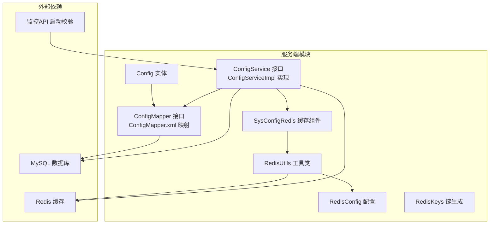
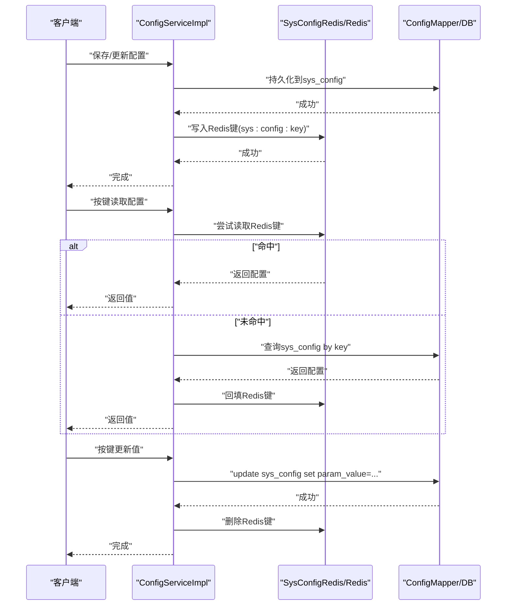
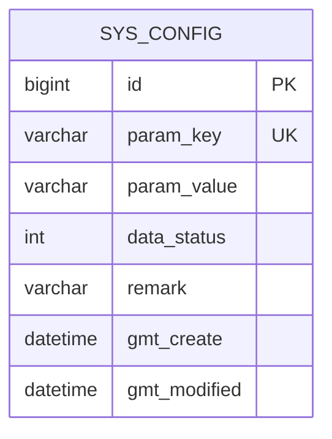
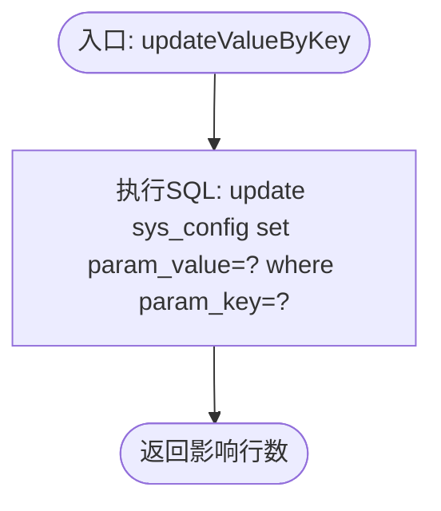
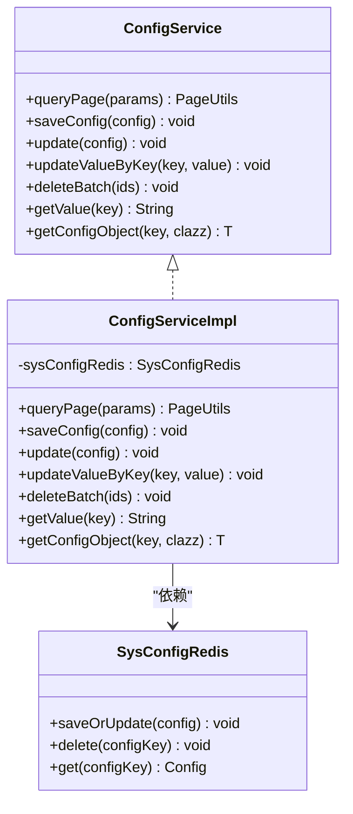
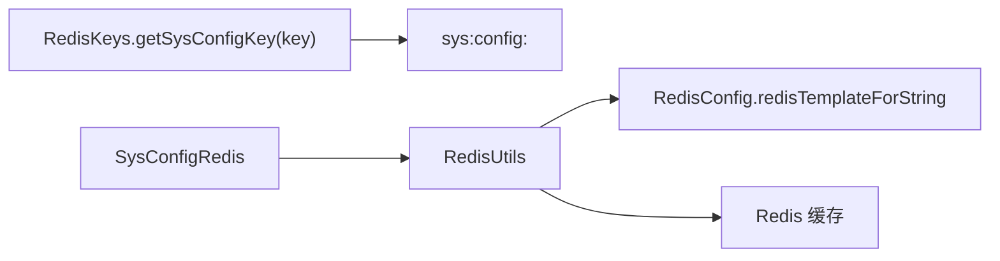
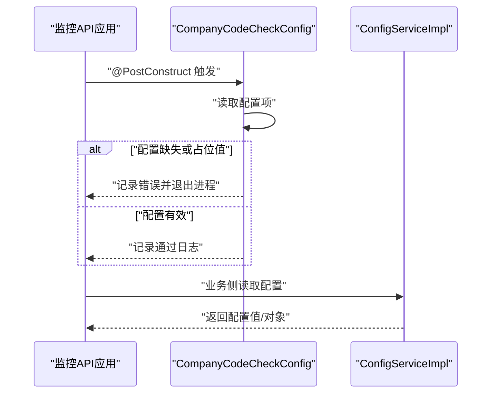
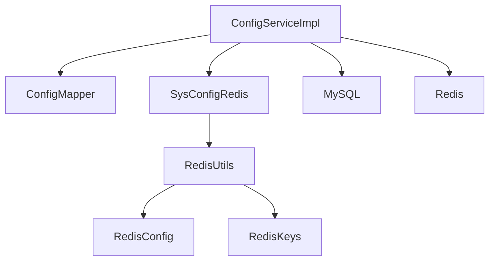

# 系统配置模块

<cite>
**本文引用的文件**
- [Config.java](file://monkey-service/src/main/java/com/monkey/general/modules/sys/entity/Config.java)
- [ConfigMapper.java](file://monkey-service/src/main/java/com/monkey/general/modules/sys/mapper/ConfigMapper.java)
- [ConfigMapper.xml](file://monkey-service/src/main/resources/mapper/sys/ConfigMapper.xml)
- [ConfigService.java](file://monkey-service/src/main/java/com/monkey/general/modules/sys/service/ConfigService.java)
- [ConfigServiceImpl.java](file://monkey-service/src/main/java/com/monkey/general/modules/sys/service/impl/ConfigServiceImpl.java)
- [SysConfigRedis.java](file://monkey-service/src/main/java/com/monkey/general/modules/sys/redis/SysConfigRedis.java)
- [RedisConfig.java](file://monkey-service/src/main/java/com/monkey/general/config/RedisConfig.java)
- [RedisUtils.java](file://monkey-service/src/main/java/com/monkey/general/common/utils/RedisUtils.java)
- [RedisKeys.java](file://monkey-common/src/main/java/com/monkey/general/common/utils/RedisKeys.java)
- [RedisConstant.java](file://monkey-common/src/main/java/com/monkey/general/common/constant/RedisConstant.java)
- [CompanyCodeCheckConfig.java](file://monkey-monitor-api/src/main/java/com/monkey/general/config/CompanyCodeCheckConfig.java)
</cite>

## 目录
1. [简介](#简介)
2. [项目结构](#项目结构)
3. [核心组件](#核心组件)
4. [架构总览](#架构总览)
5. [详细组件分析](#详细组件分析)
6. [依赖关系分析](#依赖关系分析)
7. [性能考量](#性能考量)
8. [故障排查指南](#故障排查指南)
9. [结论](#结论)
10. [附录](#附录)

## 简介
本文件系统性梳理“系统配置模块”的设计与实现，涵盖配置实体字段、数据库与Redis双写存储策略、动态加载与热更新机制、Service层能力（读取、修改、删除、批量操作）、与业务模块的集成方式以及配置验证机制。同时给出安全、版本控制与备份恢复的建议方案，帮助读者快速理解并正确使用该模块。

## 项目结构
系统配置模块位于服务端工程的系统模块中，采用分层架构：
- 实体层：配置实体定义与数据库映射
- 数据访问层：MyBatis Mapper接口与XML映射
- 服务层：配置业务逻辑与缓存同步
- 缓存层：基于Redis的配置缓存与工具
- 集成层：与监控API的启动校验集成

图表来源
- [Config.java:1-62](file://monkey-service/src/main/java/com/monkey/general/modules/sys/entity/Config.java#L1-L62)
- [ConfigMapper.java:1-23](file://monkey-service/src/main/java/com/monkey/general/modules/sys/mapper/ConfigMapper.java#L1-L23)
- [ConfigMapper.xml:1-16](file://monkey-service/src/main/resources/mapper/sys/ConfigMapper.xml#L1-L16)
- [ConfigService.java:1-53](file://monkey-service/src/main/java/com/monkey/general/modules/sys/service/ConfigService.java#L1-L53)
- [ConfigServiceImpl.java:1-97](file://monkey-service/src/main/java/com/monkey/general/modules/sys/service/impl/ConfigServiceImpl.java#L1-L97)
- [SysConfigRedis.java:1-37](file://monkey-service/src/main/java/com/monkey/general/modules/sys/redis/SysConfigRedis.java#L1-L37)
- [RedisUtils.java:1-305](file://monkey-service/src/main/java/com/monkey/general/common/utils/RedisUtils.java#L1-L305)
- [RedisConfig.java:1-57](file://monkey-service/src/main/java/com/monkey/general/config/RedisConfig.java#L1-L57)
- [RedisKeys.java:1-14](file://monkey-common/src/main/java/com/monkey/general/common/utils/RedisKeys.java#L1-L14)
- [CompanyCodeCheckConfig.java:1-44](file://monkey-monitor-api/src/main/java/com/monkey/general/config/CompanyCodeCheckConfig.java#L1-L44)

章节来源
- [Config.java:1-62](file://monkey-service/src/main/java/com/monkey/general/modules/sys/entity/Config.java#L1-L62)
- [ConfigMapper.java:1-23](file://monkey-service/src/main/java/com/monkey/general/modules/sys/mapper/ConfigMapper.java#L1-L23)
- [ConfigMapper.xml:1-16](file://monkey-service/src/main/resources/mapper/sys/ConfigMapper.xml#L1-L16)
- [ConfigService.java:1-53](file://monkey-service/src/main/java/com/monkey/general/modules/sys/service/ConfigService.java#L1-L53)
- [ConfigServiceImpl.java:1-97](file://monkey-service/src/main/java/com/monkey/general/modules/sys/service/impl/ConfigServiceImpl.java#L1-L97)
- [SysConfigRedis.java:1-37](file://monkey-service/src/main/java/com/monkey/general/modules/sys/redis/SysConfigRedis.java#L1-L37)
- [RedisUtils.java:1-305](file://monkey-service/src/main/java/com/monkey/general/common/utils/RedisUtils.java#L1-L305)
- [RedisConfig.java:1-57](file://monkey-service/src/main/java/com/monkey/general/config/RedisConfig.java#L1-L57)
- [RedisKeys.java:1-14](file://monkey-common/src/main/java/com/monkey/general/common/utils/RedisKeys.java#L1-L14)
- [RedisConstant.java:1-35](file://monkey-common/src/main/java/com/monkey/general/common/constant/RedisConstant.java#L1-L35)
- [CompanyCodeCheckConfig.java:1-44](file://monkey-monitor-api/src/main/java/com/monkey/general/config/CompanyCodeCheckConfig.java#L1-L44)

## 核心组件
- 配置实体：定义配置项的主键、键、值、状态、备注及时间戳字段，映射到数据库表sys_config。
- 数据访问层：提供按键查询与按键更新值的SQL方法。
- 服务层：封装配置的增删改查、分页查询、对象反序列化、事务与缓存一致性。
- 缓存层：提供Redis键空间、工具类与模板配置，支持字符串序列化与过期控制。
- 集成校验：监控API在启动阶段对关键配置进行校验，确保运行安全。

章节来源
- [Config.java:19-61](file://monkey-service/src/main/java/com/monkey/general/modules/sys/entity/Config.java#L19-L61)
- [ConfigMapper.java:12-22](file://monkey-service/src/main/java/com/monkey/general/modules/sys/mapper/ConfigMapper.java#L12-L22)
- [ConfigMapper.xml:6-14](file://monkey-service/src/main/resources/mapper/sys/ConfigMapper.xml#L6-L14)
- [ConfigService.java:14-52](file://monkey-service/src/main/java/com/monkey/general/modules/sys/service/ConfigService.java#L14-L52)
- [ConfigServiceImpl.java:23-96](file://monkey-service/src/main/java/com/monkey/general/modules/sys/service/impl/ConfigServiceImpl.java#L23-L96)
- [SysConfigRedis.java:16-36](file://monkey-service/src/main/java/com/monkey/general/modules/sys/redis/SysConfigRedis.java#L16-L36)
- [RedisUtils.java:18-87](file://monkey-service/src/main/java/com/monkey/general/common/utils/RedisUtils.java#L18-L87)
- [RedisConfig.java:16-56](file://monkey-service/src/main/java/com/monkey/general/config/RedisConfig.java#L16-L56)
- [RedisKeys.java:10-12](file://monkey-common/src/main/java/com/monkey/general/common/utils/RedisKeys.java#L10-L12)
- [CompanyCodeCheckConfig.java:13-43](file://monkey-monitor-api/src/main/java/com/monkey/general/config/CompanyCodeCheckConfig.java#L13-L43)

## 架构总览
系统配置采用“数据库+Redis”的双写策略，保证高并发下的读性能与一致性：
- 写路径：先持久化到数据库，再写入Redis；若失败回滚数据库变更。
- 读路径：优先从Redis读取，命中则返回；未命中则从数据库加载并回填Redis。
- 更新路径：按键更新值时，仅更新数据库，随后删除Redis缓存键，下次读取触发回填。
- 删除路径：批量删除时，逐条读取配置键并删除对应Redis缓存，再执行物理删除。

图表来源
- [ConfigServiceImpl.java:42-81](file://monkey-service/src/main/java/com/monkey/general/modules/sys/service/impl/ConfigServiceImpl.java#L42-L81)
- [ConfigMapper.xml:7-14](file://monkey-service/src/main/resources/mapper/sys/ConfigMapper.xml#L7-L14)
- [SysConfigRedis.java:20-36](file://monkey-service/src/main/java/com/monkey/general/modules/sys/redis/SysConfigRedis.java#L20-L36)
- [RedisKeys.java:10-12](file://monkey-common/src/main/java/com/monkey/general/common/utils/RedisKeys.java#L10-L12)

## 详细组件分析

### 配置实体与数据库映射
- 字段设计
  - 主键：Long型自增主键
  - 键：唯一标识配置项的字符串键
  - 值：字符串形式的配置值，支持复杂对象序列化
  - 状态：启用/禁用标志，用于过滤无效配置
  - 备注：可选描述信息
  - 时间戳：自动填充创建与更新时间
- 表结构映射：实体类通过注解映射到sys_config表，字段与表列一一对应。

图表来源
- [Config.java:21-59](file://monkey-service/src/main/java/com/monkey/general/modules/sys/entity/Config.java#L21-L59)

章节来源
- [Config.java:19-61](file://monkey-service/src/main/java/com/monkey/general/modules/sys/entity/Config.java#L19-L61)

### 数据访问层（Mapper）
- 查询方法：按键查询完整配置记录
- 更新方法：按键更新配置值
- XML映射：提供SQL实现，确保键唯一约束下的原子更新

图表来源
- [ConfigMapper.xml:7-9](file://monkey-service/src/main/resources/mapper/sys/ConfigMapper.xml#L7-L9)

章节来源
- [ConfigMapper.java:12-22](file://monkey-service/src/main/java/com/monkey/general/modules/sys/mapper/ConfigMapper.java#L12-L22)
- [ConfigMapper.xml:6-14](file://monkey-service/src/main/resources/mapper/sys/ConfigMapper.xml#L6-L14)

### 服务层（Service）
- 分页查询：支持按键模糊查询与状态过滤
- 保存配置：持久化后写入Redis
- 更新配置：按ID更新后写入Redis
- 按键更新值：仅更新数据库值并删除Redis缓存键
- 批量删除：逐条删除Redis缓存键后再物理删除
- 读取配置：优先Redis，未命中回源数据库并回填
- 对象解析：将字符串值反序列化为指定类型实例

图表来源
- [ConfigService.java:14-52](file://monkey-service/src/main/java/com/monkey/general/modules/sys/service/ConfigService.java#L14-L52)
- [ConfigServiceImpl.java:23-96](file://monkey-service/src/main/java/com/monkey/general/modules/sys/service/impl/ConfigServiceImpl.java#L23-L96)
- [SysConfigRedis.java:16-36](file://monkey-service/src/main/java/com/monkey/general/modules/sys/redis/SysConfigRedis.java#L16-L36)

章节来源
- [ConfigService.java:14-52](file://monkey-service/src/main/java/com/monkey/general/modules/sys/service/ConfigService.java#L14-L52)
- [ConfigServiceImpl.java:27-95](file://monkey-service/src/main/java/com/monkey/general/modules/sys/service/impl/ConfigServiceImpl.java#L27-L95)

### 缓存层（Redis）
- 键空间：统一前缀sys:config:，便于命名规范与清理
- 组件职责：封装配置的Redis存取与删除
- 工具类能力：提供字符串序列化、过期控制、批量读取、Hash操作等
- 模板配置：定制String序列化器，避免默认JDK序列化问题

图表来源
- [RedisKeys.java:10-12](file://monkey-common/src/main/java/com/monkey/general/common/utils/RedisKeys.java#L10-L12)
- [SysConfigRedis.java:20-36](file://monkey-service/src/main/java/com/monkey/general/modules/sys/redis/SysConfigRedis.java#L20-L36)
- [RedisUtils.java:21-41](file://monkey-service/src/main/java/com/monkey/general/common/utils/RedisUtils.java#L21-L41)
- [RedisConfig.java:21-30](file://monkey-service/src/main/java/com/monkey/general/config/RedisConfig.java#L21-L30)

章节来源
- [SysConfigRedis.java:16-36](file://monkey-service/src/main/java/com/monkey/general/modules/sys/redis/SysConfigRedis.java#L16-L36)
- [RedisUtils.java:18-87](file://monkey-service/src/main/java/com/monkey/general/common/utils/RedisUtils.java#L18-L87)
- [RedisConfig.java:16-56](file://monkey-service/src/main/java/com/monkey/general/config/RedisConfig.java#L16-L56)
- [RedisKeys.java:10-12](file://monkey-common/src/main/java/com/monkey/general/common/utils/RedisKeys.java#L10-L12)

### 与业务模块的集成与验证
- 监控API启动校验：在应用启动后检查关键配置项（如企业编码）是否有效，防止误用占位值导致运行风险
- 配置读取：业务模块通过服务层统一获取配置值或对象，避免直接访问数据库或缓存

图表来源
- [CompanyCodeCheckConfig.java:27-43](file://monkey-monitor-api/src/main/java/com/monkey/general/config/CompanyCodeCheckConfig.java#L27-L43)
- [ConfigServiceImpl.java:73-95](file://monkey-service/src/main/java/com/monkey/general/modules/sys/service/impl/ConfigServiceImpl.java#L73-L95)

章节来源
- [CompanyCodeCheckConfig.java:13-43](file://monkey-monitor-api/src/main/java/com/monkey/general/config/CompanyCodeCheckConfig.java#L13-L43)
- [ConfigServiceImpl.java:73-95](file://monkey-service/src/main/java/com/monkey/general/modules/sys/service/impl/ConfigServiceImpl.java#L73-L95)

## 依赖关系分析
- 组件耦合
  - ConfigServiceImpl依赖ConfigMapper与SysConfigRedis，保持业务与数据访问、缓存的清晰边界
  - SysConfigRedis依赖RedisUtils与RedisKeys，集中处理键生成与缓存操作
- 外部依赖
  - MySQL：持久化配置数据
  - Redis：高性能缓存与键空间管理
  - Spring Data Redis：提供RedisTemplate与序列化器配置

图表来源
- [ConfigServiceImpl.java:24-25](file://monkey-service/src/main/java/com/monkey/general/modules/sys/service/impl/ConfigServiceImpl.java#L24-L25)
- [SysConfigRedis.java:17-18](file://monkey-service/src/main/java/com/monkey/general/modules/sys/redis/SysConfigRedis.java#L17-L18)
- [RedisUtils.java:21-23](file://monkey-service/src/main/java/com/monkey/general/common/utils/RedisUtils.java#L21-L23)
- [RedisConfig.java:21-29](file://monkey-service/src/main/java/com/monkey/general/config/RedisConfig.java#L21-L29)
- [RedisKeys.java:10-12](file://monkey-common/src/main/java/com/monkey/general/common/utils/RedisKeys.java#L10-L12)

章节来源
- [ConfigServiceImpl.java:23-96](file://monkey-service/src/main/java/com/monkey/general/modules/sys/service/impl/ConfigServiceImpl.java#L23-L96)
- [SysConfigRedis.java:16-36](file://monkey-service/src/main/java/com/monkey/general/modules/sys/redis/SysConfigRedis.java#L16-L36)
- [RedisUtils.java:18-87](file://monkey-service/src/main/java/com/monkey/general/common/utils/RedisUtils.java#L18-L87)
- [RedisConfig.java:16-56](file://monkey-service/src/main/java/com/monkey/general/config/RedisConfig.java#L16-L56)
- [RedisKeys.java:10-12](file://monkey-common/src/main/java/com/monkey/general/common/utils/RedisKeys.java#L10-L12)

## 性能考量
- 读性能优化：Redis缓存命中率直接影响响应时间，建议对高频配置键设置合理过期策略
- 写一致性：采用“先写数据库，再写缓存”的策略，避免脏读；按键更新值采用“先写数据库，后删除缓存”，利用惰性回填降低写放大
- 序列化成本：字符串值与对象反序列化开销可控，建议对大对象配置进行压缩或拆分
- 并发控制：事务保证更新流程的原子性，避免缓存与数据库不一致

## 故障排查指南
- 读取为空
  - 检查Redis键是否存在与过期情况
  - 确认数据库中配置项是否启用且键正确
- 更新无效
  - 确认按键更新只更新数据库值并删除缓存键
  - 检查事务是否正常提交
- 缓存异常
  - 核对Redis序列化器配置与键空间前缀
  - 检查Redis连接与可用性

章节来源
- [ConfigServiceImpl.java:56-59](file://monkey-service/src/main/java/com/monkey/general/modules/sys/service/impl/ConfigServiceImpl.java#L56-L59)
- [RedisUtils.java:32-41](file://monkey-service/src/main/java/com/monkey/general/common/utils/RedisUtils.java#L32-L41)
- [RedisKeys.java:10-12](file://monkey-common/src/main/java/com/monkey/general/common/utils/RedisKeys.java#L10-L12)

## 结论
系统配置模块通过“数据库+Redis”的双写策略实现了高性能与一致性的平衡。服务层提供了完善的配置管理能力，并通过启动校验与键空间规范提升了系统的安全性与可维护性。建议在生产环境中结合版本控制与备份恢复策略，进一步增强配置治理能力。

## 附录
- 安全管理建议
  - 对敏感配置值进行加密存储与传输
  - 限制配置变更权限，采用审计日志追踪
- 版本控制与备份恢复
  - 引入配置版本号字段，支持灰度发布与回滚
  - 定期导出sys_config快照，建立增量备份与恢复流程
- 配置验证机制
  - 在服务层增加Schema校验与默认值回退逻辑
  - 对象解析失败时返回默认实例并记录告警