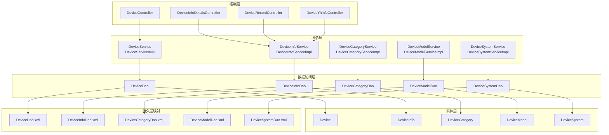
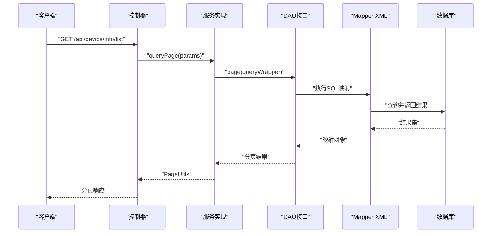
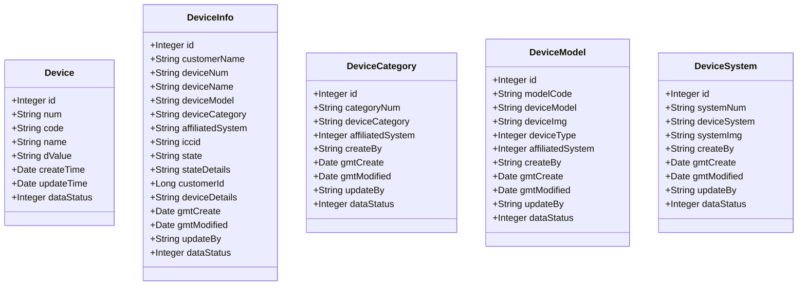
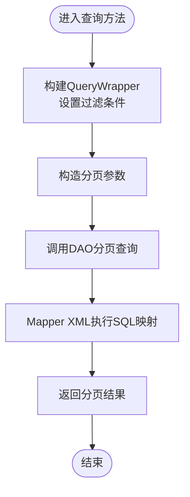
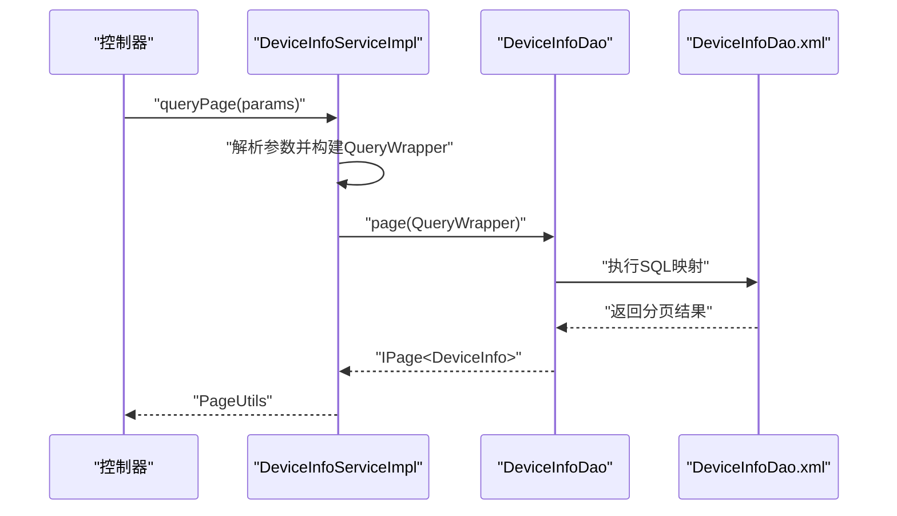

# 设备管理模块

<cite>
**本文档引用的文件**
- [Device.java](file://monkey-service/src/main/java/com/monkey/general/modules/em/entity/Device.java)
- [DeviceInfo.java](file://monkey-service/src/main/java/com/monkey/general/modules/em/entity/DeviceInfo.java)
- [DeviceCategory.java](file://monkey-service/src/main/java/com/monkey/general/modules/em/entity/DeviceCategory.java)
- [DeviceModel.java](file://monkey-service/src/main/java/com/monkey/general/modules/em/entity/DeviceModel.java)
- [DeviceSystem.java](file://monkey-service/src/main/java/com/monkey/general/modules/em/entity/DeviceSystem.java)
- [DeviceDao.java](file://monkey-service/src/main/java/com/monkey/general/modules/em/dao/DeviceDao.java)
- [DeviceInfoDao.java](file://monkey-service/src/main/java/com/monkey/general/modules/em/dao/DeviceInfoDao.java)
- [DeviceCategoryDao.java](file://monkey-service/src/main/java/com/monkey/general/modules/em/dao/DeviceCategoryDao.java)
- [DeviceModelDao.java](file://monkey-service/src/main/java/com/monkey/general/modules/em/dao/DeviceModelDao.java)
- [DeviceSystemDao.java](file://monkey-service/src/main/java/com/monkey/general/modules/em/dao/DeviceSystemDao.java)
- [DeviceService.java](file://monkey-service/src/main/java/com/monkey/general/modules/em/service/DeviceService.java)
- [DeviceInfoService.java](file://monkey-service/src/main/java/com/monkey/general/modules/em/service/DeviceInfoService.java)
- [DeviceCategoryService.java](file://monkey-service/src/main/java/com/monkey/general/modules/em/service/DeviceCategoryService.java)
- [DeviceModelService.java](file://monkey-service/src/main/java/com/monkey/general/modules/em/service/DeviceModelService.java)
- [DeviceSystemService.java](file://monkey-service/src/main/java/com/monkey/general/modules/em/service/DeviceSystemService.java)
- [DeviceServiceImpl.java](file://monkey-service/src/main/java/com/monkey/general/modules/em/service/Impl/DeviceServiceImpl.java)
- [DeviceInfoServiceImpl.java](file://monkey-service/src/main/java/com/monkey/general/modules/em/service/Impl/DeviceInfoServiceImpl.java)
- [DeviceCategoryServiceImpl.java](file://monkey-service/src/main/java/com/monkey/general/modules/em/service/Impl/DeviceCategoryServiceImpl.java)
- [DeviceModelServiceImpl.java](file://monkey-service/src/main/java/com/monkey/general/modules/em/service/Impl/DeviceModelServiceImpl.java)
- [DeviceSystemServiceImpl.java](file://monkey-service/src/main/java/com/monkey/general/modules/em/service/Impl/DeviceSystemServiceImpl.java)
- [DeviceDao.xml](file://monkey-service/src/main/resources/mapper/em/DeviceDao.xml)
- [DeviceInfoDao.xml](file://monkey-service/src/main/resources/mapper/em/DeviceInfoDao.xml)
- [DeviceCategoryDao.xml](file://monkey-service/src/main/resources/mapper/em/DeviceCategoryDao.xml)
- [DeviceModelDao.xml](file://monkey-service/src/main/resources/mapper/em/DeviceModelDao.xml)
- [DeviceSystemDao.xml](file://monkey-service/src/main/resources/mapper/em/DeviceSystemDao.xml)
- [DeviceController.java](file://monkey-monitor-api/src/main/java/com/monkey/general/controller/DeviceController.java)
- [DeviceInfoDetailsController.java](file://monkey-monitor-api/src/main/java/com/monkey/general/controller/DeviceInfoDetailsController.java)
- [DeviceRecordController.java](file://monkey-monitor-api/src/main/java/com/monkey/general/controller/DeviceRecordController.java)
- [DeviceYhInfoController.java](file://monkey-monitor-api/src/main/java/com/monkey/general/controller/DeviceYhInfoController.java)
</cite>

## 目录
1. [简介](#简介)
2. [项目结构](#项目结构)
3. [核心组件](#核心组件)
4. [架构总览](#架构总览)
5. [详细组件分析](#详细组件分析)
6. [依赖关系分析](#依赖关系分析)
7. [性能考虑](#性能考虑)
8. [故障排查指南](#故障排查指南)
9. [结论](#结论)
10. [附录](#附录)

## 简介
本文件面向设备管理模块，系统性梳理设备相关实体设计与业务流程，覆盖设备注册、配置管理、状态监控等关键能力；同时阐述DAO层实现与MyBatis映射文件配置，给出Service层完整实现思路，并通过图示展示设备数据在各层之间的流转与业务规则。最后提供最佳实践与常见问题解决方案，帮助开发者快速理解与扩展该模块。

## 项目结构
设备管理模块位于服务端工程中，采用分层架构：实体层（Entity）、数据访问层（DAO + Mapper XML）、服务层（Service + Impl）、控制层（Controller）。控制器对外暴露REST接口，服务层封装业务逻辑，DAO层负责数据库交互，XML映射文件定义SQL语句与结果映射。

图表来源
- [DeviceController.java](file://monkey-monitor-api/src/main/java/com/monkey/general/controller/DeviceController.java)
- [DeviceInfoDetailsController.java](file://monkey-monitor-api/src/main/java/com/monkey/general/controller/DeviceInfoDetailsController.java)
- [DeviceRecordController.java](file://monkey-monitor-api/src/main/java/com/monkey/general/controller/DeviceRecordController.java)
- [DeviceYhInfoController.java](file://monkey-monitor-api/src/main/java/com/monkey/general/controller/DeviceYhInfoController.java)
- [DeviceService.java](file://monkey-service/src/main/java/com/monkey/general/modules/em/service/DeviceService.java)
- [DeviceInfoService.java](file://monkey-service/src/main/java/com/monkey/general/modules/em/service/DeviceInfoService.java)
- [DeviceCategoryService.java](file://monkey-service/src/main/java/com/monkey/general/modules/em/service/DeviceCategoryService.java)
- [DeviceModelService.java](file://monkey-service/src/main/java/com/monkey/general/modules/em/service/DeviceModelService.java)
- [DeviceSystemService.java](file://monkey-service/src/main/java/com/monkey/general/modules/em/service/DeviceSystemService.java)
- [DeviceDao.java](file://monkey-service/src/main/java/com/monkey/general/modules/em/dao/DeviceDao.java)
- [DeviceInfoDao.java](file://monkey-service/src/main/java/com/monkey/general/modules/em/dao/DeviceInfoDao.java)
- [DeviceCategoryDao.java](file://monkey-service/src/main/java/com/monkey/general/modules/em/dao/DeviceCategoryDao.java)
- [DeviceModelDao.java](file://monkey-service/src/main/java/com/monkey/general/modules/em/dao/DeviceModelDao.java)
- [DeviceSystemDao.java](file://monkey-service/src/main/java/com/monkey/general/modules/em/dao/DeviceSystemDao.java)
- [DeviceDao.xml](file://monkey-service/src/main/resources/mapper/em/DeviceDao.xml)
- [DeviceInfoDao.xml](file://monkey-service/src/main/resources/mapper/em/DeviceInfoDao.xml)
- [DeviceCategoryDao.xml](file://monkey-service/src/main/resources/mapper/em/DeviceCategoryDao.xml)
- [DeviceModelDao.xml](file://monkey-service/src/main/resources/mapper/em/DeviceModelDao.xml)
- [DeviceSystemDao.xml](file://monkey-service/src/main/resources/mapper/em/DeviceSystemDao.xml)

章节来源
- [DeviceController.java](file://monkey-monitor-api/src/main/java/com/monkey/general/controller/DeviceController.java)
- [DeviceDao.java](file://monkey-service/src/main/java/com/monkey/general/modules/em/dao/DeviceDao.java)
- [DeviceDao.xml](file://monkey-service/src/main/resources/mapper/em/DeviceDao.xml)

## 核心组件
本模块围绕以下核心实体展开：设备信息(DeviceInfo)、设备类别(DeviceCategory)、设备型号(DeviceModel)、设备系统(DeviceSystem)，以及用于数据采集的设备(Device)。这些实体通过注解映射到数据库表，具备统一的状态字段(dataStatus)与时间戳字段(gmt_create/gmt_modified)。

- 实体设计要点
  - 主键与表名：使用注解声明主键与表名，确保ORM映射准确。
  - 时间字段：通过字段填充策略自动维护创建与更新时间。
  - 状态字段：dataStatus统一表示启用/禁用状态，便于全局筛选与控制。
  - 关系字段：设备信息包含设备类别、设备型号、所属系统等外键关联字段。

章节来源
- [Device.java](file://monkey-service/src/main/java/com/monkey/general/modules/em/entity/Device.java)
- [DeviceInfo.java](file://monkey-service/src/main/java/com/monkey/general/modules/em/entity/DeviceInfo.java)
- [DeviceCategory.java](file://monkey-service/src/main/java/com/monkey/general/modules/em/entity/DeviceCategory.java)
- [DeviceModel.java](file://monkey-service/src/main/java/com/monkey/general/modules/em/entity/DeviceModel.java)
- [DeviceSystem.java](file://monkey-service/src/main/java/com/monkey/general/modules/em/entity/DeviceSystem.java)

## 架构总览
设备管理模块遵循经典的分层架构：控制层接收请求并校验参数，服务层编排业务逻辑与事务，DAO层执行数据库操作，XML映射文件定义SQL与结果映射。查询分页通过通用分页工具类实现，支持多条件组合查询。

图表来源
- [DeviceController.java](file://monkey-monitor-api/src/main/java/com/monkey/general/controller/DeviceController.java)
- [DeviceInfoServiceImpl.java](file://monkey-service/src/main/java/com/monkey/general/modules/em/service/Impl/DeviceInfoServiceImpl.java)
- [DeviceInfoDao.java](file://monkey-service/src/main/java/com/monkey/general/modules/em/dao/DeviceInfoDao.java)
- [DeviceInfoDao.xml](file://monkey-service/src/main/resources/mapper/em/DeviceInfoDao.xml)

## 详细组件分析

### 实体类分析
设备相关实体均采用Lombok简化代码，配合MyBatis-Plus注解完成表映射与字段填充。字段命名遵循驼峰规范，便于与数据库列对应。

图表来源
- [Device.java](file://monkey-service/src/main/java/com/monkey/general/modules/em/entity/Device.java)
- [DeviceInfo.java](file://monkey-service/src/main/java/com/monkey/general/modules/em/entity/DeviceInfo.java)
- [DeviceCategory.java](file://monkey-service/src/main/java/com/monkey/general/modules/em/entity/DeviceCategory.java)
- [DeviceModel.java](file://monkey-service/src/main/java/com/monkey/general/modules/em/entity/DeviceModel.java)
- [DeviceSystem.java](file://monkey-service/src/main/java/com/monkey/general/modules/em/entity/DeviceSystem.java)

章节来源
- [Device.java](file://monkey-service/src/main/java/com/monkey/general/modules/em/entity/Device.java)
- [DeviceInfo.java](file://monkey-service/src/main/java/com/monkey/general/modules/em/entity/DeviceInfo.java)
- [DeviceCategory.java](file://monkey-service/src/main/java/com/monkey/general/modules/em/entity/DeviceCategory.java)
- [DeviceModel.java](file://monkey-service/src/main/java/com/monkey/general/modules/em/entity/DeviceModel.java)
- [DeviceSystem.java](file://monkey-service/src/main/java/com/monkey/general/modules/em/entity/DeviceSystem.java)

### DAO层与MyBatis映射
DAO层基于MyBatis-Plus的BaseMapper，提供通用CRUD能力；部分DAO额外定义了复杂查询方法，如分页查询、关联VO查询等。Mapper XML文件定义SQL语句、参数绑定与结果映射。

- 查询模式
  - 分页查询：通过IPage与QueryWrapper实现多条件过滤与排序。
  - 关联查询：通过自定义VO（如DeviceModelVo、DeviceCategoryViewModel）承载跨表字段。
  - 原生SQL：针对特定场景提供原生SQL或存储过程调用。

图表来源
- [DeviceCategoryDao.java](file://monkey-service/src/main/java/com/monkey/general/modules/em/dao/DeviceCategoryDao.java)
- [DeviceModelDao.java](file://monkey-service/src/main/java/com/monkey/general/modules/em/dao/DeviceModelDao.java)
- [DeviceCategoryDao.xml](file://monkey-service/src/main/resources/mapper/em/DeviceCategoryDao.xml)
- [DeviceModelDao.xml](file://monkey-service/src/main/resources/mapper/em/DeviceModelDao.xml)

章节来源
- [DeviceDao.java](file://monkey-service/src/main/java/com/monkey/general/modules/em/dao/DeviceDao.java)
- [DeviceInfoDao.java](file://monkey-service/src/main/java/com/monkey/general/modules/em/dao/DeviceInfoDao.java)
- [DeviceCategoryDao.java](file://monkey-service/src/main/java/com/monkey/general/modules/em/dao/DeviceCategoryDao.java)
- [DeviceModelDao.java](file://monkey-service/src/main/java/com/monkey/general/modules/em/dao/DeviceModelDao.java)
- [DeviceSystemDao.java](file://monkey-service/src/main/java/com/monkey/general/modules/em/dao/DeviceSystemDao.java)
- [DeviceDao.xml](file://monkey-service/src/main/resources/mapper/em/DeviceDao.xml)
- [DeviceInfoDao.xml](file://monkey-service/src/main/resources/mapper/em/DeviceInfoDao.xml)
- [DeviceCategoryDao.xml](file://monkey-service/src/main/resources/mapper/em/DeviceCategoryDao.xml)
- [DeviceModelDao.xml](file://monkey-service/src/main/resources/mapper/em/DeviceModelDao.xml)
- [DeviceSystemDao.xml](file://monkey-service/src/main/resources/mapper/em/DeviceSystemDao.xml)

### Service层实现要点
Service层继承MyBatis-Plus的ServiceImpl，复用通用CRUD能力，并按需扩展业务方法。分页查询通过统一的PageUtils与Query工具类实现，支持动态条件拼装与排序。

- 设备信息查询
  - 支持按设备编号、所属系统、设备类别、设备型号、ICCID等条件过滤。
  - 返回PageUtils以适配前端分页组件。
- 设备类别/型号查询
  - 提供VO分页查询，返回包含系统与类别名称的聚合视图。
- 设备系统查询
  - 支持按系统名称模糊匹配，返回分页列表。

图表来源
- [DeviceInfoServiceImpl.java](file://monkey-service/src/main/java/com/monkey/general/modules/em/service/Impl/DeviceInfoServiceImpl.java)
- [DeviceInfoDao.java](file://monkey-service/src/main/java/com/monkey/general/modules/em/dao/DeviceInfoDao.java)
- [DeviceInfoDao.xml](file://monkey-service/src/main/resources/mapper/em/DeviceInfoDao.xml)

章节来源
- [DeviceService.java](file://monkey-service/src/main/java/com/monkey/general/modules/em/service/DeviceService.java)
- [DeviceInfoService.java](file://monkey-service/src/main/java/com/monkey/general/modules/em/service/DeviceInfoService.java)
- [DeviceCategoryService.java](file://monkey-service/src/main/java/com/monkey/general/modules/em/service/DeviceCategoryService.java)
- [DeviceModelService.java](file://monkey-service/src/main/java/com/monkey/general/modules/em/service/DeviceModelService.java)
- [DeviceSystemService.java](file://monkey-service/src/main/java/com/monkey/general/modules/em/service/DeviceSystemService.java)
- [DeviceServiceImpl.java](file://monkey-service/src/main/java/com/monkey/general/modules/em/service/Impl/DeviceServiceImpl.java)
- [DeviceInfoServiceImpl.java](file://monkey-service/src/main/java/com/monkey/general/modules/em/service/Impl/DeviceInfoServiceImpl.java)
- [DeviceCategoryServiceImpl.java](file://monkey-service/src/main/java/com/monkey/general/modules/em/service/Impl/DeviceCategoryServiceImpl.java)
- [DeviceModelServiceImpl.java](file://monkey-service/src/main/java/com/monkey/general/modules/em/service/Impl/DeviceModelServiceImpl.java)
- [DeviceSystemServiceImpl.java](file://monkey-service/src/main/java/com/monkey/general/modules/em/service/Impl/DeviceSystemServiceImpl.java)

### 控制器与业务流程
控制器负责接收HTTP请求、参数校验与响应封装。设备管理相关控制器包括设备信息列表、设备记录、设备隐患信息等接口，分别对应不同的业务域与数据模型。

- 设备注册与配置
  - 注册：通过设备信息新增接口写入DeviceInfo，关联设备类别、型号与系统。
  - 配置：通过设备型号与类别管理接口维护基础数据，保障设备信息的完整性。
- 状态监控
  - 通过设备信息中的状态字段与状态详情字段反映设备运行状态。
  - 结合数据采集表(Device)记录实时数据，支撑状态判断与告警触发。

章节来源
- [DeviceController.java](file://monkey-monitor-api/src/main/java/com/monkey/general/controller/DeviceController.java)
- [DeviceInfoDetailsController.java](file://monkey-monitor-api/src/main/java/com/monkey/general/controller/DeviceInfoDetailsController.java)
- [DeviceRecordController.java](file://monkey-monitor-api/src/main/java/com/monkey/general/controller/DeviceRecordController.java)
- [DeviceYhInfoController.java](file://monkey-monitor-api/src/main/java/com/monkey/general/controller/DeviceYhInfoController.java)

## 依赖关系分析
模块内部依赖清晰，遵循“控制器 -> 服务 -> DAO -> Mapper XML”的单向依赖链路。实体之间通过字段建立逻辑关联，DAO层通过QueryWrapper实现条件查询，XML层承担SQL实现细节。

图表来源
- [DeviceController.java](file://monkey-monitor-api/src/main/java/com/monkey/general/controller/DeviceController.java)
- [DeviceInfoServiceImpl.java](file://monkey-service/src/main/java/com/monkey/general/modules/em/service/Impl/DeviceInfoServiceImpl.java)
- [DeviceInfoDao.java](file://monkey-service/src/main/java/com/monkey/general/modules/em/dao/DeviceInfoDao.java)
- [DeviceInfoDao.xml](file://monkey-service/src/main/resources/mapper/em/DeviceInfoDao.xml)

章节来源
- [DeviceServiceImpl.java](file://monkey-service/src/main/java/com/monkey/general/modules/em/service/Impl/DeviceServiceImpl.java)
- [DeviceInfoServiceImpl.java](file://monkey-service/src/main/java/com/monkey/general/modules/em/service/Impl/DeviceInfoServiceImpl.java)
- [DeviceCategoryServiceImpl.java](file://monkey-service/src/main/java/com/monkey/general/modules/em/service/Impl/DeviceCategoryServiceImpl.java)
- [DeviceModelServiceImpl.java](file://monkey-service/src/main/java/com/monkey/general/modules/em/service/Impl/DeviceModelServiceImpl.java)
- [DeviceSystemServiceImpl.java](file://monkey-service/src/main/java/com/monkey/general/modules/em/service/Impl/DeviceSystemServiceImpl.java)

## 性能考虑
- 分页查询优化
  - 使用IPage与QueryWrapper进行条件过滤，避免一次性加载全量数据。
  - 合理设置排序字段，必要时为高频查询字段建立索引。
- SQL执行优化
  - 在Mapper XML中使用参数化查询，避免硬编码与SQL注入风险。
  - 对复杂查询使用批量查询或缓存热点数据。
- 字段填充与时间戳
  - 利用字段填充策略减少手动赋值，降低出错概率并提升一致性。
- 连接池与事务
  - 合理配置数据库连接池大小与超时时间，避免长事务占用资源。

## 故障排查指南
- 查询无结果
  - 检查参数是否正确传入，确认QueryWrapper条件是否生效。
  - 核对Mapper XML中的SQL是否与实体字段映射一致。
- 分页异常
  - 确认PageUtils与Query工具类的使用方式是否正确。
  - 检查数据库方言与分页插件配置。
- 状态字段不一致
  - 核对实体中的dataStatus字段与数据库表结构是否一致。
  - 检查字段填充策略是否正确应用到创建/更新流程。
- 数据重复或缺失
  - 核对唯一约束与索引，避免重复插入。
  - 检查外键关联字段是否为空或非法值。

章节来源
- [DeviceDao.xml](file://monkey-service/src/main/resources/mapper/em/DeviceDao.xml)
- [DeviceInfoDao.xml](file://monkey-service/src/main/resources/mapper/em/DeviceInfoDao.xml)
- [DeviceCategoryDao.xml](file://monkey-service/src/main/resources/mapper/em/DeviceCategoryDao.xml)
- [DeviceModelDao.xml](file://monkey-service/src/main/resources/mapper/em/DeviceModelDao.xml)
- [DeviceSystemDao.xml](file://monkey-service/src/main/resources/mapper/em/DeviceSystemDao.xml)

## 结论
设备管理模块通过清晰的分层设计与标准化的实体、DAO、Service与Mapper XML实现，提供了设备注册、配置管理与状态监控的完整能力。依托MyBatis-Plus的通用CRUD与分页能力，结合统一的参数解析与响应封装，能够高效支撑设备数据的增删改查与复杂查询需求。建议在实际部署中关注索引优化、分页策略与事务控制，以获得更佳的性能与稳定性。

## 附录
- 最佳实践
  - 统一使用QueryWrapper进行条件拼装，避免手写SQL字符串。
  - 对高频查询字段建立索引，提升查询效率。
  - 使用字段填充策略维护时间戳与操作人信息，保证数据一致性。
  - 将复杂查询封装在Service层，保持控制器职责单一。
- 常见问题
  - 参数未传导致查询条件为空：在Service层增加默认过滤或必填校验。
  - 分页排序字段不存在：检查实体字段与数据库列名映射关系。
  - 状态字段未更新：确认字段填充策略与更新方法调用顺序。