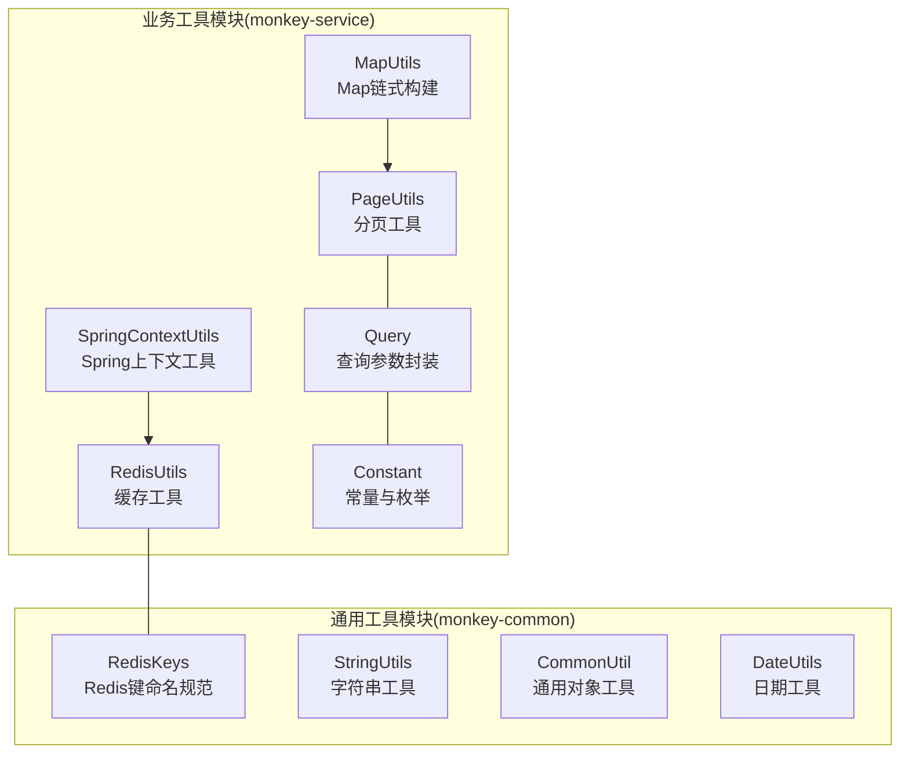
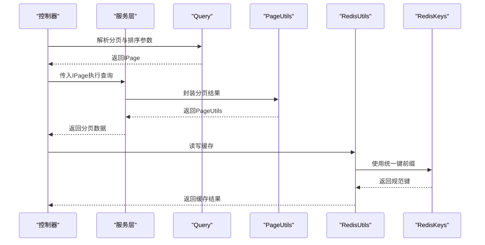
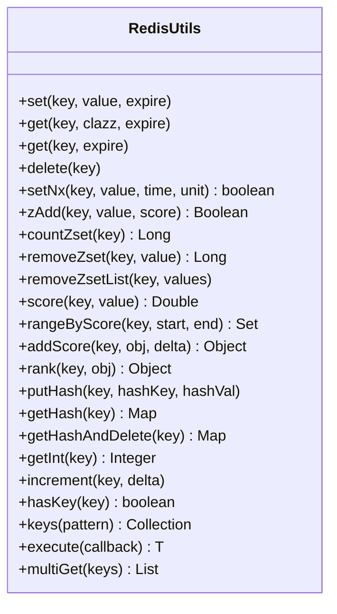
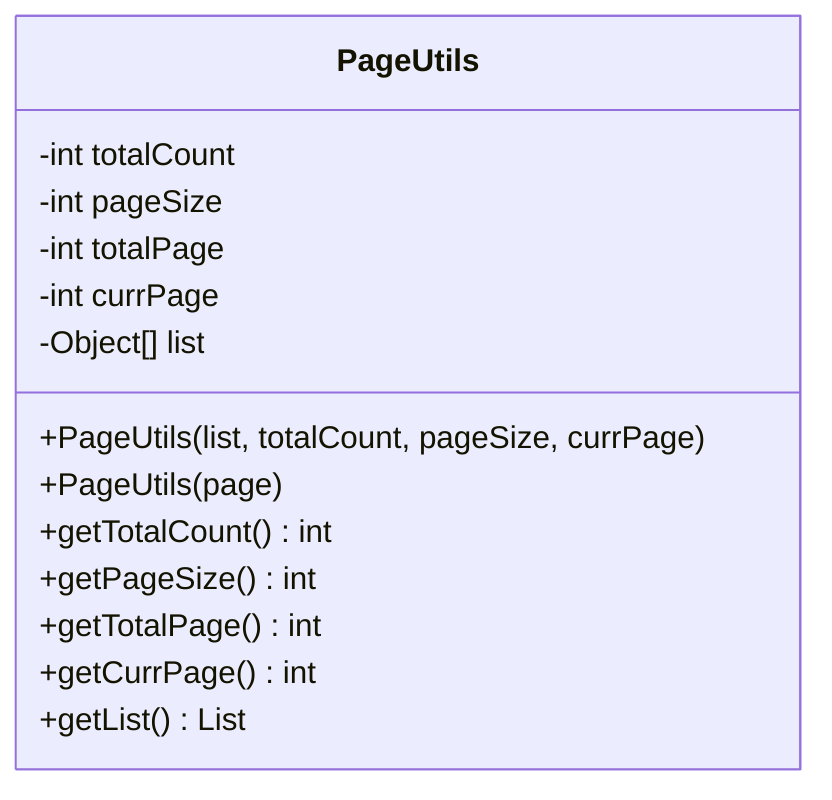
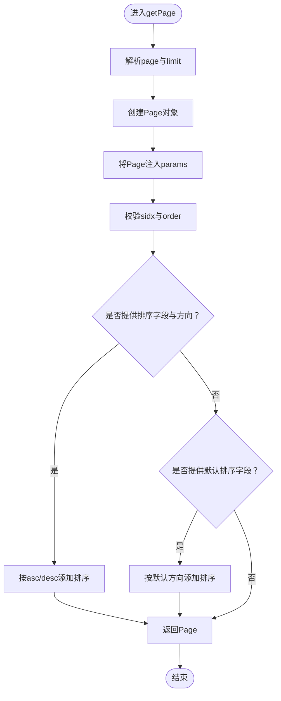
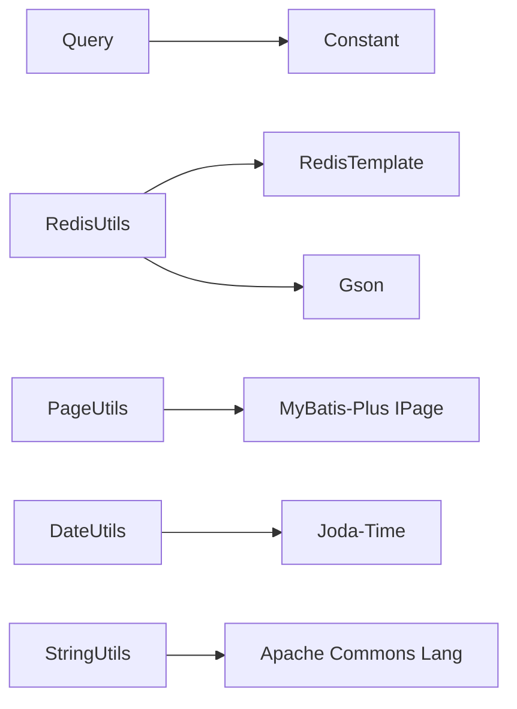

# 通用工具模块

<cite>
**本文引用的文件**
- [RedisUtils.java](file://monkey-service/src/main/java/com/monkey/general/common/utils/RedisUtils.java)
- [PageUtils.java](file://monkey-service/src/main/java/com/monkey/general/common/utils/PageUtils.java)
- [Query.java](file://monkey-service/src/main/java/com/monkey/general/common/utils/Query.java)
- [Constant.java](file://monkey-service/src/main/java/com/monkey/general/common/utils/Constant.java)
- [RedisKeys.java](file://monkey-common/src/main/java/com/monkey/general/common/utils/RedisKeys.java)
- [StringUtils.java](file://monkey-common/src/main/java/com/monkey/general/common/utils/StringUtils.java)
- [CommonUtil.java](file://monkey-common/src/main/java/com/monkey/general/common/utils/CommonUtil.java)
- [DateUtils.java](file://monkey-common/src/main/java/com/monkey/general/common/utils/DateUtils.java)
- [SpringContextUtils.java](file://monkey-service/src/main/java/com/monkey/general/common/utils/SpringContextUtils.java)
- [MapUtils.java](file://monkey-service/src/main/java/com/monkey/general/common/utils/MapUtils.java)
</cite>

## 目录
1. [简介](#简介)
2. [项目结构](#项目结构)
3. [核心组件](#核心组件)
4. [架构总览](#架构总览)
5. [详细组件分析](#详细组件分析)
6. [依赖分析](#依赖分析)
7. [性能考虑](#性能考虑)
8. [故障排查指南](#故障排查指南)
9. [结论](#结论)
10. [附录](#附录)

## 简介
本文件系统性梳理业务服务层的通用工具模块，重点覆盖以下核心工具类：
- 缓存工具：RedisUtils
- 分页工具：PageUtils
- 查询参数封装：Query
- 常量与枚举：Constant
- Redis键命名规范：RedisKeys
- 字符串与日期工具：StringUtils、DateUtils
- 通用对象工具：CommonUtil
- Spring上下文工具：SpringContextUtils
- Map链式构建：MapUtils

文档从设计目标、功能特性、使用方法、异常与边界处理、性能与扩展建议等方面进行全面阐述，并提供流程图与类图帮助理解。

## 项目结构
通用工具模块主要分布在两个子工程中：
- monkey-service：包含业务侧常用工具类（RedisUtils、PageUtils、Query、SpringContextUtils、MapUtils 等）
- monkey-common：包含跨模块复用的通用工具类（RedisKeys、StringUtils、CommonUtil、DateUtils 等）

图表来源
- [RedisUtils.java:1-305](file://monkey-service/src/main/java/com/monkey/general/common/utils/RedisUtils.java#L1-L305)
- [PageUtils.java:1-103](file://monkey-service/src/main/java/com/monkey/general/common/utils/PageUtils.java#L1-L103)
- [Query.java:1-72](file://monkey-service/src/main/java/com/monkey/general/common/utils/Query.java#L1-L72)
- [Constant.java:1-125](file://monkey-service/src/main/java/com/monkey/general/common/utils/Constant.java#L1-L125)
- [RedisKeys.java:1-14](file://monkey-common/src/main/java/com/monkey/general/common/utils/RedisKeys.java#L1-L14)
- [StringUtils.java:1-34](file://monkey-common/src/main/java/com/monkey/general/common/utils/StringUtils.java#L1-L34)
- [CommonUtil.java:1-35](file://monkey-common/src/main/java/com/monkey/general/common/utils/CommonUtil.java#L1-L35)
- [DateUtils.java:1-289](file://monkey-common/src/main/java/com/monkey/general/common/utils/DateUtils.java#L1-L289)
- [SpringContextUtils.java:1-51](file://monkey-service/src/main/java/com/monkey/general/common/utils/SpringContextUtils.java#L1-L51)
- [MapUtils.java:1-19](file://monkey-service/src/main/java/com/monkey/general/common/utils/MapUtils.java#L1-L19)

章节来源
- [RedisUtils.java:1-305](file://monkey-service/src/main/java/com/monkey/general/common/utils/RedisUtils.java#L1-L305)
- [PageUtils.java:1-103](file://monkey-service/src/main/java/com/monkey/general/common/utils/PageUtils.java#L1-L103)
- [Query.java:1-72](file://monkey-service/src/main/java/com/monkey/general/common/utils/Query.java#L1-L72)
- [Constant.java:1-125](file://monkey-service/src/main/java/com/monkey/general/common/utils/Constant.java#L1-L125)
- [RedisKeys.java:1-14](file://monkey-common/src/main/java/com/monkey/general/common/utils/RedisKeys.java#L1-L14)
- [StringUtils.java:1-34](file://monkey-common/src/main/java/com/monkey/general/common/utils/StringUtils.java#L1-L34)
- [CommonUtil.java:1-35](file://monkey-common/src/main/java/com/monkey/general/common/utils/CommonUtil.java#L1-L35)
- [DateUtils.java:1-289](file://monkey-common/src/main/java/com/monkey/general/common/utils/DateUtils.java#L1-L289)
- [SpringContextUtils.java:1-51](file://monkey-service/src/main/java/com/monkey/general/common/utils/SpringContextUtils.java#L1-L51)
- [MapUtils.java:1-19](file://monkey-service/src/main/java/com/monkey/general/common/utils/MapUtils.java#L1-L19)

## 核心组件
- RedisUtils：基于RedisTemplate封装常用缓存操作，支持字符串、哈希、有序集合、原子计数、批量读取、原生命令执行等；提供默认过期策略与JSON序列化辅助。
- PageUtils：封装分页结果集，兼容MyBatis-Plus IPage，便于控制器统一返回分页数据。
- Query：从请求参数解析分页、排序字段与方向，内置SQL注入防护，支持默认排序。
- Constant：集中管理分页、排序、定时任务状态、云服务等常量与枚举。
- RedisKeys：统一Redis键命名规范，避免冲突。
- StringUtils：字符串分割与空白检测等基础能力。
- CommonUtil：反射设置对象空字段默认值，减少空指针与条件分支。
- DateUtils：日期格式化、区间计算、时间段生成等。
- SpringContextUtils：获取Spring容器中的Bean，便于非注解场景使用。
- MapUtils：继承HashMap，提供链式put，简化构造参数Map。

章节来源
- [RedisUtils.java:1-305](file://monkey-service/src/main/java/com/monkey/general/common/utils/RedisUtils.java#L1-L305)
- [PageUtils.java:1-103](file://monkey-service/src/main/java/com/monkey/general/common/utils/PageUtils.java#L1-L103)
- [Query.java:1-72](file://monkey-service/src/main/java/com/monkey/general/common/utils/Query.java#L1-L72)
- [Constant.java:1-125](file://monkey-service/src/main/java/com/monkey/general/common/utils/Constant.java#L1-L125)
- [RedisKeys.java:1-14](file://monkey-common/src/main/java/com/monkey/general/common/utils/RedisKeys.java#L1-L14)
- [StringUtils.java:1-34](file://monkey-common/src/main/java/com/monkey/general/common/utils/StringUtils.java#L1-L34)
- [CommonUtil.java:1-35](file://monkey-common/src/main/java/com/monkey/general/common/utils/CommonUtil.java#L1-L35)
- [DateUtils.java:1-289](file://monkey-common/src/main/java/com/monkey/general/common/utils/DateUtils.java#L1-L289)
- [SpringContextUtils.java:1-51](file://monkey-service/src/main/java/com/monkey/general/common/utils/SpringContextUtils.java#L1-L51)
- [MapUtils.java:1-19](file://monkey-service/src/main/java/com/monkey/general/common/utils/MapUtils.java#L1-L19)

## 架构总览
通用工具模块在业务层的典型交互路径如下：
- 控制器接收请求参数，交由Query解析分页与排序
- Service层按Query生成的IPage执行查询，结合PageUtils封装结果
- 缓存相关操作通过RedisUtils完成，键名遵循RedisKeys规范
- 非注解场景通过SpringContextUtils获取Bean实例
- MapUtils用于快速构造参数Map，提升可读性

图表来源
- [Query.java:1-72](file://monkey-service/src/main/java/com/monkey/general/common/utils/Query.java#L1-L72)
- [PageUtils.java:1-103](file://monkey-service/src/main/java/com/monkey/general/common/utils/PageUtils.java#L1-L103)
- [RedisUtils.java:1-305](file://monkey-service/src/main/java/com/monkey/general/common/utils/RedisUtils.java#L1-L305)
- [RedisKeys.java:1-14](file://monkey-common/src/main/java/com/monkey/general/common/utils/RedisKeys.java#L1-L14)

## 详细组件分析

### RedisUtils 缓存工具
- 设计要点
  - 注入指定名称的RedisTemplate与ValueOperations，确保序列化策略一致
  - 提供字符串KV、JSON序列化、过期控制、分布式锁NX、有序集合ZSet、哈希Hash、原子计数、批量读取、原生命令执行等能力
  - 默认过期时间与永不过期常量，便于统一管理
- 关键方法与行为
  - set/get/delete：支持带过期与默认过期策略
  - setNx：基于setIfAbsent实现分布式锁
  - zAdd/countZset/removeZset/rangeByScore/addScore/rank：有序集合常用操作
  - putHash/getHash/getHashAndDelete：哈希读写与迁移
  - getInt/increment：整型计数
  - hasKey/keys/execute/multiGet：存在性检查、模糊匹配、原生命令、批量读取
- 参数与返回
  - setNx：key、value、time、timeUnit；返回布尔
  - zAdd：key、value、score；返回布尔
  - rangeByScore：key、start、end；返回元素集合
  - multiGet：keys集合；返回值集合
- 异常与边界
  - JSON序列化仅对复杂对象生效，基本类型直接转字符串
  - keys在生产环境不建议使用，可能造成阻塞
  - multiGet对空集合返回空列表，避免NPE
- 最佳实践
  - 明确过期策略，避免缓存雪崩与穿透
  - 使用RedisKeys统一键前缀
  - 对热点数据采用多级缓存与互斥更新
- 应用场景
  - 设备令牌缓存、配置项缓存、会话信息缓存、有序队列统计

图表来源
- [RedisUtils.java:1-305](file://monkey-service/src/main/java/com/monkey/general/common/utils/RedisUtils.java#L1-L305)

章节来源
- [RedisUtils.java:1-305](file://monkey-service/src/main/java/com/monkey/general/common/utils/RedisUtils.java#L1-L305)
- [RedisKeys.java:1-14](file://monkey-common/src/main/java/com/monkey/general/common/utils/RedisKeys.java#L1-L14)

### PageUtils 分页工具
- 设计要点
  - 封装总记录数、每页大小、总页数、当前页、列表数据
  - 支持直接从IPage构造，适配MyBatis-Plus分页结果
- 关键方法与行为
  - 构造函数：支持List+总数+分页参数或IPage
  - getter/setter：提供全部字段访问
- 参数与返回
  - IPage构造：自动填充各字段
- 异常与边界
  - totalPage使用向上取整，保证最后一页非空
- 最佳实践
  - 控制每页最大条数，避免超大数据量
  - 与Query配合，统一排序与过滤
- 应用场景
  - 列表查询统一返回结构，前端稳定消费

图表来源
- [PageUtils.java:1-103](file://monkey-service/src/main/java/com/monkey/general/common/utils/PageUtils.java#L1-L103)

章节来源
- [PageUtils.java:1-103](file://monkey-service/src/main/java/com/monkey/general/common/utils/PageUtils.java#L1-L103)

### Query 查询参数封装
- 设计要点
  - 从请求参数解析page、limit、sidx、order
  - 内置SQL注入防护，对排序字段与方向进行白名单校验
  - 支持默认排序字段与方向
- 关键方法与行为
  - getPage(params)：解析分页与排序
  - 支持重载：指定默认排序字段与方向
- 参数与返回
  - params：page、limit、sidx、order
  - 返回IPage并注入到params中，便于后续查询
- 异常与边界
  - sidx/order经SQLFilter处理，避免拼接SQL注入
  - 未提供排序字段时可选择不排序或应用默认排序
- 最佳实践
  - 为列表接口提供明确的默认排序，提升一致性
  - 对外部输入严格校验，避免异常参数
- 应用场景
  - 所有需要分页与排序的列表查询

图表来源
- [Query.java:1-72](file://monkey-service/src/main/java/com/monkey/general/common/utils/Query.java#L1-L72)
- [Constant.java:1-125](file://monkey-service/src/main/java/com/monkey/general/common/utils/Constant.java#L1-L125)

章节来源
- [Query.java:1-72](file://monkey-service/src/main/java/com/monkey/general/common/utils/Query.java#L1-L72)
- [Constant.java:1-125](file://monkey-service/src/main/java/com/monkey/general/common/utils/Constant.java#L1-L125)

### 常量与枚举 Constant
- 设计要点
  - 统一分页参数键名、排序键名、升序标识
  - 定时任务状态、菜单类型、云服务商等枚举
- 使用建议
  - 与Query配合，避免硬编码键名
  - 枚举值用于状态机与权限控制

章节来源
- [Constant.java:1-125](file://monkey-service/src/main/java/com/monkey/general/common/utils/Constant.java#L1-L125)

### RedisKeys 键命名规范
- 设计要点
  - 统一前缀，避免键冲突
- 使用建议
  - 与业务域结合，形成“域:子域:键”的层级结构

章节来源
- [RedisKeys.java:1-14](file://monkey-common/src/main/java/com/monkey/general/common/utils/RedisKeys.java#L1-L14)

### StringUtils 字符串工具
- 设计要点
  - 字符串按固定长度拆分
  - 空白字符检测
- 使用建议
  - 输入清洗与格式化输出

章节来源
- [StringUtils.java:1-34](file://monkey-common/src/main/java/com/monkey/general/common/utils/StringUtils.java#L1-L34)

### CommonUtil 对象工具
- 设计要点
  - 反射设置空字段默认值（String/Integer/BigDecimal）
- 使用建议
  - 在DTO/VO初始化阶段使用，减少判空逻辑

章节来源
- [CommonUtil.java:1-35](file://monkey-common/src/main/java/com/monkey/general/common/utils/CommonUtil.java#L1-L35)

### DateUtils 日期工具
- 设计要点
  - 多种日期格式常量
  - 日期加减（秒/分/时/天/周/月/年）
  - 周起止日期计算、24小时前时间、小时段区间生成、字符串转日期
- 使用建议
  - 统一格式化与时区处理
  - 区间计算使用Joda-Time以提升可读性

章节来源
- [DateUtils.java:1-289](file://monkey-common/src/main/java/com/monkey/general/common/utils/DateUtils.java#L1-L289)

### SpringContextUtils Spring上下文工具
- 设计要点
  - 实现ApplicationContextAware，静态持有ApplicationContext
  - 提供getBean多种重载
- 使用建议
  - 仅在无法使用@Autowired的场景使用，优先使用依赖注入

章节来源
- [SpringContextUtils.java:1-51](file://monkey-service/src/main/java/com/monkey/general/common/utils/SpringContextUtils.java#L1-L51)

### MapUtils Map链式构建
- 设计要点
  - 继承HashMap，重写put返回this，支持链式调用
- 使用建议
  - 构造查询参数Map时提升可读性

章节来源
- [MapUtils.java:1-19](file://monkey-service/src/main/java/com/monkey/general/common/utils/MapUtils.java#L1-L19)

## 依赖分析
- 内聚性
  - 各工具类职责单一，内聚度高
- 耦合性
  - Query依赖Constant与SQLFilter（来自其他包），RedisUtils依赖RedisTemplate与Gson
  - PageUtils与MyBatis-Plus耦合，但仅作为结果封装
- 外部依赖
  - RedisTemplate、Gson、Joda-Time、Apache Commons Lang
- 循环依赖
  - 未发现循环依赖

图表来源
- [Query.java:1-72](file://monkey-service/src/main/java/com/monkey/general/common/utils/Query.java#L1-L72)
- [Constant.java:1-125](file://monkey-service/src/main/java/com/monkey/general/common/utils/Constant.java#L1-L125)
- [RedisUtils.java:1-305](file://monkey-service/src/main/java/com/monkey/general/common/utils/RedisUtils.java#L1-L305)
- [PageUtils.java:1-103](file://monkey-service/src/main/java/com/monkey/general/common/utils/PageUtils.java#L1-L103)
- [DateUtils.java:1-289](file://monkey-common/src/main/java/com/monkey/general/common/utils/DateUtils.java#L1-L289)
- [StringUtils.java:1-34](file://monkey-common/src/main/java/com/monkey/general/common/utils/StringUtils.java#L1-L34)

章节来源
- [Query.java:1-72](file://monkey-service/src/main/java/com/monkey/general/common/utils/Query.java#L1-L72)
- [Constant.java:1-125](file://monkey-service/src/main/java/com/monkey/general/common/utils/Constant.java#L1-L125)
- [RedisUtils.java:1-305](file://monkey-service/src/main/java/com/monkey/general/common/utils/RedisUtils.java#L1-L305)
- [PageUtils.java:1-103](file://monkey-service/src/main/java/com/monkey/general/common/utils/PageUtils.java#L1-L103)
- [DateUtils.java:1-289](file://monkey-common/src/main/java/com/monkey/general/common/utils/DateUtils.java#L1-L289)
- [StringUtils.java:1-34](file://monkey-common/src/main/java/com/monkey/general/common/utils/StringUtils.java#L1-L34)

## 性能考虑
- Redis缓存
  - 合理设置过期时间，避免缓存击穿与雪崩
  - 对热点键使用本地缓存与互斥更新
  - 批量读取使用multiGet，减少RTT
- 分页与排序
  - 控制每页最大条数，避免大偏移量导致慢查询
  - 为高频查询建立合适索引，避免全表扫描
- 序列化
  - 复杂对象使用Gson序列化，注意字段可见性与类型安全
- 日期计算
  - 使用Joda-Time进行区间计算，避免频繁格式化带来的开销

## 故障排查指南
- RedisKeys键冲突
  - 检查键前缀是否符合“域:子域:键”规范
- 分页异常
  - 确认page与limit参数是否越界或为空
  - 检查默认排序字段是否正确
- SQL注入防护
  - 确保排序字段来源于受控列表，避免拼接非法SQL
- 缓存失效
  - 检查过期时间设置与键空间清理策略
- 反射设置默认值失败
  - 确认字段类型匹配与访问权限

章节来源
- [RedisKeys.java:1-14](file://monkey-common/src/main/java/com/monkey/general/common/utils/RedisKeys.java#L1-L14)
- [Query.java:1-72](file://monkey-service/src/main/java/com/monkey/general/common/utils/Query.java#L1-L72)
- [PageUtils.java:1-103](file://monkey-service/src/main/java/com/monkey/general/common/utils/PageUtils.java#L1-L103)
- [RedisUtils.java:1-305](file://monkey-service/src/main/java/com/monkey/general/common/utils/RedisUtils.java#L1-L305)
- [CommonUtil.java:1-35](file://monkey-common/src/main/java/com/monkey/general/common/utils/CommonUtil.java#L1-L35)

## 结论
通用工具模块通过职责清晰、内聚度高的工具类，显著提升了业务开发效率与一致性。RedisUtils提供了完善的缓存能力，PageUtils与Query统一了分页与排序，RedisKeys、StringUtils、DateUtils、CommonUtil等进一步完善了基础设施。建议在新需求中优先复用这些工具类，并在必要时遵循现有模式扩展新的工具类。

## 附录
- 扩展方法与自定义工具开发指南
  - 命名规范：与现有工具类保持一致的命名风格
  - 职责单一：每个工具类只解决一类问题
  - 参数与返回：明确参数类型、默认值与异常处理
  - 测试覆盖：为关键路径编写单元测试
  - 文档同步：在README或内部Wiki补充使用说明