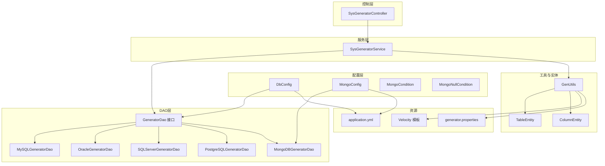
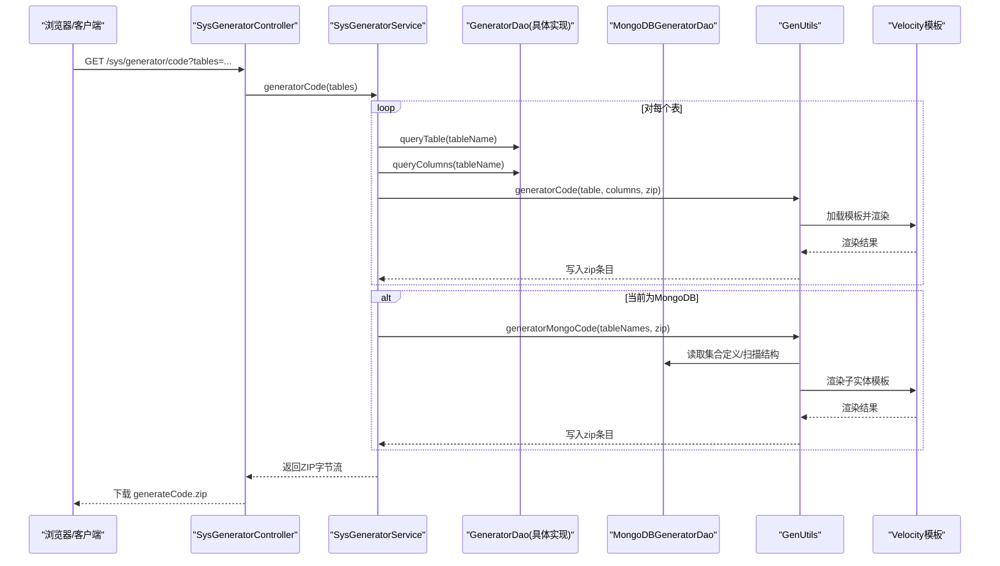
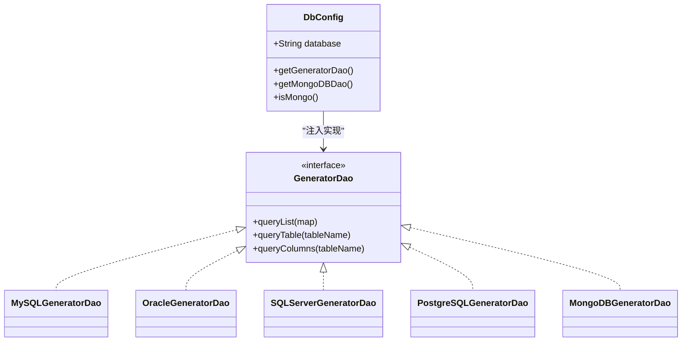
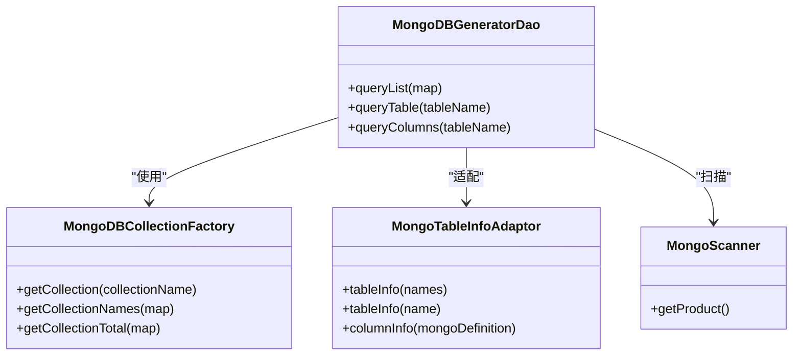
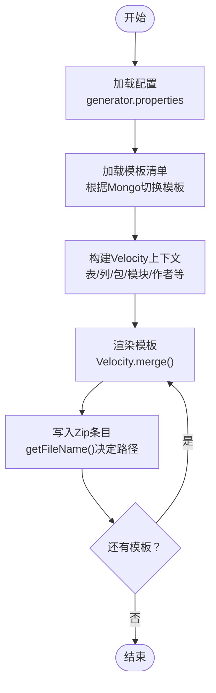
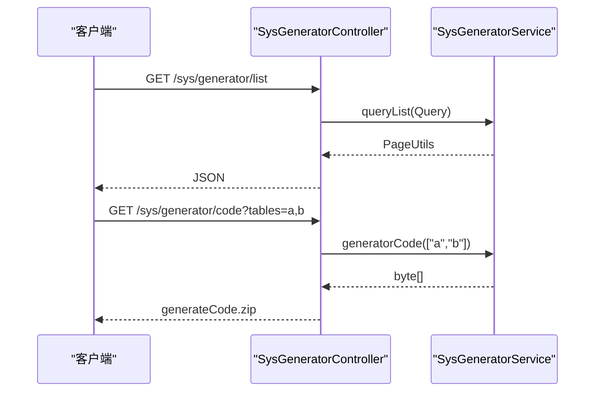
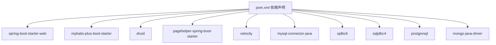

# 代码生成器模块

<cite>
**本文引用的文件**
- [MonkeyCodeGeneratorApplication.java](file://monkey-code-generator/src/main/java/com/monkey/MonkeyCodeGeneratorApplication.java)
- [SysGeneratorController.java](file://monkey-code-generator/src/main/java/com/monkey/controller/SysGeneratorController.java)
- [SysGeneratorService.java](file://monkey-code-generator/src/main/java/com/monkey/service/SysGeneratorService.java)
- [DbConfig.java](file://monkey-code-generator/src/main/java/com/monkey/config/DbConfig.java)
- [MongoConfig.java](file://monkey-code-generator/src/main/java/com/monkey/config/MongoConfig.java)
- [MongoManager.java](file://monkey-code-generator/src/main/java/com/monkey/config/MongoManager.java)
- [MongoCondition.java](file://monkey-code-generator/src/main/java/com/monkey/config/MongoCondition.java)
- [MongoNullCondition.java](file://monkey-code-generator/src/main/java/com/monkey/config/MongoNullCondition.java)
- [MongoDBCollectionFactory.java](file://monkey-code-generator/src/main/java/com/monkey/factory/MongoDBCollectionFactory.java)
- [MongoTableInfoAdaptor.java](file://monkey-code-generator/src/main/java/com/monkey/adaptor/MongoTableInfoAdaptor.java)
- [GeneratorDao.java](file://monkey-code-generator/src/main/java/com/monkey/dao/GeneratorDao.java)
- [MySQLGeneratorDao.java](file://monkey-code-generator/src/main/java/com/monkey/dao/MySQLGeneratorDao.java)
- [OracleGeneratorDao.java](file://monkey-code-generator/src/main/java/com/monkey/dao/OracleGeneratorDao.java)
- [SQLServerGeneratorDao.java](file://monkey-code-generator/src/main/java/com/monkey/dao/SQLServerGeneratorDao.java)
- [PostgreSQLGeneratorDao.java](file://monkey-code-generator/src/main/java/com/monkey/dao/PostgreSQLGeneratorDao.java)
- [MongoDBGeneratorDao.java](file://monkey-code-generator/src/main/java/com/monkey/dao/MongoDBGeneratorDao.java)
- [MongoScanner.java](file://monkey-code-generator/src/main/java/com/monkey/utils/MongoScanner.java)
- [GenUtils.java](file://monkey-code-generator/src/main/java/com/monkey/utils/GenUtils.java)
- [TableEntity.java](file://monkey-code-generator/src/main/java/com/monkey/common/entity/TableEntity.java)
- [ColumnEntity.java](file://monkey-code-generator/src/main/java/com/monkey/common/entity/ColumnEntity.java)
- [application.yml](file://monkey-code-generator/src/main/resources/application.yml)
- [generator.properties](file://monkey-code-generator/src/main/resources/generator.properties)
- [pom.xml](file://monkey-code-generator/pom.xml)
</cite>

## 目录
1. [简介](#简介)
2. [项目结构](#项目结构)
3. [核心组件](#核心组件)
4. [架构总览](#架构总览)
5. [详细组件分析](#详细组件分析)
6. [依赖分析](#依赖分析)
7. [性能考虑](#性能考虑)
8. [故障排查指南](#故障排查指南)
9. [结论](#结论)
10. [附录](#附录)

## 简介
本模块为“代码生成器”，用于根据数据库表结构或MongoDB集合结构自动生成后端Java代码与前端Vue页面、SQL脚本以及MyBatis映射文件。系统支持多种数据库适配器（MySQL、Oracle、PostgreSQL、SQLServer），并通过条件装配支持MongoDB。模板引擎采用Velocity，模板位于resources/template目录下，开发者可按需定制模板。

## 项目结构
模块采用标准Spring Boot工程结构，主要分为以下层次：
- 控制层：接收HTTP请求，调用服务层生成代码并返回压缩包
- 服务层：负责分页查询表/集合、查询列信息、调用模板引擎生成代码
- DAO层：数据库访问接口，按数据库类型提供不同实现；MongoDB使用独立适配器
- 配置层：数据库类型选择、MongoDB连接配置、条件装配
- 工具与实体：模板渲染、文件命名、表/列模型
- 资源：模板文件、配置文件、静态资源

图表来源
- [SysGeneratorController.java:1-55](file://monkey-code-generator/src/main/java/com/monkey/controller/SysGeneratorController.java#L1-L55)
- [SysGeneratorService.java:1-71](file://monkey-code-generator/src/main/java/com/monkey/service/SysGeneratorService.java#L1-L71)
- [DbConfig.java:1-61](file://monkey-code-generator/src/main/java/com/monkey/config/DbConfig.java#L1-L61)
- [MongoConfig.java:1-90](file://monkey-code-generator/src/main/java/com/monkey/config/MongoConfig.java#L1-L90)
- [MongoDBGeneratorDao.java:1-58](file://monkey-code-generator/src/main/java/com/monkey/dao/MongoDBGeneratorDao.java#L1-L58)
- [GenUtils.java:1-375](file://monkey-code-generator/src/main/java/com/monkey/utils/GenUtils.java#L1-L375)
- [application.yml:1-58](file://monkey-code-generator/src/main/resources/application.yml#L1-L58)
- [generator.properties:1-65](file://monkey-code-generator/src/main/resources/generator.properties#L1-L65)

章节来源
- [SysGeneratorController.java:1-55](file://monkey-code-generator/src/main/java/com/monkey/controller/SysGeneratorController.java#L1-L55)
- [SysGeneratorService.java:1-71](file://monkey-code-generator/src/main/java/com/monkey/service/SysGeneratorService.java#L1-L71)
- [DbConfig.java:1-61](file://monkey-code-generator/src/main/java/com/monkey/config/DbConfig.java#L1-L61)
- [MongoConfig.java:1-90](file://monkey-code-generator/src/main/java/com/monkey/config/MongoConfig.java#L1-L90)
- [application.yml:1-58](file://monkey-code-generator/src/main/resources/application.yml#L1-L58)
- [generator.properties:1-65](file://monkey-code-generator/src/main/resources/generator.properties#L1-L65)

## 核心组件
- 控制器：处理分页列表与生成代码下载请求，返回ZIP压缩包
- 服务层：统一查询表/集合与列信息，协调模板渲染与打包
- DAO层：数据库接口及多数据库实现；MongoDB使用独立适配器
- 配置层：根据配置选择数据库类型；MongoDB连接与条件装配
- 工具层：模板加载与渲染、文件命名策略、MongoDB扫描与适配
- 实体层：表与列的模型对象

章节来源
- [SysGeneratorController.java:1-55](file://monkey-code-generator/src/main/java/com/monkey/controller/SysGeneratorController.java#L1-L55)
- [SysGeneratorService.java:1-71](file://monkey-code-generator/src/main/java/com/monkey/service/SysGeneratorService.java#L1-L71)
- [GeneratorDao.java:1-19](file://monkey-code-generator/src/main/java/com/monkey/dao/GeneratorDao.java#L1-L19)
- [DbConfig.java:1-61](file://monkey-code-generator/src/main/java/com/monkey/config/DbConfig.java#L1-L61)
- [GenUtils.java:1-375](file://monkey-code-generator/src/main/java/com/monkey/utils/GenUtils.java#L1-L375)
- [TableEntity.java:1-83](file://monkey-code-generator/src/main/java/com/monkey/common/entity/TableEntity.java#L1-L83)
- [ColumnEntity.java:1-70](file://monkey-code-generator/src/main/java/com/monkey/common/entity/ColumnEntity.java#L1-L70)

## 架构总览
系统通过配置文件选择数据库类型，DAO层按类型注入对应实现；MongoDB通过条件装配启用。服务层统一调用DAO获取表/列信息，工具层使用Velocity模板渲染生成文件，并打包为ZIP返回给客户端。

图表来源
- [SysGeneratorController.java:43-53](file://monkey-code-generator/src/main/java/com/monkey/controller/SysGeneratorController.java#L43-L53)
- [SysGeneratorService.java:51-69](file://monkey-code-generator/src/main/java/com/monkey/service/SysGeneratorService.java#L51-L69)
- [MongoDBGeneratorDao.java:46-54](file://monkey-code-generator/src/main/java/com/monkey/dao/MongoDBGeneratorDao.java#L46-L54)
- [GenUtils.java:70-185](file://monkey-code-generator/src/main/java/com/monkey/utils/GenUtils.java#L70-L185)

## 详细组件分析

### 数据库适配器与配置
- 数据库类型选择：通过配置项选择数据库类型，支持mysql、oracle、sqlserver、postgresql、mongodb
- 条件装配：非MongoDB时按类型注入对应DAO；MongoDB时注入MongoDBGeneratorDao
- 连接配置：application.yml中提供MySQL示例，其他数据库注释保留；MongoDB连接在MongoConfig中通过@ConfigurationProperties绑定

图表来源
- [DbConfig.java:18-60](file://monkey-code-generator/src/main/java/com/monkey/config/DbConfig.java#L18-L60)
- [GeneratorDao.java:12-18](file://monkey-code-generator/src/main/java/com/monkey/dao/GeneratorDao.java#L12-L18)
- [MySQLGeneratorDao.java:12-16](file://monkey-code-generator/src/main/java/com/monkey/dao/MySQLGeneratorDao.java#L12-L16)
- [OracleGeneratorDao.java](file://monkey-code-generator/src/main/java/com/monkey/dao/OracleGeneratorDao.java)
- [SQLServerGeneratorDao.java](file://monkey-code-generator/src/main/java/com/monkey/dao/SQLServerGeneratorDao.java)
- [PostgreSQLGeneratorDao.java](file://monkey-code-generator/src/main/java/com/monkey/dao/PostgreSQLGeneratorDao.java)
- [MongoDBGeneratorDao.java:21-23](file://monkey-code-generator/src/main/java/com/monkey/dao/MongoDBGeneratorDao.java#L21-L23)

章节来源
- [DbConfig.java:1-61](file://monkey-code-generator/src/main/java/com/monkey/config/DbConfig.java#L1-L61)
- [application.yml:54-58](file://monkey-code-generator/src/main/resources/application.yml#L54-L58)
- [MongoConfig.java:1-90](file://monkey-code-generator/src/main/java/com/monkey/config/MongoConfig.java#L1-L90)

### MongoDB适配器与扫描
- 集合工厂：提供集合名称查询、分页与总数统计，兼容分页插件
- 表信息适配：将MongoDB集合信息适配为关系型表结构
- 列信息适配：将MongoDB字段结构转换为列信息，支持数组与嵌套对象
- 扫描器：当缓存未命中时扫描集合以推断结构

图表来源
- [MongoDBCollectionFactory.java:24-101](file://monkey-code-generator/src/main/java/com/monkey/factory/MongoDBCollectionFactory.java#L24-L101)
- [MongoTableInfoAdaptor.java:17-67](file://monkey-code-generator/src/main/java/com/monkey/adaptor/MongoTableInfoAdaptor.java#L17-L67)
- [MongoDBGeneratorDao.java:23-57](file://monkey-code-generator/src/main/java/com/monkey/dao/MongoDBGeneratorDao.java#L23-L57)
- [MongoScanner.java](file://monkey-code-generator/src/main/java/com/monkey/utils/MongoScanner.java)

章节来源
- [MongoDBCollectionFactory.java:1-102](file://monkey-code-generator/src/main/java/com/monkey/factory/MongoDBCollectionFactory.java#L1-L102)
- [MongoTableInfoAdaptor.java:1-68](file://monkey-code-generator/src/main/java/com/monkey/adaptor/MongoTableInfoAdaptor.java#L1-L68)
- [MongoDBGeneratorDao.java:1-58](file://monkey-code-generator/src/main/java/com/monkey/dao/MongoDBGeneratorDao.java#L1-L58)

### 代码生成流程与模板引擎
- 模板清单：根据是否MongoDB动态调整模板集；MongoDB移除Mapper与SQL相关模板，增加Mongo实体模板
- 渲染上下文：封装表名、注释、主键、列集合、包名、模块名、作者等信息
- 文件命名：依据模板类型与配置生成Java、XML、SQL、Vue文件路径
- 压缩打包：将渲染后的文件写入ZipOutputStream返回

图表来源
- [GenUtils.java:37-59](file://monkey-code-generator/src/main/java/com/monkey/utils/GenUtils.java#L37-L59)
- [GenUtils.java:138-185](file://monkey-code-generator/src/main/java/com/monkey/utils/GenUtils.java#L138-L185)
- [GenUtils.java:321-368](file://monkey-code-generator/src/main/java/com/monkey/utils/GenUtils.java#L321-L368)

章节来源
- [GenUtils.java:1-375](file://monkey-code-generator/src/main/java/com/monkey/utils/GenUtils.java#L1-L375)
- [generator.properties:1-65](file://monkey-code-generator/src/main/resources/generator.properties#L1-L65)

### 控制器与服务层
- 控制器：提供分页列表与生成代码接口，下载ZIP
- 服务层：分页查询、表/列查询、代码生成与Mongo额外实体生成

图表来源
- [SysGeneratorController.java:32-53](file://monkey-code-generator/src/main/java/com/monkey/controller/SysGeneratorController.java#L32-L53)
- [SysGeneratorService.java:32-69](file://monkey-code-generator/src/main/java/com/monkey/service/SysGeneratorService.java#L32-L69)

章节来源
- [SysGeneratorController.java:1-55](file://monkey-code-generator/src/main/java/com/monkey/controller/SysGeneratorController.java#L1-L55)
- [SysGeneratorService.java:1-71](file://monkey-code-generator/src/main/java/com/monkey/service/SysGeneratorService.java#L1-L71)

## 依赖分析
- Maven依赖：Spring Boot Web、MyBatis-Plus Starter、Druid、PageHelper、Apache Commons Lang/IO/Configuration、Fastjson、Velocity、各数据库驱动、Mongo Java Driver
- 运行时依赖：根据generator.database选择DAO实现；MongoDB通过条件装配启用

图表来源
- [pom.xml:35-129](file://monkey-code-generator/pom.xml#L35-L129)

章节来源
- [pom.xml:1-166](file://monkey-code-generator/pom.xml#L1-L166)

## 性能考虑
- 分页查询：使用PageHelper对关系型数据库进行分页；MongoDB集合名称查询通过流式处理与skip/limit实现分页
- 模板渲染：一次性初始化Velocity资源加载器，避免重复初始化开销
- ZIP写入：使用单个ZipOutputStream批量写入，减少IO次数
- MongoDB扫描：仅在缓存缺失时扫描集合，避免重复扫描

## 故障排查指南
- 数据库类型错误：检查配置项generator.database是否为受支持值
- 连接异常：确认application.yml中对应数据库的连接参数正确
- 模板渲染失败：检查模板文件是否存在且编码为UTF-8；查看异常堆栈定位表名
- MongoDB未生效：确认MongoDB连接配置与条件装配；检查isMongo状态

章节来源
- [DbConfig.java:44-45](file://monkey-code-generator/src/main/java/com/monkey/config/DbConfig.java#L44-L45)
- [application.yml:54-58](file://monkey-code-generator/src/main/resources/application.yml#L54-L58)
- [GenUtils.java:181-183](file://monkey-code-generator/src/main/java/com/monkey/utils/GenUtils.java#L181-L183)

## 结论
该代码生成器模块通过清晰的分层设计与条件装配，实现了对多种关系型数据库与MongoDB的统一支持。结合Velocity模板引擎与灵活的配置体系，能够高效生成标准化的后端与前端代码骨架，便于二次开发与扩展。

## 附录

### 支持的数据库类型与适配器
- MySQL：MySQLGeneratorDao
- Oracle：OracleGeneratorDao
- PostgreSQL：PostgreSQLGeneratorDao
- SQLServer：SQLServerGeneratorDao
- MongoDB：MongoDBGeneratorDao（配合MongoDBCollectionFactory、MongoTableInfoAdaptor）

章节来源
- [MySQLGeneratorDao.java:1-17](file://monkey-code-generator/src/main/java/com/monkey/dao/MySQLGeneratorDao.java#L1-L17)
- [OracleGeneratorDao.java](file://monkey-code-generator/src/main/java/com/monkey/dao/OracleGeneratorDao.java)
- [PostgreSQLGeneratorDao.java](file://monkey-code-generator/src/main/java/com/monkey/dao/PostgreSQLGeneratorDao.java)
- [SQLServerGeneratorDao.java](file://monkey-code-generator/src/main/java/com/monkey/dao/SQLServerGeneratorDao.java)
- [MongoDBGeneratorDao.java:1-58](file://monkey-code-generator/src/main/java/com/monkey/dao/MongoDBGeneratorDao.java#L1-L58)

### Velocity模板引擎使用与自定义
- 模板位置：resources/template
- 模板清单：根据是否MongoDB动态调整模板集
- 自定义步骤：
  1) 在resources/template新增.vm文件
  2) 在GenUtils中将新模板加入getTemplates或getMongoChildTemplates
  3) 在模板中使用Velocity变量（如tableName、columns、package、moduleName等）
  4) 使用getFileName规则生成目标文件路径

章节来源
- [GenUtils.java:37-59](file://monkey-code-generator/src/main/java/com/monkey/utils/GenUtils.java#L37-L59)
- [GenUtils.java:167-185](file://monkey-code-generator/src/main/java/com/monkey/utils/GenUtils.java#L167-L185)
- [GenUtils.java:321-368](file://monkey-code-generator/src/main/java/com/monkey/utils/GenUtils.java#L321-L368)

### 配置选项说明
- 数据库连接与类型
  - generator.database：可选值mysql、oracle、sqlserver、postgresql、mongodb
  - spring.datasource.*：数据库连接参数（以MySQL为例）
- 包名与输出
  - mainPath：主包名
  - package：模块包名
  - moduleName：模块名
  - author/email：作者信息
  - tablePrefix：表前缀（用于类名转换）
- 类型映射
  - tinyint、int、decimal等：数据库类型到Java类型的映射
- MongoDB连接（可选）
  - mongodb.host/port/username/password/source/database/auth：MongoDB连接参数

章节来源
- [application.yml:1-58](file://monkey-code-generator/src/main/resources/application.yml#L1-L58)
- [generator.properties:1-65](file://monkey-code-generator/src/main/resources/generator.properties#L1-L65)

### 使用示例
- 访问列表接口：GET /sys/generator/list
- 生成代码：GET /sys/generator/code?tables=表1,表2
- 下载生成的代码包：generateCode.zip

章节来源
- [SysGeneratorController.java:32-53](file://monkey-code-generator/src/main/java/com/monkey/controller/SysGeneratorController.java#L32-L53)

### 扩展开发指南
- 新增数据库类型
  1) 新建Dao接口实现（如XXXGeneratorDao），继承GeneratorDao
  2) 在DbConfig中添加注入与条件判断逻辑
  3) 在application.yml中配置对应数据库连接
- 新增模板
  1) 在resources/template新增.vm文件
  2) 在GenUtils中注册模板路径
  3) 在getFileName中补充文件命名规则
- 集成MongoDB
  1) 在application.yml中启用mongodb配置
  2) 确保MongoConfig与条件装配生效
  3) 如需自定义扫描策略，可在MongoScanner中扩展

章节来源
- [DbConfig.java:31-54](file://monkey-code-generator/src/main/java/com/monkey/config/DbConfig.java#L31-L54)
- [MongoConfig.java:19-51](file://monkey-code-generator/src/main/java/com/monkey/config/MongoConfig.java#L19-L51)
- [GenUtils.java:37-59](file://monkey-code-generator/src/main/java/com/monkey/utils/GenUtils.java#L37-L59)
- [MongoScanner.java](file://monkey-code-generator/src/main/java/com/monkey/utils/MongoScanner.java)