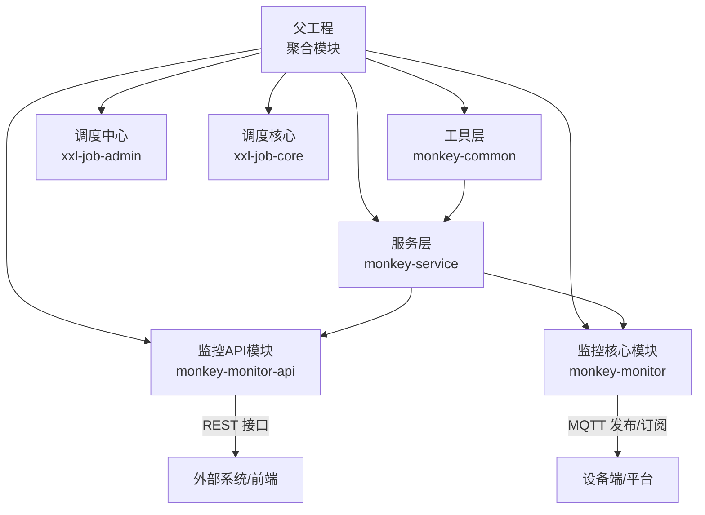
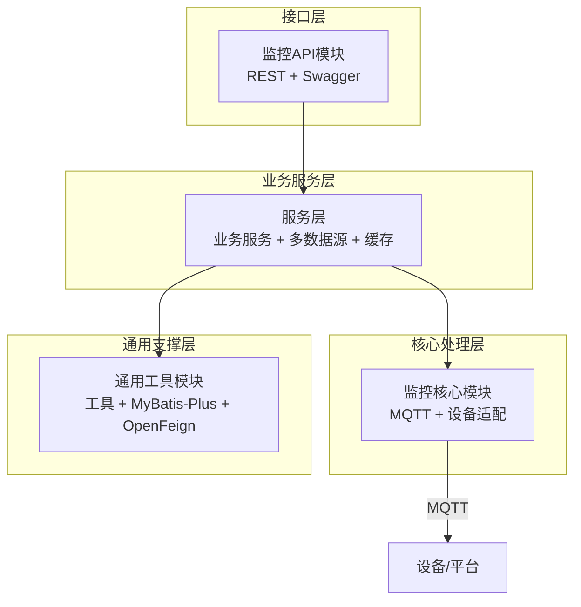
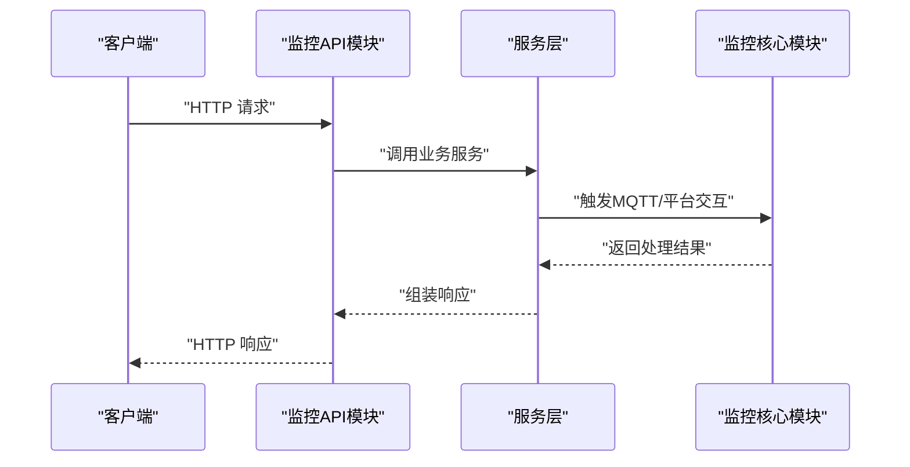
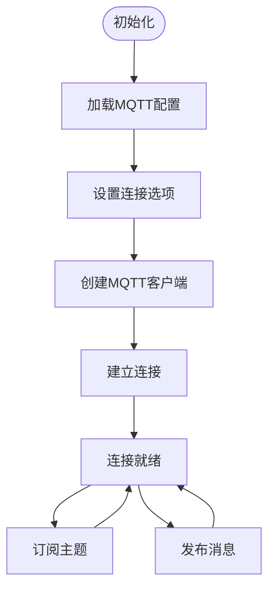
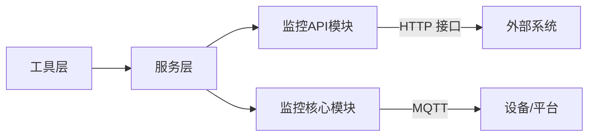

# 核心模块

<cite>
**本文引用的文件**
- [pom.xml（根工程）](file://pom.xml)
- [pom.xml（工具层）](file://monkey-common/pom.xml)
- [pom.xml（服务层）](file://monkey-service/pom.xml)
- [MonkeyMonitorApplication.java](file://monkey-monitor-api/src/main/java/com/monkey/general/MonkeyMonitorApplication.java)
- [SpringBooStartApplication.java](file://monkey-monitor-api/src/main/java/com/monkey/general/annotation/SpringBooStartApplication.java)
- [application.yml（监控API）](file://monkey-monitor-api/src/main/resources/application.yml)
- [MqttConfiguration.java](file://monkey-monitor/src/main/java/com/monkey/general/config/MqttConfiguration.java)
</cite>

## 目录
1. [引言](#引言)
2. [项目结构](#项目结构)
3. [核心组件](#核心组件)
4. [架构总览](#架构总览)
5. [详细组件分析](#详细组件分析)
6. [依赖分析](#依赖分析)
7. [性能考虑](#性能考虑)
8. [故障排查指南](#故障排查指南)
9. [结论](#结论)
10. [附录](#附录)

## 引言
本文件面向安威 fireworks 物联网监控平台的核心模块，系统性梳理监控API模块、监控核心模块（MQTT）、业务服务模块与通用工具模块的设计理念、功能职责、内部结构与相互关系。重点覆盖：
- 监控API模块的RESTful接口设计与启动装配
- 监控核心模块的MQTT通信机制与配置
- 业务服务模块的数据处理与多数据源能力
- 通用工具模块的共享组件与依赖管理
- 模块间依赖关系与数据流转
- 配置项与使用方法
- 扩展指南与最佳实践

## 项目结构
项目采用多模块聚合工程组织，核心模块包括：
- 工具层（monkey-common）：提供通用工具、校验、Excel、MQTT客户端、MyBatis-Plus、OpenFeign等基础能力
- 服务层（monkey-service）：封装业务服务、多数据源、Redis、OSS、MQTT客户端等
- 监控核心模块（monkey-monitor）：MQTT配置、设备适配、视频平台对接、告警处理等
- 监控API模块（monkey-monitor-api）：Spring Boot 启动入口、Swagger、定时任务、控制器等
- 作业调度（xxl-job-*）：独立调度中心与核心库

图表来源
- [pom.xml（根工程）:11-17](file://pom.xml#L11-L17)
- [pom.xml（工具层）:12-18](file://monkey-common/pom.xml#L12-L18)
- [pom.xml（服务层）:12-18](file://monkey-service/pom.xml#L12-L18)

章节来源
- [pom.xml（根工程）:11-17](file://pom.xml#L11-L17)
- [pom.xml（工具层）:12-18](file://monkey-common/pom.xml#L12-L18)
- [pom.xml（服务层）:12-18](file://monkey-service/pom.xml#L12-L18)

## 核心组件
- 监控API模块（monkey-monitor-api）
  - 职责：提供REST接口、Swagger文档、定时任务、统一注解启动器
  - 启动类：应用入口，设置非Headless模式以支持本地图形窗口
  - 注解：聚合@EnableAsync、@EnableScheduling、@EnableSwagger2、自定义@EnableRyFeignClients
- 监控核心模块（monkey-monitor）
  - 职责：MQTT客户端配置、设备协议适配、视频平台对接、数据同步与处理
  - 关键：MqttConfiguration 提供MQTT客户端Bean与连接参数
- 服务层（monkey-service）
  - 职责：业务服务封装、多数据源、Redis缓存、对象存储（OSS）、MQTT客户端
  - 依赖：依赖工具层与外部MQTT客户端
- 通用工具模块（monkey-common）
  - 职责：通用工具、校验、Excel、JSON、二维码、PDF、Swagger、MyBatis-Plus、OpenFeign
  - 依赖：Spring Boot Web、MyBatis-Plus、OpenFeign等

章节来源
- [MonkeyMonitorApplication.java:10-18](file://monkey-monitor-api/src/main/java/com/monkey/general/MonkeyMonitorApplication.java#L10-L18)
- [SpringBooStartApplication.java:15-26](file://monkey-monitor-api/src/main/java/com/monkey/general/annotation/SpringBooStartApplication.java#L15-L26)
- [MqttConfiguration.java:14-53](file://monkey-monitor/src/main/java/com/monkey/general/config/MqttConfiguration.java#L14-L53)
- [pom.xml（工具层）:20-160](file://monkey-common/pom.xml#L20-L160)
- [pom.xml（服务层）:20-88](file://monkey-service/pom.xml#L20-L88)

## 架构总览
整体架构围绕“监控API模块”对外提供HTTP接口，“监控核心模块”通过MQTT与设备/平台交互，“服务层”承载业务与数据访问，“通用工具模块”提供横切能力。

图表来源
- [MonkeyMonitorApplication.java:10-18](file://monkey-monitor-api/src/main/java/com/monkey/general/MonkeyMonitorApplication.java#L10-L18)
- [MqttConfiguration.java:34-50](file://monkey-monitor/src/main/java/com/monkey/general/config/MqttConfiguration.java#L34-L50)
- [pom.xml（工具层）:20-160](file://monkey-common/pom.xml#L20-L160)
- [pom.xml（服务层）:20-88](file://monkey-service/pom.xml#L20-L88)

## 详细组件分析

### 监控API模块（RESTful接口与启动）
- 启动方式
  - 使用自定义注解组合，启用异步、定时、Swagger与Feign客户端
  - 应用入口设置非Headless模式，满足集成大华SDK时需要创建AWT/Swing窗口的场景
- 配置要点
  - 端口、环境、Jackson时区与日期格式、MyBatis-Plus Mapper位置与实体扫描包
- 常见使用场景
  - 对外提供设备、告警、人员统计、算法告警等接口
  - 与调度中心配合执行周期性任务（如数据同步、上传下载）

图表来源
- [SpringBooStartApplication.java:19-22](file://monkey-monitor-api/src/main/java/com/monkey/general/annotation/SpringBooStartApplication.java#L19-L22)
- [application.yml（监控API）:1-40](file://monkey-monitor-api/src/main/resources/application.yml#L1-L40)
- [MqttConfiguration.java:34-50](file://monkey-monitor/src/main/java/com/monkey/general/config/MqttConfiguration.java#L34-L50)

章节来源
- [MonkeyMonitorApplication.java:10-18](file://monkey-monitor-api/src/main/java/com/monkey/general/MonkeyMonitorApplication.java#L10-L18)
- [SpringBooStartApplication.java:15-26](file://monkey-monitor-api/src/main/java/com/monkey/general/annotation/SpringBooStartApplication.java#L15-L26)
- [application.yml（监控API）:1-40](file://monkey-monitor-api/src/main/resources/application.yml#L1-L40)

### 监控核心模块（MQTT通信机制）
- 组件职责
  - 提供MQTT客户端Bean，配置连接参数（主机、用户名、密码、clientId、超时、保活、自动重连、并发限制）
  - 作为消息通道与设备/平台进行双向通信
- 连接流程
  - 读取配置属性
  - 设置连接选项（CleanSession、用户名、密码、超时、保活、自动重连、最大并发）
  - 创建客户端并建立连接
- 数据流
  - 订阅主题：接收设备上报事件
  - 发布主题：下发控制指令或状态查询

图表来源
- [MqttConfiguration.java:20-50](file://monkey-monitor/src/main/java/com/monkey/general/config/MqttConfiguration.java#L20-L50)

章节来源
- [MqttConfiguration.java:14-53](file://monkey-monitor/src/main/java/com/monkey/general/config/MqttConfiguration.java#L14-L53)

### 业务服务模块（数据处理与多数据源）
- 能力概述
  - 封装业务服务，提供统一的DAO/Service层
  - 支持多数据源与Redis缓存
  - 集成MQTT客户端用于与监控核心模块协作
- 依赖关系
  - 依赖工具层提供的通用能力
  - 通过MQTT与监控核心模块交互
- 数据处理逻辑
  - 输入：来自监控核心模块的设备事件或平台推送
  - 处理：清洗、转换、持久化、缓存更新
  - 输出：供监控API模块返回给调用方

章节来源
- [pom.xml（服务层）:20-88](file://monkey-service/pom.xml#L20-L88)

### 通用工具模块（共享组件）
- 能力概述
  - 提供Excel导入导出、二维码生成、JSON处理、时间工具、校验框架、Swagger、MyBatis-Plus、OpenFeign等
- 依赖管理
  - 明确版本与依赖范围，避免冲突
- 适用场景
  - 业务服务与监控API模块复用，减少重复开发

章节来源
- [pom.xml（工具层）:20-160](file://monkey-common/pom.xml#L20-L160)

## 依赖分析
- 模块内聚与耦合
  - 工具层低耦合高内聚，被其他模块广泛复用
  - 服务层对工具层强依赖，弱依赖监控核心模块（仅在需要MQTT时）
  - 监控API模块依赖服务层与监控核心模块
- 外部依赖
  - MQTT客户端（Eclipse Paho）
  - MyBatis-Plus、Redis、OSS SDK
  - Swagger、OpenFeign

图表来源
- [pom.xml（根工程）:11-17](file://pom.xml#L11-L17)
- [pom.xml（工具层）:20-160](file://monkey-common/pom.xml#L20-L160)
- [pom.xml（服务层）:20-88](file://monkey-service/pom.xml#L20-L88)

章节来源
- [pom.xml（根工程）:11-17](file://pom.xml#L11-L17)
- [pom.xml（工具层）:20-160](file://monkey-common/pom.xml#L20-L160)
- [pom.xml（服务层）:20-88](file://monkey-service/pom.xml#L20-L88)

## 性能考虑
- MQTT并发与重连
  - 合理设置最大并发与自动重连，避免连接风暴
  - 保活与超时需结合网络质量调整
- 数据访问
  - MyBatis-Plus开启驼峰映射、关闭二级缓存可降低开销
  - 合理分页与索引提升查询性能
- 缓存策略
  - Redis缓存热点数据，注意过期与淘汰策略
- 异步与定时
  - 使用异步与定时任务处理耗时操作，避免阻塞主线程

## 故障排查指南
- MQTT连接失败
  - 检查配置项是否正确（主机、用户名、密码、clientId、超时、保活）
  - 观察日志输出，确认连接是否成功建立
- 接口异常
  - 查看监控API模块日志与异常栈
  - 校验请求参数与认证信息
- 数据不一致
  - 核对服务层事务边界与多数据源切换
  - 检查MQTT消息是否完整到达与处理

章节来源
- [MqttConfiguration.java:34-50](file://monkey-monitor/src/main/java/com/monkey/general/config/MqttConfiguration.java#L34-L50)
- [application.yml（监控API）:1-40](file://monkey-monitor-api/src/main/resources/application.yml#L1-L40)

## 结论
该系统通过清晰的模块划分与依赖管理，实现了“接口层—核心处理层—业务服务层—通用支撑层”的分层架构。监控API模块负责对外交互，监控核心模块负责MQTT通信，服务层承载业务与数据，通用工具模块提供横切能力。建议在扩展新模块时遵循“低耦合、高内聚、明确边界”的原则，优先复用工具层能力，并通过配置驱动实现灵活扩展。

## 附录

### 配置项与使用方法
- 监控API模块（application.yml）
  - 服务器端口、环境、Jackson时区与日期格式
  - MyBatis-Plus Mapper位置、实体扫描包、逻辑删除配置、元对象处理器
- 监控核心模块（MqttConfiguration）
  - MQTT本地主机、用户名、密码、clientId、超时、保活
  - 连接选项：CleanSession、自动重连、最大并发

章节来源
- [application.yml（监控API）:1-40](file://monkey-monitor-api/src/main/resources/application.yml#L1-L40)
- [MqttConfiguration.java:20-50](file://monkey-monitor/src/main/java/com/monkey/general/config/MqttConfiguration.java#L20-L50)

### 扩展指南
- 新增模块
  - 在根工程中新增子模块，按需引入依赖（如MyBatis-Plus、Redis、MQTT）
  - 如需对外提供接口，参考监控API模块的注解与启动方式
- 修改现有模块
  - 工具层：保持低耦合，避免引入业务逻辑
  - 服务层：通过接口抽象与工厂模式扩展业务能力
  - 监控核心模块：通过配置与主题路由扩展设备协议
- 最佳实践
  - 使用配置文件集中管理参数
  - 通过异步与定时任务处理非实时任务
  - 利用工具层能力统一处理校验、Excel、JSON等