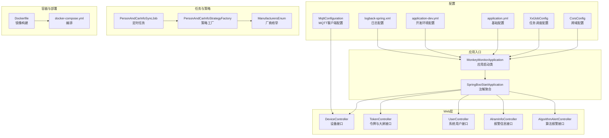
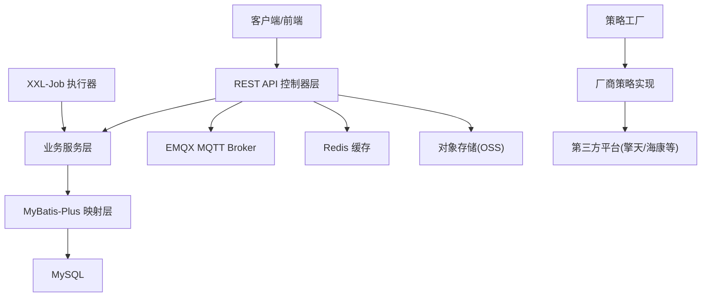
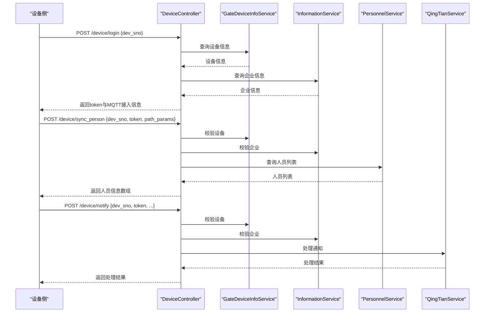
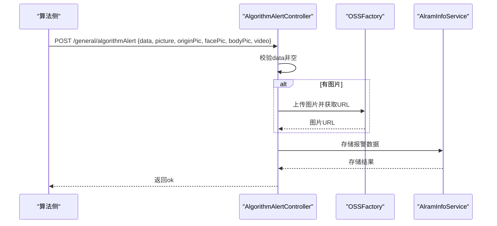
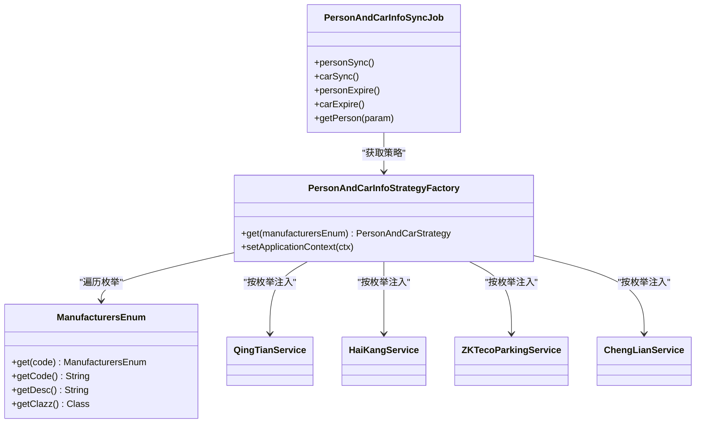
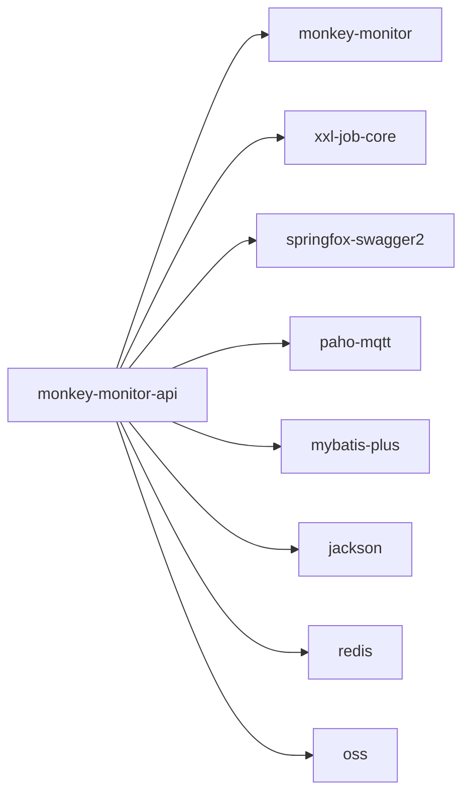

# 监控API模块

<cite>
**本文引用的文件**
- [MonkeyMonitorApplication.java](file://monkey-monitor-api/src/main/java/com/monkey/general/MonkeyMonitorApplication.java)
- [SpringBooStartApplication.java](file://monkey-monitor-api/src/main/java/com/monkey/general/annotation/SpringBooStartApplication.java)
- [CorsConfig.java](file://monkey-monitor-api/src/main/java/com/monkey/general/config/CorsConfig.java)
- [XxlJobConfig.java](file://monkey-monitor-api/src/main/java/com/monkey/general/config/XxlJobConfig.java)
- [application.yml](file://monkey-monitor-api/src/main/resources/application.yml)
- [application-dev.yml](file://monkey-monitor-api/src/main/resources/application-dev.yml)
- [logback-spring.xml](file://monkey-monitor-api/src/main/resources/logback-spring.xml)
- [DeviceController.java](file://monkey-monitor-api/src/main/java/com/monkey/general/controller/DeviceController.java)
- [TokenController.java](file://monkey-monitor-api/src/main/java/com/monkey/general/controller/TokenController.java)
- [UserController.java](file://monkey-monitor-api/src/main/java/com/monkey/general/controller/UserController.java)
- [AlramInfoController.java](file://monkey-monitor-api/src/main/java/com/monkey/general/controller/AlramInfoController.java)
- [AlgorithmAlertController.java](file://monkey-monitor-api/src/main/java/com/monkey/general/controller/AlgorithmAlertController.java)
- [PersonAndCarInfoSyncJob.java](file://monkey-monitor-api/src/main/java/com/monkey/general/job/PersonAndCarInfoSyncJob.java)
- [PersonAndCarInfoStrategyFactory.java](file://monkey-monitor-api/src/main/java/com/monkey/general/factory/PersonAndCarInfoStrategyFactory.java)
- [ManufacturersEnum.java](file://monkey-monitor-api/src/main/java/com/monkey/general/enums/ManufacturersEnum.java)
- [MqttConfiguration.java](file://monkey-monitor/monkey-monitor/src/main/java/com/monkey/general/config/MqttConfiguration.java)
- [docker-compose.yml](file://deploy/docker-compose.yml)
- [Dockerfile](file://monkey-monitor-api/Dockerfile)
- [pom.xml](file://monkey-monitor-api/pom.xml)
</cite>

## 目录
1. [简介](#简介)
2. [项目结构](#项目结构)
3. [核心组件](#核心组件)
4. [架构总览](#架构总览)
5. [详细组件分析](#详细组件分析)
6. [依赖分析](#依赖分析)
7. [性能考虑](#性能考虑)
8. [故障排查指南](#故障排查指南)
9. [结论](#结论)
10. [附录](#附录)

## 简介
本模块为监控平台的API服务，基于Spring Boot构建，提供设备接入、告警处理、用户认证、数据大屏展示、定时任务调度等能力。模块采用RESTful风格设计，统一响应体封装，结合XXL-Job实现分布式任务调度，并通过MQTT协议与设备侧进行数据交互。同时提供跨域支持、日志配置、环境配置分离等工程化特性。

## 项目结构
模块位于“monkey-monitor-api”，核心目录组织如下：
- config：跨域、任务调度、MQTT等配置类
- controller：REST接口控制器
- job：XXL-Job定时任务处理器
- factory：策略工厂
- enums：厂商枚举
- resources：配置文件、日志配置、Dockerfile、docker-compose编排

图表来源
- [MonkeyMonitorApplication.java:1-20](file://monkey-monitor-api/src/main/java/com/monkey/general/MonkeyMonitorApplication.java#L1-L20)
- [SpringBooStartApplication.java:1-29](file://monkey-monitor-api/src/main/java/com/monkey/general/annotation/SpringBooStartApplication.java#L1-L29)
- [CorsConfig.java:1-22](file://monkey-monitor-api/src/main/java/com/monkey/general/config/CorsConfig.java#L1-L22)
- [XxlJobConfig.java:1-78](file://monkey-monitor-api/src/main/java/com/monkey/general/config/XxlJobConfig.java#L1-L78)
- [MqttConfiguration.java:1-40](file://monkey-monitor/monkey-monitor/src/main/java/com/monkey/general/config/MqttConfiguration.java#L1-L40)
- [application.yml:1-40](file://monkey-monitor-api/src/main/resources/application.yml#L1-L40)
- [application-dev.yml:1-206](file://monkey-monitor-api/src/main/resources/application-dev.yml#L1-L206)
- [logback-spring.xml:1-152](file://monkey-monitor-api/src/main/resources/logback-spring.xml#L1-L152)
- [DeviceController.java:1-266](file://monkey-monitor-api/src/main/java/com/monkey/general/controller/DeviceController.java#L1-L266)
- [TokenController.java:1-350](file://monkey-monitor-api/src/main/java/com/monkey/general/controller/TokenController.java#L1-L350)
- [UserController.java:1-51](file://monkey-monitor-api/src/main/java/com/monkey/general/controller/UserController.java#L1-L51)
- [AlramInfoController.java:1-73](file://monkey-monitor-api/src/main/java/com/monkey/general/controller/AlramInfoController.java#L1-L73)
- [AlgorithmAlertController.java:1-68](file://monkey-monitor-api/src/main/java/com/monkey/general/controller/AlgorithmAlertController.java#L1-L68)
- [PersonAndCarInfoSyncJob.java:1-339](file://monkey-monitor-api/src/main/java/com/monkey/general/job/PersonAndCarInfoSyncJob.java#L1-L339)
- [PersonAndCarInfoStrategyFactory.java:1-37](file://monkey-monitor-api/src/main/java/com/monkey/general/factory/PersonAndCarInfoStrategyFactory.java#L1-L37)
- [ManufacturersEnum.java:1-51](file://monkey-monitor-api/src/main/java/com/monkey/general/enums/ManufacturersEnum.java#L1-L51)
- [Dockerfile:1-5](file://monkey-monitor-api/Dockerfile#L1-L5)
- [docker-compose.yml:50-102](file://deploy/docker-compose.yml#L50-L102)

章节来源
- [MonkeyMonitorApplication.java:1-20](file://monkey-monitor-api/src/main/java/com/monkey/general/MonkeyMonitorApplication.java#L1-L20)
- [application.yml:1-40](file://monkey-monitor-api/src/main/resources/application.yml#L1-L40)
- [application-dev.yml:1-206](file://monkey-monitor-api/src/main/resources/application-dev.yml#L1-L206)

## 核心组件
- 应用启动与注解聚合：通过自定义注解聚合@EnableAsync、@EnableScheduling、@EnableSwagger2、@EnableRyFeignClients与@SpringBootApplication，简化启动类配置。
- 控制器层：提供设备登录、人员同步、报警信息、令牌与大屏、用户信息等REST接口，统一返回封装。
- 配置层：跨域、XXL-Job调度、MQTT客户端、MyBatis-Plus、Jackson时间格式等。
- 定时任务：基于XXL-Job的任务处理器，按厂商策略执行人员/车辆信息同步与到期处理。
- 策略工厂：按厂商枚举动态装配第三方同步策略实现。

章节来源
- [SpringBooStartApplication.java:1-29](file://monkey-monitor-api/src/main/java/com/monkey/general/annotation/SpringBooStartApplication.java#L1-L29)
- [DeviceController.java:1-266](file://monkey-monitor-api/src/main/java/com/monkey/general/controller/DeviceController.java#L1-L266)
- [TokenController.java:1-350](file://monkey-monitor-api/src/main/java/com/monkey/general/controller/TokenController.java#L1-L350)
- [AlramInfoController.java:1-73](file://monkey-monitor-api/src/main/java/com/monkey/general/controller/AlramInfoController.java#L1-L73)
- [XxlJobConfig.java:1-78](file://monkey-monitor-api/src/main/java/com/monkey/general/config/XxlJobConfig.java#L1-L78)
- [PersonAndCarInfoSyncJob.java:1-339](file://monkey-monitor-api/src/main/java/com/monkey/general/job/PersonAndCarInfoSyncJob.java#L1-L339)
- [PersonAndCarInfoStrategyFactory.java:1-37](file://monkey-monitor-api/src/main/java/com/monkey/general/factory/PersonAndCarInfoStrategyFactory.java#L1-L37)
- [ManufacturersEnum.java:1-51](file://monkey-monitor-api/src/main/java/com/monkey/general/enums/ManufacturersEnum.java#L1-L51)

## 架构总览
整体架构围绕“控制器-服务-数据访问-第三方平台”的分层设计，结合XXL-Job实现定时任务，MQTT用于设备侧数据交互，Redis用于临时数据存储，MySQL提供持久化存储。

图表来源
- [DeviceController.java:1-266](file://monkey-monitor-api/src/main/java/com/monkey/general/controller/DeviceController.java#L1-L266)
- [TokenController.java:1-350](file://monkey-monitor-api/src/main/java/com/monkey/general/controller/TokenController.java#L1-L350)
- [AlramInfoController.java:1-73](file://monkey-monitor-api/src/main/java/com/monkey/general/controller/AlramInfoController.java#L1-L73)
- [PersonAndCarInfoSyncJob.java:1-339](file://monkey-monitor-api/src/main/java/com/monkey/general/job/PersonAndCarInfoSyncJob.java#L1-L339)
- [PersonAndCarInfoStrategyFactory.java:1-37](file://monkey-monitor-api/src/main/java/com/monkey/general/factory/PersonAndCarInfoStrategyFactory.java#L1-L37)
- [MqttConfiguration.java:1-40](file://monkey-monitor/monkey-monitor/src/main/java/com/monkey/general/config/MqttConfiguration.java#L1-L40)
- [application-dev.yml:1-206](file://monkey-monitor-api/src/main/resources/application-dev.yml#L1-L206)

## 详细组件分析

### 应用启动与配置
- 启动类：禁用Headless模式以支持某些图形库场景，随后启动Spring应用上下文。
- 注解聚合：集中启用异步、定时、Swagger、Feign客户端与Spring Boot。
- 基础配置：端口、Jackson时间格式、MyBatis-Plus实体扫描、逻辑删除配置、全局元对象处理器。
- 环境配置：开发环境数据库、Redis、MQTT、传感器、四相人员定位、XXL-Job、上传目标等。
- 日志配置：按环境输出到控制台与滚动文件，区分INFO/WARN/ERROR级别。

章节来源
- [MonkeyMonitorApplication.java:1-20](file://monkey-monitor-api/src/main/java/com/monkey/general/MonkeyMonitorApplication.java#L1-L20)
- [SpringBooStartApplication.java:1-29](file://monkey-monitor-api/src/main/java/com/monkey/general/annotation/SpringBooStartApplication.java#L1-L29)
- [application.yml:1-40](file://monkey-monitor-api/src/main/resources/application.yml#L1-L40)
- [application-dev.yml:1-206](file://monkey-monitor-api/src/main/resources/application-dev.yml#L1-L206)
- [logback-spring.xml:1-152](file://monkey-monitor-api/src/main/resources/logback-spring.xml#L1-L152)

### 跨域与任务调度配置
- 跨域：开放所有源、方法、头，允许凭据，预检缓存1小时。
- XXL-Job：从配置读取调度中心地址、令牌、执行器appname、IP/端口、日志路径与保留天数，注入Spring执行器。

章节来源
- [CorsConfig.java:1-22](file://monkey-monitor-api/src/main/java/com/monkey/general/config/CorsConfig.java#L1-L22)
- [XxlJobConfig.java:1-78](file://monkey-monitor-api/src/main/java/com/monkey/general/config/XxlJobConfig.java#L1-L78)

### MQTT配置
- MQTT客户端：基于EMQX配置用户名、密码、超时、保活等参数，用于与设备侧通信。

章节来源
- [MqttConfiguration.java:1-40](file://monkey-monitor/monkey-monitor/src/main/java/com/monkey/general/config/MqttConfiguration.java#L1-L40)

### 设备管理接口
- 设备登录：校验设备编号与企业状态，返回令牌与MQTT接入信息。
- 人员同步：校验设备与企业，按人员ID列表组装人员信息返回。
- 同步结果通知：校验设备与企业后委托第三方服务处理。
- 获取设备人员：将人员信息与人员列表写入Redis缓存。

图表来源
- [DeviceController.java:1-266](file://monkey-monitor-api/src/main/java/com/monkey/general/controller/DeviceController.java#L1-L266)

章节来源
- [DeviceController.java:1-266](file://monkey-monitor-api/src/main/java/com/monkey/general/controller/DeviceController.java#L1-L266)

### 告警处理接口
- 报警信息保存：校验实体，填充公司编码、仓库/仓间编号、时间戳、同步ID等，保存至数据库。
- 算法报警记录：接收JSON数据与图片视频文件，上传至OSS并存储报警记录。

图表来源
- [AlgorithmAlertController.java:1-68](file://monkey-monitor-api/src/main/java/com/monkey/general/controller/AlgorithmAlertController.java#L1-L68)
- [AlramInfoController.java:1-73](file://monkey-monitor-api/src/main/java/com/monkey/general/controller/AlramInfoController.java#L1-L73)

章节来源
- [AlramInfoController.java:1-73](file://monkey-monitor-api/src/main/java/com/monkey/general/controller/AlramInfoController.java#L1-L73)
- [AlgorithmAlertController.java:1-68](file://monkey-monitor-api/src/main/java/com/monkey/general/controller/AlgorithmAlertController.java#L1-L68)

### 用户认证与系统用户接口
- 系统用户信息：根据固定的企业编码查询用户信息，返回角色ID并清除敏感字段。

章节来源
- [UserController.java:1-51](file://monkey-monitor-api/src/main/java/com/monkey/general/controller/UserController.java#L1-L51)

### 数据大屏与令牌接口
- 令牌获取：生成access_token与过期时间，写入Redis缓存。
- 文件上传：接收multipart文件，返回统一响应。
- 多类数据保存：接收JSON字符串，返回统一响应。
- 报警推送列表：返回企业报警数据列表。
- 人员/车辆出入记录保存：参数校验后保存并返回统一响应。

章节来源
- [TokenController.java:1-350](file://monkey-monitor-api/src/main/java/com/monkey/general/controller/TokenController.java#L1-L350)

### 定时任务与策略工厂
- 策略工厂：在应用上下文中收集各厂商策略实现，按枚举获取对应策略。
- 厂商枚举：定义CHENGLIAN、QINGTIAN、ZK、HAIKANG等厂商及对应策略类。
- 人员/车辆同步任务：按企业配置与厂商策略执行新增/删除同步，并批量更新状态。
- 到期处理任务：对过期人员/车辆标记删除并重置同步状态。

图表来源
- [PersonAndCarInfoStrategyFactory.java:1-37](file://monkey-monitor-api/src/main/java/com/monkey/general/factory/PersonAndCarInfoStrategyFactory.java#L1-L37)
- [ManufacturersEnum.java:1-51](file://monkey-monitor-api/src/main/java/com/monkey/general/enums/ManufacturersEnum.java#L1-L51)
- [PersonAndCarInfoSyncJob.java:1-339](file://monkey-monitor-api/src/main/java/com/monkey/general/job/PersonAndCarInfoSyncJob.java#L1-L339)

章节来源
- [PersonAndCarInfoStrategyFactory.java:1-37](file://monkey-monitor-api/src/main/java/com/monkey/general/factory/PersonAndCarInfoStrategyFactory.java#L1-L37)
- [ManufacturersEnum.java:1-51](file://monkey-monitor-api/src/main/java/com/monkey/general/enums/ManufacturersEnum.java#L1-L51)
- [PersonAndCarInfoSyncJob.java:1-339](file://monkey-monitor-api/src/main/java/com/monkey/general/job/PersonAndCarInfoSyncJob.java#L1-L339)

## 依赖分析
- 内部模块依赖：依赖“monkey-monitor”模块，复用设备、告警、人员等实体与服务。
- 第三方依赖：XXL-Job核心、Swagger、Paho MQTT客户端、MyBatis-Plus、Jackson、Redis、OSS等。
- 容器与编排：Dockerfile构建镜像，docker-compose编排应用、调度中心、前端等服务。

图表来源
- [pom.xml:1-59](file://monkey-monitor-api/pom.xml#L1-L59)

章节来源
- [pom.xml:1-59](file://monkey-monitor-api/pom.xml#L1-L59)
- [docker-compose.yml:50-102](file://deploy/docker-compose.yml#L50-L102)
- [Dockerfile:1-5](file://monkey-monitor-api/Dockerfile#L1-L5)

## 性能考虑
- 异步与定时：通过@EnableAsync与@EnableScheduling启用异步与定时任务，降低请求延迟。
- 缓存：Redis用于设备人员缓存与令牌缓存，减少数据库压力。
- 日志分级：生产环境仅输出ERROR级别到控制台，INFO/WARN/ERROR分别落盘，避免过多I/O。
- 任务调度：XXL-Job执行器独立进程，任务参数化与日志路径可配置，便于水平扩展。

章节来源
- [SpringBooStartApplication.java:1-29](file://monkey-monitor-api/src/main/java/com/monkey/general/annotation/SpringBooStartApplication.java#L1-L29)
- [logback-spring.xml:1-152](file://monkey-monitor-api/src/main/resources/logback-spring.xml#L1-L152)
- [XxlJobConfig.java:1-78](file://monkey-monitor-api/src/main/java/com/monkey/general/config/XxlJobConfig.java#L1-L78)
- [application-dev.yml:1-206](file://monkey-monitor-api/src/main/resources/application-dev.yml#L1-L206)

## 故障排查指南
- 启动异常：检查headless配置与JVM参数，确认依赖模块已正确打包。
- 跨域问题：确认CorsConfig中允许的源、方法、头与凭据配置。
- MQTT连接失败：核对application-dev.yml中的MQTT地址、用户名、密码、超时与保活配置。
- 任务未执行：检查XXL-Job配置、调度中心连通性与执行器注册信息。
- 日志定位：查看INFO/WARN/ERROR滚动日志文件，按环境profile输出。

章节来源
- [MonkeyMonitorApplication.java:1-20](file://monkey-monitor-api/src/main/java/com/monkey/general/MonkeyMonitorApplication.java#L1-L20)
- [CorsConfig.java:1-22](file://monkey-monitor-api/src/main/java/com/monkey/general/config/CorsConfig.java#L1-L22)
- [application-dev.yml:1-206](file://monkey-monitor-api/src/main/resources/application-dev.yml#L1-L206)
- [logback-spring.xml:1-152](file://monkey-monitor-api/src/main/resources/logback-spring.xml#L1-L152)
- [XxlJobConfig.java:1-78](file://monkey-monitor-api/src/main/java/com/monkey/general/config/XxlJobConfig.java#L1-L78)

## 结论
监控API模块通过清晰的分层设计与配置聚合，实现了设备接入、告警处理、用户认证、数据大屏与定时任务调度的统一管理。模块具备良好的扩展性与插件化能力，通过策略工厂与厂商枚举可快速接入新的第三方平台；同时提供完善的工程化配置，便于在不同环境中部署与运维。

## 附录

### API接口清单与规范
- 设备管理
  - 登录
    - 方法：POST
    - URL：/device/login
    - 请求体：包含设备编号(dev_sno)
    - 响应：包含code/msg/success/dev_sno/token与mqinfo(host/port/username/password/qos/topic/keepalive)
  - 人员同步
    - 方法：POST
    - URL：/device/sync_person
    - 请求体：包含设备编号(dev_sno)、令牌(token)、路径参数(path_params)中的人员ID列表(person_list)
    - 响应：包含code/msg/success与person_list数组
  - 同步结果通知
    - 方法：POST
    - URL：/device/notify
    - 请求体：包含设备编号(dev_sno)、令牌(token)与业务数据
    - 响应：由第三方服务处理后的结果
  - 获取设备人员
    - 方法：POST
    - URL：/device/get_person_all
    - 请求体：包含令牌(token)、设备编号(dev_sno)与person/person_list
    - 响应：包含code/msg/success

- 告警处理
  - 报警信息保存
    - 方法：POST
    - URL：/alramInfo/save
    - 请求体：报警信息实体(含设备编码、报警类型等)
    - 响应：统一成功响应
  - 算法报警记录
    - 方法：POST
    - URL：/general/algorithmAlert
    - 参数：data(JSON数组)、picture/originPic/facePic/bodyPic/video(可选)
    - 响应：ok

- 用户认证与系统用户
  - 系统用户信息
    - 方法：GET
    - URL：/sys/user/info
    - 响应：用户信息(含角色ID，密码字段置空)

- 数据大屏与令牌
  - 获取令牌
    - 方法：POST
    - URL：/api/Oauth/token
    - 响应：access_token/expires_in/token_type并写入Redis
  - 文件上传
    - 方法：POST
    - URL：/api/common/uploadFile
    - 参数：file(multipart)
    - 响应：统一响应
  - 多类数据保存
    - 方法：POST
    - URL：/api/fire/common/saveInfo*(具体路径见控制器)
    - 请求体：JSON字符串
    - 响应：统一响应
  - 报警推送列表
    - 方法：GET
    - URL：/api/alarmPushList
    - 响应：报警数据列表
  - 人员/车辆出入记录保存
    - 方法：POST
    - URL：/api/personInOutInfo/save 与 /api/carInOutInfo/save
    - 请求体：对应实体
    - 响应：统一成功响应

章节来源
- [DeviceController.java:1-266](file://monkey-monitor-api/src/main/java/com/monkey/general/controller/DeviceController.java#L1-L266)
- [AlramInfoController.java:1-73](file://monkey-monitor-api/src/main/java/com/monkey/general/controller/AlramInfoController.java#L1-L73)
- [AlgorithmAlertController.java:1-68](file://monkey-monitor-api/src/main/java/com/monkey/general/controller/AlgorithmAlertController.java#L1-L68)
- [UserController.java:1-51](file://monkey-monitor-api/src/main/java/com/monkey/general/controller/UserController.java#L1-L51)
- [TokenController.java:1-350](file://monkey-monitor-api/src/main/java/com/monkey/general/controller/TokenController.java#L1-L350)

### 最佳实践
- 统一响应：使用统一响应封装，便于前端处理与错误识别。
- 参数校验：对入参进行必要校验，避免脏数据进入业务流程。
- 缓存策略：合理使用Redis缓存设备人员与令牌，提升接口性能。
- 日志分级：生产环境严格控制日志级别，避免I/O瓶颈。
- 任务拆分：将耗时操作放入XXL-Job，避免阻塞主线程。
- 插件化：通过策略工厂与枚举扩展新厂商，保持代码稳定。