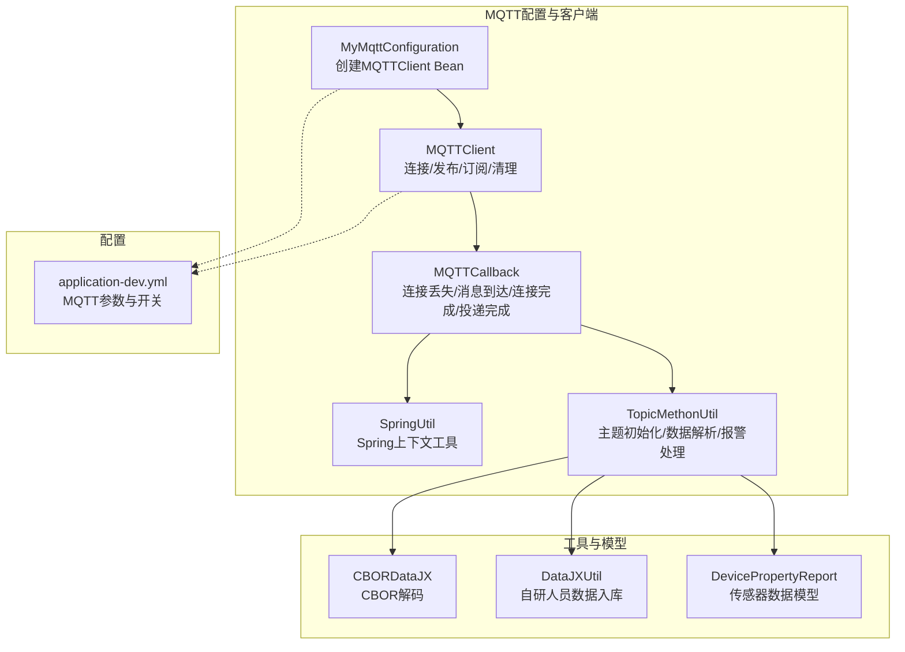
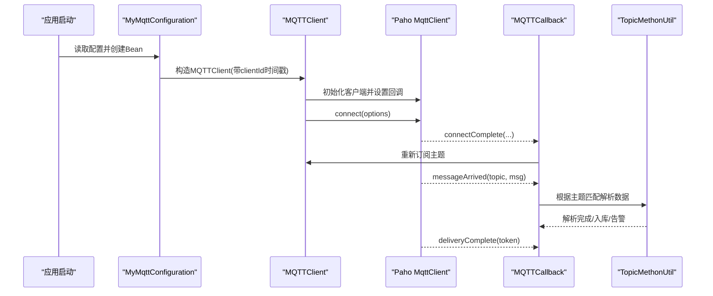
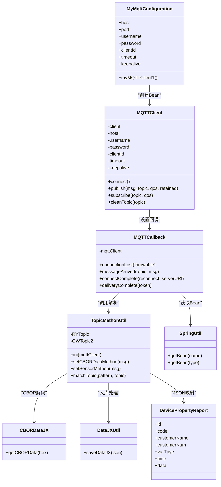

# MQTT通信配置

<cite>
**本文引用的文件**
- [MyMqttConfiguration.java](file://monkey-monitor/src/main/java/com/monkey/general/config/mqtt/MyMqttConfiguration.java)
- [MQTTClient.java](file://monkey-monitor/src/main/java/com/monkey/general/config/mqtt/MQTTClient.java)
- [MQTTCallback.java](file://monkey-monitor/src/main/java/com/monkey/general/config/mqtt/MQTTCallback.java)
- [SpringUtil.java](file://monkey-monitor/src/main/java/com/monkey/general/config/mqtt/SpringUtil.java)
- [TopicMethonUtil.java](file://monkey-monitor/src/main/java/com/monkey/general/config/mqtt/TopicMethonUtil.java)
- [CBORDataJX.java](file://monkey-monitor/src/main/java/com/monkey/general/config/mqtt/util/CBORDataJX.java)
- [DataJXUtil.java](file://monkey-monitor/src/main/java/com/monkey/general/config/mqtt/util/DataJXUtil.java)
- [DevicePropertyReport.java](file://monkey-monitor/src/main/java/com/monkey/general/config/mqtt/vo/DevicePropertyReport.java)
- [application-dev.yml](file://monkey-monitor-api/src/main/resources/application-dev.yml)
</cite>

## 目录
1. [引言](#引言)
2. [项目结构](#项目结构)
3. [核心组件](#核心组件)
4. [架构总览](#架构总览)
5. [详细组件分析](#详细组件分析)
6. [依赖关系分析](#依赖关系分析)
7. [性能考量](#性能考量)
8. [故障排查指南](#故障排查指南)
9. [结论](#结论)
10. [附录](#附录)

## 引言
本文件围绕MQTT通信配置进行系统化说明，重点覆盖以下内容：
- MyMqttConfiguration类的配置机制与参数来源
- MQTTClient的连接管理、重连机制、消息发布与订阅流程
- MQTT回调处理机制与数据解析工具类的使用
- 实际可用的配置示例、主题订阅方法与消息处理流程
- 连接异常处理策略、性能优化建议与常见故障排查

## 项目结构
MQTT相关代码集中在monitor模块的config.mqtt包中，配合若干工具类与配置文件共同完成从连接建立、消息收发到业务数据落库与告警的完整链路。

图表来源
- [MyMqttConfiguration.java:1-58](file://monkey-monitor/src/main/java/com/monkey/general/config/mqtt/MyMqttConfiguration.java#L1-L58)
- [MQTTClient.java:1-139](file://monkey-monitor/src/main/java/com/monkey/general/config/mqtt/MQTTClient.java#L1-L139)
- [MQTTCallback.java:1-127](file://monkey-monitor/src/main/java/com/monkey/general/config/mqtt/MQTTCallback.java#L1-L127)
- [SpringUtil.java:1-143](file://monkey-monitor/src/main/java/com/monkey/general/config/mqtt/SpringUtil.java#L1-L143)
- [TopicMethonUtil.java:1-382](file://monkey-monitor/src/main/java/com/monkey/general/config/mqtt/TopicMethonUtil.java#L1-L382)
- [CBORDataJX.java:1-40](file://monkey-monitor/src/main/java/com/monkey/general/config/mqtt/util/CBORDataJX.java#L1-L40)
- [DataJXUtil.java:1-70](file://monkey-monitor/src/main/java/com/monkey/general/config/mqtt/util/DataJXUtil.java#L1-L70)
- [DevicePropertyReport.java:1-89](file://monkey-monitor/src/main/java/com/monkey/general/config/mqtt/vo/DevicePropertyReport.java#L1-L89)
- [application-dev.yml:33-57](file://monkey-monitor-api/src/main/resources/application-dev.yml#L33-L57)

章节来源
- [MyMqttConfiguration.java:1-58](file://monkey-monitor/src/main/java/com/monkey/general/config/mqtt/MyMqttConfiguration.java#L1-L58)
- [application-dev.yml:33-57](file://monkey-monitor-api/src/main/resources/application-dev.yml#L33-L57)

## 核心组件
- MyMqttConfiguration：负责从配置文件读取MQTT参数，构造MQTTClient并首次尝试连接，同时为客户端ID追加时间戳确保唯一性。
- MQTTClient：封装Paho客户端，提供连接、发布、订阅、取消订阅等能力，并通过回调处理连接状态与消息投递。
- MQTTCallback：实现Paho回调接口，处理连接丢失、消息到达、连接完成、投递完成事件，并在连接完成后重新订阅主题。
- TopicMethonUtil：主题初始化与数据解析的核心工具，负责按主题匹配、解析CBOR或JSON数据、落库与告警。
- CBORDataJX：将16进制CBOR数据转为JSON字符串。
- DataJXUtil：自研人员定位数据入库处理。
- DevicePropertyReport：传感器上报数据的Java模型。
- SpringUtil：提供从Spring容器中获取Bean的能力，供回调中使用。

章节来源
- [MyMqttConfiguration.java:1-58](file://monkey-monitor/src/main/java/com/monkey/general/config/mqtt/MyMqttConfiguration.java#L1-L58)
- [MQTTClient.java:1-139](file://monkey-monitor/src/main/java/com/monkey/general/config/mqtt/MQTTClient.java#L1-L139)
- [MQTTCallback.java:1-127](file://monkey-monitor/src/main/java/com/monkey/general/config/mqtt/MQTTCallback.java#L1-L127)
- [TopicMethonUtil.java:1-382](file://monkey-monitor/src/main/java/com/monkey/general/config/mqtt/TopicMethonUtil.java#L1-L382)
- [CBORDataJX.java:1-40](file://monkey-monitor/src/main/java/com/monkey/general/config/mqtt/util/CBORDataJX.java#L1-L40)
- [DataJXUtil.java:1-70](file://monkey-monitor/src/main/java/com/monkey/general/config/mqtt/util/DataJXUtil.java#L1-L70)
- [DevicePropertyReport.java:1-89](file://monkey-monitor/src/main/java/com/monkey/general/config/mqtt/vo/DevicePropertyReport.java#L1-L89)
- [SpringUtil.java:1-143](file://monkey-monitor/src/main/java/com/monkey/general/config/mqtt/SpringUtil.java#L1-L143)

## 架构总览
MQTT整体工作流如下：
- 应用启动时，MyMqttConfiguration基于配置文件创建MQTTClient并尝试连接。
- MQTTClient初始化Paho客户端并设置回调。
- MQTTCallback在连接丢失时触发重连逻辑；在连接完成后重新订阅主题。
- 收到消息后，回调根据主题匹配调用TopicMethonUtil进行解析与处理。
- TopicMethonUtil内部使用CBORDataJX或JSON模型解析数据，并调用相应服务落库与告警。

图表来源
- [MyMqttConfiguration.java:35-55](file://monkey-monitor/src/main/java/com/monkey/general/config/mqtt/MyMqttConfiguration.java#L35-L55)
- [MQTTClient.java:50-63](file://monkey-monitor/src/main/java/com/monkey/general/config/mqtt/MQTTClient.java#L50-L63)
- [MQTTCallback.java:96-109](file://monkey-monitor/src/main/java/com/monkey/general/config/mqtt/MQTTCallback.java#L96-L109)
- [TopicMethonUtil.java:68-81](file://monkey-monitor/src/main/java/com/monkey/general/config/mqtt/TopicMethonUtil.java#L68-L81)

## 详细组件分析

### MyMqttConfiguration：配置与初始化
- 参数来源
  - 主机地址、端口、用户名、密码、客户端ID、超时时间、保活时间均来自配置文件的mqtt.sensor命名空间。
- 初始化行为
  - 在Bean创建时，为clientId追加当前时间戳，拼接host为tcp://host:port形式。
  - 尝试一次连接，捕获异常并记录日志，短暂休眠后返回客户端实例。
- 配置要点
  - 超时时间与保活时间直接影响连接稳定性与心跳检测频率。
  - 客户端ID唯一性有助于区分不同实例，避免会话冲突。

章节来源
- [MyMqttConfiguration.java:19-32](file://monkey-monitor/src/main/java/com/monkey/general/config/mqtt/MyMqttConfiguration.java#L19-L32)
- [MyMqttConfiguration.java:35-55](file://monkey-monitor/src/main/java/com/monkey/general/config/mqtt/MyMqttConfiguration.java#L35-L55)
- [application-dev.yml:44-51](file://monkey-monitor-api/src/main/resources/application-dev.yml#L44-L51)

### MQTTClient：连接管理与消息处理
- 连接管理
  - 首次连接时创建Paho客户端并设置回调；若已连接则先断开再重连。
  - 通过setMqttConnectOptions统一设置CleanSession、用户名、密码、连接超时、保活间隔与自动重连。
- 发布消息
  - 默认QoS=0、非保留消息；支持指定QoS与保留标志。
  - 发布采用同步等待完成，防止多线程并发导致死锁。
- 订阅与取消订阅
  - 提供订阅与取消订阅方法，便于运行时动态调整订阅集合。
- 性能与健壮性
  - 自动重连开启，减少网络抖动影响。
  - 同步发布避免并发竞争，提高可靠性。

章节来源
- [MQTTClient.java:36-45](file://monkey-monitor/src/main/java/com/monkey/general/config/mqtt/MQTTClient.java#L36-L45)
- [MQTTClient.java:50-63](file://monkey-monitor/src/main/java/com/monkey/general/config/mqtt/MQTTClient.java#L50-L63)
- [MQTTClient.java:83-103](file://monkey-monitor/src/main/java/com/monkey/general/config/mqtt/MQTTClient.java#L83-L103)
- [MQTTClient.java:112-118](file://monkey-monitor/src/main/java/com/monkey/general/config/mqtt/MQTTClient.java#L112-L118)
- [MQTTClient.java:126-136](file://monkey-monitor/src/main/java/com/monkey/general/config/mqtt/MQTTClient.java#L126-L136)

### MQTTCallback：回调处理与重连
- 连接丢失
  - 循环尝试重连，每5秒一次，直到重新连接成功。
  - 重连成功后可在此处重新订阅主题。
- 消息到达
  - 根据预设模式匹配主题，分别调用自研人员定位与传感器数据处理。
  - 调用SendGxInfoUtil与SendInfoHumidityTemperature进行扩展数据上报。
- 连接完成
  - 在此回调中初始化订阅主题，确保每次重连后都能恢复订阅。
- 投递完成
  - 记录投递结果，异常时输出错误日志。

章节来源
- [MQTTCallback.java:32-56](file://monkey-monitor/src/main/java/com/monkey/general/config/mqtt/MQTTCallback.java#L32-L56)
- [MQTTCallback.java:62-89](file://monkey-monitor/src/main/java/com/monkey/general/config/mqtt/MQTTCallback.java#L62-L89)
- [MQTTCallback.java:96-109](file://monkey-monitor/src/main/java/com/monkey/general/config/mqtt/MQTTCallback.java#L96-L109)
- [MQTTCallback.java:117-124](file://monkey-monitor/src/main/java/com/monkey/general/config/mqtt/MQTTCallback.java#L117-L124)

### TopicMethonUtil：主题与数据处理
- 主题初始化
  - 从配置读取RYTopic与GWTopic2，分别订阅自研人员定位与传感器数据主题。
- 数据解析
  - 自研人员定位：将payload转为16进制字符串，交由CBORDataJX解码为JSON，再由DataJXUtil入库。
  - 传感器数据：解析DevicePropertyReport模型，按设备类型分别保存温度、湿度或液位数据，并触发阈值告警。
- 告警与短信
  - 根据阈值比较生成告警内容并落库，支持短信通知（具体发送逻辑由外部组件实现）。
- 主题匹配
  - 支持+与#通配符的简单匹配规则，便于灵活订阅。

章节来源
- [TopicMethonUtil.java:68-81](file://monkey-monitor/src/main/java/com/monkey/general/config/mqtt/TopicMethonUtil.java#L68-L81)
- [TopicMethonUtil.java:87-108](file://monkey-monitor/src/main/java/com/monkey/general/config/mqtt/TopicMethonUtil.java#L87-L108)
- [TopicMethonUtil.java:114-168](file://monkey-monitor/src/main/java/com/monkey/general/config/mqtt/TopicMethonUtil.java#L114-L168)
- [TopicMethonUtil.java:296-324](file://monkey-monitor/src/main/java/com/monkey/general/config/mqtt/TopicMethonUtil.java#L296-L324)

### 工具类与模型
- CBORDataJX：将16进制CBOR数据转为JSON字符串，便于后续解析。
- DataJXUtil：解析自研人员定位数据并入库，更新在线状态。
- DevicePropertyReport：传感器上报数据的标准模型，包含设备编码、客户信息、时间戳与传感器数据列表。

章节来源
- [CBORDataJX.java:15-27](file://monkey-monitor/src/main/java/com/monkey/general/config/mqtt/util/CBORDataJX.java#L15-L27)
- [DataJXUtil.java:28-68](file://monkey-monitor/src/main/java/com/monkey/general/config/mqtt/util/DataJXUtil.java#L28-L68)
- [DevicePropertyReport.java:10-89](file://monkey-monitor/src/main/java/com/monkey/general/config/mqtt/vo/DevicePropertyReport.java#L10-L89)

## 依赖关系分析
- 组件耦合
  - MQTTClient依赖Paho客户端与回调；回调依赖工具类与服务层。
  - TopicMethonUtil依赖服务层与工具类，承担数据解析与落库职责。
- 外部依赖
  - Paho MQTT客户端库用于实际的协议交互。
  - Spring容器提供Bean生命周期与依赖注入。
- 配置依赖
  - MQTT参数与主题配置来源于application-dev.yml，确保运行时可配置。

图表来源
- [MyMqttConfiguration.java:1-58](file://monkey-monitor/src/main/java/com/monkey/general/config/mqtt/MyMqttConfiguration.java#L1-L58)
- [MQTTClient.java:1-139](file://monkey-monitor/src/main/java/com/monkey/general/config/mqtt/MQTTClient.java#L1-L139)
- [MQTTCallback.java:1-127](file://monkey-monitor/src/main/java/com/monkey/general/config/mqtt/MQTTCallback.java#L1-L127)
- [TopicMethonUtil.java:1-382](file://monkey-monitor/src/main/java/com/monkey/general/config/mqtt/TopicMethonUtil.java#L1-L382)
- [CBORDataJX.java:1-40](file://monkey-monitor/src/main/java/com/monkey/general/config/mqtt/util/CBORDataJX.java#L1-L40)
- [DataJXUtil.java:1-70](file://monkey-monitor/src/main/java/com/monkey/general/config/mqtt/util/DataJXUtil.java#L1-L70)
- [DevicePropertyReport.java:1-89](file://monkey-monitor/src/main/java/com/monkey/general/config/mqtt/vo/DevicePropertyReport.java#L1-L89)
- [SpringUtil.java:1-143](file://monkey-monitor/src/main/java/com/monkey/general/config/mqtt/SpringUtil.java#L1-L143)

## 性能考量
- 连接参数
  - 超时时间与保活时间应结合网络状况与业务延迟容忍度设置，避免过短导致频繁重连，过长导致故障发现慢。
- 发布策略
  - 默认QoS=0提升吞吐，若需可靠送达可提升至1或2，但会增加往返与存储开销。
  - 同步等待完成可保证顺序性，但会阻塞线程；在高并发场景建议评估异步策略与背压控制。
- 订阅粒度
  - 使用+与#通配符时需权衡匹配复杂度与内存占用，尽量缩小订阅范围。
- 回调处理
  - 回调中避免长时间阻塞操作，建议将耗时处理放入异步任务队列，保持回调轻量。
- 日志与监控
  - 合理设置日志级别，避免高频日志影响性能；结合指标埋点监控连接成功率、消息延迟与重连次数。

## 故障排查指南
- 连接失败
  - 检查配置文件中的主机、端口、用户名、密码与客户端ID是否正确。
  - 查看连接异常日志，确认网络可达性与Broker状态。
  - 若自动重连未生效，检查setMqttConnectOptions中的自动重连配置。
- 无法收到消息
  - 确认主题是否正确订阅，检查TopicMethonUtil.ini中的主题配置。
  - 核对消息主题是否符合+/#匹配规则，避免因通配符使用不当导致未命中。
- 发布失败
  - 检查发布线程同步逻辑，避免并发publish导致死锁。
  - 关注投递完成回调，若返回未完成，需重试或记录错误。
- 数据解析异常
  - 自研人员定位数据需确认payload为有效CBOR，CBORDataJX解码过程是否报错。
  - 传感器数据需确认JSON结构与DevicePropertyReport模型一致，字段缺失或类型不符会导致解析失败。
- 告警未触发
  - 检查阈值配置与设备类型映射，确认服务层落库与告警逻辑正常执行。

章节来源
- [MyMqttConfiguration.java:44-54](file://monkey-monitor/src/main/java/com/monkey/general/config/mqtt/MyMqttConfiguration.java#L44-L54)
- [MQTTClient.java:94-102](file://monkey-monitor/src/main/java/com/monkey/general/config/mqtt/MQTTClient.java#L94-L102)
- [MQTTCallback.java:117-124](file://monkey-monitor/src/main/java/com/monkey/general/config/mqtt/MQTTCallback.java#L117-L124)
- [TopicMethonUtil.java:123-168](file://monkey-monitor/src/main/java/com/monkey/general/config/mqtt/TopicMethonUtil.java#L123-L168)
- [CBORDataJX.java:15-27](file://monkey-monitor/src/main/java/com/monkey/general/config/mqtt/util/CBORDataJX.java#L15-L27)

## 结论
本MQTT配置方案通过Spring管理Bean生命周期，结合Paho客户端与回调机制实现了稳定可靠的连接、订阅与消息处理。MyMqttConfiguration负责参数注入与初始连接，MQTTClient封装了连接、发布与订阅的通用逻辑，MQTTCallback在连接丢失与完成时进行重连与主题恢复，TopicMethonUtil承担主题匹配与数据解析，辅以CBOR与JSON工具类完成多源数据的统一处理。通过合理的参数配置与性能优化策略，可在保证可靠性的同时满足高并发场景下的实时性需求。

## 附录

### 配置示例与参数说明
- MQTT连接参数（来自配置文件）
  - 主机地址：mqtt.sensor.host
  - 端口：mqtt.sensor.port
  - 用户名：mqtt.sensor.username
  - 密码：mqtt.sensor.password
  - 客户端ID：mqtt.sensor.clientId
  - 超时时间（秒）：mqtt.sensor.timeout
  - 保活时间（秒）：mqtt.sensor.keepalive
- 主题配置
  - 自研人员定位主题：mqtt.config-topic.RYTopic
  - 传感器数据主题：mqtt.config-topic.GWTopic2
- 开关配置
  - 是否接收感知数据：monkey.isupload_sensor
  - 是否接收自研人员数据：monkey.isupload_ry

章节来源
- [application-dev.yml:44-57](file://monkey-monitor-api/src/main/resources/application-dev.yml#L44-L57)
- [application-dev.yml:53-57](file://monkey-monitor-api/src/main/resources/application-dev.yml#L53-L57)
- [application-dev.yml:95-97](file://monkey-monitor-api/src/main/resources/application-dev.yml#L95-L97)

### 主题订阅方法与消息处理流程
- 主题订阅
  - 在连接完成后由回调调用TopicMethonUtil.ini进行订阅。
- 消息处理
  - 回调根据主题匹配调用对应解析方法，分别处理自研人员定位与传感器数据。
  - 解析完成后进行入库与告警处理。

章节来源
- [MQTTCallback.java:104-109](file://monkey-monitor/src/main/java/com/monkey/general/config/mqtt/MQTTCallback.java#L104-L109)
- [TopicMethonUtil.java:68-81](file://monkey-monitor/src/main/java/com/monkey/general/config/mqtt/TopicMethonUtil.java#L68-L81)
- [TopicMethonUtil.java:87-108](file://monkey-monitor/src/main/java/com/monkey/general/config/mqtt/TopicMethonUtil.java#L87-L108)
- [TopicMethonUtil.java:114-168](file://monkey-monitor/src/main/java/com/monkey/general/config/mqtt/TopicMethonUtil.java#L114-L168)