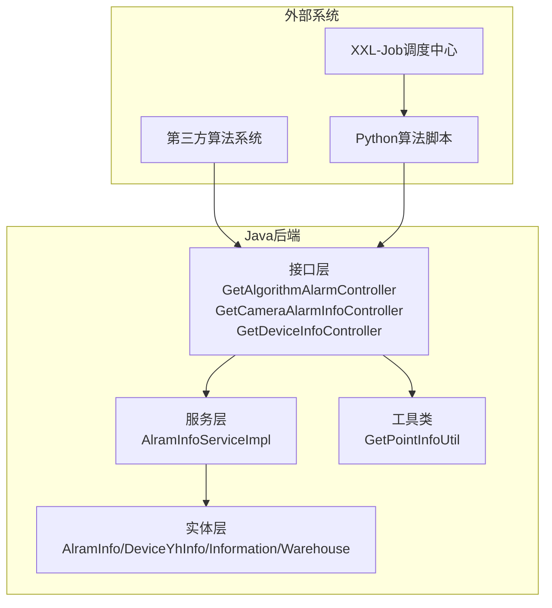
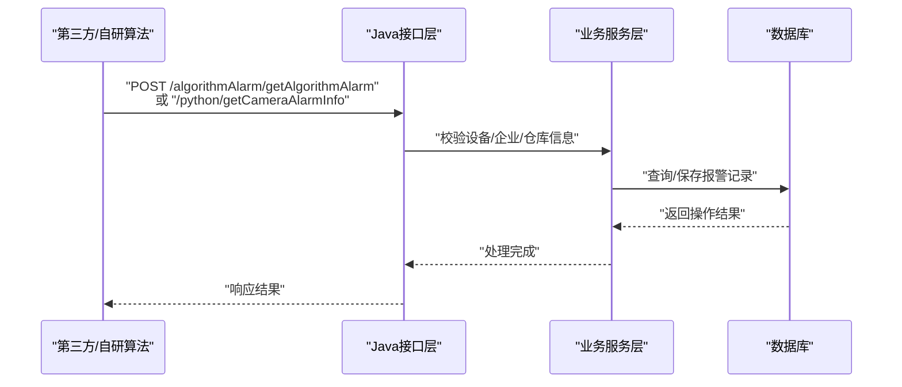
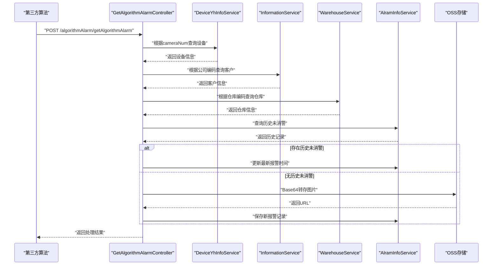
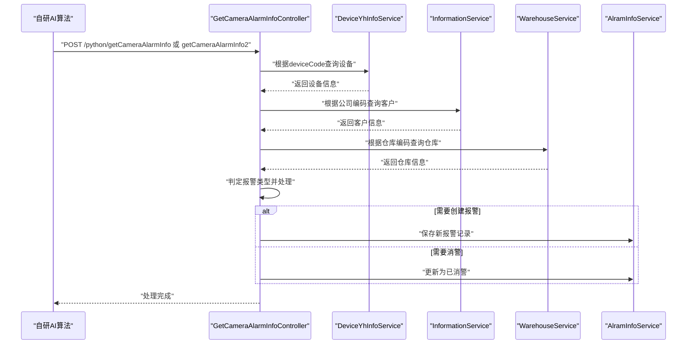
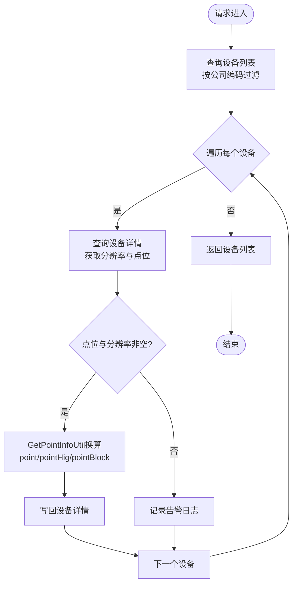
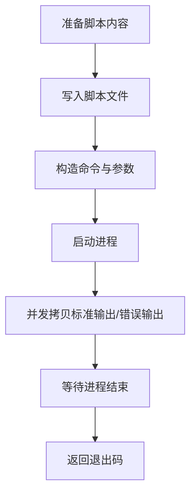
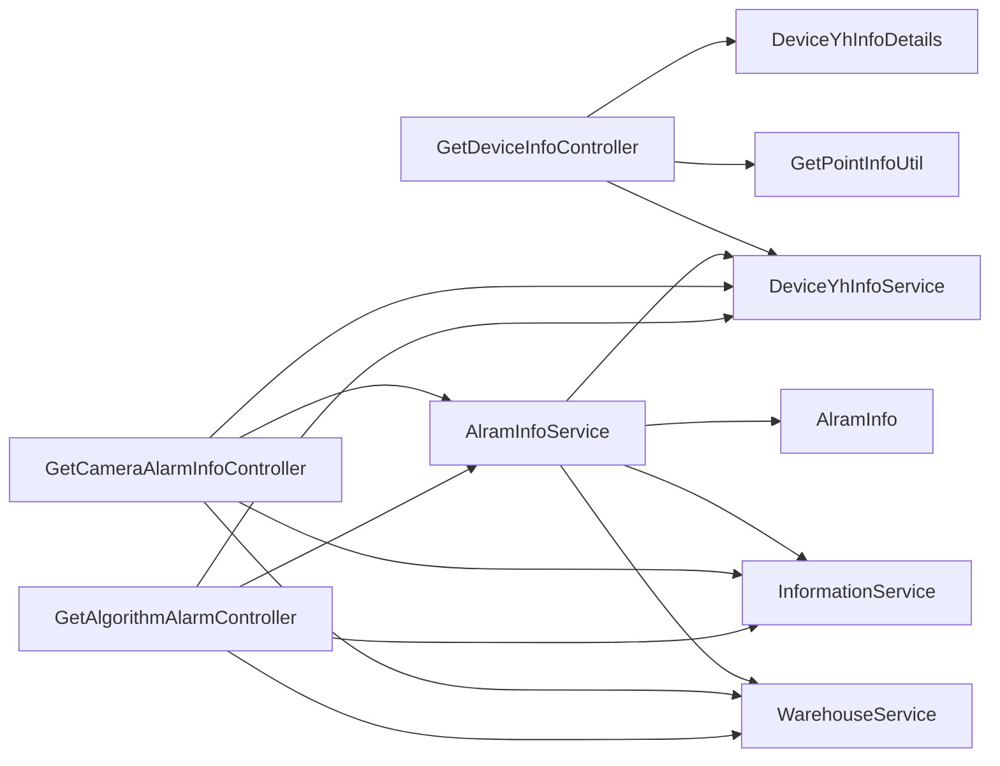

# Python算法集成

<cite>
**本文档引用的文件**
- [GetAlgorithmAlarm.java](file://monkey-monitor-api/src/main/java/com/monkey/general/python/GetAlgorithmAlarm.java)
- [GetAlgorithmAlarmController.java](file://monkey-monitor-api/src/main/java/com/monkey/general/python/GetAlgorithmAlarmController.java)
- [GetCameraAlarmInfoController.java](file://monkey-monitor-api/src/main/java/com/monkey/general/python/GetCameraAlarmInfoController.java)
- [GetDeviceInfoController.java](file://monkey-monitor-api/src/main/java/com/monkey/general/python/GetDeviceInfoController.java)
- [GetPointInfoUtil.java](file://monkey-monitor-api/src/main/java/com/monkey/general/python/GetPointInfoUtil.java)
- [BaseGetCameraAlarmInfo.java](file://monkey-monitor/src/main/java/com/monkey/general/modules/python/BaseGetCameraAlarmInfo.java)
- [GetCameraAlarmInfo.java](file://monkey-monitor/src/main/java/com/monkey/general/modules/python/GetCameraAlarmInfo.java)
- [GetCameraAlarmInfo2.java](file://monkey-monitor/src/main/java/com/monkey/general/modules/python/GetCameraAlarmInfo2.java)
- [AlramInfo.java](file://monkey-monitor/src/main/java/com/monkey/general/modules/em/entity/AlramInfo.java)
- [DeviceYhInfo.java](file://monkey-monitor/src/main/java/com/monkey/general/modules/em/entity/DeviceYhInfo.java)
- [DeviceYhInfoDetails.java](file://monkey-monitor/src/main/java/com/monkey/general/modules/em/entity/DeviceYhInfoDetails.java)
- [Information.java](file://monkey-monitor/src/main/java/com/monkey/general/modules/em/entity/Information.java)
- [Warehouse.java](file://monkey-monitor/src/main/java/com/monkey/general/modules/em/entity/Warehouse.java)
- [AlramInfoServiceImpl.java](file://monkey-monitor/src/main/java/com/monkey/general/modules/em/service/impl/AlramInfoServiceImpl.java)
- [ScriptUtil.java](file://xxl-job-core/src/main/java/com/xxl/job/core/util/ScriptUtil.java)
- [GlueTypeEnum.java](file://xxl-job-core/src/main/java/com/xxl/job/core/glue/GlueTypeEnum.java)
- [application.yml](file://monkey-monitor-api/src/main/resources/application.yml)
</cite>

## 目录
1. [引言](#引言)
2. [项目结构](#项目结构)
3. [核心组件](#核心组件)
4. [架构总览](#架构总览)
5. [详细组件分析](#详细组件分析)
6. [依赖分析](#依赖分析)
7. [性能考虑](#性能考虑)
8. [故障排查指南](#故障排查指南)
9. [结论](#结论)
10. [附录](#附录)

## 引言
本文件面向Python算法与Java系统的集成场景，聚焦于以下目标：
- 解释Python算法如何通过Java后端进行调用与数据交互（进程启动、数据传输、结果处理）
- 详解摄像头告警算法的调用方式与数据格式转换
- 说明设备信息获取与点位信息处理的实现方法
- 总结参数传递、异常处理、性能监控等关键技术点
- 提供Python脚本开发指南、数据格式规范、调用示例路径与调试优化建议

## 项目结构
本项目采用多模块结构，Python算法集成主要涉及以下模块：
- monkey-monitor-api：对外HTTP接口层，负责接收第三方算法推送与自研AI算法报警数据
- monkey-monitor：领域模型与服务层，包含设备、报警、仓库等实体及业务服务
- xxl-job-core：分布式任务调度核心，提供脚本执行能力（含Python）

图表来源
- [GetAlgorithmAlarmController.java:34-137](file://monkey-monitor-api/src/main/java/com/monkey/general/python/GetAlgorithmAlarmController.java#L34-L137)
- [GetCameraAlarmInfoController.java:34-165](file://monkey-monitor-api/src/main/java/com/monkey/general/python/GetCameraAlarmInfoController.java#L34-L165)
- [GetDeviceInfoController.java:23-76](file://monkey-monitor-api/src/main/java/com/monkey/general/python/GetDeviceInfoController.java#L23-L76)
- [AlramInfoServiceImpl.java:37-436](file://monkey-monitor/src/main/java/com/monkey/general/modules/em/service/impl/AlramInfoServiceImpl.java#L37-L436)
- [AlramInfo.java:17-330](file://monkey-monitor/src/main/java/com/monkey/general/modules/em/entity/AlramInfo.java#L17-L330)
- [DeviceYhInfo.java:14-243](file://monkey-monitor/src/main/java/com/monkey/general/modules/em/entity/DeviceYhInfo.java#L14-L243)
- [Information.java:12-335](file://monkey-monitor/src/main/java/com/monkey/general/modules/em/entity/Information.java#L12-L335)
- [Warehouse.java:11-156](file://monkey-monitor/src/main/java/com/monkey/general/modules/em/entity/Warehouse.java#L11-L156)
- [GetPointInfoUtil.java:14-87](file://monkey-monitor-api/src/main/java/com/monkey/general/python/GetPointInfoUtil.java#L14-L87)

章节来源
- [application.yml:1-40](file://monkey-monitor-api/src/main/resources/application.yml#L1-L40)

## 核心组件
- 报警接收控制器
  - 第三方算法报警接收：GetAlgorithmAlarmController
  - 自研AI算法报警接收：GetCameraAlarmInfoController
- 数据模型
  - 报警数据模型：GetAlgorithmAlarm
  - 摄像头报警数据模型：BaseGetCameraAlarmInfo、GetCameraAlarmInfo、GetCameraAlarmInfo2
  - 报警持久化实体：AlramInfo
  - 设备与企业信息：DeviceYhInfo、Information、Warehouse
- 工具类
  - 点位坐标转换：GetPointInfoUtil
- 调度与脚本执行
  - XXL-Job脚本执行：ScriptUtil
  - 脚本类型枚举：GlueTypeEnum

章节来源
- [GetAlgorithmAlarm.java:1-16](file://monkey-monitor-api/src/main/java/com/monkey/general/python/GetAlgorithmAlarm.java#L1-L16)
- [BaseGetCameraAlarmInfo.java:1-13](file://monkey-monitor/src/main/java/com/monkey/general/modules/python/BaseGetCameraAlarmInfo.java#L1-L13)
- [GetCameraAlarmInfo.java:1-14](file://monkey-monitor/src/main/java/com/monkey/general/modules/python/GetCameraAlarmInfo.java#L1-L14)
- [GetCameraAlarmInfo2.java:1-10](file://monkey-monitor/src/main/java/com/monkey/general/modules/python/GetCameraAlarmInfo2.java#L1-L10)
- [AlramInfo.java:17-330](file://monkey-monitor/src/main/java/com/monkey/general/modules/em/entity/AlramInfo.java#L17-L330)
- [DeviceYhInfo.java:14-243](file://monkey-monitor/src/main/java/com/monkey/general/modules/em/entity/DeviceYhInfo.java#L14-L243)
- [Information.java:12-335](file://monkey-monitor/src/main/java/com/monkey/general/modules/em/entity/Information.java#L12-L335)
- [Warehouse.java:11-156](file://monkey-monitor/src/main/java/com/monkey/general/modules/em/entity/Warehouse.java#L11-L156)
- [GetPointInfoUtil.java:14-87](file://monkey-monitor-api/src/main/java/com/monkey/general/python/GetPointInfoUtil.java#L14-L87)
- [ScriptUtil.java:12-229](file://xxl-job-core/src/main/java/com/xxl/job/core/util/ScriptUtil.java#L12-L229)
- [GlueTypeEnum.java:6-54](file://xxl-job-core/src/main/java/com/xxl/job/core/glue/GlueTypeEnum.java#L6-L54)

## 架构总览
Python算法可通过两种方式与Java系统集成：
- HTTP直连：第三方或自研算法直接向Java后端推送报警数据
- XXL-Job调度：Java通过进程方式启动Python脚本并传参执行

图表来源
- [GetAlgorithmAlarmController.java:48-116](file://monkey-monitor-api/src/main/java/com/monkey/general/python/GetAlgorithmAlarmController.java#L48-L116)
- [GetCameraAlarmInfoController.java:52-133](file://monkey-monitor-api/src/main/java/com/monkey/general/python/GetCameraAlarmInfoController.java#L52-L133)
- [AlramInfoServiceImpl.java:206-303](file://monkey-monitor/src/main/java/com/monkey/general/modules/em/service/impl/AlramInfoServiceImpl.java#L206-L303)

## 详细组件分析

### 组件A：第三方算法报警接收（HTTP）
- 功能概述
  - 接收第三方算法推送的报警数据，解析设备编码与报警类型
  - 查询企业、仓库信息，判断是否已有未消警记录
  - 将报警图片转存至对象存储并落库
- 关键流程
  - 参数校验与设备查询
  - 客户信息与仓库信息查询
  - 历史未消警更新或新报警创建
  - 图片Base64转存与URL生成

图表来源
- [GetAlgorithmAlarmController.java:48-116](file://monkey-monitor-api/src/main/java/com/monkey/general/python/GetAlgorithmAlarmController.java#L48-L116)
- [AlramInfoServiceImpl.java:206-303](file://monkey-monitor/src/main/java/com/monkey/general/modules/em/service/impl/AlramInfoServiceImpl.java#L206-L303)

章节来源
- [GetAlgorithmAlarmController.java:31-137](file://monkey-monitor-api/src/main/java/com/monkey/general/python/GetAlgorithmAlarmController.java#L31-L137)
- [GetAlgorithmAlarm.java:1-16](file://monkey-monitor-api/src/main/java/com/monkey/general/python/GetAlgorithmAlarm.java#L1-L16)

### 组件B：自研AI算法报警接收（HTTP）
- 功能概述
  - 接收自研AI算法推送的摄像头报警数据
  - 支持两类数据模型：GetCameraAlarmInfo、GetCameraAlarmInfo2
  - 根据报警类型（超员、遮挡、超高、堵塞、偏移）分别处理
- 关键流程
  - 设备信息查询与企业/仓库映射
  - 报警类型判定与历史状态处理
  - 新报警创建或旧报警消警更新

图表来源
- [GetCameraAlarmInfoController.java:52-163](file://monkey-monitor-api/src/main/java/com/monkey/general/python/GetCameraAlarmInfoController.java#L52-L163)
- [BaseGetCameraAlarmInfo.java:1-13](file://monkey-monitor/src/main/java/com/monkey/general/modules/python/BaseGetCameraAlarmInfo.java#L1-L13)
- [GetCameraAlarmInfo.java:1-14](file://monkey-monitor/src/main/java/com/monkey/general/modules/python/GetCameraAlarmInfo.java#L1-L14)
- [GetCameraAlarmInfo2.java:1-10](file://monkey-monitor/src/main/java/com/monkey/general/modules/python/GetCameraAlarmInfo2.java#L1-L10)

章节来源
- [GetCameraAlarmInfoController.java:31-165](file://monkey-monitor-api/src/main/java/com/monkey/general/python/GetCameraAlarmInfoController.java#L31-L165)

### 组件C：设备信息与点位信息处理
- 功能概述
  - 提供企业视频设备列表查询
  - 对设备点位坐标进行像素化转换（基于分辨率）
- 关键流程
  - 查询设备列表并拼接详情
  - 对point/pointHig/pointBlock进行坐标换算
  - 返回带转换后的点位信息

图表来源
- [GetDeviceInfoController.java:33-74](file://monkey-monitor-api/src/main/java/com/monkey/general/python/GetDeviceInfoController.java#L33-L74)
- [GetPointInfoUtil.java:14-87](file://monkey-monitor-api/src/main/java/com/monkey/general/python/GetPointInfoUtil.java#L14-L87)

章节来源
- [GetDeviceInfoController.java:18-76](file://monkey-monitor-api/src/main/java/com/monkey/general/python/GetDeviceInfoController.java#L18-L76)
- [GetPointInfoUtil.java:14-87](file://monkey-monitor-api/src/main/java/com/monkey/general/python/GetPointInfoUtil.java#L14-L87)

### 组件D：XXL-Job脚本执行（Python）
- 功能概述
  - Java通过进程方式启动Python脚本
  - 支持将标准输出与错误输出实时写入日志文件
  - 脚本类型枚举包含Python
- 关键流程
  - 写入脚本文件
  - 执行命令并开启线程实时写日志
  - 等待进程结束并返回退出码

图表来源
- [ScriptUtil.java:29-130](file://xxl-job-core/src/main/java/com/xxl/job/core/util/ScriptUtil.java#L29-L130)
- [GlueTypeEnum.java:10-11](file://xxl-job-core/src/main/java/com/xxl/job/core/glue/GlueTypeEnum.java#L10-L11)

章节来源
- [ScriptUtil.java:12-229](file://xxl-job-core/src/main/java/com/xxl/job/core/util/ScriptUtil.java#L12-L229)
- [GlueTypeEnum.java:6-54](file://xxl-job-core/src/main/java/com/xxl/job/core/glue/GlueTypeEnum.java#L6-L54)

## 依赖分析
- 接口层对服务层的依赖
  - GetAlgorithmAlarmController 依赖设备、客户、仓库、报警服务
  - GetCameraAlarmInfoController 依赖设备、客户、仓库、报警服务
- 服务层对实体层的依赖
  - AlramInfoServiceImpl 依赖 AlramInfo、DeviceYhInfo、Information、Warehouse 等实体
- 工具类依赖
  - GetPointInfoUtil 依赖 JSON解析库
- 调度依赖
  - XXL-Job通过 ScriptUtil 启动Python脚本

图表来源
- [GetAlgorithmAlarmController.java:39-46](file://monkey-monitor-api/src/main/java/com/monkey/general/python/GetAlgorithmAlarmController.java#L39-L46)
- [GetCameraAlarmInfoController.java:42-49](file://monkey-monitor-api/src/main/java/com/monkey/general/python/GetCameraAlarmInfoController.java#L42-L49)
- [GetDeviceInfoController.java:28-31](file://monkey-monitor-api/src/main/java/com/monkey/general/python/GetDeviceInfoController.java#L28-L31)
- [AlramInfoServiceImpl.java:41-54](file://monkey-monitor/src/main/java/com/monkey/general/modules/em/service/impl/AlramInfoServiceImpl.java#L41-L54)
- [AlramInfo.java:17-330](file://monkey-monitor/src/main/java/com/monkey/general/modules/em/entity/AlramInfo.java#L17-L330)
- [DeviceYhInfo.java:14-243](file://monkey-monitor/src/main/java/com/monkey/general/modules/em/entity/DeviceYhInfo.java#L14-L243)
- [DeviceYhInfoDetails.java:10-105](file://monkey-monitor/src/main/java/com/monkey/general/modules/em/entity/DeviceYhInfoDetails.java#L10-L105)
- [GetPointInfoUtil.java:14-87](file://monkey-monitor-api/src/main/java/com/monkey/general/python/GetPointInfoUtil.java#L14-L87)

## 性能考虑
- 日志实时性
  - XXL-Job脚本执行建议将日志写入文件，避免一次性获取导致的延迟
- IO与序列化
  - 报警图片采用Base64转存，注意内存占用与磁盘IO；可结合对象存储降低内存压力
- 并发与异步
  - 报警语音播报采用异步线程池，避免阻塞主流程
- 数据库查询
  - 报警历史查询使用精确条件（设备编码、报警类型、未消警状态），减少扫描范围

## 故障排查指南
- 常见问题定位
  - 设备信息缺失：检查设备编码是否正确，以及设备类型是否为视频设备
  - 客户/仓库信息缺失：确认公司编码与仓库编码的有效性
  - 历史报警未消警：检查是否重复推送相同报警类型且未消警
- 日志与监控
  - XXL-Job脚本执行日志需关注标准输出与错误输出的顺序一致性
  - 接口层对异常进行捕获并返回统一响应，便于前端与第三方系统排查
- 数据格式核对
  - 第三方算法推送的图片字段应为Base64字符串
  - 摄像头报警数据需包含设备编码、抓帧时间、图片字段等关键字段

章节来源
- [GetAlgorithmAlarmController.java:54-116](file://monkey-monitor-api/src/main/java/com/monkey/general/python/GetAlgorithmAlarmController.java#L54-L116)
- [GetCameraAlarmInfoController.java:66-133](file://monkey-monitor-api/src/main/java/com/monkey/general/python/GetCameraAlarmInfoController.java#L66-L133)
- [ScriptUtil.java:12-16](file://xxl-job-core/src/main/java/com/xxl/job/core/util/ScriptUtil.java#L12-L16)

## 结论
本项目通过HTTP接口与XXL-Job调度实现了Python算法与Java系统的高效集成。接口层负责数据接入与业务规则处理，服务层完成设备/企业/仓库映射与报警落库，工具类提供点位坐标转换能力。整体设计具备良好的扩展性与可维护性，适合在多算法、多场景下持续演进。

## 附录

### Python脚本开发指南
- 进程启动方式
  - 使用XXL-Job的脚本执行能力，通过命令行参数传递必要信息
  - 注意脚本路径与环境变量配置，确保Python解释器可用
- 日志输出
  - 建议使用logging模块输出日志，避免标准输出与错误输出顺序混乱
- 参数约定
  - 通过命令行参数接收设备编码、时间戳、阈值等信息
  - 输出结果遵循统一格式，便于Java侧解析

章节来源
- [ScriptUtil.java:12-16](file://xxl-job-core/src/main/java/com/xxl/job/core/util/ScriptUtil.java#L12-L16)
- [GlueTypeEnum.java:10-11](file://xxl-job-core/src/main/java/com/xxl/job/core/glue/GlueTypeEnum.java#L10-L11)

### 数据格式规范
- 第三方算法报警
  - 字段：cameraNum、alarmTime、frame、alarmType、alarmValue、number
  - frame：图片Base64字符串
- 摄像头报警（自研AI）
  - 基础字段：id、deviceCode、peopleCount、peopleCoordinate、frameCaptureTime、frame
  - 扩展字段：alarm（超员/少员）、occluded（遮挡）、highAlarm（超高）、blockAlarm（堵塞）、offset（偏移）
- 设备点位
  - 输入：point/pointHig/pointBlock（JSON数组，包含x/y坐标）、resolution（分辨率字符串）
  - 输出：转换后的像素坐标（JSON数组）

章节来源
- [GetAlgorithmAlarm.java:8-15](file://monkey-monitor-api/src/main/java/com/monkey/general/python/GetAlgorithmAlarm.java#L8-L15)
- [BaseGetCameraAlarmInfo.java:6-13](file://monkey-monitor/src/main/java/com/monkey/general/modules/python/BaseGetCameraAlarmInfo.java#L6-L13)
- [GetCameraAlarmInfo.java:9-14](file://monkey-monitor/src/main/java/com/monkey/general/modules/python/GetCameraAlarmInfo.java#L9-L14)
- [GetCameraAlarmInfo2.java:8-10](file://monkey-monitor/src/main/java/com/monkey/general/modules/python/GetCameraAlarmInfo2.java#L8-L10)
- [GetPointInfoUtil.java:14-87](file://monkey-monitor-api/src/main/java/com/monkey/general/python/GetPointInfoUtil.java#L14-L87)

### 调用示例（路径）
- 第三方算法报警推送
  - POST /algorithmAlarm/getAlgorithmAlarm
  - 请求体：GetAlgorithmAlarm
- 自研AI算法报警推送
  - POST /python/getCameraAlarmInfo 或 /python/getCameraAlarmInfo2
  - 请求体：GetCameraAlarmInfo 或 GetCameraAlarmInfo2
- 设备信息查询
  - GET /api/device/Selectlist?companyCode={企业编码}
  - 返回：设备列表与转换后的点位信息

章节来源
- [GetAlgorithmAlarmController.java:48-50](file://monkey-monitor-api/src/main/java/com/monkey/general/python/GetAlgorithmAlarmController.java#L48-L50)
- [GetCameraAlarmInfoController.java:52-63](file://monkey-monitor-api/src/main/java/com/monkey/general/python/GetCameraAlarmInfoController.java#L52-L63)
- [GetDeviceInfoController.java:36-42](file://monkey-monitor-api/src/main/java/com/monkey/general/python/GetDeviceInfoController.java#L36-L42)