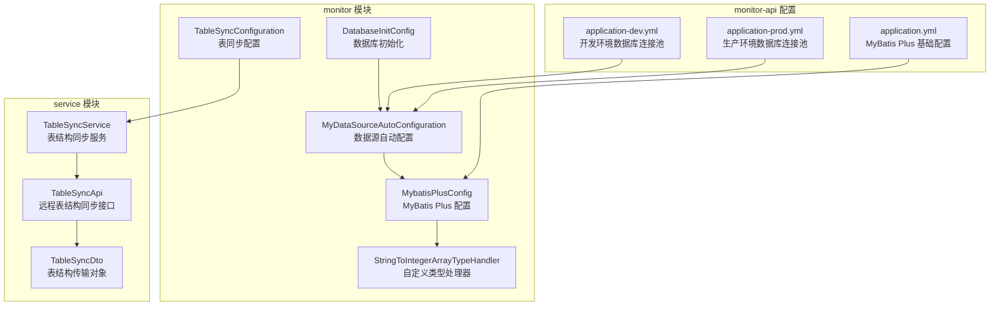
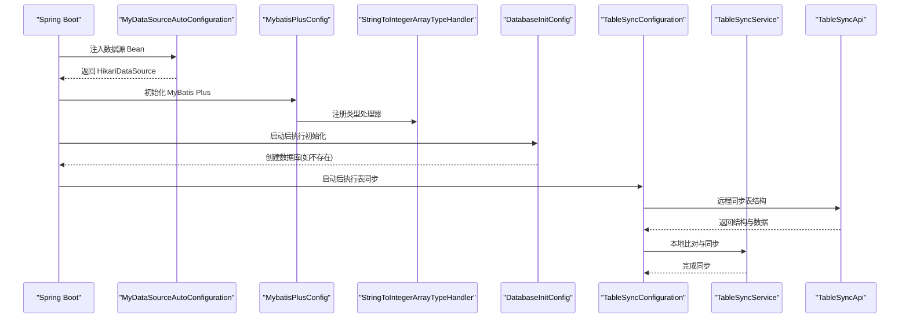
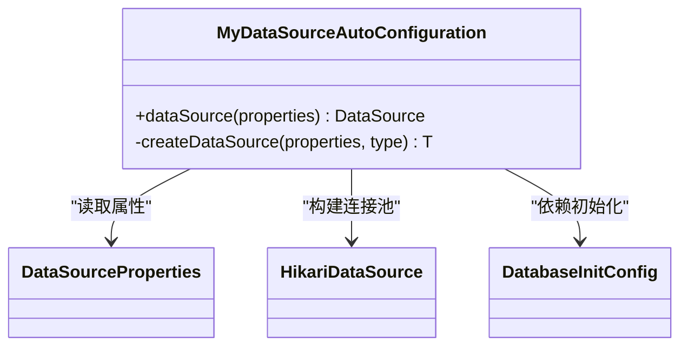
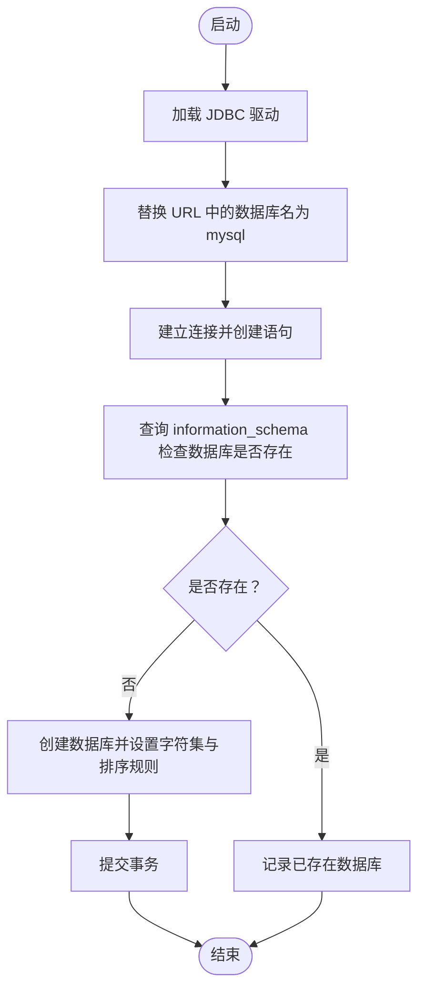
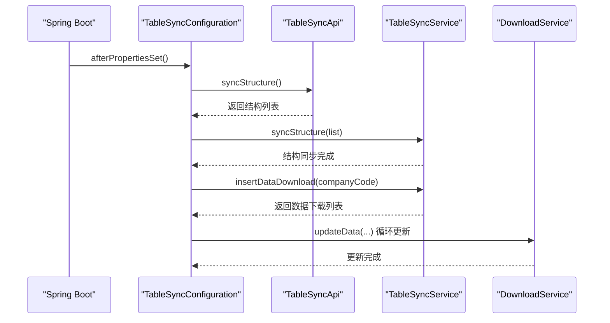
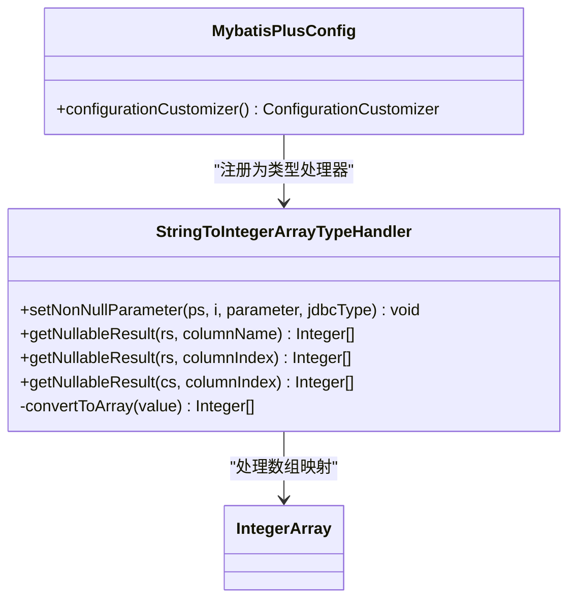
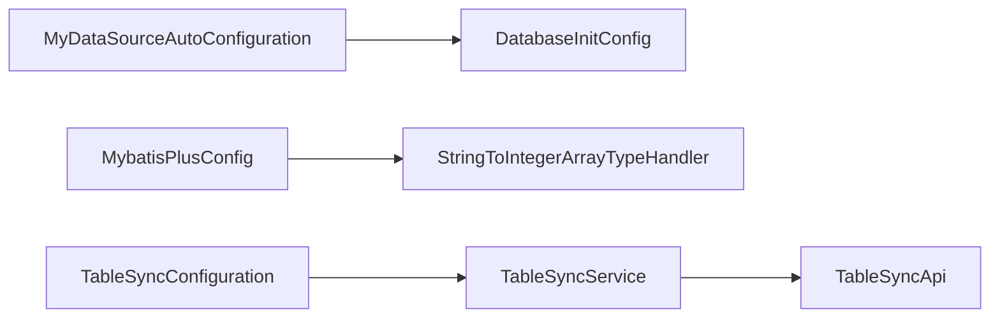

# 数据库配置管理

<cite>
**本文引用的文件**
- [MyDataSourceAutoConfiguration.java](file://monkey-monitor/src/main/java/com/monkey/general/config/MyDataSourceAutoConfiguration.java)
- [DatabaseInitConfig.java](file://monkey-monitor/src/main/java/com/monkey/general/config/DatabaseInitConfig.java)
- [TableSyncConfiguration.java](file://monkey-monitor/src/main/java/com/monkey/general/config/TableSyncConfiguration.java)
- [StringToIntegerArrayTypeHandler.java](file://monkey-monitor/src/main/java/com/monkey/general/handler/StringToIntegerArrayTypeHandler.java)
- [MybatisPlusConfig.java](file://monkey-monitor/src/main/java/com/monkey/general/config/MybatisPlusConfig.java)
- [application.yml](file://monkey-monitor-api/src/main/resources/application.yml)
- [application-dev.yml](file://monkey-monitor-api/src/main/resources/application-dev.yml)
- [application-prod.yml](file://deploy/config/monitor-api/application-prod.yml)
- [TableSyncService.java](file://monkey-service/src/main/java/com/monkey/general/modules/open/service/TableSyncService.java)
- [TableSyncApi.java](file://monkey-service/src/main/java/com/monkey/general/api/TableSyncApi.java)
- [TableSyncDto.java](file://monkey-service/src/main/java/com/monkey/general/modules/open/dto/TableSyncDto.java)
</cite>

## 目录
1. [引言](#引言)
2. [项目结构](#项目结构)
3. [核心组件](#核心组件)
4. [架构总览](#架构总览)
5. [详细组件分析](#详细组件分析)
6. [依赖分析](#依赖分析)
7. [性能考虑](#性能考虑)
8. [故障排查指南](#故障排查指南)
9. [结论](#结论)
10. [附录](#附录)

## 引言
本文件系统性梳理并讲解本项目的数据库配置管理方案，重点覆盖以下方面：
- MyDataSourceAutoConfiguration 的数据源自动配置机制（数据源初始化、连接池配置、与事务管理的关系）
- DatabaseInitConfig 的数据库初始化流程与表结构同步机制
- TableSyncConfiguration 的表同步配置与数据迁移策略
- 自定义类型处理器 StringToIntegerArrayTypeHandler 的实现与使用场景
- 基于现有配置的最佳实践、性能优化与连接池调优
- 多数据源、读写分离、数据库监控等高级主题的落地建议

## 项目结构
本项目的数据库相关配置主要集中在 monitor 模块的配置包与 monitor-api 的配置文件中，并通过 service 模块的服务接口完成表结构同步与数据迁移。

图表来源
- [MyDataSourceAutoConfiguration.java:32-48](file://monkey-monitor/src/main/java/com/monkey/general/config/MyDataSourceAutoConfiguration.java#L32-L48)
- [DatabaseInitConfig.java:47-82](file://monkey-monitor/src/main/java/com/monkey/general/config/DatabaseInitConfig.java#L47-L82)
- [TableSyncConfiguration.java:26-65](file://monkey-monitor/src/main/java/com/monkey/general/config/TableSyncConfiguration.java#L26-L65)
- [MybatisPlusConfig.java:10-19](file://monkey-monitor/src/main/java/com/monkey/general/config/MybatisPlusConfig.java#L10-L19)
- [StringToIntegerArrayTypeHandler.java:13-44](file://monkey-monitor/src/main/java/com/monkey/general/handler/StringToIntegerArrayTypeHandler.java#L13-L44)
- [application.yml:14-39](file://monkey-monitor-api/src/main/resources/application.yml#L14-L39)
- [application-dev.yml:4-15](file://monkey-monitor-api/src/main/resources/application-dev.yml#L4-L15)
- [application-prod.yml:2-12](file://deploy/config/monitor-api/application-prod.yml#L2-L12)
- [TableSyncService.java:29-120](file://monkey-service/src/main/java/com/monkey/general/modules/open/service/TableSyncService.java#L29-L120)
- [TableSyncApi.java:16-26](file://monkey-service/src/main/java/com/monkey/general/api/TableSyncApi.java#L16-L26)
- [TableSyncDto.java:13-21](file://monkey-service/src/main/java/com/monkey/general/modules/open/dto/TableSyncDto.java#L13-L21)

章节来源
- [MyDataSourceAutoConfiguration.java:32-48](file://monkey-monitor/src/main/java/com/monkey/general/config/MyDataSourceAutoConfiguration.java#L32-L48)
- [application.yml:14-39](file://monkey-monitor-api/src/main/resources/application.yml#L14-L39)

## 核心组件
- 数据源自动配置：通过自动装配在启动前注入 Hikari 连接池，支持按名称设置连接池池名，确保与后续事务管理协同工作。
- 数据库初始化：在应用启动阶段检测目标数据库是否存在，若不存在则自动创建，避免首次启动失败。
- 表结构同步：启动时从远端同步表结构与初始数据，本地进行比对与差异处理，保证结构一致性。
- 类型处理器：针对整型数组字段提供字符串与数组之间的双向转换，便于 MyBatis 与数据库交互。

章节来源
- [MyDataSourceAutoConfiguration.java:35-48](file://monkey-monitor/src/main/java/com/monkey/general/config/MyDataSourceAutoConfiguration.java#L35-L48)
- [DatabaseInitConfig.java:47-82](file://monkey-monitor/src/main/java/com/monkey/general/config/DatabaseInitConfig.java#L47-L82)
- [TableSyncConfiguration.java:38-65](file://monkey-monitor/src/main/java/com/monkey/general/config/TableSyncConfiguration.java#L38-L65)
- [MybatisPlusConfig.java:10-19](file://monkey-monitor/src/main/java/com/monkey/general/config/MybatisPlusConfig.java#L10-L19)
- [StringToIntegerArrayTypeHandler.java:13-44](file://monkey-monitor/src/main/java/com/monkey/general/handler/StringToIntegerArrayTypeHandler.java#L13-L44)

## 架构总览
下图展示了数据库配置管理的关键交互：配置类负责数据源与 MyBatis Plus 的初始化，服务层负责表结构同步与数据迁移，配置文件提供连接池参数与 MyBatis Plus 基础设置。

图表来源
- [MyDataSourceAutoConfiguration.java:39-48](file://monkey-monitor/src/main/java/com/monkey/general/config/MyDataSourceAutoConfiguration.java#L39-L48)
- [MybatisPlusConfig.java:10-19](file://monkey-monitor/src/main/java/com/monkey/general/config/MybatisPlusConfig.java#L10-L19)
- [StringToIntegerArrayTypeHandler.java:13-44](file://monkey-monitor/src/main/java/com/monkey/general/handler/StringToIntegerArrayTypeHandler.java#L13-L44)
- [DatabaseInitConfig.java:47-82](file://monkey-monitor/src/main/java/com/monkey/general/config/DatabaseInitConfig.java#L47-L82)
- [TableSyncConfiguration.java:38-65](file://monkey-monitor/src/main/java/com/monkey/general/config/TableSyncConfiguration.java#L38-L65)
- [TableSyncService.java:35-95](file://monkey-service/src/main/java/com/monkey/general/modules/open/service/TableSyncService.java#L35-L95)
- [TableSyncApi.java:16-26](file://monkey-service/src/main/java/com/monkey/general/api/TableSyncApi.java#L16-L26)

## 详细组件分析

### 数据源自动配置：MyDataSourceAutoConfiguration
- 自动装配顺序：在标准数据源自动配置之前执行，确保自定义数据源优先级更高。
- 数据源构建：基于 DataSourceProperties 使用 HikariDataSource 构建连接池，支持通过名称设置池名。
- 依赖关系：依赖 DatabaseInitConfig 完成数据库初始化后再创建数据源，避免启动阶段因数据库不存在导致失败。
- 事务管理：HikariDataSource 作为底层数据源，配合 Spring 事务管理器实现声明式事务控制。

图表来源
- [MyDataSourceAutoConfiguration.java:32-48](file://monkey-monitor/src/main/java/com/monkey/general/config/MyDataSourceAutoConfiguration.java#L32-L48)
- [DatabaseInitConfig.java:47-82](file://monkey-monitor/src/main/java/com/monkey/general/config/DatabaseInitConfig.java#L47-L82)

章节来源
- [MyDataSourceAutoConfiguration.java:32-48](file://monkey-monitor/src/main/java/com/monkey/general/config/MyDataSourceAutoConfiguration.java#L32-L48)

### 数据库初始化：DatabaseInitConfig
- 触发时机：应用启动后执行 PostConstruct 初始化方法。
- 核心流程：加载 JDBC 驱动，替换 URL 中的数据库名为 mysql，查询 information_schema 判断目标数据库是否存在；若不存在则创建数据库并提交事务。
- 参数来源：从 Spring 配置中读取驱动类名、URL、用户名与密码。
- 安全性：显式设置 autocommit=false 并在创建成功后 commit，确保原子性。

图表来源
- [DatabaseInitConfig.java:47-82](file://monkey-monitor/src/main/java/com/monkey/general/config/DatabaseInitConfig.java#L47-L82)

章节来源
- [DatabaseInitConfig.java:47-82](file://monkey-monitor/src/main/java/com/monkey/general/config/DatabaseInitConfig.java#L47-L82)

### 表同步配置：TableSyncConfiguration
- 触发时机：实现 InitializingBean，在 Bean 属性设置完成后执行 afterPropertiesSet。
- 同步流程：调用 TableSyncApi 获取远端表结构列表，交由 TableSyncService 进行本地比对与差异处理；随后初始化 DOWNLOAD 同步数据并通过 DownloadService 更新。
- 错误处理：捕获异常并记录日志，避免影响应用启动。

图表来源
- [TableSyncConfiguration.java:38-65](file://monkey-monitor/src/main/java/com/monkey/general/config/TableSyncConfiguration.java#L38-L65)
- [TableSyncService.java:35-95](file://monkey-service/src/main/java/com/monkey/general/modules/open/service/TableSyncService.java#L35-L95)
- [TableSyncApi.java:16-26](file://monkey-service/src/main/java/com/monkey/general/api/TableSyncApi.java#L16-L26)

章节来源
- [TableSyncConfiguration.java:26-65](file://monkey-monitor/src/main/java/com/monkey/general/config/TableSyncConfiguration.java#L26-L65)
- [TableSyncService.java:29-120](file://monkey-service/src/main/java/com/monkey/general/modules/open/service/TableSyncService.java#L29-L120)
- [TableSyncApi.java:16-26](file://monkey-service/src/main/java/com/monkey/general/api/TableSyncApi.java#L16-L26)

### 自定义类型处理器：StringToIntegerArrayTypeHandler
- 目标类型：Integer[] 数组类型。
- 转换规则：以逗号分隔的字符串与整型数组互转，支持 PreparedStatement 设置参数与多种结果集读取方式。
- 注册位置：在 MybatisPlusConfig 中注册到 TypeHandlerRegistry，使 MyBatis 在映射时自动使用该处理器。

图表来源
- [StringToIntegerArrayTypeHandler.java:13-44](file://monkey-monitor/src/main/java/com/monkey/general/handler/StringToIntegerArrayTypeHandler.java#L13-L44)
- [MybatisPlusConfig.java:10-19](file://monkey-monitor/src/main/java/com/monkey/general/config/MybatisPlusConfig.java#L10-L19)

章节来源
- [StringToIntegerArrayTypeHandler.java:13-44](file://monkey-monitor/src/main/java/com/monkey/general/handler/StringToIntegerArrayTypeHandler.java#L13-L44)
- [MybatisPlusConfig.java:10-19](file://monkey-monitor/src/main/java/com/monkey/general/config/MybatisPlusConfig.java#L10-L19)

### 配置文件要点
- application.yml：定义 MyBatis Plus 的 Mapper 映射路径、实体别名包、全局逻辑删除字段与元对象处理器等基础配置。
- application-dev.yml 与 application-prod.yml：分别提供开发与生产环境的数据库连接池参数（最小空闲、最大连接数），以及 Feign 远端服务地址等。

章节来源
- [application.yml:14-39](file://monkey-monitor-api/src/main/resources/application.yml#L14-L39)
- [application-dev.yml:4-15](file://monkey-monitor-api/src/main/resources/application-dev.yml#L4-L15)
- [application-prod.yml:2-12](file://deploy/config/monitor-api/application-prod.yml#L2-L12)

## 依赖分析
- 组件耦合
  - MyDataSourceAutoConfiguration 依赖 DatabaseInitConfig，确保数据库存在后再创建数据源。
  - MybatisPlusConfig 依赖 StringToIntegerArrayTypeHandler，实现特定类型的映射。
  - TableSyncConfiguration 依赖 TableSyncService 与 TableSyncApi，完成结构与数据同步。
- 外部依赖
  - HikariCP 作为连接池实现。
  - MyBatis Plus 提供 ORM 能力与分页插件。
  - Feign 客户端访问远端同步服务。

图表来源
- [MyDataSourceAutoConfiguration.java:39-48](file://monkey-monitor/src/main/java/com/monkey/general/config/MyDataSourceAutoConfiguration.java#L39-L48)
- [DatabaseInitConfig.java:47-82](file://monkey-monitor/src/main/java/com/monkey/general/config/DatabaseInitConfig.java#L47-L82)
- [MybatisPlusConfig.java:10-19](file://monkey-monitor/src/main/java/com/monkey/general/config/MybatisPlusConfig.java#L10-L19)
- [TableSyncConfiguration.java:32-37](file://monkey-monitor/src/main/java/com/monkey/general/config/TableSyncConfiguration.java#L32-L37)
- [TableSyncService.java:31-34](file://monkey-service/src/main/java/com/monkey/general/modules/open/service/TableSyncService.java#L31-L34)
- [TableSyncApi.java:16-26](file://monkey-service/src/main/java/com/monkey/general/api/TableSyncApi.java#L16-L26)

章节来源
- [MyDataSourceAutoConfiguration.java:32-48](file://monkey-monitor/src/main/java/com/monkey/general/config/MyDataSourceAutoConfiguration.java#L32-L48)
- [MybatisPlusConfig.java:10-19](file://monkey-monitor/src/main/java/com/monkey/general/config/MybatisPlusConfig.java#L10-L19)
- [TableSyncConfiguration.java:26-65](file://monkey-monitor/src/main/java/com/monkey/general/config/TableSyncConfiguration.java#L26-L65)

## 性能考虑
- 连接池参数调优
  - minimum-idle 与 maximum-pool-size：根据并发请求峰值与数据库承载能力调整，避免过小导致连接争用、过大导致资源浪费。
  - 开发与生产环境参数差异：参考 application-dev.yml 与 application-prod.yml 中的示例配置，结合压测结果微调。
- SQL 与分页
  - MyBatis Plus 分页插件已在配置中启用，建议在高频查询场景中合理使用分页，避免一次性加载大量数据。
- 类型处理器
  - 字符串与数组的转换开销较低，但需确保字段长度与分隔符规范，避免异常或性能抖动。
- 启动流程
  - DatabaseInitConfig 与 TableSyncConfiguration 在启动阶段执行，建议控制其耗时，必要时异步化或延迟执行。

[本节为通用性能建议，无需列出章节来源]

## 故障排查指南
- 数据库未创建
  - 现象：启动时报数据库不存在或无法连接。
  - 排查：确认 DatabaseInitConfig 的驱动类名、URL、用户名与密码正确；检查初始化逻辑是否成功创建数据库。
- 连接池参数不当
  - 现象：连接池耗尽或频繁创建销毁连接。
  - 排查：核对 minimum-idle 与 maximum-pool-size；结合业务峰值与数据库最大连接数进行调整。
- 表结构同步失败
  - 现象：启动后表结构不一致或数据缺失。
  - 排查：查看 TableSyncConfiguration 的日志输出；确认 TableSyncApi 可达且返回结构正常；检查 TableSyncService 的差异处理逻辑。
- 类型转换异常
  - 现象：Integer[] 字段映射失败或空指针。
  - 排查：确认字段值格式为逗号分隔的整数序列；检查 StringToIntegerArrayTypeHandler 的转换逻辑。

章节来源
- [DatabaseInitConfig.java:47-82](file://monkey-monitor/src/main/java/com/monkey/general/config/DatabaseInitConfig.java#L47-L82)
- [TableSyncConfiguration.java:38-65](file://monkey-monitor/src/main/java/com/monkey/general/config/TableSyncConfiguration.java#L38-L65)
- [TableSyncService.java:35-95](file://monkey-service/src/main/java/com/monkey/general/modules/open/service/TableSyncService.java#L35-L95)
- [StringToIntegerArrayTypeHandler.java:13-44](file://monkey-monitor/src/main/java/com/monkey/general/handler/StringToIntegerArrayTypeHandler.java#L13-L44)

## 结论
本项目的数据库配置管理通过自动配置、初始化与同步三大机制，实现了从连接池到表结构的一体化治理。结合自定义类型处理器与分页插件，既满足了日常开发需求，也为扩展多数据源、读写分离与数据库监控提供了清晰的落地路径。建议在生产环境中持续优化连接池参数与同步策略，并完善监控告警体系。

[本节为总结性内容，无需列出章节来源]

## 附录

### 多数据源与读写分离（建议）
- 建议采用动态数据源框架（如项目中使用的动态路由）实现多数据源与读写分离，将只读流量路由至从库，写操作路由至主库。
- 事务边界：确保跨库事务通过分布式事务或最终一致性策略处理，避免数据不一致。

### 数据库监控（建议）
- 连接池监控：关注活跃连接数、空闲连接数、等待队列长度与连接泄漏情况。
- SQL 监控：开启慢查询日志与执行计划分析，定期审查热点 SQL。
- 结构变更审计：对表结构同步过程增加变更记录与回滚策略，保障可追溯性。

[本节为概念性建议，无需列出章节来源]