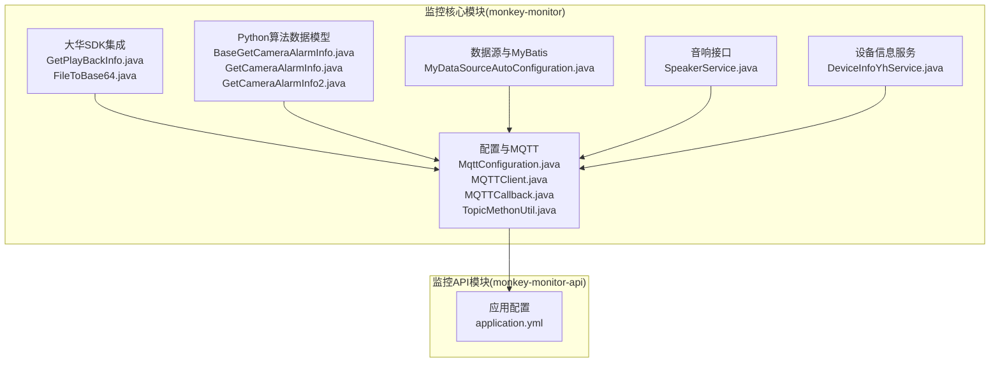
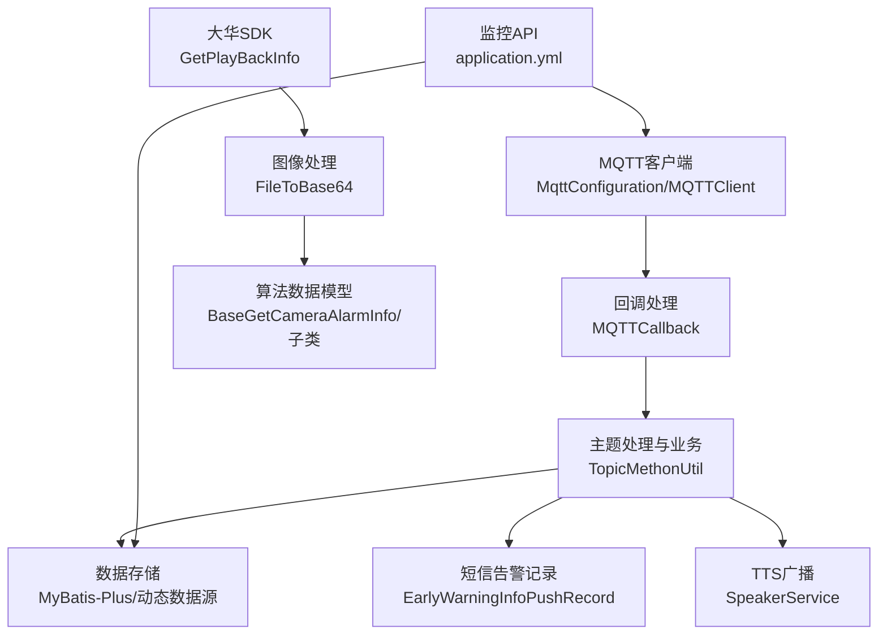
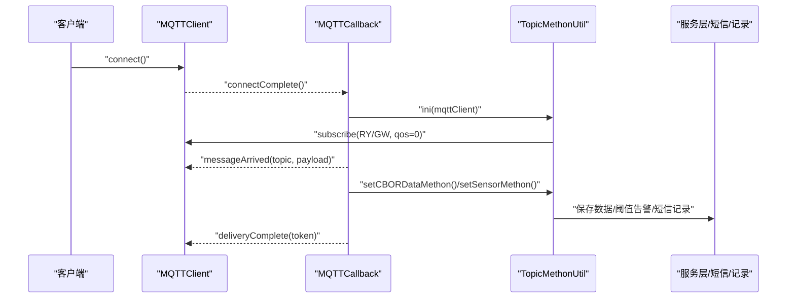
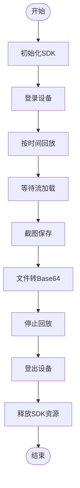
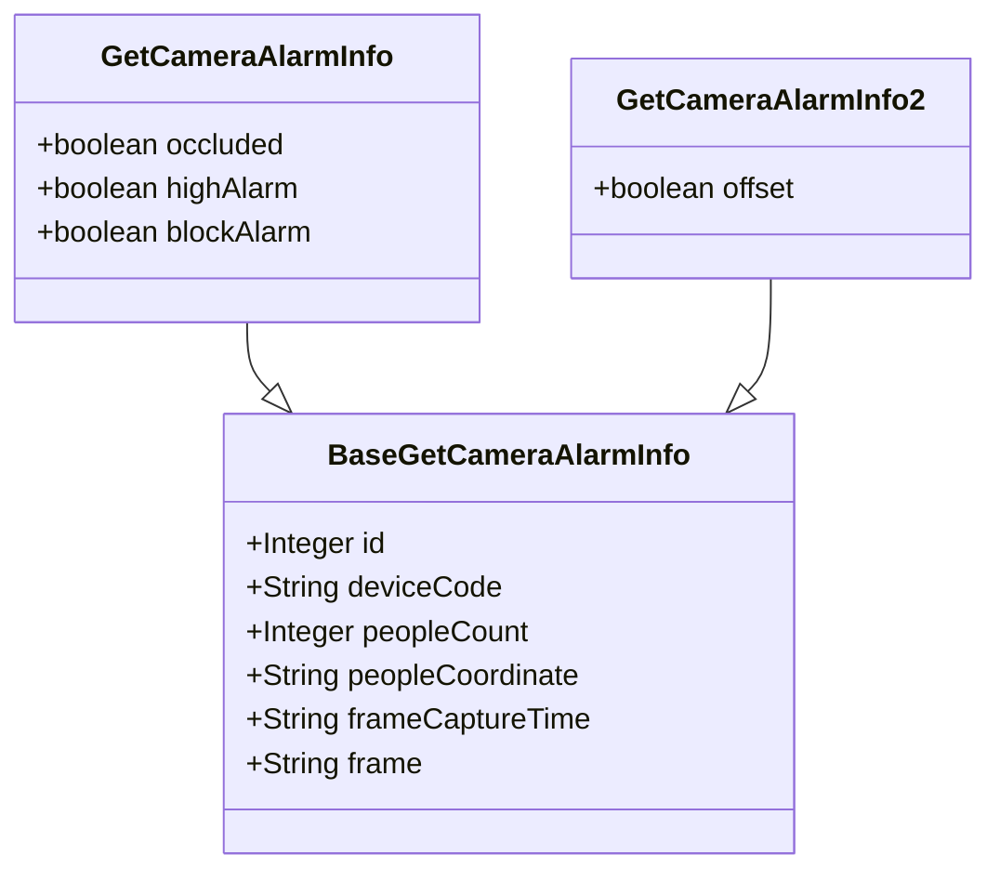
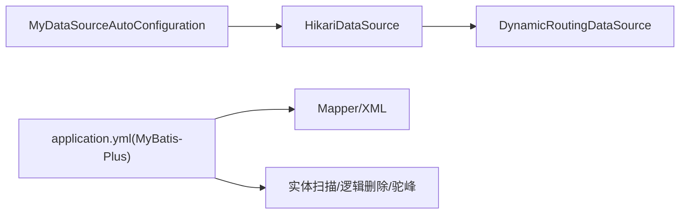
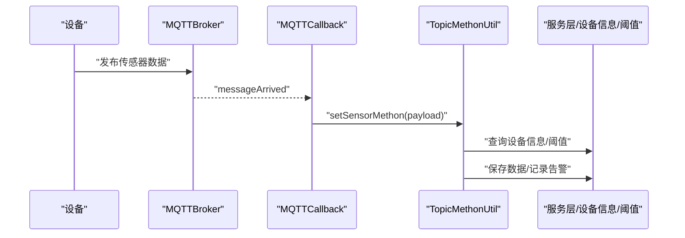
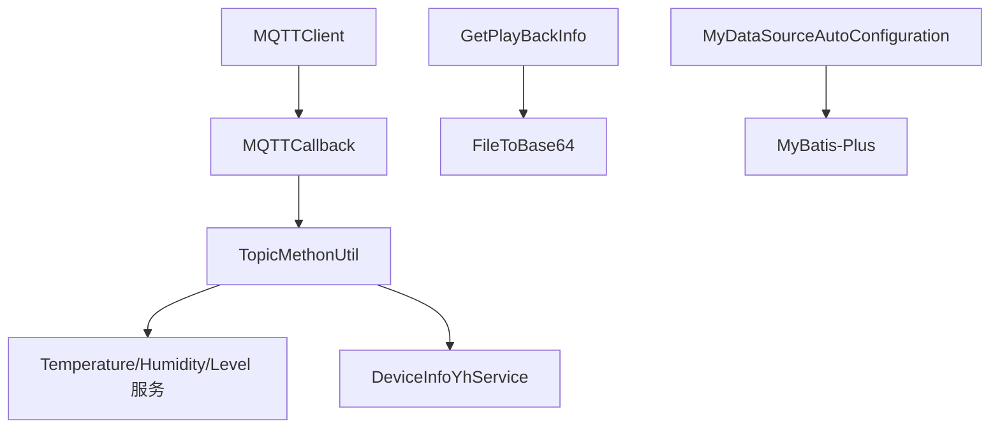

# 监控核心模块

<cite>
**本文引用的文件**
- [MqttConfiguration.java](file://monkey-monitor/src/main/java/com/monkey/general/config/MqttConfiguration.java)
- [MQTTClient.java](file://monkey-monitor/src/main/java/com/monkey/general/config/mqtt/MQTTClient.java)
- [MQTTCallback.java](file://monkey-monitor/src/main/java/com/monkey/general/config/mqtt/MQTTCallback.java)
- [TopicMethonUtil.java](file://monkey-monitor/src/main/java/com/monkey/general/config/mqtt/TopicMethonUtil.java)
- [MyDataSourceAutoConfiguration.java](file://monkey-monitor/src/main/java/com/monkey/general/config/MyDataSourceAutoConfiguration.java)
- [GetPlayBackInfo.java](file://monkey-monitor/src/main/java/com/monkey/general/dahua/GetPlayBackInfo.java)
- [FileToBase64.java](file://monkey-monitor/src/main/java/com/monkey/general/dahua/FileToBase64.java)
- [BaseGetCameraAlarmInfo.java](file://monkey-monitor/src/main/java/com/monkey/general/modules/python/BaseGetCameraAlarmInfo.java)
- [GetCameraAlarmInfo.java](file://monkey-monitor/src/main/java/com/monkey/general/modules/python/GetCameraAlarmInfo.java)
- [GetCameraAlarmInfo2.java](file://monkey-monitor/src/main/java/com/monkey/general/modules/python/GetCameraAlarmInfo2.java)
- [application.yml](file://monkey-monitor-api/src/main/resources/application.yml)
- [SpeakerService.java](file://monkey-monitor/src/main/java/com/monkey/general/speaker/SpeakerService.java)
- [DeviceInfoYhService.java](file://monkey-monitor/src/main/java/com/monkey/general/modules/em/service/DeviceInfoYhService.java)
</cite>

## 目录
1. [引言](#引言)
2. [项目结构](#项目结构)
3. [核心组件](#核心组件)
4. [架构总览](#架构总览)
5. [详细组件分析](#详细组件分析)
6. [依赖分析](#依赖分析)
7. [性能考虑](#性能考虑)
8. [故障排查指南](#故障排查指南)
9. [结论](#结论)
10. [附录](#附录)

## 引言
本文件面向监控核心模块，系统性梳理以下能力与实现：
- MQTT通信协议的配置与使用：连接管理、消息订阅、主题匹配与处理、断线重连与发布/订阅生命周期。
- 设备集成架构：大华SDK集成方式、视频回放与截图流程、Base64图像输出。
- Python算法集成机制：算法调用、数据结构、结果封装与返回。
- 数据库配置与数据源自动装配：动态数据源策略、Hikari连接池、MyBatis-Plus配置。
- 核心功能实现：设备连接、告警处理、数据同步。

## 项目结构
监控核心模块位于“monkey-monitor”与“monkey-monitor-api”两个子工程中，前者负责配置、设备集成、MQTT处理与Python算法数据模型，后者提供对外API与应用配置。

图表来源
- [MqttConfiguration.java:1-53](file://monkey-monitor/src/main/java/com/monkey/general/config/MqttConfiguration.java#L1-L53)
- [MQTTClient.java:1-139](file://monkey-monitor/src/main/java/com/monkey/general/config/mqtt/MQTTClient.java#L1-L139)
- [MQTTCallback.java:1-127](file://monkey-monitor/src/main/java/com/monkey/general/config/mqtt/MQTTCallback.java#L1-L127)
- [TopicMethonUtil.java:1-382](file://monkey-monitor/src/main/java/com/monkey/general/config/mqtt/TopicMethonUtil.java#L1-L382)
- [GetPlayBackInfo.java:1-338](file://monkey-monitor/src/main/java/com/monkey/general/dahua/GetPlayBackInfo.java#L1-L338)
- [FileToBase64.java:1-51](file://monkey-monitor/src/main/java/com/monkey/general/dahua/FileToBase64.java#L1-L51)
- [BaseGetCameraAlarmInfo.java:1-14](file://monkey-monitor/src/main/java/com/monkey/general/modules/python/BaseGetCameraAlarmInfo.java#L1-L14)
- [GetCameraAlarmInfo.java:1-15](file://monkey-monitor/src/main/java/com/monkey/general/modules/python/GetCameraAlarmInfo.java#L1-L15)
- [GetCameraAlarmInfo2.java:1-11](file://monkey-monitor/src/main/java/com/monkey/general/modules/python/GetCameraAlarmInfo2.java#L1-L11)
- [MyDataSourceAutoConfiguration.java:1-51](file://monkey-monitor/src/main/java/com/monkey/general/config/MyDataSourceAutoConfiguration.java#L1-L51)
- [application.yml:1-40](file://monkey-monitor-api/src/main/resources/application.yml#L1-L40)
- [SpeakerService.java:1-18](file://monkey-monitor/src/main/java/com/monkey/general/speaker/SpeakerService.java#L1-L18)
- [DeviceInfoYhService.java:1-23](file://monkey-monitor/src/main/java/com/monkey/general/modules/em/service/DeviceInfoYhService.java#L1-L23)

章节来源
- [MqttConfiguration.java:1-53](file://monkey-monitor/src/main/java/com/monkey/general/config/MqttConfiguration.java#L1-L53)
- [application.yml:1-40](file://monkey-monitor-api/src/main/resources/application.yml#L1-L40)

## 核心组件
- MQTT配置与客户端
  - MqttConfiguration：基于Spring Bean创建MqttClient，设置用户名、密码、超时、心跳、自动重连、最大并发请求等。
  - MQTTClient：封装连接、发布、订阅、取消订阅、重连等操作，支持同步发布与回调。
  - MQTTCallback：实现连接丢失、消息到达、连接完成回调，内置主题匹配与业务处理入口。
  - TopicMethonUtil：订阅主题初始化、CBOR/传感器数据解析、阈值告警、短信推送记录落库。

- 大华SDK与视频回放
  - GetPlayBackInfo：SDK初始化、设备登录/登出、按时间回放、截图、Base64编码输出。
  - FileToBase64：文件转Base64工具。

- Python算法数据模型
  - BaseGetCameraAlarmInfo：算法返回的基础字段。
  - GetCameraAlarmInfo、GetCameraAlarmInfo2：扩展字段（如遮挡、超高、堵塞、偏移等）。

- 数据库与数据源
  - MyDataSourceAutoConfiguration：动态数据源自动装配，Hikari连接池构建，依赖数据库初始化配置。

- 音响与设备信息服务
  - SpeakerService：TTS广播接口。
  - DeviceInfoYhService：企业设备信息服务接口。

章节来源
- [MQTTClient.java:1-139](file://monkey-monitor/src/main/java/com/monkey/general/config/mqtt/MQTTClient.java#L1-L139)
- [MQTTCallback.java:1-127](file://monkey-monitor/src/main/java/com/monkey/general/config/mqtt/MQTTCallback.java#L1-L127)
- [TopicMethonUtil.java:1-382](file://monkey-monitor/src/main/java/com/monkey/general/config/mqtt/TopicMethonUtil.java#L1-L382)
- [GetPlayBackInfo.java:1-338](file://monkey-monitor/src/main/java/com/monkey/general/dahua/GetPlayBackInfo.java#L1-L338)
- [FileToBase64.java:1-51](file://monkey-monitor/src/main/java/com/monkey/general/dahua/FileToBase64.java#L1-L51)
- [BaseGetCameraAlarmInfo.java:1-14](file://monkey-monitor/src/main/java/com/monkey/general/modules/python/BaseGetCameraAlarmInfo.java#L1-L14)
- [GetCameraAlarmInfo.java:1-15](file://monkey-monitor/src/main/java/com/monkey/general/modules/python/GetCameraAlarmInfo.java#L1-L15)
- [GetCameraAlarmInfo2.java:1-11](file://monkey-monitor/src/main/java/com/monkey/general/modules/python/GetCameraAlarmInfo2.java#L1-L11)
- [MyDataSourceAutoConfiguration.java:1-51](file://monkey-monitor/src/main/java/com/monkey/general/config/MyDataSourceAutoConfiguration.java#L1-L51)
- [SpeakerService.java:1-18](file://monkey-monitor/src/main/java/com/monkey/general/speaker/SpeakerService.java#L1-L18)
- [DeviceInfoYhService.java:1-23](file://monkey-monitor/src/main/java/com/monkey/general/modules/em/service/DeviceInfoYhService.java#L1-L23)

## 架构总览
监控核心模块围绕“MQTT数据采集—业务处理—设备控制/告警—数据存储”的闭环展开，同时通过大华SDK实现视频回放与图像提取，Python算法数据模型用于统一告警/检测结果结构。

图表来源
- [MqttConfiguration.java:1-53](file://monkey-monitor/src/main/java/com/monkey/general/config/MqttConfiguration.java#L1-L53)
- [MQTTClient.java:1-139](file://monkey-monitor/src/main/java/com/monkey/general/config/mqtt/MQTTClient.java#L1-L139)
- [MQTTCallback.java:1-127](file://monkey-monitor/src/main/java/com/monkey/general/config/mqtt/MQTTCallback.java#L1-L127)
- [TopicMethonUtil.java:1-382](file://monkey-monitor/src/main/java/com/monkey/general/config/mqtt/TopicMethonUtil.java#L1-L382)
- [GetPlayBackInfo.java:1-338](file://monkey-monitor/src/main/java/com/monkey/general/dahua/GetPlayBackInfo.java#L1-L338)
- [FileToBase64.java:1-51](file://monkey-monitor/src/main/java/com/monkey/general/dahua/FileToBase64.java#L1-L51)
- [BaseGetCameraAlarmInfo.java:1-14](file://monkey-monitor/src/main/java/com/monkey/general/modules/python/BaseGetCameraAlarmInfo.java#L1-L14)
- [application.yml:1-40](file://monkey-monitor-api/src/main/resources/application.yml#L1-L40)

## 详细组件分析

### 组件A：MQTT通信与主题处理
- 连接管理
  - 使用MqttConfiguration创建MqttClient，设置用户名、密码、超时、心跳、自动重连、并发上限。
  - MQTTClient封装connect/publish/subscribe/cleanTopic，发布时进行同步等待与异常捕获。
- 消息订阅与主题处理
  - MQTTCallback在连接丢失时循环重连，连接完成时初始化订阅。
  - TopicMethonUtil根据配置订阅“自研人员定位”和“传感器”主题，支持通配符匹配。
  - 支持CBOR数据解析与传感器数据入库、阈值告警、短信记录落库。
- 断线重连与可靠性
  - 在回调中避免直接调用数据库，通过工具类与服务层解耦，降低重连影响。

图表来源
- [MQTTClient.java:50-103](file://monkey-monitor/src/main/java/com/monkey/general/config/mqtt/MQTTClient.java#L50-L103)
- [MQTTCallback.java:96-109](file://monkey-monitor/src/main/java/com/monkey/general/config/mqtt/MQTTCallback.java#L96-L109)
- [TopicMethonUtil.java:68-168](file://monkey-monitor/src/main/java/com/monkey/general/config/mqtt/TopicMethonUtil.java#L68-L168)

章节来源
- [MqttConfiguration.java:34-50](file://monkey-monitor/src/main/java/com/monkey/general/config/MqttConfiguration.java#L34-L50)
- [MQTTClient.java:50-103](file://monkey-monitor/src/main/java/com/monkey/general/config/mqtt/MQTTClient.java#L50-L103)
- [MQTTCallback.java:32-56](file://monkey-monitor/src/main/java/com/monkey/general/config/mqtt/MQTTCallback.java#L32-L56)
- [TopicMethonUtil.java:68-168](file://monkey-monitor/src/main/java/com/monkey/general/config/mqtt/TopicMethonUtil.java#L68-L168)

### 组件B：大华SDK集成与视频回放
- 集成要点
  - SDK初始化、自动重连回调注册。
  - 设备登录/登出、回放启动、截图、关闭回放。
  - 截图文件转Base64返回，便于前端展示或算法二次处理。
- 关键流程
  - 指定通道与时间范围启动回放，等待流加载后截图，随后停止回放并清理资源。

图表来源
- [GetPlayBackInfo.java:126-201](file://monkey-monitor/src/main/java/com/monkey/general/dahua/GetPlayBackInfo.java#L126-L201)
- [FileToBase64.java:15-33](file://monkey-monitor/src/main/java/com/monkey/general/dahua/FileToBase64.java#L15-L33)

章节来源
- [GetPlayBackInfo.java:126-201](file://monkey-monitor/src/main/java/com/monkey/general/dahua/GetPlayBackInfo.java#L126-L201)
- [FileToBase64.java:15-33](file://monkey-monitor/src/main/java/com/monkey/general/dahua/FileToBase64.java#L15-L33)

### 组件C：Python算法集成机制
- 数据模型
  - BaseGetCameraAlarmInfo：统一字段（设备编号、人数、坐标、抓帧时间、图像）。
  - GetCameraAlarmInfo/GetCameraAlarmInfo2：扩展字段（遮挡、超高、堵塞、偏移等）。
- 集成建议
  - 通过HTTP或消息队列将算法调用结果投递至TopicMethonUtil，由统一模型承载。
  - 结合设备信息服务与阈值配置，实现告警联动与记录落库。

图表来源
- [BaseGetCameraAlarmInfo.java:1-14](file://monkey-monitor/src/main/java/com/monkey/general/modules/python/BaseGetCameraAlarmInfo.java#L1-L14)
- [GetCameraAlarmInfo.java:1-15](file://monkey-monitor/src/main/java/com/monkey/general/modules/python/GetCameraAlarmInfo.java#L1-L15)
- [GetCameraAlarmInfo2.java:1-11](file://monkey-monitor/src/main/java/com/monkey/general/modules/python/GetCameraAlarmInfo2.java#L1-L11)

章节来源
- [BaseGetCameraAlarmInfo.java:1-14](file://monkey-monitor/src/main/java/com/monkey/general/modules/python/BaseGetCameraAlarmInfo.java#L1-L14)
- [GetCameraAlarmInfo.java:1-15](file://monkey-monitor/src/main/java/com/monkey/general/modules/python/GetCameraAlarmInfo.java#L1-L15)
- [GetCameraAlarmInfo2.java:1-11](file://monkey-monitor/src/main/java/com/monkey/general/modules/python/GetCameraAlarmInfo2.java#L1-L11)

### 组件D：数据库配置与数据源自动装配
- 动态数据源
  - MyDataSourceAutoConfiguration在数据源自动配置前装配，构建HikariDataSource，支持池命名与依赖数据库初始化配置。
- MyBatis-Plus
  - application.yml配置了映射文件路径、实体扫描包、逻辑删除、驼峰映射、SQL打印开关等。

图表来源
- [MyDataSourceAutoConfiguration.java:35-48](file://monkey-monitor/src/main/java/com/monkey/general/config/MyDataSourceAutoConfiguration.java#L35-L48)
- [application.yml:14-39](file://monkey-monitor-api/src/main/resources/application.yml#L14-L39)

章节来源
- [MyDataSourceAutoConfiguration.java:35-48](file://monkey-monitor/src/main/java/com/monkey/general/config/MyDataSourceAutoConfiguration.java#L35-L48)
- [application.yml:14-39](file://monkey-monitor-api/src/main/resources/application.yml#L14-L39)

### 组件E：设备连接、告警处理与数据同步
- 设备连接
  - MQTT回调在连接完成时初始化订阅，确保断线重连后自动恢复。
- 告警处理
  - TopicMethonUtil对温度/湿度/液位进行阈值比对，触发短信告警记录落库。
- 数据同步
  - 通过服务层接口（如DeviceInfoYhService）查询设备信息，结合同步时间戳入库。

图表来源
- [MQTTCallback.java:62-89](file://monkey-monitor/src/main/java/com/monkey/general/config/mqtt/MQTTCallback.java#L62-L89)
- [TopicMethonUtil.java:115-168](file://monkey-monitor/src/main/java/com/monkey/general/config/mqtt/TopicMethonUtil.java#L115-L168)
- [DeviceInfoYhService.java:16-21](file://monkey-monitor/src/main/java/com/monkey/general/modules/em/service/DeviceInfoYhService.java#L16-L21)

章节来源
- [MQTTCallback.java:62-89](file://monkey-monitor/src/main/java/com/monkey/general/config/mqtt/MQTTCallback.java#L62-L89)
- [TopicMethonUtil.java:115-168](file://monkey-monitor/src/main/java/com/monkey/general/config/mqtt/TopicMethonUtil.java#L115-L168)
- [DeviceInfoYhService.java:16-21](file://monkey-monitor/src/main/java/com/monkey/general/modules/em/service/DeviceInfoYhService.java#L16-L21)

## 依赖分析
- 组件耦合
  - MQTT回调与业务处理解耦：通过TopicMethonUtil与SpringUtil获取服务，避免在回调中直接访问数据库。
  - 大华SDK与图像处理解耦：GetPlayBackInfo负责SDK交互，FileToBase64负责编码，便于测试与替换。
- 外部依赖
  - MQTT客户端：Eclipse Paho。
  - 数据库：HikariCP + MyBatis-Plus。
  - 大华SDK：NetSDKLib/JNA。

图表来源
- [MQTTClient.java:1-139](file://monkey-monitor/src/main/java/com/monkey/general/config/mqtt/MQTTClient.java#L1-L139)
- [MQTTCallback.java:1-127](file://monkey-monitor/src/main/java/com/monkey/general/config/mqtt/MQTTCallback.java#L1-L127)
- [TopicMethonUtil.java:1-382](file://monkey-monitor/src/main/java/com/monkey/general/config/mqtt/TopicMethonUtil.java#L1-L382)
- [GetPlayBackInfo.java:1-338](file://monkey-monitor/src/main/java/com/monkey/general/dahua/GetPlayBackInfo.java#L1-L338)
- [FileToBase64.java:1-51](file://monkey-monitor/src/main/java/com/monkey/general/dahua/FileToBase64.java#L1-L51)
- [MyDataSourceAutoConfiguration.java:1-51](file://monkey-monitor/src/main/java/com/monkey/general/config/MyDataSourceAutoConfiguration.java#L1-L51)

章节来源
- [MQTTClient.java:1-139](file://monkey-monitor/src/main/java/com/monkey/general/config/mqtt/MQTTClient.java#L1-L139)
- [TopicMethonUtil.java:1-382](file://monkey-monitor/src/main/java/com/monkey/general/config/mqtt/TopicMethonUtil.java#L1-L382)
- [GetPlayBackInfo.java:1-338](file://monkey-monitor/src/main/java/com/monkey/general/dahua/GetPlayBackInfo.java#L1-L338)

## 性能考虑
- MQTT
  - 合理设置keepAlive与自动重连，避免频繁断线；发布时同步等待可保证可靠性但会阻塞线程，建议在高并发场景引入异步队列。
  - 最大并发请求（inflight）限制为30，避免过多积压。
- 大华SDK
  - 回放等待时间需根据网络与设备性能调整；截图后及时停止回放与释放资源。
  - Base64编码适合小文件传输，大流量场景建议采用流式传输或URL直传。
- 数据库
  - Hikari连接池默认高效，建议结合业务峰值配置连接数与超时；MyBatis-Plus开启SQL打印仅限开发环境。

## 故障排查指南
- MQTT连接失败
  - 检查用户名/密码/超时/心跳配置；确认Broker可达；查看回调日志中的重连次数与异常堆栈。
- 主题未匹配
  - 确认订阅的主题与通配符规则一致；检查TopicMethonUtil的matchTopic逻辑与配置项。
- 传感器数据未入库
  - 核对设备编码是否在设备信息服务中有效；检查阈值配置与数据值是否为空。
- 大华SDK截图失败
  - 检查SDK初始化与登录状态；确认回放等待时间充足；截图文件是否存在且非空。
- 数据库连接异常
  - 检查动态数据源装配顺序与依赖配置；确认Hikari连接池参数与数据库连通性。

章节来源
- [MQTTCallback.java:32-56](file://monkey-monitor/src/main/java/com/monkey/general/config/mqtt/MQTTCallback.java#L32-L56)
- [TopicMethonUtil.java:296-324](file://monkey-monitor/src/main/java/com/monkey/general/config/mqtt/TopicMethonUtil.java#L296-L324)
- [GetPlayBackInfo.java:153-201](file://monkey-monitor/src/main/java/com/monkey/general/dahua/GetPlayBackInfo.java#L153-L201)
- [MyDataSourceAutoConfiguration.java:32-48](file://monkey-monitor/src/main/java/com/monkey/general/config/MyDataSourceAutoConfiguration.java#L32-L48)

## 结论
监控核心模块通过MQTT实现设备数据采集与告警联动，借助大华SDK完成视频回放与图像提取，以Python算法数据模型统一告警结构，并通过动态数据源与MyBatis-Plus实现稳定的数据持久化。整体架构清晰、职责分离，具备良好的扩展性与可维护性。

## 附录
- 配置模板（示例）
  - MQTT本地配置（来自MqttConfiguration）
    - 参数：host、username、password、clientId、timeout、keepalive
    - 示例路径：[MqttConfiguration.java:20-31](file://monkey-monitor/src/main/java/com/monkey/general/config/MqttConfiguration.java#L20-L31)
  - 应用配置（MyBatis-Plus）
    - 映射文件、实体扫描包、逻辑删除、驼峰映射等
    - 示例路径：[application.yml:14-39](file://monkey-monitor-api/src/main/resources/application.yml#L14-L39)
  - Python算法数据模型
    - 基础字段与扩展字段
    - 示例路径：
      - [BaseGetCameraAlarmInfo.java:1-14](file://monkey-monitor/src/main/java/com/monkey/general/modules/python/BaseGetCameraAlarmInfo.java#L1-L14)
      - [GetCameraAlarmInfo.java:1-15](file://monkey-monitor/src/main/java/com/monkey/general/modules/python/GetCameraAlarmInfo.java#L1-L15)
      - [GetCameraAlarmInfo2.java:1-11](file://monkey-monitor/src/main/java/com/monkey/general/modules/python/GetCameraAlarmInfo2.java#L1-L11)
  - 音响接口
    - TTS广播接口定义
    - 示例路径：[SpeakerService.java:1-18](file://monkey-monitor/src/main/java/com/monkey/general/speaker/SpeakerService.java#L1-L18)
  - 设备信息服务
    - 企业设备信息查询与在线统计
    - 示例路径：[DeviceInfoYhService.java:1-23](file://monkey-monitor/src/main/java/com/monkey/general/modules/em/service/DeviceInfoYhService.java#L1-L23)