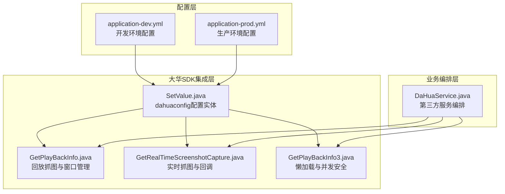
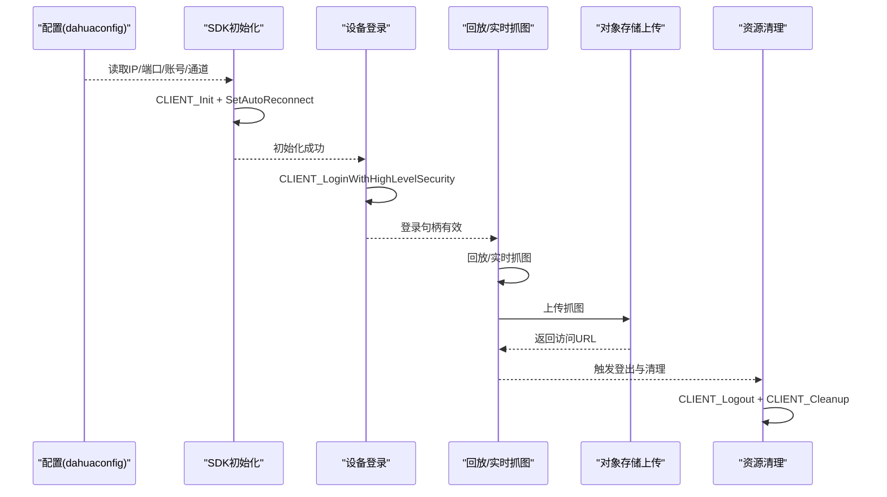
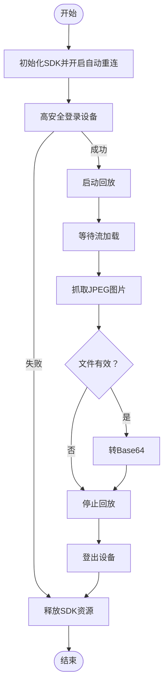
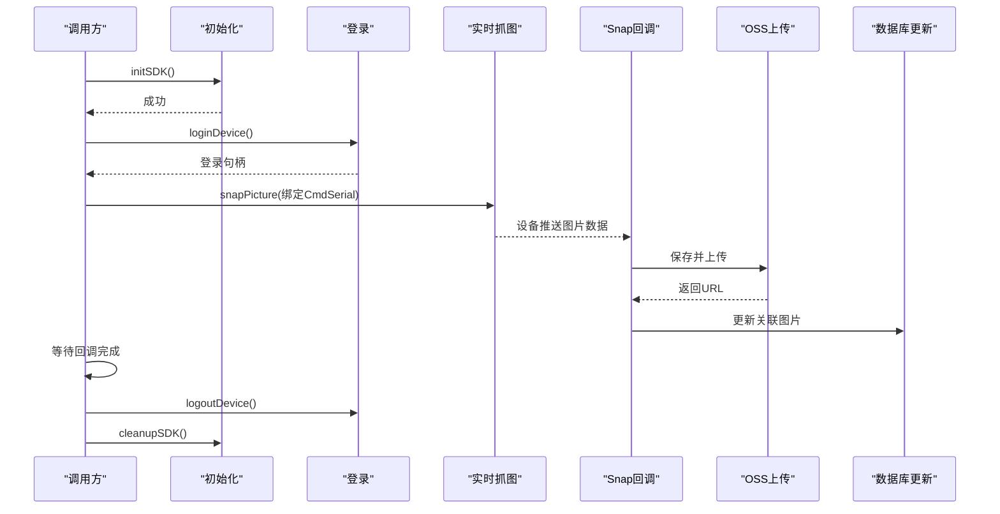
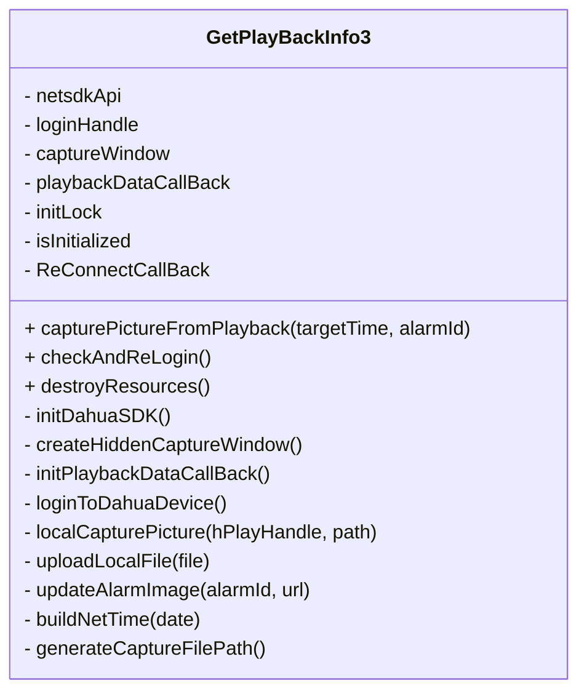
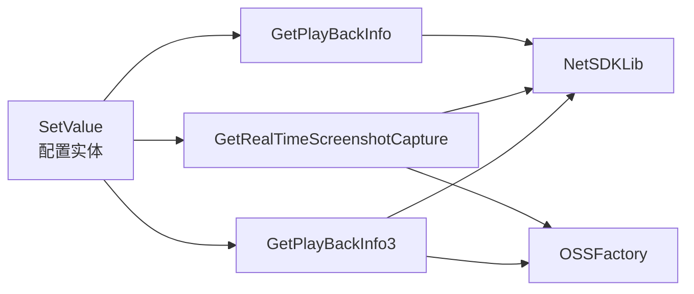

# 大华SDK集成

<cite>
**本文引用的文件**   
- [GetPlayBackInfo.java](file://monkey-monitor/src/main/java/com/monkey/general/dahua/GetPlayBackInfo.java)
- [GetRealTimeScreenshotCapture.java](file://monkey-monitor/src/main/java/com/monkey/general/dahua/GetRealTimeScreenshotCapture.java)
- [GetPlayBackInfo3.java](file://monkey-monitor/src/main/java/com/monkey/general/dahua/GetPlayBackInfo3.java)
- [SetValue.java](file://monkey-monitor/src/main/java/com/monkey/general/dahua/entity/SetValue.java)
- [application-prod.yml](file://deploy/config/monitor-api/application-prod.yml)
- [application-dev.yml](file://monkey-monitor-api/src/main/resources/application-dev.yml)
- [DaHuaService.java](file://monkey-monitor/src/main/java/com/monkey/general/modules/third/service/DaHuaService.java)
</cite>

## 目录
1. [简介](#简介)
2. [项目结构](#项目结构)
3. [核心组件](#核心组件)
4. [架构总览](#架构总览)
5. [详细组件分析](#详细组件分析)
6. [依赖分析](#依赖分析)
7. [性能考虑](#性能考虑)
8. [故障排查指南](#故障排查指南)
9. [结论](#结论)
10. [附录](#附录)

## 简介
本文件面向需要在现有Java工程中集成大华SDK的开发者，系统性阐述以下主题：
- SDK初始化流程与断线重连回调配置
- 自动重连机制与登录状态监控
- 设备登录流程与CLIENT_LoginWithHighLevelSecurity参数配置
- 资源管理最佳实践与CLIENT_Cleanup调用时机
- 完整集成示例（含错误处理、超时机制、连接状态监控）
- 不同版本SDK的兼容性与升级注意事项

## 项目结构
围绕大华SDK的集成，相关代码集中在以下模块与文件：
- dahua子包：包含回放抓图、实时抓图、懒加载抓图等核心实现
- entity包：配置实体类，承载大华设备参数
- 配置文件：application-dev.yml与deploy/config/.../application-prod.yml中提供dahuaconfig配置项
- 第三方服务：DaHuaService中对大华报警/抓图等业务进行编排

**图表来源**
- [GetPlayBackInfo.java:1-338](file://monkey-monitor/src/main/java/com/monkey/general/dahua/GetPlayBackInfo.java#L1-L338)
- [GetRealTimeScreenshotCapture.java:1-273](file://monkey-monitor/src/main/java/com/monkey/general/dahua/GetRealTimeScreenshotCapture.java#L1-L273)
- [GetPlayBackInfo3.java:1-427](file://monkey-monitor/src/main/java/com/monkey/general/dahua/GetPlayBackInfo3.java#L1-L427)
- [SetValue.java:1-20](file://monkey-monitor/src/main/java/com/monkey/general/dahua/entity/SetValue.java#L1-L20)
- [application-dev.yml:172-205](file://monkey-monitor-api/src/main/resources/application-dev.yml#L172-L205)
- [application-prod.yml:172-202](file://deploy/config/monitor-api/application-prod.yml#L172-L202)
- [DaHuaService.java:1-447](file://monkey-monitor/src/main/java/com/monkey/general/modules/third/service/DaHuaService.java#L1-L447)

**章节来源**
- [GetPlayBackInfo.java:1-338](file://monkey-monitor/src/main/java/com/monkey/general/dahua/GetPlayBackInfo.java#L1-L338)
- [GetRealTimeScreenshotCapture.java:1-273](file://monkey-monitor/src/main/java/com/monkey/general/dahua/GetRealTimeScreenshotCapture.java#L1-L273)
- [GetPlayBackInfo3.java:1-427](file://monkey-monitor/src/main/java/com/monkey/general/dahua/GetPlayBackInfo3.java#L1-L427)
- [SetValue.java:1-20](file://monkey-monitor/src/main/java/com/monkey/general/dahua/entity/SetValue.java#L1-L20)
- [application-dev.yml:172-205](file://monkey-monitor-api/src/main/resources/application-dev.yml#L172-L205)
- [application-prod.yml:172-202](file://deploy/config/monitor-api/application-prod.yml#L172-L202)
- [DaHuaService.java:1-447](file://monkey-monitor/src/main/java/com/monkey/general/modules/third/service/DaHuaService.java#L1-L447)

## 核心组件
- SDK初始化与自动重连
  - 使用CLIENT_Init进行SDK初始化，CLIENT_SetAutoReconnect注册断线重连回调
  - 重连回调用于监控设备重连成功事件
- 设备登录
  - 通过CLIENT_LoginWithHighLevelSecurity完成高安全级别登录
  - 参数包括设备IP、端口、用户名、密码、协议类型等
- 资源管理
  - 登出使用CLIENT_Logout，释放使用CLIENT_Cleanup
  - 提供懒加载与并发安全的资源销毁方案
- 抓图能力
  - 回放抓图：CLIENT_PlayBackByTimeEx + CLIENT_CapturePictureEx
  - 实时抓图：CLIENT_SnapPictureEx + 自定义Snap回调
- 配置管理
  - 通过SetValue实体绑定dahuaconfig配置项，统一管理设备参数

**章节来源**
- [GetPlayBackInfo.java:53-67](file://monkey-monitor/src/main/java/com/monkey/general/dahua/GetPlayBackInfo.java#L53-L67)
- [GetRealTimeScreenshotCapture.java:55-69](file://monkey-monitor/src/main/java/com/monkey/general/dahua/GetRealTimeScreenshotCapture.java#L55-L69)
- [GetPlayBackInfo3.java:302-314](file://monkey-monitor/src/main/java/com/monkey/general/dahua/GetPlayBackInfo3.java#L302-L314)
- [GetPlayBackInfo.java:72-93](file://monkey-monitor/src/main/java/com/monkey/general/dahua/GetPlayBackInfo.java#L72-L93)
- [GetRealTimeScreenshotCapture.java:83-104](file://monkey-monitor/src/main/java/com/monkey/general/dahua/GetRealTimeScreenshotCapture.java#L83-L104)
- [GetPlayBackInfo3.java:336-352](file://monkey-monitor/src/main/java/com/monkey/general/dahua/GetPlayBackInfo3.java#L336-L352)
- [GetPlayBackInfo.java:98-113](file://monkey-monitor/src/main/java/com/monkey/general/dahua/GetPlayBackInfo.java#L98-L113)
- [GetRealTimeScreenshotCapture.java:109-122](file://monkey-monitor/src/main/java/com/monkey/general/dahua/GetRealTimeScreenshotCapture.java#L109-L122)
- [GetPlayBackInfo3.java:245-299](file://monkey-monitor/src/main/java/com/monkey/general/dahua/GetPlayBackInfo3.java#L245-L299)
- [SetValue.java:11-19](file://monkey-monitor/src/main/java/com/monkey/general/dahua/entity/SetValue.java#L11-L19)

## 架构总览
下图展示从配置到抓图的端到端流程，涵盖初始化、登录、抓图、上传与资源清理。

**图表来源**
- [GetPlayBackInfo.java:288-320](file://monkey-monitor/src/main/java/com/monkey/general/dahua/GetPlayBackInfo.java#L288-L320)
- [GetRealTimeScreenshotCapture.java:229-268](file://monkey-monitor/src/main/java/com/monkey/general/dahua/GetRealTimeScreenshotCapture.java#L229-L268)
- [GetPlayBackInfo3.java:80-208](file://monkey-monitor/src/main/java/com/monkey/general/dahua/GetPlayBackInfo3.java#L80-L208)
- [application-dev.yml:178-193](file://monkey-monitor-api/src/main/resources/application-dev.yml#L178-L193)
- [application-prod.yml:178-187](file://deploy/config/monitor-api/application-prod.yml#L178-L187)

## 详细组件分析

### 组件A：回放抓图与窗口管理（GetPlayBackInfo）
- 初始化与重连
  - 初始化SDK并开启自动重连，注册断线重连回调
- 登录与登出
  - 使用CLIENT_LoginWithHighLevelSecurity完成登录，登录失败时及时清理资源
- 回放与抓图
  - 通过CLIENT_PlayBackByTimeEx启动回放，等待流加载后调用CLIENT_CapturePictureEx抓图
  - 生成唯一文件名并校验文件有效性
- 资源管理
  - 登出后停止回放，最后调用CLIENT_Cleanup释放SDK资源

**图表来源**
- [GetPlayBackInfo.java:53-67](file://monkey-monitor/src/main/java/com/monkey/general/dahua/GetPlayBackInfo.java#L53-L67)
- [GetPlayBackInfo.java:72-93](file://monkey-monitor/src/main/java/com/monkey/general/dahua/GetPlayBackInfo.java#L72-L93)
- [GetPlayBackInfo.java:126-201](file://monkey-monitor/src/main/java/com/monkey/general/dahua/GetPlayBackInfo.java#L126-L201)
- [GetPlayBackInfo.java:98-113](file://monkey-monitor/src/main/java/com/monkey/general/dahua/GetPlayBackInfo.java#L98-L113)

**章节来源**
- [GetPlayBackInfo.java:1-338](file://monkey-monitor/src/main/java/com/monkey/general/dahua/GetPlayBackInfo.java#L1-L338)

### 组件B：实时抓图与回调（GetRealTimeScreenshotCapture）
- 初始化与重连
  - 同样使用CLIENT_Init与CLIENT_SetAutoReconnect
- 登录与登出
  - 高安全登录，失败时清理SDK
- 抓图流程
  - 仅首次注册Snap回调，避免重复注册
  - 为每次抓图生成唯一CmdSerial，确保回调精准匹配
  - 抓图成功后立即上传至OSS并更新数据库
- 资源管理
  - 登出后清理SDK

**图表来源**
- [GetRealTimeScreenshotCapture.java:55-69](file://monkey-monitor/src/main/java/com/monkey/general/dahua/GetRealTimeScreenshotCapture.java#L55-L69)
- [GetRealTimeScreenshotCapture.java:83-104](file://monkey-monitor/src/main/java/com/monkey/general/dahua/GetRealTimeScreenshotCapture.java#L83-L104)
- [GetRealTimeScreenshotCapture.java:192-222](file://monkey-monitor/src/main/java/com/monkey/general/dahua/GetRealTimeScreenshotCapture.java#L192-L222)
- [GetRealTimeScreenshotCapture.java:127-162](file://monkey-monitor/src/main/java/com/monkey/general/dahua/GetRealTimeScreenshotCapture.java#L127-L162)
- [GetRealTimeScreenshotCapture.java:109-122](file://monkey-monitor/src/main/java/com/monkey/general/dahua/GetRealTimeScreenshotCapture.java#L109-L122)

**章节来源**
- [GetRealTimeScreenshotCapture.java:1-273](file://monkey-monitor/src/main/java/com/monkey/general/dahua/GetRealTimeScreenshotCapture.java#L1-L273)

### 组件C：懒加载与并发安全（GetPlayBackInfo3）
- 懒加载初始化
  - 仅在首次抓图时初始化SDK、创建隐藏窗口、注册回调、登录设备
- 并发安全
  - 使用ReentrantLock与双重检查避免重复初始化
- 连接状态监控
  - 通过checkAndReLogin在抓图失败时兜底重新登录
- 资源管理
  - 提供destroyResources手动销毁，确保窗口与SDK资源释放
- 超时与等待
  - 设置连接超时与回放加载等待时间，提升稳定性

**图表来源**
- [GetPlayBackInfo3.java:41-427](file://monkey-monitor/src/main/java/com/monkey/general/dahua/GetPlayBackInfo3.java#L41-L427)

**章节来源**
- [GetPlayBackInfo3.java:1-427](file://monkey-monitor/src/main/java/com/monkey/general/dahua/GetPlayBackInfo3.java#L1-L427)

### 组件D：配置实体（SetValue）
- 绑定dahuaconfig配置前缀，提供开关、IP、端口、账号、通道等参数
- 由各抓图组件读取并用于登录与抓图

**章节来源**
- [SetValue.java:1-20](file://monkey-monitor/src/main/java/com/monkey/general/dahua/entity/SetValue.java#L1-L20)
- [application-dev.yml:178-193](file://monkey-monitor-api/src/main/resources/application-dev.yml#L178-L193)
- [application-prod.yml:178-187](file://deploy/config/monitor-api/application-prod.yml#L178-L187)

## 依赖分析
- 组件耦合
  - GetPlayBackInfo与GetRealTimeScreenshotCapture均依赖NetSDKLib与JNA窗口句柄
  - GetPlayBackInfo3通过SetValue集中读取配置，降低硬编码耦合
- 外部依赖
  - NetSDKLib：大华SDK接口封装
  - OSSFactory：对象存储上传
  - Spring：组件装配与配置读取

**图表来源**
- [GetPlayBackInfo.java:24-26](file://monkey-monitor/src/main/java/com/monkey/general/dahua/GetPlayBackInfo.java#L24-L26)
- [GetRealTimeScreenshotCapture.java:32-35](file://monkey-monitor/src/main/java/com/monkey/general/dahua/GetRealTimeScreenshotCapture.java#L32-L35)
- [GetPlayBackInfo3.java:68-70](file://monkey-monitor/src/main/java/com/monkey/general/dahua/GetPlayBackInfo3.java#L68-L70)
- [SetValue.java:11-19](file://monkey-monitor/src/main/java/com/monkey/general/dahua/entity/SetValue.java#L11-L19)

**章节来源**
- [GetPlayBackInfo.java:1-338](file://monkey-monitor/src/main/java/com/monkey/general/dahua/GetPlayBackInfo.java#L1-L338)
- [GetRealTimeScreenshotCapture.java:1-273](file://monkey-monitor/src/main/java/com/monkey/general/dahua/GetRealTimeScreenshotCapture.java#L1-L273)
- [GetPlayBackInfo3.java:1-427](file://monkey-monitor/src/main/java/com/monkey/general/dahua/GetPlayBackInfo3.java#L1-L427)
- [SetValue.java:1-20](file://monkey-monitor/src/main/java/com/monkey/general/dahua/entity/SetValue.java#L1-L20)

## 性能考虑
- 回放加载等待
  - 回放启动后建议等待固定时间以确保缓冲区就绪，避免抓图失败
- 文件I/O与上传
  - 抓图后优先上传至OSS，减少本地磁盘压力
- 并发与懒加载
  - 懒加载与锁机制避免重复初始化，降低资源占用
- 超时设置
  - 设置连接超时与回放等待时间，平衡稳定性与响应速度

[本节为通用指导，无需特定文件引用]

## 故障排查指南
- 初始化失败
  - 检查CLIENT_GetLastError输出，确认网络连通与SDK库路径
- 登录失败
  - 校验IP、端口、用户名、密码与协议类型；必要时重新登录
- 抓图失败
  - 确认窗口句柄有效、回放已加载、文件路径存在且可写
- 重连异常
  - 检查断线重连回调是否注册，关注设备重连日志
- 资源泄漏
  - 确保每次会话结束后调用CLIENT_Logout与CLIENT_Cleanup

**章节来源**
- [GetPlayBackInfo.java:57-60](file://monkey-monitor/src/main/java/com/monkey/general/dahua/GetPlayBackInfo.java#L57-L60)
- [GetRealTimeScreenshotCapture.java:98-101](file://monkey-monitor/src/main/java/com/monkey/general/dahua/GetRealTimeScreenshotCapture.java#L98-L101)
- [GetPlayBackInfo3.java:304-311](file://monkey-monitor/src/main/java/com/monkey/general/dahua/GetPlayBackInfo3.java#L304-L311)

## 结论
通过以上组件与流程设计，系统实现了：
- 稳健的SDK初始化与自动重连
- 明确的登录与登出生命周期
- 可靠的回放与实时抓图能力
- 安全的资源管理与并发控制
- 可配置的参数与可扩展的业务编排

建议在生产环境中结合业务场景进一步完善超时策略、重试机制与监控告警。

[本节为总结性内容，无需特定文件引用]

## 附录

### A. 完整集成示例（步骤级说明）
- 配置
  - 在application-dev.yml或application-prod.yml中设置dahuaconfig参数
- 初始化
  - 调用initSDK，开启自动重连
- 登录
  - 使用loginDevice完成高安全登录
- 抓图
  - 回放抓图：启动回放并等待加载后抓图
  - 实时抓图：发送抓图命令并等待回调
- 上传与更新
  - 抓图成功后上传至OSS并更新数据库
- 清理
  - 登出设备并释放SDK资源

**章节来源**
- [application-dev.yml:178-193](file://monkey-monitor-api/src/main/resources/application-dev.yml#L178-L193)
- [application-prod.yml:178-187](file://deploy/config/monitor-api/application-prod.yml#L178-L187)
- [GetPlayBackInfo.java:288-320](file://monkey-monitor/src/main/java/com/monkey/general/dahua/GetPlayBackInfo.java#L288-L320)
- [GetRealTimeScreenshotCapture.java:229-268](file://monkey-monitor/src/main/java/com/monkey/general/dahua/GetRealTimeScreenshotCapture.java#L229-L268)
- [GetPlayBackInfo3.java:80-208](file://monkey-monitor/src/main/java/com/monkey/general/dahua/GetPlayBackInfo3.java#L80-L208)

### B. 不同版本SDK的兼容性与升级注意事项
- 初始化差异
  - 低版本SDK可能缺少某些回调或API，需降级处理
- 登录参数
  - 高安全登录参数在不同版本中保持稳定，注意字节数组长度与编码
- 回调与句柄
  - 窗口句柄与回调注册在不同版本中行为一致，需确保线程安全
- 升级建议
  - 优先采用懒加载与并发安全策略，逐步替换旧实现
  - 严格测试回放加载等待与抓图成功率

[本节为通用指导，无需特定文件引用]