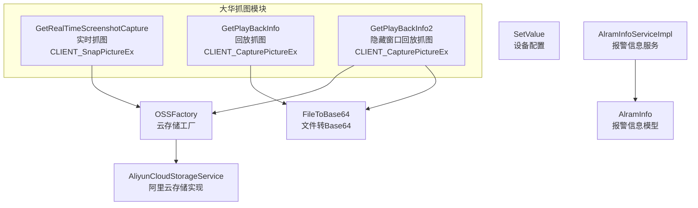
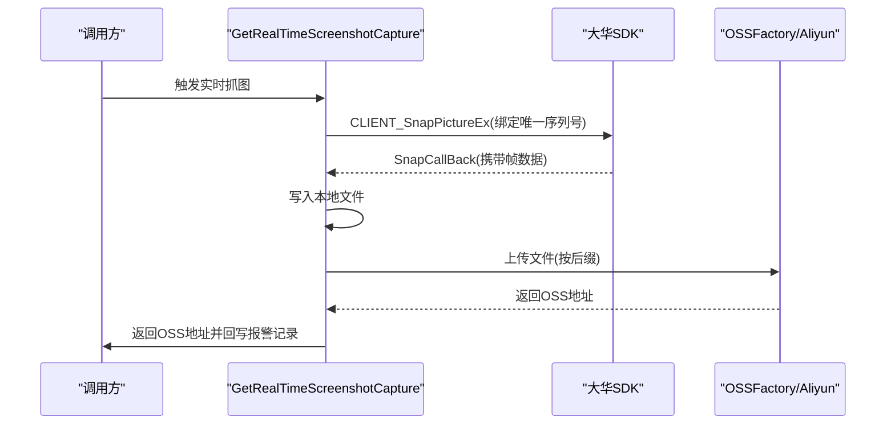
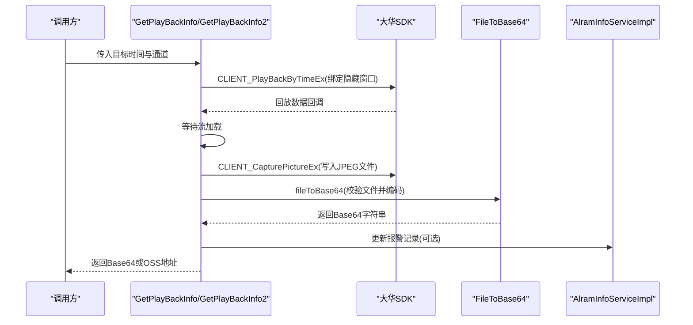
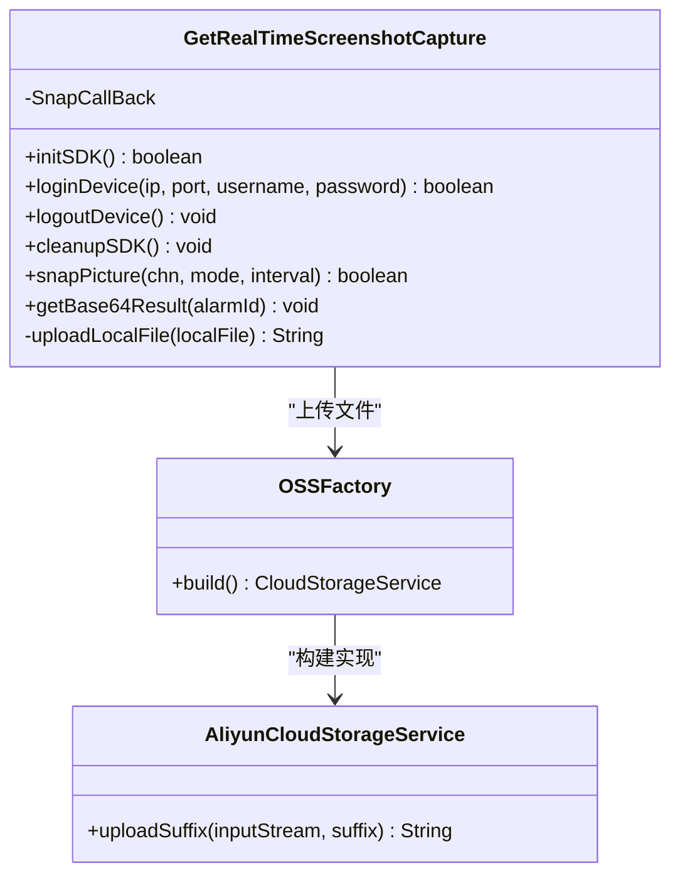
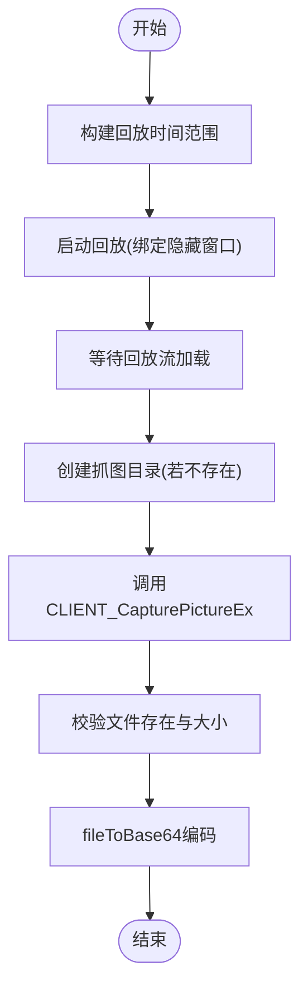
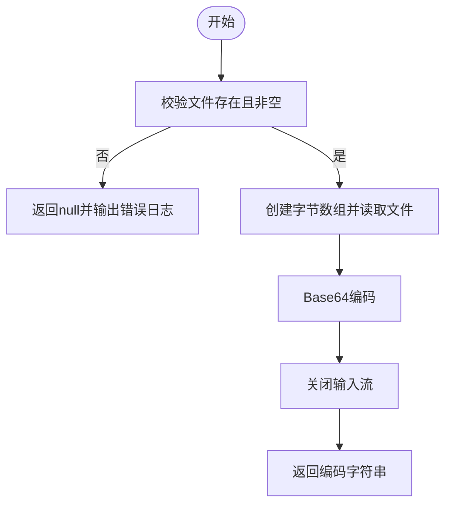
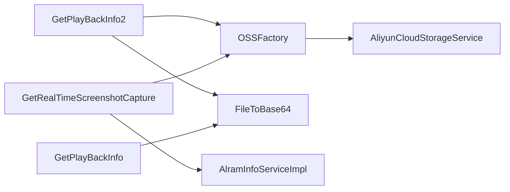

# 实时截图捕获

<cite>
**本文档引用的文件**
- [GetRealTimeScreenshotCapture.java](file://monkey-monitor/src/main/java/com/monkey/general/dahua/GetRealTimeScreenshotCapture.java)
- [GetPlayBackInfo.java](file://monkey-monitor/src/main/java/com/monkey/general/dahua/GetPlayBackInfo.java)
- [GetPlayBackInfo2.java](file://monkey-monitor/src/main/java/com/monkey/general/dahua/GetPlayBackInfo2.java)
- [FileToBase64.java](file://monkey-monitor/src/main/java/com/monkey/general/dahua/FileToBase64.java)
- [SetValue.java](file://monkey-monitor/src/main/java/com/monkey/general/dahua/entity/SetValue.java)
- [AlramInfo.java](file://monkey-monitor/src/main/java/com/monkey/general/modules/em/entity/AlramInfo.java)
- [AlramInfoServiceImpl.java](file://monkey-monitor/src/main/java/com/monkey/general/modules/em/service/impl/AlramInfoServiceImpl.java)
- [OSSFactory.java](file://monkey-service/src/main/java/com/monkey/general/modules/oss/cloud/OSSFactory.java)
- [AliyunCloudStorageService.java](file://monkey-service/src/main/java/com/monkey/general/modules/oss/cloud/AliyunCloudStorageService.java)
</cite>

## 目录
1. [简介](#简介)
2. [项目结构](#项目结构)
3. [核心组件](#核心组件)
4. [架构总览](#架构总览)
5. [详细组件分析](#详细组件分析)
6. [依赖分析](#依赖分析)
7. [性能考虑](#性能考虑)
8. [故障排查指南](#故障排查指南)
9. [结论](#结论)
10. [附录](#附录)

## 简介
本文件围绕“实时截图捕获”功能，系统性梳理并解释以下要点：
- CLIENT_CapturePictureEx 方法的使用与参数配置
- JPEG 格式设置与文件保存路径管理
- 截图时机选择策略（回放流加载完成判断、截图延迟优化、图像质量控制）
- 文件转 Base64 编码的实现机制（文件读取、编码处理、内存管理优化）
- 截图路径有效性验证（目录创建、文件权限检查、磁盘空间监控）
- 完整实现示例（错误处理、重试机制、性能优化技巧）
- 截图质量与文件大小的平衡策略

## 项目结构
本功能涉及多个模块与组件：
- 大华 SDK 封装与抓图逻辑：GetRealTimeScreenshotCapture、GetPlayBackInfo、GetPlayBackInfo2
- 文件到 Base64 编码工具：FileToBase64
- 配置实体：SetValue
- 报警信息模型与服务：AlramInfo、AlramInfoServiceImpl
- 云存储工厂与实现：OSSFactory、AliyunCloudStorageService

**图表来源**
- [GetRealTimeScreenshotCapture.java:1-273](file://monkey-monitor/src/main/java/com/monkey/general/dahua/GetRealTimeScreenshotCapture.java#L1-L273)
- [GetPlayBackInfo.java:1-338](file://monkey-monitor/src/main/java/com/monkey/general/dahua/GetPlayBackInfo.java#L1-L338)
- [GetPlayBackInfo2.java:1-352](file://monkey-monitor/src/main/java/com/monkey/general/dahua/GetPlayBackInfo2.java#L1-L352)
- [FileToBase64.java:1-51](file://monkey-monitor/src/main/java/com/monkey/general/dahua/FileToBase64.java#L1-L51)
- [SetValue.java:1-20](file://monkey-monitor/src/main/java/com/monkey/general/dahua/entity/SetValue.java#L1-L20)
- [AlramInfo.java:1-330](file://monkey-monitor/src/main/java/com/monkey/general/modules/em/entity/AlramInfo.java#L1-L330)
- [AlramInfoServiceImpl.java:1-436](file://monkey-monitor/src/main/java/com/monkey/general/modules/em/service/impl/AlramInfoServiceImpl.java#L1-L436)
- [OSSFactory.java:1-36](file://monkey-service/src/main/java/com/monkey/general/modules/oss/cloud/OSSFactory.java#L1-L36)
- [AliyunCloudStorageService.java:1-56](file://monkey-service/src/main/java/com/monkey/general/modules/oss/cloud/AliyunCloudStorageService.java#L1-L56)

**章节来源**
- [GetRealTimeScreenshotCapture.java:1-273](file://monkey-monitor/src/main/java/com/monkey/general/dahua/GetRealTimeScreenshotCapture.java#L1-L273)
- [GetPlayBackInfo.java:1-338](file://monkey-monitor/src/main/java/com/monkey/general/dahua/GetPlayBackInfo.java#L1-L338)
- [GetPlayBackInfo2.java:1-352](file://monkey-monitor/src/main/java/com/monkey/general/dahua/GetPlayBackInfo2.java#L1-L352)
- [FileToBase64.java:1-51](file://monkey-monitor/src/main/java/com/monkey/general/dahua/FileToBase64.java#L1-L51)
- [SetValue.java:1-20](file://monkey-monitor/src/main/java/com/monkey/general/dahua/entity/SetValue.java#L1-L20)
- [AlramInfo.java:1-330](file://monkey-monitor/src/main/java/com/monkey/general/modules/em/entity/AlramInfo.java#L1-L330)
- [AlramInfoServiceImpl.java:1-436](file://monkey-monitor/src/main/java/com/monkey/general/modules/em/service/impl/AlramInfoServiceImpl.java#L1-L436)
- [OSSFactory.java:1-36](file://monkey-service/src/main/java/com/monkey/general/modules/oss/cloud/OSSFactory.java#L1-L36)
- [AliyunCloudStorageService.java:1-56](file://monkey-service/src/main/java/com/monkey/general/modules/oss/cloud/AliyunCloudStorageService.java#L1-L56)

## 核心组件
- 实时抓图（CLIENT_SnapPictureEx）
  - 通过 SnapCallBack 回调接收设备编码帧，写入本地并上传 OSS，最终回传 OSS 地址。
  - 关键点：唯一序列号绑定、回调去重、OSS 上传与回写报警记录。
- 回放抓图（CLIENT_CapturePictureEx）
  - 通过回放时间窗口启动播放句柄，等待流加载后调用抓图，随后进行 Base64 编码与路径校验。
  - 关键点：隐藏窗口缓冲区绑定、等待时间、目录创建、文件存在性与大小校验。
- 文件到 Base64 工具
  - 读取文件字节并进行 Base64 编码，异常处理与资源关闭。
- 配置与模型
  - SetValue 提供设备登录参数；AlramInfo 与 AlramInfoServiceImpl 负责报警记录与回写。

**章节来源**
- [GetRealTimeScreenshotCapture.java:124-222](file://monkey-monitor/src/main/java/com/monkey/general/dahua/GetRealTimeScreenshotCapture.java#L124-L222)
- [GetPlayBackInfo.java:126-212](file://monkey-monitor/src/main/java/com/monkey/general/dahua/GetPlayBackInfo.java#L126-L212)
- [GetPlayBackInfo2.java:208-287](file://monkey-monitor/src/main/java/com/monkey/general/dahua/GetPlayBackInfo2.java#L208-L287)
- [FileToBase64.java:15-49](file://monkey-monitor/src/main/java/com/monkey/general/dahua/FileToBase64.java#L15-L49)
- [SetValue.java:11-19](file://monkey-monitor/src/main/java/com/monkey/general/dahua/entity/SetValue.java#L11-L19)
- [AlramInfo.java:293-294](file://monkey-monitor/src/main/java/com/monkey/general/modules/em/entity/AlramInfo.java#L293-L294)
- [AlramInfoServiceImpl.java:310-317](file://monkey-monitor/src/main/java/com/monkey/general/modules/em/service/impl/AlramInfoServiceImpl.java#L310-L317)

## 架构总览
整体流程分为两类：
- 实时抓图：设备侧主动推送帧 → 写本地 → 上传 OSS → 回写报警记录
- 回放抓图：构造回放时间窗口 → 绑定隐藏窗口缓冲区 → 等待流加载 → 抓图 → Base64 编码

**图表来源**
- [GetRealTimeScreenshotCapture.java:192-222](file://monkey-monitor/src/main/java/com/monkey/general/dahua/GetRealTimeScreenshotCapture.java#L192-L222)
- [GetRealTimeScreenshotCapture.java:127-162](file://monkey-monitor/src/main/java/com/monkey/general/dahua/GetRealTimeScreenshotCapture.java#L127-L162)
- [OSSFactory.java:21-34](file://monkey-service/src/main/java/com/monkey/general/modules/oss/cloud/OSSFactory.java#L21-L34)
- [AliyunCloudStorageService.java:37-55](file://monkey-service/src/main/java/com/monkey/general/modules/oss/cloud/AliyunCloudStorageService.java#L37-L55)

**图表来源**
- [GetPlayBackInfo.java:126-212](file://monkey-monitor/src/main/java/com/monkey/general/dahua/GetPlayBackInfo.java#L126-L212)
- [GetPlayBackInfo2.java:208-287](file://monkey-monitor/src/main/java/com/monkey/general/dahua/GetPlayBackInfo2.java#L208-L287)
- [FileToBase64.java:15-49](file://monkey-monitor/src/main/java/com/monkey/general/dahua/FileToBase64.java#L15-L49)
- [AlramInfoServiceImpl.java:283-287](file://monkey-monitor/src/main/java/com/monkey/general/modules/em/service/impl/AlramInfoServiceImpl.java#L283-L287)

## 详细组件分析

### 实时抓图组件（CLIENT_SnapPictureEx）
- 参数配置
  - SNAP_PARAMS：通道、模式、质量、间隔、CmdSerial（唯一序列号）
- JPEG 与路径
  - 写入本地 JPG 文件，命名包含时间戳与随机后缀
- 云存储上传
  - 依据文件后缀上传至 OSS，返回 OSS 地址
- 回写报警
  - 通过 AlramInfoServiceImpl 更新 associated_images 字段

**图表来源**
- [GetRealTimeScreenshotCapture.java:192-222](file://monkey-monitor/src/main/java/com/monkey/general/dahua/GetRealTimeScreenshotCapture.java#L192-L222)
- [GetRealTimeScreenshotCapture.java:169-189](file://monkey-monitor/src/main/java/com/monkey/general/dahua/GetRealTimeScreenshotCapture.java#L169-L189)
- [OSSFactory.java:21-34](file://monkey-service/src/main/java/com/monkey/general/modules/oss/cloud/OSSFactory.java#L21-L34)
- [AliyunCloudStorageService.java:37-55](file://monkey-service/src/main/java/com/monkey/general/modules/oss/cloud/AliyunCloudStorageService.java#L37-L55)

**章节来源**
- [GetRealTimeScreenshotCapture.java:124-222](file://monkey-monitor/src/main/java/com/monkey/general/dahua/GetRealTimeScreenshotCapture.java#L124-L222)
- [GetRealTimeScreenshotCapture.java:169-189](file://monkey-monitor/src/main/java/com/monkey/general/dahua/GetRealTimeScreenshotCapture.java#L169-L189)
- [OSSFactory.java:21-34](file://monkey-service/src/main/java/com/monkey/general/modules/oss/cloud/OSSFactory.java#L21-L34)
- [AliyunCloudStorageService.java:37-55](file://monkey-service/src/main/java/com/monkey/general/modules/oss/cloud/AliyunCloudStorageService.java#L37-L55)

### 回放抓图组件（CLIENT_CapturePictureEx）
- 参数配置
  - PlayBackByTimeEx：起止时间、通道、隐藏窗口句柄、数据回调
  - CapturePictureEx：写入 JPEG 文件
- 截图时机
  - 等待回放流加载（固定等待时间），确保缓冲区有效帧
- 路径与校验
  - 自动生成绝对路径，自动创建父目录，校验文件存在与大小
- Base64 编码
  - fileToBase64：读取字节并编码，异常处理与资源关闭

**图表来源**
- [GetPlayBackInfo.java:126-212](file://monkey-monitor/src/main/java/com/monkey/general/dahua/GetPlayBackInfo.java#L126-L212)
- [GetPlayBackInfo2.java:208-287](file://monkey-monitor/src/main/java/com/monkey/general/dahua/GetPlayBackInfo2.java#L208-L287)
- [FileToBase64.java:15-49](file://monkey-monitor/src/main/java/com/monkey/general/dahua/FileToBase64.java#L15-L49)

**章节来源**
- [GetPlayBackInfo.java:126-212](file://monkey-monitor/src/main/java/com/monkey/general/dahua/GetPlayBackInfo.java#L126-L212)
- [GetPlayBackInfo2.java:208-287](file://monkey-monitor/src/main/java/com/monkey/general/dahua/GetPlayBackInfo2.java#L208-L287)
- [FileToBase64.java:15-49](file://monkey-monitor/src/main/java/com/monkey/general/dahua/FileToBase64.java#L15-L49)

### 文件转 Base64 编码机制
- 文件读取
  - 校验文件存在与非空；按文件大小分配字节数组；FileInputStream 读取
- 编码处理
  - 使用 Base64.getEncoder().encodeToString 进行编码
- 内存管理
  - try-with-resources 或 finally 中关闭 InputStream，避免资源泄露

**图表来源**
- [FileToBase64.java:15-49](file://monkey-monitor/src/main/java/com/monkey/general/dahua/FileToBase64.java#L15-L49)

**章节来源**
- [FileToBase64.java:15-49](file://monkey-monitor/src/main/java/com/monkey/general/dahua/FileToBase64.java#L15-L49)

### 截图路径有效性验证
- 目录创建
  - 使用 mkdirs() 自动创建父目录，避免路径不存在导致失败
- 权限检查
  - 通过文件存在性与大小校验间接反映写入权限
- 磁盘空间监控
  - 代码未直接实现磁盘空间监控，建议在外部运维层面保障磁盘空间充足

**章节来源**
- [GetPlayBackInfo.java:168-176](file://monkey-monitor/src/main/java/com/monkey/general/dahua/GetPlayBackInfo.java#L168-L176)
- [GetPlayBackInfo2.java:253-256](file://monkey-monitor/src/main/java/com/monkey/general/dahua/GetPlayBackInfo2.java#L253-L256)

## 依赖分析
- 组件耦合
  - GetRealTimeScreenshotCapture 与 OSSFactory/AliyunCloudStorageService 解耦，便于更换云厂商
  - GetPlayBackInfo/GetPlayBackInfo2 与 FileToBase64 独立，便于单元测试与复用
- 外部依赖
  - 大华 SDK（CLIENT_SnapPictureEx、CLIENT_CapturePictureEx、CLIENT_PlayBackByTimeEx）
  - Java 原生 Base64 编码
  - Spring 环境（配置注入、服务更新）

**图表来源**
- [GetRealTimeScreenshotCapture.java:169-189](file://monkey-monitor/src/main/java/com/monkey/general/dahua/GetRealTimeScreenshotCapture.java#L169-L189)
- [GetPlayBackInfo.java:190-192](file://monkey-monitor/src/main/java/com/monkey/general/dahua/GetPlayBackInfo.java#L190-L192)
- [GetPlayBackInfo2.java:264-266](file://monkey-monitor/src/main/java/com/monkey/general/dahua/GetPlayBackInfo2.java#L264-L266)
- [OSSFactory.java:21-34](file://monkey-service/src/main/java/com/monkey/general/modules/oss/cloud/OSSFactory.java#L21-L34)
- [AliyunCloudStorageService.java:37-55](file://monkey-service/src/main/java/com/monkey/general/modules/oss/cloud/AliyunCloudStorageService.java#L37-L55)

**章节来源**
- [GetRealTimeScreenshotCapture.java:169-189](file://monkey-monitor/src/main/java/com/monkey/general/dahua/GetRealTimeScreenshotCapture.java#L169-L189)
- [GetPlayBackInfo.java:190-192](file://monkey-monitor/src/main/java/com/monkey/general/dahua/GetPlayBackInfo.java#L190-L192)
- [GetPlayBackInfo2.java:264-266](file://monkey-monitor/src/main/java/com/monkey/general/dahua/GetPlayBackInfo2.java#L264-L266)
- [OSSFactory.java:21-34](file://monkey-service/src/main/java/com/monkey/general/modules/oss/cloud/OSSFactory.java#L21-L34)
- [AliyunCloudStorageService.java:37-55](file://monkey-service/src/main/java/com/monkey/general/modules/oss/cloud/AliyunCloudStorageService.java#L37-L55)

## 性能考虑
- 截图时机
  - 回放流加载等待时间应根据网络与设备性能调整，避免过短导致空帧、过长影响吞吐
- 质量与大小平衡
  - 实时抓图通过 SNAP_PARAMS 的 Quality 控制；回放抓图为 JPEG 格式，文件大小受编码参数影响
- 资源管理
  - 回调与流句柄及时释放，避免句柄泄漏；Base64 编码使用一次性数组，注意大文件内存占用
- 并发与异步
  - 回放抓图采用异步线程池，避免阻塞主线程

[本节为通用性能建议，不直接分析具体文件]

## 故障排查指南
- 回放启动失败
  - 检查设备登录状态与网络连通性；查看错误码并重试
- 抓图为空或文件大小为 0
  - 延长等待时间；确认隐藏窗口缓冲区有效；检查时间窗口是否包含有效帧
- 文件写入失败
  - 校验保存路径存在与权限；确保父目录创建成功
- Base64 编码异常
  - 检查文件是否存在与非空；确认输入流正确关闭
- OSS 上传失败
  - 校验云存储配置与桶权限；确认文件后缀正确

**章节来源**
- [GetPlayBackInfo.java:153-156](file://monkey-monitor/src/main/java/com/monkey/general/dahua/GetPlayBackInfo.java#L153-L156)
- [GetPlayBackInfo.java:180-189](file://monkey-monitor/src/main/java/com/monkey/general/dahua/GetPlayBackInfo.java#L180-L189)
- [FileToBase64.java:16-20](file://monkey-monitor/src/main/java/com/monkey/general/dahua/FileToBase64.java#L16-L20)
- [GetRealTimeScreenshotCapture.java:169-189](file://monkey-monitor/src/main/java/com/monkey/general/dahua/GetRealTimeScreenshotCapture.java#L169-L189)

## 结论
本文档系统梳理了实时与回放两种截图路径，明确了 CLIENT_CapturePictureEx 的使用方式、JPEG 与路径管理、截图时机与质量控制、Base64 编码机制以及路径有效性验证。结合 OSS 上传与报警记录回写，形成完整的截图捕获闭环。建议在生产环境中结合监控与告警完善磁盘空间与网络稳定性保障。

[本节为总结性内容，不直接分析具体文件]

## 附录
- 完整实现示例（步骤化）
  - 实时抓图
    1) 初始化 SDK 并开启自动重连
    2) 登录设备
    3) 发送 SnapPictureEx 命令（绑定唯一序列号）
    4) 在回调中写入本地并上传 OSS
    5) 回写报警记录 associated_images
  - 回放抓图
    1) 构造回放时间窗口并启动播放（绑定隐藏窗口）
    2) 等待流加载
    3) 调用 CapturePictureEx 写入 JPEG
    4) 校验文件存在与大小
    5) fileToBase64 编码或直接上传 OSS
    6) 可选：回写报警记录
- 错误处理与重试
  - 回放启动失败与抓图失败均需记录错误码并重试；OSS 上传失败可记录重试队列
- 性能优化技巧
  - 动态调整等待时间；批量上传与并发控制；Base64 编码分块处理（针对超大文件）

[本节为实践指导，不直接分析具体文件]