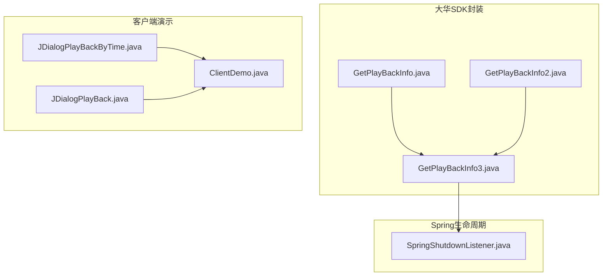
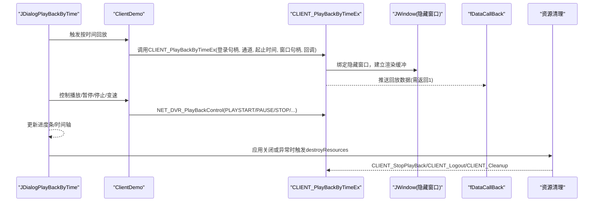
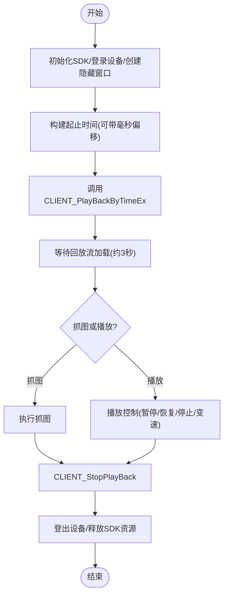
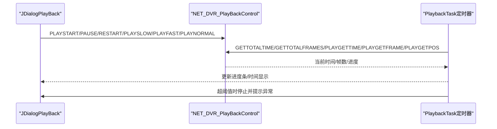
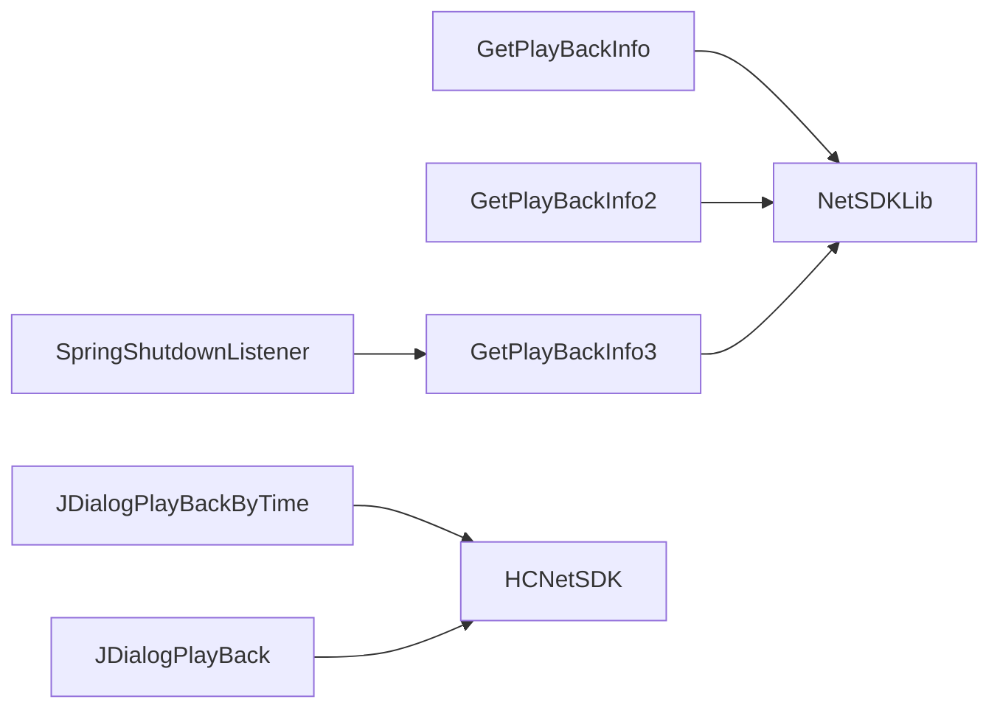

# 视频回放功能

<cite>
**本文引用的文件列表**
- [GetPlayBackInfo.java](file://monkey-monitor/src/main/java/com/monkey/general/dahua/GetPlayBackInfo.java)
- [GetPlayBackInfo2.java](file://monkey-monitor/src/main/java/com/monkey/general/dahua/GetPlayBackInfo2.java)
- [GetPlayBackInfo3.java](file://monkey-monitor/src/main/java/com/monkey/general/dahua/GetPlayBackInfo3.java)
- [JDialogPlayBackByTime.java](file://monkey-monitor/src/main/java/com/monkey/general/viedeo/ClientDemo/JDialogPlayBackByTime.java)
- [JDialogPlayBack.java](file://monkey-monitor/src/main/java/com/monkey/general/viedeo/ClientDemo/JDialogPlayBack.java)
- [ClientDemo.java](file://monkey-monitor/src/main/java/com/monkey/general/viedeo/ClientDemo/ClientDemo.java)
- [SpringShutdownListener.java](file://monkey-monitor-api/src/main/java/com/monkey/general/config/SpringShutdownListener.java)
</cite>

## 目录
1. [简介](#简介)
2. [项目结构](#项目结构)
3. [核心组件](#核心组件)
4. [架构概览](#架构概览)
5. [详细组件分析](#详细组件分析)
6. [依赖分析](#依赖分析)
7. [性能考虑](#性能考虑)
8. [故障排查指南](#故障排查指南)
9. [结论](#结论)
10. [附录](#附录)

## 简介
本文件围绕视频回放功能，重点讲解CLIENT_PlayBackByTimeEx方法的使用与实现细节，涵盖以下方面：
- 回放参数配置：时间范围、通道选择、窗口绑定
- 启动与停止流程：播放句柄管理、状态监控、资源清理
- 时间轴控制：毫秒级定位、速度调节、快进/快退
- 数据回调处理：流数据解析、错误处理、性能优化
- 完整使用示例：异常处理、超时重试、用户体验优化

## 项目结构
本项目中与视频回放相关的核心代码位于“dahua”和“viedeo/ClientDemo”两个包内，分别负责SDK封装、隐藏窗口抓图以及UI交互演示。

图表来源
- [GetPlayBackInfo.java:126-201](file://monkey-monitor/src/main/java/com/monkey/general/dahua/GetPlayBackInfo.java#L126-L201)
- [GetPlayBackInfo2.java:212-243](file://monkey-monitor/src/main/java/com/monkey/general/dahua/GetPlayBackInfo2.java#L212-L243)
- [GetPlayBackInfo3.java:118-208](file://monkey-monitor/src/main/java/com/monkey/general/dahua/GetPlayBackInfo3.java#L118-L208)
- [JDialogPlayBackByTime.java:583-639](file://monkey-monitor/src/main/java/com/monkey/general/viedeo/ClientDemo/JDialogPlayBackByTime.java#L583-L639)
- [JDialogPlayBack.java:774-832](file://monkey-monitor/src/main/java/com/monkey/general/viedeo/ClientDemo/JDialogPlayBack.java#L774-L832)
- [ClientDemo.java:1625-1671](file://monkey-monitor/src/main/java/com/monkey/general/viedeo/ClientDemo/ClientDemo.java#L1625-L1671)
- [SpringShutdownListener.java:15-25](file://monkey-monitor-api/src/main/java/com/monkey/general/config/SpringShutdownListener.java#L15-L25)

章节来源
- [GetPlayBackInfo.java:1-338](file://monkey-monitor/src/main/java/com/monkey/general/dahua/GetPlayBackInfo.java#L1-L338)
- [GetPlayBackInfo2.java:1-250](file://monkey-monitor/src/main/java/com/monkey/general/dahua/GetPlayBackInfo2.java#L1-L250)
- [GetPlayBackInfo3.java:1-427](file://monkey-monitor/src/main/java/com/monkey/general/dahua/GetPlayBackInfo3.java#L1-L427)
- [JDialogPlayBackByTime.java:1-639](file://monkey-monitor/src/main/java/com/monkey/general/viedeo/ClientDemo/JDialogPlayBackByTime.java#L1-L639)
- [JDialogPlayBack.java:1-1144](file://monkey-monitor/src/main/java/com/monkey/general/viedeo/ClientDemo/JDialogPlayBack.java#L1-L1144)
- [ClientDemo.java:1625-1671](file://monkey-monitor/src/main/java/com/monkey/general/viedeo/ClientDemo/ClientDemo.java#L1625-L1671)
- [SpringShutdownListener.java:1-26](file://monkey-monitor-api/src/main/java/com/monkey/general/config/SpringShutdownListener.java#L1-L26)

## 核心组件
- CLIENT_PlayBackByTimeEx封装与调用：在GetPlayBackInfo、GetPlayBackInfo2、GetPlayBackInfo3中均展示了该方法的调用方式，包含登录句柄、通道号、起止时间、窗口句柄、回调等参数。
- 隐藏窗口缓冲区：通过JWindow作为不可见窗口绑定到CLIENT_PlayBackByTimeEx，确保SDK渲染缓冲区有效，从而支持抓图。
- 回放控制：JDialogPlayBackByTime与JDialogPlayBack通过NET_DVR_PlayBackControl实现播放、暂停、恢复、慢放、快放、停止等操作。
- 数据回调：GetPlayBackInfo中的fDataCallBack用于接收回放数据，GetPlayBackInfo3中同样初始化了回调以保证SDK持续推送数据。
- 资源清理：GetPlayBackInfo3提供destroyResources方法，统一释放登录句柄、窗口、SDK全局资源；SpringShutdownListener在应用关闭时触发销毁。

章节来源
- [GetPlayBackInfo.java:116-152](file://monkey-monitor/src/main/java/com/monkey/general/dahua/GetPlayBackInfo.java#L116-L152)
- [GetPlayBackInfo2.java:178-183](file://monkey-monitor/src/main/java/com/monkey/general/dahua/GetPlayBackInfo2.java#L178-L183)
- [GetPlayBackInfo3.java:331-334](file://monkey-monitor/src/main/java/com/monkey/general/dahua/GetPlayBackInfo3.java#L331-L334)
- [JDialogPlayBackByTime.java:606-644](file://monkey-monitor/src/main/java/com/monkey/general/viedeo/ClientDemo/JDialogPlayBackByTime.java#L606-L644)
- [JDialogPlayBack.java:785-832](file://monkey-monitor/src/main/java/com/monkey/general/viedeo/ClientDemo/JDialogPlayBack.java#L785-L832)
- [SpringShutdownListener.java:15-25](file://monkey-monitor-api/src/main/java/com/monkey/general/config/SpringShutdownListener.java#L15-L25)

## 架构概览
下图展示从UI交互到SDK调用、数据回调与资源管理的整体流程。

图表来源
- [JDialogPlayBackByTime.java:583-639](file://monkey-monitor/src/main/java/com/monkey/general/viedeo/ClientDemo/JDialogPlayBackByTime.java#L583-L639)
- [JDialogPlayBack.java:774-832](file://monkey-monitor/src/main/java/com/monkey/general/viedeo/ClientDemo/JDialogPlayBack.java#L774-L832)
- [GetPlayBackInfo3.java:138-208](file://monkey-monitor/src/main/java/com/monkey/general/dahua/GetPlayBackInfo3.java#L138-L208)
- [SpringShutdownListener.java:15-25](file://monkey-monitor-api/src/main/java/com/monkey/general/config/SpringShutdownListener.java#L15-L25)

## 详细组件分析

### CLIENT_PlayBackByTimeEx方法详解
- 参数说明
  - 登录句柄：设备登录后得到的句柄，用于鉴权与会话管理
  - 通道号：指定要回放的摄像机通道
  - 起止时间：NET_TIME结构体，支持精确到秒；部分场景通过毫秒偏移扩大时间窗口以提升抓图成功率
  - 窗口句柄：绑定隐藏JWindow，确保SDK渲染缓冲有效
  - 回调：fDataCallBack必须返回1以维持SDK推送
- 返回值：非零表示回放句柄有效，可用于后续控制与停止
- 典型调用位置
  - GetPlayBackInfo.getPlayBackInfo
  - GetPlayBackInfo2.capturePictureFromPlayback
  - GetPlayBackInfo3.capturePictureFromPlayback

章节来源
- [GetPlayBackInfo.java:126-201](file://monkey-monitor/src/main/java/com/monkey/general/dahua/GetPlayBackInfo.java#L126-L201)
- [GetPlayBackInfo2.java:212-243](file://monkey-monitor/src/main/java/com/monkey/general/dahua/GetPlayBackInfo2.java#L212-L243)
- [GetPlayBackInfo3.java:138-208](file://monkey-monitor/src/main/java/com/monkey/general/dahua/GetPlayBackInfo3.java#L138-L208)

### 回放启动与停止流程
- 启动
  - 初始化SDK、登录设备、创建隐藏窗口
  - 构建起止时间（可带毫秒偏移），调用CLIENT_PlayBackByTimeEx
  - 等待回放流加载（典型等待3秒），随后执行抓图或播放
- 停止
  - 调用CLIENT_StopPlayBack释放回放句柄
  - 登出设备并释放SDK资源
  - Spring容器关闭时由SpringShutdownListener统一销毁

图表来源
- [GetPlayBackInfo.java:126-201](file://monkey-monitor/src/main/java/com/monkey/general/dahua/GetPlayBackInfo.java#L126-L201)
- [GetPlayBackInfo3.java:118-208](file://monkey-monitor/src/main/java/com/monkey/general/dahua/GetPlayBackInfo3.java#L118-L208)
- [SpringShutdownListener.java:15-25](file://monkey-monitor-api/src/main/java/com/monkey/general/config/SpringShutdownListener.java#L15-L25)

章节来源
- [GetPlayBackInfo.java:126-201](file://monkey-monitor/src/main/java/com/monkey/general/dahua/GetPlayBackInfo.java#L126-L201)
- [GetPlayBackInfo3.java:118-208](file://monkey-monitor/src/main/java/com/monkey/general/dahua/GetPlayBackInfo3.java#L118-L208)
- [SpringShutdownListener.java:15-25](file://monkey-monitor-api/src/main/java/com/monkey/general/config/SpringShutdownListener.java#L15-L25)

### 回放时间轴控制
- 毫秒级定位：通过NET_DVR_PlayBackControl获取当前时间、总时间、总帧数，结合进度条与时间文本实时更新
- 速度调节：支持慢放、快放、恢复正常播放
- 快进/快退：通过NET_DVR_PlayBackControl实现播放控制
- 进度监控：定时器周期性查询播放进度，超过阈值时自动停止并提示异常

图表来源
- [JDialogPlayBack.java:774-832](file://monkey-monitor/src/main/java/com/monkey/general/viedeo/ClientDemo/JDialogPlayBack.java#L774-L832)
- [JDialogPlayBack.java:959-1028](file://monkey-monitor/src/main/java/com/monkey/general/viedeo/ClientDemo/JDialogPlayBack.java#L959-L1028)

章节来源
- [JDialogPlayBack.java:774-832](file://monkey-monitor/src/main/java/com/monkey/general/viedeo/ClientDemo/JDialogPlayBack.java#L774-L832)
- [JDialogPlayBack.java:959-1028](file://monkey-monitor/src/main/java/com/monkey/general/viedeo/ClientDemo/JDialogPlayBack.java#L959-L1028)

### 回放数据回调处理机制
- 回调返回值：必须返回1，否则SDK会停止推送回放流
- 回调用途：接收系统头、码流数据等，用于播放或抓图
- 性能优化：隐藏窗口绑定缓冲区，避免可见弹窗带来的额外开销；等待回放流加载后再抓图

章节来源
- [GetPlayBackInfo.java:116-121](file://monkey-monitor/src/main/java/com/monkey/general/dahua/GetPlayBackInfo.java#L116-L121)
- [GetPlayBackInfo2.java:178-183](file://monkey-monitor/src/main/java/com/monkey/general/dahua/GetPlayBackInfo2.java#L178-L183)
- [ClientDemo.java:1625-1671](file://monkey-monitor/src/main/java/com/monkey/general/viedeo/ClientDemo/ClientDemo.java#L1625-L1671)

### 资源清理机制
- 手动销毁：GetPlayBackInfo3提供destroyResources，依次登出设备、销毁隐藏窗口、释放SDK全局资源
- Spring生命周期：SpringShutdownListener在应用关闭时触发destroyResources
- 异常兜底：checkAndReLogin在回放启动失败时尝试重新登录

章节来源
- [GetPlayBackInfo3.java:245-299](file://monkey-monitor/src/main/java/com/monkey/general/dahua/GetPlayBackInfo3.java#L245-L299)
- [SpringShutdownListener.java:15-25](file://monkey-monitor-api/src/main/java/com/monkey/general/config/SpringShutdownListener.java#L15-L25)

## 依赖分析
- 组件耦合
  - GetPlayBackInfo/GetPlayBackInfo2/GetPlayBackInfo3共同依赖NetSDKLib与JWindow
  - JDialogPlayBackByTime/JDialogPlayBack依赖HCNetSDK与PlayM4播放库
  - SpringShutdownListener依赖GetPlayBackInfo3进行资源回收
- 外部依赖
  - 大华SDK（NetSDKLib/HCNetSDK）
  - Swing（JWindow/JDialog）
  - Spring（生命周期管理）

图表来源
- [GetPlayBackInfo.java:4-12](file://monkey-monitor/src/main/java/com/monkey/general/dahua/GetPlayBackInfo.java#L4-L12)
- [GetPlayBackInfo2.java:1-29](file://monkey-monitor/src/main/java/com/monkey/general/dahua/GetPlayBackInfo2.java#L1-L29)
- [GetPlayBackInfo3.java:9-19](file://monkey-monitor/src/main/java/com/monkey/general/dahua/GetPlayBackInfo3.java#L9-L19)
- [JDialogPlayBackByTime.java:1-30](file://monkey-monitor/src/main/java/com/monkey/general/viedeo/ClientDemo/JDialogPlayBackByTime.java#L1-L30)
- [JDialogPlayBack.java:16-30](file://monkey-monitor/src/main/java/com/monkey/general/viedeo/ClientDemo/JDialogPlayBack.java#L16-L30)
- [SpringShutdownListener.java:4-15](file://monkey-monitor-api/src/main/java/com/monkey/general/config/SpringShutdownListener.java#L4-L15)

## 性能考虑
- 等待回放流加载：典型等待3秒，可根据网络与设备性能调整
- 隐藏窗口缓冲：避免可见弹窗带来的额外开销，提高抓图稳定性
- 回调返回值：必须返回1，确保SDK持续推送数据
- 并发与懒加载：GetPlayBackInfo3采用懒加载与锁机制，避免重复初始化
- 资源释放：及时停止回放、登出设备、释放SDK资源，防止句柄泄漏

## 故障排查指南
- 回放启动失败
  - 检查登录句柄有效性
  - 确认CLIENT_PlayBackByTimeEx返回值非零
  - 使用checkAndReLogin尝试重新登录
- 抓图失败或文件为空
  - 延长等待回放流加载时间
  - 确认隐藏窗口已临时显示并隐藏
  - 校验抓图目录存在且有写权限
- 播放异常终止
  - 监控进度条与位置，超过阈值自动停止
  - 检查网络状况与设备负载
- 资源泄漏
  - 确保每次回放结束后调用CLIENT_StopPlayBack
  - 应用关闭时由SpringShutdownListener统一销毁

章节来源
- [GetPlayBackInfo3.java:150-156](file://monkey-monitor/src/main/java/com/monkey/general/dahua/GetPlayBackInfo3.java#L150-L156)
- [JDialogPlayBack.java:1017-1028](file://monkey-monitor/src/main/java/com/monkey/general/viedeo/ClientDemo/JDialogPlayBack.java#L1017-L1028)
- [SpringShutdownListener.java:15-25](file://monkey-monitor-api/src/main/java/com/monkey/general/config/SpringShutdownListener.java#L15-L25)

## 结论
CLIENT_PlayBackByTimeEx是视频回放的核心入口，配合隐藏窗口缓冲区与完善的回放控制，可实现稳定的抓图与播放体验。通过合理的参数配置、状态监控与资源清理，能够有效提升系统稳定性与性能。建议在生产环境中结合异常处理与超时重试策略，进一步增强用户体验。

## 附录
- 完整使用示例（步骤化）
  1) 初始化SDK并设置自动重连
  2) 登录设备，获取登录句柄
  3) 创建隐藏JWindow并绑定到CLIENT_PlayBackByTimeEx
  4) 构建起止时间（可带毫秒偏移），启动回放
  5) 等待回放流加载，执行抓图或播放控制
  6) 停止回放、登出设备、释放SDK资源
  7) 应用关闭时由SpringShutdownListener统一销毁

章节来源
- [GetPlayBackInfo.java:287-320](file://monkey-monitor/src/main/java/com/monkey/general/dahua/GetPlayBackInfo.java#L287-L320)
- [GetPlayBackInfo3.java:118-208](file://monkey-monitor/src/main/java/com/monkey/general/dahua/GetPlayBackInfo3.java#L118-L208)
- [SpringShutdownListener.java:15-25](file://monkey-monitor-api/src/main/java/com/monkey/general/config/SpringShutdownListener.java#L15-L25)