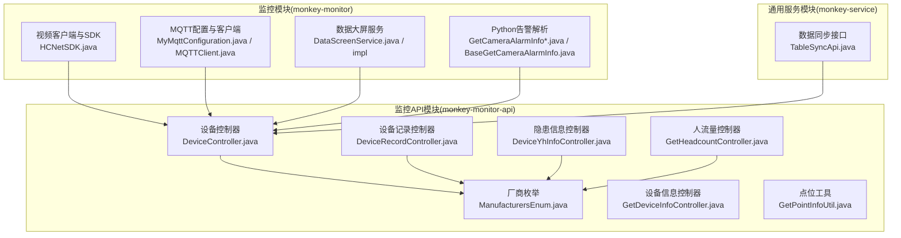
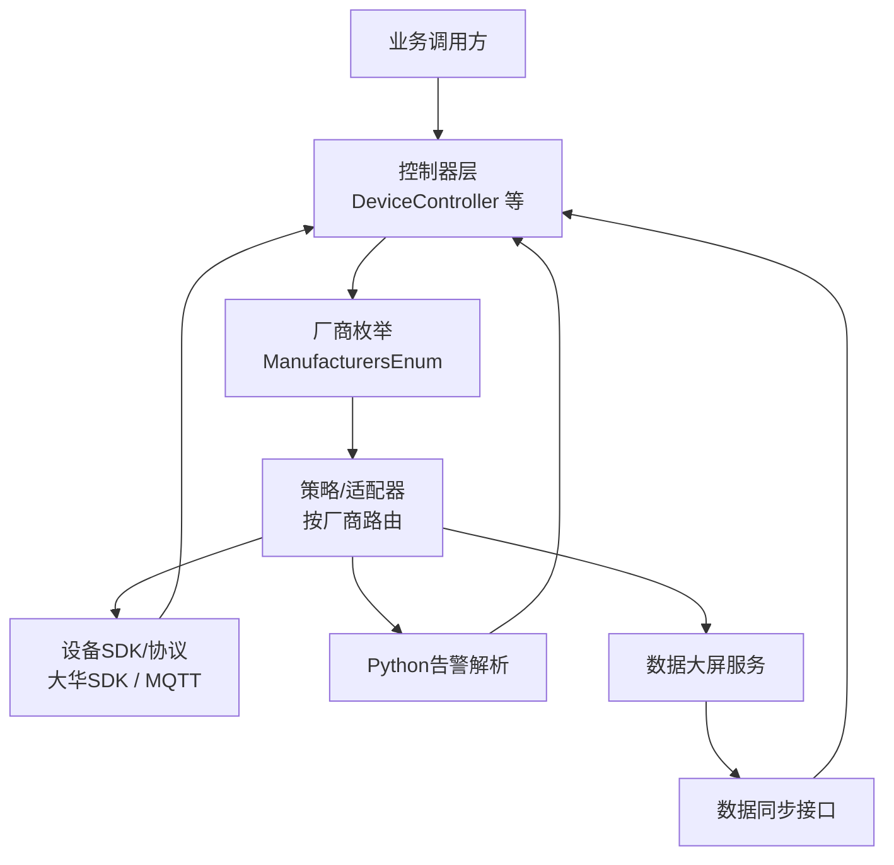
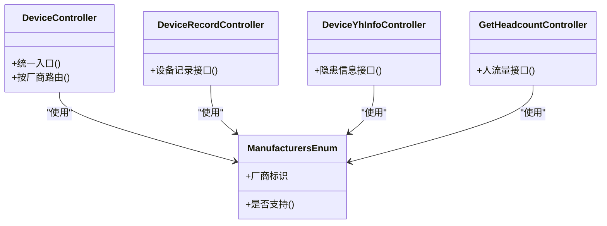
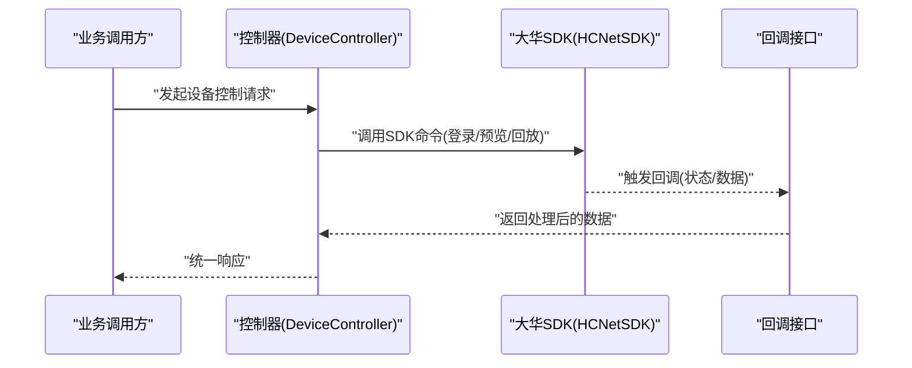
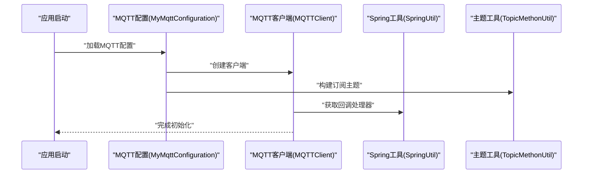
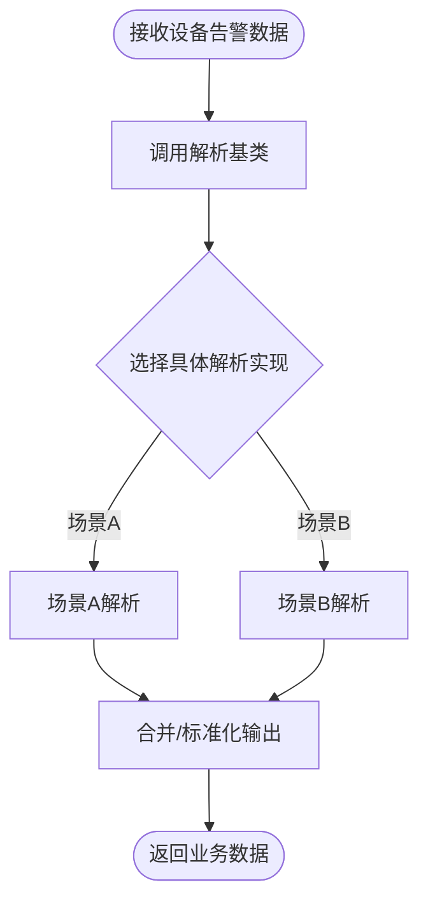
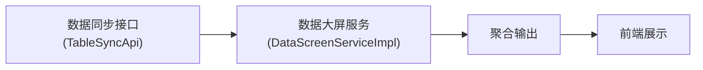
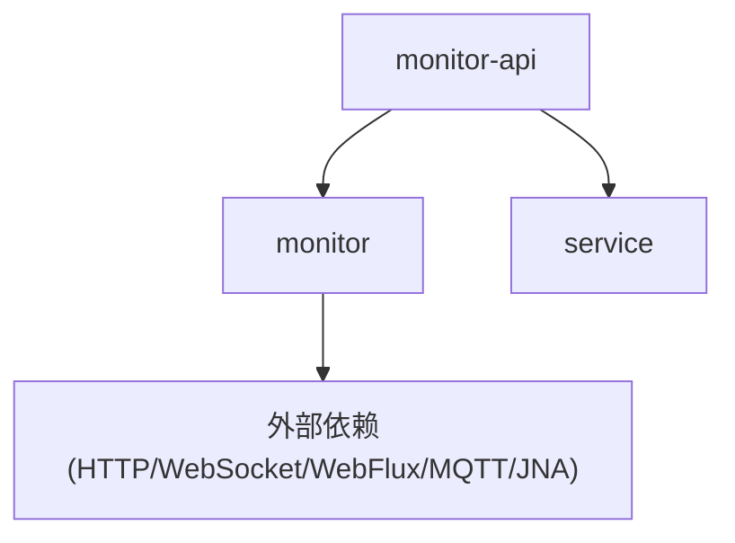
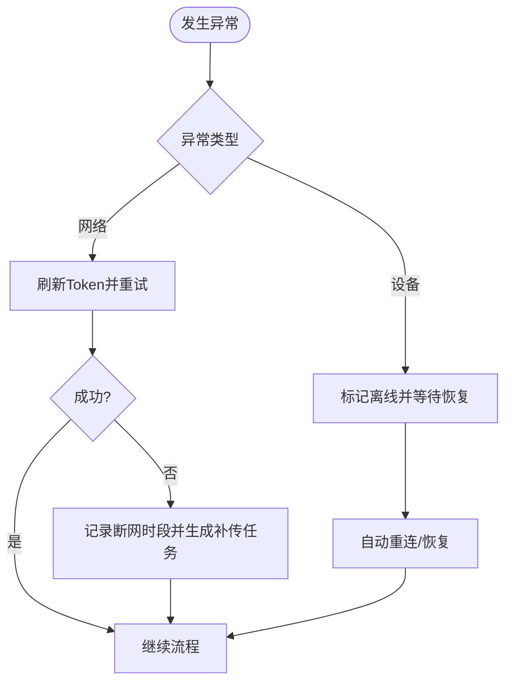

# 设备服务层

<cite>
**本文引用的文件**
- [pom.xml](file://monkey-monitor/pom.xml)
- [HCNetSDK.java](file://monkey-monitor/src/main/java/com/monkey/general/viedeo/ClientDemo/HCNetSDK.java)
- [RequestGZMethod.java](file://monkey-monitor/src/main/java/com/monkey/general/util/gz/util/RequestGZMethod.java)
- [UploadJob.java](file://monkey-monitor-api/src/main/java/com/monkey/general/job/UploadJob.java)
- [MyMqttConfiguration.java](file://monkey-monitor/src/main/java/com/monkey/general/config/mqtt/MyMqttConfiguration.java)
- [MQTTClient.java](file://monkey-monitor/src/main/java/com/monkey/general/config/mqtt/MQTTClient.java)
- [MQTTCallback.java](file://monkey-monitor/src/main/java/com/monkey/general/config/mqtt/MQTTCallback.java)
- [TopicMethonUtil.java](file://monkey-monitor/src/main/java/com/monkey/general/config/mqtt/TopicMethonUtil.java)
- [SpringUtil.java](file://monkey-monitor/src/main/java/com/monkey/general/config/mqtt/SpringUtil.java)
- [DeviceController.java](file://monkey-monitor-api/src/main/java/com/monkey/general/controller/DeviceController.java)
- [DeviceRecordController.java](file://monkey-monitor-api/src/main/java/com/monkey/general/controller/DeviceRecordController.java)
- [DeviceYhInfoController.java](file://monkey-monitor-api/src/main/java/com/monkey/general/controller/DeviceYhInfoController.java)
- [ManufacturersEnum.java](file://monkey-monitor-api/src/main/java/com/monkey/general/enums/ManufacturersEnum.java)
- [DataScreenService.java](file://monkey-monitor/src/main/java/com/monkey/general/datascreen/service/DataScreenService.java)
- [DataScreenServiceImpl.java](file://monkey-monitor/src/main/java/com/monkey/general/datascreen/service/impl/DataScreenServiceImpl.java)
- [GetCameraAlarmInfo.java](file://monkey-monitor/src/main/java/com/monkey/general/modules/python/GetCameraAlarmInfo.java)
- [GetCameraAlarmInfo2.java](file://monkey-monitor/src/main/java/com/monkey/general/modules/python/GetCameraAlarmInfo2.java)
- [BaseGetCameraAlarmInfo.java](file://monkey-monitor/src/main/java/com/monkey/general/modules/python/BaseGetCameraAlarmInfo.java)
- [GetDeviceInfoController.java](file://monkey-monitor-api/src/main/java/com/monkey/general/python/GetDeviceInfoController.java)
- [GetPointInfoUtil.java](file://monkey-monitor-api/src/main/java/com/monkey/general/python/GetPointInfoUtil.java)
- [GetHeadcountController.java](file://monkey-monitor-api/src/main/java/com/monkey/general/headcount/GetHeadcountController.java)
- [GetHeadcountService.java](file://monkey-monitor-api/src/main/java/com/monkey/general/headcount/GetHeadcountService.java)
- [GetHeadcountServiceImpl.java](file://monkey-monitor-api/src/main/java/com/monkey/general/headcount/GetHeadcountServiceImpl.java)
- [TableSyncApi.java](file://monkey-service/src/main/java/com/monkey/general/api/TableSyncApi.java)
</cite>

## 目录
1. [引言](#引言)
2. [项目结构](#项目结构)
3. [核心组件](#核心组件)
4. [架构总览](#架构总览)
5. [详细组件分析](#详细组件分析)
6. [依赖分析](#依赖分析)
7. [性能考虑](#性能考虑)
8. [故障排查指南](#故障排查指南)
9. [结论](#结论)
10. [附录](#附录)

## 引言
本文件系统性梳理“设备服务层”的设计理念与实现方式，重点覆盖以下方面：
- 统一接口抽象：通过枚举与控制器层的统一入口，屏蔽多厂商差异。
- 多厂商设备支持：以枚举标识厂商类型，结合控制器路由实现差异化处理。
- 服务工厂模式：通过枚举驱动的策略选择，实现设备能力的动态装配。
- 具体实现剖析：以大华（DaHua）为例，说明连接管理、命令封装与响应处理。
- 扩展机制：新厂商接入流程、接口适配器与配置管理策略。
- 异常处理与重试：网络异常、离线检测与自动恢复策略。
- 使用示例：服务注册、依赖注入与生命周期管理。
- 与业务层解耦：通过控制器与服务层的职责分离，确保可维护性与可扩展性。

## 项目结构
设备服务层主要分布在两个模块：
- monkey-monitor：设备侧能力封装与厂商SDK集成（如大华SDK、MQTT配置等）
- monkey-monitor-api：对外控制器与业务编排（设备信息、告警、统计等）

图表来源
- [pom.xml:20-100](file://monkey-monitor/pom.xml#L20-L100)
- [DeviceController.java](file://monkey-monitor-api/src/main/java/com/monkey/general/controller/DeviceController.java)
- [ManufacturersEnum.java](file://monkey-monitor-api/src/main/java/com/monkey/general/enums/ManufacturersEnum.java)
- [MyMqttConfiguration.java](file://monkey-monitor/src/main/java/com/monkey/general/config/mqtt/MyMqttConfiguration.java)
- [MQTTClient.java](file://monkey-monitor/src/main/java/com/monkey/general/config/mqtt/MQTTClient.java)
- [DataScreenService.java](file://monkey-monitor/src/main/java/com/monkey/general/datascreen/service/DataScreenService.java)
- [GetCameraAlarmInfo.java](file://monkey-monitor/src/main/java/com/monkey/general/modules/python/GetCameraAlarmInfo.java)
- [GetCameraAlarmInfo2.java](file://monkey-monitor/src/main/java/com/monkey/general/modules/python/GetCameraAlarmInfo2.java)
- [BaseGetCameraAlarmInfo.java](file://monkey-monitor/src/main/java/com/monkey/general/modules/python/BaseGetCameraAlarmInfo.java)
- [TableSyncApi.java](file://monkey-service/src/main/java/com/monkey/general/api/TableSyncApi.java)

章节来源
- [pom.xml:1-103](file://monkey-monitor/pom.xml#L1-L103)

## 核心组件
- 厂商枚举（ManufacturersEnum）：统一标识设备厂商类型，作为策略选择与路由依据。
- 控制器层（DeviceController、DeviceRecordController、DeviceYhInfoController、GetHeadcountController）：面向业务的统一入口，负责请求分发与结果封装。
- 设备能力封装（HCNetSDK.java）：大华SDK接口与回调定义，用于连接、控制与数据获取。
- MQTT配置与客户端（MyMqttConfiguration.java、MQTTClient.java、MQTTCallback.java、TopicMethonUtil.java、SpringUtil.java）：设备消息订阅与回调处理。
- Python告警解析（GetCameraAlarmInfo*.java、BaseGetCameraAlarmInfo.java）：设备告警数据的解析与转换。
- 数据大屏服务（DataScreenService.java、DataScreenServiceImpl.java）：设备数据聚合与展示。
- 数据同步接口（TableSyncApi.java）：跨模块数据同步契约。

章节来源
- [ManufacturersEnum.java](file://monkey-monitor-api/src/main/java/com/monkey/general/enums/ManufacturersEnum.java)
- [DeviceController.java](file://monkey-monitor-api/src/main/java/com/monkey/general/controller/DeviceController.java)
- [DeviceRecordController.java](file://monkey-monitor-api/src/main/java/com/monkey/general/controller/DeviceRecordController.java)
- [DeviceYhInfoController.java](file://monkey-monitor-api/src/main/java/com/monkey/general/controller/DeviceYhInfoController.java)
- [GetHeadcountController.java](file://monkey-monitor-api/src/main/java/com/monkey/general/headcount/GetHeadcountController.java)
- [HCNetSDK.java:719-1075](file://monkey-monitor/src/main/java/com/monkey/general/viedeo/ClientDemo/HCNetSDK.java#L719-L1075)
- [MyMqttConfiguration.java](file://monkey-monitor/src/main/java/com/monkey/general/config/mqtt/MyMqttConfiguration.java)
- [MQTTClient.java](file://monkey-monitor/src/main/java/com/monkey/general/config/mqtt/MQTTClient.java)
- [MQTTCallback.java](file://monkey-monitor/src/main/java/com/monkey/general/config/mqtt/MQTTCallback.java)
- [TopicMethonUtil.java](file://monkey-monitor/src/main/java/com/monkey/general/config/mqtt/TopicMethonUtil.java)
- [SpringUtil.java](file://monkey-monitor/src/main/java/com/monkey/general/config/mqtt/SpringUtil.java)
- [GetCameraAlarmInfo.java](file://monkey-monitor/src/main/java/com/monkey/general/modules/python/GetCameraAlarmInfo.java)
- [GetCameraAlarmInfo2.java](file://monkey-monitor/src/main/java/com/monkey/general/modules/python/GetCameraAlarmInfo2.java)
- [BaseGetCameraAlarmInfo.java](file://monkey-monitor/src/main/java/com/monkey/general/modules/python/BaseGetCameraAlarmInfo.java)
- [DataScreenService.java](file://monkey-monitor/src/main/java/com/monkey/general/datascreen/service/DataScreenService.java)
- [DataScreenServiceImpl.java](file://monkey-monitor/src/main/java/com/monkey/general/datascreen/service/impl/DataScreenServiceImpl.java)
- [TableSyncApi.java](file://monkey-service/src/main/java/com/monkey/general/api/TableSyncApi.java)

## 架构总览
设备服务层采用“控制器-服务-设备SDK/协议”的分层设计，通过枚举与控制器实现多厂商解耦；通过MQTT与Python解析实现设备消息与告警处理；通过数据大屏与同步接口实现数据聚合与跨模块协作。

图表来源
- [DeviceController.java](file://monkey-monitor-api/src/main/java/com/monkey/general/controller/DeviceController.java)
- [ManufacturersEnum.java](file://monkey-monitor-api/src/main/java/com/monkey/general/enums/ManufacturersEnum.java)
- [HCNetSDK.java:10229-10255](file://monkey-monitor/src/main/java/com/monkey/general/viedeo/ClientDemo/HCNetSDK.java#L10229-L10255)
- [MyMqttConfiguration.java](file://monkey-monitor/src/main/java/com/monkey/general/config/mqtt/MyMqttConfiguration.java)
- [GetCameraAlarmInfo.java](file://monkey-monitor/src/main/java/com/monkey/general/modules/python/GetCameraAlarmInfo.java)
- [DataScreenService.java](file://monkey-monitor/src/main/java/com/monkey/general/datascreen/service/DataScreenService.java)
- [TableSyncApi.java](file://monkey-service/src/main/java/com/monkey/general/api/TableSyncApi.java)

## 详细组件分析

### 统一接口与多厂商支持
- 控制器层通过厂商枚举进行路由，避免在业务逻辑中直接依赖具体厂商实现。
- 枚举提供厂商标识，便于后续扩展新厂商时仅需增加枚举值与对应适配器。

图表来源
- [ManufacturersEnum.java](file://monkey-monitor-api/src/main/java/com/monkey/general/enums/ManufacturersEnum.java)
- [DeviceController.java](file://monkey-monitor-api/src/main/java/com/monkey/general/controller/DeviceController.java)
- [DeviceRecordController.java](file://monkey-monitor-api/src/main/java/com/monkey/general/controller/DeviceRecordController.java)
- [DeviceYhInfoController.java](file://monkey-monitor-api/src/main/java/com/monkey/general/controller/DeviceYhInfoController.java)
- [GetHeadcountController.java](file://monkey-monitor-api/src/main/java/com/monkey/general/headcount/GetHeadcountController.java)

章节来源
- [ManufacturersEnum.java](file://monkey-monitor-api/src/main/java/com/monkey/general/enums/ManufacturersEnum.java)
- [DeviceController.java](file://monkey-monitor-api/src/main/java/com/monkey/general/controller/DeviceController.java)
- [DeviceRecordController.java](file://monkey-monitor-api/src/main/java/com/monkey/general/controller/DeviceRecordController.java)
- [DeviceYhInfoController.java](file://monkey-monitor-api/src/main/java/com/monkey/general/controller/DeviceYhInfoController.java)
- [GetHeadcountController.java](file://monkey-monitor-api/src/main/java/com/monkey/general/headcount/GetHeadcountController.java)

### DaHuaService 实现要点（基于现有大华SDK与控制器）
- 设备连接管理：通过大华SDK接口进行登录、预览、回放等操作，回调处理异常与状态变化。
- 命令封装：将设备控制命令（如PTZ、录像、报警等）统一封装为方法，隐藏SDK细节。
- 响应处理：解析SDK返回的结构体或回调数据，转换为业务可用的数据模型。

图表来源
- [DeviceController.java](file://monkey-monitor-api/src/main/java/com/monkey/general/controller/DeviceController.java)
- [HCNetSDK.java:10229-10255](file://monkey-monitor/src/main/java/com/monkey/general/viedeo/ClientDemo/HCNetSDK.java#L10229-L10255)

章节来源
- [HCNetSDK.java:719-1075](file://monkey-monitor/src/main/java/com/monkey/general/viedeo/ClientDemo/HCNetSDK.java#L719-L1075)
- [HCNetSDK.java:10229-10255](file://monkey-monitor/src/main/java/com/monkey/general/viedeo/ClientDemo/HCNetSDK.java#L10229-L10255)

### MQTT 配置与消息处理
- 配置类负责初始化MQTT客户端与主题映射。
- 客户端与回调处理设备上报的消息，Spring工具类用于在容器中获取Bean。
- 主题工具类提供订阅主题的构建与解析。

图表来源
- [MyMqttConfiguration.java](file://monkey-monitor/src/main/java/com/monkey/general/config/mqtt/MyMqttConfiguration.java)
- [MQTTClient.java](file://monkey-monitor/src/main/java/com/monkey/general/config/mqtt/MQTTClient.java)
- [SpringUtil.java](file://monkey-monitor/src/main/java/com/monkey/general/config/mqtt/SpringUtil.java)
- [TopicMethonUtil.java](file://monkey-monitor/src/main/java/com/monkey/general/config/mqtt/TopicMethonUtil.java)

章节来源
- [MyMqttConfiguration.java](file://monkey-monitor/src/main/java/com/monkey/general/config/mqtt/MyMqttConfiguration.java)
- [MQTTClient.java](file://monkey-monitor/src/main/java/com/monkey/general/config/mqtt/MQTTClient.java)
- [MQTTCallback.java](file://monkey-monitor/src/main/java/com/monkey/general/config/mqtt/MQTTCallback.java)
- [TopicMethonUtil.java](file://monkey-monitor/src/main/java/com/monkey/general/config/mqtt/TopicMethonUtil.java)
- [SpringUtil.java](file://monkey-monitor/src/main/java/com/monkey/general/config/mqtt/SpringUtil.java)

### Python 告警解析与数据处理
- 基类提供统一的解析框架，派生类针对不同场景实现具体解析逻辑。
- 控制器与工具类负责调用解析流程并输出业务所需的数据结构。

图表来源
- [BaseGetCameraAlarmInfo.java](file://monkey-monitor/src/main/java/com/monkey/general/modules/python/BaseGetCameraAlarmInfo.java)
- [GetCameraAlarmInfo.java](file://monkey-monitor/src/main/java/com/monkey/general/modules/python/GetCameraAlarmInfo.java)
- [GetCameraAlarmInfo2.java](file://monkey-monitor/src/main/java/com/monkey/general/modules/python/GetCameraAlarmInfo2.java)

章节来源
- [BaseGetCameraAlarmInfo.java](file://monkey-monitor/src/main/java/com/monkey/general/modules/python/BaseGetCameraAlarmInfo.java)
- [GetCameraAlarmInfo.java](file://monkey-monitor/src/main/java/com/monkey/general/modules/python/GetCameraAlarmInfo.java)
- [GetCameraAlarmInfo2.java](file://monkey-monitor/src/main/java/com/monkey/general/modules/python/GetCameraAlarmInfo2.java)

### 数据大屏服务与同步接口
- 数据大屏服务负责聚合设备数据，供前端展示。
- 同步接口为跨模块数据交换提供契约，保证一致性与可扩展性。

图表来源
- [DataScreenServiceImpl.java](file://monkey-monitor/src/main/java/com/monkey/general/datascreen/service/impl/DataScreenServiceImpl.java)
- [TableSyncApi.java](file://monkey-service/src/main/java/com/monkey/general/api/TableSyncApi.java)

章节来源
- [DataScreenService.java](file://monkey-monitor/src/main/java/com/monkey/general/datascreen/service/DataScreenService.java)
- [DataScreenServiceImpl.java](file://monkey-monitor/src/main/java/com/monkey/general/datascreen/service/impl/DataScreenServiceImpl.java)
- [TableSyncApi.java](file://monkey-service/src/main/java/com/monkey/general/api/TableSyncApi.java)

## 依赖分析
- 模块间依赖：monitor-api 依赖 monitor 与 service 模块，形成“控制器-服务-设备能力”的依赖链。
- 外部依赖：HTTP、WebSocket、WebFlux、MQTT、JNA 示例库等，支撑设备通信与数据处理。

图表来源
- [pom.xml:20-100](file://monkey-monitor/pom.xml#L20-L100)

章节来源
- [pom.xml:1-103](file://monkey-monitor/pom.xml#L1-L103)

## 性能考虑
- 异步与非阻塞：优先使用WebFlux与WebSocket，降低I/O阻塞风险。
- 回调与事件驱动：利用MQTT回调与SDK回调，减少轮询开销。
- 缓存与批处理：对频繁查询的数据进行缓存与批处理，降低设备压力。
- 资源池化：对设备连接与线程池进行合理配置，避免资源泄露。

## 故障排查指南
- 网络异常与重试：在网络请求失败时，先刷新Token并重试，必要时记录断网时段并生成补传任务。
- 设备离线检测：通过心跳与回调状态判断设备在线状态，异常时触发自动恢复流程。
- 日志与可观测性：在关键路径打印日志，结合异常捕获与告警，快速定位问题。

图表来源
- [RequestGZMethod.java:79-139](file://monkey-monitor/src/main/java/com/monkey/general/util/gz/util/RequestGZMethod.java#L79-L139)
- [UploadJob.java:125-148](file://monkey-monitor-api/src/main/java/com/monkey/general/job/UploadJob.java#L125-L148)

章节来源
- [RequestGZMethod.java:79-139](file://monkey-monitor/src/main/java/com/monkey/general/util/gz/util/RequestGZMethod.java#L79-L139)
- [UploadJob.java:125-148](file://monkey-monitor-api/src/main/java/com/monkey/general/job/UploadJob.java#L125-L148)

## 结论
设备服务层通过统一接口、多厂商枚举与控制器路由，实现了对不同厂商设备的抽象与解耦；借助大华SDK、MQTT与Python解析，完成了从连接、控制到数据处理的闭环；通过异常与重试机制保障了系统的稳定性。该设计为后续接入新厂商提供了清晰的扩展路径，并为业务层提供了稳定可靠的服务支撑。

## 附录
- 新厂商接入流程建议
  - 在厂商枚举中新增厂商标识
  - 在控制器层添加对应的路由分支或适配器
  - 封装设备SDK/协议调用，提供统一命令与响应模型
  - 配置MQTT或HTTP回调，完善异常与重试策略
  - 编写单元测试与集成测试，验证关键流程
- 接口适配器实现要点
  - 保持方法签名一致，隐藏厂商差异
  - 对异常进行归一化处理，向上抛出统一异常
  - 提供超时与重试配置，增强鲁棒性
- 配置管理策略
  - 将设备地址、账号、超时等参数集中管理
  - 支持环境变量与配置中心，便于运维与灰度发布
  - 对敏感信息进行加密存储与传输