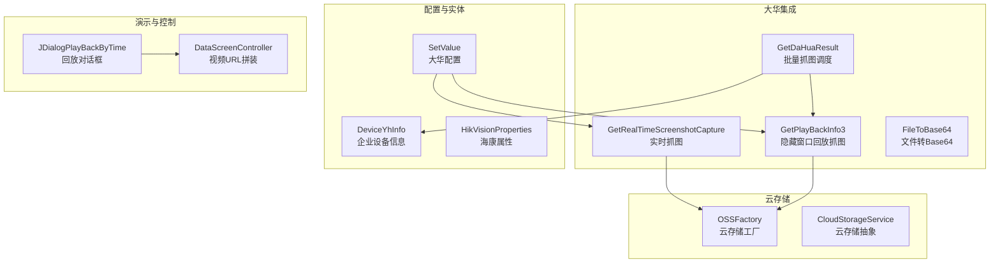
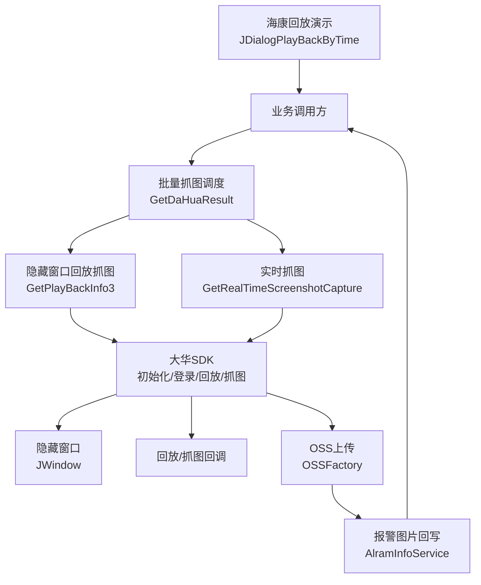
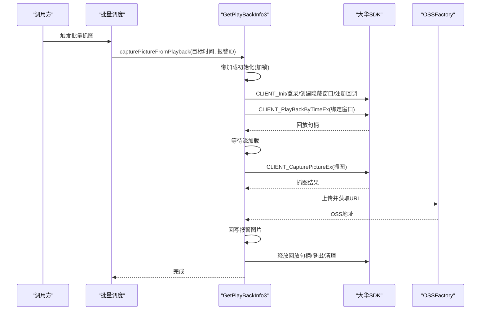
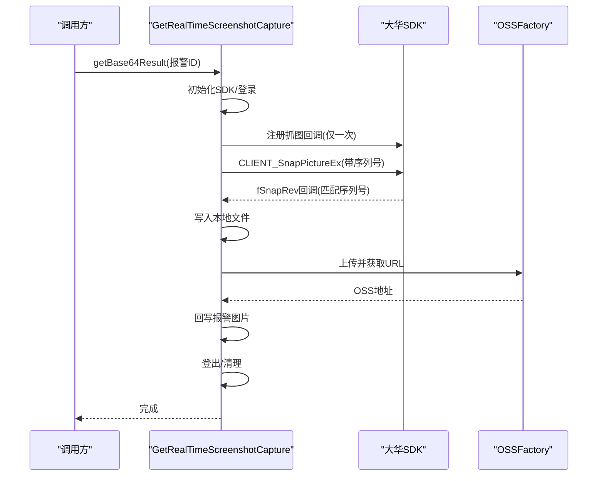
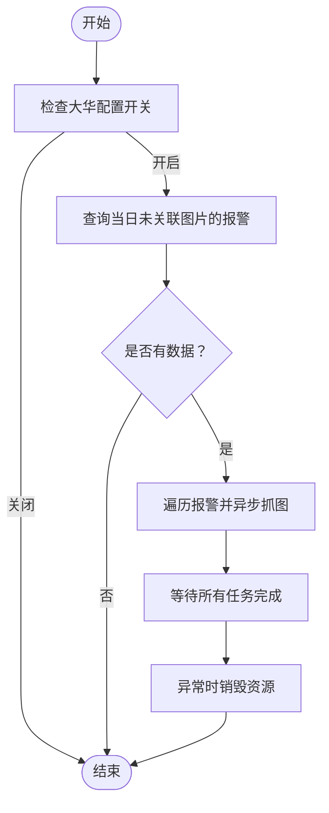
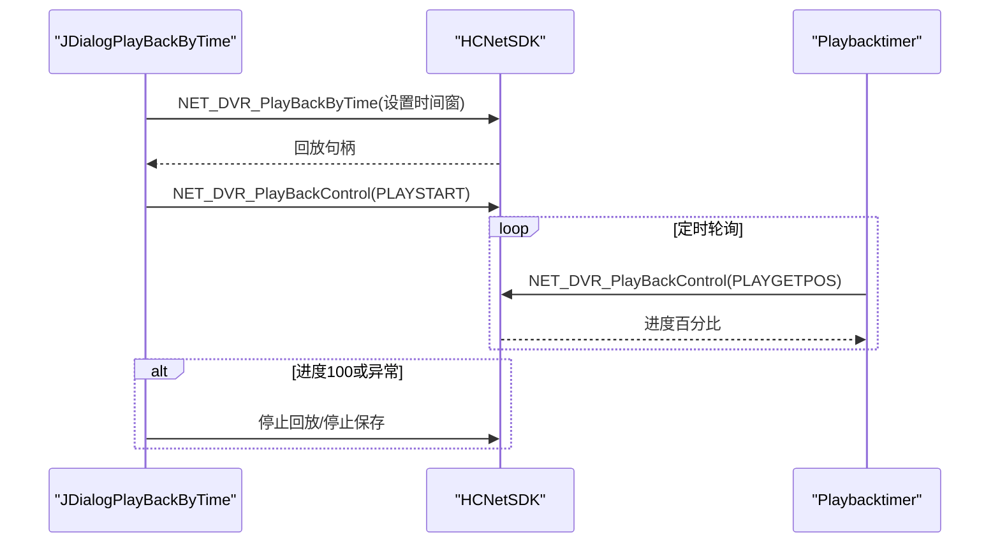
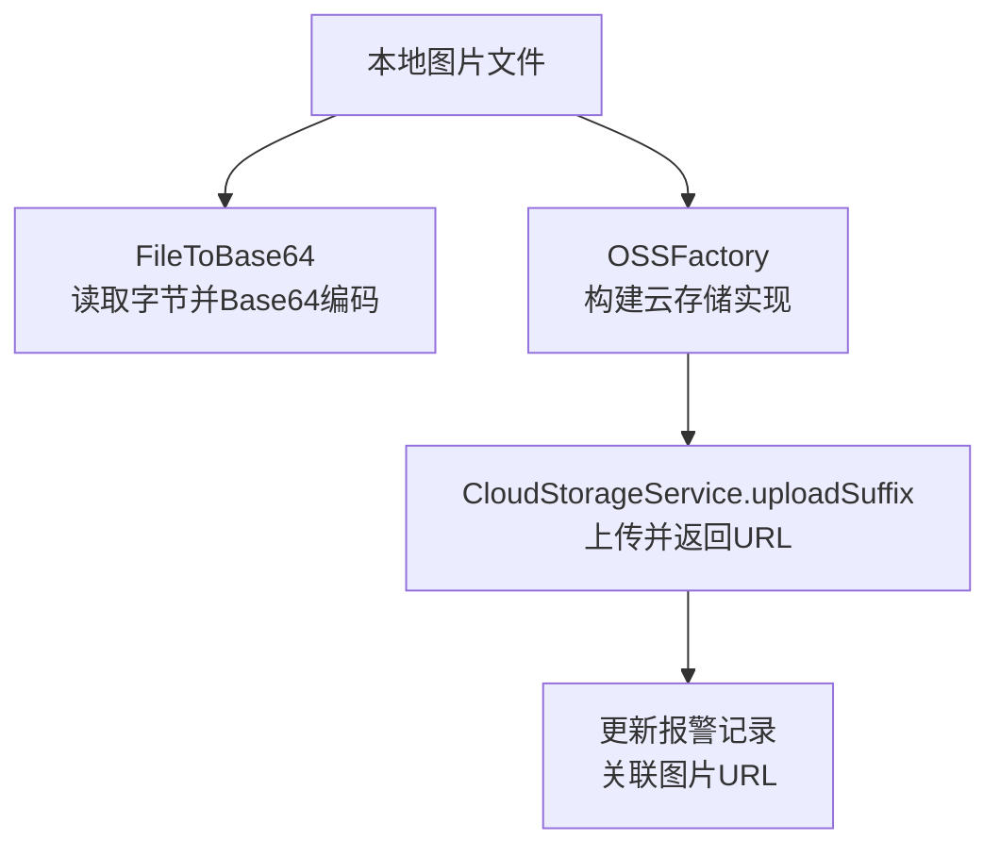
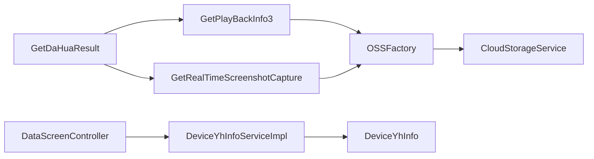

# 设备集成架构

<cite>
**本文引用的文件**
- [GetPlayBackInfo3.java](file://monkey-monitor/src/main/java/com/monkey/general/dahua/GetPlayBackInfo3.java)
- [GetRealTimeScreenshotCapture.java](file://monkey-monitor/src/main/java/com/monkey/general/dahua/GetRealTimeScreenshotCapture.java)
- [GetDaHuaResult.java](file://monkey-monitor/src/main/java/com/monkey/general/dahua/GetDaHuaResult.java)
- [FileToBase64.java](file://monkey-monitor/src/main/java/com/monkey/general/dahua/FileToBase64.java)
- [SetValue.java](file://monkey-monitor/src/main/java/com/monkey/general/dahua/entity/SetValue.java)
- [OSSFactory.java](file://monkey-service/src/main/java/com/monkey/general/modules/oss/cloud/OSSFactory.java)
- [CloudStorageService.java](file://monkey-service/src/main/java/com/monkey/general/modules/oss/cloud/CloudStorageService.java)
- [DeviceYhInfo.java](file://monkey-monitor/src/main/java/com/monkey/general/modules/em/entity/DeviceYhInfo.java)
- [DeviceYhInfoServiceImpl.java](file://monkey-monitor/src/main/java/com/monkey/general/modules/em/service/impl/DeviceYhInfoServiceImpl.java)
- [DataScreenController.java](file://monkey-monitor-api/src/main/java/com/monkey/general/controller/DataScreenController.java)
- [JDialogPlayBackByTime.java](file://monkey-monitor/src/main/java/com/monkey/general/viedeo/ClientDemo/JDialogPlayBackByTime.java)
- [HCNetSDK.java](file://monkey-monitor/src/main/java/com/monkey/general/viedeo/ClientDemo/HCNetSDK.java)
- [DeviceOnLine.java](file://monkey-monitor/src/main/java/com/monkey/general/viedeo/device/DeviceOnLine.java)
- [HikVisionProperties.java](file://monkey-monitor/src/main/java/com/monkey/general/util/hik/HikVisionProperties.java)
</cite>

## 目录
1. [简介](#简介)
2. [项目结构](#项目结构)
3. [核心组件](#核心组件)
4. [架构总览](#架构总览)
5. [详细组件分析](#详细组件分析)
6. [依赖分析](#依赖分析)
7. [性能考虑](#性能考虑)
8. [故障排查指南](#故障排查指南)
9. [结论](#结论)
10. [附录](#附录)

## 简介
本文件面向“设备集成架构”，聚焦于大华SDK的集成与应用，涵盖以下主题：
- 大华SDK初始化、设备登录、隐藏窗口创建与回放回调配置
- 视频回放功能：历史视频检索、播放控制、时间轴定位与进度监控
- 实时截图捕获：抓图命令下发、回调数据处理、OSS上传与报警图片回写
- 设备结果处理与数据转换：文件转Base64、OSS工厂与云存储抽象
- 配置步骤、API调用示例、错误处理策略
- 多厂商设备支持扩展指南与最佳实践

## 项目结构
围绕设备集成的关键模块分布如下：
- 大华集成核心：隐藏窗口回放抓图、实时抓图、结果处理与上传
- 设备配置与实体：大华配置项、企业设备信息、Hikvision属性
- 云存储与上传：OSS工厂与云存储抽象
- 视频播放演示：基于海康威视SDK的回放对话框示例
- 控制层与服务层：设备列表、在线统计、视频URL拼装

图表来源
- [GetPlayBackInfo3.java:1-427](file://monkey-monitor/src/main/java/com/monkey/general/dahua/GetPlayBackInfo3.java#L1-L427)
- [GetRealTimeScreenshotCapture.java:1-273](file://monkey-monitor/src/main/java/com/monkey/general/dahua/GetRealTimeScreenshotCapture.java#L1-L273)
- [GetDaHuaResult.java:1-102](file://monkey-monitor/src/main/java/com/monkey/general/dahua/GetDaHuaResult.java#L1-L102)
- [FileToBase64.java:1-51](file://monkey-monitor/src/main/java/com/monkey/general/dahua/FileToBase64.java#L1-L51)
- [SetValue.java:1-20](file://monkey-monitor/src/main/java/com/monkey/general/dahua/entity/SetValue.java#L1-L20)
- [OSSFactory.java:1-37](file://monkey-service/src/main/java/com/monkey/general/modules/oss/cloud/OSSFactory.java#L1-L37)
- [CloudStorageService.java:1-52](file://monkey-service/src/main/java/com/monkey/general/modules/oss/cloud/CloudStorageService.java#L1-L52)
- [JDialogPlayBackByTime.java:47-853](file://monkey-monitor/src/main/java/com/monkey/general/viedeo/ClientDemo/JDialogPlayBackByTime.java#L47-L853)
- [DataScreenController.java:296-328](file://monkey-monitor-api/src/main/java/com/monkey/general/controller/DataScreenController.java#L296-L328)

章节来源
- [GetPlayBackInfo3.java:1-427](file://monkey-monitor/src/main/java/com/monkey/general/dahua/GetPlayBackInfo3.java#L1-L427)
- [GetRealTimeScreenshotCapture.java:1-273](file://monkey-monitor/src/main/java/com/monkey/general/dahua/GetRealTimeScreenshotCapture.java#L1-L273)
- [GetDaHuaResult.java:1-102](file://monkey-monitor/src/main/java/com/monkey/general/dahua/GetDaHuaResult.java#L1-L102)
- [FileToBase64.java:1-51](file://monkey-monitor/src/main/java/com/monkey/general/dahua/FileToBase64.java#L1-L51)
- [SetValue.java:1-20](file://monkey-monitor/src/main/java/com/monkey/general/dahua/entity/SetValue.java#L1-L20)
- [OSSFactory.java:1-37](file://monkey-service/src/main/java/com/monkey/general/modules/oss/cloud/OSSFactory.java#L1-L37)
- [CloudStorageService.java:1-52](file://monkey-service/src/main/java/com/monkey/general/modules/oss/cloud/CloudStorageService.java#L1-L52)
- [JDialogPlayBackByTime.java:47-853](file://monkey-monitor/src/main/java/com/monkey/general/viedeo/ClientDemo/JDialogPlayBackByTime.java#L47-L853)
- [DataScreenController.java:296-328](file://monkey-monitor-api/src/main/java/com/monkey/general/controller/DataScreenController.java#L296-L328)

## 核心组件
- 大华隐藏窗口回放抓图：懒加载初始化SDK、创建隐藏窗口、登录设备、回放启动与抓图、OSS上传、报警图片回写、资源销毁与断线重连
- 大华实时抓图：初始化SDK、注册抓图回调、下发抓图命令、回调落盘与OSS上传、登出与清理
- 批量抓图调度：按报警时间回放抓图，异步并发处理，异常时销毁资源
- 文件转Base64：将本地图片文件转为Base64字符串
- 配置与实体：大华配置项、企业设备信息、海康属性
- 云存储：OSS工厂与云存储抽象，支持多种云厂商
- 海康回放演示：基于HCNetSDK的回放对话框，展示时间回放与进度监控
- 控制层：视频URL拼装与设备列表查询

章节来源
- [GetPlayBackInfo3.java:78-208](file://monkey-monitor/src/main/java/com/monkey/general/dahua/GetPlayBackInfo3.java#L78-L208)
- [GetRealTimeScreenshotCapture.java:192-222](file://monkey-monitor/src/main/java/com/monkey/general/dahua/GetRealTimeScreenshotCapture.java#L192-L222)
- [GetDaHuaResult.java:45-100](file://monkey-monitor/src/main/java/com/monkey/general/dahua/GetDaHuaResult.java#L45-L100)
- [FileToBase64.java:15-33](file://monkey-monitor/src/main/java/com/monkey/general/dahua/FileToBase64.java#L15-L33)
- [SetValue.java:11-19](file://monkey-monitor/src/main/java/com/monkey/general/dahua/entity/SetValue.java#L11-L19)
- [OSSFactory.java:21-34](file://monkey-service/src/main/java/com/monkey/general/modules/oss/cloud/OSSFactory.java#L21-L34)
- [CloudStorageService.java:26-37](file://monkey-service/src/main/java/com/monkey/general/modules/oss/cloud/CloudStorageService.java#L26-L37)
- [JDialogPlayBackByTime.java:583-831](file://monkey-monitor/src/main/java/com/monkey/general/viedeo/ClientDemo/JDialogPlayBackByTime.java#L583-L831)
- [DataScreenController.java:296-314](file://monkey-monitor-api/src/main/java/com/monkey/general/controller/DataScreenController.java#L296-L314)

## 架构总览
整体架构以“配置驱动 + SDK集成 + 结果处理 + 云存储”为主线，结合异步与并发策略提升吞吐。

图表来源
- [GetDaHuaResult.java:75-93](file://monkey-monitor/src/main/java/com/monkey/general/dahua/GetDaHuaResult.java#L75-L93)
- [GetPlayBackInfo3.java:78-208](file://monkey-monitor/src/main/java/com/monkey/general/dahua/GetPlayBackInfo3.java#L78-L208)
- [GetRealTimeScreenshotCapture.java:192-222](file://monkey-monitor/src/main/java/com/monkey/general/dahua/GetRealTimeScreenshotCapture.java#L192-L222)
- [OSSFactory.java:21-34](file://monkey-service/src/main/java/com/monkey/general/modules/oss/cloud/OSSFactory.java#L21-L34)

## 详细组件分析

### 大华隐藏窗口回放抓图（GetPlayBackInfo3）
- 懒加载初始化：首次抓图时初始化SDK、创建隐藏窗口、注册回放回调、登录设备
- 回放流程：按目标时间构造回放时间窗，绑定隐藏窗口启动回放，等待流加载，执行抓图，上传OSS并回写报警图片
- 资源管理：并发安全的初始化锁、登录状态检查与重登、窗口显隐控制、回放句柄释放、SDK资源清理
- 错误处理：初始化失败、登录失败、回放启动失败、抓图失败、上传失败均有日志与兜底处理

图表来源
- [GetPlayBackInfo3.java:78-208](file://monkey-monitor/src/main/java/com/monkey/general/dahua/GetPlayBackInfo3.java#L78-L208)
- [OSSFactory.java:21-34](file://monkey-service/src/main/java/com/monkey/general/modules/oss/cloud/OSSFactory.java#L21-L34)

章节来源
- [GetPlayBackInfo3.java:78-208](file://monkey-monitor/src/main/java/com/monkey/general/dahua/GetPlayBackInfo3.java#L78-L208)
- [GetPlayBackInfo3.java:301-352](file://monkey-monitor/src/main/java/com/monkey/general/dahua/GetPlayBackInfo3.java#L301-L352)
- [GetPlayBackInfo3.java:354-364](file://monkey-monitor/src/main/java/com/monkey/general/dahua/GetPlayBackInfo3.java#L354-L364)
- [GetPlayBackInfo3.java:366-379](file://monkey-monitor/src/main/java/com/monkey/general/dahua/GetPlayBackInfo3.java#L366-L379)
- [GetPlayBackInfo3.java:381-393](file://monkey-monitor/src/main/java/com/monkey/general/dahua/GetPlayBackInfo3.java#L381-L393)

### 大华实时抓图（GetRealTimeScreenshotCapture）
- 初始化与登录：精简SDK初始化，开启自动重连，登录设备
- 抓图回调：仅注册一次回调，按请求序列号匹配回调，确保单次请求只保存一次
- 命令下发：设置通道、模式、质量、间隔与序列号，调用抓图接口
- 上传与回写：本地落盘后上传OSS，登出设备并清理SDK

图表来源
- [GetRealTimeScreenshotCapture.java:192-222](file://monkey-monitor/src/main/java/com/monkey/general/dahua/GetRealTimeScreenshotCapture.java#L192-L222)
- [GetRealTimeScreenshotCapture.java:127-162](file://monkey-monitor/src/main/java/com/monkey/general/dahua/GetRealTimeScreenshotCapture.java#L127-L162)
- [GetRealTimeScreenshotCapture.java:169-189](file://monkey-monitor/src/main/java/com/monkey/general/dahua/GetRealTimeScreenshotCapture.java#L169-L189)

章节来源
- [GetRealTimeScreenshotCapture.java:51-69](file://monkey-monitor/src/main/java/com/monkey/general/dahua/GetRealTimeScreenshotCapture.java#L51-L69)
- [GetRealTimeScreenshotCapture.java:83-104](file://monkey-monitor/src/main/java/com/monkey/general/dahua/GetRealTimeScreenshotCapture.java#L83-L104)
- [GetRealTimeScreenshotCapture.java:192-222](file://monkey-monitor/src/main/java/com/monkey/general/dahua/GetRealTimeScreenshotCapture.java#L192-L222)
- [GetRealTimeScreenshotCapture.java:229-268](file://monkey-monitor/src/main/java/com/monkey/general/dahua/GetRealTimeScreenshotCapture.java#L229-L268)

### 批量抓图调度（GetDaHuaResult）
- 条件过滤：按公司编码、日期范围、报警类型与是否已有图片进行筛选
- 异步并发：对每个报警异步发起回放抓图，使用CompletableFuture聚合等待
- 异常处理：任一任务异常时销毁资源，避免后续重复初始化

图表来源
- [GetDaHuaResult.java:45-100](file://monkey-monitor/src/main/java/com/monkey/general/dahua/GetDaHuaResult.java#L45-L100)

章节来源
- [GetDaHuaResult.java:45-100](file://monkey-monitor/src/main/java/com/monkey/general/dahua/GetDaHuaResult.java#L45-L100)

### 视频回放功能（海康威视演示）
- 时间回放：设置起止时间，获取窗口句柄，启动回放并开始播放
- 进度监控：定时轮询进度，到达100或异常时停止回放
- 保存控制：支持回放保存开关与停止

图表来源
- [JDialogPlayBackByTime.java:583-831](file://monkey-monitor/src/main/java/com/monkey/general/viedeo/ClientDemo/JDialogPlayBackByTime.java#L583-L831)
- [HCNetSDK.java:988-1007](file://monkey-monitor/src/main/java/com/monkey/general/viedeo/ClientDemo/HCNetSDK.java#L988-L1007)

章节来源
- [JDialogPlayBackByTime.java:583-831](file://monkey-monitor/src/main/java/com/monkey/general/viedeo/ClientDemo/JDialogPlayBackByTime.java#L583-L831)
- [HCNetSDK.java:988-1007](file://monkey-monitor/src/main/java/com/monkey/general/viedeo/ClientDemo/HCNetSDK.java#L988-L1007)

### 设备结果处理与数据转换
- 文件转Base64：读取本地文件字节并编码为Base64字符串
- OSS上传：通过OSS工厂构建具体云存储实现，按后缀上传并返回URL
- 报警图片回写：更新报警记录的关联图片字段

图表来源
- [FileToBase64.java:15-33](file://monkey-monitor/src/main/java/com/monkey/general/dahua/FileToBase64.java#L15-L33)
- [OSSFactory.java:21-34](file://monkey-service/src/main/java/com/monkey/general/modules/oss/cloud/OSSFactory.java#L21-L34)
- [CloudStorageService.java:45-52](file://monkey-service/src/main/java/com/monkey/general/modules/oss/cloud/CloudStorageService.java#L45-L52)

章节来源
- [FileToBase64.java:15-33](file://monkey-monitor/src/main/java/com/monkey/general/dahua/FileToBase64.java#L15-L33)
- [OSSFactory.java:21-34](file://monkey-service/src/main/java/com/monkey/general/modules/oss/cloud/OSSFactory.java#L21-L34)
- [CloudStorageService.java:45-52](file://monkey-service/src/main/java/com/monkey/general/modules/oss/cloud/CloudStorageService.java#L45-L52)

### 多厂商设备支持扩展指南
- 接入思路：以“SDK初始化 → 登录 → 回放/抓图 → 回调/落盘 → 上传 → 回写”的通用流程为模板
- 配置抽象：统一通过配置类承载厂商参数（如IP、端口、用户名、密码、通道号），便于切换厂商
- 云存储抽象：通过OSS工厂与云存储抽象屏蔽厂商差异，统一上传接口
- 示例参考：海康威视回放对话框与属性配置，可作为其他厂商SDK的对照实现

章节来源
- [HikVisionProperties.java:12-17](file://monkey-monitor/src/main/java/com/monkey/general/util/hik/HikVisionProperties.java#L12-L17)
- [DeviceOnLine.java:116-128](file://monkey-monitor/src/main/java/com/monkey/general/viedeo/device/DeviceOnLine.java#L116-L128)
- [DataScreenController.java:296-314](file://monkey-monitor-api/src/main/java/com/monkey/general/controller/DataScreenController.java#L296-L314)

## 依赖分析
- 组件耦合
  - GetPlayBackInfo3与GetRealTimeScreenshotCapture均依赖大华SDK与OSS工厂
  - GetDaHuaResult依赖设备配置与报警服务，调度抓图任务
  - 控制层依赖服务层与设备信息实体
- 外部依赖
  - 大华SDK（NetSDKLib）、JNA（Native）、Swing（JWindow）
  - 云存储（OSSFactory与具体实现）

图表来源
- [GetDaHuaResult.java:39-41](file://monkey-monitor/src/main/java/com/monkey/general/dahua/GetDaHuaResult.java#L39-L41)
- [GetPlayBackInfo3.java:62-65](file://monkey-monitor/src/main/java/com/monkey/general/dahua/GetPlayBackInfo3.java#L62-L65)
- [GetRealTimeScreenshotCapture.java:27-30](file://monkey-monitor/src/main/java/com/monkey/general/dahua/GetRealTimeScreenshotCapture.java#L27-L30)
- [OSSFactory.java:21-34](file://monkey-service/src/main/java/com/monkey/general/modules/oss/cloud/OSSFactory.java#L21-L34)
- [CloudStorageService.java:16-18](file://monkey-service/src/main/java/com/monkey/general/modules/oss/cloud/CloudStorageService.java#L16-L18)
- [DataScreenController.java:296-314](file://monkey-monitor-api/src/main/java/com/monkey/general/controller/DataScreenController.java#L296-L314)
- [DeviceYhInfoServiceImpl.java:55-67](file://monkey-monitor/src/main/java/com/monkey/general/modules/em/service/impl/DeviceYhInfoServiceImpl.java#L55-L67)
- [DeviceYhInfo.java:21-23](file://monkey-monitor/src/main/java/com/monkey/general/modules/em/entity/DeviceYhInfo.java#L21-L23)

章节来源
- [GetDaHuaResult.java:39-41](file://monkey-monitor/src/main/java/com/monkey/general/dahua/GetDaHuaResult.java#L39-L41)
- [GetPlayBackInfo3.java:62-65](file://monkey-monitor/src/main/java/com/monkey/general/dahua/GetPlayBackInfo3.java#L62-L65)
- [GetRealTimeScreenshotCapture.java:27-30](file://monkey-monitor/src/main/java/com/monkey/general/dahua/GetRealTimeScreenshotCapture.java#L27-L30)
- [OSSFactory.java:21-34](file://monkey-service/src/main/java/com/monkey/general/modules/oss/cloud/OSSFactory.java#L21-L34)
- [CloudStorageService.java:16-18](file://monkey-service/src/main/java/com/monkey/general/modules/oss/cloud/CloudStorageService.java#L16-L18)
- [DataScreenController.java:296-314](file://monkey-monitor-api/src/main/java/com/monkey/general/controller/DataScreenController.java#L296-L314)
- [DeviceYhInfoServiceImpl.java:55-67](file://monkey-monitor/src/main/java/com/monkey/general/modules/em/service/impl/DeviceYhInfoServiceImpl.java#L55-L67)
- [DeviceYhInfo.java:21-23](file://monkey-monitor/src/main/java/com/monkey/general/modules/em/entity/DeviceYhInfo.java#L21-L23)

## 性能考虑
- 异步并发：批量抓图采用CompletableFuture聚合等待，避免阻塞主线程
- 资源复用：懒加载初始化与断线重连回调减少重复初始化成本
- 窗口显隐：抓图前后临时显示隐藏窗口，确保缓冲区有效，降低失败率
- IO优化：上传采用流式上传，避免大文件内存占用
- 超时与重试：合理设置SDK连接超时与回放加载等待时间，异常时及时销毁资源

## 故障排查指南
- 初始化失败
  - 检查SDK初始化返回值与错误码
  - 确认网络连通性与设备端口开放
- 登录失败
  - 校验IP、端口、用户名、密码
  - 检查设备是否在线与协议类型
- 回放启动失败
  - 检查通道号与时间窗合法性
  - 触发登录状态检查与重登
- 抓图失败
  - 确认隐藏窗口可见性与缓冲区
  - 检查抓图文件路径与权限
- 上传失败
  - 校验OSS配置与凭证
  - 检查文件存在性与后缀
- 回调未触发
  - 确认回调注册仅一次
  - 校验序列号匹配与保存标记重置

章节来源
- [GetPlayBackInfo3.java:302-314](file://monkey-monitor/src/main/java/com/monkey/general/dahua/GetPlayBackInfo3.java#L302-L314)
- [GetPlayBackInfo3.java:337-352](file://monkey-monitor/src/main/java/com/monkey/general/dahua/GetPlayBackInfo3.java#L337-L352)
- [GetPlayBackInfo3.java:150-156](file://monkey-monitor/src/main/java/com/monkey/general/dahua/GetPlayBackInfo3.java#L150-L156)
- [GetRealTimeScreenshotCapture.java:127-162](file://monkey-monitor/src/main/java/com/monkey/general/dahua/GetRealTimeScreenshotCapture.java#L127-L162)
- [OSSFactory.java:21-34](file://monkey-service/src/main/java/com/monkey/general/modules/oss/cloud/OSSFactory.java#L21-L34)

## 结论
本架构以“配置驱动 + SDK集成 + 结果处理 + 云存储”为核心，实现了大华设备的稳定回放抓图与实时抓图能力，并通过异步并发与资源管理提升了整体性能与可靠性。同时，通过云存储抽象与多厂商示例，为后续扩展其他厂商设备提供了清晰路径。

## 附录

### 配置步骤
- 大华配置
  - 在配置类中设置IP、端口、用户名、密码、通道号与开关
- 云存储配置
  - 通过配置中心设置云存储类型与密钥，OSS工厂自动构建对应实现
- 控制层调用
  - 通过控制器接口获取视频URL或触发抓图任务

章节来源
- [SetValue.java:11-19](file://monkey-monitor/src/main/java/com/monkey/general/dahua/entity/SetValue.java#L11-L19)
- [OSSFactory.java:21-34](file://monkey-service/src/main/java/com/monkey/general/modules/oss/cloud/OSSFactory.java#L21-L34)
- [DataScreenController.java:296-314](file://monkey-monitor-api/src/main/java/com/monkey/general/controller/DataScreenController.java#L296-L314)

### API调用示例（路径）
- 批量抓图调度
  - [批量抓图入口:45-100](file://monkey-monitor/src/main/java/com/monkey/general/dahua/GetDaHuaResult.java#L45-L100)
- 隐藏窗口回放抓图
  - [异步抓图方法:78-208](file://monkey-monitor/src/main/java/com/monkey/general/dahua/GetPlayBackInfo3.java#L78-L208)
  - [SDK初始化与登录:301-352](file://monkey-monitor/src/main/java/com/monkey/general/dahua/GetPlayBackInfo3.java#L301-L352)
  - [抓图与上传:354-379](file://monkey-monitor/src/main/java/com/monkey/general/dahua/GetPlayBackInfo3.java#L354-L379)
- 实时抓图
  - [抓图回调与命令下发:127-222](file://monkey-monitor/src/main/java/com/monkey/general/dahua/GetRealTimeScreenshotCapture.java#L127-L222)
  - [上传与回写:169-268](file://monkey-monitor/src/main/java/com/monkey/general/dahua/GetRealTimeScreenshotCapture.java#L169-L268)
- 海康回放演示
  - [时间回放与进度监控:583-831](file://monkey-monitor/src/main/java/com/monkey/general/viedeo/ClientDemo/JDialogPlayBackByTime.java#L583-L831)