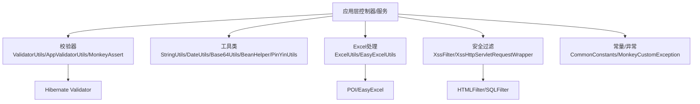
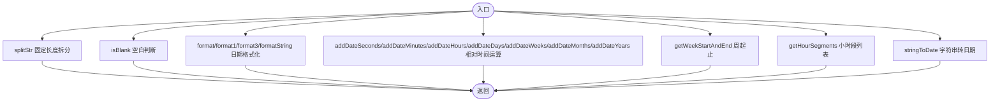
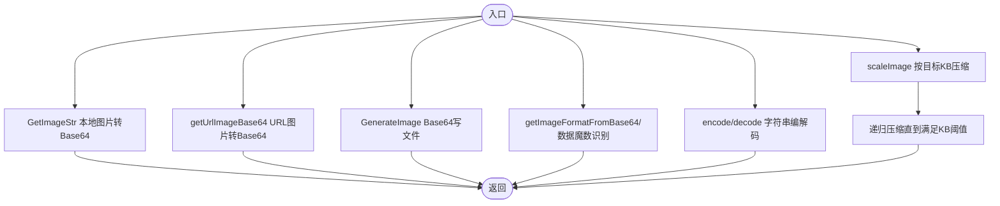
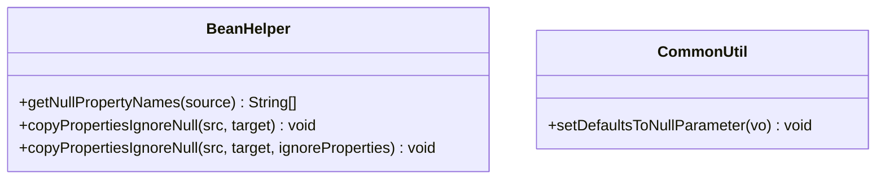
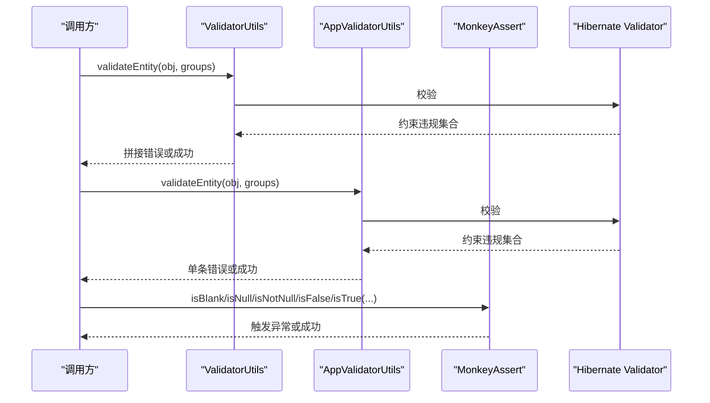
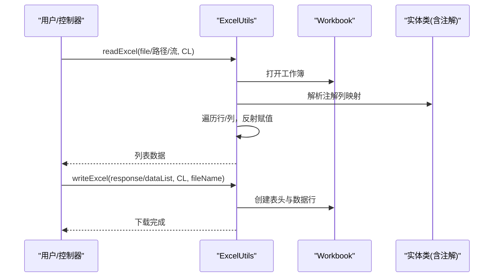
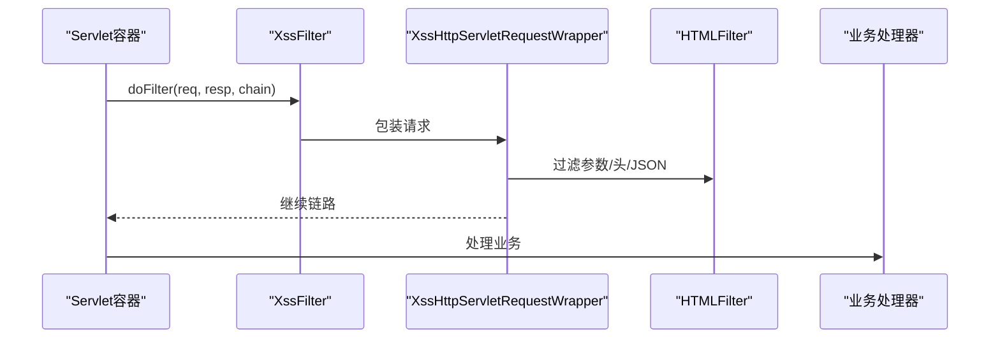
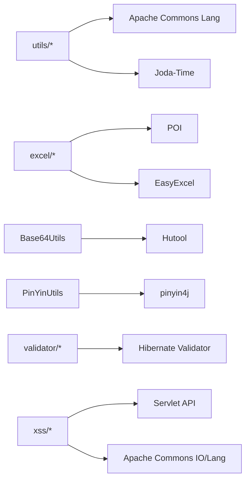

# 通用工具模块

<cite>
**本文引用的文件**
- [CommonUtil.java](file://monkey-common/src/main/java/com/monkey/general/common/utils/CommonUtil.java)
- [DateUtils.java](file://monkey-common/src/main/java/com/monkey/general/common/utils/DateUtils.java)
- [StringUtils.java](file://monkey-common/src/main/java/com/monkey/general/common/utils/StringUtils.java)
- [Base64Utils.java](file://monkey-common/src/main/java/com/monkey/general/common/utils/Base64Utils.java)
- [PinYinUtils.java](file://monkey-common/src/main/java/com/monkey/general/common/utils/PinYinUtils.java)
- [BeanHelper.java](file://monkey-common/src/main/java/com/monkey/general/common/utils/BeanHelper.java)
- [AppValidatorUtils.java](file://monkey-common/src/main/java/com/monkey/general/common/validator/AppValidatorUtils.java)
- [MonkeyAssert.java](file://monkey-common/src/main/java/com/monkey/general/common/validator/MonkeyAssert.java)
- [ValidatorUtils.java](file://monkey-common/src/main/java/com/monkey/general/common/validator/ValidatorUtils.java)
- [XssFilter.java](file://monkey-common/src/main/java/com/monkey/general/common/xss/XssFilter.java)
- [XssHttpServletRequestWrapper.java](file://monkey-common/src/main/java/com/monkey/general/common/xss/XssHttpServletRequestWrapper.java)
- [HTMLFilter.java](file://monkey-common/src/main/java/com/monkey/general/common/xss/HTMLFilter.java)
- [SQLFilter.java](file://monkey-common/src/main/java/com/monkey/general/common/xss/SQLFilter.java)
- [EasyExcelUtils.java](file://monkey-common/src/main/java/com/monkey/general/common/excel/EasyExcelUtils.java)
- [ExcelUtils.java](file://monkey-common/src/main/java/com/monkey/general/common/excel/ExcelUtils.java)
- [ExcelColumn.java](file://monkey-common/src/main/java/com/monkey/general/common/excel/ExcelColumn.java)
- [ExcelModel.java](file://monkey-common/src/main/java/com/monkey/general/common/excel/ExcelModel.java)
- [CommonConstants.java](file://monkey-common/src/main/java/com/monkey/general/common/constant/CommonConstants.java)
- [MonkeyCustomException.java](file://monkey-common/src/main/java/com/monkey/general/common/exception/MonkeyCustomException.java)
</cite>

## 目录
1. [简介](#简介)
2. [项目结构](#项目结构)
3. [核心组件](#核心组件)
4. [架构总览](#架构总览)
5. [详细组件分析](#详细组件分析)
6. [依赖分析](#依赖分析)
7. [性能考虑](#性能考虑)
8. [故障排查指南](#故障排查指南)
9. [结论](#结论)
10. [附录](#附录)

## 简介
本文件系统性梳理“通用工具模块”的设计与实现，覆盖常量定义、工具类、验证器、Excel 处理、字符串与日期时间处理、数据校验、文件上传下载、XSS/SQL 安全防护、异常体系等核心能力。文档面向不同技术背景读者，既提供高层概览，也给出可落地的使用示例、最佳实践与扩展建议。

## 项目结构
通用工具模块位于 monkey-common 模块中，按功能域划分包：
- constant：通用常量
- utils：通用工具类（字符串、日期、Base64、Bean、拼音等）
- validator：校验工具（Hibernate Validator 封装、断言）
- xss：XSS/SQL 安全过滤
- excel：Excel 读写封装（POI/EasyExcel）
- exception：自定义异常
- entity：通用响应模型（如分页、响应体）

```mermaid
graph TB
subgraph "通用工具模块"
C1["constant<br/>通用常量"]
U1["utils<br/>工具类"]
V1["validator<br/>校验工具"]
X1["xss<br/>安全过滤"]
E1["excel<br/>Excel处理"]
EXC["exception<br/>异常"]
EN["entity<br/>通用响应模型"]
end
U1 --> U2["StringUtils"]
U1 --> U3["DateUtils"]
U1 --> U4["Base64Utils"]
U1 --> U5["BeanHelper"]
U1 --> U6["PinYinUtils"]
V1 --> V2["ValidatorUtils"]
V1 --> V3["AppValidatorUtils"]
V1 --> V4["MonkeyAssert"]
X1 --> X2["XssFilter"]
X1 --> X3["XssHttpServletRequestWrapper"]
X1 --> X4["HTMLFilter"]
X1 --> X5["SQLFilter"]
E1 --> E2["ExcelUtils"]
E1 --> E3["EasyExcelUtils"]
E1 --> E4["ExcelColumn"]
E1 --> E5["ExcelModel"]
C1 --> C2["CommonConstants"]
EXC --> EX2["MonkeyCustomException"]
```

图表来源
- [CommonUtil.java:1-35](file://monkey-common/src/main/java/com/monkey/general/common/utils/CommonUtil.java#L1-L35)
- [DateUtils.java:1-289](file://monkey-common/src/main/java/com/monkey/general/common/utils/DateUtils.java#L1-L289)
- [StringUtils.java:1-34](file://monkey-common/src/main/java/com/monkey/general/common/utils/StringUtils.java#L1-L34)
- [Base64Utils.java:1-326](file://monkey-common/src/main/java/com/monkey/general/common/utils/Base64Utils.java#L1-L326)
- [PinYinUtils.java:1-71](file://monkey-common/src/main/java/com/monkey/general/common/utils/PinYinUtils.java#L1-L71)
- [BeanHelper.java:1-66](file://monkey-common/src/main/java/com/monkey/general/common/utils/BeanHelper.java#L1-L66)
- [AppValidatorUtils.java:1-47](file://monkey-common/src/main/java/com/monkey/general/common/validator/AppValidatorUtils.java#L1-L47)
- [MonkeyAssert.java:1-74](file://monkey-common/src/main/java/com/monkey/general/common/validator/MonkeyAssert.java#L1-L74)
- [ValidatorUtils.java:1-43](file://monkey-common/src/main/java/com/monkey/general/common/validator/ValidatorUtils.java#L1-L43)
- [XssFilter.java:1-29](file://monkey-common/src/main/java/com/monkey/general/common/xss/XssFilter.java#L1-L29)
- [XssHttpServletRequestWrapper.java:1-140](file://monkey-common/src/main/java/com/monkey/general/common/xss/XssHttpServletRequestWrapper.java#L1-L140)
- [HTMLFilter.java](file://monkey-common/src/main/java/com/monkey/general/common/xss/HTMLFilter.java)
- [SQLFilter.java](file://monkey-common/src/main/java/com/monkey/general/common/xss/SQLFilter.java)
- [EasyExcelUtils.java:1-149](file://monkey-common/src/main/java/com/monkey/general/common/excel/EasyExcelUtils.java#L1-L149)
- [ExcelUtils.java:1-454](file://monkey-common/src/main/java/com/monkey/general/common/excel/ExcelUtils.java#L1-L454)
- [ExcelColumn.java](file://monkey-common/src/main/java/com/monkey/general/common/excel/ExcelColumn.java)
- [ExcelModel.java](file://monkey-common/src/main/java/com/monkey/general/common/excel/ExcelModel.java)
- [CommonConstants.java:1-21](file://monkey-common/src/main/java/com/monkey/general/common/constant/CommonConstants.java#L1-L21)
- [MonkeyCustomException.java:1-53](file://monkey-common/src/main/java/com/monkey/general/common/exception/MonkeyCustomException.java#L1-L53)

章节来源
- [CommonUtil.java:1-35](file://monkey-common/src/main/java/com/monkey/general/common/utils/CommonUtil.java#L1-L35)
- [DateUtils.java:1-289](file://monkey-common/src/main/java/com/monkey/general/common/utils/DateUtils.java#L1-L289)
- [StringUtils.java:1-34](file://monkey-common/src/main/java/com/monkey/general/common/utils/StringUtils.java#L1-L34)
- [Base64Utils.java:1-326](file://monkey-common/src/main/java/com/monkey/general/common/utils/Base64Utils.java#L1-L326)
- [PinYinUtils.java:1-71](file://monkey-common/src/main/java/com/monkey/general/common/utils/PinYinUtils.java#L1-L71)
- [BeanHelper.java:1-66](file://monkey-common/src/main/java/com/monkey/general/common/utils/BeanHelper.java#L1-L66)
- [AppValidatorUtils.java:1-47](file://monkey-common/src/main/java/com/monkey/general/common/validator/AppValidatorUtils.java#L1-L47)
- [MonkeyAssert.java:1-74](file://monkey-common/src/main/java/com/monkey/general/common/validator/MonkeyAssert.java#L1-L74)
- [ValidatorUtils.java:1-43](file://monkey-common/src/main/java/com/monkey/general/common/validator/ValidatorUtils.java#L1-L43)
- [XssFilter.java:1-29](file://monkey-common/src/main/java/com/monkey/general/common/xss/XssFilter.java#L1-L29)
- [XssHttpServletRequestWrapper.java:1-140](file://monkey-common/src/main/java/com/monkey/general/common/xss/XssHttpServletRequestWrapper.java#L1-L140)
- [EasyExcelUtils.java:1-149](file://monkey-common/src/main/java/com/monkey/general/common/excel/EasyExcelUtils.java#L1-L149)
- [ExcelUtils.java:1-454](file://monkey-common/src/main/java/com/monkey/general/common/excel/ExcelUtils.java#L1-L454)
- [CommonConstants.java:1-21](file://monkey-common/src/main/java/com/monkey/general/common/constant/CommonConstants.java#L1-L21)
- [MonkeyCustomException.java:1-53](file://monkey-common/src/main/java/com/monkey/general/common/exception/MonkeyCustomException.java#L1-L53)

## 核心组件
- 常量定义：集中管理业务指令与接口前缀等常量，便于统一维护与复用。
- 工具类：字符串拆分与空白判断、日期格式化与运算、Base64 图片编解码与压缩、Bean 属性拷贝、拼音转换等。
- 校验器：基于 Hibernate Validator 的封装，支持单错返回与聚合返回；提供断言工具类。
- Excel 处理：POI 与 EasyExcel 双通道封装，支持读取、写出、头部构建与注解驱动列映射。
- 安全组件：XSS 过滤器与请求包装器，结合 HTML 过滤器；SQL 注入过滤器。
- 异常体系：统一的运行时异常，携带消息与状态码，便于上层统一处理。

章节来源
- [CommonConstants.java:1-21](file://monkey-common/src/main/java/com/monkey/general/common/constant/CommonConstants.java#L1-L21)
- [CommonUtil.java:1-35](file://monkey-common/src/main/java/com/monkey/general/common/utils/CommonUtil.java#L1-L35)
- [DateUtils.java:1-289](file://monkey-common/src/main/java/com/monkey/general/common/utils/DateUtils.java#L1-L289)
- [StringUtils.java:1-34](file://monkey-common/src/main/java/com/monkey/general/common/utils/StringUtils.java#L1-L34)
- [Base64Utils.java:1-326](file://monkey-common/src/main/java/com/monkey/general/common/utils/Base64Utils.java#L1-L326)
- [PinYinUtils.java:1-71](file://monkey-common/src/main/java/com/monkey/general/common/utils/PinYinUtils.java#L1-L71)
- [BeanHelper.java:1-66](file://monkey-common/src/main/java/com/monkey/general/common/utils/BeanHelper.java#L1-L66)
- [AppValidatorUtils.java:1-47](file://monkey-common/src/main/java/com/monkey/general/common/validator/AppValidatorUtils.java#L1-L47)
- [MonkeyAssert.java:1-74](file://monkey-common/src/main/java/com/monkey/general/common/validator/MonkeyAssert.java#L1-L74)
- [ValidatorUtils.java:1-43](file://monkey-common/src/main/java/com/monkey/general/common/validator/ValidatorUtils.java#L1-L43)
- [XssFilter.java:1-29](file://monkey-common/src/main/java/com/monkey/general/common/xss/XssFilter.java#L1-L29)
- [XssHttpServletRequestWrapper.java:1-140](file://monkey-common/src/main/java/com/monkey/general/common/xss/XssHttpServletRequestWrapper.java#L1-L140)
- [EasyExcelUtils.java:1-149](file://monkey-common/src/main/java/com/monkey/general/common/excel/EasyExcelUtils.java#L1-L149)
- [ExcelUtils.java:1-454](file://monkey-common/src/main/java/com/monkey/general/common/excel/ExcelUtils.java#L1-L454)
- [MonkeyCustomException.java:1-53](file://monkey-common/src/main/java/com/monkey/general/common/exception/MonkeyCustomException.java#L1-L53)

## 架构总览
通用工具模块采用“分层+功能域”组织方式，各组件职责清晰、低耦合，通过统一异常与常量支撑上层业务。

图表来源
- [AppValidatorUtils.java:1-47](file://monkey-common/src/main/java/com/monkey/general/common/validator/AppValidatorUtils.java#L1-L47)
- [ValidatorUtils.java:1-43](file://monkey-common/src/main/java/com/monkey/general/common/validator/ValidatorUtils.java#L1-L43)
- [MonkeyAssert.java:1-74](file://monkey-common/src/main/java/com/monkey/general/common/validator/MonkeyAssert.java#L1-L74)
- [XssFilter.java:1-29](file://monkey-common/src/main/java/com/monkey/general/common/xss/XssFilter.java#L1-L29)
- [XssHttpServletRequestWrapper.java:1-140](file://monkey-common/src/main/java/com/monkey/general/common/xss/XssHttpServletRequestWrapper.java#L1-L140)
- [HTMLFilter.java](file://monkey-common/src/main/java/com/monkey/general/common/xss/HTMLFilter.java)
- [SQLFilter.java](file://monkey-common/src/main/java/com/monkey/general/common/xss/SQLFilter.java)
- [ExcelUtils.java:1-454](file://monkey-common/src/main/java/com/monkey/general/common/excel/ExcelUtils.java#L1-L454)
- [EasyExcelUtils.java:1-149](file://monkey-common/src/main/java/com/monkey/general/common/excel/EasyExcelUtils.java#L1-L149)
- [CommonConstants.java:1-21](file://monkey-common/src/main/java/com/monkey/general/common/constant/CommonConstants.java#L1-L21)
- [MonkeyCustomException.java:1-53](file://monkey-common/src/main/java/com/monkey/general/common/exception/MonkeyCustomException.java#L1-L53)

## 详细组件分析

### 字符串与日期时间处理
- 字符串工具：提供固定长度拆分与空白判断，适合批量文本处理与输入清洗。
- 日期工具：提供多种格式化、相对时间运算（秒/分/时/天/周/月/年）、周起止日期、小时段区间生成、字符串转日期等，适配报表统计与时间维度分析。

图表来源
- [StringUtils.java:1-34](file://monkey-common/src/main/java/com/monkey/general/common/utils/StringUtils.java#L1-L34)
- [DateUtils.java:1-289](file://monkey-common/src/main/java/com/monkey/general/common/utils/DateUtils.java#L1-L289)

章节来源
- [StringUtils.java:1-34](file://monkey-common/src/main/java/com/monkey/general/common/utils/StringUtils.java#L1-L34)
- [DateUtils.java:1-289](file://monkey-common/src/main/java/com/monkey/general/common/utils/DateUtils.java#L1-L289)

### Base64 图片处理与压缩
- 支持本地图片转 Base64、网络图片 URL 转 Base64、Base64 写文件、按目标 KB 大小递归压缩、格式识别（含魔数检测）、字符串编解码。
- 适用于前端传图、图片预览、存储压缩等场景。

图表来源
- [Base64Utils.java:1-326](file://monkey-common/src/main/java/com/monkey/general/common/utils/Base64Utils.java#L1-L326)

章节来源
- [Base64Utils.java:1-326](file://monkey-common/src/main/java/com/monkey/general/common/utils/Base64Utils.java#L1-L326)

### Bean 属性与默认值处理
- BeanHelper：获取空属性名、忽略空值复制、可叠加忽略字段，避免覆盖目标对象已有值。
- CommonUtil：遍历实体字段，为空则按类型赋默认值（字符串、整型、大数），用于 DTO 初始化与兼容性处理。

图表来源
- [BeanHelper.java:1-66](file://monkey-common/src/main/java/com/monkey/general/common/utils/BeanHelper.java#L1-L66)
- [CommonUtil.java:1-35](file://monkey-common/src/main/java/com/monkey/general/common/utils/CommonUtil.java#L1-L35)

章节来源
- [BeanHelper.java:1-66](file://monkey-common/src/main/java/com/monkey/general/common/utils/BeanHelper.java#L1-L66)
- [CommonUtil.java:1-35](file://monkey-common/src/main/java/com/monkey/general/common/utils/CommonUtil.java#L1-L35)

### 汉字拼音与拼音首字母
- 提供汉字转拼音（去声调）与首字母大写功能，便于检索、排序与索引构建。

章节来源
- [PinYinUtils.java:1-71](file://monkey-common/src/main/java/com/monkey/general/common/utils/PinYinUtils.java#L1-L71)

### 数据校验与断言
- ValidatorUtils：聚合所有校验错误并拼接返回，适合表单一次性反馈。
- AppValidatorUtils：发现首个错误即抛出，适合快速失败场景。
- MonkeyAssert：提供字符串/对象/布尔等断言，统一抛出自定义异常。

图表来源
- [ValidatorUtils.java:1-43](file://monkey-common/src/main/java/com/monkey/general/common/validator/ValidatorUtils.java#L1-L43)
- [AppValidatorUtils.java:1-47](file://monkey-common/src/main/java/com/monkey/general/common/validator/AppValidatorUtils.java#L1-L47)
- [MonkeyAssert.java:1-74](file://monkey-common/src/main/java/com/monkey/general/common/validator/MonkeyAssert.java#L1-L74)

章节来源
- [ValidatorUtils.java:1-43](file://monkey-common/src/main/java/com/monkey/general/common/validator/ValidatorUtils.java#L1-L43)
- [AppValidatorUtils.java:1-47](file://monkey-common/src/main/java/com/monkey/general/common/validator/AppValidatorUtils.java#L1-L47)
- [MonkeyAssert.java:1-74](file://monkey-common/src/main/java/com/monkey/general/common/validator/MonkeyAssert.java#L1-L74)

### Excel 处理
- POI 版 ExcelUtils：支持读取上传/本地/流 Excel，注解驱动列映射，自动类型转换与空白行跳过；支持输出 Excel 至文件或响应。
- EasyExcel 封装 EasyExcelUtils：下载失败时回退 JSON，支持自定义头部与实体类导出。

图表来源
- [ExcelUtils.java:1-454](file://monkey-common/src/main/java/com/monkey/general/common/excel/ExcelUtils.java#L1-L454)
- [ExcelColumn.java](file://monkey-common/src/main/java/com/monkey/general/common/excel/ExcelColumn.java)
- [ExcelModel.java](file://monkey-common/src/main/java/com/monkey/general/common/excel/ExcelModel.java)
- [EasyExcelUtils.java:1-149](file://monkey-common/src/main/java/com/monkey/general/common/excel/EasyExcelUtils.java#L1-L149)

章节来源
- [ExcelUtils.java:1-454](file://monkey-common/src/main/java/com/monkey/general/common/excel/ExcelUtils.java#L1-L454)
- [EasyExcelUtils.java:1-149](file://monkey-common/src/main/java/com/monkey/general/common/excel/EasyExcelUtils.java#L1-L149)

### XSS 与 SQL 注入防护
- XssFilter：过滤器入口，将原请求包装为 XssHttpServletRequestWrapper。
- XssHttpServletRequestWrapper：对 JSON 请求体与表单参数/头进行 HTML 过滤；提供获取原始请求的便捷方法。
- HTMLFilter/SQLFilter：内置过滤器实现，作为包装器的过滤策略。

图表来源
- [XssFilter.java:1-29](file://monkey-common/src/main/java/com/monkey/general/common/xss/XssFilter.java#L1-L29)
- [XssHttpServletRequestWrapper.java:1-140](file://monkey-common/src/main/java/com/monkey/general/common/xss/XssHttpServletRequestWrapper.java#L1-L140)
- [HTMLFilter.java](file://monkey-common/src/main/java/com/monkey/general/common/xss/HTMLFilter.java)
- [SQLFilter.java](file://monkey-common/src/main/java/com/monkey/general/common/xss/SQLFilter.java)

章节来源
- [XssFilter.java:1-29](file://monkey-common/src/main/java/com/monkey/general/common/xss/XssFilter.java#L1-L29)
- [XssHttpServletRequestWrapper.java:1-140](file://monkey-common/src/main/java/com/monkey/general/common/xss/XssHttpServletRequestWrapper.java#L1-L140)

### 异常与常量
- MonkeyCustomException：统一运行时异常，支持消息与状态码。
- CommonConstants：集中定义业务常量（如指令名、接口前缀），便于跨模块共享。

章节来源
- [MonkeyCustomException.java:1-53](file://monkey-common/src/main/java/com/monkey/general/common/exception/MonkeyCustomException.java#L1-L53)
- [CommonConstants.java:1-21](file://monkey-common/src/main/java/com/monkey/general/common/constant/CommonConstants.java#L1-L21)

## 依赖分析
- 工具类之间低耦合，主要依赖 Apache Commons Lang、Joda-Time、POI、EasyExcel、Hutool、pinyin4j 等。
- 校验器依赖 Hibernate Validator；安全组件依赖 Servlet API 与 Apache Commons IO/Lang。
- Excel 工具依赖 POI/EasyExcel；Base64 工具依赖 Hutool 图像处理与 JDK Base64。

图表来源
- [DateUtils.java:1-289](file://monkey-common/src/main/java/com/monkey/general/common/utils/DateUtils.java#L1-L289)
- [ExcelUtils.java:1-454](file://monkey-common/src/main/java/com/monkey/general/common/excel/ExcelUtils.java#L1-L454)
- [EasyExcelUtils.java:1-149](file://monkey-common/src/main/java/com/monkey/general/common/excel/EasyExcelUtils.java#L1-L149)
- [Base64Utils.java:1-326](file://monkey-common/src/main/java/com/monkey/general/common/utils/Base64Utils.java#L1-L326)
- [PinYinUtils.java:1-71](file://monkey-common/src/main/java/com/monkey/general/common/utils/PinYinUtils.java#L1-L71)
- [AppValidatorUtils.java:1-47](file://monkey-common/src/main/java/com/monkey/general/common/validator/AppValidatorUtils.java#L1-L47)
- [ValidatorUtils.java:1-43](file://monkey-common/src/main/java/com/monkey/general/common/validator/ValidatorUtils.java#L1-L43)
- [XssFilter.java:1-29](file://monkey-common/src/main/java/com/monkey/general/common/xss/XssFilter.java#L1-L29)
- [XssHttpServletRequestWrapper.java:1-140](file://monkey-common/src/main/java/com/monkey/general/common/xss/XssHttpServletRequestWrapper.java#L1-L140)

## 性能考虑
- Excel 读取
  - 使用流式读取与最小化反射，避免大文件内存峰值过高；必要时分批处理。
  - 写出时优先选择 XSSF（xlsx），减少兼容成本；若仅需读取，可考虑 EasyExcel 的读模式降低内存占用。
- Base64 图片
  - 压缩采用递归策略，建议设置合理阈值（如 20KB），避免过度压缩导致画质劣化。
  - 图片格式识别优先使用数据魔数，减少误判。
- 字符串与日期
  - 多次格式化建议复用格式器或使用线程安全的 DateTimeFormatter；避免频繁创建对象。
- 校验
  - 在高频接口中优先使用 AppValidatorUtils 快速失败，减少后续处理成本。
- XSS
  - 仅对 JSON 与表单参数进行过滤，避免对静态资源与非敏感请求做重复处理。

## 故障排查指南
- Excel 导入失败
  - 检查文件后缀与格式（xls/xlsx），确认首行列头与注解 value 一致；关注空白行与空值处理。
  - 若使用 EasyExcel 下载失败，确认响应重置与 JSON 回退逻辑是否触发。
- Base64 图片异常
  - 确认输入字符串是否包含 data:image 前缀；魔数识别失败时检查 Base64 数据完整性。
- 校验异常
  - 使用 ValidatorUtils 获取全部错误信息，定位具体字段；使用 AppValidatorUtils 快速定位首个错误。
- XSS 生效范围
  - 确认过滤器已注册并生效；对于非 JSON 请求体，包装器会自动跳过过滤，需在业务中显式调用。

章节来源
- [ExcelUtils.java:1-454](file://monkey-common/src/main/java/com/monkey/general/common/excel/ExcelUtils.java#L1-L454)
- [EasyExcelUtils.java:1-149](file://monkey-common/src/main/java/com/monkey/general/common/excel/EasyExcelUtils.java#L1-L149)
- [Base64Utils.java:1-326](file://monkey-common/src/main/java/com/monkey/general/common/utils/Base64Utils.java#L1-L326)
- [ValidatorUtils.java:1-43](file://monkey-common/src/main/java/com/monkey/general/common/validator/ValidatorUtils.java#L1-L43)
- [AppValidatorUtils.java:1-47](file://monkey-common/src/main/java/com/monkey/general/common/validator/AppValidatorUtils.java#L1-L47)
- [XssFilter.java:1-29](file://monkey-common/src/main/java/com/monkey/general/common/xss/XssFilter.java#L1-L29)
- [XssHttpServletRequestWrapper.java:1-140](file://monkey-common/src/main/java/com/monkey/general/common/xss/XssHttpServletRequestWrapper.java#L1-L140)

## 结论
通用工具模块通过清晰的功能域划分与稳健的实现，覆盖了日常开发中的高频需求。其设计强调可扩展性与安全性，配合统一异常与常量，能够有效提升开发效率与系统稳定性。建议在新功能开发中优先复用现有工具，并遵循本文的最佳实践与扩展指引。

## 附录
- 使用示例与最佳实践
  - 字符串拆分：按固定长度切分长文本，再进行分段处理。
  - 日期运算：统一使用相对时间运算方法，避免直接操作 Calendar。
  - Base64 压缩：在上传前对图片进行压缩，控制体积后再入库或上传云存储。
  - Bean 复制：优先使用忽略空值复制，避免覆盖已有字段。
  - Excel 导入：确保列头与实体注解一致，做好空行与空值处理。
  - 校验策略：表单提交使用聚合校验，接口快速失败使用单错校验。
  - 安全防护：确保过滤器注册生效，对敏感输入进行 HTML/SQL 过滤。
- 扩展新工具类
  - 新增工具类建议遵循“单一职责”，并在 utils/validator/excel/xss/exception 中选择合适包。
  - 提供明确的输入输出契约与异常说明，补充必要的单元测试。
  - 如涉及第三方依赖，统一在模块内声明版本，避免冲突。