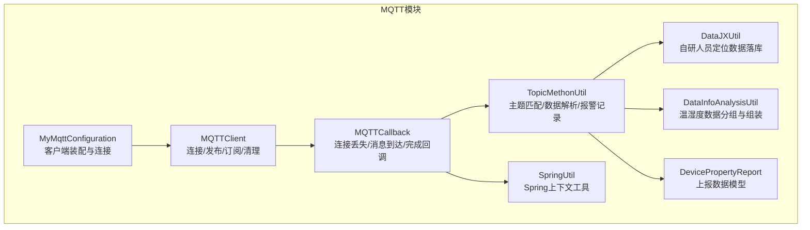
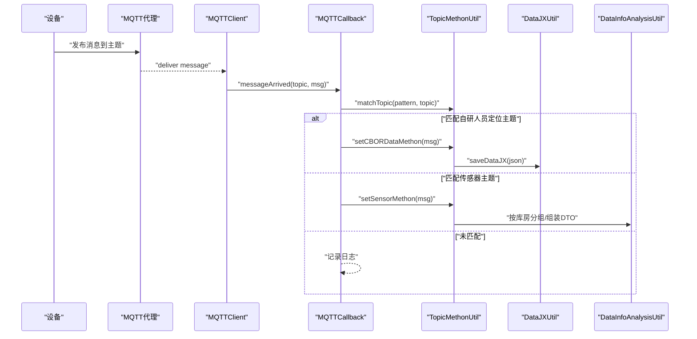
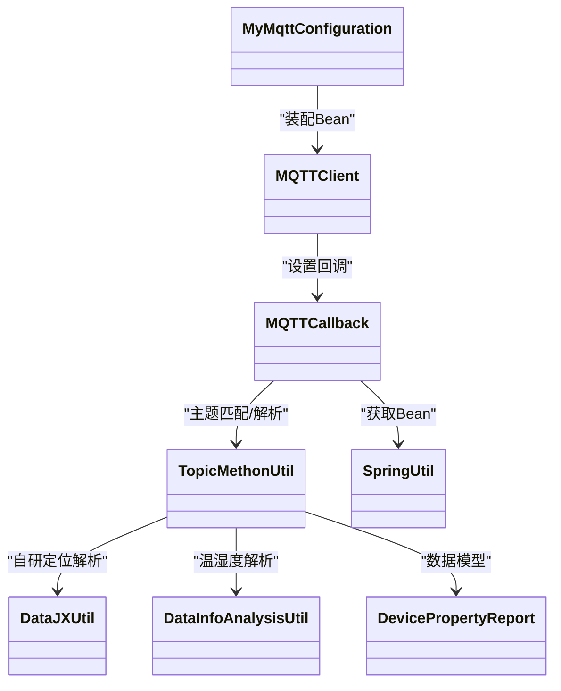

# MQTT通信协议

<cite>
**本文引用的文件**
- [MyMqttConfiguration.java](file://monkey-monitor/src/main/java/com/monkey/general/config/mqtt/MyMqttConfiguration.java)
- [MQTTClient.java](file://monkey-monitor/src/main/java/com/monkey/general/config/mqtt/MQTTClient.java)
- [MQTTCallback.java](file://monkey-monitor/src/main/java/com/monkey/general/config/mqtt/MQTTCallback.java)
- [TopicMethonUtil.java](file://monkey-monitor/src/main/java/com/monkey/general/config/mqtt/TopicMethonUtil.java)
- [DataJXUtil.java](file://monkey-monitor/src/main/java/com/monkey/general/config/mqtt/util/DataJXUtil.java)
- [DataInfoAnalysisUtil.java](file://monkey-monitor/src/main/java/com/monkey/general/config/mqtt/util/DataInfoAnalysisUtil.java)
- [DevicePropertyReport.java](file://monkey-monitor/src/main/java/com/monkey/general/config/mqtt/vo/DevicePropertyReport.java)
- [SpringUtil.java](file://monkey-monitor/src/main/java/com/monkey/general/config/mqtt/SpringUtil.java)
- [MqttConfiguration.java](file://monkey-monitor/src/main/java/com/monkey/general/config/MqttConfiguration.java)
- [application.yml](file://monkey-monitor-api/src/main/resources/application.yml)
</cite>

## 目录
1. [简介](#简介)
2. [项目结构](#项目结构)
3. [核心组件](#核心组件)
4. [架构总览](#架构总览)
5. [详细组件分析](#详细组件分析)
6. [依赖关系分析](#依赖关系分析)
7. [性能考量](#性能考量)
8. [故障排查指南](#故障排查指南)
9. [结论](#结论)
10. [附录](#附录)

## 简介
本文件面向物联网监控平台中的MQTT通信子系统，系统性阐述设备连接、消息发布/订阅、主题设计与路由机制，以及回调处理、数据解析与业务落库流程。同时给出MQTT客户端配置（MyMqttConfiguration）、MQTTClient使用方法、MQTTCallback回调接口实现要点，以及DataInfoAnalysisUtil、DataJXUtil等工具类的数据解析能力说明。最后提供主题设计规范、安全配置建议与常见通信故障排查方法。

## 项目结构
MQTT相关代码集中在“config.mqtt”包内，围绕客户端、回调、主题匹配与数据解析展开，并通过Spring上下文进行装配与调用。

图示来源
- [MyMqttConfiguration.java:1-58](file://monkey-monitor/src/main/java/com/monkey/general/config/mqtt/MyMqttConfiguration.java#L1-L58)
- [MQTTClient.java:1-139](file://monkey-monitor/src/main/java/com/monkey/general/config/mqtt/MQTTClient.java#L1-L139)
- [MQTTCallback.java:1-127](file://monkey-monitor/src/main/java/com/monkey/general/config/mqtt/MQTTCallback.java#L1-L127)
- [TopicMethonUtil.java:1-382](file://monkey-monitor/src/main/java/com/monkey/general/config/mqtt/TopicMethonUtil.java#L1-L382)
- [DataJXUtil.java:1-70](file://monkey-monitor/src/main/java/com/monkey/general/config/mqtt/util/DataJXUtil.java#L1-L70)
- [DataInfoAnalysisUtil.java:1-207](file://monkey-monitor/src/main/java/com/monkey/general/config/mqtt/util/DataInfoAnalysisUtil.java#L1-L207)
- [DevicePropertyReport.java:1-89](file://monkey-monitor/src/main/java/com/monkey/general/config/mqtt/vo/DevicePropertyReport.java#L1-L89)
- [SpringUtil.java:1-143](file://monkey-monitor/src/main/java/com/monkey/general/config/mqtt/SpringUtil.java#L1-L143)

章节来源
- [MyMqttConfiguration.java:1-58](file://monkey-monitor/src/main/java/com/monkey/general/config/mqtt/MyMqttConfiguration.java#L1-L58)
- [MQTTClient.java:1-139](file://monkey-monitor/src/main/java/com/monkey/general/config/mqtt/MQTTClient.java#L1-L139)
- [MQTTCallback.java:1-127](file://monkey-monitor/src/main/java/com/monkey/general/config/mqtt/MQTTCallback.java#L1-L127)
- [TopicMethonUtil.java:1-382](file://monkey-monitor/src/main/java/com/monkey/general/config/mqtt/TopicMethonUtil.java#L1-L382)
- [DataJXUtil.java:1-70](file://monkey-monitor/src/main/java/com/monkey/general/config/mqtt/util/DataJXUtil.java#L1-L70)
- [DataInfoAnalysisUtil.java:1-207](file://monkey-monitor/src/main/java/com/monkey/general/config/mqtt/util/DataInfoAnalysisUtil.java#L1-L207)
- [DevicePropertyReport.java:1-89](file://monkey-monitor/src/main/java/com/monkey/general/config/mqtt/vo/DevicePropertyReport.java#L1-L89)
- [SpringUtil.java:1-143](file://monkey-monitor/src/main/java/com/monkey/general/config/mqtt/SpringUtil.java#L1-L143)

## 核心组件
- MyMqttConfiguration：负责从配置加载MQTT连接参数，创建并初始化MQTTClient，内置基础重连逻辑。
- MQTTClient：封装Eclipse Paho客户端，提供连接、发布（默认QoS=0）、订阅、取消订阅等能力，并对并发发布进行同步保护。
- MQTTCallback：实现MqttCallbackExtended，处理连接丢失、消息到达、连接完成、消息投递完成等事件，负责主题匹配与业务转发。
- TopicMethonUtil：主题匹配、初始化订阅、自研人员定位数据解析、传感器数据解析与报警记录。
- DataJXUtil：自研人员定位数据的JSON解析与落库。
- DataInfoAnalysisUtil：温湿度数据按库房分组、组装DTO并输出标准JSON。
- DevicePropertyReport：设备属性上报的JSON数据模型。
- SpringUtil：提供静态获取Spring Bean的能力，用于回调中获取业务组件。
- MqttConfiguration：本地MQTT客户端配置（与MyMqttConfiguration互补）。

章节来源
- [MyMqttConfiguration.java:1-58](file://monkey-monitor/src/main/java/com/monkey/general/config/mqtt/MyMqttConfiguration.java#L1-L58)
- [MQTTClient.java:1-139](file://monkey-monitor/src/main/java/com/monkey/general/config/mqtt/MQTTClient.java#L1-L139)
- [MQTTCallback.java:1-127](file://monkey-monitor/src/main/java/com/monkey/general/config/mqtt/MQTTCallback.java#L1-L127)
- [TopicMethonUtil.java:1-382](file://monkey-monitor/src/main/java/com/monkey/general/config/mqtt/TopicMethonUtil.java#L1-L382)
- [DataJXUtil.java:1-70](file://monkey-monitor/src/main/java/com/monkey/general/config/mqtt/util/DataJXUtil.java#L1-L70)
- [DataInfoAnalysisUtil.java:1-207](file://monkey-monitor/src/main/java/com/monkey/general/config/mqtt/util/DataInfoAnalysisUtil.java#L1-L207)
- [DevicePropertyReport.java:1-89](file://monkey-monitor/src/main/java/com/monkey/general/config/mqtt/vo/DevicePropertyReport.java#L1-L89)
- [SpringUtil.java:1-143](file://monkey-monitor/src/main/java/com/monkey/general/config/mqtt/SpringUtil.java#L1-L143)
- [MqttConfiguration.java:1-40](file://monkey-monitor/src/main/java/com/monkey/general/config/MqttConfiguration.java#L1-L40)

## 架构总览
MQTT客户端启动后，通过回调在连接成功后初始化订阅特定主题；设备上报消息到达后，回调根据预设模式匹配主题，交由TopicMethonUtil进行解析与落库；同时触发短信报警记录等业务动作。

图示来源
- [MQTTCallback.java:62-89](file://monkey-monitor/src/main/java/com/monkey/general/config/mqtt/MQTTCallback.java#L62-L89)
- [TopicMethonUtil.java:87-168](file://monkey-monitor/src/main/java/com/monkey/general/config/mqtt/TopicMethonUtil.java#L87-L168)
- [DataJXUtil.java:28-68](file://monkey-monitor/src/main/java/com/monkey/general/config/mqtt/util/DataJXUtil.java#L28-L68)
- [DataInfoAnalysisUtil.java:30-187](file://monkey-monitor/src/main/java/com/monkey/general/config/mqtt/util/DataInfoAnalysisUtil.java#L30-L187)

## 详细组件分析

### MyMqttConfiguration：MQTT客户端配置与连接
- 负责从配置中心加载MQTT参数（主机、端口、用户名、密码、clientId、超时、保活），拼接连接URL并创建MQTTClient。
- 在装配时尝试连接一次，若失败则短暂休眠后重试（当前循环次数为1，实际重试次数为1次）。
- 通过@Bean暴露MQTTClient供其他组件使用。

章节来源
- [MyMqttConfiguration.java:19-55](file://monkey-monitor/src/main/java/com/monkey/general/config/mqtt/MyMqttConfiguration.java#L19-L55)

### MQTTClient：连接、发布、订阅与清理
- 连接参数设置：clean session、用户名/密码、连接超时、保活间隔、自动重连。
- 连接流程：首次创建客户端并绑定回调；若已连接则先断开再重连。
- 发布：默认QoS=0、非保留消息；并发发布通过同步块保证线程安全。
- 订阅/取消订阅：提供订阅与取消订阅接口，便于动态管理。

章节来源
- [MQTTClient.java:36-63](file://monkey-monitor/src/main/java/com/monkey/general/config/mqtt/MQTTClient.java#L36-L63)
- [MQTTClient.java:71-103](file://monkey-monitor/src/main/java/com/monkey/general/config/mqtt/MQTTClient.java#L71-L103)
- [MQTTClient.java:112-136](file://monkey-monitor/src/main/java/com/monkey/general/config/mqtt/MQTTClient.java#L112-L136)

### MQTTCallback：回调与主题路由
- 连接丢失：进入无限重连循环，每5秒尝试一次，直至连接成功后退出。
- 消息到达：根据预设模式匹配主题，分别调用自研定位或传感器解析方法；同时触发广西、云南扩展上报。
- 连接完成：在直连或重连成功后，调用TopicMethonUtil.ini进行主题初始化订阅。
- 消息投递完成：记录投递结果，失败时记录错误日志。

章节来源
- [MQTTCallback.java:32-56](file://monkey-monitor/src/main/java/com/monkey/general/config/mqtt/MQTTCallback.java#L32-L56)
- [MQTTCallback.java:62-89](file://monkey-monitor/src/main/java/com/monkey/general/config/mqtt/MQTTCallback.java#L62-L89)
- [MQTTCallback.java:96-109](file://monkey-monitor/src/main/java/com/monkey/general/config/mqtt/MQTTCallback.java#L96-L109)
- [MQTTCallback.java:117-124](file://monkey-monitor/src/main/java/com/monkey/general/config/mqtt/MQTTCallback.java#L117-L124)

### TopicMethonUtil：主题匹配与数据处理
- 初始化订阅：根据配置项订阅自研人员定位与网关传感器主题。
- 主题匹配：支持“+”单层通配、“#”尾部通配，严格匹配层级长度。
- 自研人员定位：解析CBOR转义后的十六进制字符串，调用DataJXUtil保存。
- 传感器数据：解析DevicePropertyReport，按设备类型区分温/湿度与液位，写入对应表并触发短信报警记录。
- 报警记录：根据阈值判断是否越界，构造预警推送记录。

章节来源
- [TopicMethonUtil.java:70-81](file://monkey-monitor/src/main/java/com/monkey/general/config/mqtt/TopicMethonUtil.java#L70-L81)
- [TopicMethonUtil.java:296-324](file://monkey-monitor/src/main/java/com/monkey/general/config/mqtt/TopicMethonUtil.java#L296-L324)
- [TopicMethonUtil.java:87-108](file://monkey-monitor/src/main/java/com/monkey/general/config/mqtt/TopicMethonUtil.java#L87-L108)
- [TopicMethonUtil.java:115-168](file://monkey-monitor/src/main/java/com/monkey/general/config/mqtt/TopicMethonUtil.java#L115-L168)
- [TopicMethonUtil.java:327-381](file://monkey-monitor/src/main/java/com/monkey/general/config/mqtt/TopicMethonUtil.java#L327-L381)

### DataJXUtil：自研人员定位数据解析
- 解析来自TopicMethonUtil的JSON数据，提取设备标识与MAC，查询人员卡信息，更新或新增人员定位数据记录。

章节来源
- [DataJXUtil.java:28-68](file://monkey-monitor/src/main/java/com/monkey/general/config/mqtt/util/DataJXUtil.java#L28-L68)

### DataInfoAnalysisUtil：温湿度数据解析与分组
- 按库房分组温湿度数据，预查询设备库房信息，避免重复查库。
- 组装DTO并输出标准JSON，便于后续上报或存储。

章节来源
- [DataInfoAnalysisUtil.java:30-126](file://monkey-monitor/src/main/java/com/monkey/general/config/mqtt/util/DataInfoAnalysisUtil.java#L30-L126)
- [DataInfoAnalysisUtil.java:148-187](file://monkey-monitor/src/main/java/com/monkey/general/config/mqtt/util/DataInfoAnalysisUtil.java#L148-L187)

### DevicePropertyReport：上报数据模型
- 映射设备上报的JSON结构，包含时间戳、设备编码、客户信息与传感器数据列表，其中每条传感器数据包含变量地址、类型、值与单位等。

章节来源
- [DevicePropertyReport.java:10-89](file://monkey-monitor/src/main/java/com/monkey/general/config/mqtt/vo/DevicePropertyReport.java#L10-L89)

### SpringUtil：Spring上下文工具
- 提供静态方法获取Bean与环境信息，用于回调中按名称或类型获取业务组件。

章节来源
- [SpringUtil.java:42-60](file://monkey-monitor/src/main/java/com/monkey/general/config/mqtt/SpringUtil.java#L42-L60)

### MqttConfiguration：本地MQTT客户端配置
- 与MyMqttConfiguration互补，提供本地MQTT客户端的通用配置与Bean定义。

章节来源
- [MqttConfiguration.java:20-40](file://monkey-monitor/src/main/java/com/monkey/general/config/MqttConfiguration.java#L20-L40)

## 依赖关系分析
- 组件耦合：MQTTClient依赖Eclipse Paho；MQTTCallback依赖TopicMethonUtil与SpringUtil；TopicMethonUtil依赖DataJXUtil、DataInfoAnalysisUtil与各业务Service。
- 外部依赖：Eclipse Paho客户端、FastJSON、MyBatis-Plus、Netty字符集工具等。
- 循环依赖：当前实现未见明显循环依赖；回调中通过SpringUtil间接获取Bean，避免直接注入造成循环。

图示来源
- [MyMqttConfiguration.java:35-55](file://monkey-monitor/src/main/java/com/monkey/general/config/mqtt/MyMqttConfiguration.java#L35-L55)
- [MQTTClient.java:50-63](file://monkey-monitor/src/main/java/com/monkey/general/config/mqtt/MQTTClient.java#L50-L63)
- [MQTTCallback.java:25-27](file://monkey-monitor/src/main/java/com/monkey/general/config/mqtt/MQTTCallback.java#L25-L27)
- [TopicMethonUtil.java:46-66](file://monkey-monitor/src/main/java/com/monkey/general/config/mqtt/TopicMethonUtil.java#L46-L66)

## 性能考量
- 并发发布同步：MQTTClient在publish内部使用同步块，避免多线程竞争导致死锁或消息错乱。
- 连接参数：启用自动重连与合理的保活间隔，有助于在网络抖动时快速恢复。
- 数据解析：TopicMethonUtil预查询设备库房信息，减少重复数据库访问；DataInfoAnalysisUtil按库房分组，降低后续处理复杂度。
- 日志与异常：回调中捕获异常并记录错误，避免异常传播导致断连重连循环。

章节来源
- [MQTTClient.java:93-102](file://monkey-monitor/src/main/java/com/monkey/general/config/mqtt/MQTTClient.java#L93-L102)
- [TopicMethonUtil.java:42-49](file://monkey-monitor/src/main/java/com/monkey/general/config/mqtt/TopicMethonUtil.java#L42-L49)
- [DataInfoAnalysisUtil.java:42-49](file://monkey-monitor/src/main/java/com/monkey/general/config/mqtt/util/DataInfoAnalysisUtil.java#L42-L49)
- [MQTTCallback.java:86-88](file://monkey-monitor/src/main/java/com/monkey/general/config/mqtt/MQTTCallback.java#L86-L88)

## 故障排查指南
- 连接断开
  - 现象：回调触发connectionLost，进入重连循环。
  - 排查：检查网络连通性、Broker地址与端口、认证信息；确认自动重连策略生效。
  - 处置：确保Broker可用后等待重连成功；必要时手动重启客户端。
  
  章节来源
  - [MQTTCallback.java:32-56](file://monkey-monitor/src/main/java/com/monkey/general/config/mqtt/MQTTCallback.java#L32-L56)

- 订阅未生效
  - 现象：消息到达但未匹配到主题，或未收到消息。
  - 排查：确认TopicMethonUtil.ini订阅的主题与设备上报主题一致；检查通配符使用是否正确。
  - 处置：修正主题模式或配置项，确保连接完成后重新订阅。

  章节来源
  - [TopicMethonUtil.java:70-81](file://monkey-monitor/src/main/java/com/monkey/general/config/mqtt/TopicMethonUtil.java#L70-L81)
  - [MQTTCallback.java:96-109](file://monkey-monitor/src/main/java/com/monkey/general/config/mqtt/MQTTCallback.java#L96-L109)

- 消息丢失或投递失败
  - 现象：deliveryComplete返回失败。
  - 排查：检查Broker状态、客户端QoS设置与网络稳定性。
  - 处置：提高Broker可靠性，必要时调整QoS级别或增加重试策略。

  章节来源
  - [MQTTCallback.java:117-124](file://monkey-monitor/src/main/java/com/monkey/general/config/mqtt/MQTTCallback.java#L117-L124)

- 数据解析异常
  - 现象：日志记录解析异常或未匹配到设备。
  - 排查：核对上报数据格式与DevicePropertyReport模型；确认设备编码与库房信息存在。
  - 处置：完善上报格式校验，补充设备档案与阈值配置。

  章节来源
  - [TopicMethonUtil.java:120-168](file://monkey-monitor/src/main/java/com/monkey/general/config/mqtt/TopicMethonUtil.java#L120-L168)
  - [DataJXUtil.java:36-68](file://monkey-monitor/src/main/java/com/monkey/general/config/mqtt/util/DataJXUtil.java#L36-L68)

- 网络异常与超时
  - 现象：连接超时或Broker不可达。
  - 排查：检查连接超时与保活参数；确认Broker负载与防火墙策略。
  - 处置：适当增大超时与保活时间，优化Broker资源。

  章节来源
  - [MQTTClient.java:36-44](file://monkey-monitor/src/main/java/com/monkey/general/config/mqtt/MQTTClient.java#L36-L44)

## 结论
本MQTT子系统通过清晰的配置、客户端封装、回调路由与数据解析链路，实现了设备连接、消息发布订阅、主题匹配与业务落库的完整闭环。建议在生产环境中进一步完善重连策略、QoS与超时参数、主题模式与数据格式校验，以提升稳定性与可观测性。

## 附录

### MQTT主题设计规范
- 设备ID命名规则
  - 建议采用“企业编码/仓库编号/库房编号/设备类型/设备标识”的层级结构，便于按域检索与权限控制。
- 消息类型分类
  - 人员定位：/device/{deviceId}/location
  - 传感器上报：/device/{deviceId}/data-report
  - 状态/告警：/device/{deviceId}/status 或 /device/{deviceId}/alarm
- 层级结构设计
  - 使用“+”匹配单层通配，“#”匹配尾部通配，避免过度宽泛导致误匹配。
  - 示例：/device/+/data-report 匹配所有设备的数据上报主题。

章节来源
- [TopicMethonUtil.java:296-324](file://monkey-monitor/src/main/java/com/monkey/general/config/mqtt/TopicMethonUtil.java#L296-L324)

### MQTT通信安全配置
- 认证
  - 使用用户名/密码认证，确保clientId唯一性，避免冲突。
- 加密
  - 建议启用TLS传输加密，防止中间人攻击与数据泄露。
- 权限控制
  - 通过Broker侧ACL限制主题读写权限，仅允许授权设备发布/订阅。
- 配置项参考
  - 连接参数：主机、端口、用户名、密码、clientId、超时、保活。
  - 本地配置：与MyMqttConfiguration互补，统一管理本地MQTT客户端。

章节来源
- [MyMqttConfiguration.java:19-32](file://monkey-monitor/src/main/java/com/monkey/general/config/mqtt/MyMqttConfiguration.java#L19-L32)
- [MqttConfiguration.java:20-31](file://monkey-monitor/src/main/java/com/monkey/general/config/MqttConfiguration.java#L20-L31)