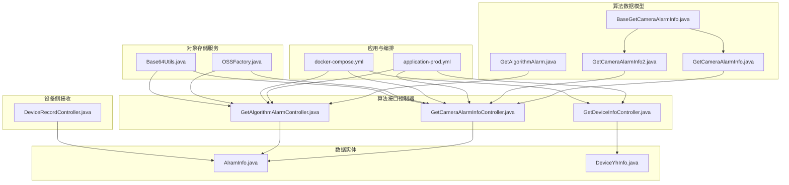
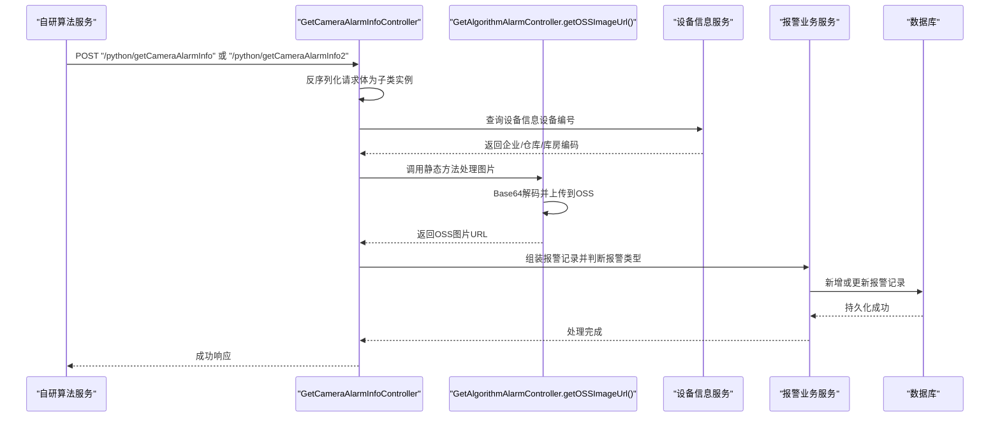
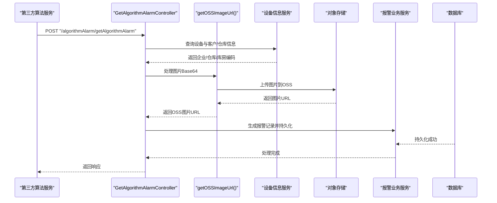
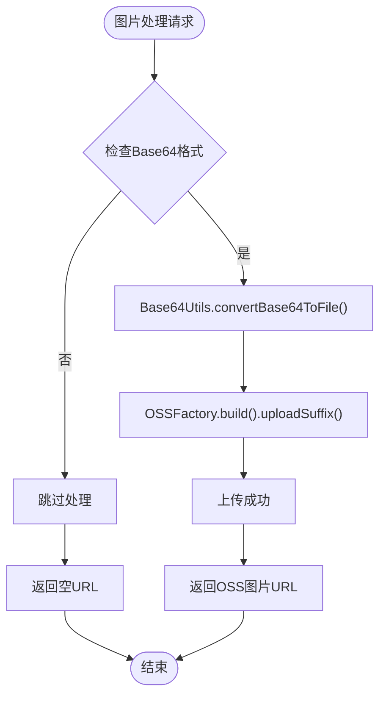
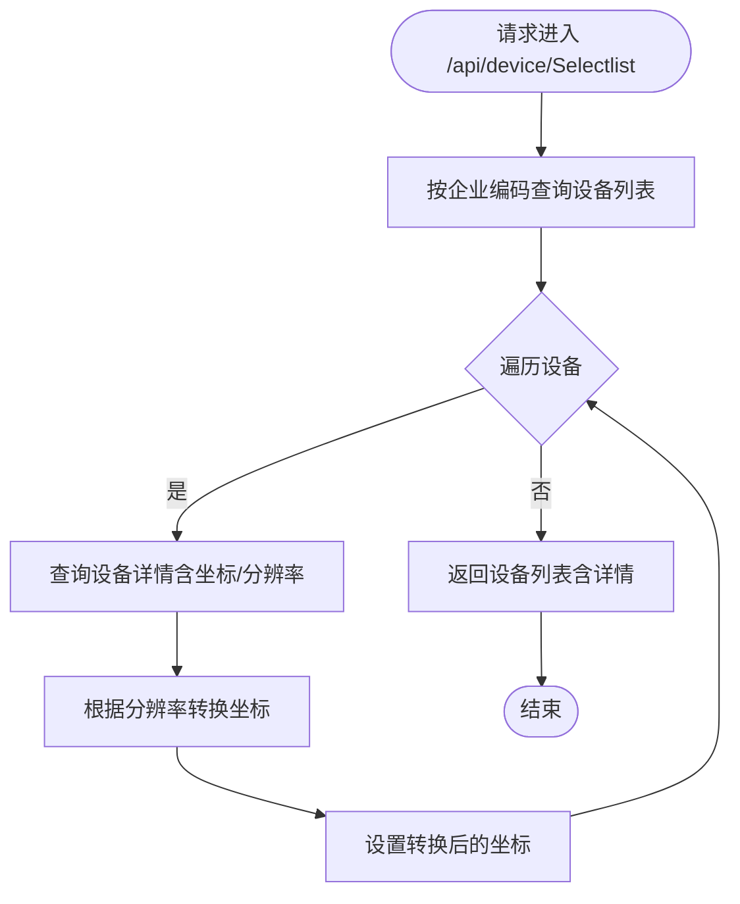
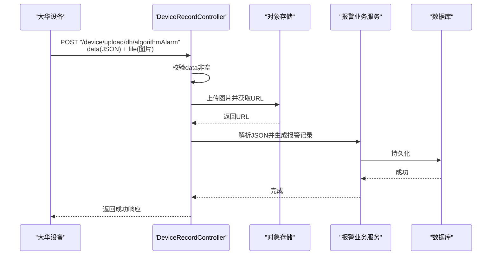
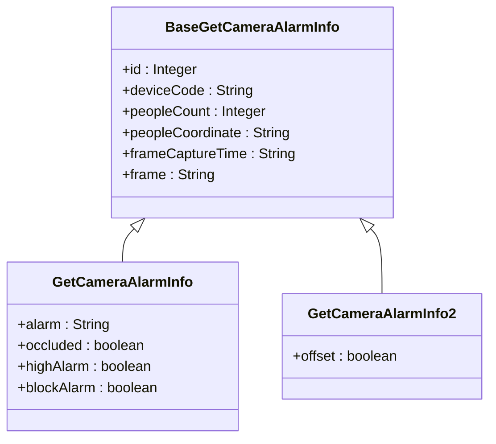
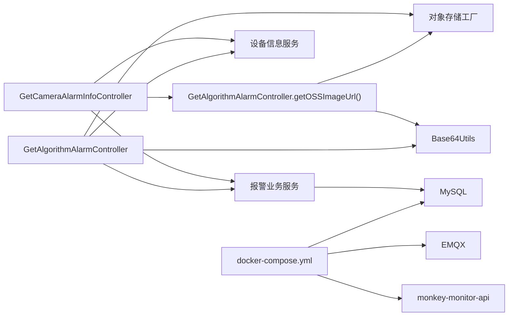
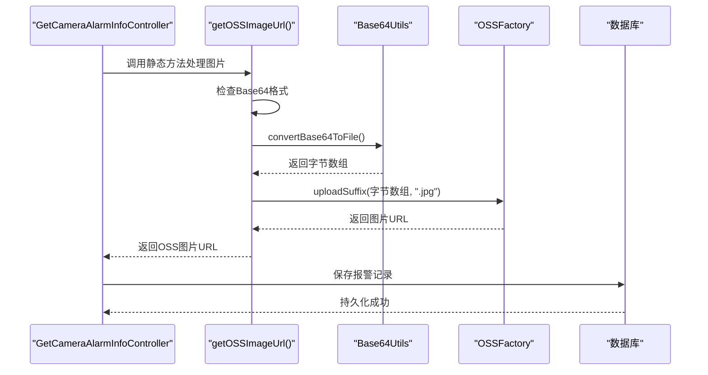

# Python算法集成

<cite>
**本文引用的文件**
- [BaseGetCameraAlarmInfo.java](file://monkey-monitor/src/main/java/com/monkey/general/modules/python/BaseGetCameraAlarmInfo.java)
- [GetCameraAlarmInfo.java](file://monkey-monitor/src/main/java/com/monkey/general/modules/python/GetCameraAlarmInfo.java)
- [GetCameraAlarmInfo2.java](file://monkey-monitor/src/main/java/com/monkey/general/modules/python/GetCameraAlarmInfo2.java)
- [GetCameraAlarmInfoController.java](file://monkey-monitor-api/src/main/java/com/monkey/general/python/GetCameraAlarmInfoController.java)
- [GetAlgorithmAlarmController.java](file://monkey-monitor-api/src/main/java/com/monkey/general/python/GetAlgorithmAlarmController.java)
- [GetAlgorithmAlarm.java](file://monkey-monitor-api/src/main/java/com/monkey/general/python/GetAlgorithmAlarm.java)
- [GetDeviceInfoController.java](file://monkey-monitor-api/src/main/java/com/monkey/general/python/GetDeviceInfoController.java)
- [docker-compose.yml](file://deploy/docker-compose.yml)
- [application-prod.yml](file://monkey-monitor-api/src/main/resources/application-prod.yml)
- [AlramInfo.java](file://monkey-monitor/src/main/java/com/monkey/general/modules/em/entity/AlramInfo.java)
- [DeviceYhInfo.java](file://monkey-monitor/src/main/java/com/monkey/general/modules/em/entity/DeviceYhInfo.java)
- [DeviceRecordController.java](file://monkey-monitor-api/src/main/java/com/monkey/general/controller/DeviceRecordController.java)
- [OSSFactory.java](file://monkey-service/src/main/java/com/monkey/general/modules/oss/cloud/OSSFactory.java)
- [Base64Utils.java](file://monkey-common/src/main/java/com/monkey/general/common/utils/Base64Utils.java)
</cite>

## 更新摘要
**变更内容**
- 更新告警图像处理流程，GetCameraAlarmInfoController现在使用GetAlgorithmAlarmController.getOSSImageUrl()方法统一处理报警图片
- 新增图片上传到OSS对象存储服务的标准化流程
- 改进系统性能和可扩展性，确保所有上传的报警图片都通过统一的OSS服务处理

## 目录
1. [引言](#引言)
2. [项目结构](#项目结构)
3. [核心组件](#核心组件)
4. [架构总览](#架构总览)
5. [详细组件分析](#详细组件分析)
6. [依赖分析](#依赖分析)
7. [性能考虑](#性能考虑)
8. [故障排查指南](#故障排查指南)
9. [结论](#结论)
10. [附录](#附录)

## 引言
本文件面向Python算法与硬件设备（摄像头）的集成场景，聚焦于两类AI算法报警数据接入与处理：自研算法推送的报警信息与第三方算法推送的报警信息。文档从代码结构、架构设计、数据流与处理逻辑入手，详细说明GetCameraAlarmInfo类的告警算法调用流程（图像预处理、算法推理、结果返回），阐述BaseGetCameraAlarmInfo基类的设计模式与扩展机制，并给出算法服务的启动与管理、通信协议与数据交换格式、接口调用示例、性能优化策略以及调试与常见问题排查方法。

**更新** 本次更新重点反映了告警图像处理的重大改进：所有报警图片现在通过GetAlgorithmAlarmController.getOSSImageUrl()静态方法统一处理，确保图片上传到OSS对象存储服务，提升了系统性能和可扩展性。

## 项目结构
本项目采用多模块Maven工程组织，与Python算法集成直接相关的模块与文件如下：
- 算法数据模型与控制器
  - 算法数据模型：BaseGetCameraAlarmInfo、GetCameraAlarmInfo、GetCameraAlarmInfo2、GetAlgorithmAlarm
  - 控制器：GetCameraAlarmInfoController、GetAlgorithmAlarmController、GetDeviceInfoController
- 算法服务与配置
  - docker编排：deploy/docker-compose.yml
  - 应用配置：monkey-monitor-api/src/main/resources/application-prod.yml
- 数据实体
  - 报警记录实体：AlramInfo
  - 设备信息实体：DeviceYhInfo
- 设备侧算法事件接收（大华）
  - DeviceRecordController 提供上传接口，接收设备侧算法事件并落库
- 对象存储服务
  - OSSFactory：统一的对象存储服务工厂
  - Base64Utils：图片Base64编码解码工具



**图表来源**
- [BaseGetCameraAlarmInfo.java:1-14](file://monkey-monitor/src/main/java/com/monkey/general/modules/python/BaseGetCameraAlarmInfo.java#L1-L14)
- [GetCameraAlarmInfo.java:1-15](file://monkey-monitor/src/main/java/com/monkey/general/modules/python/GetCameraAlarmInfo.java#L1-L15)
- [GetCameraAlarmInfo2.java:1-11](file://monkey-monitor/src/main/java/com/monkey/general/modules/python/GetCameraAlarmInfo2.java#L1-L11)
- [GetAlgorithmAlarm.java:1-16](file://monkey-monitor-api/src/main/java/com/monkey/general/python/GetAlgorithmAlarm.java#L1-L16)
- [GetCameraAlarmInfoController.java:1-166](file://monkey-monitor-api/src/main/java/com/monkey/general/python/GetCameraAlarmInfoController.java#L1-L166)
- [GetAlgorithmAlarmController.java:1-137](file://monkey-monitor-api/src/main/java/com/monkey/general/python/GetAlgorithmAlarmController.java#L1-L137)
- [GetDeviceInfoController.java:1-76](file://monkey-monitor-api/src/main/java/com/monkey/general/python/GetDeviceInfoController.java#L1-L76)
- [application-prod.yml:1-198](file://monkey-monitor-api/src/main/resources/application-prod.yml#L1-L198)
- [docker-compose.yml:1-103](file://deploy/docker-compose.yml#L1-L103)
- [AlramInfo.java](file://monkey-monitor/src/main/java/com/monkey/general/modules/em/entity/AlramInfo.java)
- [DeviceYhInfo.java](file://monkey-monitor/src/main/java/com/monkey/general/modules/em/entity/DeviceYhInfo.java)
- [DeviceRecordController.java:216-242](file://monkey-monitor-api/src/main/java/com/monkey/general/controller/DeviceRecordController.java#L216-L242)
- [OSSFactory.java:1-37](file://monkey-service/src/main/java/com/monkey/general/modules/oss/cloud/OSSFactory.java#L1-L37)
- [Base64Utils.java:1-326](file://monkey-common/src/main/java/com/monkey/general/common/utils/Base64Utils.java#L1-L326)

**章节来源**
- [BaseGetCameraAlarmInfo.java:1-14](file://monkey-monitor/src/main/java/com/monkey/general/modules/python/BaseGetCameraAlarmInfo.java#L1-L14)
- [GetCameraAlarmInfo.java:1-15](file://monkey-monitor/src/main/java/com/monkey/general/modules/python/GetCameraAlarmInfo.java#L1-L15)
- [GetCameraAlarmInfo2.java:1-11](file://monkey-monitor/src/main/java/com/monkey/general/modules/python/GetCameraAlarmInfo2.java#L1-L11)
- [GetAlgorithmAlarm.java:1-16](file://monkey-monitor-api/src/main/java/com/monkey/general/python/GetAlgorithmAlarm.java#L1-L16)
- [GetCameraAlarmInfoController.java:1-166](file://monkey-monitor-api/src/main/java/com/monkey/general/python/GetCameraAlarmInfoController.java#L1-L166)
- [GetAlgorithmAlarmController.java:1-137](file://monkey-monitor-api/src/main/java/com/monkey/general/python/GetAlgorithmAlarmController.java#L1-L137)
- [GetDeviceInfoController.java:1-76](file://monkey-monitor-api/src/main/java/com/monkey/general/python/GetDeviceInfoController.java#L1-L76)
- [application-prod.yml:1-198](file://monkey-monitor-api/src/main/resources/application-prod.yml#L1-L198)
- [docker-compose.yml:1-103](file://deploy/docker-compose.yml#L1-L103)
- [AlramInfo.java](file://monkey-monitor/src/main/java/com/monkey/general/modules/em/entity/AlramInfo.java)
- [DeviceYhInfo.java](file://monkey-monitor/src/main/java/com/monkey/general/modules/em/entity/DeviceYhInfo.java)
- [DeviceRecordController.java:216-242](file://monkey-monitor-api/src/main/java/com/monkey/general/controller/DeviceRecordController.java#L216-L242)
- [OSSFactory.java:1-37](file://monkey-service/src/main/java/com/monkey/general/modules/oss/cloud/OSSFactory.java#L1-L37)
- [Base64Utils.java:1-326](file://monkey-common/src/main/java/com/monkey/general/common/utils/Base64Utils.java#L1-L326)

## 核心组件
- 基类与扩展类
  - BaseGetCameraAlarmInfo：定义通用字段（设备编号、人数、坐标、抓帧时间、图片帧），作为自研算法输出的统一载体。
  - GetCameraAlarmInfo：在基类基础上扩展报警类型字段（少员/超员、遮挡、超高、堵塞）。
  - GetCameraAlarmInfo2：在基类基础上扩展偏移报警字段。
- 第三方算法模型
  - GetAlgorithmAlarm：定义第三方算法推送的报警字段（摄像机编号、报警时间、图片帧、报警类型、报警值、人数）。
- 控制器
  - GetCameraAlarmInfoController：接收自研算法推送的报警信息，解析设备与客户/仓库信息，生成或更新报警记录。**更新** 现在使用GetAlgorithmAlarmController.getOSSImageUrl()方法处理报警图片。
  - GetAlgorithmAlarmController：接收第三方算法推送的报警信息，处理报警类型与图片上传至对象存储，生成报警记录。
  - GetDeviceInfoController：提供摄像头算法侧设备信息查询接口，支持坐标与分辨率转换。
- 实体与编排
  - AlramInfo：报警记录实体，承载报警类型、状态、时间、附件等。
  - DeviceYhInfo：设备信息实体，关联企业、仓库、库房编码。
  - docker-compose.yml：定义MySQL、Redis、EMQX、XXL-Job、应用服务等容器编排。
  - application-prod.yml：数据库、MQTT、上传文件大小、Swagger等运行时配置。
- 对象存储服务
  - OSSFactory：统一的对象存储服务工厂，支持多种云存储提供商。
  - Base64Utils：提供Base64图片编码解码、格式识别等功能。

**章节来源**
- [BaseGetCameraAlarmInfo.java:1-14](file://monkey-monitor/src/main/java/com/monkey/general/modules/python/BaseGetCameraAlarmInfo.java#L1-L14)
- [GetCameraAlarmInfo.java:1-15](file://monkey-monitor/src/main/java/com/monkey/general/modules/python/GetCameraAlarmInfo.java#L1-L15)
- [GetCameraAlarmInfo2.java:1-11](file://monkey-monitor/src/main/java/com/monkey/general/modules/python/GetCameraAlarmInfo2.java#L1-L11)
- [GetAlgorithmAlarm.java:1-16](file://monkey-monitor-api/src/main/java/com/monkey/general/python/GetAlgorithmAlarm.java#L1-L16)
- [GetCameraAlarmInfoController.java:1-166](file://monkey-monitor-api/src/main/java/com/monkey/general/python/GetCameraAlarmInfoController.java#L1-L166)
- [GetAlgorithmAlarmController.java:1-137](file://monkey-monitor-api/src/main/java/com/monkey/general/python/GetAlgorithmAlarmController.java#L1-L137)
- [GetDeviceInfoController.java:1-76](file://monkey-monitor-api/src/main/java/com/monkey/general/python/GetDeviceInfoController.java#L1-L76)
- [AlramInfo.java](file://monkey-monitor/src/main/java/com/monkey/general/modules/em/entity/AlramInfo.java)
- [DeviceYhInfo.java](file://monkey-monitor/src/main/java/com/monkey/general/modules/em/entity/DeviceYhInfo.java)
- [docker-compose.yml:1-103](file://deploy/docker-compose.yml#L1-L103)
- [application-prod.yml:1-198](file://monkey-monitor-api/src/main/resources/application-prod.yml#L1-L198)
- [OSSFactory.java:1-37](file://monkey-service/src/main/java/com/monkey/general/modules/oss/cloud/OSSFactory.java#L1-L37)
- [Base64Utils.java:1-326](file://monkey-common/src/main/java/com/monkey/general/common/utils/Base64Utils.java#L1-L326)

## 架构总览
整体架构由"算法侧"与"平台侧"组成：
- 算法侧：Python算法（自研/第三方）产生报警数据，通过HTTP接口推送到平台侧。
- 平台侧：Spring Boot微服务接收报警数据，解析设备与业务信息，生成或更新报警记录，必要时上传图片至对象存储。

**更新** 图片处理流程现已标准化：所有报警图片通过GetAlgorithmAlarmController.getOSSImageUrl()静态方法统一处理，确保图片上传到OSS对象存储服务，提升系统性能和可扩展性。

```mermaid
graph TB
subgraph "算法侧"
PY1["自研算法服务"]
PY2["第三方算法服务"]
end
subgraph "平台侧"
API1["GetCameraAlarmInfoController<br/>统一图片处理"]
API2["GetAlgorithmAlarmController<br/>标准图片处理"]
SVC["业务服务层<br/>设备/客户/仓库/报警服务"]
DB["数据库<br/>MySQL"]
OSS["对象存储<br/>OSS"]
ENDPOINT["API端点<br/>/python/getCameraAlarmInfo<br/>/python/getCameraAlarmInfo2<br/>/algorithmAlarm/getAlgorithmAlarm"]
ENDPOINT --> API1
ENDPOINT --> API2
API1 --> SVC
API2 --> SVC
SVC --> DB
API1 --> OSS
API2 --> OSS
OSS --> OSS
```

**图表来源**
- [GetCameraAlarmInfoController.java:106](file://monkey-monitor-api/src/main/java/com/monkey/general/python/GetCameraAlarmInfoController.java#L106)
- [GetAlgorithmAlarmController.java:101](file://monkey-monitor-api/src/main/java/com/monkey/general/python/GetAlgorithmAlarmController.java#L101)
- [GetAlgorithmAlarmController.java:127-135](file://monkey-monitor-api/src/main/java/com/monkey/general/python/GetAlgorithmAlarmController.java#L127-L135)
- [docker-compose.yml:71-87](file://deploy/docker-compose.yml#L71-L87)
- [application-prod.yml:4-30](file://monkey-monitor-api/src/main/resources/application-prod.yml#L4-L30)

## 详细组件分析

### 告警算法调用流程（自研算法）
自研算法将检测结果封装为GetCameraAlarmInfo或GetCameraAlarmInfo2，通过HTTP POST接口推送至平台侧。平台侧控制器进行设备与业务信息解析，生成或更新报警记录。**更新** 现在使用GetAlgorithmAlarmController.getOSSImageUrl()方法统一处理报警图片。



**图表来源**
- [GetCameraAlarmInfoController.java:66-134](file://monkey-monitor-api/src/main/java/com/monkey/general/python/GetCameraAlarmInfoController.java#L66-L134)
- [GetCameraAlarmInfoController.java:106](file://monkey-monitor-api/src/main/java/com/monkey/general/python/GetCameraAlarmInfoController.java#L106)
- [GetAlgorithmAlarmController.java:127-135](file://monkey-monitor-api/src/main/java/com/monkey/general/python/GetAlgorithmAlarmController.java#L127-L135)
- [GetCameraAlarmInfo.java:1-15](file://monkey-monitor/src/main/java/com/monkey/general/modules/python/GetCameraAlarmInfo.java#L1-L15)
- [GetCameraAlarmInfo2.java:1-11](file://monkey-monitor/src/main/java/com/monkey/general/modules/python/GetCameraAlarmInfo2.java#L1-L11)

**章节来源**
- [GetCameraAlarmInfoController.java:66-134](file://monkey-monitor-api/src/main/java/com/monkey/general/python/GetCameraAlarmInfoController.java#L66-L134)
- [GetCameraAlarmInfoController.java:106](file://monkey-monitor-api/src/main/java/com/monkey/general/python/GetCameraAlarmInfoController.java#L106)
- [GetAlgorithmAlarmController.java:127-135](file://monkey-monitor-api/src/main/java/com/monkey/general/python/GetAlgorithmAlarmController.java#L127-L135)
- [GetCameraAlarmInfo.java:1-15](file://monkey-monitor/src/main/java/com/monkey/general/modules/python/GetCameraAlarmInfo.java#L1-L15)
- [GetCameraAlarmInfo2.java:1-11](file://monkey-monitor/src/main/java/com/monkey/general/modules/python/GetCameraAlarmInfo2.java#L1-L11)

### 第三方算法报警处理流程
第三方算法将报警数据封装为GetAlgorithmAlarm，通过HTTP POST接口推送。平台侧控制器解析设备与业务信息，若图片为Base64则转存至对象存储，再生成报警记录。



**图表来源**
- [GetAlgorithmAlarmController.java:48-116](file://monkey-monitor-api/src/main/java/com/monkey/general/python/GetAlgorithmAlarmController.java#L48-L116)
- [GetAlgorithmAlarmController.java:101](file://monkey-monitor-api/src/main/java/com/monkey/general/python/GetAlgorithmAlarmController.java#L101)
- [GetAlgorithmAlarmController.java:127-135](file://monkey-monitor-api/src/main/java/com/monkey/general/python/GetAlgorithmAlarmController.java#L127-L135)
- [GetAlgorithmAlarm.java:1-16](file://monkey-monitor-api/src/main/java/com/monkey/general/python/GetAlgorithmAlarm.java#L1-L16)

**章节来源**
- [GetAlgorithmAlarmController.java:48-116](file://monkey-monitor-api/src/main/java/com/monkey/general/python/GetAlgorithmAlarmController.java#L48-L116)
- [GetAlgorithmAlarmController.java:101](file://monkey-monitor-api/src/main/java/com/monkey/general/python/GetAlgorithmAlarmController.java#L101)
- [GetAlgorithmAlarmController.java:127-135](file://monkey-monitor-api/src/main/java/com/monkey/general/python/GetAlgorithmAlarmController.java#L127-L135)
- [GetAlgorithmAlarm.java:1-16](file://monkey-monitor-api/src/main/java/com/monkey/general/python/GetAlgorithmAlarm.java#L1-L16)

### 图片处理标准化流程
**新增** 所有报警图片处理现在通过GetAlgorithmAlarmController.getOSSImageUrl()静态方法统一处理，确保图片上传到OSS对象存储服务。



**图表来源**
- [GetAlgorithmAlarmController.java:127-135](file://monkey-monitor-api/src/main/java/com/monkey/general/python/GetAlgorithmAlarmController.java#L127-L135)
- [Base64Utils.java:86-94](file://monkey-common/src/main/java/com/monkey/general/common/utils/Base64Utils.java#L86-L94)
- [OSSFactory.java:21-34](file://monkey-service/src/main/java/com/monkey/general/modules/oss/cloud/OSSFactory.java#L21-L34)

**章节来源**
- [GetAlgorithmAlarmController.java:127-135](file://monkey-monitor-api/src/main/java/com/monkey/general/python/GetAlgorithmAlarmController.java#L127-L135)
- [Base64Utils.java:86-94](file://monkey-common/src/main/java/com/monkey/general/common/utils/Base64Utils.java#L86-L94)
- [OSSFactory.java:21-34](file://monkey-service/src/main/java/com/monkey/general/modules/oss/cloud/OSSFactory.java#L21-L34)

### 设备状态监控与坐标转换
GetDeviceInfoController提供摄像头设备列表查询接口，支持对设备点位坐标与分辨率进行转换，便于前端展示与算法侧坐标校准。



**图表来源**
- [GetDeviceInfoController.java:36-74](file://monkey-monitor-api/src/main/java/com/monkey/general/python/GetDeviceInfoController.java#L36-L74)

**章节来源**
- [GetDeviceInfoController.java:36-74](file://monkey-monitor-api/src/main/java/com/monkey/general/python/GetDeviceInfoController.java#L36-L74)

### 设备侧算法事件接收（大华）
设备侧算法事件通过multipart/form-data上传，后端解析JSON数据与图片文件，上传至对象存储并写入报警记录。



**图表来源**
- [DeviceRecordController.java:216-242](file://monkey-monitor-api/src/main/java/com/monkey/general/controller/DeviceRecordController.java#L216-L242)

**章节来源**
- [DeviceRecordController.java:216-242](file://monkey-monitor-api/src/main/java/com/monkey/general/controller/DeviceRecordController.java#L216-L242)

### 类关系与扩展机制
BaseGetCameraAlarmInfo作为基类，GetCameraAlarmInfo与GetCameraAlarmInfo2分别针对不同算法能力进行扩展，控制器通过泛型方法统一处理不同子类，体现了良好的开闭原则与扩展性。



**图表来源**
- [BaseGetCameraAlarmInfo.java:1-14](file://monkey-monitor/src/main/java/com/monkey/general/modules/python/BaseGetCameraAlarmInfo.java#L1-L14)
- [GetCameraAlarmInfo.java:1-15](file://monkey-monitor/src/main/java/com/monkey/general/modules/python/GetCameraAlarmInfo.java#L1-L15)
- [GetCameraAlarmInfo2.java:1-11](file://monkey-monitor/src/main/java/com/monkey/general/modules/python/GetCameraAlarmInfo2.java#L1-L11)

**章节来源**
- [BaseGetCameraAlarmInfo.java:1-14](file://monkey-monitor/src/main/java/com/monkey/general/modules/python/BaseGetCameraAlarmInfo.java#L1-L14)
- [GetCameraAlarmInfo.java:1-15](file://monkey-monitor/src/main/java/com/monkey/general/modules/python/GetCameraAlarmInfo.java#L1-L15)
- [GetCameraAlarmInfo2.java:1-11](file://monkey-monitor/src/main/java/com/monkey/general/modules/python/GetCameraAlarmInfo2.java#L1-L11)

## 依赖分析
- 组件耦合
  - 控制器依赖设备信息服务与报警业务服务，业务服务依赖数据库持久化。
  - 第三方算法控制器额外依赖对象存储工厂以处理图片上传。
  - **更新** GetCameraAlarmInfoController现在依赖GetAlgorithmAlarmController的静态方法进行图片处理。
- 外部依赖
  - MySQL：持久化报警与设备信息。
  - EMQX：MQTT消息通道（配置项存在但当前控制器未直接使用）。
  - XXL-Job：分布式调度（配置项存在，与算法集成无直接耦合）。
  - **更新** OSS对象存储：统一的图片存储服务，支持多种云存储提供商。
- 编排与运行
  - docker-compose统一编排数据库、消息中间件与应用服务，端口映射与健康检查确保服务可用性。



**图表来源**
- [GetCameraAlarmInfoController.java:42-49](file://monkey-monitor-api/src/main/java/com/monkey/general/python/GetCameraAlarmInfoController.java#L42-L49)
- [GetAlgorithmAlarmController.java:39-46](file://monkey-monitor-api/src/main/java/com/monkey/general/python/GetAlgorithmAlarmController.java#L39-L46)
- [GetCameraAlarmInfoController.java:106](file://monkey-monitor-api/src/main/java/com/monkey/general/python/GetCameraAlarmInfoController.java#L106)
- [GetAlgorithmAlarmController.java:127-135](file://monkey-monitor-api/src/main/java/com/monkey/general/python/GetAlgorithmAlarmController.java#L127-L135)
- [docker-compose.yml:6-25](file://deploy/docker-compose.yml#L6-L25)
- [docker-compose.yml:71-87](file://deploy/docker-compose.yml#L71-L87)

**章节来源**
- [GetCameraAlarmInfoController.java:42-49](file://monkey-monitor-api/src/main/java/com/monkey/general/python/GetCameraAlarmInfoController.java#L42-L49)
- [GetAlgorithmAlarmController.java:39-46](file://monkey-monitor-api/src/main/java/com/monkey/general/python/GetAlgorithmAlarmController.java#L39-L46)
- [GetCameraAlarmInfoController.java:106](file://monkey-monitor-api/src/main/java/com/monkey/general/python/GetCameraAlarmInfoController.java#L106)
- [GetAlgorithmAlarmController.java:127-135](file://monkey-monitor-api/src/main/java/com/monkey/general/python/GetAlgorithmAlarmController.java#L127-L135)
- [docker-compose.yml:6-25](file://deploy/docker-compose.yml#L6-L25)
- [docker-compose.yml:71-87](file://deploy/docker-compose.yml#L71-L87)

## 性能考虑
- 批量处理
  - 当前控制器逐条处理报警请求。建议在算法侧聚合多帧报警后再推送，减少HTTP请求频次与数据库写入压力。
- 异步调用
  - 报警入库与图片上传可采用异步队列（如消息中间件）解耦，提升接口吞吐与稳定性。
- 资源管理
  - **更新** 图片上传前通过Base64Utils进行格式识别和解码，避免无效图片占用带宽与存储。
  - 控制器日志级别合理配置，避免高频报警导致日志风暴。
- 数据库连接
  - application-prod.yml中已配置连接池参数，建议结合压测结果调整最大连接数与空闲连接数。
- **新增** 对象存储优化
  - 所有图片统一通过OSSFactory处理，支持多种云存储提供商，提升系统可扩展性。
  - Base64Utils提供图片格式识别功能，确保上传的图片格式正确。

**章节来源**
- [application-prod.yml:10-26](file://monkey-monitor-api/src/main/resources/application-prod.yml#L10-L26)
- [Base64Utils.java:227-301](file://monkey-common/src/main/java/com/monkey/general/common/utils/Base64Utils.java#L227-301)
- [OSSFactory.java:21-34](file://monkey-service/src/main/java/com/monkey/general/modules/oss/cloud/OSSFactory.java#L21-L34)

## 故障排查指南
- 算法无响应
  - 检查docker-compose服务健康状态与端口映射，确认应用服务容器已就绪。
  - 核对请求URL与端口（应用服务暴露端口与容器端口映射）。
- 结果异常
  - 核对请求体字段与类型（设备编号、报警类型、时间格式、图片格式）。
  - 检查设备是否存在且关联的企业/仓库信息完整。
- 内存泄漏
  - 避免在控制器中持有大对象引用；图片上传后及时释放临时缓冲区。
  - 使用连接池参数合理配置，避免连接泄露。
- **更新** 图片上传失败
  - 确认图片为Base64格式正确；检查Base64Utils的格式识别功能。
  - 检查OSSFactory配置与云存储凭证，确认网络连通性。
  - 核对GetAlgorithmAlarmController.getOSSImageUrl()方法的调用参数。
- 报警重复或未消警
  - 核对报警状态字段与消警逻辑；确保同一设备同一类型的未消警记录唯一。
- **新增** 对象存储相关问题
  - 检查OSSFactory的云存储配置，确认支持的存储提供商类型。
  - 验证Base64Utils的convertBase64ToFile()方法是否正确处理Base64数据。
  - 确认OSSFactory.build().uploadSuffix()方法的参数传递正确。

**章节来源**
- [docker-compose.yml:17-23](file://deploy/docker-compose.yml#L17-L23)
- [GetCameraAlarmInfoController.java:130-133](file://monkey-monitor-api/src/main/java/com/monkey/general/python/GetCameraAlarmInfoController.java#L130-L133)
- [GetAlgorithmAlarmController.java:111-115](file://monkey-monitor-api/src/main/java/com/monkey/general/python/GetAlgorithmAlarmController.java#L111-L115)
- [GetAlgorithmAlarmController.java:127-135](file://monkey-monitor-api/src/main/java/com/monkey/general/python/GetAlgorithmAlarmController.java#L127-L135)
- [Base64Utils.java:86-94](file://monkey-common/src/main/java/com/monkey/general/common/utils/Base64Utils.java#L86-L94)
- [OSSFactory.java:21-34](file://monkey-service/src/main/java/com/monkey/general/modules/oss/cloud/OSSFactory.java#L21-L34)

## 结论
本项目通过清晰的数据模型与控制器设计，实现了自研与第三方算法报警数据的统一接入与处理。基于基类的扩展机制保证了后续算法能力的平滑演进；通过对象存储与数据库的协同，满足了报警记录的长期留存与检索需求。

**更新** 最新的告警图像处理改进显著提升了系统性能和可扩展性：所有报警图片现在通过GetAlgorithmAlarmController.getOSSImageUrl()静态方法统一处理，确保图片上传到OSS对象存储服务。这一标准化流程不仅提高了系统的可靠性，还为未来的云存储迁移和扩展提供了便利。

建议在生产环境中引入异步与批处理策略，进一步提升系统的吞吐与稳定性。

## 附录

### 接口调用示例

- 自研算法推送报警（POST /python/getCameraAlarmInfo）
  - 请求体字段
    - deviceCode：设备编号（字符串）
    - peopleCount：检测到的人数（整数）
    - peopleCoordinate：人数坐标（字符串）
    - frameCaptureTime：抓帧时间（字符串，格式参考应用配置的时间格式）
    - frame：图片帧（字符串，Base64格式）
    - alarm：少员/超员报警信息（字符串）
    - occluded：是否遮挡（布尔）
    - highAlarm：是否超高（布尔）
    - blockAlarm：是否堵塞（布尔）
  - 响应：无内容（204/200视实现）

- 自研算法推送报警（POST /python/getCameraAlarmInfo2）
  - 请求体字段
    - deviceCode：设备编号（字符串）
    - peopleCount：检测到的人数（整数）
    - peopleCoordinate：人数坐标（字符串）
    - frameCaptureTime：抓帧时间（字符串）
    - frame：图片帧（字符串，Base64格式）
    - offset：是否偏移（布尔）
  - 响应：无内容（204/200视实现）

- 第三方算法推送报警（POST /algorithmAlarm/getAlgorithmAlarm）
  - 请求体字段
    - cameraNum：摄像机编号（字符串）
    - alarmTime：报警时间（字符串，格式参考应用配置的时间格式）
    - frame：图片帧（字符串，Base64格式）
    - alarmType：报警类型（整数，含义见实体定义）
    - alarmValue：报警值（整数）
    - number：人员数量（整数）
  - 响应
    - code：0表示成功，非0表示失败
    - message：提示信息

- 设备信息查询（GET /api/device/Selectlist）
  - 参数
    - companyCode：企业编码（字符串）
  - 响应
    - 列表：设备信息（含详情，详情中包含转换后的坐标）

**章节来源**
- [GetCameraAlarmInfoController.java:52-63](file://monkey-monitor-api/src/main/java/com/monkey/general/python/GetCameraAlarmInfoController.java#L52-L63)
- [GetAlgorithmAlarmController.java:48-116](file://monkey-monitor-api/src/main/java/com/monkey/general/python/GetAlgorithmAlarmController.java#L48-L116)
- [GetDeviceInfoController.java:36-74](file://monkey-monitor-api/src/main/java/com/monkey/general/python/GetDeviceInfoController.java#L36-L74)
- [GetAlgorithmAlarm.java:1-16](file://monkey-monitor-api/src/main/java/com/monkey/general/python/GetAlgorithmAlarm.java#L1-L16)

### 图片处理流程详解

**新增** 告警图片处理的完整流程如下：

1. **Base64格式检查**：GetAlgorithmAlarmController.getOSSImageUrl()方法首先检查传入的图片数据是否为Base64格式
2. **Base64解码**：使用Base64Utils.convertBase64ToFile()方法将Base64字符串解码为字节数组
3. **OSS上传**：通过OSSFactory.build().uploadSuffix()方法将图片上传到对象存储服务
4. **URL返回**：返回上传成功的图片URL，用于报警记录的存储



**图表来源**
- [GetCameraAlarmInfoController.java:106](file://monkey-monitor-api/src/main/java/com/monkey/general/python/GetCameraAlarmInfoController.java#L106)
- [GetAlgorithmAlarmController.java:127-135](file://monkey-monitor-api/src/main/java/com/monkey/general/python/GetAlgorithmAlarmController.java#L127-L135)
- [Base64Utils.java:86-94](file://monkey-common/src/main/java/com/monkey/general/common/utils/Base64Utils.java#L86-L94)
- [OSSFactory.java:21-34](file://monkey-service/src/main/java/com/monkey/general/modules/oss/cloud/OSSFactory.java#L21-L34)

**章节来源**
- [GetCameraAlarmInfoController.java:106](file://monkey-monitor-api/src/main/java/com/monkey/general/python/GetCameraAlarmInfoController.java#L106)
- [GetAlgorithmAlarmController.java:127-135](file://monkey-monitor-api/src/main/java/com/monkey/general/python/GetAlgorithmAlarmController.java#L127-L135)
- [Base64Utils.java:86-94](file://monkey-common/src/main/java/com/monkey/general/common/utils/Base64Utils.java#L86-L94)
- [OSSFactory.java:21-34](file://monkey-service/src/main/java/com/monkey/general/modules/oss/cloud/OSSFactory.java#L21-L34)