# 第三方系统集成

<cite>
**本文引用的文件**
- [ZKTecoParkingService.java](file://monkey-monitor/src/main/java/com/monkey/general/modules/third/service/ZKTecoParkingService.java)
- [ChengLianService.java](file://monkey-monitor/src/main/java/com/monkey/general/modules/third/service/ChengLianService.java)
- [HaiKangService.java](file://monkey-monitor/src/main/java/com/monkey/general/modules/third/service/HaiKangService.java)
- [QingTianService.java](file://monkey-monitor/src/main/java/com/monkey/general/modules/third/service/QingTianService.java)
- [ApiDataUtil.java](file://monkey-monitor/src/main/java/com/monkey/general/modules/third/api/util/ApiDataUtil.java)
- [DataRequest.java](file://monkey-monitor/src/main/java/com/monkey/general/modules/third/api/request/DataRequest.java)
- [ChengLianCarSyncDto.java](file://monkey-monitor/src/main/java/com/monkey/general/modules/third/dto/ChengLianCarSyncDto.java)
- [ChengLianPersonSyncDto.java](file://monkey-monitor/src/main/java/com/monkey/general/modules/third/dto/ChengLianPersonSyncDto.java)
- [CarInOutInfo.java](file://monkey-monitor/src/main/java/com/monkey/general/modules/em/entity/CarInOutInfo.java)
- [EntryRecordPushController.java](file://monkey-monitor-api/src/main/java/com/monkey/general/controller/EntryRecordPushController.java)
- [ManufacturersEnum.java](file://monkey-monitor-api/src/main/java/com/monkey/general/enums/ManufacturersEnum.java)
- [application.yml](file://monkey-monitor-api/src/main/resources/application.yml)
- [SetGZUploadInfo.java](file://monkey-monitor/src/main/java/com/monkey/general/platform/push/gz/SetGZUploadInfo.java)
- [PushingGZDataService.java](file://monkey-monitor/src/main/java/com/monkey/general/platform/push/gz/PushingGZDataService.java)
- [GZCodeGenerator.java](file://monkey-monitor/src/main/java/com/monkey/general/util/gz/util/GZCodeGenerator.java)
- [SetSendInfoEntity.java](file://monkey-monitor/src/main/java/com/monkey/general/platform/push/SetSendInfoEntity.java)
</cite>

## 目录
1. [简介](#简介)
2. [项目结构](#项目结构)
3. [核心组件](#核心组件)
4. [架构总览](#架构总览)
5. [详细组件分析](#详细组件分析)
6. [依赖分析](#依赖分析)
7. [性能考虑](#性能考虑)
8. [故障排查指南](#故障排查指南)
9. [结论](#结论)
10. [附录](#附录)

## 简介
本文件面向第三方系统集成场景，围绕停车场系统（ZKTeco）、门禁系统（海康、城联、擎天）以及广州平台对接方案进行系统化说明。内容涵盖：
- 第三方API调用方式、请求参数格式、响应解析与错误处理
- 以ZKTecoParkingService为例的数据同步流程（车辆进出记录、人员通行记录）
- 数据传输对象（DTO）设计与使用（ChengLianCarSyncDto、ChengLianPersonSyncDto）
- API认证机制（MD5签名、时间戳校验等）
- 广州平台数据上传格式要求变更：严格要求15位仓库编码（storeNum），不再支持18位库房编码的降级机制
- 常见异常场景与处理策略
- 最佳实践与性能优化建议

## 项目结构
第三方集成相关代码主要分布在以下模块：
- third服务层：各厂商对接实现（ZKTeco、海康、城联、擎天）
- third api工具：统一请求封装与签名工具
- third dto：数据传输对象
- em实体：与业务实体映射（如车辆进出记录）
- 广州平台服务层：专门处理广州平台数据上传格式转换
- monitor-api控制器：接收第三方推送（如ZKTeco入场/出场推送）

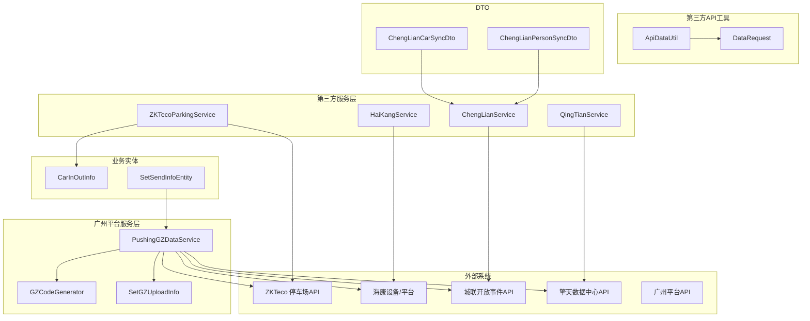

**更新** 新增广州平台服务层，专门处理数据格式转换和编码规范

图表来源
- [ZKTecoParkingService.java:32-265](file://monkey-monitor/src/main/java/com/monkey/general/modules/third/service/ZKTecoParkingService.java#L32-L265)
- [ChengLianService.java:40-266](file://monkey-monitor/src/main/java/com/monkey/general/modules/third/service/ChengLianService.java#L40-L266)
- [HaiKangService.java:56-800](file://monkey-monitor/src/main/java/com/monkey/general/modules/third/service/HaiKangService.java#L56-L800)
- [QingTianService.java:60-834](file://monkey-monitor/src/main/java/com/monkey/general/modules/third/service/QingTianService.java#L60-L834)
- [PushingGZDataService.java:310-779](file://monkey-monitor/src/main/java/com/monkey/general/platform/push/gz/PushingGZDataService.java#L310-L779)
- [GZCodeGenerator.java:144-171](file://monkey-monitor/src/main/java/com/monkey/general/util/gz/util/GZCodeGenerator.java#L144-L171)
- [SetGZUploadInfo.java:200-449](file://monkey-monitor/src/main/java/com/monkey/general/platform/push/gz/SetGZUploadInfo.java#L200-L449)

## 核心组件
- ZKTecoParkingService：负责与ZKTeco停车场系统对接，支持车辆信息同步、入场/出场记录落库与告警联动。
- ChengLianService：对接城联开放事件API，支持人员/车辆信息同步与出入记录落库。
- HaiKangService：对接海康设备/平台，支持人员信息同步、人脸上传、删除、设备上报记录入库。
- QingTianService：对接擎天数据中心API，支持MQTT下发人员同步、HTTP请求车辆同步与通知回调。
- PushingGZDataService：专门处理广州平台数据上传，负责将18位库房编码转换为15位仓库编码，确保符合平台要求。
- GZCodeGenerator：提供编码生成和验证工具，确保仓库编码格式正确。
- SetGZUploadInfo：负责将内部数据转换为广州平台要求的上传格式，严格使用15位仓库编码。
- ApiDataUtil/DataRequest：统一封装请求与签名（MD5），用于第三方HTTP调用。
- DTO：ChengLianCarSyncDto、ChengLianPersonSyncDto作为数据载体，扩展基础实体。
- SetSendInfoEntity：通用数据转换工具，支持多种平台的数据格式转换。

**更新** 新增广州平台专用服务组件，专门处理编码格式转换

章节来源
- [ZKTecoParkingService.java:32-265](file://monkey-monitor/src/main/java/com/monkey/general/modules/third/service/ZKTecoParkingService.java#L32-L265)
- [ChengLianService.java:40-266](file://monkey-monitor/src/main/java/com/monkey/general/modules/third/service/ChengLianService.java#L40-L266)
- [HaiKangService.java:56-800](file://monkey-monitor/src/main/java/com/monkey/general/modules/third/service/HaiKangService.java#L56-L800)
- [QingTianService.java:60-834](file://monkey-monitor/src/main/java/com/monkey/general/modules/third/service/QingTianService.java#L60-L834)
- [PushingGZDataService.java:310-779](file://monkey-monitor/src/main/java/com/monkey/general/platform/push/gz/PushingGZDataService.java#L310-L779)
- [GZCodeGenerator.java:144-171](file://monkey-monitor/src/main/java/com/monkey/general/util/gz/util/GZCodeGenerator.java#L144-L171)
- [SetGZUploadInfo.java:200-449](file://monkey-monitor/src/main/java/com/monkey/general/platform/push/gz/SetGZUploadInfo.java#L200-L449)

## 架构总览
第三方系统通过统一的服务接口与各厂商系统交互，采用"策略工厂"枚举选择对应实现，并在控制器层接收外部推送，落地到业务实体。广州平台通过专门的服务层进行数据格式转换，确保符合平台要求。

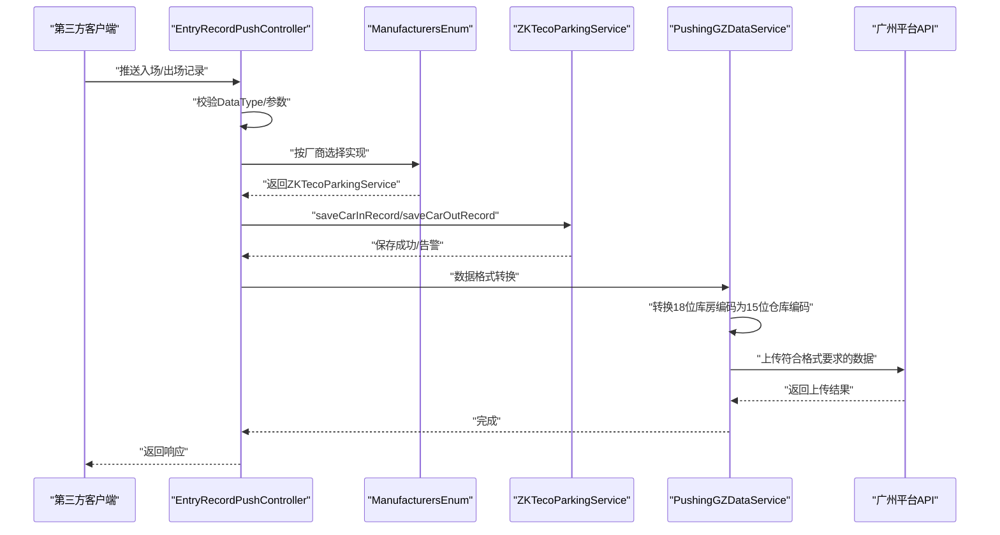

**更新** 新增广州平台数据转换流程，确保编码格式符合平台要求

图表来源
- [EntryRecordPushController.java:35-106](file://monkey-monitor-api/src/main/java/com/monkey/general/controller/EntryRecordPushController.java#L35-L106)
- [ManufacturersEnum.java:8-50](file://monkey-monitor-api/src/main/java/com/monkey/general/enums/ManufacturersEnum.java#L8-L50)
- [ZKTecoParkingService.java:189-250](file://monkey-monitor/src/main/java/com/monkey/general/modules/third/service/ZKTecoParkingService.java#L189-L250)
- [PushingGZDataService.java:587-630](file://monkey-monitor/src/main/java/com/monkey/general/platform/push/gz/PushingGZDataService.java#L587-L630)

## 详细组件分析

### ZKTeco 停车场对接（ZKTecoParkingService）
- 功能要点
  - 车辆信息同步：新增/删除，构造请求参数并调用第三方API，解析返回状态，回写同步标志。
  - 车辆进出记录：接收推送，匹配公司编码与车辆信息，若不存在则生成告警记录，最后保存进出记录。
- 关键流程

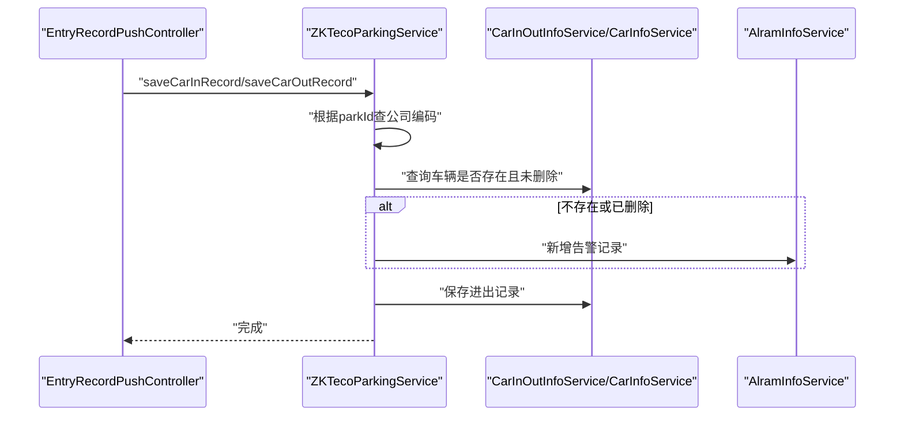

图表来源
- [EntryRecordPushController.java:66-105](file://monkey-monitor-api/src/main/java/com/monkey/general/controller/EntryRecordPushController.java#L66-L105)
- [ZKTecoParkingService.java:189-250](file://monkey-monitor/src/main/java/com/monkey/general/modules/third/service/ZKTecoParkingService.java#L189-L250)

- 参数与返回
  - 请求参数：由车辆实体映射为第三方字段（含企业编码、车牌、人员信息、时间范围等），删除时携带删除标识。
  - 返回解析：解析第三方返回的JSON，依据状态码判断成功与否，异常时记录日志并跳过。
- 错误处理
  - 空列表/异常：直接返回空集合或记录错误日志。
  - 未找到公司编码：记录错误并终止。
  - 车辆不存在或已删除：生成告警记录并标记非正常。

章节来源
- [ZKTecoParkingService.java:52-125](file://monkey-monitor/src/main/java/com/monkey/general/modules/third/service/ZKTecoParkingService.java#L52-L125)
- [ZKTecoParkingService.java:189-250](file://monkey-monitor/src/main/java/com/monkey/general/modules/third/service/ZKTecoParkingService.java#L189-L250)
- [CarInOutInfo.java:55-107](file://monkey-monitor/src/main/java/com/monkey/general/modules/em/entity/CarInOutInfo.java#L55-L107)

### 城联（ChengLianService）
- 功能要点
  - 人员/车辆信息同步：构造请求参数，调用开放事件API，解析返回码，成功后回写同步标志。
  - 出入记录：保存人员/车辆出入记录，若目标不存在则生成告警。
- 关键流程

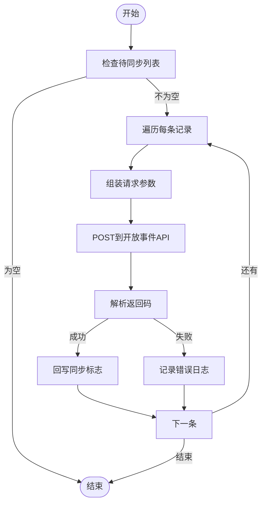

图表来源
- [ChengLianService.java:60-121](file://monkey-monitor/src/main/java/com/monkey/general/modules/third/service/ChengLianService.java#L60-L121)
- [ChengLianService.java:124-187](file://monkey-monitor/src/main/java/com/monkey/general/modules/third/service/ChengLianService.java#L124-L187)

章节来源
- [ChengLianService.java:40-266](file://monkey-monitor/src/main/java/com/monkey/general/modules/third/service/ChengLianService.java#L40-L266)

### 海康（HaiKangService）
- 功能要点
  - 人员信息同步：遍历企业下所有有效门禁设备，逐台同步人员与人脸，成功才更新数据库状态。
  - 删除：逐台删除人员与人脸，成功后更新数据库状态。
  - 设备上报：解析设备上报的出入记录，上传图片至OSS，生成出入记录。
- 关键流程

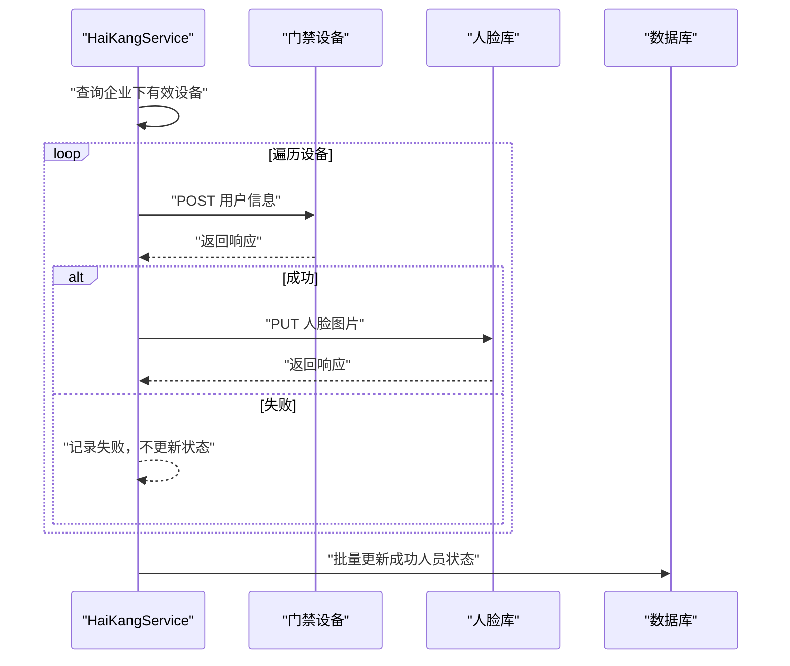

图表来源
- [HaiKangService.java:67-128](file://monkey-monitor/src/main/java/com/monkey/general/modules/third/service/HaiKangService.java#L67-L128)
- [HaiKangService.java:309-356](file://monkey-monitor/src/main/java/com/monkey/general/modules/third/service/HaiKangService.java#L309-L356)

章节来源
- [HaiKangService.java:56-800](file://monkey-monitor/src/main/java/com/monkey/general/modules/third/service/HaiKangService.java#L56-L800)

### 擎天（QingTianService）
- 功能要点
  - 人员同步：按驻留类型分组，通过MQTT向设备下发同步指令。
  - 车辆同步：先查询是否存在，再决定插入/更新；临时车额外走预约流程。
  - 通知回调：解析设备回调，批量更新人员同步状态。
- 关键流程

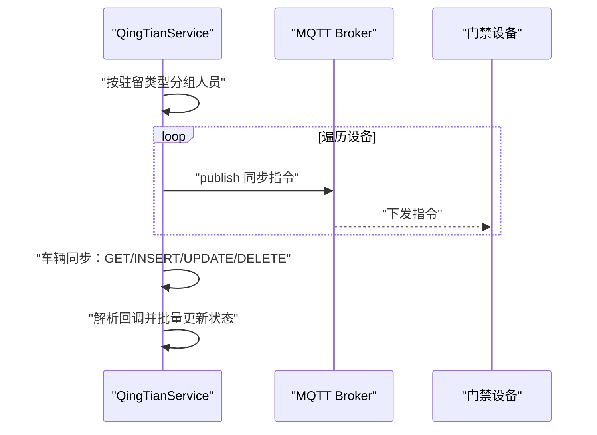

图表来源
- [QingTianService.java:100-162](file://monkey-monitor/src/main/java/com/monkey/general/modules/third/service/QingTianService.java#L100-L162)
- [QingTianService.java:240-327](file://monkey-monitor/src/main/java/com/monkey/general/modules/third/service/QingTianService.java#L240-L327)
- [QingTianService.java:429-504](file://monkey-monitor/src/main/java/com/monkey/general/modules/third/service/QingTianService.java#L429-L504)

章节来源
- [QingTianService.java:60-834](file://monkey-monitor/src/main/java/com/monkey/general/modules/third/service/QingTianService.java#L60-L834)

### 广州平台数据上传格式转换（PushingGZDataService）
- 功能要点
  - 编码转换：将18位库房编码转换为15位仓库编码，严格遵守平台要求。
  - 设备编码生成：为设备生成符合广州平台规范的编码格式。
  - 数据格式化：将内部数据转换为广州平台要求的上传格式。
  - place_no字段生成：严格使用15位仓库编码（storeNum）填充place_no字段。
- 关键流程

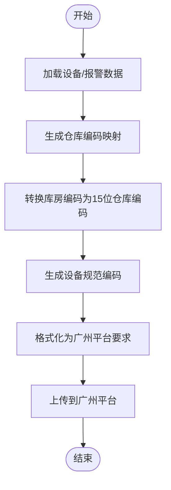

**更新** 新增广州平台数据格式转换流程，确保编码格式符合平台要求

图表来源
- [PushingGZDataService.java:314-338](file://monkey-monitor/src/main/java/com/monkey/general/platform/push/gz/PushingGZDataService.java#L314-L338)
- [PushingGZDataService.java:587-604](file://monkey-monitor/src/main/java/com/monkey/general/platform/push/gz/PushingGZDataService.java#L587-L604)
- [SetGZUploadInfo.java:203-204](file://monkey-monitor/src/main/java/com/monkey/general/platform/push/gz/SetGZUploadInfo.java#L203-L204)

- 编码规范
  - 仓库编码：15位（企业编码12位 + 仓库流水号3位）
  - 库房编码：18位（15位仓库编码 + 库房流水号3位）
  - 设备编码：18位（企业编码12位 + 设备类型2位 + 设备流水号4位）
- place_no字段生成逻辑
  - 严格使用15位仓库编码（storeNum）填充place_no字段
  - 不再支持18位库房编码的降级机制
  - 确保与SBDY/CKXX保持一致

章节来源
- [PushingGZDataService.java:314-338](file://monkey-monitor/src/main/java/com/monkey/general/platform/push/gz/PushingGZDataService.java#L314-L338)
- [PushingGZDataService.java:587-604](file://monkey-monitor/src/main/java/com/monkey/general/platform/push/gz/PushingGZDataService.java#L587-L604)
- [SetGZUploadInfo.java:203-204](file://monkey-monitor/src/main/java/com/monkey/general/platform/push/gz/SetGZUploadInfo.java#L203-L204)
- [GZCodeGenerator.java:144-171](file://monkey-monitor/src/main/java/com/monkey/general/util/gz/util/GZCodeGenerator.java#L144-L171)

### API认证与签名（MD5）
- 统一工具：ApiDataUtil提供签名生成与请求封装。
- 签名规则：对请求Map与data子Map按键名a-z排序拼接，追加密钥后MD5。
- 使用场景：擎天HTTP请求签名（DataRequest）。

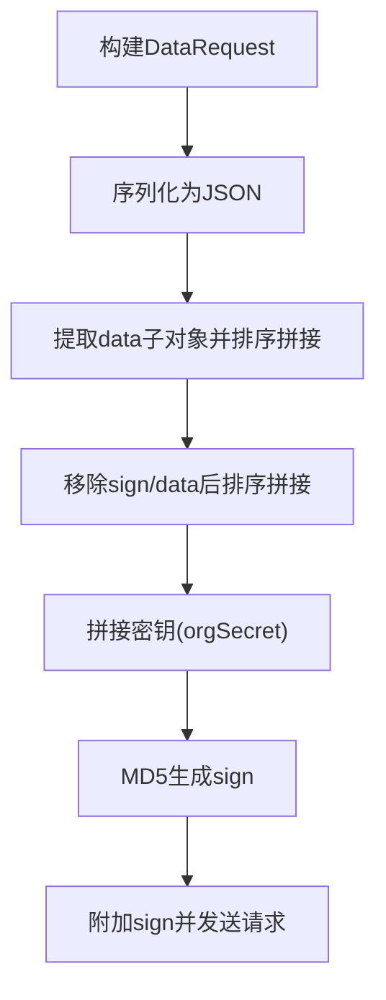

图表来源
- [ApiDataUtil.java:35-52](file://monkey-monitor/src/main/java/com/monkey/general/modules/third/api/util/ApiDataUtil.java#L35-L52)
- [DataRequest.java:8-35](file://monkey-monitor/src/main/java/com/monkey/general/modules/third/api/request/DataRequest.java#L8-L35)

章节来源
- [ApiDataUtil.java:17-70](file://monkey-monitor/src/main/java/com/monkey/general/modules/third/api/util/ApiDataUtil.java#L17-L70)
- [DataRequest.java:8-35](file://monkey-monitor/src/main/java/com/monkey/general/modules/third/api/request/DataRequest.java#L8-L35)

### 数据传输对象（DTO）
- ChengLianCarSyncDto：继承CarSync，承载城联车辆同步所需字段。
- ChengLianPersonSyncDto：扩展PersonSync，增加人员编号、企业编码、姓名、身份证、照片、联系方式等字段。

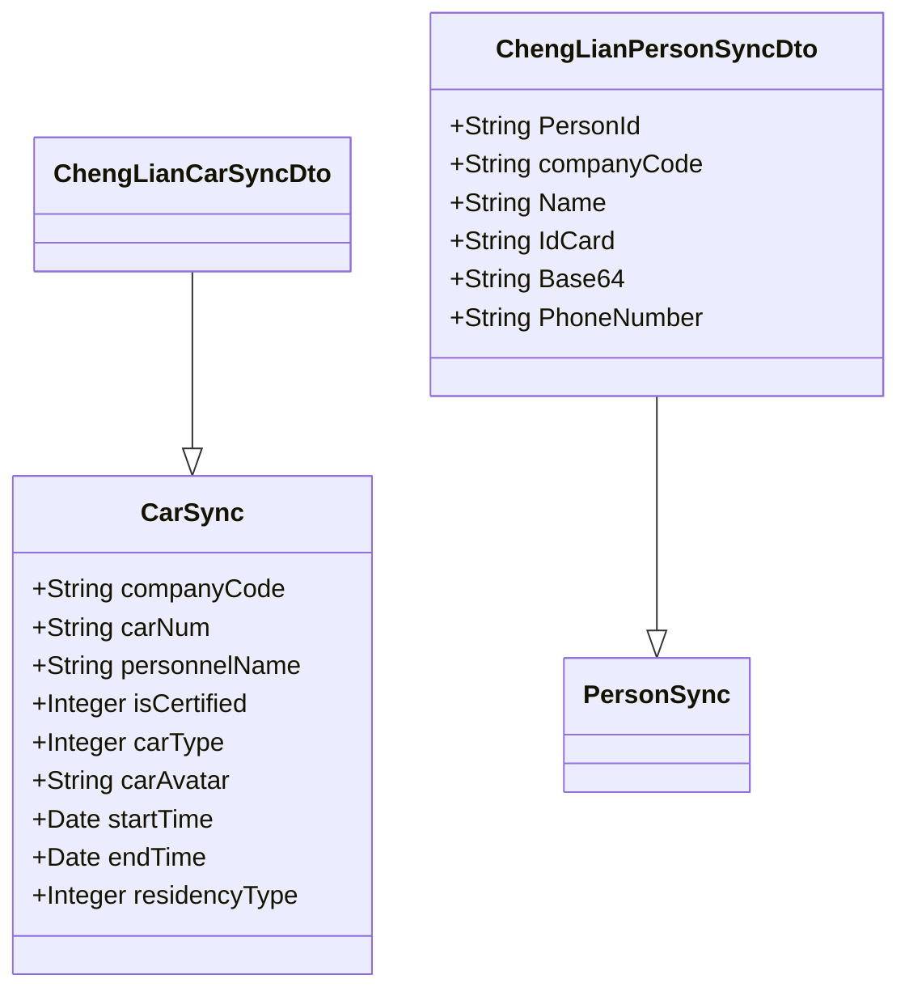

图表来源
- [CarSync.java:14-45](file://monkey-monitor/src/main/java/com/monkey/general/modules/third/entity/CarSync.java#L14-L45)
- [ChengLianCarSyncDto.java:9-12](file://monkey-monitor/src/main/java/com/monkey/general/modules/third/dto/ChengLianCarSyncDto.java#L9-L12)
- [PersonSync.java:11-16](file://monkey-monitor/src/main/java/com/monkey/general/modules/third/entity/PersonSync.java#L11-L16)
- [ChengLianPersonSyncDto.java:13-32](file://monkey-monitor/src/main/java/com/monkey/general/modules/third/dto/ChengLianPersonSyncDto.java#L13-L32)

章节来源
- [ChengLianCarSyncDto.java:9-12](file://monkey-monitor/src/main/java/com/monkey/general/modules/third/dto/ChengLianCarSyncDto.java#L9-L12)
- [ChengLianPersonSyncDto.java:13-32](file://monkey-monitor/src/main/java/com/monkey/general/modules/third/dto/ChengLianPersonSyncDto.java#L13-L32)
- [CarSync.java:14-45](file://monkey-monitor/src/main/java/com/monkey/general/modules/third/entity/CarSync.java#L14-L45)
- [PersonSync.java:11-16](file://monkey-monitor/src/main/java/com/monkey/general/modules/third/entity/PersonSync.java#L11-L16)

### 接收第三方推送（ZKTeco入场/出场）
- 控制器职责：校验DataType，区分入场/出场，封装CarInOutInfo并调用ZKTecoParkingService保存。
- 异常处理：参数校验失败与未知异常均返回友好提示。

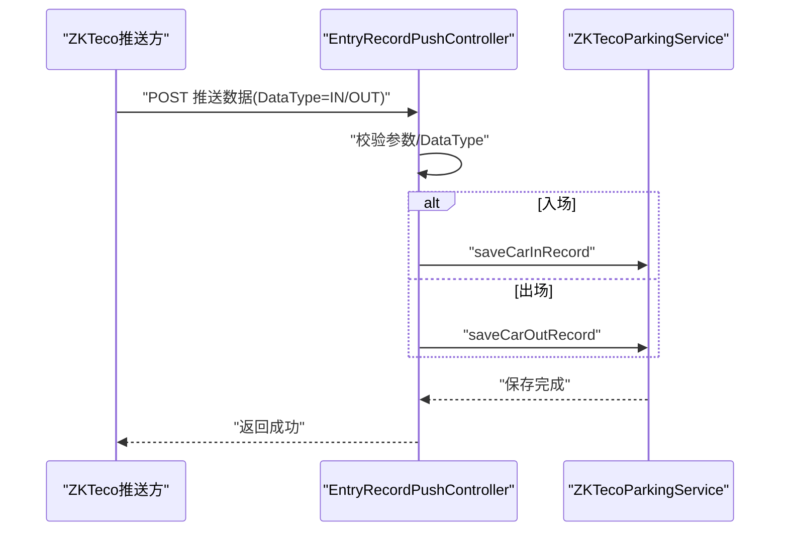

图表来源
- [EntryRecordPushController.java:35-106](file://monkey-monitor-api/src/main/java/com/monkey/general/controller/EntryRecordPushController.java#L35-L106)
- [ZKTecoParkingService.java:189-250](file://monkey-monitor/src/main/java/com/monkey/general/modules/third/service/ZKTecoParkingService.java#L189-L250)

章节来源
- [EntryRecordPushController.java:35-106](file://monkey-monitor-api/src/main/java/com/monkey/general/controller/EntryRecordPushController.java#L35-L106)
- [ManufacturersEnum.java:8-50](file://monkey-monitor-api/src/main/java/com/monkey/general/enums/ManufacturersEnum.java#L8-L50)

## 依赖分析
- 组件耦合
  - 各厂商服务均实现PersonAndCarStrategy接口，通过ManufacturersEnum按厂商选择具体实现，降低耦合度。
  - ApiDataUtil/DataRequest为第三方HTTP调用提供统一签名与请求封装。
  - PushingGZDataService独立于其他服务，专门处理广州平台的数据格式转换。
- 外部依赖
  - HTTP客户端：cn.hutool.http.HttpUtil
  - JSON解析：com.alibaba.fastjson
  - MQ客户端：Eclipse Paho（MQTT）
  - 设备协议：海康ISAPI（Digest认证、XML/JSON响应）
  - 广州平台API：严格要求15位仓库编码格式

**更新** 新增广州平台服务层的依赖关系，确保编码格式转换的独立性

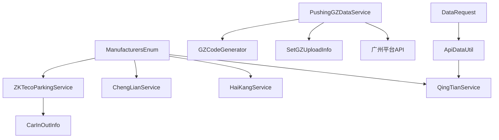

图表来源
- [ManufacturersEnum.java:8-50](file://monkey-monitor-api/src/main/java/com/monkey/general/enums/ManufacturersEnum.java#L8-L50)
- [ApiDataUtil.java:17-70](file://monkey-monitor/src/main/java/com/monkey/general/modules/third/api/util/ApiDataUtil.java#L17-L70)
- [DataRequest.java:8-35](file://monkey-monitor/src/main/java/com/monkey/general/modules/third/api/request/DataRequest.java#L8-L35)
- [CarInOutInfo.java:55-107](file://monkey-monitor/src/main/java/com/monkey/general/modules/em/entity/CarInOutInfo.java#L55-L107)
- [PushingGZDataService.java:314-338](file://monkey-monitor/src/main/java/com/monkey/general/platform/push/gz/PushingGZDataService.java#L314-L338)

章节来源
- [ManufacturersEnum.java:8-50](file://monkey-monitor-api/src/main/java/com/monkey/general/enums/ManufacturersEnum.java#L8-L50)

## 性能考虑
- 批量处理：对人员/车辆同步采用批量循环，减少重复初始化与网络往返。
- 响应解析：对海康设备返回同时兼容JSON/XML，避免因格式差异导致的阻塞。
- 资源限制：HTTP客户端设置连接/读取超时，防止长时间阻塞。
- 图片处理：对人员/车辆出入图片进行缩放与OSS上传，避免内存峰值过高。
- 状态更新：仅在明确成功时更新数据库状态，避免频繁回滚与冲突。
- 编码转换优化：广州平台服务层采用映射缓存，避免重复计算相同编码。

**更新** 新增广州平台编码转换的性能优化考虑

## 故障排查指南
- 网络异常
  - 现象：POST请求抛出异常、响应为空。
  - 处理：检查目标主机与端口、网络连通性；查看超时配置；重试与熔断。
- 认证失败
  - 现象：海康Digest认证返回错误或空响应。
  - 处理：确认设备IP、用户名/密码；检查时间格式与时区；打印请求/响应头定位问题。
- 数据格式错误
  - 现象：第三方返回码非预期、JSON/XML解析失败。
  - 处理：严格遵循签名规则与字段映射；对空值与特殊字符进行过滤；记录原始响应便于排障。
- 业务状态不一致
  - 现象：设备侧成功但数据库未更新。
  - 处理：仅在明确成功时更新状态；失败不改状态，避免脏写；必要时人工核对。
- 广州平台编码错误
  - 现象：平台返回编码格式错误，place_no字段不符合要求。
  - 处理：检查PushingGZDataService中的编码转换逻辑；确保使用15位仓库编码而非18位库房编码；验证GZCodeGenerator的编码生成规则。

**更新** 新增广州平台编码错误的故障排查指南

章节来源
- [HaiKangService.java:444-549](file://monkey-monitor/src/main/java/com/monkey/general/modules/third/service/HaiKangService.java#L444-L549)
- [ApiDataUtil.java:35-52](file://monkey-monitor/src/main/java/com/monkey/general/modules/third/api/util/ApiDataUtil.java#L35-L52)
- [PushingGZDataService.java:587-630](file://monkey-monitor/src/main/java/com/monkey/general/platform/push/gz/PushingGZDataService.java#L587-L630)

## 结论
本项目通过统一的服务策略与工具类，实现了对多家第三方系统的标准化对接。ZKTeco、海康、城联、擎天的差异被抽象为统一接口，配合严格的参数校验、签名机制与错误处理，保障了集成的稳定性与可维护性。特别针对广州平台的要求，新增了专门的数据格式转换服务，确保15位仓库编码的严格使用，避免了18位库房编码的降级机制。建议在生产环境中结合监控与告警体系，持续优化超时与重试策略，提升整体吞吐与可靠性。

**更新** 新增广州平台编码规范的重要性说明

## 附录
- 接口调用示例（路径参考）
  - ZKTeco车辆新增：[ZKTecoParkingService.java:61-84](file://monkey-monitor/src/main/java/com/monkey/general/modules/third/service/ZKTecoParkingService.java#L61-L84)
  - ZKTeco车辆删除：[ZKTecoParkingService.java:94-124](file://monkey-monitor/src/main/java/com/monkey/general/modules/third/service/ZKTecoParkingService.java#L94-L124)
  - 城联人员同步：[ChengLianService.java:67-88](file://monkey-monitor/src/main/java/com/monkey/general/modules/third/service/ChengLianService.java#L67-L88)
  - 海康人员同步（逐设备）：[HaiKangService.java:134-171](file://monkey-monitor/src/main/java/com/monkey/general/modules/third/service/HaiKangService.java#L134-L171)
  - 擎天MQTT下发人员同步：[QingTianService.java:123-159](file://monkey-monitor/src/main/java/com/monkey/general/modules/third/service/QingTianService.java#L123-L159)
  - 擎天HTTP签名与请求：[ApiDataUtil.java:24-52](file://monkey-monitor/src/main/java/com/monkey/general/modules/third/api/util/ApiDataUtil.java#L24-L52)
  - 广州平台数据格式转换：[PushingGZDataService.java:314-338](file://monkey-monitor/src/main/java/com/monkey/general/platform/push/gz/PushingGZDataService.java#L314-L338)
- 错误码说明（示例）
  - ZKTeco：status < 0 表示失败；返回空或解析失败记录日志。
  - 城联：code != 1 表示失败。
  - 海康：statusCode == 1 或特定subStatusCode视为成功；否则失败。
  - 擎天：retCode != 0 表示失败。
  - 广州平台：place_no字段必须为15位仓库编码，18位库房编码将被拒绝。
- 编码规范说明
  - 仓库编码：15位（企业编码12位 + 仓库流水号3位）
  - 库房编码：18位（15位仓库编码 + 库房流水号3位）
  - 设备编码：18位（企业编码12位 + 设备类型2位 + 设备流水号4位）
  - place_no字段：严格使用15位仓库编码，不再支持18位库房编码降级

**更新** 新增广州平台编码规范和place_no字段生成规则