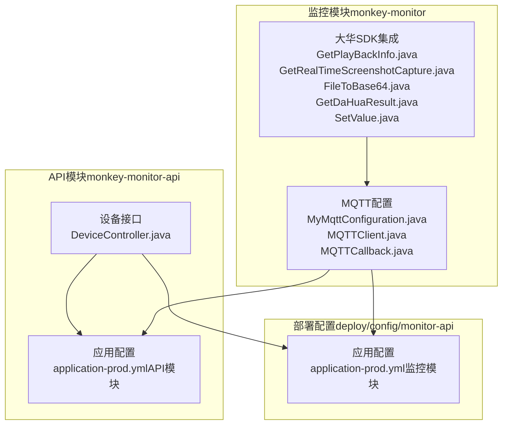
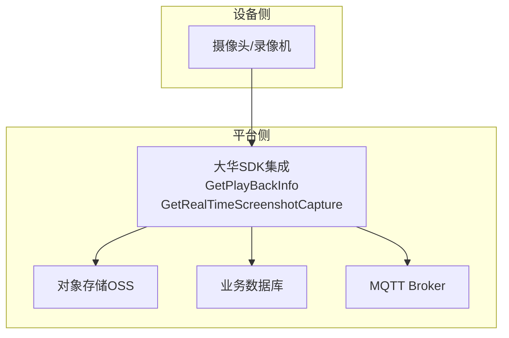
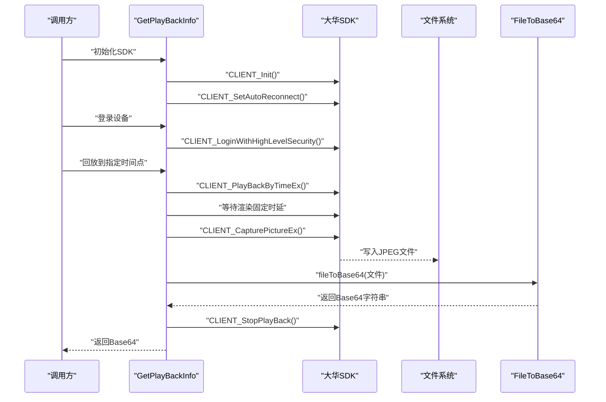
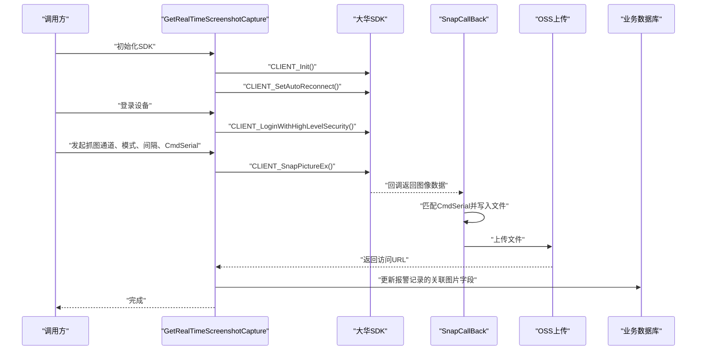
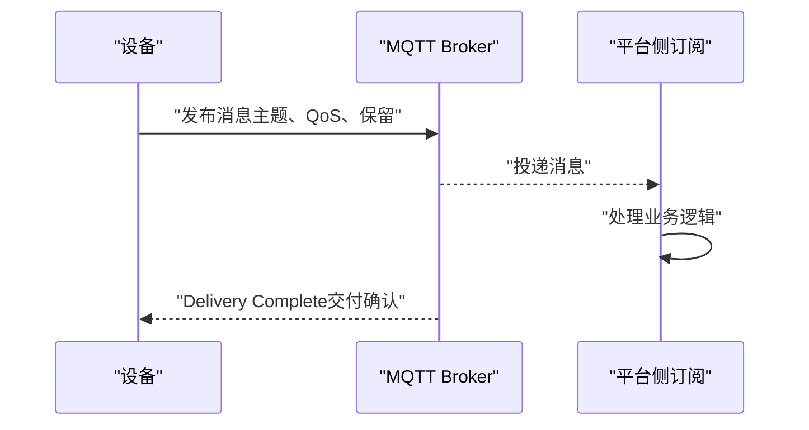
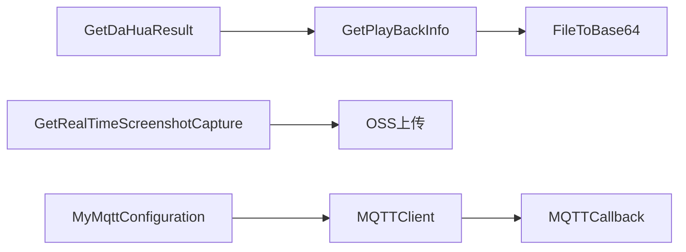

# 视频监控设备

<cite>
**本文引用的文件**
- [GetPlayBackInfo.java](file://monkey-monitor/src/main/java/com/monkey/general/dahua/GetPlayBackInfo.java)
- [GetRealTimeScreenshotCapture.java](file://monkey-monitor/src/main/java/com/monkey/general/dahua/GetRealTimeScreenshotCapture.java)
- [FileToBase64.java](file://monkey-monitor/src/main/java/com/monkey/general/dahua/FileToBase64.java)
- [GetDaHuaResult.java](file://monkey-monitor/src/main/java/com/monkey/general/dahua/GetDaHuaResult.java)
- [SetValue.java](file://monkey-monitor/src/main/java/com/monkey/general/dahua/entity/SetValue.java)
- [MQTTClient.java](file://monkey-monitor/src/main/java/com/monkey/general/config/mqtt/MQTTClient.java)
- [MyMqttConfiguration.java](file://monkey-monitor/src/main/java/com/monkey/general/config/mqtt/MyMqttConfiguration.java)
- [MQTTCallback.java](file://monkey-monitor/src/main/java/com/monkey/general/config/mqtt/MQTTCallback.java)
- [application-prod.yml（监控模块）](file://deploy/config/monitor-api/application-prod.yml)
- [application-prod.yml（API模块）](file://monkey-monitor-api/src/main/resources/application-prod.yml)
- [DeviceController.java](file://monkey-monitor-api/src/main/java/com/monkey/general/controller/DeviceController.java)
</cite>

## 目录
1. [简介](#简介)
2. [项目结构](#项目结构)
3. [核心组件](#核心组件)
4. [架构总览](#架构总览)
5. [详细组件分析](#详细组件分析)
6. [依赖关系分析](#依赖关系分析)
7. [性能考虑](#性能考虑)
8. [故障排查指南](#故障排查指南)
9. [结论](#结论)
10. [附录](#附录)

## 简介
本文件面向视频监控设备集成场景，聚焦大华设备的SDK集成方案，系统性阐述以下能力与流程：
- 录像回放抓图：基于GetPlayBackInfo类实现按时间点回放到帧并截图，随后进行Base64编码以便传输或存储。
- 实时截图：基于GetRealTimeScreenshotCapture类实现设备实时抓图，回调接收图像数据并上传OSS，最终回写业务表。
- 文件到Base64：FileToBase64类提供稳定的文件转Base64工具，保障图像数据的统一传输格式。
- 设备注册与连接：涵盖SDK初始化、登录/登出、断线重连回调、播放句柄管理等。
- 视频流获取与数据处理：从回放或实时抓图两条路径获取图像数据，结合文件落盘与OSS上传，形成闭环。
- MQTT协议应用：讲解MQTT在视频监控中的角色（设备侧上报、平台侧订阅与发布），并给出传输格式与质量控制建议。
- 设备配置参数：提供分辨率、帧率、码率等参数的说明与实践建议。
- 常见问题排查：针对连接超时、视频卡顿、截图失败等场景提供解决方案。
- 性能优化：围绕网络带宽、缓存策略、并发处理等方面提出优化建议。

## 项目结构
本项目采用多模块组织，监控模块负责大华SDK集成与MQTT配置，API模块提供设备侧接口与配置文件，二者通过配置文件协同工作。

**图表来源**
- [GetPlayBackInfo.java](file://monkey-monitor/src/main/java/com/monkey/general/dahua/GetPlayBackInfo.java)
- [GetRealTimeScreenshotCapture.java](file://monkey-monitor/src/main/java/com/monkey/general/dahua/GetRealTimeScreenshotCapture.java)
- [FileToBase64.java](file://monkey-monitor/src/main/java/com/monkey/general/dahua/FileToBase64.java)
- [GetDaHuaResult.java](file://monkey-monitor/src/main/java/com/monkey/general/dahua/GetDaHuaResult.java)
- [SetValue.java](file://monkey-monitor/src/main/java/com/monkey/general/dahua/entity/SetValue.java)
- [MQTTClient.java](file://monkey-monitor/src/main/java/com/monkey/general/config/mqtt/MQTTClient.java)
- [MyMqttConfiguration.java](file://monkey-monitor/src/main/java/com/monkey/general/config/mqtt/MyMqttConfiguration.java)
- [MQTTCallback.java](file://monkey-monitor/src/main/java/com/monkey/general/config/mqtt/MQTTCallback.java)
- [application-prod.yml（监控模块）](file://deploy/config/monitor-api/application-prod.yml)
- [application-prod.yml（API模块）](file://monkey-monitor-api/src/main/resources/application-prod.yml)
- [DeviceController.java](file://monkey-monitor-api/src/main/java/com/monkey/general/controller/DeviceController.java)

**章节来源**
- [application-prod.yml（监控模块）](file://deploy/config/monitor-api/application-prod.yml)
- [application-prod.yml（API模块）](file://monkey-monitor-api/src/main/resources/application-prod.yml)
- [DeviceController.java](file://monkey-monitor-api/src/main/java/com/monkey/general/controller/DeviceController.java)

## 核心组件
- GetPlayBackInfo：实现大华SDK的回放启动、播放句柄管理、本地截图、文件校验与Base64转换。
- GetRealTimeScreenshotCapture：实现设备实时抓图，注册回调、匹配CmdSerial、落盘与OSS上传，最后回写业务表。
- FileToBase64：提供文件到Base64的通用转换工具，支持空文件校验与资源释放。
- GetDaHuaResult：定时任务入口，批量异步抓取超员报警相关的回放截图并回写数据库。
- SetValue：大华设备配置实体，承载IP、端口、账号、通道等参数。
- MQTT相关：MyMqttConfiguration、MQTTClient、MQTTCallback，负责MQTT连接、订阅、发布与断线重连。

**章节来源**
- [GetPlayBackInfo.java](file://monkey-monitor/src/main/java/com/monkey/general/dahua/GetPlayBackInfo.java)
- [GetRealTimeScreenshotCapture.java](file://monkey-monitor/src/main/java/com/monkey/general/dahua/GetRealTimeScreenshotCapture.java)
- [FileToBase64.java](file://monkey-monitor/src/main/java/com/monkey/general/dahua/FileToBase64.java)
- [GetDaHuaResult.java](file://monkey-monitor/src/main/java/com/monkey/general/dahua/GetDaHuaResult.java)
- [SetValue.java](file://monkey-monitor/src/main/java/com/monkey/general/dahua/entity/SetValue.java)
- [MQTTClient.java](file://monkey-monitor/src/main/java/com/monkey/general/config/mqtt/MQTTClient.java)
- [MyMqttConfiguration.java](file://monkey-monitor/src/main/java/com/monkey/general/config/mqtt/MyMqttConfiguration.java)
- [MQTTCallback.java](file://monkey-monitor/src/main/java/com/monkey/general/config/mqtt/MQTTCallback.java)

## 架构总览
下图展示从设备接入到视频数据处理的整体架构，包括大华SDK抓图链路与MQTT数据链路。

**图表来源**
- [GetPlayBackInfo.java](file://monkey-monitor/src/main/java/com/monkey/general/dahua/GetPlayBackInfo.java)
- [GetRealTimeScreenshotCapture.java](file://monkey-monitor/src/main/java/com/monkey/general/dahua/GetRealTimeScreenshotCapture.java)
- [MQTTClient.java](file://monkey-monitor/src/main/java/com/monkey/general/config/mqtt/MQTTClient.java)

## 详细组件分析

### GetPlayBackInfo（回放抓图）
- 功能要点
  - SDK初始化与断线重连回调注册
  - 登录设备、播放句柄管理、停止回放
  - 回放到指定时间点，等待渲染，本地截图，校验文件有效性，转换为Base64
- 关键流程（回放到截图）

**图表来源**
- [GetPlayBackInfo.java](file://monkey-monitor/src/main/java/com/monkey/general/dahua/GetPlayBackInfo.java)
- [FileToBase64.java](file://monkey-monitor/src/main/java/com/monkey/general/dahua/FileToBase64.java)

**章节来源**
- [GetPlayBackInfo.java](file://monkey-monitor/src/main/java/com/monkey/general/dahua/GetPlayBackInfo.java)

### GetRealTimeScreenshotCapture（实时截图）
- 功能要点
  - SDK初始化与断线重连回调注册
  - 登录设备，注册抓图回调，生成唯一CmdSerial，下发抓图命令
  - 回调收到数据后落盘，上传OSS，回写业务表字段
- 关键流程（实时抓图）

**图表来源**
- [GetRealTimeScreenshotCapture.java](file://monkey-monitor/src/main/java/com/monkey/general/dahua/GetRealTimeScreenshotCapture.java)

**章节来源**
- [GetRealTimeScreenshotCapture.java](file://monkey-monitor/src/main/java/com/monkey/general/dahua/GetRealTimeScreenshotCapture.java)

### FileToBase64（文件到Base64）
- 功能要点
  - 输入校验（文件存在性、非空）
  - 读取字节并进行Base64编码
  - 资源释放与异常处理
- 适用场景
  - 回放抓图后直接输出Base64
  - 实时抓图后可选路径：落盘后再转Base64（当前实现优先OSS）

**章节来源**
- [FileToBase64.java](file://monkey-monitor/src/main/java/com/monkey/general/dahua/FileToBase64.java)

### GetDaHuaResult（定时任务抓图）
- 功能要点
  - 查询当日未关联图片的超员报警记录
  - 异步并发抓取，批量等待完成
  - 异常时销毁资源，避免后续任务受阻
- 并发模型
  - 使用CompletableFuture收集Future并统一等待，避免阻塞主线程

**章节来源**
- [GetDaHuaResult.java](file://monkey-monitor/src/main/java/com/monkey/general/dahua/GetDaHuaResult.java)

### 设备配置（SetValue）与配置文件
- SetValue实体
  - 字段：开关、IP、端口、用户名、密码、通道ID
- 配置文件
  - 监控模块与API模块均包含dahuaconfig配置段，用于控制是否启用SDK抓图、设备参数等

**章节来源**
- [SetValue.java](file://monkey-monitor/src/main/java/com/monkey/general/dahua/entity/SetValue.java)
- [application-prod.yml（监控模块）](file://deploy/config/monitor-api/application-prod.yml)
- [application-prod.yml（API模块）](file://monkey-monitor-api/src/main/resources/application-prod.yml)

### MQTT在视频监控中的应用
- 角色与职责
  - 设备侧上报：设备通过MQTT向Broker发布状态与事件（如报警、传感器数据）
  - 平台侧订阅：平台订阅相关主题，接收并处理数据
  - 发布与质量控制：通过QoS、保留消息、自动重连等机制保障可靠性
- 配置要点
  - 连接参数：主机、端口、用户名、密码、clientId、超时、保活
  - 主题：RYTopic、GWTopic2等，分别对应自研人员定位与企业传感器数据
- 回调与重连
  - 连接丢失时自动重连，重连成功后重新订阅主题
  - 发布完成后回调校验交付状态

**图表来源**
- [MQTTClient.java](file://monkey-monitor/src/main/java/com/monkey/general/config/mqtt/MQTTClient.java)
- [MQTTCallback.java](file://monkey-monitor/src/main/java/com/monkey/general/config/mqtt/MQTTCallback.java)
- [MyMqttConfiguration.java](file://monkey-monitor/src/main/java/com/monkey/general/config/mqtt/MyMqttConfiguration.java)

**章节来源**
- [MQTTClient.java](file://monkey-monitor/src/main/java/com/monkey/general/config/mqtt/MQTTClient.java)
- [MQTTCallback.java](file://monkey-monitor/src/main/java/com/monkey/general/config/mqtt/MQTTCallback.java)
- [MyMqttConfiguration.java](file://monkey-monitor/src/main/java/com/monkey/general/config/mqtt/MyMqttConfiguration.java)
- [application-prod.yml（监控模块）](file://deploy/config/monitor-api/application-prod.yml)
- [application-prod.yml（API模块）](file://monkey-monitor-api/src/main/resources/application-prod.yml)

## 依赖关系分析
- 组件耦合
  - GetPlayBackInfo与FileToBase64：前者负责生成JPEG文件，后者负责Base64转换
  - GetRealTimeScreenshotCapture与OSS：抓图后直接上传OSS，减少本地磁盘压力
  - GetDaHuaResult与GetPlayBackInfo：通过异步Future并发抓图，提升吞吐
- 外部依赖
  - 大华SDK：登录、回放、抓图、断线重连等
  - MQTT客户端：连接、订阅、发布、回调
  - 配置文件：dahuaconfig、mqtt.*、topic配置

**图表来源**
- [GetPlayBackInfo.java](file://monkey-monitor/src/main/java/com/monkey/general/dahua/GetPlayBackInfo.java)
- [FileToBase64.java](file://monkey-monitor/src/main/java/com/monkey/general/dahua/FileToBase64.java)
- [GetRealTimeScreenshotCapture.java](file://monkey-monitor/src/main/java/com/monkey/general/dahua/GetRealTimeScreenshotCapture.java)
- [GetDaHuaResult.java](file://monkey-monitor/src/main/java/com/monkey/general/dahua/GetDaHuaResult.java)
- [MQTTClient.java](file://monkey-monitor/src/main/java/com/monkey/general/config/mqtt/MQTTClient.java)
- [MQTTCallback.java](file://monkey-monitor/src/main/java/com/monkey/general/config/mqtt/MQTTCallback.java)
- [MyMqttConfiguration.java](file://monkey-monitor/src/main/java/com/monkey/general/config/mqtt/MyMqttConfiguration.java)

## 性能考虑
- 网络带宽管理
  - 控制回放时间窗口与等待渲染时延，避免长时间占用带宽
  - 实时抓图采用一次性抓取，避免频繁轮询
- 缓存策略
  - 回放抓图：优先OSS直传，减少本地磁盘IO与临时文件
  - 定时任务：使用异步并发，降低整体耗时
- 并发处理优化
  - 使用CompletableFuture聚合任务，统一等待，避免主线程阻塞
  - 抓图回调中仅保存一次，避免重复写入
- 资源管理
  - 登出与SDK清理在异常与正常路径均需保证执行
  - 文件流读取后及时关闭，防止句柄泄漏

## 故障排查指南
- 连接超时
  - 检查设备IP、端口、账号、密码是否正确
  - 确认防火墙与网络策略允许SDK端口通信
  - 查看断线重连回调是否触发，确认CLIENT_SetAutoReconnect配置
- 视频卡顿
  - 回放等待渲染时延不足，适当延长等待时间
  - 降低同时并发的回放任务数量
- 截图失败
  - 检查本地保存路径是否存在且具备写权限
  - 确认回调中的CmdSerial匹配，避免跨请求污染
  - 若OSS上传失败，检查凭证与桶权限
- MQTT异常
  - 连接丢失时检查自动重连与重新订阅逻辑
  - 发布超时或交付失败时，检查Broker状态与QoS配置

## 结论
本方案通过大华SDK实现了可靠的回放抓图与实时抓图能力，并结合MQTT完成设备侧数据上报与平台侧订阅处理。通过合理的资源配置、并发优化与异常处理，可在保证稳定性的同时提升吞吐与响应速度。建议在生产环境中进一步完善日志采集、指标监控与告警机制，持续优化网络与存储策略。

## 附录

### 设备配置参数说明（分辨率、帧率、码率）
- 分辨率与帧率
  - 由设备端能力决定，可通过设备Web界面或SDK能力查询接口获取
  - 抓图时建议以设备默认分辨率与帧率为主，避免额外转码带来的性能损耗
- 码率
  - 录像回放抓图使用JPEG格式，不涉及码率参数
  - 实时抓图可通过抓图质量参数调节（如质量等级），平衡清晰度与体积
- 通道ID
  - 通道号需与设备实际配置一致，确保抓图命中正确通道

### MQTT传输格式与质量控制
- 传输格式
  - 设备侧通常以JSON或二进制形式上报，平台侧按主题解析
- 质量控制
  - QoS：建议报警类消息使用至少QoS1，确保可靠送达
  - 保留消息：对关键状态可启用保留消息，便于新订阅者快速获取最新状态
  - 自动重连：启用自动重连并实现重连成功后的主题恢复