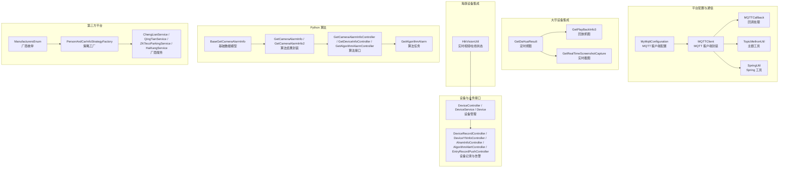
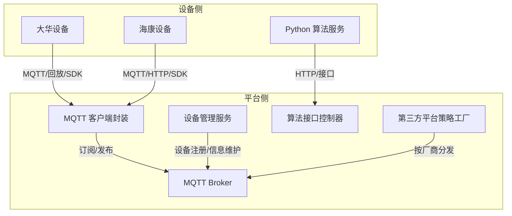
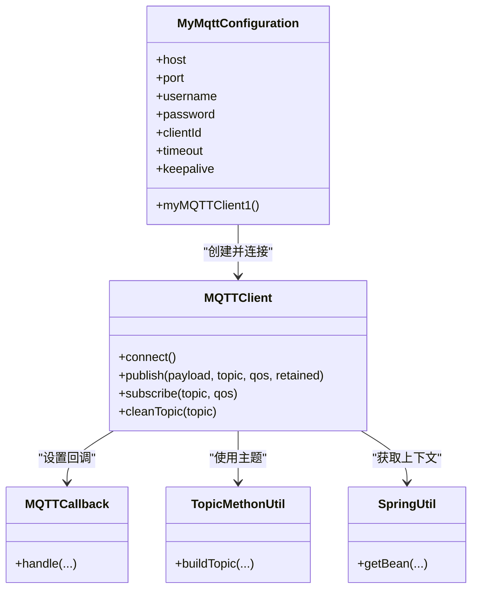
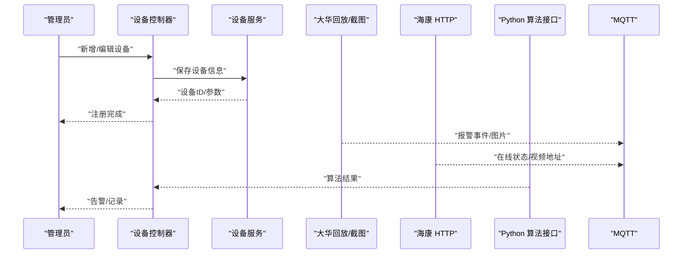
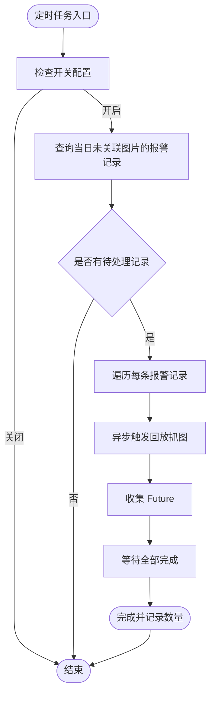
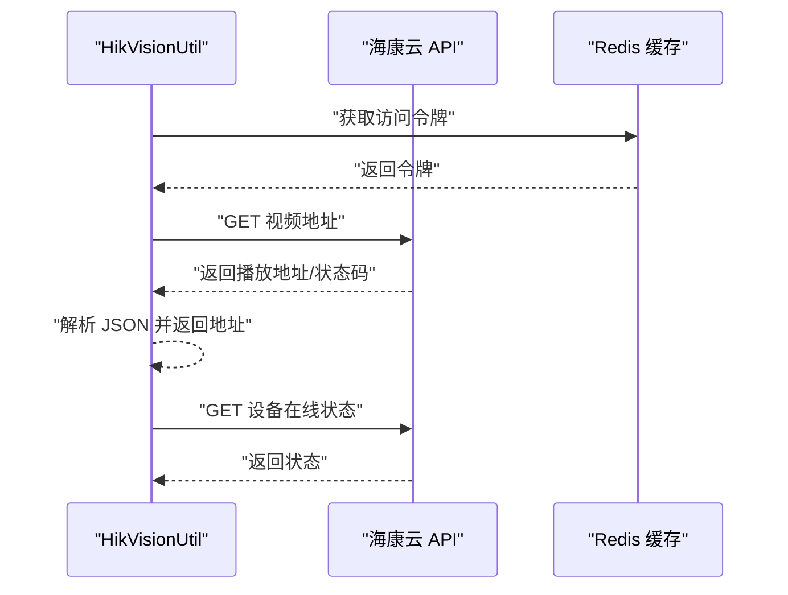
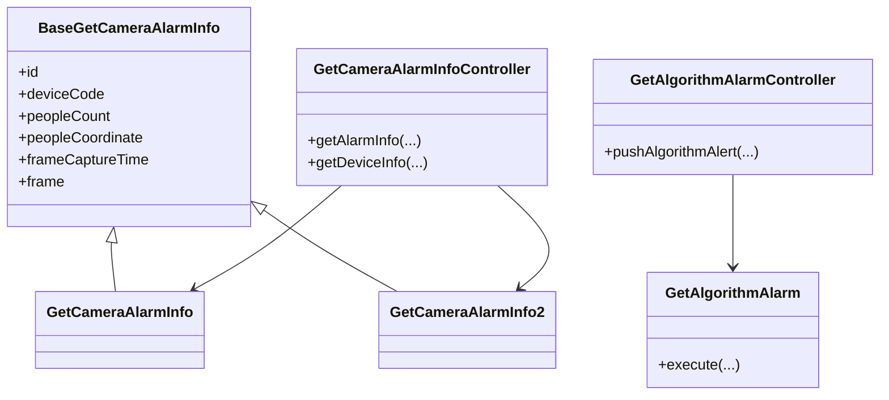
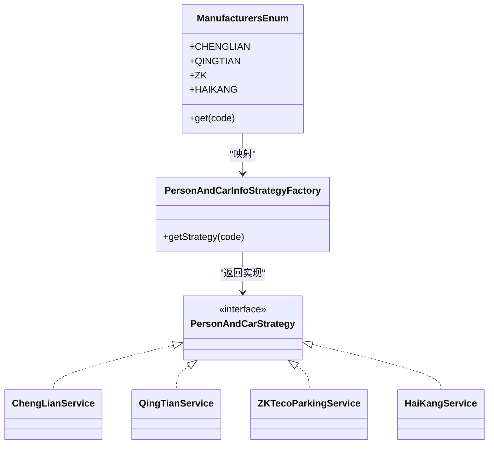
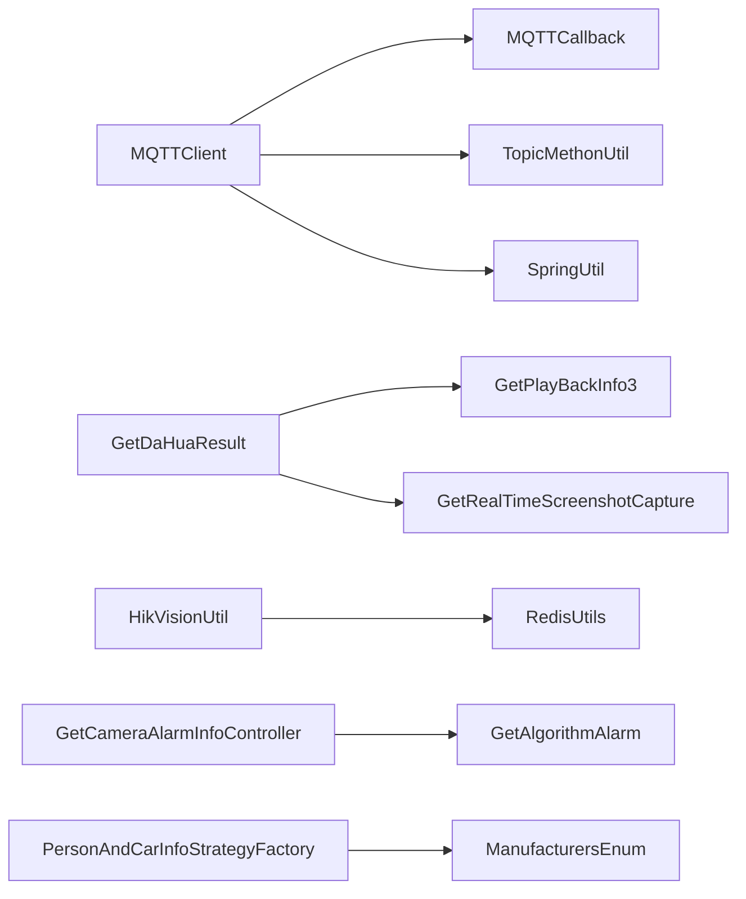

# 设备集成

<cite>
**本文引用的文件**
- [GetDaHuaResult.java](file://monkey-monitor/src/main/java/com/monkey/general/dahua/GetDaHuaResult.java)
- [MQTTClient.java](file://monkey-monitor/src/main/java/com/monkey/general/config/mqtt/MQTTClient.java)
- [MyMqttConfiguration.java](file://monkey-monitor/src/main/java/com/monkey/general/config/mqtt/MyMqttConfiguration.java)
- [BaseGetCameraAlarmInfo.java](file://monkey-monitor/src/main/java/com/monkey/general/modules/python/BaseGetCameraAlarmInfo.java)
- [HikVisionUtil.java](file://monkey-monitor/src/main/java/com/monkey/general/util/hik/HikVisionUtil.java)
- [ManufacturersEnum.java](file://monkey-monitor-api/src/main/java/com/monkey/general/enums/ManufacturersEnum.java)
- [DeviceController.java](file://monkey-monitor-api/src/main/java/com/monkey/general/controller/DeviceController.java)
- [DeviceService.java](file://monkey-service/src/main/java/com/monkey/general/modules/em/service/DeviceService.java)
- [Device.java](file://monkey-service/src/main/java/com/monkey/general/modules/em/entity/Device.java)
- [GetPlayBackInfo3.java](file://monkey-monitor/src/main/java/com/monkey/general/dahua/GetPlayBackInfo3.java)
- [GetRealTimeScreenshotCapture.java](file://monkey-monitor/src/main/java/com/monkey/general/dahua/GetRealTimeScreenshotCapture.java)
- [TopicMethonUtil.java](file://monkey-monitor/src/main/java/com/monkey/general/config/mqtt/TopicMethonUtil.java)
- [MQTTCallback.java](file://monkey-monitor/src/main/java/com/monkey/general/config/mqtt/MQTTCallback.java)
- [SpringUtil.java](file://monkey-monitor/src/main/java/com/monkey/general/config/mqtt/SpringUtil.java)
- [GetCameraAlarmInfoController.java](file://monkey-monitor-api/src/main/java/com/monkey/general/python/GetCameraAlarmInfoController.java)
- [GetDeviceInfoController.java](file://monkey-monitor-api/src/main/java/com/monkey/general/python/GetDeviceInfoController.java)
- [GetAlgorithmAlarmController.java](file://monkey-monitor-api/src/main/java/com/monkey/general/python/GetAlgorithmAlarmController.java)
- [GetAlgorithmAlarm.java](file://monkey-monitor-api/src/main/java/com/monkey/general/python/GetAlgorithmAlarm.java)
- [GetCameraAlarmInfo.java](file://monkey-monitor/src/main/java/com/monkey/general/modules/python/GetCameraAlarmInfo.java)
- [GetCameraAlarmInfo2.java](file://monkey-monitor/src/main/java/com/monkey/general/modules/python/GetCameraAlarmInfo2.java)
- [PersonAndCarInfoStrategyFactory.java](file://monkey-monitor-api/src/main/java/com/monkey/general/factory/PersonAndCarInfoStrategyFactory.java)
- [PersonAndCarStrategy.java](file://monkey-monitor-api/src/main/java/com/monkey/general/factory/PersonAndCarStrategy.java)
- [ChengLianService.java](file://monkey-monitor-api/src/main/java/com/monkey/general/modules/third/service/ChengLianService.java)
- [QingTianService.java](file://monkey-monitor-api/src/main/java/com/monkey/general/modules/third/service/QingTianService.java)
- [ZKTecoParkingService.java](file://monkey-monitor-api/src/main/java/com/monkey/general/modules/third/service/ZKTecoParkingService.java)
- [HaiKangService.java](file://monkey-monitor-api/src/main/java/com/monkey/general/modules/third/service/HaiKangService.java)
- [DeviceRecordController.java](file://monkey-monitor-api/src/main/java/com/monkey/general/controller/DeviceRecordController.java)
- [DeviceYhInfoController.java](file://monkey-monitor-api/src/main/java/com/monkey/general/controller/DeviceYhInfoController.java)
- [AlramInfoController.java](file://monkey-monitor-api/src/main/java/com/monkey/general/controller/AlramInfoController.java)
- [AlgorithmAlertController.java](file://monkey-monitor-api/src/main/java/com/monkey/general/controller/AlgorithmAlertController.java)
- [EntryRecordPushController.java](file://monkey-monitor-api/src/main/java/com/monkey/general/controller/EntryRecordPushController.java)
- [application.yml](file://monkey-monitor-api/src/main/resources/application.yml)
- [application-prod.yml](file://deploy/config/monitor-api/application-prod.yml)
</cite>

## 目录
1. [简介](#简介)
2. [项目结构](#项目结构)
3. [核心组件](#核心组件)
4. [架构总览](#架构总览)
5. [详细组件分析](#详细组件分析)
6. [依赖分析](#依赖分析)
7. [性能考虑](#性能考虑)
8. [故障排查指南](#故障排查指南)
9. [结论](#结论)
10. [附录](#附录)

## 简介
本文件面向安威 fireworks 物联网监控平台的“设备集成”能力，系统性梳理平台对主流视频监控设备（大华、海康等）的接入与管理，以及与第三方平台（如停车场、门禁）的对接方式；同时覆盖 MQTT 协议在设备通信中的应用、设备 SDK 集成要点（以大华为例）、Python 算法与硬件设备的联动、设备接入流程、数据采集与回放、实时监控与截图、故障排查与性能优化建议。

## 项目结构
围绕设备集成的关键模块分布如下：
- 平台侧配置与通信
  - MQTT 客户端与配置：MyMqttConfiguration、MQTTClient、MQTTCallback、TopicMethonUtil、SpringUtil
- 大华设备集成
  - 报警抓图与回放：GetDaHuaResult、GetPlayBackInfo3、GetRealTimeScreenshotCapture
- 海康设备集成
  - 实时视频与在线状态：HikVisionUtil
- Python 算法与设备联动
  - 基础数据模型与控制器：BaseGetCameraAlarmInfo、GetCameraAlarmInfo、GetCameraAlarmInfo2、GetCameraAlarmInfoController、GetDeviceInfoController、GetAlgorithmAlarmController、GetAlgorithmAlarm
- 第三方平台对接
  - 厂商枚举与策略工厂：ManufacturersEnum、PersonAndCarInfoStrategyFactory、PersonAndCarStrategy、ChengLianService、QingTianService、ZKTecoParkingService、HaiKangService
- 设备与业务接口
  - 设备控制器与服务：DeviceController、DeviceService、Device
  - 设备记录与告警控制器：DeviceRecordController、DeviceYhInfoController、AlramInfoController、AlgorithmAlertController、EntryRecordPushController
- 配置文件
  - 应用配置：application.yml、application-prod.yml

**图表来源**
- [MyMqttConfiguration.java:1-58](file://monkey-monitor/src/main/java/com/monkey/general/config/mqtt/MyMqttConfiguration.java#L1-L58)
- [MQTTClient.java:1-139](file://monkey-monitor/src/main/java/com/monkey/general/config/mqtt/MQTTClient.java#L1-L139)
- [MQTTCallback.java](file://monkey-monitor/src/main/java/com/monkey/general/config/mqtt/MQTTCallback.java)
- [TopicMethonUtil.java](file://monkey-monitor/src/main/java/com/monkey/general/config/mqtt/TopicMethonUtil.java)
- [SpringUtil.java](file://monkey-monitor/src/main/java/com/monkey/general/config/mqtt/SpringUtil.java)
- [GetDaHuaResult.java:1-102](file://monkey-monitor/src/main/java/com/monkey/general/dahua/GetDaHuaResult.java#L1-L102)
- [GetPlayBackInfo3.java](file://monkey-monitor/src/main/java/com/monkey/general/dahua/GetPlayBackInfo3.java)
- [GetRealTimeScreenshotCapture.java](file://monkey-monitor/src/main/java/com/monkey/general/dahua/GetRealTimeScreenshotCapture.java)
- [HikVisionUtil.java:1-141](file://monkey-monitor/src/main/java/com/monkey/general/util/hik/HikVisionUtil.java#L1-L141)
- [BaseGetCameraAlarmInfo.java:1-14](file://monkey-monitor/src/main/java/com/monkey/general/modules/python/BaseGetCameraAlarmInfo.java#L1-L14)
- [GetCameraAlarmInfo.java](file://monkey-monitor/src/main/java/com/monkey/general/modules/python/GetCameraAlarmInfo.java)
- [GetCameraAlarmInfo2.java](file://monkey-monitor/src/main/java/com/monkey/general/modules/python/GetCameraAlarmInfo2.java)
- [GetCameraAlarmInfoController.java](file://monkey-monitor-api/src/main/java/com/monkey/general/python/GetCameraAlarmInfoController.java)
- [GetDeviceInfoController.java](file://monkey-monitor-api/src/main/java/com/monkey/general/python/GetDeviceInfoController.java)
- [GetAlgorithmAlarmController.java](file://monkey-monitor-api/src/main/java/com/monkey/general/python/GetAlgorithmAlarmController.java)
- [GetAlgorithmAlarm.java](file://monkey-monitor-api/src/main/java/com/monkey/general/python/GetAlgorithmAlarm.java)
- [ManufacturersEnum.java:1-51](file://monkey-monitor-api/src/main/java/com/monkey/general/enums/ManufacturersEnum.java#L1-L51)
- [PersonAndCarInfoStrategyFactory.java](file://monkey-monitor-api/src/main/java/com/monkey/general/factory/PersonAndCarInfoStrategyFactory.java)
- [PersonAndCarStrategy.java](file://monkey-monitor-api/src/main/java/com/monkey/general/factory/PersonAndCarStrategy.java)
- [ChengLianService.java](file://monkey-monitor-api/src/main/java/com/monkey/general/modules/third/service/ChengLianService.java)
- [QingTianService.java](file://monkey-monitor-api/src/main/java/com/monkey/general/modules/third/service/QingTianService.java)
- [ZKTecoParkingService.java](file://monkey-monitor-api/src/main/java/com/monkey/general/modules/third/service/ZKTecoParkingService.java)
- [HaiKangService.java](file://monkey-monitor-api/src/main/java/com/monkey/general/modules/third/service/HaiKangService.java)
- [DeviceController.java](file://monkey-monitor-api/src/main/java/com/monkey/general/controller/DeviceController.java)
- [DeviceService.java](file://monkey-service/src/main/java/com/monkey/general/modules/em/service/DeviceService.java)
- [Device.java](file://monkey-service/src/main/java/com/monkey/general/modules/em/entity/Device.java)
- [DeviceRecordController.java](file://monkey-monitor-api/src/main/java/com/monkey/general/controller/DeviceRecordController.java)
- [DeviceYhInfoController.java](file://monkey-monitor-api/src/main/java/com/monkey/general/controller/DeviceYhInfoController.java)
- [AlramInfoController.java](file://monkey-monitor-api/src/main/java/com/monkey/general/controller/AlramInfoController.java)
- [AlgorithmAlertController.java](file://monkey-monitor-api/src/main/java/com/monkey/general/controller/AlgorithmAlertController.java)
- [EntryRecordPushController.java](file://monkey-monitor-api/src/main/java/com/monkey/general/controller/EntryRecordPushController.java)
- [application.yml](file://monkey-monitor-api/src/main/resources/application.yml)
- [application-prod.yml](file://deploy/config/monitor-api/application-prod.yml)

**章节来源**
- [MyMqttConfiguration.java:1-58](file://monkey-monitor/src/main/java/com/monkey/general/config/mqtt/MyMqttConfiguration.java#L1-L58)
- [MQTTClient.java:1-139](file://monkey-monitor/src/main/java/com/monkey/general/config/mqtt/MQTTClient.java#L1-L139)
- [GetDaHuaResult.java:1-102](file://monkey-monitor/src/main/java/com/monkey/general/dahua/GetDaHuaResult.java#L1-L102)
- [HikVisionUtil.java:1-141](file://monkey-monitor/src/main/java/com/monkey/general/util/hik/HikVisionUtil.java#L1-L141)
- [ManufacturersEnum.java:1-51](file://monkey-monitor-api/src/main/java/com/monkey/general/enums/ManufacturersEnum.java#L1-L51)
- [DeviceController.java](file://monkey-monitor-api/src/main/java/com/monkey/general/controller/DeviceController.java)
- [DeviceService.java](file://monkey-service/src/main/java/com/monkey/general/modules/em/service/DeviceService.java)
- [Device.java](file://monkey-service/src/main/java/com/monkey/general/modules/em/entity/Device.java)

## 核心组件
- MQTT 通信栈
  - 客户端封装与自动重连、发布/订阅、QoS 与留存控制
  - 配置加载与客户端实例化
- 大华设备集成
  - 定时任务抓取超员报警图片、回放抓图、实时截图
- 海康设备集成
  - 获取实时视频播放地址、查询设备在线状态
- Python 算法联动
  - 基础数据模型与算法接口控制器，封装算法输出
- 第三方平台对接
  - 厂商枚举与策略工厂，按厂商分发处理逻辑
- 设备与业务接口
  - 设备注册、信息维护、记录与告警推送

**章节来源**
- [MQTTClient.java:1-139](file://monkey-monitor/src/main/java/com/monkey/general/config/mqtt/MQTTClient.java#L1-L139)
- [MyMqttConfiguration.java:1-58](file://monkey-monitor/src/main/java/com/monkey/general/config/mqtt/MyMqttConfiguration.java#L1-L58)
- [GetDaHuaResult.java:1-102](file://monkey-monitor/src/main/java/com/monkey/general/dahua/GetDaHuaResult.java#L1-L102)
- [HikVisionUtil.java:1-141](file://monkey-monitor/src/main/java/com/monkey/general/util/hik/HikVisionUtil.java#L1-L141)
- [BaseGetCameraAlarmInfo.java:1-14](file://monkey-monitor/src/main/java/com/monkey/general/modules/python/BaseGetCameraAlarmInfo.java#L1-L14)
- [ManufacturersEnum.java:1-51](file://monkey-monitor-api/src/main/java/com/monkey/general/enums/ManufacturersEnum.java#L1-L51)
- [DeviceController.java](file://monkey-monitor-api/src/main/java/com/monkey/general/controller/DeviceController.java)
- [DeviceService.java](file://monkey-service/src/main/java/com/monkey/general/modules/em/service/DeviceService.java)
- [Device.java](file://monkey-service/src/main/java/com/monkey/general/modules/em/entity/Device.java)

## 架构总览
平台采用“MQTT 作为统一通信底座 + 各厂商 SDK/HTTP 接口 + Python 算法服务”的架构模式：
- MQTT：负责传感器/设备上报、平台下发指令、主题路由与消息分发
- 厂商集成：大华（回放抓图/实时截图）、海康（实时视频/在线状态）
- Python 算法：接收设备图像或视频片段，输出检测结果并通过接口暴露
- 第三方平台：通过策略工厂按厂商分发对接逻辑（如停车场、门禁）

**图表来源**
- [MQTTClient.java:1-139](file://monkey-monitor/src/main/java/com/monkey/general/config/mqtt/MQTTClient.java#L1-L139)
- [MyMqttConfiguration.java:1-58](file://monkey-monitor/src/main/java/com/monkey/general/config/mqtt/MyMqttConfiguration.java#L1-L58)
- [GetDaHuaResult.java:1-102](file://monkey-monitor/src/main/java/com/monkey/general/dahua/GetDaHuaResult.java#L1-L102)
- [HikVisionUtil.java:1-141](file://monkey-monitor/src/main/java/com/monkey/general/util/hik/HikVisionUtil.java#L1-L141)
- [GetCameraAlarmInfoController.java](file://monkey-monitor-api/src/main/java/com/monkey/general/python/GetCameraAlarmInfoController.java)
- [PersonAndCarInfoStrategyFactory.java](file://monkey-monitor-api/src/main/java/com/monkey/general/factory/PersonAndCarInfoStrategyFactory.java)
- [ManufacturersEnum.java:1-51](file://monkey-monitor-api/src/main/java/com/monkey/general/enums/ManufacturersEnum.java#L1-L51)

## 详细组件分析

### MQTT 协议与通信机制
- 客户端封装
  - 支持连接参数配置（用户名、密码、超时、心跳）、自动重连、发布/订阅、QoS 与留存
  - 提供同步发布与线程安全的令牌等待机制
- 配置加载
  - 从配置文件读取主机、端口、认证信息与客户端 ID，并在启动时尝试连接
- 回调与主题
  - 回调处理设备上报消息；主题工具用于组织主题层级；Spring 工具便于在静态上下文中获取 Bean

**图表来源**
- [MyMqttConfiguration.java:1-58](file://monkey-monitor/src/main/java/com/monkey/general/config/mqtt/MyMqttConfiguration.java#L1-L58)
- [MQTTClient.java:1-139](file://monkey-monitor/src/main/java/com/monkey/general/config/mqtt/MQTTClient.java#L1-L139)
- [MQTTCallback.java](file://monkey-monitor/src/main/java/com/monkey/general/config/mqtt/MQTTCallback.java)
- [TopicMethonUtil.java](file://monkey-monitor/src/main/java/com/monkey/general/config/mqtt/TopicMethonUtil.java)
- [SpringUtil.java](file://monkey-monitor/src/main/java/com/monkey/general/config/mqtt/SpringUtil.java)

**章节来源**
- [MyMqttConfiguration.java:1-58](file://monkey-monitor/src/main/java/com/monkey/general/config/mqtt/MyMqttConfiguration.java#L1-L58)
- [MQTTClient.java:1-139](file://monkey-monitor/src/main/java/com/monkey/general/config/mqtt/MQTTClient.java#L1-L139)

### 设备接入流程（从注册到数据采集）
- 设备注册与信息维护
  - 通过设备控制器与服务进行设备登记、更新与查询
- 设备上线与状态监测
  - 海康设备通过 HTTP 查询在线状态；MQTT 用于实时状态上报
- 数据采集与回放
  - 大华设备通过回放接口抓取历史报警图片；定时任务批量处理
  - 实时截图接口用于即时抓拍
- 算法联动
  - Python 算法接口接收设备图像/视频片段，返回检测结果并写入告警记录

**图表来源**
- [DeviceController.java](file://monkey-monitor-api/src/main/java/com/monkey/general/controller/DeviceController.java)
- [DeviceService.java](file://monkey-service/src/main/java/com/monkey/general/modules/em/service/DeviceService.java)
- [Device.java](file://monkey-service/src/main/java/com/monkey/general/modules/em/entity/Device.java)
- [GetDaHuaResult.java:1-102](file://monkey-monitor/src/main/java/com/monkey/general/dahua/GetDaHuaResult.java#L1-L102)
- [GetPlayBackInfo3.java](file://monkey-monitor/src/main/java/com/monkey/general/dahua/GetPlayBackInfo3.java)
- [GetRealTimeScreenshotCapture.java](file://monkey-monitor/src/main/java/com/monkey/general/dahua/GetRealTimeScreenshotCapture.java)
- [HikVisionUtil.java:1-141](file://monkey-monitor/src/main/java/com/monkey/general/util/hik/HikVisionUtil.java#L1-L141)
- [GetCameraAlarmInfoController.java](file://monkey-monitor-api/src/main/java/com/monkey/general/python/GetCameraAlarmInfoController.java)

**章节来源**
- [DeviceController.java](file://monkey-monitor-api/src/main/java/com/monkey/general/controller/DeviceController.java)
- [DeviceService.java](file://monkey-service/src/main/java/com/monkey/general/modules/em/service/DeviceService.java)
- [Device.java](file://monkey-service/src/main/java/com/monkey/general/modules/em/entity/Device.java)
- [GetDaHuaResult.java:1-102](file://monkey-monitor/src/main/java/com/monkey/general/dahua/GetDaHuaResult.java#L1-L102)
- [HikVisionUtil.java:1-141](file://monkey-monitor/src/main/java/com/monkey/general/util/hik/HikVisionUtil.java#L1-L141)

### 大华设备集成（SDK/回放/截图）
- 定时抓图
  - 基于报警记录与时间窗口，批量异步触发回放抓图任务
- 回放抓图
  - 通过回放接口从指定时间段提取图片，异常时销毁资源并重试
- 实时截图
  - 提供实时画面截图能力，配合告警联动

**图表来源**
- [GetDaHuaResult.java:1-102](file://monkey-monitor/src/main/java/com/monkey/general/dahua/GetDaHuaResult.java#L1-L102)
- [GetPlayBackInfo3.java](file://monkey-monitor/src/main/java/com/monkey/general/dahua/GetPlayBackInfo3.java)

**章节来源**
- [GetDaHuaResult.java:1-102](file://monkey-monitor/src/main/java/com/monkey/general/dahua/GetDaHuaResult.java#L1-L102)

### 海康设备集成（实时视频/在线状态）
- 实时视频地址
  - 通过 HTTP 接口获取播放地址，支持质量参数与协议选择
- 在线状态
  - 查询设备在线状态，判断设备可用性

**图表来源**
- [HikVisionUtil.java:1-141](file://monkey-monitor/src/main/java/com/monkey/general/util/hik/HikVisionUtil.java#L1-L141)

**章节来源**
- [HikVisionUtil.java:1-141](file://monkey-monitor/src/main/java/com/monkey/general/util/hik/HikVisionUtil.java#L1-L141)

### Python 算法与设备联动
- 数据模型
  - 基础模型封装设备编号、人数、坐标、抓帧时间与图像字段
- 算法接口
  - 提供算法结果查询、设备信息查询、算法告警推送等接口
- 算法任务
  - 将算法输出与平台告警记录打通

**图表来源**
- [BaseGetCameraAlarmInfo.java:1-14](file://monkey-monitor/src/main/java/com/monkey/general/modules/python/BaseGetCameraAlarmInfo.java#L1-L14)
- [GetCameraAlarmInfo.java](file://monkey-monitor/src/main/java/com/monkey/general/modules/python/GetCameraAlarmInfo.java)
- [GetCameraAlarmInfo2.java](file://monkey-monitor/src/main/java/com/monkey/general/modules/python/GetCameraAlarmInfo2.java)
- [GetCameraAlarmInfoController.java](file://monkey-monitor-api/src/main/java/com/monkey/general/python/GetCameraAlarmInfoController.java)
- [GetAlgorithmAlarmController.java](file://monkey-monitor-api/src/main/java/com/monkey/general/python/GetAlgorithmAlarmController.java)
- [GetAlgorithmAlarm.java](file://monkey-monitor-api/src/main/java/com/monkey/general/python/GetAlgorithmAlarm.java)

**章节来源**
- [BaseGetCameraAlarmInfo.java:1-14](file://monkey-monitor/src/main/java/com/monkey/general/modules/python/BaseGetCameraAlarmInfo.java#L1-L14)
- [GetCameraAlarmInfoController.java](file://monkey-monitor-api/src/main/java/com/monkey/general/python/GetCameraAlarmInfoController.java)
- [GetAlgorithmAlarmController.java](file://monkey-monitor-api/src/main/java/com/monkey/general/python/GetAlgorithmAlarmController.java)
- [GetAlgorithmAlarm.java](file://monkey-monitor-api/src/main/java/com/monkey/general/python/GetAlgorithmAlarm.java)

### 第三方平台对接（停车场/门禁）
- 厂商枚举
  - 统一管理厂商编码、描述与对应服务类
- 策略工厂
  - 根据厂商编码选择具体服务实现，解耦不同厂商协议差异
- 典型厂商服务
  - 城联、擎天、熵基、海康等

**图表来源**
- [ManufacturersEnum.java:1-51](file://monkey-monitor-api/src/main/java/com/monkey/general/enums/ManufacturersEnum.java#L1-L51)
- [PersonAndCarInfoStrategyFactory.java](file://monkey-monitor-api/src/main/java/com/monkey/general/factory/PersonAndCarInfoStrategyFactory.java)
- [PersonAndCarStrategy.java](file://monkey-monitor-api/src/main/java/com/monkey/general/factory/PersonAndCarStrategy.java)
- [ChengLianService.java](file://monkey-monitor-api/src/main/java/com/monkey/general/modules/third/service/ChengLianService.java)
- [QingTianService.java](file://monkey-monitor-api/src/main/java/com/monkey/general/modules/third/service/QingTianService.java)
- [ZKTecoParkingService.java](file://monkey-monitor-api/src/main/java/com/monkey/general/modules/third/service/ZKTecoParkingService.java)
- [HaiKangService.java](file://monkey-monitor-api/src/main/java/com/monkey/general/modules/third/service/HaiKangService.java)

**章节来源**
- [ManufacturersEnum.java:1-51](file://monkey-monitor-api/src/main/java/com/monkey/general/enums/ManufacturersEnum.java#L1-L51)

## 依赖分析
- 组件内聚与耦合
  - MQTT 客户端与配置高内聚，通过 Spring 注入与回调解耦
  - 大华/海康集成分别封装在独立工具类，降低跨模块耦合
  - Python 算法接口与控制器分离，便于扩展新算法
  - 第三方平台通过策略工厂与枚举解耦，新增厂商只需扩展枚举与服务
- 外部依赖
  - MQTT 客户端库、RestTemplate、Redis、FastJSON/Gson/Jackson 等

**图表来源**
- [MQTTClient.java:1-139](file://monkey-monitor/src/main/java/com/monkey/general/config/mqtt/MQTTClient.java#L1-L139)
- [MQTTCallback.java](file://monkey-monitor/src/main/java/com/monkey/general/config/mqtt/MQTTCallback.java)
- [TopicMethonUtil.java](file://monkey-monitor/src/main/java/com/monkey/general/config/mqtt/TopicMethonUtil.java)
- [SpringUtil.java](file://monkey-monitor/src/main/java/com/monkey/general/config/mqtt/SpringUtil.java)
- [GetDaHuaResult.java:1-102](file://monkey-monitor/src/main/java/com/monkey/general/dahua/GetDaHuaResult.java#L1-L102)
- [GetPlayBackInfo3.java](file://monkey-monitor/src/main/java/com/monkey/general/dahua/GetPlayBackInfo3.java)
- [GetRealTimeScreenshotCapture.java](file://monkey-monitor/src/main/java/com/monkey/general/dahua/GetRealTimeScreenshotCapture.java)
- [HikVisionUtil.java:1-141](file://monkey-monitor/src/main/java/com/monkey/general/util/hik/HikVisionUtil.java#L1-L141)
- [GetCameraAlarmInfoController.java](file://monkey-monitor-api/src/main/java/com/monkey/general/python/GetCameraAlarmInfoController.java)
- [GetAlgorithmAlarm.java](file://monkey-monitor-api/src/main/java/com/monkey/general/python/GetAlgorithmAlarm.java)
- [PersonAndCarInfoStrategyFactory.java](file://monkey-monitor-api/src/main/java/com/monkey/general/factory/PersonAndCarInfoStrategyFactory.java)
- [ManufacturersEnum.java:1-51](file://monkey-monitor-api/src/main/java/com/monkey/general/enums/ManufacturersEnum.java#L1-L51)

**章节来源**
- [MQTTClient.java:1-139](file://monkey-monitor/src/main/java/com/monkey/general/config/mqtt/MQTTClient.java#L1-L139)
- [GetDaHuaResult.java:1-102](file://monkey-monitor/src/main/java/com/monkey/general/dahua/GetDaHuaResult.java#L1-L102)
- [HikVisionUtil.java:1-141](file://monkey-monitor/src/main/java/com/monkey/general/util/hik/HikVisionUtil.java#L1-L141)
- [GetCameraAlarmInfoController.java](file://monkey-monitor-api/src/main/java/com/monkey/general/python/GetCameraAlarmInfoController.java)
- [PersonAndCarInfoStrategyFactory.java](file://monkey-monitor-api/src/main/java/com/monkey/general/factory/PersonAndCarInfoStrategyFactory.java)

## 性能考虑
- 异步与并发
  - 大华定时抓图采用批量异步 Future 等待，避免阻塞主线程
- 资源管理
  - 抓图异常时主动销毁资源，防止句柄泄漏
- 网络与缓存
  - 海康视频地址获取前先从 Redis 获取令牌，减少重复鉴权开销
- MQTT 参数
  - 自动重连、合理超时与心跳间隔，保障长连接稳定性

**章节来源**
- [GetDaHuaResult.java:1-102](file://monkey-monitor/src/main/java/com/monkey/general/dahua/GetDaHuaResult.java#L1-L102)
- [HikVisionUtil.java:1-141](file://monkey-monitor/src/main/java/com/monkey/general/util/hik/HikVisionUtil.java#L1-L141)
- [MQTTClient.java:1-139](file://monkey-monitor/src/main/java/com/monkey/general/config/mqtt/MQTTClient.java#L1-L139)

## 故障排查指南
- MQTT 连接失败
  - 检查配置项（主机、端口、用户名、密码、客户端 ID、超时、心跳）
  - 查看连接日志与异常堆栈，确认自动重连是否生效
- 发布/订阅异常
  - 确认主题是否存在、QoS 与留存参数设置是否正确
  - 检查线程同步与令牌等待机制
- 大华抓图失败
  - 检查开关配置、报警记录过滤条件、时间窗口
  - 关注异常回调与资源销毁逻辑
- 海康视频地址为空
  - 检查 Redis 中令牌是否过期或缺失
  - 校验返回状态码与 JSON 结构
- Python 算法接口异常
  - 核对算法接口路径与参数，查看控制器返回状态

**章节来源**
- [MyMqttConfiguration.java:1-58](file://monkey-monitor/src/main/java/com/monkey/general/config/mqtt/MyMqttConfiguration.java#L1-L58)
- [MQTTClient.java:1-139](file://monkey-monitor/src/main/java/com/monkey/general/config/mqtt/MQTTClient.java#L1-L139)
- [GetDaHuaResult.java:1-102](file://monkey-monitor/src/main/java/com/monkey/general/dahua/GetDaHuaResult.java#L1-L102)
- [HikVisionUtil.java:1-141](file://monkey-monitor/src/main/java/com/monkey/general/util/hik/HikVisionUtil.java#L1-L141)
- [GetCameraAlarmInfoController.java](file://monkey-monitor-api/src/main/java/com/monkey/general/python/GetCameraAlarmInfoController.java)

## 结论
本平台通过 MQTT 统一通信、厂商专用集成与 Python 算法服务，实现了对大华、海康等主流视频监控设备的高效接入与管理，并提供了与第三方平台（停车场、门禁）的灵活对接能力。建议在生产环境中完善配置校验、异常监控与资源回收机制，持续优化并发与网络调用性能。

## 附录
- 配置文件位置
  - 应用开发/测试环境：application.yml
  - 生产环境：application-prod.yml（部署配置目录）
- 常用控制器与服务
  - 设备管理：DeviceController、DeviceService、Device
  - 设备记录与告警：DeviceRecordController、DeviceYhInfoController、AlramInfoController、AlgorithmAlertController、EntryRecordPushController
  - 算法接口：GetCameraAlarmInfoController、GetDeviceInfoController、GetAlgorithmAlarmController、GetAlgorithmAlarm

**章节来源**
- [application.yml](file://monkey-monitor-api/src/main/resources/application.yml)
- [application-prod.yml](file://deploy/config/monitor-api/application-prod.yml)
- [DeviceController.java](file://monkey-monitor-api/src/main/java/com/monkey/general/controller/DeviceController.java)
- [DeviceService.java](file://monkey-service/src/main/java/com/monkey/general/modules/em/service/DeviceService.java)
- [Device.java](file://monkey-service/src/main/java/com/monkey/general/modules/em/entity/Device.java)
- [DeviceRecordController.java](file://monkey-monitor-api/src/main/java/com/monkey/general/controller/DeviceRecordController.java)
- [DeviceYhInfoController.java](file://monkey-monitor-api/src/main/java/com/monkey/general/controller/DeviceYhInfoController.java)
- [AlramInfoController.java](file://monkey-monitor-api/src/main/java/com/monkey/general/controller/AlramInfoController.java)
- [AlgorithmAlertController.java](file://monkey-monitor-api/src/main/java/com/monkey/general/controller/AlgorithmAlertController.java)
- [EntryRecordPushController.java](file://monkey-monitor-api/src/main/java/com/monkey/general/controller/EntryRecordPushController.java)
- [GetCameraAlarmInfoController.java](file://monkey-monitor-api/src/main/java/com/monkey/general/python/GetCameraAlarmInfoController.java)
- [GetDeviceInfoController.java](file://monkey-monitor-api/src/main/java/com/monkey/general/python/GetDeviceInfoController.java)
- [GetAlgorithmAlarmController.java](file://monkey-monitor-api/src/main/java/com/monkey/general/python/GetAlgorithmAlarmController.java)
- [GetAlgorithmAlarm.java](file://monkey-monitor-api/src/main/java/com/monkey/general/python/GetAlgorithmAlarm.java)