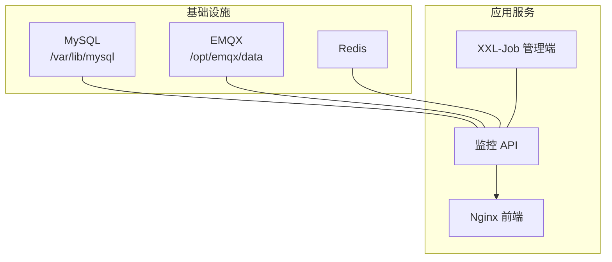
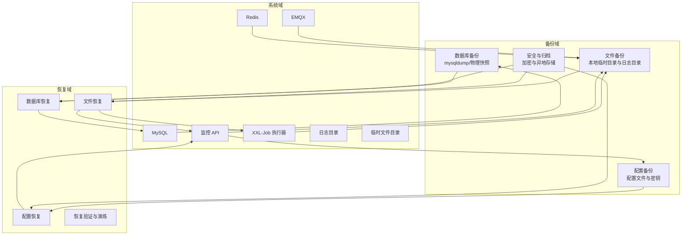
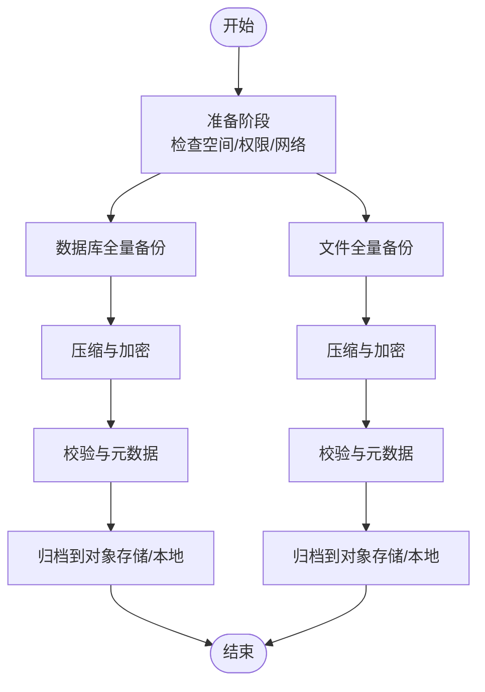
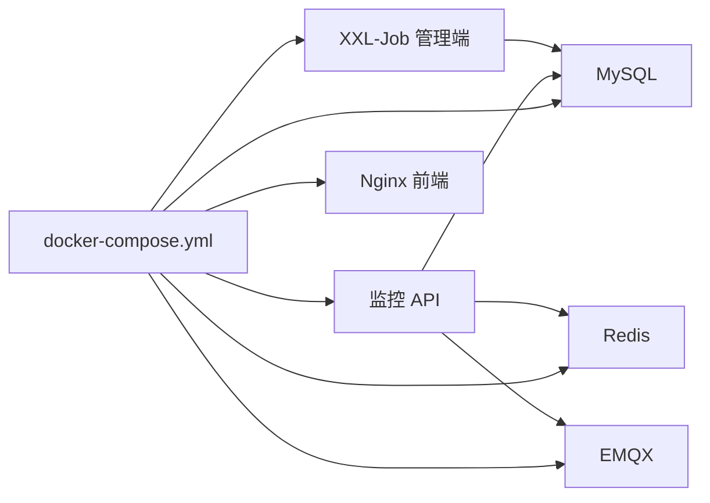
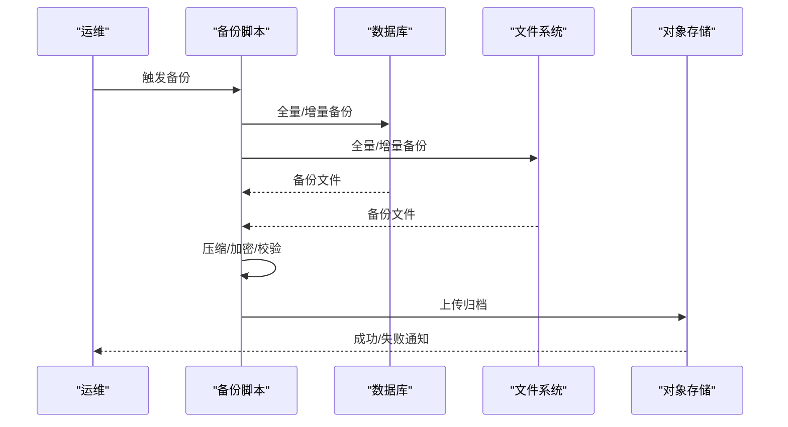

# 备份恢复

<cite>
**本文引用的文件**
- [docker-compose.yml](file://deploy/docker-compose.yml)
- [application-prod.yml](file://deploy/config/monitor-api/application-prod.yml)
- [application-prod.properties](file://deploy/config/xxl-job-admin/application-prod.properties)
- [init.sql](file://deploy/init/init.sql)
- [nginx.conf](file://deploy/config/frontend/nginx.conf)
- [application-prod.yml](file://monkey-monitor-api/src/main/resources/application-prod.yml)
- [UploadJob.java](file://monkey-monitor-api/src/main/java/com/monkey/general/job/UploadJob.java)
- [DownloadJob.java](file://monkey-monitor-api/src/main/java/com/monkey/general/job/DownloadJob.java)
- [OssController.java](file://monkey-monitor-api/src/main/java/com/monkey/general/controller/OssController.java)
- [CloudStorageService.java](file://monkey-service/src/main/java/com/monkey/general/modules/oss/cloud/CloudStorageService.java)
- [AliyunCloudStorageService.java](file://monkey-service/src/main/java/com/monkey/general/modules/oss/cloud/AliyunCloudStorageService.java)
- [QiniuCloudStorageService.java](file://monkey-service/src/main/java/com/monkey/general/modules/oss/cloud/QiniuCloudStorageService.java)
- [XxlJobExecutor.java](file://xxl-job-core/src/main/java/com/xxl/job/core/executor/XxlJobExecutor.java)
- [XxlDataBaseConfig.java](file://xxl-job-admin/src/main/java/com/xxl/job/admin/core/conf/XxlDataBaseConfig.java)
- [build-push.ps1](file://deploy/build-push.ps1)
</cite>

## 目录
1. [简介](#简介)
2. [项目结构](#项目结构)
3. [核心组件](#核心组件)
4. [架构总览](#架构总览)
5. [详细组件分析](#详细组件分析)
6. [依赖关系分析](#依赖关系分析)
7. [性能考量](#性能考量)
8. [故障排查指南](#故障排查指南)
9. [结论](#结论)
10. [附录](#附录)

## 简介
本文件面向安威 fireworks 物联网监控平台，提供一套完整的备份与恢复方案。内容涵盖数据库备份、文件备份、配置备份的实施方案与策略，明确备份频率与保留周期的制定原则，给出自动备份脚本的编写与配置思路，说明增量与全量备份的组合策略，强调备份数据的加密与安全存储，并提供灾难恢复计划、业务连续性保障、数据恢复流程与验证方法、备份恢复测试与演练指南、备份监控与告警机制以及最佳实践与注意事项。

## 项目结构
系统采用容器化编排，核心服务通过 docker-compose 统一管理，包含 MySQL、Redis、EMQX、XXL-Job 管理端与执行器、监控 API、前端 Nginx 等。数据持久化通过卷挂载实现，便于进行备份与恢复。

图表来源
- [docker-compose.yml:6-24](file://deploy/docker-compose.yml#L6-L24)
- [docker-compose.yml:56-87](file://deploy/docker-compose.yml#L56-L87)

章节来源
- [docker-compose.yml:1-103](file://deploy/docker-compose.yml#L1-L103)

## 核心组件
- 数据库层：MySQL（主业务库与 XXL-Job 调度库），通过 init.sql 初始化，支持定时任务与日志表。
- 存储与文件：本地临时文件目录用于数据打包与传输，云存储适配器支持阿里云、七牛等对象存储。
- 调度与作业：XXL-Job 管理端与执行器，负责定时数据同步、断网数据补传等任务。
- 配置与网络：各服务通过 application-prod.yml / .properties 提供数据库、MQTT、文件路径、日志路径等配置；Nginx 作为反向代理。

章节来源
- [application-prod.yml:4-26](file://deploy/config/monitor-api/application-prod.yml#L4-L26)
- [application-prod.properties:25-41](file://deploy/config/xxl-job-admin/application-prod.properties#L25-L41)
- [init.sql:1-27](file://deploy/init/init.sql#L1-L27)
- [nginx.conf:1-24](file://deploy/config/frontend/nginx.conf#L1-L24)

## 架构总览
下图展示备份与恢复在系统中的位置与交互：

图表来源
- [docker-compose.yml:14-16](file://deploy/docker-compose.yml#L14-L16)
- [docker-compose.yml:43-44](file://deploy/docker-compose.yml#L43-L44)
- [application-prod.yml:99-107](file://deploy/config/monitor-api/application-prod.yml#L99-L107)
- [application-prod.yml:132-134](file://deploy/config/monitor-api/application-prod.yml#L132-L134)

## 详细组件分析

### 数据库备份策略
- 备份范围
  - 主业务库：anwei_mon_fireworks_local
  - 调度库：xxl_job
- 备份方式
  - 全量备份：每日凌晨进行逻辑导出（mysqldump）或物理快照（LVM/存储层快照）
  - 增量备份：基于 binlog 的增量捕获，结合全量备份形成时间点恢复（RPO/RTO）
- 频率与保留
  - 全量：每日一次
  - 增量：每 5-15 分钟一次（视业务窗口与数据量）
  - 保留：全量保留 14 天，增量保留 7 天；超过保留期自动清理
- 安全与归档
  - 备份文件加密（建议使用 GPG 或存储侧加密）
  - 异地归档（本地+异地云存储/磁带库）
- 自动化
  - 使用 crontab 或调度器触发备份脚本，脚本内完成压缩、加密、校验与归档
  - 失败告警：通过邮件/IM 通知运维

章节来源
- [init.sql:1-7](file://deploy/init/init.sql#L1-L7)
- [application-prod.yml:4-8](file://deploy/config/monitor-api/application-prod.yml#L4-L8)
- [application-prod.properties:25-29](file://deploy/config/xxl-job-admin/application-prod.properties#L25-L29)

### 文件备份策略
- 备份范围
  - 临时数据目录：/app/data/tmp（生产）或 D:/data/local/tmp（开发）
  - 日志目录：/app/logs（监控 API）、/data/xxl-job/jobhandler（XXL-Job）
  - EMQX 数据目录：/opt/emqx/data
- 备份方式
  - 全量：按日全量打包
  - 增量：基于 rsync/inotify 的差异复制
- 频率与保留
  - 临时目录：按小时/天滚动，保留 7 天
  - 日志目录：保留 30 天（XXL-Job 默认），建议单独备份并延长保留期
  - EMQX：按周全量，保留 30 天
- 安全与归档
  - 压缩加密后归档至对象存储或专用备份服务器
- 自动化
  - 容器内定时任务或宿主机 crontab 触发
  - 校验完整性与可用性，失败告警

章节来源
- [application-prod.yml:99-107](file://deploy/config/monitor-api/application-prod.yml#L99-L107)
- [application-prod.yml](file://monkey-monitor-api/src/main/resources/application-prod.yml#L100)
- [docker-compose.yml:14-16](file://deploy/docker-compose.yml#L14-L16)
- [docker-compose.yml:43-44](file://deploy/docker-compose.yml#L43-L44)
- [application-prod.yml:132-134](file://deploy/config/monitor-api/application-prod.yml#L132-L134)

### 配置备份策略
- 备份范围
  - docker-compose.yml（含环境变量）
  - 各服务配置文件：application-prod.yml / .properties
  - Nginx 配置
  - 密钥与证书（如存在）
- 备份方式
  - 全量：版本化归档
  - 变更审计：Git/SVN 记录变更历史
- 频率与保留
  - 每次变更即刻备份，保留 90 天
- 安全与归档
  - 敏感信息脱敏或加密存储
  - 仅授权人员访问

章节来源
- [docker-compose.yml:1-103](file://deploy/docker-compose.yml#L1-L103)
- [application-prod.yml:1-203](file://deploy/config/monitor-api/application-prod.yml#L1-L203)
- [application-prod.properties:1-66](file://deploy/config/xxl-job-admin/application-prod.properties#L1-L66)
- [nginx.conf:1-24](file://deploy/config/frontend/nginx.conf#L1-L24)

### 自动备份脚本编写与配置
- 脚本设计要点
  - 参数化：数据库连接、输出目录、加密密钥、归档目标
  - 并行化：数据库与文件并行备份，减少总耗时
  - 校验：生成校验和（SHA256），记录元数据（版本、时间戳、大小）
  - 归档：按日期分桶，支持跨存储迁移
  - 告警：失败/超时/容量不足触发告警
- 示例流程（概念图）

[此图为概念流程，不直接对应具体源文件，故无图表来源]

### 增量备份与全量备份组合策略
- 组合模型
  - 全量：每周日凌晨一次
  - 增量：每 5 分钟一次（binlog/文件差异）
  - 恢复：先恢复最近一次全量，再按时间顺序应用增量
- 一致性
  - 数据库：使用一致性快照或事务一致性导出
  - 文件：锁定写入窗口或使用只读挂载进行快照
- RPO/RTO
  - RPO：分钟级（增量频率）
  - RTO：按恢复脚本与资源准备情况评估

[本节为通用策略说明，不直接分析具体源文件，故无章节来源]

### 备份数据的加密与安全存储
- 加密
  - 传输加密：TLS/HTTPS
  - 存储加密：GPG 对称加密或对象存储服务端加密
- 访问控制
  - 最小权限原则，仅授权人员可解密
  - 密钥分离与轮换
- 审计
  - 记录备份/恢复操作日志与责任人

[本节为通用安全实践，不直接分析具体源文件，故无章节来源]

### 灾难恢复计划与业务连续性
- DR 场景
  - 单点故障：容器重启/节点替换
  - 数据库故障：从最近备份恢复
  - 存储故障：从异地副本恢复
- RTO/RPO 目标
  - RTO：根据 SLA 设定（如 4 小时）
  - RPO：分钟级
- 连续性保障
  - 多活/热备：跨机房部署
  - 快速切换：自动化脚本与演练

[本节为通用方案说明，不直接分析具体源文件，故无章节来源]

### 数据恢复流程与验证
- 恢复流程
  - 评估：确认故障类型与影响面
  - 选择：选择最近可用的全量+增量组合
  - 执行：按数据库→文件→配置的顺序恢复
  - 验证：核对数据量、关键指标、接口连通性
- 验证方法
  - 数据抽样比对
  - 关键业务接口回归测试
  - 日志与告警收敛

[本节为通用流程说明，不直接分析具体源文件，故无章节来源]

### 备份恢复测试与演练指南
- 测试类型
  - 功能测试：验证备份可恢复
  - 性能测试：评估恢复速度
  - 演练：按真实场景模拟故障与恢复
- 频率
  - 至少每季度一次全量演练
  - 每月一次增量恢复演练
- 文档化
  - 记录演练过程、发现的问题与改进项

[本节为通用演练说明，不直接分析具体源文件，故无章节来源]

### 备份监控与告警机制
- 监控指标
  - 备份成功率、耗时、体积、延迟
  - 校验失败、加密失败、归档失败
- 告警渠道
  - 邮件/IM/电话
- 响应流程
  - 自动重试、人工介入、升级处理

[本节为通用监控说明，不直接分析具体源文件，故无章节来源]

## 依赖关系分析
- 数据流
  - 监控 API 生成临时数据与日志，XXL-Job 执行器负责定时任务与断网数据补传
  - 数据库与文件备份分别作用于 MySQL、日志与临时目录
- 依赖链
  - docker-compose 定义了服务间依赖与健康检查
  - XXL-Job 执行器依赖管理端与数据库
  - 监控 API 依赖数据库与消息中间件

图表来源
- [docker-compose.yml:6-24](file://deploy/docker-compose.yml#L6-L24)
- [docker-compose.yml:56-87](file://deploy/docker-compose.yml#L56-L87)

章节来源
- [docker-compose.yml:1-103](file://deploy/docker-compose.yml#L1-L103)
- [XxlJobExecutor.java:68-82](file://xxl-job-core/src/main/java/com/xxl/job/core/executor/XxlJobExecutor.java#L68-L82)

## 性能考量
- 备份窗口
  - 避开业务高峰期，利用夜间或低峰时段
- 并行与压缩
  - 多线程并行备份，合理设置压缩级别
- I/O 优化
  - 使用 SSD 或高速存储，避免与业务 IO 抢占
- 网络与带宽
  - 对象存储归档时控制并发与限速，避免影响业务

[本节为通用性能建议，不直接分析具体源文件，故无章节来源]

## 故障排查指南
- 常见问题
  - 备份失败：检查磁盘空间、网络连通、权限与密钥
  - 恢复异常：核对备份版本、时间戳与一致性
  - 恢复后业务异常：验证配置、索引与缓存重建
- 工具与命令
  - 数据库：mysqldump/mariadb-backup、mysqlcheck
  - 文件：tar/gzip、rsync、sha256sum
  - 日志：tail/less、grep、awk/sed
- 回滚与应急
  - 保留上一个稳定版本，快速回滚
  - 启用备用节点与流量切换

[本节为通用排障说明，不直接分析具体源文件，故无章节来源]

## 结论
通过全量与增量备份相结合、严格的频率与保留策略、完善的加密与安全存储、自动化脚本与监控告警，以及定期演练与验证，安威 fireworks 物联网监控平台可以实现高可靠的数据保护与快速恢复能力，确保业务连续性与合规要求。

## 附录

### 备份与恢复流程（序列图）

[此图为概念流程，不直接对应具体源文件，故无图表来源]

### 关键配置与路径参考
- 数据库连接与连接池
  - [application-prod.yml:4-12](file://deploy/config/monitor-api/application-prod.yml#L4-L12)
  - [application-prod.properties:25-41](file://deploy/config/xxl-job-admin/application-prod.properties#L25-L41)
- 文件与日志路径
  - [application-prod.yml:99-107](file://deploy/config/monitor-api/application-prod.yml#L99-L107)
  - [application-prod.yml](file://monkey-monitor-api/src/main/resources/application-prod.yml#L100)
  - [application-prod.yml:132-134](file://deploy/config/monitor-api/application-prod.yml#L132-L134)
- 云存储配置与上传
  - [OssController.java:63-95](file://monkey-monitor-api/src/main/java/com/monkey/general/controller/OssController.java#L63-L95)
  - [CloudStorageService.java:26-37](file://monkey-service/src/main/java/com/monkey/general/modules/oss/cloud/CloudStorageService.java#L26-L37)
  - [AliyunCloudStorageService.java:32-45](file://monkey-service/src/main/java/com/monkey/general/modules/oss/cloud/AliyunCloudStorageService.java#L32-L45)
  - [QiniuCloudStorageService.java:36-43](file://monkey-service/src/main/java/com/monkey/general/modules/oss/cloud/QiniuCloudStorageService.java#L36-L43)
- 作业与定时任务
  - [UploadJob.java:75-111](file://monkey-monitor-api/src/main/java/com/monkey/general/job/UploadJob.java#L75-L111)
  - [UploadJob.java:114-157](file://monkey-monitor-api/src/main/java/com/monkey/general/job/UploadJob.java#L114-L157)
  - [UploadJob.java:161-197](file://monkey-monitor-api/src/main/java/com/monkey/general/job/UploadJob.java#L161-L197)
  - [DownloadJob.java:24-30](file://monkey-monitor-api/src/main/java/com/monkey/general/job/DownloadJob.java#L24-L30)
  - [XxlJobExecutor.java:68-82](file://xxl-job-core/src/main/java/com/xxl/job/core/executor/XxlJobExecutor.java#L68-L82)
- 初始化与数据库结构
  - [init.sql:1-27](file://deploy/init/init.sql#L1-L27)
  - [init.sql:120-143](file://deploy/init/init.sql#L120-L143)
- 前端与反向代理
  - [nginx.conf:13-22](file://deploy/config/frontend/nginx.conf#L13-L22)
- 镜像构建与发布
  - [build-push.ps1:223-236](file://deploy/build-push.ps1#L223-L236)