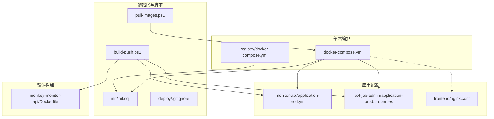
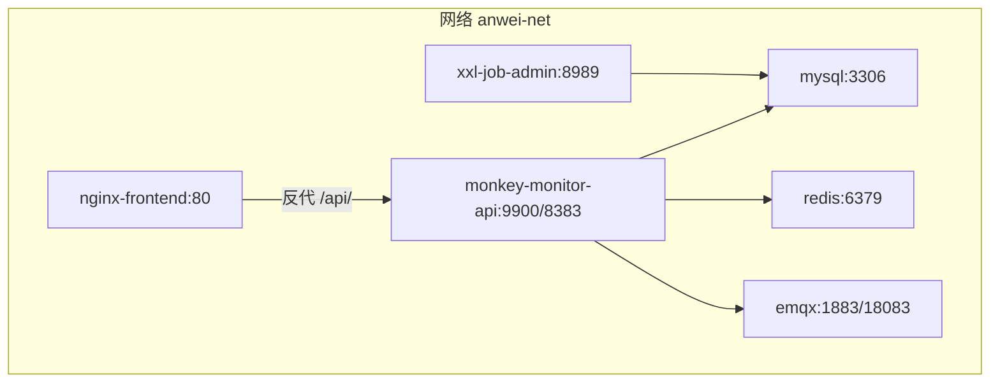
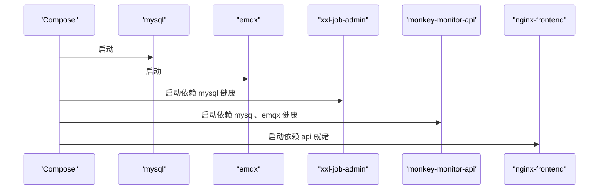
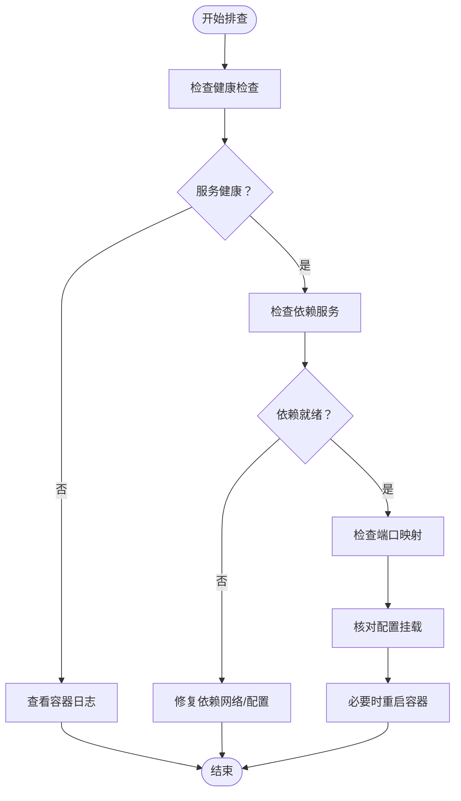

# 容器化部署

<cite>
**本文引用的文件**
- [docker-compose.yml](file://deploy/docker-compose.yml)
- [docker-compose.yml（本地镜像仓库）](file://deploy/registry/docker-compose.yml)
- [构建与推送脚本](file://deploy/build-push.ps1)
- [拉取镜像脚本](file://deploy/pull-images.ps1)
- [监控API生产配置](file://deploy/config/monitor-api/application-prod.yml)
- [XXL-Job生产配置](file://deploy/config/xxl-job-admin/application-prod.properties)
- [前端Nginx配置](file://deploy/config/frontend/nginx.conf)
- [MySQL初始化SQL](file://deploy/init/init.sql)
- [监控API Dockerfile](file://monkey-monitor-api/Dockerfile)
- [.gitignore（部署忽略项）](file://deploy/.gitignore)
</cite>

## 目录
1. [简介](#简介)
2. [项目结构](#项目结构)
3. [核心组件](#核心组件)
4. [架构总览](#架构总览)
5. [组件详解](#组件详解)
6. [依赖关系分析](#依赖关系分析)
7. [性能与资源规划](#性能与资源规划)
8. [故障排查与恢复](#故障排查与恢复)
9. [安全与权限配置](#安全与权限配置)
10. [结论](#结论)
11. [附录](#附录)

## 简介
本文件面向安威 fireworks 物联网监控平台的容器化部署，基于 Docker Compose 编排，覆盖 MySQL、Redis、EMQX、XXL-Job、监控 API 与前端服务的完整链路。内容包括：
- 编排配置要点：环境变量、数据卷、网络、健康检查
- 镜像构建与推送自动化脚本使用指南
- 容器间服务发现与通信机制
- 生产部署最佳实践：资源限制、重启策略、日志管理
- 故障排查与恢复流程
- 安全与权限建议

## 项目结构
部署相关的核心文件集中在 deploy 目录，包含编排、配置、初始化脚本与本地镜像仓库服务。

图表来源
- [docker-compose.yml:1-103](file://deploy/docker-compose.yml#L1-L103)
- [docker-compose.yml（本地镜像仓库）:1-14](file://deploy/registry/docker-compose.yml#L1-L14)
- [监控API生产配置:1-203](file://deploy/config/monitor-api/application-prod.yml#L1-L203)
- [XXL-Job生产配置:1-66](file://deploy/config/xxl-job-admin/application-prod.properties#L1-L66)
- [前端Nginx配置:1-24](file://deploy/config/frontend/nginx.conf#L1-L24)
- [MySQL初始化SQL:1-219](file://deploy/init/init.sql#L1-L219)
- [构建与推送脚本:1-263](file://deploy/build-push.ps1#L1-L263)
- [拉取镜像脚本:1-56](file://deploy/pull-images.ps1#L1-L56)
- [监控API Dockerfile:1-6](file://monkey-monitor-api/Dockerfile#L1-L6)
- [.gitignore（部署忽略项）:1-8](file://deploy/.gitignore#L1-L8)

章节来源
- [docker-compose.yml:1-103](file://deploy/docker-compose.yml#L1-L103)
- [docker-compose.yml（本地镜像仓库）:1-14](file://deploy/registry/docker-compose.yml#L1-L14)
- [构建与推送脚本:1-263](file://deploy/build-push.ps1#L1-L263)
- [拉取镜像脚本:1-56](file://deploy/pull-images.ps1#L1-L56)
- [监控API生产配置:1-203](file://deploy/config/monitor-api/application-prod.yml#L1-L203)
- [XXL-Job生产配置:1-66](file://deploy/config/xxl-job-admin/application-prod.properties#L1-L66)
- [前端Nginx配置:1-24](file://deploy/config/frontend/nginx.conf#L1-L24)
- [MySQL初始化SQL:1-219](file://deploy/init/init.sql#L1-L219)
- [监控API Dockerfile:1-6](file://monkey-monitor-api/Dockerfile#L1-L6)
- [.gitignore（部署忽略项）:1-8](file://deploy/.gitignore#L1-L8)

## 核心组件
- 基础设施层：MySQL、Redis、EMQX
- 应用层：XXL-Job 管理端、监控 API、前端 Nginx
- 网络：统一桥接网络 anwei-net
- 存储：持久化卷 data 与 logs

章节来源
- [docker-compose.yml:6-102](file://deploy/docker-compose.yml#L6-L102)
- [监控API生产配置:4-48](file://deploy/config/monitor-api/application-prod.yml#L4-L48)
- [XXL-Job生产配置:25-41](file://deploy/config/xxl-job-admin/application-prod.properties#L25-L41)
- [前端Nginx配置:1-24](file://deploy/config/frontend/nginx.conf#L1-L24)

## 架构总览
容器编排采用单主机多服务模式，所有服务位于同一 Docker 网络，通过服务名进行内部通信。前端 Nginx 作为入口反向代理，转发 /api/ 到监控 API；监控 API 通过服务名访问 MySQL、Redis、EMQX。

图表来源
- [docker-compose.yml:6-98](file://deploy/docker-compose.yml#L6-L98)
- [前端Nginx配置:13-22](file://deploy/config/frontend/nginx.conf#L13-L22)
- [监控API生产配置:4-48](file://deploy/config/monitor-api/application-prod.yml#L4-L48)
- [XXL-Job生产配置:25-29](file://deploy/config/xxl-job-admin/application-prod.properties#L25-L29)

## 组件详解

### MySQL（基础设施）
- 镜像与版本：${ACR_INFRA}/mysql:8.0
- 健康检查：mysqladmin ping
- 环境变量：root 密码、数据库名、时区
- 数据卷：/var/lib/mysql、初始化脚本挂载
- 网络：anwei-net

章节来源
- [docker-compose.yml:6-24](file://deploy/docker-compose.yml#L6-L24)
- [MySQL初始化SQL:1-7](file://deploy/init/init.sql#L1-L7)

### Redis（基础设施）
- 镜像与版本：${ACR_INFRA}/redis:7-alpine
- 网络：anwei-net
- 用途：监控 API 缓存开关默认关闭，可按需开启

章节来源
- [docker-compose.yml:26-31](file://deploy/docker-compose.yml#L26-L31)
- [监控API生产配置:14-26](file://deploy/config/monitor-api/application-prod.yml#L14-L26)

### EMQX（基础设施）
- 镜像与版本：${ACR_INFRA}/emqx:5
- 端口映射：1883（MQTT）、18083（Web 控制台）
- 环境变量：仪表盘默认账号密码
- 健康检查：emqx ping
- 数据卷：EMQX 数据目录
- 网络：anwei-net

章节来源
- [docker-compose.yml:33-52](file://deploy/docker-compose.yml#L33-L52)

### XXL-Job 管理端
- 镜像与版本：${ACR_REGISTRY}/xxl-job-admin:${XXL_JOB_VERSION}
- 端口映射：8989
- 配置挂载：application-prod.properties
- 日志与执行器工作目录挂载：/data/xxl-job/jobhandler
- 依赖：MySQL 健康
- 网络：anwei-net

章节来源
- [docker-compose.yml:56-69](file://deploy/docker-compose.yml#L56-L69)
- [XXL-Job生产配置:25-41](file://deploy/config/xxl-job-admin/application-prod.properties#L25-L41)

### 监控 API
- 镜像与版本：${ACR_REGISTRY}/monkey-monitor-api:${MONITOR_API_VERSION}
- 端口映射：9900（HTTP）、8383（JT808）
- 配置挂载：application-prod.yml
- 日志挂载：/app/logs
- 依赖：MySQL 健康、EMQX 健康
- 网络：anwei-net

章节来源
- [docker-compose.yml:71-87](file://deploy/docker-compose.yml#L71-L87)
- [监控API生产配置:4-48](file://deploy/config/monitor-api/application-prod.yml#L4-L48)

### 前端 Nginx
- 镜像与版本：${ACR_REGISTRY}/nginx-frontend:${FRONTEND_VERSION}
- 端口映射：80
- 依赖：监控 API 就绪
- 网络：anwei-net
- 反向代理：/api/ -> http://monkey-monitor-api:9900

章节来源
- [docker-compose.yml:89-98](file://deploy/docker-compose.yml#L89-L98)
- [前端Nginx配置:13-22](file://deploy/config/frontend/nginx.conf#L13-L22)

### 本地镜像仓库（可选）
- 镜像：registry:2
- 端口：5000
- 存储：./data
- 用途：离线或内网环境下的镜像私有仓库

章节来源
- [docker-compose.yml（本地镜像仓库）:1-14](file://deploy/registry/docker-compose.yml#L1-L14)

## 依赖关系分析
- 服务启动顺序：MySQL -> EMQX -> XXL-Job -> 监控 API -> 前端 Nginx
- 健康检查：MySQL、EMQX 使用内置健康检查命令
- 服务发现：容器间通过服务名访问（如 mysql、redis、emqx、xxl-job-admin、monkey-monitor-api）

图表来源
- [docker-compose.yml:65-96](file://deploy/docker-compose.yml#L65-L96)

章节来源
- [docker-compose.yml:65-96](file://deploy/docker-compose.yml#L65-L96)

## 性能与资源规划
- 连接池与超时
  - MySQL 连接池：最小空闲、最大连接数等参数在监控 API 配置中定义
  - Redis 连接池：最大活跃、最大等待、空闲等参数在监控 API 配置中定义
  - MQTT 超时与保活：在监控 API 配置中定义
- 端口暴露
  - 监控 API 暴露 9900（HTTP）与 8383（JT808）
  - 前端 Nginx 暴露 80
  - EMQX 暴露 1883（MQTT）与 18083（Web 控制台）
- 建议
  - 在生产环境为各容器设置 CPU/内存限制，避免资源争抢
  - 为 MySQL、Redis、EMQX 预留足够 IO 与磁盘空间
  - 对外暴露端口仅开放必要范围，结合防火墙策略

章节来源
- [监控API生产配置:10-26](file://deploy/config/monitor-api/application-prod.yml#L10-L26)
- [监控API生产配置:30-48](file://deploy/config/monitor-api/application-prod.yml#L30-L48)
- [docker-compose.yml:75-94](file://deploy/docker-compose.yml#L75-L94)

## 故障排查与恢复
- 健康检查失败
  - MySQL/EMQX 健康检查失败时，查看容器日志与初始化脚本是否正确挂载
- 服务依赖未就绪
  - XXL-Job 与监控 API 依赖 MySQL/EMQX 健康，确认健康检查通过后再启动
- 端口冲突
  - 若宿主机端口被占用，修改 docker-compose.yml 中的端口映射
- 日志定位
  - 监控 API 日志挂载至 /app/logs，XXL-Job 日志挂载至 /data/xxl-job/jobhandler
- 初始化数据
  - MySQL 初始化脚本会创建业务库与调度库，确保初始化 SQL 已正确挂载

章节来源
- [docker-compose.yml:17-22](file://deploy/docker-compose.yml#L17-L22)
- [docker-compose.yml:45-50](file://deploy/docker-compose.yml#L45-L50)
- [docker-compose.yml:65-85](file://deploy/docker-compose.yml#L65-L85)
- [监控API生产配置:78-80](file://deploy/config/monitor-api/application-prod.yml#L78-L80)
- [XXL-Job生产配置:64-65](file://deploy/config/xxl-job-admin/application-prod.properties#L64-L65)
- [MySQL初始化SQL:1-7](file://deploy/init/init.sql#L1-L7)

## 安全与权限配置
- 认证与授权
  - EMQX 仪表盘默认账号密码通过环境变量注入
  - XXL-Job 通过 accessToken 进行通讯校验
  - 监控 API 与数据库、MQTT 的认证信息在各自配置中定义
- 网络隔离
  - 所有服务位于 anwei-net 桥接网络，减少跨网段暴露
- 镜像与仓库
  - 使用 Harbor 私有仓库，登录凭据在脚本中硬编码（建议改用 secrets 或 CI 凭据）
- 最小权限
  - 建议为容器设置只读文件系统、drop capabilites、非 root 用户运行（视生产策略而定）

章节来源
- [docker-compose.yml:37-39](file://deploy/docker-compose.yml#L37-L39)
- [XXL-Job生产配置:54-55](file://deploy/config/xxl-job-admin/application-prod.properties#L54-L55)
- [监控API生产配置:34-46](file://deploy/config/monitor-api/application-prod.yml#L34-L46)

## 结论
本部署方案以 Docker Compose 实现安威 fireworks 平台的快速编排，涵盖数据库、消息中间件、任务调度、业务 API 与前端入口。通过健康检查、依赖声明与配置挂载，实现稳定的服务发现与通信。建议在生产环境中补充资源限制、日志集中、密钥管理与网络隔离策略，以满足高可用与合规要求。

## 附录

### 环境变量与配置要点
- 基础设施
  - MYSQL_ROOT_PASSWORD：MySQL root 密码
  - EMQX_DASHBOARD_USERNAME/EMQX_DASHBOARD_PASSWORD：EMQX 仪表盘账号密码
- 应用镜像版本
  - MONITOR_API_VERSION、XXL_JOB_VERSION、FRONTEND_VERSION
  - ACR_REGISTRY/ACR_INFRA：镜像仓库与基础设施镜像前缀
- 监控 API
  - 数据库、Redis、EMQX 服务名与端口
  - XXL-Job 执行器配置（appname、address、logpath、logretentiondays 等）
- 前端 Nginx
  - 反向代理 /api/ 到监控 API

章节来源
- [docker-compose.yml:10-13](file://deploy/docker-compose.yml#L10-L13)
- [docker-compose.yml:37-39](file://deploy/docker-compose.yml#L37-L39)
- [监控API生产配置:4-48](file://deploy/config/monitor-api/application-prod.yml#L4-L48)
- [监控API生产配置:116-134](file://deploy/config/monitor-api/application-prod.yml#L116-L134)
- [前端Nginx配置:13-22](file://deploy/config/frontend/nginx.conf#L13-L22)

### 镜像构建与推送（自动化脚本）
- 支持目标：全部构建、仅后端、仅前端、仅监控 API、仅 XXL-Job
- 自动检测 JDK、拉取基础镜像、构建并推送至 Harbor
- 前端构建：使用指定前端项目目录，构建后推送 nginx-frontend 镜像
- 后端构建：分别构建并推送 monkey-monitor-api 与 xxl-job-admin 镜像
- 登录 Harbor：脚本内硬编码凭据，建议在 CI 环境替换为安全凭据

章节来源
- [构建与推送脚本:1-263](file://deploy/build-push.ps1#L1-L263)

### 镜像拉取（离线/内网）
- 拉取基础设施镜像：mysql、redis、emqx、nginx、openjdk
- 拉取应用镜像：monkey-monitor-api、xxl-job-admin、nginx-frontend
- 登录 Harbor：脚本内硬编码凭据，建议在 CI 环境替换为安全凭据

章节来源
- [拉取镜像脚本:1-56](file://deploy/pull-images.ps1#L1-L56)

### 数据卷与持久化
- MySQL：/var/lib/mysql
- EMQX：/opt/emqx/data
- XXL-Job：/data/xxl-job/jobhandler
- 监控 API：/app/logs
- 初始化 SQL：/docker-entrypoint-initdb.d/init.sql

章节来源
- [docker-compose.yml:14-16](file://deploy/docker-compose.yml#L14-L16)
- [docker-compose.yml:43-44](file://deploy/docker-compose.yml#L43-L44)
- [docker-compose.yml:62-64](file://deploy/docker-compose.yml#L62-L64)
- [docker-compose.yml:78-80](file://deploy/docker-compose.yml#L78-L80)
- [MySQL初始化SQL:1-7](file://deploy/init/init.sql#L1-L7)

### 网络与服务发现
- 网络：anwei-net（bridge）
- 服务名即主机名：mysql、redis、emqx、xxl-job-admin、monkey-monitor-api
- 前端通过服务名访问监控 API

章节来源
- [docker-compose.yml:100-102](file://deploy/docker-compose.yml#L100-L102)
- [docker-compose.yml:95-96](file://deploy/docker-compose.yml#L95-L96)
- [前端Nginx配置:14-14](file://deploy/config/frontend/nginx.conf#L14-L14)

### 监控 API Dockerfile
- 基于 openjdk:8-jre-slim
- 暴露端口：9000、8383（注：实际运行映射为 9900、8383）

章节来源
- [监控API Dockerfile:1-6](file://monkey-monitor-api/Dockerfile#L1-L6)

### 部署忽略项
- 运行时敏感配置与持久化数据目录不提交到 Git

章节来源
- [.gitignore（部署忽略项）:1-8](file://deploy/.gitignore#L1-L8)