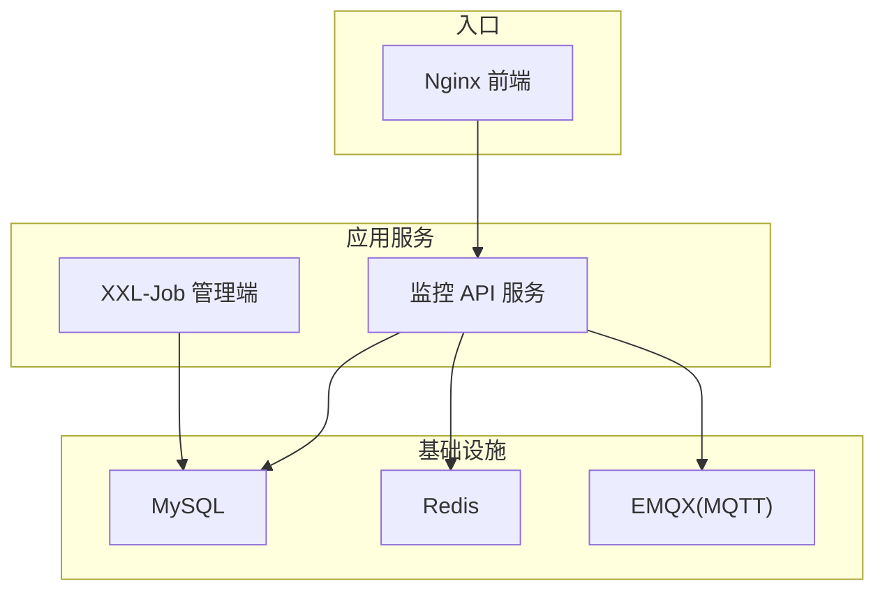
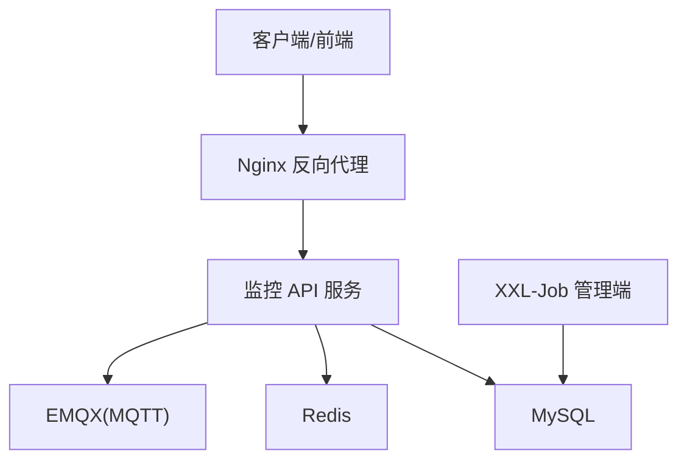
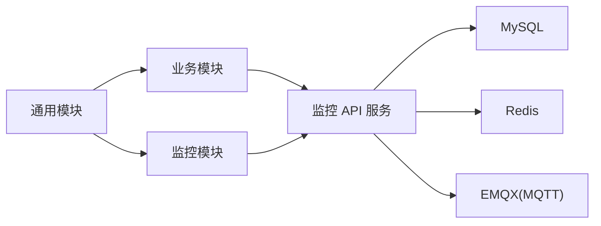

# 性能调优

<cite>
**本文引用的文件**
- [docker-compose.yml](file://deploy/docker-compose.yml)
- [application-prod.yml（监控 API）](file://deploy/config/monitor-api/application-prod.yml)
- [application-prod.yml（XXL-Job 管理端）](file://deploy/config/xxl-job-admin/application-prod.properties)
- [nginx.conf（前端）](file://deploy/config/frontend/nginx.conf)
- [Dockerfile（监控 API）](file://monkey-monitor-api/Dockerfile)
- [RedisConfig.java（通用模块）](file://monkey-service/src/main/java/com/monkey/general/config/RedisConfig.java)
- [RedisUtils.java（通用模块）](file://monkey-service/src/main/java/com/monkey/general/common/utils/RedisUtils.java)
- [RedisConstant.java（通用模块）](file://monkey-common/src/main/java/com/monkey/general/common/constant/RedisConstant.java)
- [RedisKeys.java（通用模块）](file://monkey-common/src/main/java/com/monkey/general/common/utils/RedisKeys.java)
- [SysConfigRedis.java（通用模块）](file://monkey-service/src/main/java/com/monkey/general/modules/sys/redis/SysConfigRedis.java)
- [logback-spring.xml（监控 API）](file://monkey-monitor-api/src/main/resources/logback-spring.xml)
- [MqttConfiguration.java（监控模块）](file://monkey-monitor/src/main/java/com/monkey/general/config/MqttConfiguration.java)
- [MyMqttConfiguration.java（监控模块）](file://monkey-monitor/src/main/java/com/monkey/general/config/mqtt/MyMqttConfiguration.java)
- [MQTTClient.java（监控模块）](file://monkey-monitor/src/main/java/com/monkey/general/config/mqtt/MQTTClient.java)
- [MyDataSourceAutoConfiguration.java（监控模块）](file://monkey-monitor/src/main/java/com/monkey/general/config/MyDataSourceAutoConfiguration.java)
- [pom.xml（父工程）](file://pom.xml)
</cite>

## 目录
1. [简介](#简介)
2. [项目结构](#项目结构)
3. [核心组件](#核心组件)
4. [架构总览](#架构总览)
5. [详细组件分析](#详细组件分析)
6. [依赖分析](#依赖分析)
7. [性能考虑](#性能考虑)
8. [故障排查指南](#故障排查指南)
9. [结论](#结论)
10. [附录](#附录)

## 简介
本文件面向安威 fireworks 物联网监控平台，提供系统级性能调优方案与实操建议，覆盖 JVM 参数与 GC 优化、数据库连接池与查询优化、网络与反向代理、缓存策略（Redis）、容器资源与扩缩容、性能基准与压测方法、瓶颈识别与高并发优化策略，以及监控与分析工具使用指南。内容基于仓库现有配置与代码实现进行提炼，并给出可落地的优化方向。

## 项目结构
系统采用多模块 Maven 架构，核心服务通过 Docker 编排在统一网络中运行，包含：
- 监控 API 服务：对外提供 REST 接口，承载业务逻辑与数据聚合
- XXL-Job 管理端：任务调度与日志管理
- MySQL：持久化存储
- Redis：缓存与会话等
- EMQX：MQTT 消息接入
- Nginx：前端静态资源与后端反向代理

图表来源
- [docker-compose.yml:1-103](file://deploy/docker-compose.yml#L1-L103)
- [application-prod.yml（监控 API）:1-203](file://deploy/config/monitor-api/application-prod.yml#L1-L203)
- [application-prod.yml（XXL-Job 管理端）:1-66](file://deploy/config/xxl-job-admin/application-prod.properties#L1-L66)
- [nginx.conf（前端）:1-24](file://deploy/config/frontend/nginx.conf#L1-L24)

章节来源
- [docker-compose.yml:1-103](file://deploy/docker-compose.yml#L1-L103)
- [application-prod.yml（监控 API）:1-203](file://deploy/config/monitor-api/application-prod.yml#L1-L203)
- [application-prod.yml（XXL-Job 管理端）:1-66](file://deploy/config/xxl-job-admin/application-prod.properties#L1-L66)
- [nginx.conf（前端）:1-24](file://deploy/config/frontend/nginx.conf#L1-L24)

## 核心组件
- 监控 API 服务：提供设备、告警、数据同步等接口，使用 HikariCP 连接池、Redis 缓存、MQTT 接入
- XXL-Job 管理端：任务调度与日志管理，使用 HikariCP 连接池
- Nginx：反向代理与静态资源
- Redis：键空间与序列化策略由通用模块配置
- 日志：生产环境日志级别与落盘策略

章节来源
- [application-prod.yml（监控 API）:1-203](file://deploy/config/monitor-api/application-prod.yml#L1-L203)
- [application-prod.yml（XXL-Job 管理端）:1-66](file://deploy/config/xxl-job-admin/application-prod.properties#L1-L66)
- [logback-spring.xml（监控 API）:1-152](file://monkey-monitor-api/src/main/resources/logback-spring.xml#L1-L152)
- [RedisConfig.java（通用模块）:1-57](file://monkey-service/src/main/java/com/monkey/general/config/RedisConfig.java#L1-L57)

## 架构总览
系统以容器编排为核心，服务间通过内部网络通信，API 层由 Nginx 提供统一入口，后端服务通过配置文件与环境变量进行连接与行为控制。

图表来源
- [docker-compose.yml:1-103](file://deploy/docker-compose.yml#L1-L103)
- [nginx.conf（前端）:1-24](file://deploy/config/frontend/nginx.conf#L1-L24)
- [application-prod.yml（监控 API）:1-203](file://deploy/config/monitor-api/application-prod.yml#L1-L203)

## 详细组件分析

### JVM 参数与 GC 调优
- 运行时镜像：监控 API 使用 openjdk:8-jre-slim，端口暴露 9000/8383（实际运行端口以配置为准）
- 建议
  - 明确容器内存限制，避免 OOM
  - 针对 Java 8，优先选择 G1GC，结合目标停顿时间与堆大小评估
  - 设置新生代比例与并行 GC 线程，平衡吞吐与延迟
  - 启用逃逸分析与指针压缩（如可用），降低 GC 压力
  - 结合容器 CPU 限额与 GC 线程数匹配，避免过度竞争
- 注意
  - 当前镜像未显式传入 JVM 参数，建议在启动命令中追加 JVM 选项，或通过环境变量注入

章节来源
- [Dockerfile（监控 API）:1-6](file://monkey-monitor-api/Dockerfile#L1-L6)

### 数据库连接池与查询优化
- 连接池
  - 监控 API 与 XXL-Job 管理端均使用 HikariCP，连接池大小与超时参数直接影响并发与稳定性
  - 建议按峰值并发与慢查询占比评估最大连接数，合理设置空闲连接与生命周期
- 查询优化
  - 建立必要的索引，避免全表扫描；对高频条件列、关联列、排序列建立复合索引
  - 分页查询使用覆盖索引，避免 SELECT *
  - 将复杂统计拆分为异步任务（XXL-Job）或缓存热点结果
- 连接池配置要点
  - 最小空闲连接：维持活跃连接，降低突发请求抖动
  - 最大连接数：与数据库最大连接数、实例规格匹配
  - 连接超时与空闲超时：避免长时间占用连接导致饥饿

章节来源
- [application-prod.yml（监控 API）:4-12](file://deploy/config/monitor-api/application-prod.yml#L4-L12)
- [application-prod.yml（XXL-Job 管理端）:31-41](file://deploy/config/xxl-job-admin/application-prod.properties#L31-L41)
- [MyDataSourceAutoConfiguration.java（监控模块）:34-50](file://monkey-monitor/src/main/java/com/monkey/general/config/MyDataSourceAutoConfiguration.java#L34-L50)

### 网络与反向代理配置
- Nginx
  - 反向代理到监控 API 服务，设置连接/读/写超时，避免上游阻塞影响整体响应
  - 建议开启 gzip/缓存静态资源，减少后端压力
- 负载均衡
  - 多副本部署时，建议使用 Nginx 或 Ingress 进行轮询/加权轮询
  - 配置健康检查与熔断，避免故障扩散
- TCP 参数
  - 在宿主机层面适度调大文件句柄、TIME_WAIT 复用与队列长度，提升并发连接能力

章节来源
- [nginx.conf（前端）:1-24](file://deploy/config/frontend/nginx.conf#L1-L24)
- [docker-compose.yml:89-98](file://deploy/docker-compose.yml#L89-L98)

### 缓存策略与命中率提升
- Redis 配置
  - 通用模块提供 RedisTemplate 与多种操作封装，键序列化采用字符串策略
  - 建议为热点数据设置合理过期时间，避免内存膨胀
- 键空间设计
  - 使用统一前缀与命名规范，便于清理与统计
  - 对系统配置等高频读写对象，采用短 TTL 并配合后台刷新
- 命中率优化
  - 对热点列表/集合使用有序集合或位图，减少频繁读写
  - 引入本地缓存（如 Caffeine）降低热路径远程访问

章节来源
- [RedisConfig.java（通用模块）:1-57](file://monkey-service/src/main/java/com/monkey/general/config/RedisConfig.java#L1-L57)
- [RedisUtils.java（通用模块）:1-44](file://monkey-service/src/main/java/com/monkey/general/common/utils/RedisUtils.java#L1-L44)
- [RedisConstant.java（通用模块）:1-34](file://monkey-common/src/main/java/com/monkey/general/common/constant/RedisConstant.java#L1-L34)
- [RedisKeys.java（通用模块）:1-13](file://monkey-common/src/main/java/com/monkey/general/common/utils/RedisKeys.java#L1-L13)
- [SysConfigRedis.java（通用模块）:1-37](file://monkey-service/src/main/java/com/monkey/general/modules/sys/redis/SysConfigRedis.java#L1-L37)

### MQTT 接入与消息处理
- 连接配置
  - 本地与传感器两类 MQTT 客户端分别配置，支持自动重连与超时
  - 建议为不同主题设置独立订阅与处理线程，避免阻塞
- 性能建议
  - 控制 QoS 与留存策略，减少无效消息堆积
  - 对高频主题采用批量/合并策略，降低处理开销

章节来源
- [MqttConfiguration.java（监控模块）:1-40](file://monkey-monitor/src/main/java/com/monkey/general/config/MqttConfiguration.java#L1-L40)
- [MyMqttConfiguration.java（监控模块）:1-57](file://monkey-monitor/src/main/java/com/monkey/general/config/mqtt/MyMqttConfiguration.java#L1-L57)
- [MQTTClient.java（监控模块）:41-83](file://monkey-monitor/src/main/java/com/monkey/general/config/mqtt/MQTTClient.java#L41-L83)
- [application-prod.yml（监控 API）:30-48](file://deploy/config/monitor-api/application-prod.yml#L30-L48)

### 日志与可观测性
- 日志级别
  - 生产环境默认 INFO，必要时临时提升到 DEBUG 定位问题
- 日志落盘
  - 按日期滚动，避免单文件过大；结合磁盘配额与清理策略
- 建议
  - 引入结构化日志与 Trace ID，串联请求链路
  - 集成 APM/监控面板，关注慢请求、异常比率与 GC 指标

章节来源
- [logback-spring.xml（监控 API）:1-152](file://monkey-monitor-api/src/main/resources/logback-spring.xml#L1-L152)

### 容器资源限制与扩缩容
- 资源限制
  - 为 MySQL、Redis、EMQX、监控 API、XXL-Job 管理端设置合理的 CPU/内存限额，避免资源争抢
- 扩缩容策略
  - 监控 API 采用水平扩展，结合 Nginx 负载均衡
  - 任务型工作交由 XXL-Job 执行器集群处理，按任务类型拆分执行器

章节来源
- [docker-compose.yml:1-103](file://deploy/docker-compose.yml#L1-L103)

## 依赖分析
- 模块依赖
  - 通用模块提供 Redis 工具与常量，被业务模块复用
  - 监控模块提供 MQTT 客户端与数据源自动装配
- 外部依赖
  - Spring Boot 2.1.x、MyBatis Plus、HikariCP、Netty、MQTT 客户端等

图表来源
- [pom.xml（父工程）:1-221](file://pom.xml#L1-L221)
- [RedisConfig.java（通用模块）:1-57](file://monkey-service/src/main/java/com/monkey/general/config/RedisConfig.java#L1-L57)
- [MyDataSourceAutoConfiguration.java（监控模块）:34-50](file://monkey-monitor/src/main/java/com/monkey/general/config/MyDataSourceAutoConfiguration.java#L34-L50)

章节来源
- [pom.xml（父工程）:1-221](file://pom.xml#L1-L221)

## 性能考虑
- 堆内存与 GC
  - 明确容器内存上限，避免 GC 抖动与 OOM
  - 优先 G1GC，结合停顿目标与老年代占比调参
- 数据库
  - 连接池大小与超时参数与数据库规格匹配；慢 SQL 与锁冲突优先通过索引与事务优化解决
- 缓存
  - 热点数据短 TTL + 后台刷新；键空间统一前缀；序列化策略与压缩
- 网络
  - Nginx 超时与缓冲合理配置；必要时启用压缩与静态资源缓存
- 并发
  - 任务型工作交由 XXL-Job；MQTT 主题解耦；异步化 IO 密集型流程

## 故障排查指南
- 连接池耗尽
  - 观察最大连接数与活跃连接趋势，核对慢查询与锁等待
- MQTT 阻塞
  - 检查订阅主题与回调处理是否阻塞；适当拆分主题与线程池
- Redis 命中率低
  - 核对键空间命名与过期策略；热点数据是否频繁失效
- 日志风暴
  - 临时降级日志级别，定位高频日志来源

## 结论
本方案从 JVM/GC、数据库、网络、缓存、容器与可观测性六个维度提出系统性优化建议。建议先完成资源限制与连接池参数校准，再逐步引入缓存与异步化改造，最后通过压测与监控持续迭代。

## 附录

### 性能基准与压力测试方法
- 基准测试
  - 使用 JMeter/LoadRunner/Artillery 对关键接口进行稳定态吞吐与延迟测量
- 压力测试
  - 逐步提升并发与数据量，观察 P95/P99 延迟、错误率与 GC 行为
- 场景设计
  - 设备上报峰值、告警查询高峰、报表导出等典型场景

### 高并发优化策略
- 读多写少：热点数据缓存 + 后台刷新；写多读少：异步写入 + 增量索引
- IO 密集：MQTT/HTTP 异步化；CPU 密集：拆分微服务或引入任务队列
- 存储：冷热分离、分区与归档；索引：覆盖索引与复合索引

### 监控与分析工具使用
- 容器层：Prometheus + Grafana，采集 CPU/内存/网络/IO
- 应用层：Micrometer + Spring Boot Actuator，暴露 JVM/业务指标
- 日志：ELK/EFK，结构化日志与链路追踪
- 数据库：慢查询日志与 EXPLAIN 分析